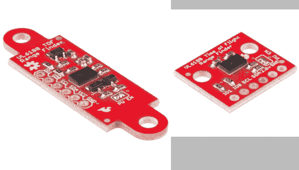
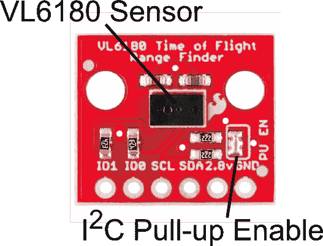
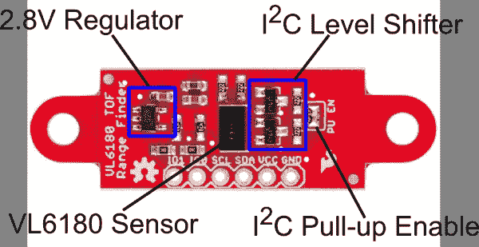
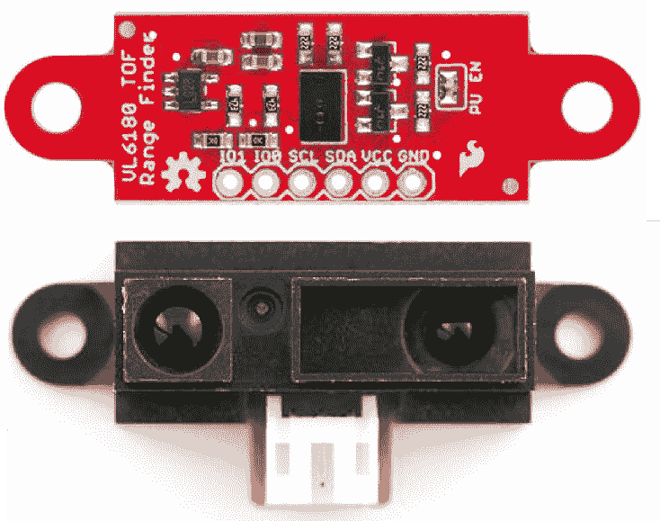
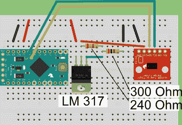
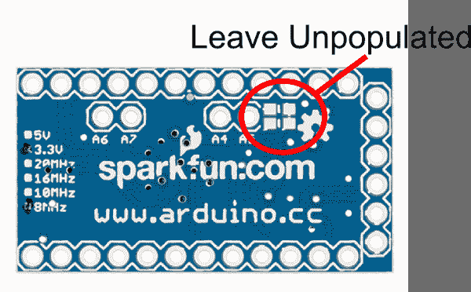
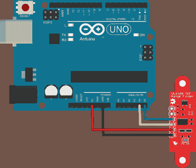
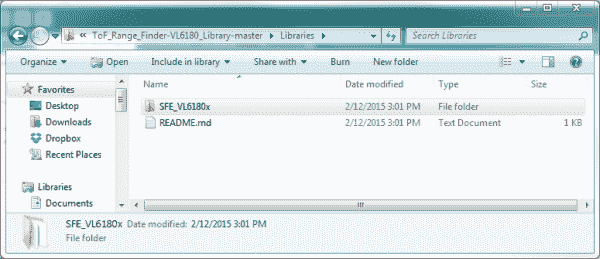
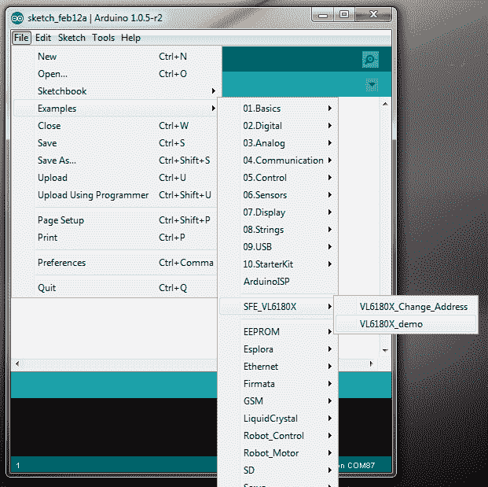
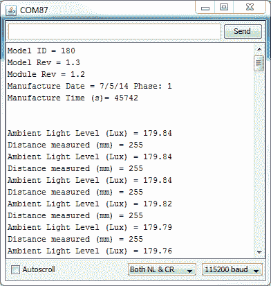

# VL6180 连接指南

> 原文：<https://learn.sparkfun.com/tutorials/vl6180-hookup-guide>

## 介绍

[VL6180](https://www.sparkfun.com/products/12785) 是一个飞行时间(TOF)距离传感器，带有 I ² C(“有线”)接口。本连接指南将涵盖两块电路板。 [VL6180 分接头](https://www.sparkfun.com/products/12784)和 [VL6180 传感器](https://www.sparkfun.com/products/12785)。尽管 [VL6180 传感器](https://www.sparkfun.com/products/12785)具有用于电平转换和电压调节的额外硬件，但这些板的功能非常相似。

许多距离传感器依靠反射光强度或反射角度来确定距离。这种传感器使用精确的时钟来测量光从表面反射回来所需的时间。与其他方法相比，这是一个很大的优势，因为它可以更准确，更不受噪声的影响。这种传感器通常在手机中发现，作为检测呼叫者何时将他们的电话放在耳边的传感器。

### 本教程涵盖的内容

我们将向您展示如何将该传感器连接到 Arduino 微控制器，并使用附带的软件库从传感器中获取测量值。(如果你使用的是不同类型的微型计算机，这些指令和源代码可能还是有帮助的。)

### 推荐阅读

这部分很好用。但在你开始之前，我们推荐以下背景知识:

*   [如何焊接](https://learn.sparkfun.com/tutorials/how-to-solder-through-hole-soldering)
*   [使用焊线](https://learn.sparkfun.com/tutorials/working-with-wire)
*   [逻辑电平](https://learn.sparkfun.com/tutorials/logic-levels)
*   什么是 Arduino？
*   [“电线”(I ² C)通讯](https://learn.sparkfun.com/tutorials/i2c)

## 电路板概述- VL6180 分线点

*VL6180 Breakout Diagram*

VL6180 突破非常简单。仅填充所需的无源器件，为用户提供在一个项目中使用多个传感器的最小、最具成本效益的方式。

*   上拉使能-默认使能，两个所需的上拉电阻连接到 I ² C 线。如果在同一总线上使用多个传感器，除一个单元外，移除所有单元上的焊接跳线。
*   VL6180 传感器-传感器本身非常小，只需要无源元件来完成电路。

*注意:该器件只接受 2.8V 输入和逻辑。您必须提供一个 2.8V 电压源，并将电平转换到 3.3V 和 5V 设备。*

## 电路板概述- VL6180 传感器

*VL6180 Sensor Diagram*

VL6180 传感器与 VL6180 分线点非常相似，但有一些值得注意的附加内容。

*   2.8V 调节器-为传感器提供所需的 2.8V 电压
*   I ² C 电平转换器-提供从 2.8V 到 VCC(由用户提供)的逻辑电平转换
*   上拉使能-默认使能，两个所需的上拉电阻连接到 I ² C 线。如果在同一总线上使用多个传感器，则拆除焊接跳线。
*   VL6180 传感器

*VL6180 Sensor and [Sharp GP2Y0A41SK0F](https://www.sparkfun.com/products/12728) Comparison*

另一个需要注意的是传感器本身的外形。许多小型机器人平台已经为长期以来最受欢迎的夏普红外传感器线集成了孔模式。这使得 VL6180 传感器几乎可以替代大多数尖锐的传感器。

## 连接硬件

### 使用 VL6180 分线点

要使用 VL6180 分线点，请遵循下图。需要注意的一件重要事情是，你**必须**使用[的 3.3v Pro-Mini](https://www.sparkfun.com/products/11114) 才能工作。我们在这个连接中欺骗了 2.8v 电平转换规则。由于 I ² C 是低电平有效信号，我们将使用分线点上的上拉电阻来提供逻辑电压。我们有一个很棒的 C 教程^(对此有更详细的解释。为了提供所需的 2.8V 电压，我们使用了一个 [LM317 调节器](https://www.sparkfun.com/products/527)。利用图中所示的两个电阻，输出电压被调谐至 2.8V。)

*Wiring Diagram for VL6180 Breakout and 3.3v Pro-Mini*

注:要使用此图，请确保 Pro-Mini 上的两个上拉电阻未被填充。

*Unpopulated Pro-Mini Pull-ups*

### 使用 VL6180 传感器

要使用传感器版本的 VL6180，事情要简单得多。董事会有自己的电平转换和规则。VL6180 传感器可在 3.3-5V 逻辑和电源下工作。

## 库安装和示例草图

要使用 VL6180 传感器或分线点，您需要一些支持软件。如果你使用的是 Arduino，那么你很幸运！我们创建了一个 Arduino 库，使 VL6180 易于使用。单击下面的按钮下载最新版本的 VL6180 库。

[Download the Arduino Library!](https://github.com/sparkfun/SparkFun_VL6180_Time_of_Flight_Library/archive/master.zip)

解压下载的文件，导航到\<your download="" directory="">\ spark fun _ VL 6180 _ Time _ of _ Flight _ Library-master . zip \ spark fun _ VL 6180 _ Time _ of _ Flight _ Library-master \ Libraries。</your>

按照本指南安装 Arduino 库将 SFE_VL6180x 目录下的文件安装为 Arduino 库。

有一个示例草图与该库相关联。VL6180X_demo 读取距离和光输出，并将其报告给屏幕。

*Demo Program Found in Examples**Demo Program Output*

## 资源和更进一步

现在，我们已经介绍了 VL6180 传感器和分线点的一些基本特性，请查看其他一些教程和有用的链接。

*   [VL6180 传感器 Github 报告](https://github.com/sparkfun/SparkFun_VL6180_Time_of_Flight_Sensor)
*   [VL6180 分线点 Github 报告](https://github.com/sparkfun/SparkFun_VL6180_Time_of_Flight_Breakout)
*   [VL6180 库 Github Repo](https://github.com/sparkfun/SparkFun_VL6180_Time_of_Flight_Library)
*   [VL6180 数据表](https://cdn.sparkfun.com/assets/learn_tutorials/2/5/7/VL6180_datasheet.pdf)
*   [VL6180 应用笔记](https://cdn.sparkfun.com/assets/learn_tutorials/2/5/7/VL6180_ApplicationNote.pdf)
*   [光的属性](https://learn.sparkfun.com/tutorials/light)

或者看看这篇博客:

 [### Enginursday:“我对此有很好的预感”

August 2, 2018](https://www.sparkfun.com/news/2740 "August 2, 2018: Let's add some electricity to your favorite things. I take a LEGO® speeder from Star Wars® and use Arduino to give it a little something extra.")[Favorited Favorite](# "Add to favorites") 3 [### 距离感测:有多远？

October 8, 2018](https://www.sparkfun.com/news/2794 "October 8, 2018: What type of proximity sensor is best suited to your next project? We've put together a Proximity Sensor Comparison Guide to help you choose the right tool for the job!")[Favorited Favorite](# "Add to favorites") 1 [### VCSELs 和距离感测

October 15, 2018](https://www.sparkfun.com/news/2796 "October 15, 2018: How do you build a better laser? Maybe this way.")[Favorited Favorite](# "Add to favorites") 3