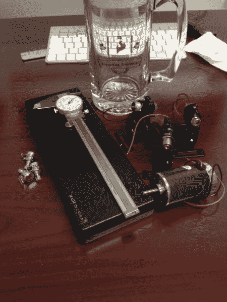
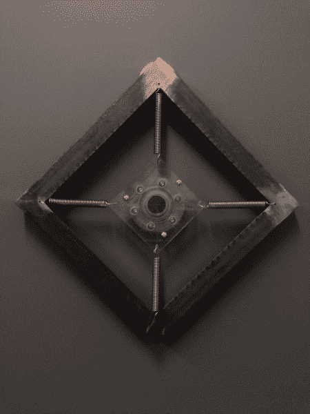
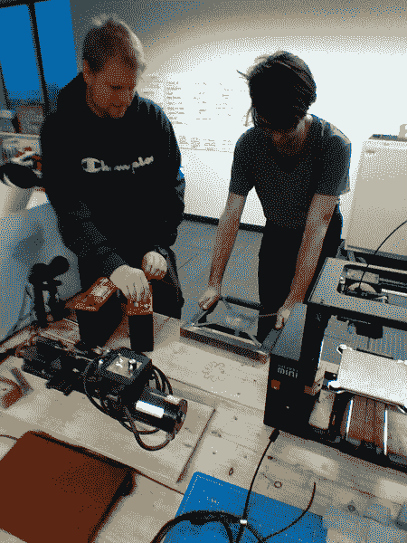
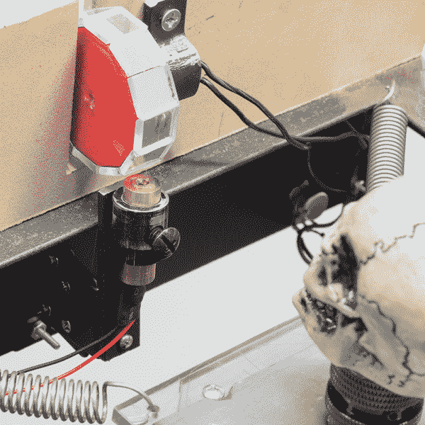

# 住宅黑客:谐波偏斜窥镜

> 原文：<https://learn.sparkfun.com/tutorials/hacker-in-residence-the-harmonic-skew-zoetrope>

## 介绍

在我们的世界中，有许多事物看起来是恒定的，但实际上闪烁的频率比我们容易察觉的要快。无论是快速序列视频帧，还是我们电源插座中的交流电(以及由此产生的我们灯具难以察觉的闪烁)，甚至是构成声波的空气分子的压缩和稀薄，这些频率都在我们周围。

有时窗帘被拉开，我们可以看到这些频率的证据。[车轮效应](http://en.wikipedia.org/wiki/Wagon-wheel_effect)就是这样一个例子。有时，这些伪像是不受欢迎的(如屏幕视频中的条带)，但其他时候它们是设备功能的底层机制(如 [zoetrope](http://en.wikipedia.org/wiki/Zoetrope) )。

谐波歪斜光镜使用移动的主题和扫描光线来创造视觉失真的体验，有点类似于[狭缝扫描摄影](http://en.wikipedia.org/wiki/Slit-scan_photography)，但没有屏幕的调解。

[https://www.youtube.com/embed/7InkdyZdbmw/?autohide=1&border=0&wmode=opaque&enablejsapi=1](https://www.youtube.com/embed/7InkdyZdbmw/?autohide=1&border=0&wmode=opaque&enablejsapi=1)

——黑客常驻，[杰西·哈丁](http://www.cosmicharding.com)

### 推荐阅读

*   [谐波百科词条](http://en.wikipedia.org/wiki/Harmonic)
*   [卷帘快门维基百科词条](http://en.wikipedia.org/wiki/Rolling_shutter)
*   [光学百科词条](http://en.wikipedia.org/wiki/Optics)
*   [干涉测量法](http://en.wikipedia.org/wiki/Interferometry)

## 工具和材料

这是这个项目中使用的工具和材料的清单。如果你想自己复制这个项目，你可能需要寻找合适的材料组合。

*   发动机
*   偏心滚子
*   轴承
*   张力簧
*   旋转镜(带电机)
*   激光二极管(带柱面透镜)
*   可调激光二极管支架
*   电力供应
*   速度控制(电位计或微控制器)

## 硬件装配

让我们来看看构成谐波斜置窥镜的一些部分。但首先，一个公共服务公告...

### 携带电子元件旅行

当您携带松散的电子元件乘飞机旅行时，请准备好回答美国运输安全管理局可能会向您提出的所有问题。最好把这些东西放在你包的顶部，这样当他们不可避免地搜查你的东西时就不用到处翻找了。尽量保持愉快，尽量描述但不要过于专业。

### 偏心滚子组件

安装主电机时，轴朝上，这样我们可以使物体在水平面上摆动。安装在电机轴上的是一块铝片，安装孔偏离中心(本质上类似于振动电机)。这块铝片将在滚珠轴承的孔内滚动，滚珠轴承的外部将安装在一个平台上，通过角上的张力弹簧防止旋转。

根据电机和平台的尺寸，可能需要配重来减轻振动。

*Testing the motor for current draw and vibration*

### 激光和旋转镜组件

柱面透镜将只在一个维度上弯曲激光，将一个光点变成一条线。这允许我们扫描物体，使得物体的顶部和底部在不同的时间点被照亮，但是在相同高度的所有点同时被照亮。

我选择使用十二面镜(12 面)来反射大约 60 度的激光。更多的边将减少激光扫描的面积。如果激光扫描的区域比物体大，物体没有被照亮的时间会更长，这是我想要避免的。

在 SparkFun，我们 3D 打印了一个十二边形的棱柱，在每个面上热粘上镜子，并将其连接到马达上。

一旦安装了旋转反射镜，就可以安装激光器，使其向物体反射。可调安装允许您微调这个位置。激光离镜子越近，扫描激光照射的区域就越大。

物体的振荡速度需要等于或接近激光扫描频率的谐波(由于边数的原因，等于电机每分钟转数的 12 倍)。为了匹配这些频率，我使用了一个电位计来改变旋转镜子的电机的速度，但你也可以使用 Arduino 来读取和控制两个电机的速度。

## 结果

成功了！！！:)

我用几个物体测试了谐波倾斜窥镜:一块木头，一个婴儿娃娃头，最后是一个微型头骨。

选择一个头骨作为被扭曲的对象是对汉斯·霍尔拜因 1533 年的画作《大使们》的致敬。

[https://www.youtube.com/embed/5KxClVbNVZs/?autohide=1&border=0&wmode=opaque&enablejsapi=1](https://www.youtube.com/embed/5KxClVbNVZs/?autohide=1&border=0&wmode=opaque&enablejsapi=1)

### 谢谢大家！

我要感谢 SparkFun 的所有人，特别是托尼·克洛普芬斯坦、埃文·斯皮勒、凯西·库恩斯、迈克·格鲁辛、拜伦·雅克特、杰夫·布兰森和内森·赛德尔！你们太棒了！！！

## 资源和更进一步

我们希望你喜欢这个项目教程。要获得更多令人兴奋的激光乐趣，请查看以下其他项目:

 [### 你能走多低？

February 8, 2012](https://www.sparkfun.com/news/801 "February 8, 2012: Check out the SparkFun Laser Limbo Project!")[Favorited Favorite](# "Add to favorites") 0 [### 工程师星期四-打开激光！

June 20, 2013](https://www.sparkfun.com/news/1178 "June 20, 2013: Open-sourcing Laser Technology and the SparkFun visit the Optics Lab at the School of Mines")[Favorited Favorite](# "Add to favorites") 0 [### Enginursday:午餐盒激光秀

May 15, 2014](https://www.sparkfun.com/news/1479 "May 15, 2014: Learn how to make an amazingly entertaining laser show small enough to fit inside of a lunchbox. ")[Favorited Favorite](# "Add to favorites") 0