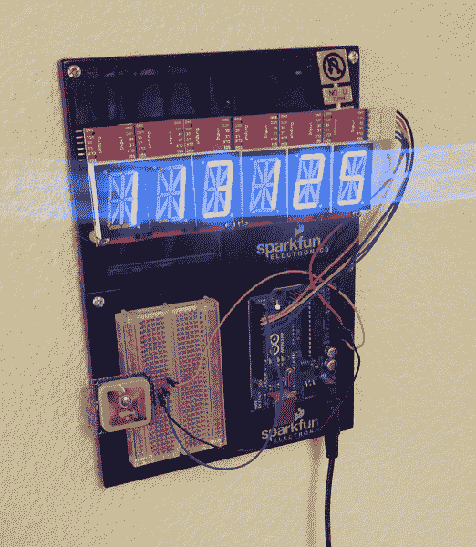
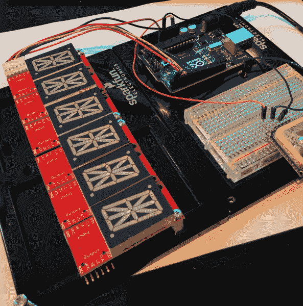

# 字母数字 GPS 挂钟

> 原文：<https://learn.sparkfun.com/tutorials/alphanumeric-gps-wall-clock>

## 介绍

GPS 字母数字时钟是你永远不必设置的时钟！使用 UTC 时间和日期，我们能够使用公历日期计算器和一些美国夏令时规则( [DST](http://en.wikipedia.org/wiki/Daylight_saving_time) )解析出当地时间。计算 1983 年 6 月 7 日是星期几实际上是一个挑战。类似地，计算出我们在某一年是否是夏令时，并不像你想象的那么容易。本教程给出了一个如何从任意日期计算星期几的很好的分解，以及一个简单的方法来设置你的时钟本身(假设你知道日期)。

### 推荐阅读

为了更好地理解这个项目，您应该熟悉以下主题:

 [### GPS 基础知识](https://learn.sparkfun.com/tutorials/gps-basics) The Global Positioning System (GPS) is an engineering marvel that we all have access to for a relatively low cost and no subscription fee. With the correct hardware and minimal effort, you can determine your position and time almost anywhere on the globe.[Favorited Favorite](# "Add to favorites") 31 [### 安装 Arduino 库](https://learn.sparkfun.com/tutorials/installing-an-arduino-library) How do I install a custom Arduino library? It's easy! This tutorial will go over how to install an Arduino library using the Arduino Library Manager. For libraries not linked with the Arduino IDE, we will also go over manually installing an Arduino library.[Favorited Favorite](# "Add to favorites") 22 [### 什么是 Arduino？](https://learn.sparkfun.com/tutorials/what-is-an-arduino) What is this 'Arduino' thing anyway? This tutorials dives into what an Arduino is and along with Arduino projects and widgets.[Favorited Favorite](# "Add to favorites") 50

## 五金器具

自从我们制作了 [12' GPS 挂钟](https://www.sparkfun.com/tutorials/47)已经有一段时间了。与上一款相比，GPS 字母数字挂钟的尺寸要小得多，但它对当地时间的了解要复杂得多。

这个特殊的时钟使用 6 个 [1 "字母数字显示器](https://www.sparkfun.com/products/9933)和[控制器](https://www.sparkfun.com/products/10103)来创建一个 6 字符显示器。虽然没有 EMSL 令人敬畏的[阿尔法时钟五](http://shop.evilmadscientist.com/productsmenu/tinykitlist/589)那么耀眼，但这种设置允许我们从 Arduino 上非常简单地控制滚动时间、日期、日子和一些简单的信息。这些都是由一个使用 Arduino Uno 的简单库控制的。一个 [5V 的 walwart](https://www.sparkfun.com/products/12889) 为显示器和 Arduino 供电。我原来用的是 [Locosys LS20031 GPS 接收机](https://www.sparkfun.com/products/8975)。这三年来效果很好。一旦我的原始 DST 代码坏了，我决定升级到更小、更灵敏的 GPS 接收器。

如果您想自己制造，我们推荐您使用以下零件列表: