# 电子纺织品的绝缘技术

> 原文：<https://learn.sparkfun.com/tutorials/insulation-techniques-for-e-textiles>

## 介绍

本教程介绍了在电子纺织品项目中绝缘导电线迹的五种不同方法。这些方法中使用的所有材料都可以在你当地的工艺品或爱好商店找到，不需要特殊的工具。

## 为什么要绝缘？

导电线的作用就像未绝缘的电线，这使得它非常适合将组件缝合在一起，但一旦项目完成，织物的移动可能会让一些线意外接触。使用导电线时，一定要特别注意绝缘所有电源线和接地线，以免电池短路。一旦项目完成，绝缘缝线可以防止因移动、折叠或接触导电表面而造成的潜在短路，并在磨损或洗涤过程中增加额外的屏障。

## 推荐阅读

*   [用导电线缝制](https://learn.sparkfun.com/tutorials/sewing-with-conductive-thread)
*   [电子纺织基础知识](https://learn.sparkfun.com/tutorials/e-textile-basics)
*   [短路](https://learn.sparkfun.com/tutorials/what-is-a-circuit/short-and-open-circuits)

## 开始之前

在做任何绝缘技术之前，确保你的项目完全运行并完成——大多数这些都是覆盖缝合的永久方法，在油漆/胶水干了之后，很难做任何调整。

### 项目准备

使用此清单来确保您的项目已做好隔热准备:

*   所有的结都系好了，尾巴也剪短了
*   没有短路或交叉线
*   电池/电源被移除或关闭- *切勿在通电的情况下工作！*

## 弹力织物胶

使用弹性织物胶是覆盖导电线的一种很好的方式，不会过多地干扰缝合的织物的柔韧性。这种胶水通常用于将两片织物粘合在一起，但如果涂在织物上，也可以提供一个很好的保护层。

这项技术是我们从[如何得到你想要的东西](http://www.kobakant.at/DIY/?p=1304)中学到的，这是一个充满了电子纺织品和电子工艺品工具和技术的网站。

**难度:**中级
**烘干/定型时间:**隔夜
**狼狈程度:**中度

### 所需材料:

*   弹力织物胶
*   便条纸
*   画笔(可选)-帮助涂胶水
*   遮蔽胶带(可选)-用作清洁边缘的模板

[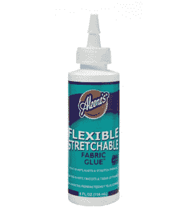](https://cdn.sparkfun.com/assets/learn_tutorials/3/0/9/fabricGlue.jpg)

Aleene 的弹性可拉伸织物胶水是一个常见的品牌名称，也是我们在电子纺织品项目中经常使用的一种。

### 说明:

直接从挤压瓶或使用漆刷在导电线上涂一薄层胶水。使用这种技术，少即是多——大团胶水需要更长时间才能干透。画几层薄的会比画一层厚的效果更好。

[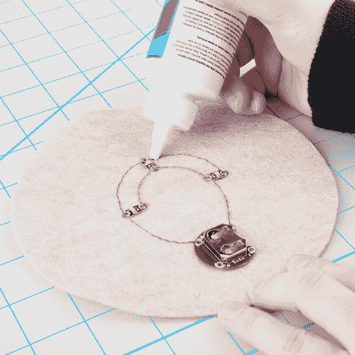](https://cdn.sparkfun.com/assets/learn_tutorials/3/0/9/Insulation-Techniques-Tutorial-03.jpg)

想要线条特别整齐，试着用遮蔽胶带在线的两侧做一个模板，当胶水完全干透后撕下。

放置一夜晾干。这种胶水是出了名的干得慢，所以你让它凝固的时间越长越好。根据层的厚度，它可能在干燥后仍然发粘——快速除尘或擦上面粉或婴儿爽身粉会有帮助。

#### 优点:

*   织物和线的弹性密封
*   干燥干净

#### 缺点:

*   需要练习才能在螺纹上形成均匀的线条
*   干燥时间长
*   胶水会保持光泽——面粉/婴儿爽身粉也有助于保持光泽

### 示例:

看看 Mika Satomi 和 Hannah Perner-Wilson 的[语言游戏项目](http://www.kobakant.at/?p=27)中的服装，它在*导电织物痕迹*上使用了这种技术。点击了解更多关于在你的项目[中使用导电布代替线的信息。](http://www.kobakant.at/DIY/?p=1300)

## 织物涂料

织物涂料是为项目添加隔热材料和风格的快速方法。使用不同颜色的油漆来隐藏和装饰缝线可以为您的项目创造一个真正独特的外观。我们建议使用 3D 或“粉扑颜料”,因为它的厚度可以更快地覆盖痕迹，而且管子有一个精细的尖端，比画笔更容易应用。

**难度:**容易/中级
**干燥/定型时间:**隔夜
**狼狈程度:**中等

### 所需材料:

*   织物颜料-3D/立体/粉扑颜料非常好用，因为它通常包装在挤压管或笔中
*   便条纸
*   油漆刷(可选)-帮助涂抹油漆
*   遮蔽胶带(可选)-用作清洁边缘的模板

[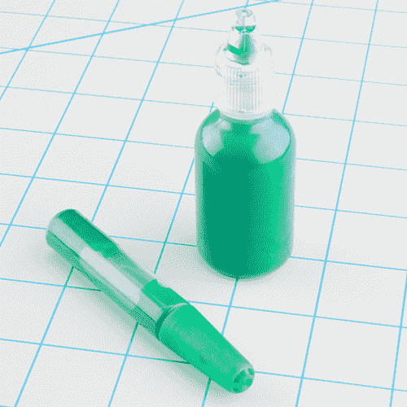](https://cdn.sparkfun.com/assets/learn_tutorials/3/0/9/Insulation-Techniques-Tutorial-01.jpg)

*常见的立体画品牌:郁金香立体画、涂鸦立体画、蓬松画。在当地工艺品商店的服装工艺品或油漆区寻找这些。*

### 说明:

准备一些废纸，做几条练习线，感受一下油漆的流动。确保摇动油漆，以防颜料分离。当你准备好了，小心地在导线上涂上一层，确保涂得很薄。如果需要的话，你可以随时添加第二层——避免大块的油漆，因为这些油漆容易涂抹，需要很长时间才能干燥。

[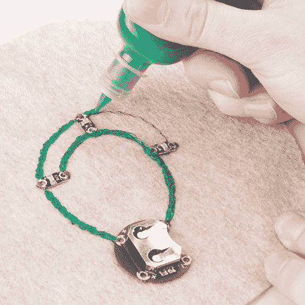](https://cdn.sparkfun.com/assets/learn_tutorials/3/0/9/Insulation-Techniques-Tutorial-02.jpg)

当你的画完成后，让它干一夜。

#### 优点:

*   螺纹上的装饰密封
*   很多颜色

#### 缺点:

*   需要练习才能在螺纹上形成均匀的线条
*   干燥时间长——尤其是厚漆
*   挤压管有大量喷出的趋势——当你第一次开始使用挤压管时，手边一定要有碎纸片

### 示例:

[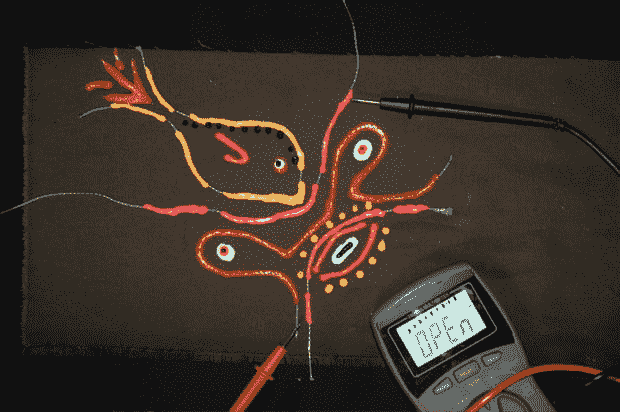](https://cdn.sparkfun.com/assets/learn_tutorials/3/0/9/LynnePaint.jpg)

Lynne Bruning 写了一个关于这种技术的快速教程，展示了一个有趣的油漆设计。

[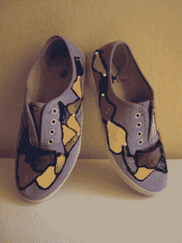](https://cdn.sparkfun.com/assets/learn_tutorials/3/0/9/LEDshoes.jpg)

Instructables 成员 Carleyy 的这个 [LED 鞋教程](http://www.instructables.com/id/LED-Shoes-Illuminate-Your-Feet/)很好地利用了颜料来隐藏缝线，创造了一个很酷的设计。

## 织物层/衬里

使用一层织物(或在衣服的衬里下面构建电路)是一种保护导电线的简单方法，如果该项目将贴着皮肤穿着，还会留下柔软的背衬。这也是用织物设计绝缘电路前端的好方法。

**难度:**容易
**干燥/定型时间:**无
**狼狈程度:**极小

### 所需材料:

*   构造
*   剪刀
*   针和不导电的线或胶(织物胶或热胶枪)

### 说明:

剪一块布(或小片)盖住你的电路。通过缝纫或使用胶水固定布料，注意不要意外损坏任何缝线或组件。如果对项目前部进行隔热处理，可以发挥你的设计创意——贴花、切口和形状可以增加趣味性和隔热效果。

[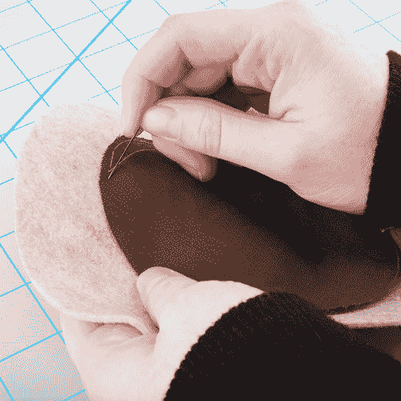](https://cdn.sparkfun.com/assets/learn_tutorials/3/0/9/Insulation-Techniques-Tutorial-07.jpg)

**温馨提示:**

*   如果使用胶水，注意不要让它渗透到布料的顶部。
*   当覆盖大面积时，确保在布料中间的各个地方缝合或粘合，而不仅仅是在边缘。这有助于保持织物与线路平齐，并避免任何可能使线短路的意外折叠。

#### 优点:

*   没有暴露的湿油漆或胶水需要处理
*   这是一个很好的方法来使用你的项目中的碎布

#### 缺点:

*   可能会变得笨重，这取决于织物的选择
*   缝纫可能需要大量时间，这取决于设计的复杂程度

### 示例:

我们的[闪烁的不给糖就捣蛋包项目](https://learn.sparkfun.com/tutorials/twinkling-trick-or-treat-bag)使用织物设计来掩盖包前面的组件。

## 刺绣/装饰缝线

如果你有足够的耐心(或缝纫机)，使用刺绣来覆盖导电线痕迹可以为您的项目添加一个美丽的点睛之笔。根据你的项目规模和面料类型，手工刺绣可能比在机器上安装项目更容易。如果你正在隔离一个项目的前面，这种方法也很有效。仅仅为了内部，尝试一个更快的方法，像衬布或织物层。

**难度:**中级
**干燥/定型时间:**无
**狼狈程度:**极小

### 所需材料:

*   绣花线
*   绣花针
*   剪刀
*   缝纫机(可选)

### 说明:

**手缝:**

小心地沿着导电线走，并用*缎纹针*覆盖。这里有一个[教程](http://sublimestitching.com/pages/how-to-satin-stitch)，来自缎面缝合上的崇高缝合。您还可以在导电线周围添加额外的刺绣，将其融入更大的设计中。发挥创造力！

[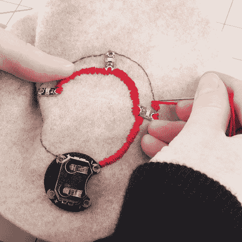](https://cdn.sparkfun.com/assets/learn_tutorials/3/0/9/Insulation-Techniques-Tutorial-06.jpg)

**机器缝合:**

如果你想在缝纫机上轻松地缝制衣服，可以在一个小的位置使用锯齿形(或纽扣孔)针脚，然后在导电线上缝制。注意不要缝合任何部件——它们可能会被针损坏，或者更有可能弄断你的针并卡在机器里。在任何组件周围留出大约一英寸的距离，并留下一条长长的线尾，以便用手完成缝合。

Lynne Bruning 发表了一篇关于这种技术的教程，引导你将你的项目加载到一台机器上。

***温馨提示:***

*   确保刺绣针脚紧密，并完全覆盖导电线-任何间隙都会暴露线，为短路留下更多空间。

#### 优点:

*   没有未干的油漆或胶水需要处理
*   创意拼接会彻底伪装你的痕迹
*   可以在一个步骤中隔离缝线的正面和背面

#### 缺点:

*   对初学者来说，刺绣可能是单调乏味的工作
*   时间密集型

### 示例:

[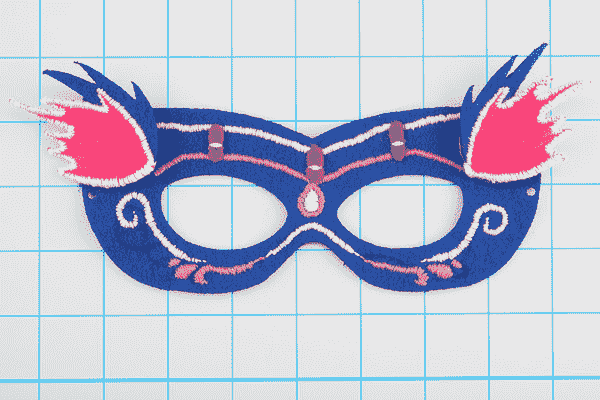](https://cdn.sparkfun.com/assets/learn_tutorials/3/0/9/Insulation-Techniques-Tutorial-09.jpg)

我们的[电子纺织品面具项目](https://learn.sparkfun.com/tutorials/e-textile-mask)的这个修饰版本使用刺绣来添加细节并掩盖导电线和 led。

## 易熔衬布

易熔衬布通常用于给衣服的领口或扣眼等部位增加结构或强度。我们将在可穿戴设备项目中使用接口来覆盖导电线迹。

**难度:**容易
**干燥/定型时间:**无
**狼狈程度:**极小

## 所需材料

*   易熔衬布
*   熨斗、熨衣板
*   羊皮纸(可选，以防止熨斗被错误熨烫的粘合剂粘住)
*   剪刀
*   标记

## 选择接口

接口有很多种，从熨烫到缝合，从重型到轻型。它可以在大多数工艺品和爱好商店找到，如 JoAnn Fabrics、Michaels、Hobby Lobby 或 fabric stores。

大多数可熔接口的一面都有粘合剂。粘合剂(有小胶水滴的凹凸不平的一面)压在织物上，熨烫时会融化，在织物衬里上留下柔软的背衬。

当你去商店的时候，找一个易熔的或者熨烫过的网或者接口，确保它是单面粘合的。一些商店出售双面熨烫产品，用于将两片织物熔合在一起，我们不需要这种产品。一些常见的品牌有 Heat'n Bond(打包出售)和 Pellon(按码出售)。

[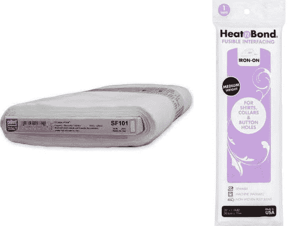](https://cdn.sparkfun.com/assets/learn_tutorials/3/0/9/Interfacingtypes.jpg)

## 准备您的电路

在项目背面放置一些接口(粘合面朝下)。

[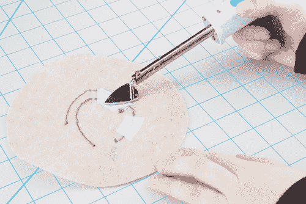](https://cdn.sparkfun.com/assets/learn_tutorials/3/0/9/Insulation-Techniques-Tutorial-05.jpg)

在衬布上画出小块来盖住导线。小心在任何组件周围留出一些空间，这样接口就不会覆盖它们。熨斗的热量可能会损坏百合片。在项目和熨斗之间使用一张羊皮纸，防止粘合剂意外转移到熨斗上。

#### 优点:

*   没有未干的油漆或胶水需要处理
*   最快的绝缘方法

#### 缺点:

*   有些布料对热的反应不太好，当使用激活粘合剂所需的熨斗设置时，可能会融化——在熨烫之前，一定要检查你的布料或在废料上做测试。
*   这种方法不太适合小型项目，或者组件非常接近的项目

### 示例:

[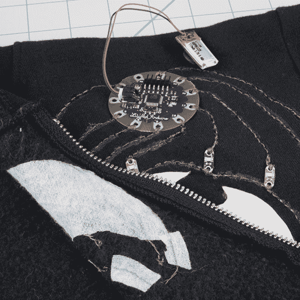](https://cdn.sparkfun.com/assets/learn_tutorials/3/0/9/Insulation-Techniques-Tutorial-10.jpg)

这款 LilyPad powered light up 运动衫采用衬布保护缝线，让穿着者感到舒适。

## 资源和更进一步

现在你知道如何绝缘你的电路，是时候出去做一些项目了！需要一些灵感吗？查看来自 SparkFun Electronics 的其他精彩教程。

*   闪烁的不给糖就捣蛋的袋子 -用导电线、发光二极管和百合花做一个发光的糖果袋！
*   电子纺织面具 -使用 LilyPad 发光二极管、开关电池座和硬币电池为你的下一次化妆舞会制作一个有趣的发光面具。
*   [我的醉酒厨房围裙](https://learn.sparkfun.com/tutorials/my-drunk-kitchen-apron) -一个使用 LilyPad MP3 触发器的有趣项目。这条围裙将为我的醉鬼厨房的主人汉娜·哈托提供有用的厨房建议和幽默！
*   [《龙与地下城》骰子挑战赛](https://learn.sparkfun.com/tutorials/dungeons-and-dragons-dice-gauntlet) -让你的极客带上这款可穿戴的数字骰子挑战赛。