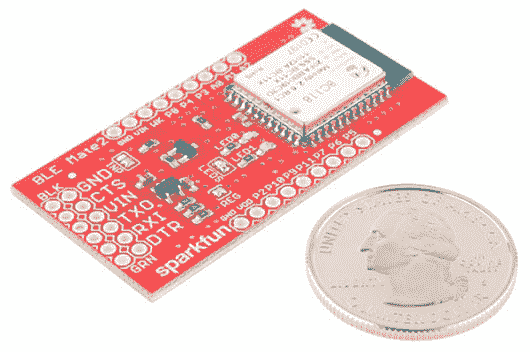
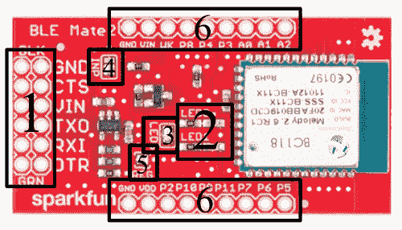
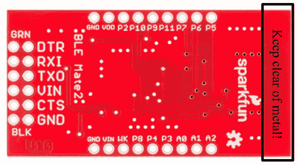
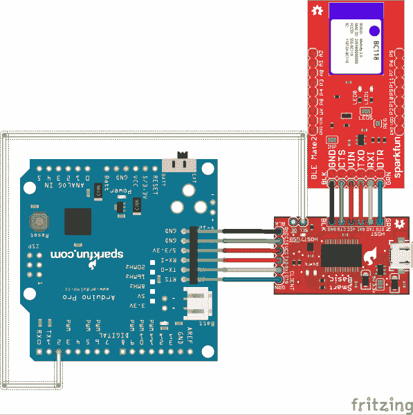

# BC118 BLE Mate 2 连接指南

> 原文：<https://learn.sparkfun.com/tutorials/bc118-ble-mate-2-hookup-guide>

## 介绍

SparkFun 的[蓝牙低能耗(BLE) Mate 2](https://www.sparkfun.com/products/13019) 是一款严肃的蓝牙 4.0(又名蓝牙低能耗或蓝牙智能)开发板，与我们的[蓝牙 Mate 银](https://www.sparkfun.com/products/12576)和[蓝牙 Mate 金](https://www.sparkfun.com/products/12580)相关。

[](https://cdn.sparkfun.com/assets/learn_tutorials/2/8/7/13019-04_1.jpg)

BLE Mate 2 只支持蓝牙 4.0；它不能连接到旧设备。同样值得注意的是，BLE 不像老版本的蓝牙那样支持串行端口协议；这使得 BLE 加密狗、设备和模块之间的互操作性比蓝牙 Classic 更难。

正如你所看到的，BLE Mate 2 是一块小板子:1.0 英寸×1.95 英寸(25 毫米×50 毫米)。模块对面一端的六针接头是一个“主机”串行引脚排列，与 [FTDI 基本](https://www.sparkfun.com/products/9716)板上的相同，这允许 BLE Mate 2 直接连接到任何具有匹配接头的设备，如 [SparkFun Arduino Pro](https://www.sparkfun.com/products/10915) 和 [Pro Mini](https://www.sparkfun.com/products/11113) 。再加上 [FTDI SmartBasic](https://www.sparkfun.com/products/12935) ，您甚至可以开发自己的代码，而不必更换电缆！该板具有内置电平转换功能，因此它可以与高于 BC118 使用的 3.3V 默认电压的板一起使用。

您还会注意到，BC118 模块上的所有引脚都有分线孔；我们将在后面的章节中介绍这些方法的使用。

### 本教程涵盖:

*   BLE Mate 2 的硬件连接
*   BC118 功能
*   BLE Mate 2 库和示例代码

### 使用的材料

*   Arduino Pro 5V -你可以轻松地使用 3.3V 版本，或 Pro Mini，或(事实上)任何支持串行通信的主板。
*   根据你想做的事情，你可能需要两个这样的东西。我们将演示一个连接到另一台 BLE Mate 2 的示例，并提供一些应用程序示例，展示如何连接到 iPhone 或 Android 设备。
*   [FTDI smart basic](https://www.sparkfun.com/products/12935)-smart basic 专为这种应用而设计-允许对 Arduino 进行编程，同时允许硬件串行端口有选择地连接到另一个串行设备。**不建议你对这个应用使用软件控制的串口**，因为来自 BLE Mate 2 的数据流很容易淹没缓冲区。
*   [可咬合的插头插脚](https://www.sparkfun.com/products/116) -你需要给 SmartBasic 和 BLE Mate 2 增加插脚(如果你想把 BLE Mate 2 插到试验板上)。
*   至少有 [6-](https://www.sparkfun.com/products/9429) 和 [8 针母接头](https://www.sparkfun.com/products/11895)。BLE Mate 和 SmartBasic 需要一个 6 针插头，专业版需要一个 8 针插头。
*   [跳线](https://www.sparkfun.com/products/11026) -你真的只需要其中一根，将 Arduino Pro 连接到 SmartBasic 上的 OE 线。

### 推荐阅读

在继续学习之前，您可能需要复习以下教程:

*   [加载 Arduino 库](https://learn.sparkfun.com/tutorials/installing-an-arduino-library)——BLE Mate 2 github 库上有一个可用于 BC118 模块的库，本教程将解释如何加载它。
*   [十六进制](https://learn.sparkfun.com/tutorials/hexadecimal)-BC 118 使用的很多参数都是十六进制的；通过本教程来复习这意味着什么！
*   蓝牙基础知识 -了解蓝牙的一些基本工作原理。

## 硬件概述

让我们来看看 BLE Mate 2 板。

### 前面

[](https://cdn.sparkfun.com/assets/learn_tutorials/2/8/7/image2991.png)

上图是 BLE Mate 2 的主要部分。我们将从前面开始，因为它更有趣。我们只是给这里的东西贴上标签。我们将在下一页讨论它们的全部用途。

1.  6 针 [FTDI 基本](https://www.sparkfun.com/products/9716)兼容串行接头-该接头与 FTDI 基本板具有相同的引脚排列；这意味着连接到客户端设备，如 Arduino Pro。如果你想把它连接到 FTDI 基本板上，你需要制造或购买一个[交叉适配器](https://www.sparkfun.com/products/10660)。我们提供了两排引脚，以便更容易地连接到这些引脚(例如，嗅探信号以进行故障排除)。
2.  LED0 和 LED1 -这些 LED 显示模块当前状态的信息。**这些 led 反映了模块**的逻辑状态，在设置生效之前，可能需要重置模块。稍后会详细介绍。
3.  发光二极管跳线-这种跳线船舶封闭与焊料；清除跳线以禁用 led，并为低功耗情况节省一些电流。
4.  INP 跳线-该跳线将 6 引脚接头上的电压输入引脚连接到 BLE Mate 2 上的 3.3V 调节器。可以清除该位，以便从电路中移除调节器并节省电流。
5.  调节器跳线-清除该跳线将断开 3.3V 调节器输出和 BC118 模块电源之间的连接。
6.  GPIO 接头 BC118 上的所有引脚都连接到这些引脚，电源和接地也是如此。

### 背部

[](https://cdn.sparkfun.com/assets/learn_tutorials/2/8/7/bottom.png)

后面就简单多了。您会注意到，所有的大头针标签也在这一面。

从这方面来说，真正值得指出的一点是板顶部的禁止区。可以看到，接地层仅向上延伸到 PCB 为了获得最佳性能，在项目中嵌入 BLE Mate 2 时，您应该尝试保持该区域没有任何金属。否则可能会导致干扰或信号强度损失。

## 硬件连接

本页将涵盖 BLE Mate 2 的一般硬件连接以及本教程的具体信息。

### 6 针串行接头

[](https://cdn.sparkfun.com/assets/learn_tutorials/2/8/7/serial_header.png)

此接头上的引脚排列与 FTDI 基本板的引脚排列相匹配，因此它可以用于 FTDI 基本板的任何地方。然而，它可能不够快，无法进行任何类型的无线引导加载。

*   **DTR** -仅连接到另一个 DTR 垫。此引脚可以连接到 PIO5，向客户端设备提供 DTR 输出；该信号的电压由 BC118 模块的电源电压决定，因此可能不足以驱动 Arduino 上的复位信号。
*   **RXI** -来自客户端设备的数据输入。
*   **TDO** -来自 BC118 设备的数据输出。上移至该接头的 VCC 引脚上的电平。
*   **VCC** -连接到 INP 跳线(见下文)。
*   **CTS** -仅连接到另一个 CTS 衬垫。可以连接到 PIO6，向 BC118 提供 RTS 信号。该信号不得超过 BC118 模块的电源电压。
*   **GND** -整个模块的负供电轨。

### GPIO 接头

[](https://cdn.sparkfun.com/assets/learn_tutorials/2/8/7/GPIO.png)

模块两侧有两个 0.1 英寸(2.54 毫米)的接头。这些引脚相距 0.9 英寸(22.5 毫米)，因此它们可以放入试验板中(尽管引脚外部不会留有太多空间！)

BC118 模块上当前有用的引脚都被分解到这些接头上；我会检查他们做什么和他们能做什么。在这里，我将在下一页讨论命令和配置参数，但它们将在下面引用。

*   **AIO2 **-默认情况下，这是一个模拟输入，可通过向模块发送命令“AIO2”来读取。模块将以此引脚上的电压(mV)作为响应。如果“ACFG”参数为“开”，此引脚将反映模块的状态:如果模块已连接，则为高电平；如果模块未连接，则为低电平。
*   **AIO1** -默认功能与 AIO2 相同。如果“ACFG”参数为“开”，拉高此引脚将使能透明模式，使 RX 引脚上的数据被逐字发送到任何连接的设备。
*   **AIO0** -默认功能与 AIO2 相同。如果“ACFG”为“开”，此引脚决定模块在启动时的作用。如果信号为高电平，模块将引导至中央模式。如果为低电平，则为外设模式。
*   **P3** - GPIO3。默认为从另一个连接的设备镜像或镜像到另一个连接的设备。稍后将详细介绍。
*   **P4** - LED0 输出。
*   **P8** -默认情况下，退出透明模式。通过将“GPIO”参数设置为“OFF ”,可以配置为镜像的 IO 引脚
*   **WK** -根据“WAKE”和“WLVL”参数，此引脚可用于将器件从休眠状态唤醒。
*   **VIN** -此引脚连接到 INP 跳线。以下是更多相关信息。
*   **GND** -整个电路的接地。
*   **P5** -当参数“FCTR”为“开”时，这将是 BC118 的 CTS 输出。
*   **P6** -当参数“FCTR”为“开”时，这将是 BC118 的 RTS 输入。
*   **P7** - GPIO7。见上面的 P3。
*   **P11** - GPIO11。见上面的 P3。
*   **P9** - LED1 输出。
*   **P10** - GPIO10。见上面的 P3。
*   **P2** -当前未启用。
*   **VDD** -该引脚直接连接到 BC118 的供电轨。**必须保持在 1.8V 到 4.3V 之间，以免损坏模块。**
*   **GND** -整个电路的接地。

### 发光二极管

[](https://cdn.sparkfun.com/assets/learn_tutorials/2/8/7/leds.png)

如前一页所述，LEDs 0 和 1 提供了一些关于模块当前状态的易于获取的反馈。这里有一个解码环，用来整理它们的意思。

| LED 0
蓝色 | LED 1
红色 | 状态 |
| 眨眼 | 离开 | 扫描 |
| 离开 | 眨眼 | 广告 |
| 在…上 | 离开 | 连接
中心 |
| 离开 | 在…上 | 连接
外设 |
| 在…上 | 在…上 | 闲置的 |

**注意:当改变为扫描、广告或空闲模式时，led 将改变以表示模块的当前设置，但在更改被写入非易失性存储器且模块被重新启动之前，模块不会改变状态。**

#### LEDS 跳线

该跳线将 led 的阴极侧与接地层断开，使其禁用，并消除了正常情况下每个 led 消耗的数百微安电流。它默认关闭发货。

### INP 和 REG 跳线

[](https://cdn.sparkfun.com/assets/learn_tutorials/2/8/7/INP_DEFAULT.png)

上图所示的 INP 跳线有四种可能的配置，但只有三种*有效*配置。

这是出厂时的默认模式。在这种模式下，来自 6 引脚接头上的 VCC 引脚和 GPIO 接头上的 VIN 引脚的输入电压被路由至 3.3V 调节器。

[](https://cdn.sparkfun.com/assets/learn_tutorials/2/8/7/inp_mode2.png)

在这种模式下，调节器的输入端与所有引脚断开，模块的电源直接连接到 VIN 引脚和 VCC 引脚。**在这种情况下，输入端的电压必须在 1.8V 和 4.3V 之间。**这在单节 LiPo 电池的范围内，但不在 5V 目标板的范围内！

此时清除 REG 跳线可能也是一个好主意；将电压加在调节器的输出端而不是输入端容易导致奇怪的行为。

电平转换电路在这里仍然有效，因此如果处理器上的数据线的电压高于 BC118 的供电电压，通信仍然可以工作。

[](https://cdn.sparkfun.com/assets/learn_tutorials/2/8/7/inp_mode_3.png)

由于跳线上没有焊料，您已经完全断开了模块与 VCC 和 VIN 引脚的连接。您需要直接向 GPIO 头上的 3.3V 引脚供电，关于电压范围，注意事项与前面相同。

同样，您应该清除 REG 跳线。

最后，第四种模式，我不仅要包括一张图片，它是如此不合适:一个大的旧焊料团覆盖所有三个焊盘。不要这样。说真的。它*可能*不会做任何坏事，但它不会对你的电流消耗有任何帮助，它可能会损坏调节器，而且它*会*绕过调节器。就是不做。

## BC118 功能

虽然您可以跳过这一页，直接进入代码示例和库文档，但至少略读一下可能是个好主意，这样您就可以对幕后发生的事情有所了解。

### 概念

BC118 实现了自定义 BLE 配置文件，因此在为它开发应用程序时，您必须考虑到这一点。这也意味着除了另一个 BC118 之外，您将无法轻松地将其连接到任何其他 ble 模块。

通常，当您更改 BC118 上的设置时，您需要将设置写入板载非易失性存储器并重置模块，设置才会生效。当有疑问时，写/重置-这是唯一确定的方法。

当模块以中央模式启动时，它将立即开始扫描，并扫描到超时时间(可能永远不会超时)。要连接到外围设备，BC118 必须处于中央模式，并进行扫描。这使得以编程方式检测成功的连接变得困难，因为连接的确认隐藏在检测到的设备流中。BLE Mate 2 图书馆会帮你解决这个问题。

### 与模块的通信

在出厂时，BC118 被编程为通过 UART 以 9600bps 的速率接收和发送。用户可以使用该模块启动两种类型的事务:命令和设置/获取参数。

BC118 要求命令字符串末尾有回车符(' \ r ')；如果您发送一个换行符(' \n ')(这通常是串行通信中的标准做法；Arduino println()函数在传输结束时发送“\n\r”)，这将导致接收错误。

但是，来自 BC118 的所有响应都将以“\n\r”结尾，这是一个很好的字符串模式，可以用来检测来自模块的响应。如果模块无法将最后两个回车符之间的字符串解析成命令，它将会以“ERR\n\r”作为响应。在这一点上，缓冲区是空的，并且这一事实可以是一种有用的方式来获得一个已知的状态，以便将用户代码与 BC118 中的缓冲区重新同步。

最后，关于“透明”模式:可以将模块置于透明模式，将 UART 上的数据直接转发给远程设备，并将从远程设备接收的数据直接转发给 UART。不幸的是，一旦透明模式被激活，就没有转义序列可以通过 UART 返回数据模式。GPIO8 和 AIO1 可用于退出透明模式，但前提是该功能已启用(通过将参数 GPIO 和 ACFG 分别设置为 on)。如果没有设置这些参数，并且进入透明模式，唯一的解决方法是重新启动模块。

### 有用的命令

以下是有用的命令列表。更多信息可以参考 BlueCreation 网站上的 [Melody 智能用户手册](http://bluecreation.com/userfiles/Melody-Smart-V2_6_0-UserManual-Rev_E(1).pdf)。

命令将首先与命令一起出现，然后参数将在命令后的括号中传递，但括号是命令的**而不是**部分。可选参数将放在括号中。竖线(' | ')将用于分隔“选择其中一个”参数。

*   ADV(开|关) -打开或关闭广告。虽然这可以在中央模式下正确切换，但没有任何效果。
*   **AIO (0|1|2)** -报告相应模拟输入引脚上的模拟电压，单位为 mV。
*   **CON [(BT 地址)(类型)]* *-* *设备必须处于扫描模式，此命令才能生效！**如果参数 ACON 为“1”，则无需向该命令传递任何参数，模块将连接至支持 Melody Smart 协议的第一个目标(即，另一个 BC118 或您在目标设备上编写的应用)。否则，BT 地址应该是要连接的设备的完整的 12 个字符的十六进制地址，对于公共地址(最常见)，type 应该是 0，对于私有地址，type 应该是 1。
*   **DCN** -断开与远程设备的连接。在外围或中央模式下工作。
*   **HIB**(time out)-“time out”参数应该是一个介于 1050 和 429496795 之间的整数值，代表设备从休眠状态出现之前经过的 1.024ms 周期数。从休眠状态重启是对存储设置的干净重启。
*   **GET** (参数)-返回(参数)的值，可以是下面列出的任何配置参数。
*   **RST** -重置芯片，从非易失性存储器中加载所有设置。
*   **RTR** -将所有设置恢复为出厂默认值。
*   **SCN(开|关)** -启用或禁用扫描。
*   **SET(parameter)=(value)**-**等号前后没有空格！**将(参数)设置为(值)。除非发出 WRT 命令，否则以这种方式更改的设置不会在重置或电源周期中持续存在(见下文)。
*   **SND(数据)** -发送二进制数据流。在中央模式下最多可发送 20 个字符，在外围模式下最多可发送 125 个字符，并且数据不得包含换行符(' \r '或 0x0D '，因为这会触发传输。
*   **STS** -返回模块的状态。
*   **VER** -返回当前模块上的 Melody Smart 版本，以及该模块的 12 字符蓝牙地址。
*   **WRT** -将当前设置保存到非易失性存储器中，使其在复位或重启后保持不变。**注意，许多设置需要 WRT/RST 循环才能真正生效！**

### 因素

除了上面列出的命令之外，还有一些控制模块行为的参数，可以通过上面提到的 set 和 GET 命令进行设置或检查。这里有一些最重要的。

*   **ACFG=(开|关)** -关闭时，AIO 引脚可用作模拟输入。打开时，它们可用于控制和报告(详情请参见“硬件连接”页面)。
*   **ACON=(开|关)** -打开时，模块将连接到第一个发现的兼容设备。这可能不是您想要连接的设备！
*   **ADVC=(ON|OFF)** -打开时，如果未连接，设备会不断发出广告。
*   **ADVP=(慢|快)** -广告费率。使用慢速会消耗较少的能量，但会使连接到模块的速度变慢。
*   **ADVT=(超时)** -广告开始后设备将广告多长时间(启动时或由于 ADV 命令)。值的范围从 0(永远)到 4260，是秒的整数表示。
*   **CENT=(ON|OFF)** -启用或禁用中央模式。**必须 WRT/RST 才能让这个生效！**
*   **CCON=(开|关)** -设备应该在断开连接时扫描/通告吗？
*   **CONP =(max _ conn _ int)(min _ conn _ int)(latency)(time out)**-该设备将发送到与其连接的中央的设置。(max_conn_int)必须大于(min_conn_int)，并且两者都必须介于 6 和 3200 之间，并且都以 1.25 毫秒为单位表示连接间隔。它们代表中央设备请求数据的最长和最短间隔。(延迟)以连接间隔为单位，代表连接从机延迟，即外围设备在没有新数据的情况下忽略中心设备的周期数。最后(超时)是连接监控超时，即中央设备在宣布链路丢失之前应该等待的最长时间。它是一个整数，单位是 10ms。

## Arduino 库示例

如果您还没有这样做，请下载。BLE Mate 2 GitHub 库的 zip 文件和[从“Arduino/libraries”子目录安装 Arduino 库](https://learn.sparkfun.com/tutorials/installing-an-arduino-library)。

### 这个例子

资源库中有一个示例，可以通过 Arduino 中的“示例”菜单访问。它将向您展示如何使用库中的各种功能来连接两个 BLE Mate 2 板。首先，像这样连接你的硬件...

[](https://cdn.sparkfun.com/assets/learn_tutorials/2/8/7/ble_mate2_hookup.png)

我在下面复制了完整的代码。

```
language:c
/****************************************************************
Code to demonstrate the use of the BC118 BLE module on the
BLE Mate 2 board by SparkFun electronics.

15 Nov 2014 - Mike Hord, SparkFun Electronics

Code developed in Arduino 1.0.6, on an Arduino Pro 5V, using a
SparkFun SmartBasic board to multiplex uploading and serial
output.
****************************************************************/

#include <SparkFun_BLEMate2.h>

// You can also create a SoftwareSerial port object and pass that to the 
//  BLEMate2 constructor; I don't recommend that because it's very possible
//  for the amount of traffic coming from the BC118 to overwhelm the fairly
//  shallow buffer of the SoftwareSerial object.
BLEMate2 BTModu(&Serial);

// This boolean determines whether we're going to do a central or peripheral
//  example with this code.

boolean central = true;

void setup()
{
  pinMode(2, OUTPUT);    // Control for the SmartBasic. If you look at the
                         //  bottom of the sketch, you'll see that I've added
                         //  functions called "selectBLE()" and "selectPC()" 
                         //  to make it a little more obvious when I switch
                         //  between serial devices.
  Serial.begin(9600);    // This is the BC118 default baud rate.
  selectBLE();           // Route serial data to the BC118.

  // Regarding function return values: most functions that interact with the
  //  BC118 will return BLEMate2::opResult values. The possible values here
  //  are:
  //  REMOTE_ERROR - No remote devices exist.
  //  INVALID_PARAM - You've called the function with an invalid parameter.
  //  TIMEOUT_ERROR - The BC118 failed to respond to the command in a timely
  //                   manner; timely is redefined for each command.
  //  MODULE_ERROR - The BC118 didn't like the command string it received.
  //                  This will probably only occur when you attempt to send
  //                  commands and parameters outside the built-ins. 
  //  SUCCESS - What it says.

  // Reset is a blocking function which gives the BC118 a few seconds to reset.
  //  After a reset, the module will return to whatever settings are in
  //  non-volatile memory. One other *super* important thing it does is issue
  //  the "SCN OFF" command after the reset is completed. Why is this important?
  //  Because if the device is in central mode, it *will* be scanning on reset.
  //  No way to change that. The text traffic generated by the scanning will
  //  interfere with the firmware on the Arduino properly identifying response
  //  strings from the BC118.
  if (BTModu.reset() != BLEMate2::SUCCESS)
  {
    selectPC();
    Serial.println("Module reset error!");
    while (1);
  }

  // restore() resets the module to factory defaults; you'll need to perform
  //  a writeConfig() and reset() to make those settings take effect. We don't
  //  do that automatically because there may be things the user wants to
  //  change before committing the settings to non-volatile memory and
  //  resetting.
  if (BTModu.restore() != BLEMate2::SUCCESS)
  {
    selectPC();
    Serial.println("Module restore error!");
    while (1);
  }
  // writeConfig() stores the current settings in non-volatile memory, so they
  //  will be in place on the next reboot of the module. Note that some, but
  //  not all, settings changes require a reboot. It's probably in general best
  //  to write/reset when changing anything.
  if (BTModu.writeConfig() != BLEMate2::SUCCESS)
  {
    selectPC();
    Serial.println("Module write config error!");
    while (1);
  }
  // One more reset, to make the changes take effect.
  if (BTModu.reset() != BLEMate2::SUCCESS)
  {
    selectPC();
    Serial.println("Second module reset error!");
    while (1);
  }
  selectBLE();

  // NB!!!!!!!!!!!!! This write/reset thing is *really* important. 
  //  The status command (STS) and the LEDs *will* lie to you and tell you that
  //  you are e.g. advertising or in central mode when in fact that is not the
  //  case and the module still needs to be reset before that is actually true.

  // Okay, now we're unquestionably set to default settings. That means we're
  //  set up as a peripheral device, advertising forever. You should be seeing
  //  a blinking red LED on the BLE Mate.

  // At this point the example branches. Down one branch, we'll explore what it
  //  means to go into central mode, find and connect to a BC118, send some
  //  data, and disconnect. Down the other, we'll sit around waiting for
  //  something (either another BC118 or a phone or something) to connect and
  //  send us some data.

  if (central)
  {
    setupCentralExample(); 
  }
  else
  {
    setupPeripheralExample();
  }
}

void loop()
{
  // Since I'm going to be reporting strings back over serial to the PC, I want
  //  to make sure that I'm (probably) not going to be looking away from the BLE
  //  device during a data receive period. I'll *guess* that, if more than 1000
  //  milliseconds has elapsed since my last receive, that I'm in a quiet zone
  //  and I can switch over to the PC to report what I've heard.
  static String fullBuffer = "";
  static long lastRXTime = millis();
  if (lastRXTime + 1000 < millis())
  {
    if (fullBuffer != "")
    {
      selectPC();
      Serial.println(fullBuffer);
      selectBLE();
      fullBuffer = "";
    }
  }
  static String inputBuffer;
  if (central)
  {
    doCentralExample(); // We're going to go to this function and never come
                        //  back, since we want to do the central connection
                        //  demo just once.
  }
  else
  {
    // This is the peripheral example code.

    // When a remote module connects to us, we'll start to see a bunch of stuff.
    //  Most of that is just overhead; we don't really care about it. All we
    //  *really* care about is data, and data looks like this:
    // RCV=20 char max msg\n\r

    // The state machine for capturing that can be pretty easy: when we've read
    //  in \n\r, check to see if the string began with "RCV=". If yes, do
    //  something. If no, discard it.
    while (Serial.available() > 0)
    {
      inputBuffer.concat((char)Serial.read());
      lastRXTime = millis();
    }

    // We'll probably see a lot of lines that end with \n\r- that's the default
    //  line ending for all the connect info messages, for instance. We can
    //  ignore all of them that don't start with "RCV=". Remember to clear your
    //  String object after you find \n\r!!!
    if (inputBuffer.endsWith("\n\r"))
    {
      if (inputBuffer.startsWith("RCV="))
      {
        inputBuffer.trim(); // Remove \n\r from end.
        inputBuffer.remove(0,4); // Remove RCV= from front.
        fullBuffer += inputBuffer;
        inputBuffer = "";
      }
      else
      {
        inputBuffer = "";
      }
    }
  }
}

void setupCentralExample()
{
  // We need to change some settings, first, to make this central mode thing
  //  work like we want.

  // When ACON is ON, the BC118 will connect to the first BC118 it discovers,
  //  whether you want it to or not. We'll disable that.
  BTModu.stdSetParam("ACON", "OFF");
  // When CCON is ON, the BC118 will immediately start doing something after
  //  it disconnects. In central mode, it immediately starts scanning, and
  //  in peripheral mode, it immediately starts advertising. We don't want it
  //  to scan without our permission, so let's disable that.
  BTModu.stdSetParam("CCON", "OFF");
  // Turn off advertising. You actually need to do this, or the presence of
  //  the advertising flag can confuse the firmware when the module is in
  //  central mode.
  BTModu.BLENoAdvertise();
  // Put the module in central mode.
  BTModu.BLECentral();
  // Store these changes.
  BTModu.writeConfig();
  // Reset the module. Write-reset is important here!!!!!!
  BTModu.reset();

  // The module is now configured to connect to another external device.
}

void doCentralExample()
{
  // We're going to tstart with an assumption of module error. That way, we
  //  can easily check against the result while we're iterating.
  BLEMate2::opResult result = BLEMate2::MODULE_ERROR;
  // This while loop will continue to scan the world for addresses until it
  //  finds some. Why? Why not? 
  while(1)
  {
    selectBLE();
    result = BTModu.BLEScan(2);
    if (result == BLEMate2::SUCCESS)
    {
      selectPC();
      Serial.println("Success!");
      break;
    }
    else if (result == BLEMate2::REMOTE_ERROR)
    {
      selectPC();
      Serial.println("Remote error!");
    }
    else if (result == BLEMate2::MODULE_ERROR)
    {
      selectPC();
      Serial.println("Module error! Everybody panic!");
    }
  } 

  byte numAddressesFound = BTModu.numAddresses();

  // BC118Address is where we'll store the index of the first BC118 device we
  //  find. We'll know it because the address will start with "20FABB". By
  //  starting at 10, we know when we've found something b/c it'll be 4 or less.
  byte BC118Address = 0;
  String address;

  selectPC();
  Serial.print("We found ");
  Serial.print(numAddressesFound);
  Serial.println(" BLE devices!");
  // We're going to iterate over numAddressesFound, print each address, and
  //  check to see if each one belongs to a BC118\. The first BC118 we find,
  //  we'll connect to, but only after we report our address list.
  for (byte i = 0; i < numAddressesFound; i++)
  {
    BTModu.getAddress(i, address);
    Serial.println("Found address: " + address);
    if (address.startsWith("20FABB"))
    {
      BC118Address = i;
    }
  }
  selectBLE();
  BTModu.connect(address);
  BTModu.sendData("Hello world! I can see my house from here! Whee!");
  BTModu.disconnect();
  delay(500);
  selectPC();
  Serial.println("The End!");
  while(1);
}

// The default settings are good enough for the peripheral example; just to
//  be on the safe side, we'll check the amICentral() function and do a r/w/r
//  if we're in central mode instead of peripheral mode.
void setupPeripheralExample()
{
  boolean inCentralMode = false;
  // A word here on amCentral: amCentral's parameter is passed by reference, so
  //  the answer to the question "am I in central mode" is handed back as the
  //  value in the boolean passed to it when it is called. The reason for this
  //  is the allow the user to check the return value and determine if a module
  //  error occurred: should I trust the answer or is there something larger
  //  wrong than merely being in the wrong mode?
  BTModu.amCentral(inCentralMode); 
  if (inCentralMode)
  {
    BTModu.BLEPeripheral();
    BTModu.BLEAdvertise();
  }

  // There are a few more advance settings we'll probably, but not definitely,
  //  want to tweak before we reset the device.

  // The CCON parameter will enable advertising immediately after a disconnect.
  BTModu.stdSetParam("CCON", "ON");
  // The ADVP parameter controls the advertising rate. Can be FAST or SLOW.
  BTModu.stdSetParam("ADVP", "FAST");
  // The ADVT parameter controls the timeout before advertising stops. Can be
  //  0 (for never) to 4260 (71min); integer value, in seconds.
  BTModu.stdSetParam("ADVT", "0");
  // The ADDR parameter controls the devices we'll allow to connect to us.
  //  All zeroes is "anyone".
  BTModu.stdSetParam("ADDR", "000000000000");

  BTModu.writeConfig();
  BTModu.reset();

  // We're set up to allow anything to connect to us now.
}

// Below this point are support functions for the SmartBasic. If you're not
//  using the SmartBasic, you can leave this part off.
void selectPC()
{
  Serial.flush();
  digitalWrite(2, LOW);
}

void selectBLE()
{
  Serial.flush();
  digitalWrite(2,HIGH);
} 
```

### TL；灾难恢复使用摘要

1.  更改设置时，可以自由使用 write()和 reset()功能。
2.  软件串行很可能会被来自 BC118 的数据淹没，所以不要指望它会有什么好结果。
3.  不要忘记串行写入/打印是非阻塞的。库函数都因超时而阻塞，但是如果你复用串行端口，你需要在串行端口的非库使用之后添加`Serial.flush()`，以避免将非命令字符串写入 BC118。
4.  BC118 必须处于扫描模式才能连接到外设！

## 资源和更进一步

这里有更多的信息让你超越本教程。

*   [BlueCreation 产品页面](http://www.bluecreation.com/product_info.php?products_id=64) -这是 BC118 模块的产品页面。
*   [命令集手册](http://bluecreation.com/userfiles/Melody-Smart-V2_6_0-UserManual-Rev_E(1).pdf)——这是针对 2.6 版的，应该在我们发货的模块上。
*   [iOS 应用示例来源](http://bluecreation.com/userfiles/Melody%20Smart%20iOS-20141002%20v9(1).zip) -由 BlueCreation 提供
*   [Android 应用示例来源](http://bluecreation.com/userfiles/Android%20BLE%20Library+Example-28102014.rar) -由 BlueCreation 提供
*   [App store 中的 iOS 应用](https://itunes.apple.com/us/app/melody-smart/id548603916?mt=8)——用这个来更新 BC118 上的固件。请注意，更新固件可能会损坏库，因此请小心使用！
*   [Google Play 上的 Android 应用](https://play.google.com/store/apps/details?id=com.bluecreation.melodysmartandroid&hl=en) -使用它来更新 BC118 上的固件。请注意，更新固件可能会损坏库，因此请小心使用！