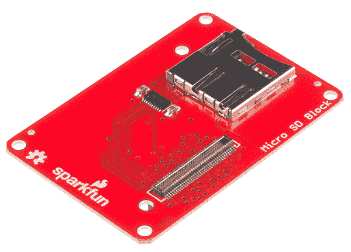
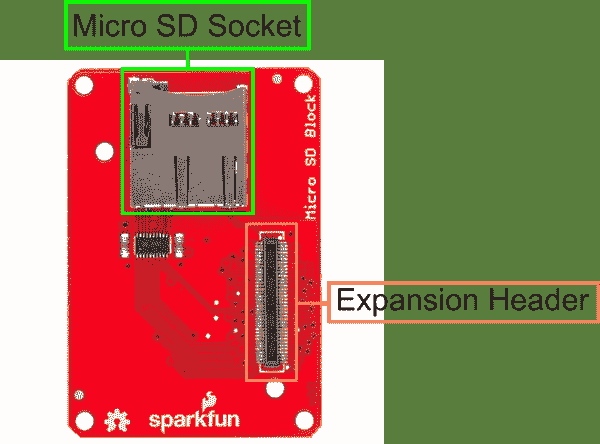
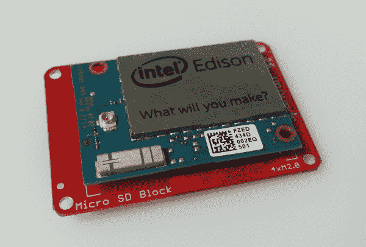
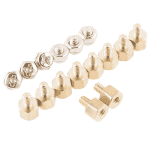

# 英特尔 Edison - microSD 模块的 SparkFun 模块

> 原文：<https://learn.sparkfun.com/tutorials/sparkfun-blocks-for-intel-edison---microsd-block>

## 介绍

[microSd 块](https://www.sparkfun.com/products/13041)是为您的项目存储较大文件和数据的好方法。microSD 模块允许 Edison 安装一个 [microSD 卡](https://www.sparkfun.com/products/11609)作为内部驱动器。用你的爱迪生做一个数据记录器或移动文件服务器！

[](https://cdn.sparkfun.com/assets/learn_tutorials/2/7/9/MicroSdBlock-01.jpg)*microSD Block*

### 推荐阅读

如果你不熟悉积木，看看英特尔爱迪生的[spark fun 积木通用指南。](https://learn.sparkfun.com/tutorials/general-guide-to-sparkfun-blocks-for-intel-edison)

其他可能对您的爱迪生之旅有所帮助的教程包括:

*   [为您的项目提供动力](https://learn.sparkfun.com/tutorials/how-to-power-a-project)
*   [连接器基础知识](https://learn.sparkfun.com/tutorials/connector-basics)

## 主板概述

[](https://cdn.sparkfun.com/assets/learn_tutorials/2/7/9/microSDAnnotated.png)*MicroSD Block Functional Diagram*

*   微型 SD 插座-在这里插入微型 SD 卡。块进行适当的卡检测和电平转换。

*   扩展接头-70 针扩展接头发挥了英特尔 Edison 的功能。该头部还在整个电池组中传递信号和电力。这些功能很像一个 Arduino 盾牌。

## 使用 microSD 模块

要使用 microSD 模块，请在主板背面安装一个 Intel Edison，或者将其添加到您当前的堆栈中。块可以在没有硬件的情况下堆叠，但是这使得扩展连接器不受机械应力的保护。

[](https://cdn.sparkfun.com/assets/learn_tutorials/2/7/9/20150109_121835.jpg)*microSD Block Installed*

我们有一个很好的[硬件包](https://www.sparkfun.com/products/13187)可以提供足够的硬件来保护三个街区和一个爱迪生。

[](https://cdn.sparkfun.com/assets/learn_tutorials/2/8/6/EdisonHardware_1.jpg)[*Intel Edison Hardware Pack*](https://www.sparkfun.com/products/13187)

注意:microSD 分线块没有控制台入口或电源。建议将控制台通信模块与该模块结合使用，就像在[英特尔 Edison](https://learn.sparkfun.com/tutorials/general-guide-to-sparkfun-blocks-for-intel-edison#console-communication-blocks)spark fun 模块通用指南中找到的模块一样。

使用 microSD 块最简单的方法是用已经安装的卡启动 Edison 堆栈。启动时，Edison 会自动找到 SD 卡并将其安装到以下目录。要查看里面的内容，请键入以下内容。

```
cd /media/sdcard/ 
```

要安全地卸载 SD 卡以进行移除，请输入以下命令。

```
umount /media/sdcard 
```

要在启动后插入卡，只需插入卡即可。Edison 应该会自动检测并安装卡。

## 资源和更进一步

现在，您已经对 microSD 块有了一个简要的概述，接下来看看其他一些教程。这些教程涵盖编程、模块堆叠以及与英特尔 Edison 生态系统的接口。

### 爱迪生通用主题:

*   [英特尔爱迪生 Sparkfun 模块通用指南](https://learn.sparkfun.com/tutorials/general-guide-to-sparkfun-blocks-for-intel-edison)
*   [Edison 入门指南-使用 Arduino 编程](https://learn.sparkfun.com/tutorials/edison-getting-started-guide)
*   [在 Edison 上加载 Debian(Ubilinix)](https://learn.sparkfun.com/tutorials/loading-debian-ubilinux-on-the-edison)

查看 SparkFun 的其他爱迪生相关教程:

[](https://learn.sparkfun.com/tutorials/sparkfun-blocks-for-intel-edison---microsd-block) [### 英特尔 Edison - microSD 模块的 SparkFun 模块](https://learn.sparkfun.com/tutorials/sparkfun-blocks-for-intel-edison---microsd-block) A quick overview of the features of the microSD Block.[Favorited Favorite](# "Add to favorites") 2[](https://learn.sparkfun.com/tutorials/programming-the-intel-edison-beyond-the-arduino-ide) [### 英特尔 Edison 编程:超越 Arduino IDE](https://learn.sparkfun.com/tutorials/programming-the-intel-edison-beyond-the-arduino-ide) Intel's Edison module goes beyond being just another Arduino clone. Check this tutorial for advice on how to get the most out of your Edison by writing code in C++ 7[](https://learn.sparkfun.com/tutorials/loading-debian-ubilinux-on-the-edison) [### 在 Edison 上加载 Debian (Ubilinux)](https://learn.sparkfun.com/tutorials/loading-debian-ubilinux-on-the-edison) How to load a Debian distribution (specifically Ubilinux) onto the Edison.[Favorited Favorite](# "Add to favorites") 5[](https://learn.sparkfun.com/tutorials/sparkfun-inventors-kit-for-edison-experiment-guide) [### 爱迪生实验指南](https://learn.sparkfun.com/tutorials/sparkfun-inventors-kit-for-edison-experiment-guide) Learn how to harness the power of the Intel® Edison using JavaScript to post data to the cloud, control electronics from smartphones, and host web pages that interact with circuits.[Favorited Favorite](# "Add to favorites") 4