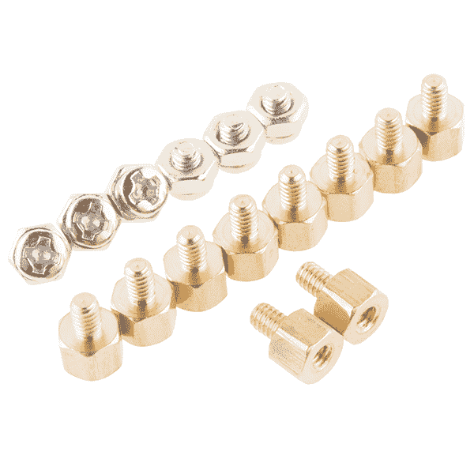

# 面向英特尔 Edison 的 SparkFun 模块-基本模块

> 原文：<https://learn.sparkfun.com/tutorials/sparkfun-blocks-for-intel-edison---base-block->

## 介绍

[基块](https://www.sparkfun.com/products/13045)是任何爱迪生堆栈的伟大基础。该基座可用于将 Edison 作为文件系统安装在主机上或访问控制台端口。基本模块提供与[英特尔 Edison 和迷你分线板](https://www.sparkfun.com/products/13025)相同的功能，并增加了通过控制台端口为 Edison 供电的能力，从而释放 OTG 端口供设备使用。使用此模块加载新的操作系统映像或固件。

[](https://cdn.sparkfun.com/assets/learn_tutorials/2/8/0/13045-01Crop.jpg)*Base Block*

### 推荐阅读

如果你不熟悉积木，看看英特尔爱迪生的[spark fun 积木通用指南。](https://learn.sparkfun.com/tutorials/general-guide-to-sparkfun-blocks-for-intel-edison)

其他可能对您的爱迪生之旅有所帮助的教程包括:

*   [为您的项目提供动力](https://learn.sparkfun.com/tutorials/how-to-power-a-project)
*   [连接器基础知识](https://learn.sparkfun.com/tutorials/connector-basics)

## 主板概述

[](https://cdn.sparkfun.com/assets/learn_tutorials/2/8/0/BaseAnnotated.png)*Base Block Functional Diagram*

*   USB OTG-USB 微型 AB 端口提供对爱迪生 OTG 端口的访问。该端口能够向 OTG 设备供电，或者可以通过该端口向爱迪生供电。

*   控制台-微型 USB B 端口为英特尔 Edison 堆栈提供电源和控制台访问端口。该模块通过 VSYS 线路向 Edison 和其他模块提供 4V 电压。根据负载的不同，该电压最高可达+/-0.1V。

*   电源按钮-电源开关连接到爱迪生的“PWRBTN”线上。这使用户能够将 Edison 置于睡眠状态或完全关闭模块。这不影响堆栈中其他模块的电源。

*   电源 LED -当 VSYS 通电时，电源 LED 会亮起。这可能来自控制台模块，或堆栈中的任何其他供电模块。

*   数据指示灯-数据指示灯帮助用户识别控制台是否处于活动状态。这是我们的 [FTDI 分线点](https://www.sparkfun.com/products/9716)上常见的一个特征。

*   LED 跳线-如果功耗是一个问题，切断每个跳线禁用 LED

*   扩展接头-70 针扩展接头发挥了英特尔 Edison 的功能。该头部还在整个电池组中传递信号和电力。这些功能很像一个 Arduino 盾牌。

## 使用基块

要使用基本模块，请将英特尔 Edison 连接到主板背面，或者将其添加到您当前的堆栈中。块可以在没有硬件的情况下堆叠，但是这使得扩展连接器不受机械应力的保护。

[](https://cdn.sparkfun.com/assets/learn_tutorials/4/7/5/Smart_Mirror_Project-01.jpg)*Base Block Installed*

我们有一个很好的[硬件包](https://www.sparkfun.com/products/13187)可以提供足够的硬件来保护三个街区和一个爱迪生。

[](https://cdn.sparkfun.com/assets/learn_tutorials/3/1/2/EdisonHardware.jpg)[*Intel Edison Hardware Pack*](https://www.sparkfun.com/products/13187)

### 连接到控制台

连接硬件后，将[微型 USB 线](https://www.sparkfun.com/products/10215)插入模块。如果您目前没有安装 FTDI 驱动程序，您需要在使用 Edison 之前下载并安装它们。访问我们的[教程](https://learn.sparkfun.com/tutorials/how-to-install-ftdi-drivers)获取如何安装驱动程序的指导。确保驱动程序已安装且设备正在运行后，打开您最喜欢的终端程序，并将其指向 USB 串行连接。我们还有另一个教程来解释[终端程序以及如何使用它们](https://learn.sparkfun.com/tutorials/terminal-basics)。

标准波特率为 115200bps。

打开串口后，**试着按几次 enter** 。如果一切顺利，Edison 应该会响应一个登录提示。

默认的 Edison 登录名是根用户**。没有密码...还没有。如果您想现在设置一个，您可以运行`passwd`，但是当您更新固件映像时，它将被清除。(详见[爱迪生入门指南](https://learn.sparkfun.com/tutorials/edison-getting-started-guide)。)**

 **登录后，您就可以开始探索了！

[](https://cdn.sparkfun.com/assets/learn_tutorials/3/1/2/ConsoleTerminalView.PNG)

### 使用 OTG 港

英特尔在无缝实现 OTG 港功能方面做得非常出色。如果您希望将 Edison 作为大容量文件存储设备或网络设备访问，请将 USB 微型 B 电缆从主机插入 OTG 端口。该设备应该会自动出现。

[](https://cdn.sparkfun.com/assets/learn_tutorials/2/8/0/EdisonPopUp.PNG)

您还可以通过 OTG 端口将新的操作系统映像加载到 Edison。更多细节参见[在 Edison](/tutorials/loading-debian-ubilinux-on-the-edison) 上加载 Debian Ubilinux 教程。

要在 Edison 上使用 USB 设备，请使用我们的 [USB OTG 线](https://www.sparkfun.com/products/11604)并插入您的设备。爱迪生将为小型 USB 设备提供必要的电力。要查找连接的设备，请在控制台会话中输入以下命令。

```
lsusb 
```

这应该列出任何可用的 USB 设备安装。

### 使用电源按钮

Edison 上的电源按钮带来了一个在单板计算机上通常找不到的独特功能。电源按钮的行为与台式机和笔记本电脑上的电源按钮非常相似。

*   通电时，按住电源按钮约 10 秒钟将关闭 Edison。
*   断电时，短暂按下电源按钮将重启 Edison。
*   通电时，短暂按下电源按钮会将 Edison 置于睡眠模式。
*   在睡眠模式下，短按电源按钮会唤醒爱迪生。

## 资源和更进一步

现在，您已经对基础模块有了一个简要的概述，让我们来看看其他一些教程。这些教程涵盖编程、模块堆叠以及与英特尔 Edison 生态系统的接口。

## 爱迪生通用主题:

*   [英特尔爱迪生 Sparkfun 模块通用指南](https://learn.sparkfun.com/tutorials/general-guide-to-sparkfun-blocks-for-intel-edison)
*   [爱迪生入门指南](https://learn.sparkfun.com/tutorials/edison-getting-started-guide)
*   [在 Edison 上加载 Debian(Ubilinix)](https://learn.sparkfun.com/tutorials/loading-debian-ubilinux-on-the-edison)

## 阻止特定主题:

*   [如何安装 FTDI 驱动](https://learn.sparkfun.com/tutorials/how-to-install-ftdi-drivers)
*   [基块 Github Repo](https://github.com/sparkfun/Edison_Base_Block)

查看 SparkFun 的其他爱迪生相关教程:

[](https://learn.sparkfun.com/tutorials/sparkfun-blocks-for-intel-edison---oled-block-) [### 英特尔爱迪生有机发光二极管模块的 SparkFun 模块](https://learn.sparkfun.com/tutorials/sparkfun-blocks-for-intel-edison---oled-block-) A quick overview of the features of the OLED Block for the Edison.[Favorited Favorite](# "Add to favorites") 3[](https://learn.sparkfun.com/tutorials/sparkfun-blocks-for-intel-edison---i2c-breakout-block) [### 英特尔爱迪生 I2C 分线块的火花块](https://learn.sparkfun.com/tutorials/sparkfun-blocks-for-intel-edison---i2c-breakout-block) A quick overview of the features of the I2C Breakout Block.[Favorited Favorite](# "Add to favorites") 2[](https://learn.sparkfun.com/tutorials/installing-libmraa-on-ubilinux-for-edison) [### 在 Edison 的 Ubilinux 上安装 libmraa](https://learn.sparkfun.com/tutorials/installing-libmraa-on-ubilinux-for-edison) libmraa is a tool kit for interacting with various Intel single board computers.[Favorited Favorite](# "Add to favorites") 2[](https://learn.sparkfun.com/tutorials/using-an-lcd-on-the-edison) [### 在爱迪生上使用液晶显示器](https://learn.sparkfun.com/tutorials/using-an-lcd-on-the-edison) How to connect an LCD controlled by an ILI9341 driver to the Intel® Edison.[Favorited Favorite](# "Add to favorites") 5**