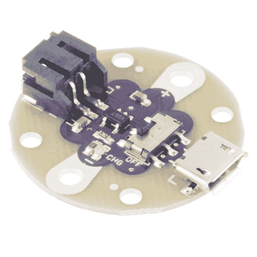
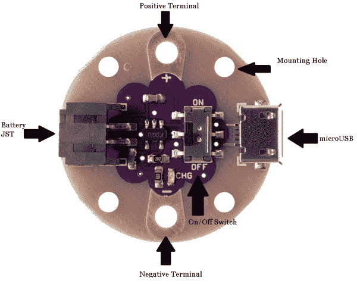
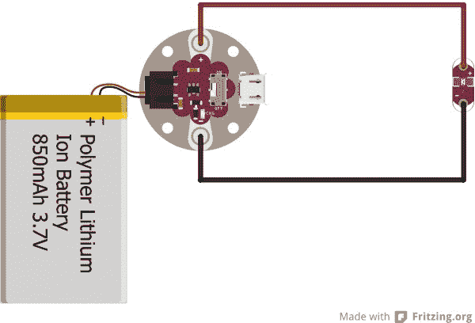

# LilyPad 简易电源连接指南

> 原文：<https://learn.sparkfun.com/tutorials/lilypad-simple-power-hookup-guide>

## 介绍

[LilyPad Simple Power](https://www.sparkfun.com/products/11893) 是一个基本的电源板，可以让你用 lipo 电池为你的可穿戴电路供电。它还允许通过 [micro-B 电缆](https://www.sparkfun.com/products/10215)在电路中为电池充电，并为您的项目提供一个漂亮的开/关开关。

 

将**添加到您的[购物车](https://www.sparkfun.com/cart)中！**

 **### [LilyPad 简单动力](https://www.sparkfun.com/products/11893)

[In stock](https://learn.sparkfun.com/static/bubbles/ "in stock") DEV-11893

LilyPad Simple Power 是一个简单的 e-textile 板，充电速率为 500mA，可让您连接和充电 lipo 电池…

$11.50[Favorited Favorite](# "Add to favorites") 18[Wish List](# "Add to wish list")** **作为 [LilyPad 系列电路板](https://www.sparkfun.com/search/results?term=lilypad)的一部分，你甚至可以在将电路板缝制到衣服上后清洗它。只要记住在进行任何洗涤之前先**取下电池**！

通过这个快速教程，你将学会如何开始使用简单的力量。

### 推荐阅读

如果你对这些话题不熟悉，请看看下面的教程。

 [### 电池技术](https://learn.sparkfun.com/tutorials/battery-technologies) The basics behind the batteries used in portable electronic devices: LiPo, NiMH, coin cells, and alkaline.[Favorited Favorite](# "Add to favorites") 50 [### 如何为项目提供动力](https://learn.sparkfun.com/tutorials/how-to-power-a-project) A tutorial to help figure out the power requirements of your project.[Favorited Favorite](# "Add to favorites") 67 [### LilyPad 基础:电子缝纫](https://learn.sparkfun.com/tutorials/lilypad-basics-e-sewing) Learn how to use conductive thread with LilyPad components.[Favorited Favorite](# "Add to favorites") 16 [### LilyPad 基础:为您的项目提供动力](https://learn.sparkfun.com/tutorials/lilypad-basics-powering-your-project) Learn the options for powering your LilyPad projects, LiPo battery safety and care, and how to calculate and consider power constraints on your projects.[Favorited Favorite](# "Add to favorites") 8

## 硬件概述

名副其实，LilyPad Simple power 真的很简单！您只需要了解几个特性。

### 电池 JST 连接器

简单的电源设计用于 3.7V 的脂肪电池。为了将电池连接到板上，电池上应该有一个母 [JST 连接器](https://www.sparkfun.com/products/8671)。

⚡ **Warning!** The charge rate for the MCP73831's is set at **500mA**. Make sure to have a battery that is higher than 500mAh to safely charge the LiPo battery.

 

将**添加到您的[购物车](https://www.sparkfun.com/cart)中！**

 **### [锂离子电池-1Ah](https://www.sparkfun.com/products/13813)

[In stock](https://learn.sparkfun.com/static/bubbles/ "in stock") PRT-13813

基于锂离子化学的超薄超轻电池。每个电池在 1000 毫安时输出 3.7V 的标称电压！

$10.958[Favorited Favorite](# "Add to favorites") 75[Wish List](# "Add to wish list")**** 

将**添加到您的[购物车](https://www.sparkfun.com/cart)中！**

 **### [锂离子电池- 850mAh](https://www.sparkfun.com/products/13854)

[In stock](https://learn.sparkfun.com/static/bubbles/ "in stock") PRT-13854

这是基于锂离子化学的非常薄、非常轻的电池。每个电池在 850℃时输出 3.7V 的标称电压…

$10.952[Favorited Favorite](# "Add to favorites") 17[Wish List](# "Add to wish list")**** 

将**添加到您的[购物车](https://www.sparkfun.com/cart)中！**

 **### [锂离子电池- 2Ah](https://www.sparkfun.com/products/13855)

[In stock](https://learn.sparkfun.com/static/bubbles/ "in stock") PRT-13855

这是基于锂离子化学的非常薄、非常轻的电池。每个电池在 200 伏时输出一个标称的 3.7 伏电压…

$13.959[Favorited Favorite](# "Add to favorites") 43[Wish List](# "Add to wish list")**** 

将**添加到您的[购物车](https://www.sparkfun.com/cart)中！**

 **### [锂离子电池- 6Ah](https://www.sparkfun.com/products/13856)

[In stock](https://learn.sparkfun.com/static/bubbles/ "in stock") PRT-13856

如果你需要一些果汁，这 6Ah 锂离子电池是给你的。这些是基于锂离子化学电池的非常紧凑的电池…

$32.507[Favorited Favorite](# "Add to favorites") 40[Wish List](# "Add to wish list")******** ********### 微型 B 连接器

这使你可以通过电脑 USB 端口，使用 micro-B USB 电缆为电池充电。

### 正极/负极端子

这些下水道分接头是电路供电的连接点。正极端子输出 3.7V，负极端子是接地(GND)连接。

### 开/关开关

此开关启用和禁用 LilyPad Simple 板的电源输出。当它处于“on”位置时，您可以测量正极(+)和负极(-)端子之间的电池电压。当它处于“关闭”位置时，电路板没有可测量的电压输出。

### 安装孔

这四个孔分布在整个板上，被设计为附加的锚定缝分接头。它们不导电，也没有电气功能。

## 硬件连接

在我们的例子中，我们将假设您正在为一个基本的 [LilyPad LED](https://www.sparkfun.com/products/10045) 供电。然而，你可以使用简单的电源为 [LilyPad 主板](https://www.sparkfun.com/products/9266)或其他各种产品供电。

关于 Simple Power 有一点需要注意——它是为电子纺织品应用而设计的，但是你 [*可以*焊接到电路板上](https://learn.sparkfun.com/tutorials/how-to-solder-through-hole-soldering)。请记住，将电线连接到缝纫龙头需要更多的焊料和热量。

*Our example circuit using the Simple Power and a LilyPad LED.*

找到 Simple Power 上的“+”端子，将针脚/电线连接到 LED(或您正在供电的任何电路板)上的“+”sew 抽头。然后从简单电源上的'-'端子到 LED 上的'-'缝纫分接头走线或缝合。如果你使用导电线，确保不要让两条线接触！这会让你的电池短路，可能会让你的简单电源短路，你会过得很不好。

一旦你的电路板连接好，插上电池，把简单的电源开关拨到“开”的位置。沐浴在快乐的 LED 光芒中！

### 给电池充电

如果你的电池没电了，不要害怕！只需将 microUSB 电缆插入您的电脑和 LilyPad Simple 板，并耐心等待。有一个黄色的 LED 指示灯，指示主板正在给电池充电。充电时，电路板也可能会变热，但这是完全正常的。充电时间会因连接到简单电源的电池容量而异。

## 资源和更进一步

既然您已经知道了如何使用 LilyPad 的简单功能，那么您可以开始将它集成到您自己的项目中了。要了解更多信息，请查看以下资源:

*   [示意图(PDF)](https://cdn.sparkfun.com/datasheets/E-Textiles/Lilypad/LilyPad_Simple_Power_v21.pdf)
*   [老鹰文件(ZIP)](https://cdn.sparkfun.com/datasheets/E-Textiles/Lilypad/LilyPad_Simple_Power_v21.zip)
*   [MCP73831 数据手册(PDF)](http://cdn.sparkfun.com/datasheets/Components/General%20IC/33244_SPCN.pdf)
*   [GitHub(设计文件)](https://github.com/sparkfun/LilyPad_Simple_Power/tree/master)

查看这些附加资源，了解更多信息和其他项目想法。

 [### 龙与地下城骰子战书](https://learn.sparkfun.com/tutorials/dungeons-and-dragons-dice-gauntlet) A playful, geeky tutorial for a leather bracer that uses a LilyPad Arduino, LilyPad accelerometer, and seven segment display to roll virtual 4, 6, 8, 10, 12, 20, and 100 side dice for gaming.[Favorited Favorite](# "Add to favorites") 9 [### 介绍 LilyPad 设计套件！](https://learn.sparkfun.com/tutorials/introducing-the-lilypad-design-kit) [Favorited Favorite](# "Add to favorites") 7 [### LiPo USB 充电器连接指南](https://learn.sparkfun.com/tutorials/lipo-usb-charger-hookup-guide) How to charge your LiPo batteries with the USB LiPo charger. Plus how to modify your charger to set the charge current.[Favorited Favorite](# "Add to favorites") 9 [### 照明面罩](https://learn.sparkfun.com/tutorials/illuminated-mask) Use LilyPad LEDs, a switched battery holder, and coin cell battery to make a fun light up mask for your next costume party.[Favorited Favorite](# "Add to favorites") 6

* * *

如果您有任何反馈，请访问[评论](https://learn.sparkfun.com/tutorials/lilypad-simple-power-hookup-guide/discuss)或联系我们在 TechSupport@sparkfun.com[的技术支持团队](mailto:techsupport@sparkfun.com?subject=)。**********