# 如何使用万用表

> 原文：<https://learn.sparkfun.com/tutorials/how-to-use-a-multimeter>

## 介绍

因此...如何使用[万用表](http://en.wikipedia.org/wiki/Multimeter)？本教程将向您展示如何使用数字万用表(DMM ),这是一个不可或缺的工具，您可以使用它来诊断电路，了解他人的电子设计，甚至测试电池。因此有了“多”米(多次测量)的名称。

我们测量的最基本的东西是电压和电流。万用表也非常适合一些基本的健全性检查和故障排除。你的电路坏了吗？开关工作吗？放一个计量器在上面！对系统进行故障诊断时，万用表是您的第一道防线。在本教程中，我们将涵盖测量[电压、电流、电阻](http://learn.sparkfun.com/tutorials/voltage-current-resistance-and-ohms-law)和连续性。

* * *

## 推荐阅读

These concepts may be helpful with this tutorial:

*   [如何使用多表分发器](https://learn.sparkfun.com/resources/120)
*   [什么是电？](https://learn.sparkfun.com/tutorials/what-is-electricity)
*   [电压、电流、电阻和欧姆定律](http://learn.sparkfun.com/tutorials/voltage-current-resistance-and-ohms-law)
*   [什么是电路？](http://learn.sparkfun.com/tutorials/what-is-a-circuit)
*   [公制前缀](https://learn.sparkfun.com/tutorials/metric-prefixes-and-si-units)
*   [如何使用试验板](https://learn.sparkfun.com/tutorials/how-to-use-a-breadboard)
*   [连接器基础](https://learn.sparkfun.com/tutorials/connector-basics)
*   [极性](https://learn.sparkfun.com/tutorials/polarity)
*   [串联和并联电路](https://learn.sparkfun.com/tutorials/series-and-parallel-circuits)
*   [交流对 DC 电流](https://learn.sparkfun.com/tutorials/alternating-current-ac-vs-direct-current-dc)
*   [PCB 基础知识](https://learn.sparkfun.com/tutorials/pcb-basics)

我们将在整个教程中使用 [SparkFun VC830L](https://www.sparkfun.com/products/12966) ，但这些方法应该适用于大多数万用表。

[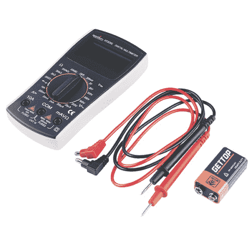](https://www.sparkfun.com/products/12966) 

将**添加到您的[购物车](https://www.sparkfun.com/cart)中！**

### [-数字万用表基础](https://www.sparkfun.com/products/12966)

[In stock](https://learn.sparkfun.com/static/bubbles/ "in stock") TOL-12966

数字万用表(DMM)是每个电子爱好者的必备工具。斯帕克芬数字万用表，高…

$16.50 $9.9023[Favorited Favorite](# "Add to favorites") 57[Wish List](# "Add to wish list")** **## 录像

[https://www.youtube.com/embed/SLkPtmnglOI?ecver=2](https://www.youtube.com/embed/SLkPtmnglOI?ecver=2)

## 寻找适合你的万用表？

我们掩护你！

 

将**添加到您的[购物车](https://www.sparkfun.com/cart)中！**

### [-数字万用表基础](https://www.sparkfun.com/products/12966)

[In stock](https://learn.sparkfun.com/static/bubbles/ "in stock") TOL-12966

数字万用表(DMM)是每个电子爱好者的必备工具。斯帕克芬数字万用表，高…

$16.50 $9.9023[Favorited Favorite](# "Add to favorites") 57[Wish List](# "Add to wish list")****[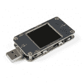](https://www.sparkfun.com/products/15571) 

将**添加到您的[购物车](https://www.sparkfun.com/cart)中！**

### [【USB 功率表(彩色 TFT 液晶)](https://www.sparkfun.com/products/15571)

[In stock](https://learn.sparkfun.com/static/bubbles/ "in stock") TOL-15571

这个 USB 功率计是一个多功能的工具，可以提供电压，电流，容量和阻抗显示在内置的…

$26.956[Favorited Favorite](# "Add to favorites") 25[Wish List](# "Add to wish list")****[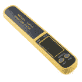](https://www.sparkfun.com/products/10829) 

将**添加到您的[购物车](https://www.sparkfun.com/cart)中！**

### [智能贴片测试仪](https://www.sparkfun.com/products/10829)

[In stock](https://learn.sparkfun.com/static/bubbles/ "in stock") TOL-10829

这款智能 SMD 测试仪本质上就是一把万用表镊子。这使您可以用小型 SMD p 排除电路故障…

$29.951[Favorited Favorite](# "Add to favorites") 19[Wish List](# "Add to wish list")****[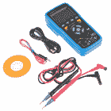](https://www.sparkfun.com/products/retired/12967) 

### [【USB 数字万用表-自动测距(RS232 输出)](https://www.sparkfun.com/products/retired/12967)

[Retired](https://learn.sparkfun.com/static/bubbles/ "Retired") TOL-12967

现在似乎所有的东西都可以插入你的电脑，这台数字万用表也不例外。这种自动测距…

6 **Retired**[Favorited Favorite](# "Add to favorites") 33[Wish List](# "Add to wish list")************[See all of our Multimeter options](https://www.sparkfun.com/categories/372)****** ******* * *

## 万用表的零件

[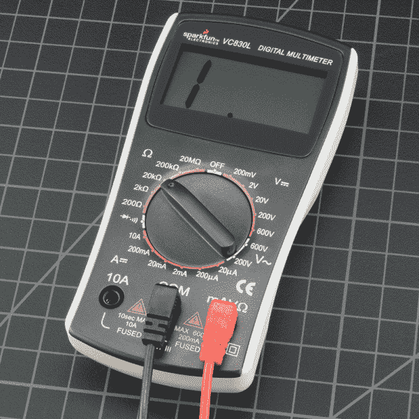](https://cdn.sparkfun.com/assets/learn_tutorials/1/01_Multimeter_Tutorial-01.jpg)

万用表由三部分组成:

*   显示
*   选择旋钮
*   港口

**显示屏**通常有四个数字，并且能够显示负号。一些万用表有带照明的显示屏，以便在光线较暗的情况下更好地观察。

**选择旋钮**允许用户设置万用表读取不同的东西，如[电流](https://learn.sparkfun.com/tutorials/voltage-current-resistance-and-ohms-law#current)、[电压](https://learn.sparkfun.com/tutorials/voltage-current-resistance-and-ohms-law#voltage) (V)和[电阻](https://learn.sparkfun.com/tutorials/voltage-current-resistance-and-ohms-law#resistance) ( &欧姆；).

两个探头插入装置前面的两个**端口**。 **COM** 代表公共端，几乎总是与电路的地或“-”相连。 **COM** 探头通常是黑色的，但是除了颜色之外，红色探头和黑色探头没有区别。 **10A** 是测量大电流(大于 200mA)时使用的专用端口。**MAVω**是红色探针通常插入的端口。该端口允许测量电流(高达 200mA)、电压(V)和电阻(&ohm；).探针末端有一个插入万用表的*香蕉*型连接器。任何带香蕉插头的探头都可以和这个仪表一起工作。这允许使用不同类型的[探头](https://www.sparkfun.com/search/results?term=banana&what=products)。

[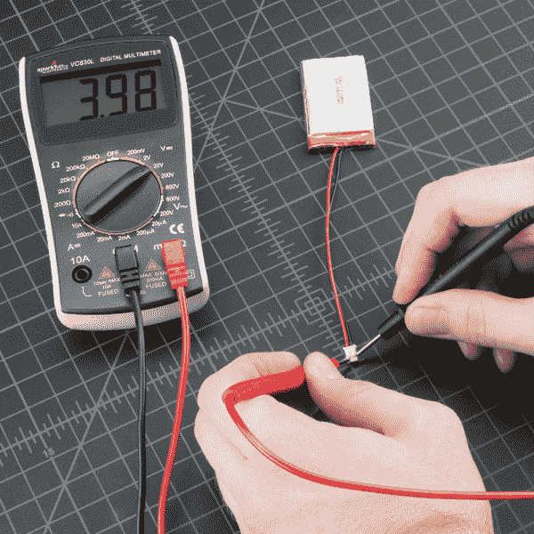](https://cdn.sparkfun.com/assets/learn_tutorials/1/01_Multimeter_Tutorial-03.jpg)*Using a Multimeter to test the voltage on a LiPo Battery.*

* * *

## 探针类型

万用表有许多不同类型的探头。以下是我们最喜欢的几个:

*   [香蕉到鳄鱼夹](https://www.sparkfun.com/products/509):这些都是很棒的电缆，用于连接试验板上的大型电线或引脚。适用于执行长期测试，在这种情况下，当您操作电路时，不必将探针固定在适当的位置。
*   [香蕉到 IC 挂钩](https://www.sparkfun.com/products/506) : IC 挂钩适用于较小的 IC 和 IC 引脚。
*   [香蕉到镊子](https://www.sparkfun.com/products/11060):如果你需要测试 SMD 元件，镊子是很方便的。
*   测试探针的香蕉:如果你的探针坏了，更换它们很便宜！

 

将**添加到您的[购物车](https://www.sparkfun.com/cart)中！**

### [香蕉到 IC 钩线缆](https://www.sparkfun.com/products/506)

[Out of stock](https://learn.sparkfun.com/static/bubbles/ "out of stock") CAB-00506

这些是用于连接万用表、电源、示波器、信号发生器等的各种引线电缆。电缆…

$5.507[Favorited Favorite](# "Add to favorites") 10[Wish List](# "Add to wish list")**** 

将**添加到您的[购物车](https://www.sparkfun.com/cart)中！**

### [香蕉对鳄索](https://www.sparkfun.com/products/509)

[Out of stock](https://learn.sparkfun.com/static/bubbles/ "out of stock") CAB-00509

这些是用于连接万用表、电源、示波器、信号发生器等的各种引线电缆。电缆…

$4.503[Favorited Favorite](# "Add to favorites") 18[Wish List](# "Add to wish list")**** 

### [万用表探针-镊子](https://www.sparkfun.com/products/retired/11060)

[Retired](https://learn.sparkfun.com/static/bubbles/ "Retired") TOL-11060

用标准测试引线测试表面贴装元件绝非易事。每个人都有自己的方法:有些人尝试…

5 **Retired**[Favorited Favorite](# "Add to favorites") 18[Wish List](# "Add to wish list") 

将**添加到您的[购物车](https://www.sparkfun.com/cart)中！**

### [万用表表笔-针尖](https://www.sparkfun.com/products/12078)

[In stock](https://learn.sparkfun.com/static/bubbles/ "in stock") TOL-12078

这些针尖万用表探针是伟大的附加到万用表，电源，示波器，函数发生器…

$5.5011[Favorited Favorite](# "Add to favorites") 18[Wish List](# "Add to wish list")****** ******* * *

## 测量电压

首先，让我们测量 AA 电池的电压:将黑色探针插入 **COM** ，将红色探针插入**MAVω**。将万用表设在 DC(直流)档的“2V”档。几乎所有的便携式电子产品都使用[直流电](https://learn.sparkfun.com/tutorials/alternating-current-ac-vs-direct-current-dc/direct-current-dc)，而不是[交流电](https://learn.sparkfun.com/tutorials/alternating-current-ac-vs-direct-current-dc/alternating-current-ac)。将黑色探针连接到电池的地或“-”，将红色探针连接到电源或“+”。用一点压力将探针挤压在 AA 电池的正极和负极端子上。如果你有一个新电池，你应该在显示屏上看到 1.5V 左右(这个电池是全新的，所以它的电压略高于 1.5V)。

[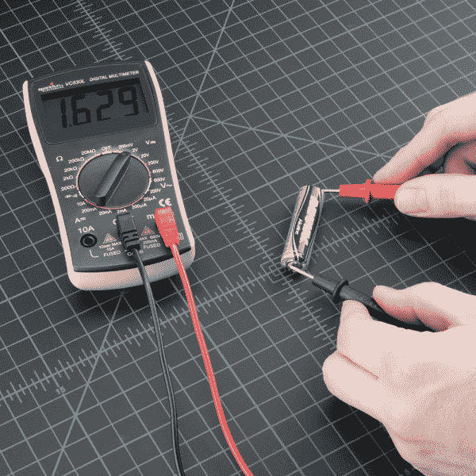](https://cdn.sparkfun.com/assets/learn_tutorials/4/2/8/01_Multimeter_Tutorial-02.jpg)

如果您正在测量 DC 电压(如电池或连接到 Arduino 的传感器)，您需要将旋钮设置在 V 为直线的位置。交流电压(比如墙上的东西)可能会很危险，所以我们很少需要使用交流电压设置(旁边有波浪线的 V)。如果你在摆弄交流电，我们建议你用一个[非接触式测试仪](https://www.google.com/#hl=en&q=fluke%20non-contact%20voltage%20tester)而不是数字万用表。

[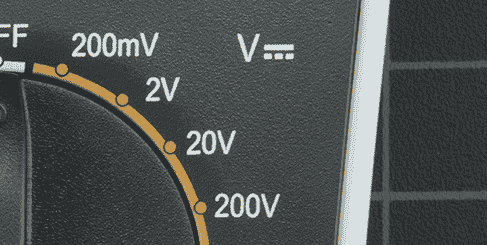](https://cdn.sparkfun.com/assets/learn_tutorials/1/01_VoltsDC0.jpg)Use the V with a straight line to measure DC Voltage[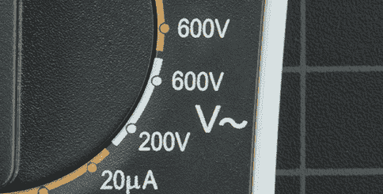](https://cdn.sparkfun.com/assets/learn_tutorials/1/01_VoltsAC.jpg)Use the V with a wavy line to measure AC Voltage

如果你调换红色和黑色的探针会发生什么？万用表上的读数就是负值。没有不好的事情发生！万用表测量与公共探针相关的电压。与公共引脚或负极引脚相比，电池的“+”引脚上的电压是多少？1.5V。如果我们切换探头，我们将'+'定义为公共点或零点。与我们的新零点相比，电池的“-”号上的电压是多少？-1.5V！

[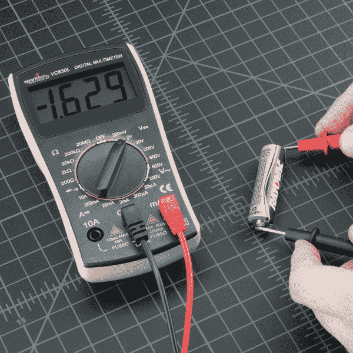](https://cdn.sparkfun.com/assets/learn_tutorials/1/01_Multimeter_Tutorial-04.jpg)

现在，让我们构建一个简单的电路来演示如何在现实世界中测量电压。该电路只是一个 1k 的&ohm;和一个蓝色的超亮 LED，由一个 [SparkFun 试验板供电棒](https://www.sparkfun.com/products/10804)供电。首先，让我们确保您正在处理的电路已正确通电。如果您的项目应该是 5V，但低于 4.5V 或高于 5.5V，这将很快给你一个指示，有些事情是错误的，你可能需要检查您的电源连接或电路布线。

[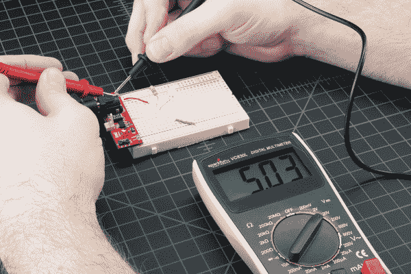](https://cdn.sparkfun.com/assets/learn_tutorials/1/01_Multimeter_Tutorial-17.jpg)*Measuring the voltage coming off of a Power Supply Stick.*

在 DC 范围内将旋钮设置为“20V”(DC 电压范围有一个 V，旁边有一条直线)。万用表通常不会自动量程转换。你必须把万用表设在它能测量的范围内。例如， **2V** 测量电压**高达 2 伏**，而 **20V** 测量电压**高达 20 伏**。因此，如果您测量的是 12V 电池，请使用 20V 设置。5V 系统？使用 20V 设置。如果设置不正确，您可能会看到血糖仪屏幕发生变化，然后显示“1”。

[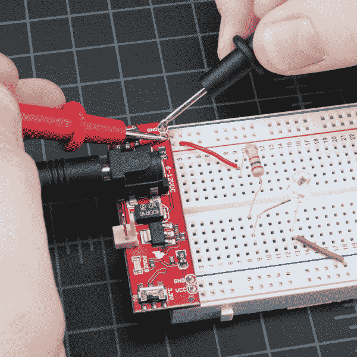](https://cdn.sparkfun.com/assets/learn_tutorials/1/01_Multimeter_Tutorial-18.jpg)

用力(想象用叉子戳一块熟肉)，将探针推到两块暴露的金属上。一个探针应该接触 GND 连接。一个探针连接到 VCC 或 5V 连接。

我们也可以测试电路的不同部分。这种做法叫做[节点分析](http://en.wikipedia.org/wiki/Nodal_analysis)，是电路分析中的一个基本积木块。通过测量电路两端的电压，我们可以知道每个元件需要多少电压。让我们先测量整个电路。从电压进入电阻的位置开始测量，然后从 LED 的接地位置开始测量，我们应该可以看到电路的全电压，预计约为 5V。

然后我们可以看到 LED 使用了多少电压。这就是所谓的 LED 两端的**电压降**。如果现在这还不合理，不用担心。随着你对电子世界的探索越来越多，它会变得越来越有用。重要的是，可以测量电路的不同部分，以便从整体上分析电路。

[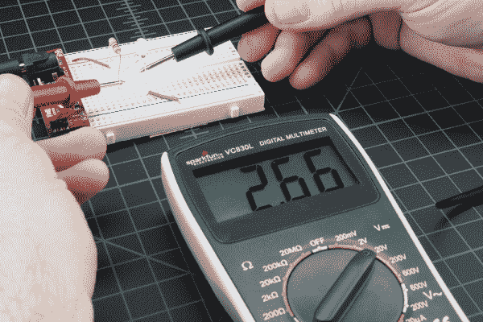](https://cdn.sparkfun.com/assets/learn_tutorials/1/01_Multimeter_Tutorial-20.jpg)*This LED is using 2.66V of the available 5V supply to illuminate. This is lower than the forward voltage stated in the [datasheet](http://www.sparkfun.com/datasheets/Components/YSL-R542B5C-A11.pdf) on account of the circuit only having small amount of current running though it, but more on that in a bit.*

### 过多

如果您选择的电压设置对于您要测量的电压来说太低，会发生什么情况？没什么不好的。仪表将简单地显示 1。这是血糖仪试图告诉你它超载或超出范围。无论你想读什么，对那个特定的环境来说都太多了。尝试将万用表旋钮调到下一个最高设置。

[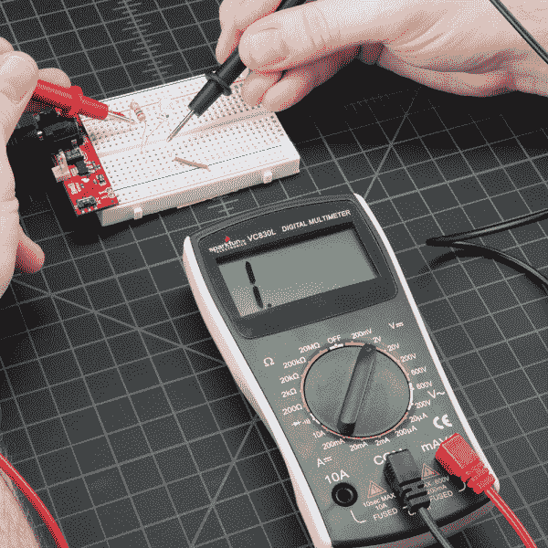](https://cdn.sparkfun.com/assets/learn_tutorials/1/01_Multimeter_Tutorial-23.jpg)*Reading the 5V across this circuit is too much for the 2V setting on the multimeter.*

### 选择旋钮

[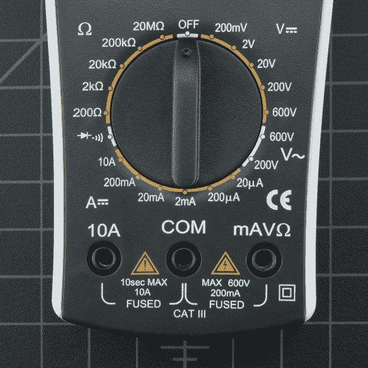](https://cdn.sparkfun.com/assets/learn_tutorials/1/01_Multimeter_Tutorial-24.jpg)

为什么仪表旋钮显示 20V 而不是 10V？如果你想测量低于 20V 的电压，你可以选择 20V 的设置。这将允许您从 **2.00** 读取到 **19.99** 。

许多万用表的第一个数字只能显示“1 ”,因此量程限于 **1** 9.99，而不是 **9** 9.99。因此，最大范围为 20V，而不是 99V。

**Warning!** In general, stick to DC circuits (the settings on the multimeter with straight lines, not curvy lines). Most multimeters can measure AC (alternating current) systems, but AC circuits can be dangerous. A wall outlet with AC or 'main voltage' is the stuff that can zap you pretty good. VERY carefully respect AC. If you need to check to see if an outlet is 'on' then use a [AC tester](https://www.google.com/#hl=en&q=fluke%20non-contact%20voltage%20tester). Really the only times we've needed to measure AC are when we've got an outlet that is acting funny (is it really at 110V?), or if we're trying to control a heater (such as a [hot plate](http://www.sparkfun.com/tutorials/59)). Go slow and double check everything before you test an AC circuit.

* * *

## 测量电阻

普通[电阻](https://learn.sparkfun.com/tutorials/resistors)上有[色标](https://learn.sparkfun.com/tutorials/resistors/all#decoding-resistor-markings)。如果你不知道它们的意思，没关系！有很多容易使用的[在线计算器](https://www.google.com/search?q=resistor+color+calculator)。然而，如果你发现自己无法上网，万用表在测量电阻时非常方便。

挑选一个随机电阻，将万用表设置为 20kΩ。然后，用与按键盘上的键相同的力度将探针抵住电阻腿。

[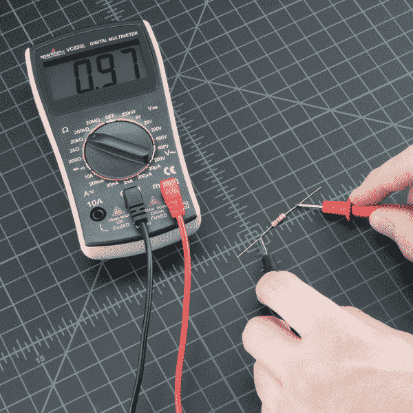](https://cdn.sparkfun.com/assets/learn_tutorials/1/01_Multimeter_Tutorial-08.jpg)

仪表将读取以下三个值之一: **0.00** 、 **1** 或**实际电阻值**。

*   在这种情况下，电表读数为 0.97，意味着该电阻的值为 970ω，约为 1kω(请记住，您处于 20kΩ或 20，000 Ohm 模式，因此需要将小数向右移动三位，即 970 Ohms)。

*   如果万用表**显示 1** 或显示 **OL** ，则过载。您需要尝试更高的模式，如**200kω**模式或**2mω**(兆欧)模式。如果发生这种情况，没有什么害处，只是意味着需要调整范围旋钮。

*   如果万用表读数为 **0.00** 或接近零，则需要将模式调低至**2kω**或**200ω**。

请记住，许多电阻都有 5%的容差。这意味着颜色代码可能表示 10，000 欧姆(10kω)，但由于制造过程中的差异，10kω电阻可能低至 9.5kΩ，也可能高达 10.5kΩ。别担心，它作为上拉电阻或通用电阻工作正常。

让我们把仪表调到下一个最低设置，2K &ohm;。会发生什么？

[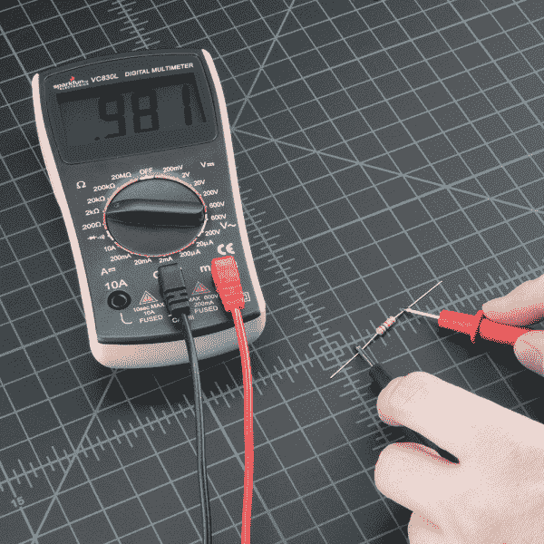](https://cdn.sparkfun.com/assets/learn_tutorials/1/01_Multimeter_Tutorial-06.jpg)

没什么变化。因为这个电阻(一个 1K &ohm;)小于 2K &ohm;，它仍然显示在显示屏上。然而，你会注意到小数点后多了一位数字，使我们的读数分辨率稍高。下一个最低设置呢？

[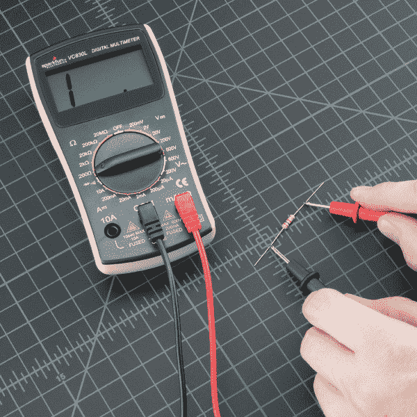](https://cdn.sparkfun.com/assets/learn_tutorials/1/01_Multimeter_Tutorial-07.jpg)

现在，由于 1k &ohm;大于 200 &ohm;，我们已经使电表达到最大值，它会告诉你它过载了，你需要尝试更高的值设置。

根据经验，很少见到小于 1 欧姆的电阻。请记住，测量电阻并不完美。温度会对读数产生很大影响。此外，当设备实际安装在电路中时，测量其电阻可能非常棘手。电路板上的周围元件会极大地影响读数。

* * *

## 测量电流

阅读电流是嵌入式电子世界中最棘手和最有洞察力的读物之一。这很棘手，因为你必须测量[系列](https://learn.sparkfun.com/tutorials/series-and-parallel-circuits/all#series-circuits)中的电流。通过拨动 VCC 和 GND(在[并联](https://learn.sparkfun.com/tutorials/series-and-parallel-circuits/all#parallel-circuits))来测量电压，为了测量电流，你必须物理地中断电流的流动，并将电表接入线路。为了证明这一点，我们将使用与测量电压部分相同的电路。

我们首先需要一根额外的电线。如上所述，我们需要物理中断电路来测量电流。换句话说，拉出通向电阻器的 VCC 线，在该线连接的地方添加一条线，然后从电源上的电源引脚到电阻器进行探测。这有效地“切断”了电路的电源。然后，我们将万用表插入线路中，这样它就可以测量电流“流”过万用表进入电路板的情况。

对于这些图片，我们作弊用了[鳄鱼夹](https://www.sparkfun.com/products/509)。测量电流时，观察系统在几秒或几分钟内的表现通常是有益的。虽然你可能想站在那里，拿着探头对着系统，但有时更容易腾出手来。这些鳄鱼夹探针可以派上用场。注意，几乎所有的万用表都有相同大小的插孔(它们被称为“香蕉插头”)，所以如果你有困难，你可以使用你朋友的探头。

连接万用表后，我们现在可以将刻度盘设置到合适的位置并测量一些电流。测量电流的工作原理与测量电压和电阻一样，你必须得到正确的量程。将万用表设在 200 毫安，然后开始工作。许多试验板项目的电流消耗通常低于 200mA。确保红色探针插入 200 毫安带保险丝的端口。在我们最喜欢的[万用表](http://www.sparkfun.com/products/9141)上，200mA 孔与电压和电阻读数是同一个端口/孔(端口标注为**MAVω**)。这意味着您可以将红色探针保持在同一个端口，以测量电流、电压或电阻。但是，如果您怀疑您的电路将使用接近或超过 200mA 的电流，为了安全起见，请将探头切换到 10A 侧。电流过载会导致保险丝熔断，而不仅仅是过载显示。稍后会有更多的介绍。

[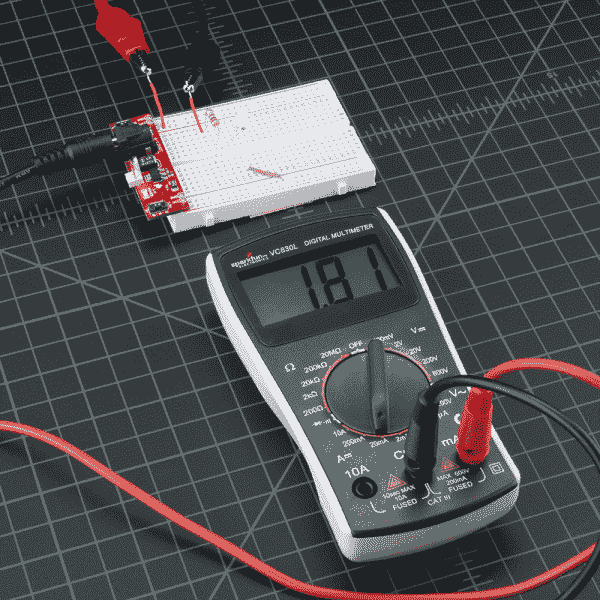](https://cdn.sparkfun.com/assets/learn_tutorials/1/01_Multimeter_Tutorial-22.jpg)*This circuit was only pulling 1.8mA at the time of measurement, not a lot of current. The average reading was closer to 2.1mA.*

意识到万用表就像一根电线——你现在已经完成了电路，电路将通电。这一点很重要，因为随着时间的推移，LED、微控制器、传感器或任何被测设备的功耗都可能发生变化(例如，打开 LED 会导致 20mA 增加一秒钟，然后在关闭时减少一秒钟)。在万用表显示屏上，您应该看到瞬时电流读数。所有的万用表都会记录一段时间的读数，然后给你一个平均值，所以读数会有波动。一般来说，越便宜的电表平均越苛刻，响应越慢，所以对每个读数都要有所保留。在你的头脑中，取一个平均范围，比如正常 5V 条件下的 7 到 8mA(不是 7.48mA)。

与其他测量类似，测量电流时，探针的颜色并不重要。如果我们交换探针会发生什么？没有不好的事情发生！它只会导致当前读数变为负值:

[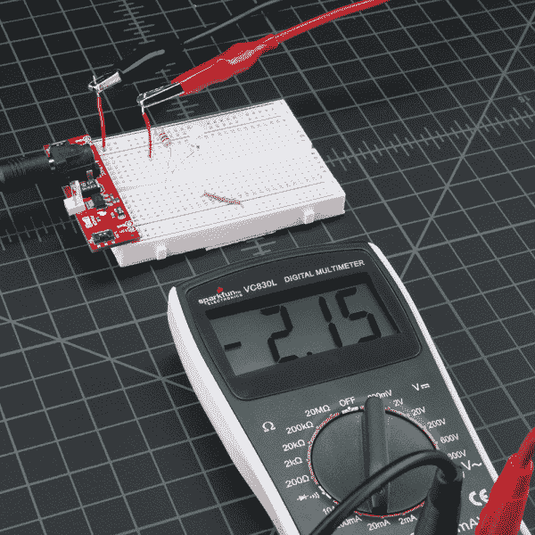](https://cdn.sparkfun.com/assets/learn_tutorials/1/01_Multimeter_Tutorial-25.jpg)

电流仍在系统中流动，你只是改变了你的视角，现在电表读数为负。

**Remember!** When you're done using the meter, always return the meter to read voltage (return the probes to the voltage port, set the meter to read the DC voltage range if necessary). It's common to grab a meter and begin to quickly measure the voltage between two pins. If you have left your meter in 'current' mode, you won't see the voltage on the display. Instead you'll see '0.000' indicating that there is no current between VCC and GND. Within that split second you will have connected VCC to GND through your meter and the 200mA fuse will blow = not good. So before you put the meter down for the night, remember to leave your meter in a friendly state.

最初几次测量电流可能会很棘手。如果你烧了保险丝，不要担心——我们已经做过几十次了！我们将在后面的部分向您展示如何更换保险丝。

* * *

## 连续性

连续性测试是指测试两点之间的电阻。如果电阻很低(小于几个&ohm;秒)，则两点电连接，发出一个音。如果电阻超过几个&ohm;,则电路开路，不会发出声音。该测试有助于确保两点之间的连接正确。该测试还帮助我们检测两个不应该连接的点是否连接在一起。

对于嵌入式硬件专家来说，连续性很可能是唯一最重要的功能。这一特性使我们能够测试材料的导电性，并追踪是否进行了电气连接。

将万用表设置为“导通”模式。它可能因数字多用表而异，但要注意周围有传播波的二极管符号(像扬声器发出的声音)。

[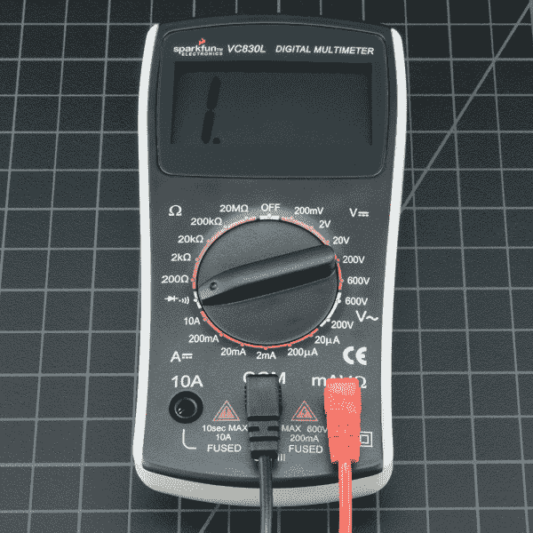](https://cdn.sparkfun.com/assets/learn_tutorials/1/01_Multimeter_Tutorial-09.jpg)*Multimeter is set to continuity mode.*

现在将探针接触在一起。万用表应该发出一个声音(注意:不是所有的万用表都有一个连续性设置，但大多数应该有)。这表明允许非常少量的电流在探针之间无电阻(或至少非常非常小的电阻)地流动。

**Warning!** In general, turn OFF the system before checking for continuity.

在*非*供电的试验板上，用探针戳两个独立的接地引脚。您应该会听到一声提示音，表示它们已连接。将探针从微控制器上的 VCC 引脚插到电源上的 VCC。它应该发出一个信号音，表明电源可以自由地从 VCC 引脚流向微处理器。如果它不发出声音，那么你可以开始按照铜迹线的路线，并告诉是否有线路，电线，试验板，或印刷电路板断裂。

连续性是测试两个 SMD 引脚是否接触的好方法。如果你的眼睛看不到它，万用表通常是一个伟大的第二测试资源。

当系统不工作时，连续性是帮助排除系统故障的另一个因素。以下是要采取的步骤:

1.  如果系统开启，仔细检查 VCC 和 GND 的电压设置，确保电压处于正确水平。如果 5V 系统在 4.2V 下运行，请仔细检查您的调节器，它可能非常热，表明系统正在吸取太多的电流。
2.  关闭系统电源，检查 VCC 和 GND 之间的连续性。如果有连续性(如果你听到哔哔声)，那么你有一个地方短路。
3.  关闭系统电源。通过连续性，检查 VCC 和 GND 是否正确连接到微控制器和其他设备的引脚上。系统可能正在通电，但个别 IC 可能接线错误。
4.  假设您可以让微控制器运行，将万用表放在一边，继续进行串行调试或使用逻辑分析仪来检查数字信号。

**连续性和大电容:**正常故障排除时。你将探索地面和 VCC 铁路之间的连续性。在给原型加电之前，这是一个很好的健全性检查，以确保电源系统没有短路。但是如果你听到一声短促的“哔！”探查的时候。这是因为电力系统中通常有大量的电容。万用表正在寻找非常低的电阻，以查看两点是否连接。电容器将在一瞬间充当短路，直到它们充满能量，然后充当开路连接。因此，您将听到一声短促的哔哔声，然后什么也没有。没关系，这只是充电的帽子。

* * *

## 更换保险丝

新万用表最常见的错误之一是通过从 VCC 到 GND(糟糕！).这将立即通过万用表对地短路，导致面包板电源变暗。当电流流过万用表时，内部保险丝会变热，然后在 200mA 电流流过时烧断。它会在一瞬间发生，没有任何真正的听觉或物理迹象表明有问题。

哇，太棒了。现在怎么办？首先，请记住，测量电流是串联进行的(中断连接到试验板或微控制器的 VCC 线来测量电流)。如果你试图用熔断的保险丝测量电流，你可能会注意到仪表读数为“0.00”，并且当你连接万用表时，系统不会像它应该的那样打开。这是因为内部保险丝断开，充当断线或开路。别担心，这种情况经常发生，修复它需要花费[大约 1](https://www.sparkfun.com/products/10165) 美元。

要更换保险丝，找到你的小螺丝刀，开始取出螺丝。SparkFun 数字多用表很容易拆开。首先拆下电池板和电池。

[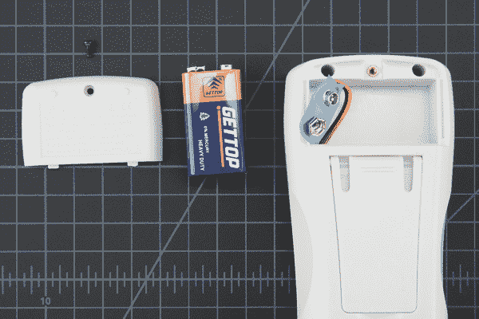](https://cdn.sparkfun.com/assets/learn_tutorials/1/01_Multimeter_Tutorial-11.jpg)

接下来，拆下藏在电池板后面的两颗螺丝。

稍微抬起万用表的表面。

[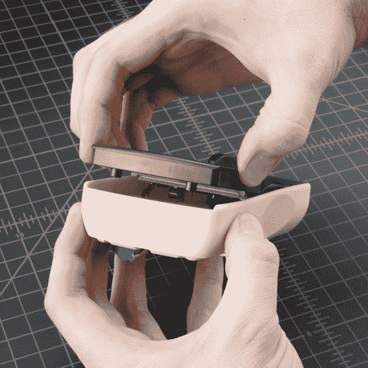](https://cdn.sparkfun.com/assets/learn_tutorials/1/01_Multimeter_Tutorial-13.jpg)

现在请注意面部底部边缘的钩子。你需要用一点力将面部向侧面滑动以解开这些钩子。

[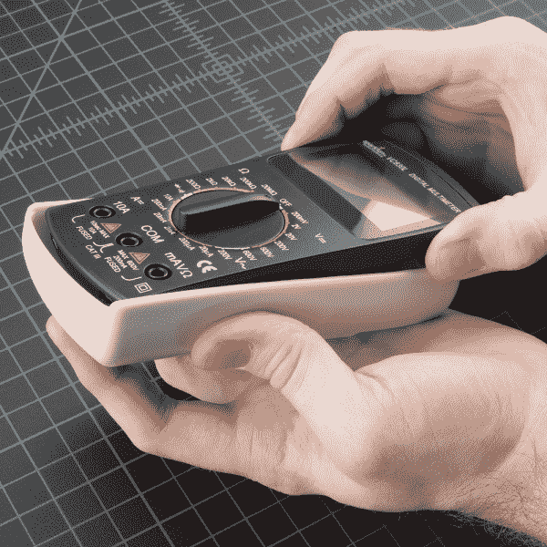](https://cdn.sparkfun.com/assets/learn_tutorials/1/01_Multimeter_Tutorial-14.jpg)

脸一旦脱钩，应该很容易出来。现在你可以看到万用表的内部了！

[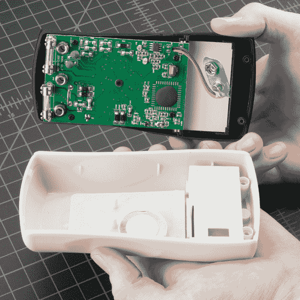](https://cdn.sparkfun.com/assets/learn_tutorials/1/01_Multimeter_Tutorial-15.jpg)

轻轻提起保险丝，它就会弹出。

[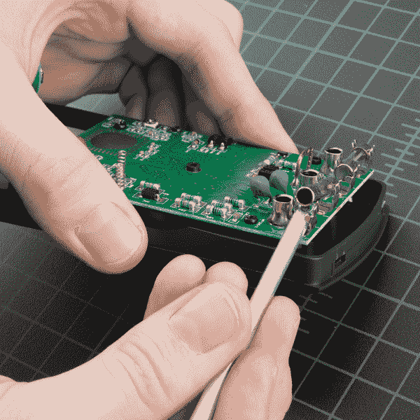](https://cdn.sparkfun.com/assets/learn_tutorials/1/01_Multimeter_Tutorial-16.jpg)

确保**用正确类型的**更换正确的保险丝。换句话说，用[200 毫安保险丝](https://www.sparkfun.com/products/10165)替换 200 毫安保险丝。

**Warning!** **DO NOT put a 10A fuse where a 200mA fuse should go.** The placement of the fuses may not match the placement of the probe ports. Read the metal cap on either end of the fuse to double check which is which.

万用表内部的元件和 PCB 走线设计用于接收不同量的电流。如果您不小心将 5A 通过 200mA 端口，将会损坏并可能毁掉您的万用表。

有时你需要测量高电流设备，如电机或加热元件。你看到万用表前面放红色探针的两个地方了吗？左边的 **10A** 和右边的**MAVω**？如果您试图在**MAVω**端口上测量超过 200mA 的电流，您将面临熔断保险丝的风险。但是，如果您使用 10A 端口来测量电流，烧断保险丝的风险会低得多。代价是敏感性。如上所述，通过使用 10A 端口和旋钮设置，您将只能读取 0.01A 或 10mA。我的大多数系统使用超过 10mA，所以 10A 的设置和端口足够好。如果您试图测量非常低的功率(微安或纳安), 200 毫安端口和 2mA、200uA 或 20uA 端口可能是您需要的。

[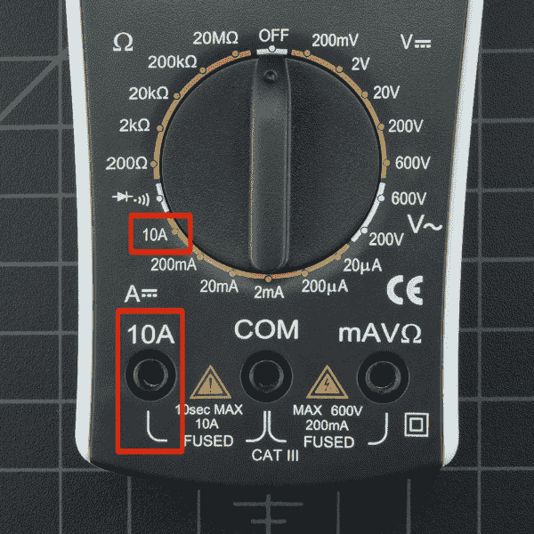](https://cdn.sparkfun.com/assets/learn_tutorials/1/01_10A.jpg)

**记住:**如果你的系统有可能使用超过 100 毫安的电流，你应该从红色探针插入 **10A** 端口和 **10A** 旋钮设置开始。

对于低于 50 美元的数字万用表，你可能进行的测量只是故障排除读数，而不是科学实验结果。如果您真的需要了解 IC 如何随时间推移使用电流或电压，请使用[安捷伦](https://www.google.com/search?q=agilent+multimeters&ie=utf-8&oe=utf-8#q=agilent+technologies+multimeters&tbm=shop)或其他高质量的工作台装置。这些单元具有更高的精度，并提供广泛的花式功能(有些[包括俄罗斯方块](http://www.youtube.com/watch?v=dCrefzlt7IQ)！). [Bunnie Huang](http://www.bunniestudios.com/) ， [Chumby](http://www.chumby.com/) 背后的硬件设计师，在 Chumby 的最终测试过程中，使用高精度电流读数对电路板进行故障排除。通过查看发生故障的不同板的电流消耗(例如，某个发生故障的板使用的电流超过正常值 210mA)，他可以确定板的问题所在(当 RAM 发生故障时，它通常使用的电流超过正常值 210mA)。通过精确定位潜在的错误，电路板的返工和维修变得更加容易。

* * *

## 什么是好的万用表？

每个人都有他或她的偏好，但一般来说，有连续性的万用表是首选。其他功能都只是锦上添花。

[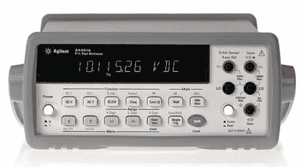](https://cdn.sparkfun.com/assets/learn_tutorials/1/agilent.jpg)

有一些奇特的万用表是**自动量程**的，这意味着它们会自动改变内部量程，试图找到你所拨弄的东西的正确电压、电阻或电流。如果你知道如何使用，自动测距会很有帮助。一般来说，自动量程万用表质量更高，功能也更多。所以如果有人给你一个带自动量程的万用表，就用它吧！只要知道如何让它进入手动模式。一个电路的电压或电流会波动得很快。对于一些系统，电流或电压是如此的不稳定，以至于自动范围无法跟上。

背光液晶显示器很不错，但是你上一次在黑暗中测量电路是什么时候？我们通常会避开可怕的森林和需要我们在半夜测试的情况，但有些人可能想要或需要一个黑暗友好的万用表。

在我们的书里，范围选择器上的一个**好的点击**实际上是一个主要的优点。软旋钮通常表示劣质仪表。

**像样的探头**是加分项。随着时间的推移，导线会在弯曲点断裂。我们已经看到电线完全从探针中出来——而且总是在你需要探针工作的时候！如果你真的弄坏了一个探针，更换它们是相当便宜的[。](https://www.sparkfun.com/products/12078)

自动关闭是一个很好的功能，在便宜的万用表上很少见到。这是一个对初学者和高级用户都有好处的功能，因为很容易忘记在凌晨 2 点关闭血糖仪。 [SparkFun 数字万用表](https://www.sparkfun.com/products/9141)没有这个功能，但幸运的是这款电表功耗非常低。在 9V 电池电量开始变低之前，我们已经将万用表放置了两天。也就是说，别忘了关掉你的计价器！

现在，您已经准备好使用您的数字万用表开始测量您周围的世界。请随意开始使用它来回答许多问题。我相信我的 LED 越来越 20mA，是真的吗？一个柠檬有多少电压？一杯水导电吗？我能用铝箔代替这些电线吗？数字万用表将回答这些以及更多关于电子学的问题。

* * *

## 购买万用表

数字万用表是每个电子发烧友的必备工具。这里有几个万用表和万用表套件，以满足初学者和有经验的爱好者的需要。

### 我们的建议:

 

将**添加到您的[购物车](https://www.sparkfun.com/cart)中！**

### [SparkFun 豪华工具包](https://www.sparkfun.com/products/11805)

[Only 4 left!](https://learn.sparkfun.com/static/bubbles/ "only 4 left!") TOL-11805

这些工具非常适合那些有工具使用经验但需要一套新零件的人…

$246.50[Favorited Favorite](# "Add to favorites") 21[Wish List](# "Add to wish list")**** 

将**添加到您的[购物车](https://www.sparkfun.com/cart)中！**

### [-数字万用表基础](https://www.sparkfun.com/products/12966)

[In stock](https://learn.sparkfun.com/static/bubbles/ "in stock") TOL-12966

数字万用表(DMM)是每个电子爱好者的必备工具。斯帕克芬数字万用表，高…

$16.50 $9.9023[Favorited Favorite](# "Add to favorites") 57[Wish List](# "Add to wish list")**** 

### [【USB 数字万用表-自动测距(RS232 输出)](https://www.sparkfun.com/products/retired/12967)

[Retired](https://learn.sparkfun.com/static/bubbles/ "Retired") TOL-12967

现在似乎所有的东西都可以插入你的电脑，这台数字万用表也不例外。这种自动测距…

6 **Retired**[Favorited Favorite](# "Add to favorites") 33[Wish List](# "Add to wish list")[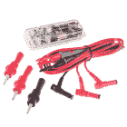](https://www.sparkfun.com/products/retired/13843) 

### 

[Retired](https://learn.sparkfun.com/static/bubbles/ "Retired") TOL-13843

Mooshimeter 是一款多通道电路测试万用表，可通过蓝牙 4.0 将您的智能手机或平板电脑用作…

14 **Retired**[Favorited Favorite](# "Add to favorites") 46[Wish List](# "Add to wish list")********[Click to Browse Additional Multimeter Options](https://www.sparkfun.com/categories/372)

## 有兴趣学习更多基础主题吗？

查看我们的 **[工程要点](https://www.sparkfun.com/engineering_essentials)** 页面，了解电气工程相关基础主题的完整列表。

带我去那里！

## 资源和更进一步

现在，您已经了解了如何使用数字万用表的基本知识，请查看这些教程来使用您的新技能:

*   [用万用表测试 LED 和二极管极性](https://learn.sparkfun.com/tutorials/polarity/diode-and-led-polarity)
*   [发光二极管](https://learn.sparkfun.com/tutorials/light-emitting-diodes-leds)
*   [二极管](https://learn.sparkfun.com/tutorials/diodes)
*   [电力](https://learn.sparkfun.com/tutorials/electric-power)
*   [电池技术](http://learn.sparkfun.com/tutorials/battery-technologies)
*   [为您的项目提供动力](https://learn.sparkfun.com/tutorials/how-to-power-a-project)

或者看看这些相关的博客帖子。

 [### 福禄克，我们爱你，但你正在杀死我们。

March 19, 2014](https://www.sparkfun.com/news/1428 "March 19, 2014: SparkFun is forced to incinerate 2,000 multimeters because they are yellow.")[Favorited Favorite](# "Add to favorites") 1 [### 福禄克回应商标问题

March 20, 2014](https://www.sparkfun.com/news/1430 "March 20, 2014: Fluke responds to our issue with US Customs seizing our shipment of multimeters over a trademark violation.")[Favorited Favorite](# "Add to favorites") 1 [### 每日工程:线性调节器热测试

August 25, 2016](https://www.sparkfun.com/news/2173 "August 25, 2016: This Enginursday tests a 7805 regulator with various heat sinks.")[Favorited Favorite](# "Add to favorites") 1******************