# 英特尔 Edison 编程:超越 Arduino IDE

> 原文：<https://learn.sparkfun.com/tutorials/programming-the-intel-edison-beyond-the-arduino-ide>

## 介绍

英特尔 Edison 的大部分内容似乎都集中在使用 Edison，而它是连接到 Arduino 兼容开发板的。随着 Edison 的 [SparkFun Block line 的发布，使用少得多的硬件来访问 Edison 的资源变得切实可行。](https://www.sparkfun.com/search/results?term=edison+blocks)

[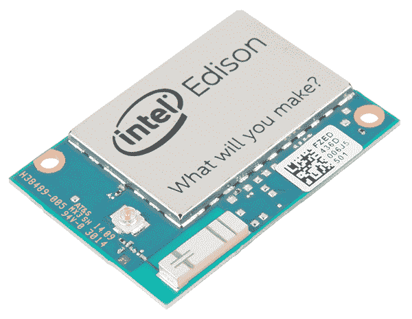](https://cdn.sparkfun.com/assets/learn_tutorials/3/1/7/Edison-01.jpg)

本教程将向您展示如何在不使用 Arduino IDE 或假设 Edison 安装在 Arduino 开发板上的情况下为 Edison 编写 C++代码。

### 使用的组件

我们会尽量少做这些。我们将展示爱迪生最基本的功能，而不涉及任何花哨的硬件。在各个模块的教程中，您会找到更多涉及硬件的示例。

*   [英特尔 Edison Starter Pack](https://www.sparkfun.com/products/13093) -你至少需要[控制台](https://www.sparkfun.com/products/13039)来将你的 Edison 接入你的本地 WiFi 网络。
*   [英特尔爱迪生基础模块](https://www.sparkfun.com/products/13045)(可选)——你可能会发现你的 WiFi 网络的延迟是不可接受的；在这种情况下，您可以连接到基座上的 OTG 端口，通过 USB RNDIS 网络接口访问 Edison。但是，这是一个强烈推荐的升级，因为它允许您将 Edison 上的闪存映像升级到最新版本。
*   [Edison 硬件套件](https://www.sparkfun.com/products/13187) -一个就足以构成 Edison/控制台/GPIO 堆栈。

### 推荐阅读

不使用 Arduino IDE 为 Edison 编写代码是一个高级主题；我们将假设您至少熟悉基本的 Linux 命令行语法和 C++语法。

*   [开始使用 Edison](https://learn.sparkfun.com/tutorials/edison-getting-started-guide)——给 Edison 加电，连接到你的网络，进入命令行。同时更新固件，这是继续之前的建议，但不是强制性的。
*   通用爱迪生街区指南 -正如它所说。这将帮助您理解如何将堆栈放在一起并避免块间冲突。
*   [控制台连接指南](https://learn.sparkfun.com/tutorials/sparkfun-blocks-for-intel-edison---console-block) -控制台的更多信息。

## 工具链:Eclipse

在 Edison 上编写 C++代码有两种方法:使用 Intel 提供的 Eclipse IDE，或者直接在 Edison 上使用 GCC 和命令行实现准系统。

### 使用 Eclipse 环境

英特尔已经为 [Windows](https://software.intel.com/sites/landingpage/iotdk/windows-development-kit.html) 、 [Linux](https://software.intel.com/sites/landingpage/iotdk/linux-developement-kit.html) 和 [MacOS](https://software.intel.com/sites/landingpage/iotdk/osx-developement-kit.html) 提供了 Eclipse 版本。

继续下载适当的文件。你会发现它是一个压缩的存档(不是. 7z 就是. bz2)；没有实际的安装过程。只需将文件提取到合理的位置，并在提取的目录中运行 devkit-launcher 脚本来启动 Eclipse。

【Windows 用户的超级重要提示:在启动 Eclipse 之前，您需要打开脚本并进行以下更改:

找到这条线:

```
java -version 2>&1 | find "64-Bit" >nul: 
```

并将其更改为:

```
java -version 2>&1 | C:\Windows\System32\find "64-Bit" >nul: 
```

一旦您安装并启动了它，请回到这里，我们将逐步将 Edison 连接到 IDE 并加载一个示例程序。

#### 从 Eclipse 开始

第一次启动 Eclipse 时，您会看到这个窗口:

[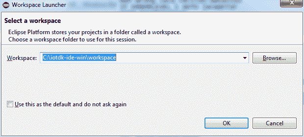](https://cdn.sparkfun.com/assets/learn_tutorials/3/1/7/choose_workspace.png)

你可以选择任何你喜欢的文件夹；这其实并不重要。我把我的放在 Dropbox 上。我还单击了“将此作为默认设置，不再询问”复选框；我喜欢把我的项目放在一个地方，请不要为此和我争论。然而，请注意，这并不意味着您不能将单个项目存储在其他地方，只是 Eclipse 会*假定*这是您想要存储东西的地方，而不会询问。

[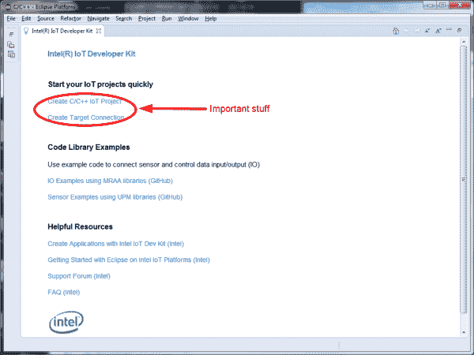](https://cdn.sparkfun.com/assets/learn_tutorials/3/1/7/start_window_markup.png)

单击“确定”后，您将看到这个启动屏幕。据我所知，这只在第一次运行 Eclipse 时出现；无论如何，我没能再找到它。

圈起来的链接是重要的。首先，我们将创建到爱迪生的链接，然后开始一个新项目。单击“创建目标连接”链接，打开此对话框:

[](https://cdn.sparkfun.com/assets/learn_tutorials/3/1/7/create_target_connection.png)

“家长配置文件:”会因您而异，这取决于您所在的计算机的名称。别担心。

“主机名:”应该是你的爱迪生的 IP 地址。**如果你不知道那是什么**去 [Edison 入门指南](https://learn.sparkfun.com/tutorials/edison-getting-started-guide)并按照那里的指示让你的 Edison 与你的开发计算机联网。 **192.168.2.15** 是通过 USB-OTG 端口连接的默认地址。

“连接名称:”需要设置为**爱迪生**。**这很重要。**

点击完成，然后点击启动页面上的“创建 C/C++物联网项目”链接。

[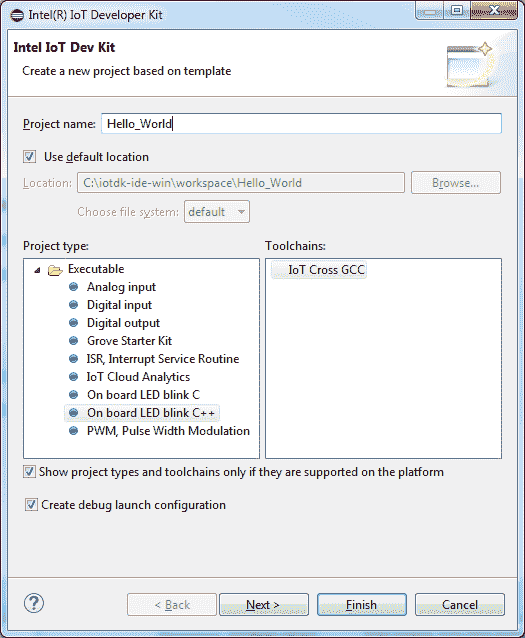](https://cdn.sparkfun.com/assets/learn_tutorials/3/1/7/create_project.png)

弹出这个窗口；请注意，该位置已预先填充了您先前选择的工作区文件夹。“项目类型”是(相对)不重要的；它决定了项目启动时会出现什么样的代码。先说“板载 LED blink C++”，把项目命名为“Hello_World”。单击“完成”让 IDE 复制文件并设置环境。

## 工具链:命令行

我自己喜欢用命令行；它为我选择的编辑器提供了更多的选项，并且通常比 Eclipse 在我的系统上运行得更轻松。这是到达那里的方法。

大多数工具链已经安装在 Edison 上了:GCC、make 和 vi 都是安装时附带的。是的，vi，不是 vim，不，没有其他选择。我在电脑上编辑，然后通过 SCP 或 rsync 将文件推送到 Edison 进行编译。

如果你像我一样，通过 vi 远程编辑代码的想法会让你畏缩。Edison 上的 vi 版本非常简单，它不支持拆分框架或大多数类型的搜索和替换。所以，一旦你在开发计算机上创建了这些文件，你就需要某种方法把它们上传到你的 Edison 上。

#### rsync

跨平台选项是 **rsync** 。如果你觉得使用 [Cygwin](https://www.cygwin.com) 是一种可以接受的做法，那么它应该已经在你的 Mac 或 Linux 电脑上了，并且可以在 Windows 上找到。

这里我不打算深入研究 rsync 的使用；它在其他地方已经被广泛地讨论过，并且它在 Edison 中的使用是简单明了的。

#### WinSCP

[WinSCP](http://winscp.net) 是一个仅在 Windows 上运行的程序，它通过 SCP 提供更新更改同步。我广泛地使用过它，它在检测和更新你的文件方面做得很好。缺点是它要求两个系统的时基相当同步，所以您需要确保 Edison 的 NTP 是针对您的时区正确设置的(提示:/usr/share/timeinfo 有许多位置文件；通过/etc/localtime 文件复制最适合您的时间，并使用`sync`命令强制进行时间更新。

[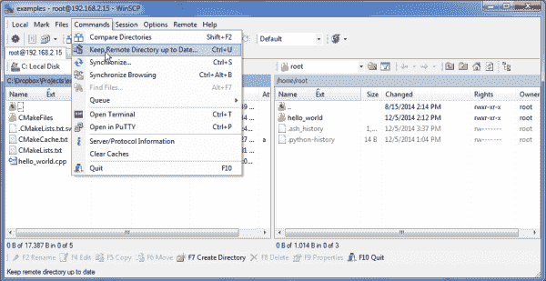](https://cdn.sparkfun.com/assets/learn_tutorials/3/1/7/winscp.png)

## 你好，世界！

现在是时候试试经典的“你好，世界！”在 Eclipse 中并通过命令行编程(*而不是*经典的“blinkenlight”程序)。

### 黯然失色

[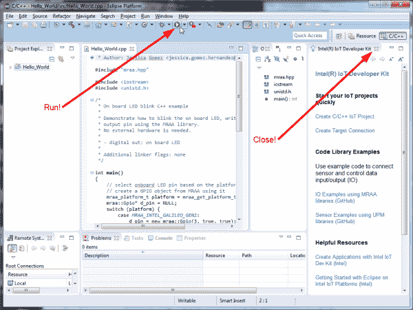](https://cdn.sparkfun.com/assets/learn_tutorials/3/1/7/project_after_init.png)

关闭右侧的“物联网开发人员工具包”框。这真的会妨碍工作。

在弹出的屏幕上单击“Run”按钮，系统会要求您提供登录凭证。如果没有，您可能没有连接，您应该返回到 [Edison 入门指南](https://learn.sparkfun.com/tutorials/edison-getting-started-guide)并按照那里的说明让您的 Edison 与您的开发计算机联网。否则，它应该建立，然后部署在爱迪生；您会知道，因为您会在屏幕底部的控制台上看到一些操作:

[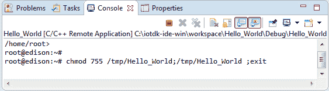](https://cdn.sparkfun.com/assets/learn_tutorials/3/1/7/console_output.png)

如您所见，这本质上只是一个您无法控制的命令提示符。在幕后，IDE 将您的可执行文件复制到 Edison，然后启动这个 shell 并运行程序。

如果你有硬件能够做到这一点，你有一个闪烁的 LED 灯。当然，因为我们不假设您有合适的硬件，所以让我们改变一下，这样我们就可以在控制台上看到一些东西。

继续删除`main()`函数中的*和*，除了`return`语句之外的**。**现在，让我们添加一个简单的打印语句:

[](https://cdn.sparkfun.com/assets/learn_tutorials/3/1/7/hello_world_2.png)

再次点击“运行”按钮，你会惊叹于它简单性

[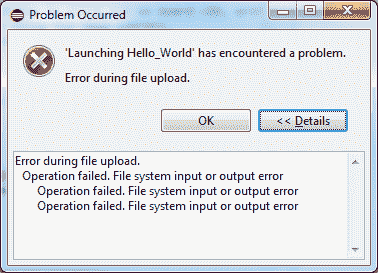](https://cdn.sparkfun.com/assets/learn_tutorials/3/1/7/upload_error.png)

等等，什么？

"文件上传过程中出错。"听起来很糟糕，不是吗？奇怪的是，在试图复制新的二进制文件之前，IDE 不能(或不)删除或替换远程二进制文件；你必须自己去做。幸运的是，在 IDE 中运行终端窗口非常容易，所以每次构建时都可以删除。

在右上角，单击“打开透视图”按钮。

[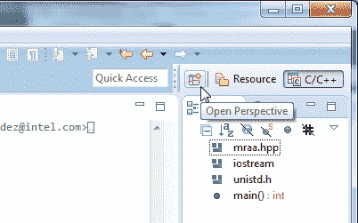](https://cdn.sparkfun.com/assets/learn_tutorials/3/1/7/open_perspective.png)

您将看到以下对话框:

[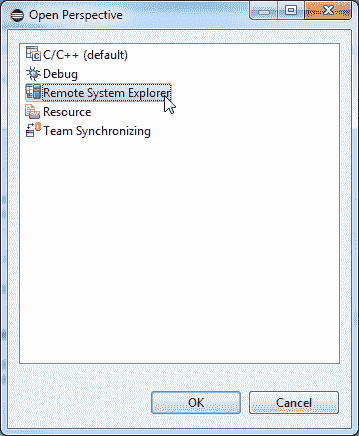](https://cdn.sparkfun.com/assets/learn_tutorials/3/1/7/open_perpective_2.png)

选择“远程系统资源管理器”并点击确定。

[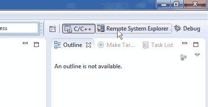](https://cdn.sparkfun.com/assets/learn_tutorials/3/1/7/remote_system_explorer.png)

“远程系统资源管理器”允许您更改和查看远程系统(在本例中是 Edison)的设置。右键单击“Ssh 终端”条目，然后选择“启动终端”。

[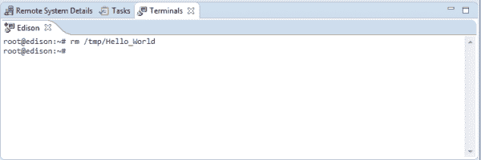](https://cdn.sparkfun.com/assets/learn_tutorials/3/1/7/terminal.png)

这是给你的终端！它使用您之前提供的凭据登录(或者，如果您选择不保留登录设置，则使用您在打开它时提供的凭据)。使用上面显示的命令删除可执行文件。当然，如果您的项目不叫“Hello_World”，您需要更改文件名。

[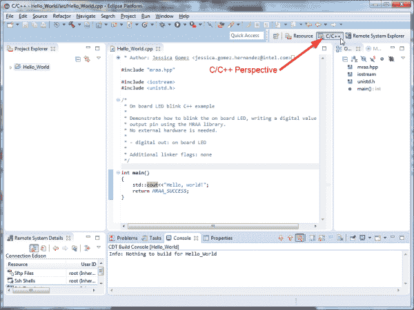](https://cdn.sparkfun.com/assets/learn_tutorials/3/1/7/c_perspective.png)

将“透视图”(见上图)改回 C/c++；如果您想再次访问该终端，您可以使用“C/C++”按钮旁边的按钮返回到远程系统资源管理器透视图。

[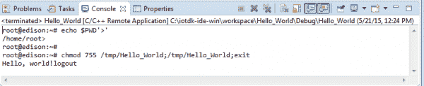](https://cdn.sparkfun.com/assets/learn_tutorials/3/1/7/hello_world_okay.png)

再次点击“运行”按钮，您将看到控制台再次填满。输出末尾的虚假“注销”是由 IDE 关闭该外壳导致的。

#### 开始你的下一个项目

[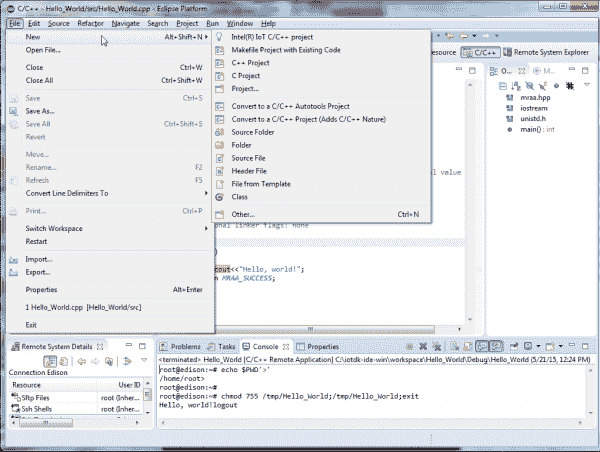](https://cdn.sparkfun.com/assets/learn_tutorials/3/1/7/new_project.png)

要制作下一个项目，请使用“文件”菜单下“新建”子菜单中的“英特尔(R)物联网 C/C++项目”。冲洗，根据需要重复。

### 安慰

控制台的过程要简单得多；事实上，一般来说，在 Edison 上使用小程序时，通过控制台来做事情是更容易的途径。较大的项目可能会变得笨拙，在这种情况下，Eclipse 可能会占上风。

程序的代码是一样的；事实上，如果您已经完成了上面的 Eclipse 项目，您可以使用您最喜欢的文件复制方法将该文件复制到 Edison。

[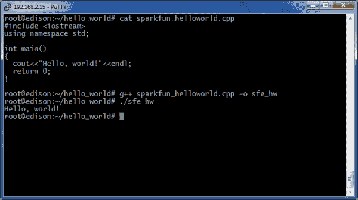](https://cdn.sparkfun.com/assets/learn_tutorials/3/1/7/console_hello_world.png)

您可以看到文件的内容是相同的。在命令行上，我调用了 g++，然后执行它生成的二进制文件。

对于较小的文件，这很好，但是对于更复杂的项目呢？这就是 Cmake 的用武之地。Cmake 使用一种相当简单的语法来确定如何将多个文件和库构建和链接到一个项目中。然后，它生成一个 make 文件，可以运行该文件来进行实际的构建。我在这里不打算太深入地研究 Cmake 我将在以后的教程中讨论这个话题。

## 资源和更进一步

这应该让你开始用 C++为 Edison 编写程序，而不依赖于 Arduino IDE。在后面的教程中，我们将介绍 Python、JavaScript 和其他选项，让 Edison 做您想做的事情。

以下是网上其他一些对这个主题有用的资源:

*   [libmraa](http://iotdk.intel.com/docs/master/mraa/) - libmraa 是英特尔高度结构化的物联网硬件平台框架。目前，它支持爱迪生，伽利略，米诺，和树莓派 b。
*   cmake 是一个用于构建项目的跨平台工具。libmraa 使用它。
*   userland -这是一篇关于命令行世界中微妙之处的有用论文。

查看 SparkFun 的其他爱迪生相关教程:

[](https://learn.sparkfun.com/tutorials/sparkfun-blocks-for-intel-edison---oled-block-) [### 英特尔爱迪生有机发光二极管模块的 SparkFun 模块](https://learn.sparkfun.com/tutorials/sparkfun-blocks-for-intel-edison---oled-block-) A quick overview of the features of the OLED Block for the Edison.[Favorited Favorite](# "Add to favorites") 3[](https://learn.sparkfun.com/tutorials/sparkfun-blocks-for-intel-edison---base-block-) [### 面向英特尔 Edison 的 SparkFun 模块-基本模块](https://learn.sparkfun.com/tutorials/sparkfun-blocks-for-intel-edison---base-block-) A quick overview of the features of the Base Block.[Favorited Favorite](# "Add to favorites") 2[](https://learn.sparkfun.com/tutorials/installing-libmraa-on-ubilinux-for-edison) [### 在 Edison 的 Ubilinux 上安装 libmraa](https://learn.sparkfun.com/tutorials/installing-libmraa-on-ubilinux-for-edison) libmraa is a tool kit for interacting with various Intel single board computers.[Favorited Favorite](# "Add to favorites") 2[](https://learn.sparkfun.com/tutorials/single-board-computer-benchmarks) [### 单板计算机基准](https://learn.sparkfun.com/tutorials/single-board-computer-benchmarks) How to set up different benchmarking programs on single board computers or computing modules and run them. The results for various generations are shown on the subsequent pages.[Favorited Favorite](# "Add to favorites") 7