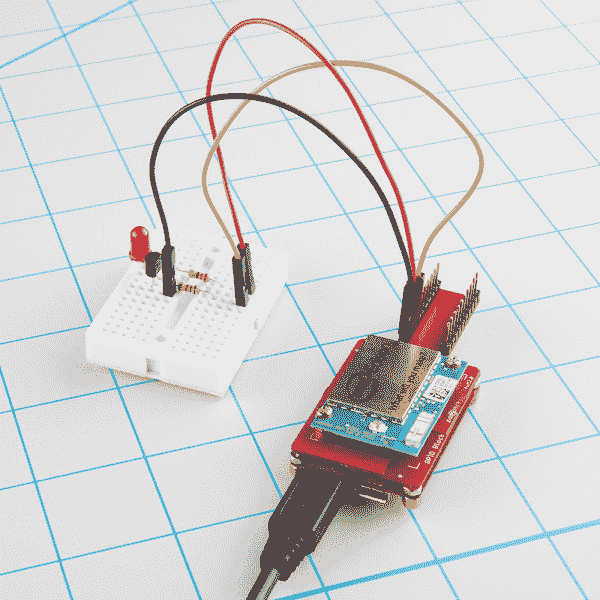

# 在 Edison 的 Ubilinux 上安装 libmraa

> 原文：<https://learn.sparkfun.com/tutorials/installing-libmraa-on-ubilinux-for-edison>

## 介绍

[libmraa](https://github.com/intel-iot-devkit/mraa) 包含有助于解决英特尔 [Galileo](https://www.sparkfun.com/products/13096) 和 [Edison](https://www.sparkfun.com/categories/272) 上的硬件问题的绑定，这些硬件支持多种语言。在本教程中，我们将使用 python 脚本来制作 LED 闪烁。您将需要一个[英特尔爱迪生](https://www.sparkfun.com/products/13024)，一种连接到它的方式(例如[基块](https://www.sparkfun.com/products/13045)，以及访问一些 GPIO 引脚(例如 [GPIO 块](https://www.sparkfun.com/products/13038))。

### 先决条件

你需要在 Edison 上运行 Ubilinux，这是 Debian 的一个版本。你可以按照[这个教程](https://learn.sparkfun.com/tutorials/loading-debian-ubilinux-on-the-edison)来做。

### 推荐阅读

*   [爱迪生入门指南](https://learn.sparkfun.com/tutorials/edison-getting-started-guide)
*   [在 Edison 上加载 Debian(ubi Linux)](https://learn.sparkfun.com/tutorials/loading-debian-ubilinux-on-the-edison)
*   [英特尔爱迪生 SparkFun 模块通用指南](https://learn.sparkfun.com/tutorials/general-guide-to-sparkfun-blocks-for-intel-edison)
*   [爱迪生控制台导轨](https://learn.sparkfun.com/tutorials/sparkfun-blocks-for-intel-edison---console-block)
*   [爱迪生 GPIO 模块指南](https://learn.sparkfun.com/tutorials/sparkfun-blocks-for-intel-edison---gpio-block)

## 该电路

首先要做的是连接 LED。对于本教程，我们使用了一个[英特尔爱迪生](https://www.sparkfun.com/products/13024)、一个[基块](https://www.sparkfun.com/products/13045)和一个 [GPIO 块](https://www.sparkfun.com/products/13038)。您也可以使用[控制台](https://www.sparkfun.com/products/13039)、[迷你分线板](https://www.sparkfun.com/products/13025)或 [Arduino 分线板](https://www.sparkfun.com/products/13097)。

### 零件目录表

除了 Edison 和分线板，您还需要一些基本组件。下面是本教程中使用的组件列表。请注意，在电阻套件中，我们使用了 1kω和 220ω电阻。