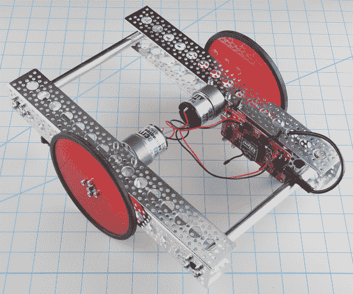

# 机器人基础差分平台

> 原文：<https://learn.sparkfun.com/tutorials/actobotics-basic-differential-platform>

## 构建概述

### 介绍

基本的差分机器人是一个种子平台，帮助您开始制造基于 Actobotics 的机器人。本教程将介绍使用 Actobotics 机械零件构建该平台的基础知识，可在 SparkFun 获得。控制电子设备将被详细讨论，但不是本教程的主要焦点，[愿望清单](https://www.sparkfun.com/wish_lists/101884)包含了制造一辆几乎可以驾驶的汽车的零件。从这里，您可以添加任何您喜欢的传感器或机制，或者为您自己的独特设计定制布局。

*The Completed Build*

### 所需材料

以下是用于构建该平台的部件列表。根据你自己的机器人需求，随意混合搭配或完全重新混合这个列表。