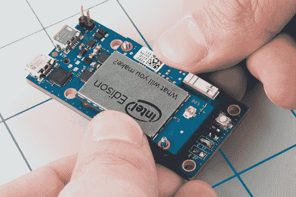
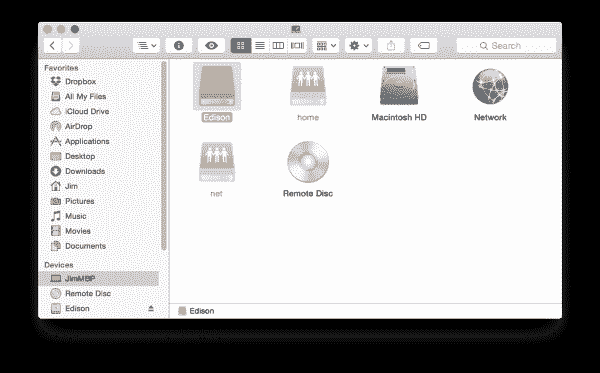

# 爱迪生入门指南

> 原文：<https://learn.sparkfun.com/tutorials/edison-getting-started-guide>

## 遇见爱迪生

Edison 是英特尔推出的功能强大的新型计算模块。它足够小，可以嵌入到可穿戴项目中，足够多功能，可以管理物联网应用，足够强大，可以控制机器人平台。

Edison 打包了一系列功能，包括**WiFi**(802.11 a/b/g/n)**蓝牙** (4.0 和 2.1 EDR)[UART](https://learn.sparkfun.com/tutorials/serial-communication)、 [I ² C](https://learn.sparkfun.com/tutorials/i2c) 、 [SPI](https://learn.sparkfun.com/tutorials/serial-peripheral-interface-spi) 、USB 和 40 GPIO。它由 32 位[英特尔凌动处理器](http://www.intel.com/content/www/us/en/processors/atom/atom-processor.html)驱动，主频为 500MHz，支持 1GB lpddr 3 内存和 4GB eMMC 闪存。更重要的是，它被封装在一个小小的 **35.5 x 25.0 x 3.9 毫米**模块中。

[](https://cdn.sparkfun.com/assets/learn_tutorials/3/0/1/Edison-ISO-cropped.jpg)*Top view of the Edison. The guts are covered in an RF shield. You can also see the an antenna for WiFi/Bluetooth and a u.FL connector for attaching an external antenna.*

不用说，爱迪生是一个强大的小型电子大脑。它有能力改变我们对嵌入式计算的看法。模块搭载基于 [Yocto](http://www.yoctoproject.org) 的 Linux OS，可以编译 C/C++文件，也可以运行 Python、Node.js 等脚本。

### 与爱迪生接口

为了保持平台小巧，所有 I/O 引脚都连接到一个 70 引脚 Hirose DF40C 连接器。这些细间距连接器非常适合保持小尺寸，但可能难以连接。它们是板对板连接器，因此要将 Edison 与其他组件连接，您需要一个带有配套 Hirose 连接器的板。

目前，可用的配套板包括一系列 SparkFun Edison 块(T1)、T2 Arduino 扩展板(T3)和迷你分线板(https://www . spark fun . com/products/13025)。

**爱迪生块**(在*许多*其他板中)包括[基块](https://www.sparkfun.com/products/13045)、[控制台块](https://www.sparkfun.com/products/13039)、[控制台基块](https://www.sparkfun.com/products/13040)和[电池块](https://www.sparkfun.com/products/13037)是定制你的爱迪生项目的一个很好的方式，同时保持微小的外形尺寸。阅读我们的[英特尔爱迪生 SparkFun 模块通用指南](https://learn.sparkfun.com/tutorials/general-guide-to-sparkfun-blocks-for-intel-edison)，了解更多关于模块及其互连方式的信息

[](https://www.sparkfun.com/products/retired/13037) 

### [英特尔爱迪生电池的火花块](https://www.sparkfun.com/products/retired/13037)

[Retired](https://learn.sparkfun.com/static/bubbles/ "Retired") DEV-13037

英特尔 Edison 是一个超小型计算平台，它将改变人们看待嵌入式电子产品的方式。每个 Ediso…

9 **Retired**[Favorited Favorite](# "Add to favorites") 17[Wish List](# "Add to wish list")[](https://www.sparkfun.com/products/retired/13039) 

### [英特尔爱迪生的火花块——控制台](https://www.sparkfun.com/products/retired/13039)

[Retired](https://learn.sparkfun.com/static/bubbles/ "Retired") DEV-13039

英特尔 Edison 是一个超小型计算平台，它将改变人们看待嵌入式电子产品的方式。每个 Ediso…

**Retired**[Favorited Favorite](# "Add to favorites") 2[Wish List](# "Add to wish list")[](https://www.sparkfun.com/products/retired/13040) 

### [英特尔 Edison - UART 的 SparkFun 模块](https://www.sparkfun.com/products/retired/13040)

[Retired](https://learn.sparkfun.com/static/bubbles/ "Retired") DEV-13040

英特尔 Edison 是一个超小型计算平台，它将改变人们看待嵌入式电子产品的方式。每个 Ediso…

2 **Retired**[Favorited Favorite](# "Add to favorites") 2[Wish List](# "Add to wish list")[](https://www.sparkfun.com/products/retired/13045) 

### [基于英特尔爱迪生的 spark fun Block](https://www.sparkfun.com/products/retired/13045)

[Retired](https://learn.sparkfun.com/static/bubbles/ "Retired") DEV-13045

英特尔 Edison 是一个超小型计算平台，它将改变人们看待嵌入式电子产品的方式。每个 Ediso…

16 **Retired**[Favorited Favorite](# "Add to favorites") 26[Wish List](# "Add to wish list")

如果这是你第一次涉足 Edison 或嵌入式计算，Arduino 板是一个很好的起点。

[](https://www.sparkfun.com/products/13097)

迷你突破，像 SparkFun 块，是有用的，如果你想把爱迪生嵌入到一个项目中。它包括一个用于与控制台交互的 FTDI，还包括 Edison 的 USB-OTG 端口和一些 I/O 引脚。

[](https://www.sparkfun.com/products/13025)

一旦 Edison 接入电源和控制台，您就可以与板载 Linux 内核交互并开始开发了！

### 本教程涵盖的内容

本教程的重点是让你准备好开发爱迪生。我们将带您了解从操作 Edison 并为其供电到加载控制台并将其连接到 WiFi 的所有事情。我们还将介绍如何在 Arduino 的舒适范围内对 Edison 进行编程。

本教程分为以下几个部分:

*   下载驱动程序和 Arduino -大量链接让你的电脑为 Edison 开发做好准备。
*   [插电](https://learn.sparkfun.com/tutorials/edison-getting-started-guide#plugging-in)——第一次把爱迪生插电到你的电脑上时，会有什么期待和期待。
*   Arduino 中的 Edison 编程 -通过 Arduino 在 Edison 上开发的介绍。
*   [设置控制台](https://learn.sparkfun.com/tutorials/edison-getting-started-guide#setting-up-the-console)——如何使用 Edison 的控制台端口与 Linux 内核交互。
*   [更新固件](https://learn.sparkfun.com/tutorials/edison-getting-started-guide#updating-the-firmware-image)——我们建议尽快更新 Edison，使用最新版本的 Yocto Linux 发行版。
*   [连接到 WiFi](https://learn.sparkfun.com/tutorials/edison-getting-started-guide#connecting-to-wifi) -更新的固件映像包括一个工具，使在 Edison 上设置 WiFi 变得非常容易。
*   [SSH-ing 进入 Edison](https://learn.sparkfun.com/tutorials/edison-getting-started-guide#ssh-ing-into-the-edison) -通过 SSH 进入 Edison，利用 Edison 的 WiFi 功能，进行远程开发。

### 你需要什么

*   英特尔爱迪生公司——这是不言而喻的。
*   基板-提供电源和控制台接口的东西。**应做以下**之一:
    *   [SparkFun 基本模块](https://www.sparkfun.com/products/13045) -该模块配有两个 USB 连接器，可用于连接 Edison 的 OTG 端口和 UART 控制台。这个模块允许任何事情，从升级固件，通过 Arduino 编程，到与 Linux 终端交互。
    *   爱迪生迷你突破 -这是爱迪生的一个简单突破。它通过 USB 和控制台供电。第二个 USB 连接器可让您访问 Edison 的 USB OTG 接口。爱迪生包含在这个套件中！
    *   Arduino 扩展板 -一个更大的爱迪生基板，其头部延伸到熟悉的 Arduino 尺寸。如果您计划将 Edison 与 Arduino IDE 一起使用，这是您想要使用的板。还包括一个爱迪生！
    *   [SparkFun 控制台模块](https://www.sparkfun.com/products/13039) -该模块类似于基础模块，但移除了 OTG USB 端口。这个块**只提供控制台访问**，你将无法使用它进行固件升级或 Arduino 编程。

除此之外，您可能还需要收集:

*   [Micro-B USB 电缆](https://www.sparkfun.com/products/10215) -上面的每块板都可以通过 USB 供电和控制，并且它们都使用至少一个 Micro-B USB 连接器。对于除了控制台之外的每块板，你实际上需要两根 micro-B 电缆，以便最大限度地利用你的爱迪生。
*   **电源** -这将取决于你使用的基板。如果您使用 Arduino 扩展板，除了 USB 电缆之外，可能还需要一个 7-15V 墙壁适配器。我们的 [9V 墙壁适配器](https://www.sparkfun.com/products/298)应该可以做到这一点。
*   带有两个可用 USB 插槽或集线器的电脑。要升级 Edison 的固件，你需要访问它的 OTG 和调试端口。

[](https://cdn.sparkfun.com/assets/learn_tutorials/3/0/1/example_setup.jpg)

这应该足够开始开发爱迪生了！

### 推荐阅读

*   串行终端基础知识 -我们将在本教程中大量使用串行终端。如果你的计算机上还没有安装一个可靠的终端模拟器程序，可以看看这个教程，找到一个你喜欢的！
*   伽利略连接指南 -伽利略板是对爱迪生的一个很好的介绍。它们都运行非常相似的基于 Yocto 的 Linux 内核。如果您不熟悉 Galileo 或英特尔处理器，这可能是一个有用的教程。

## 下载驱动程序和 Arduino

在您开始插入东西和闪烁 led 之前，请确保您的开发计算机拥有与 Edison 一起工作所需的一切。

Edison 的设计适用于任何操作系统:Windows、Mac 或 Linux。不过，每一个都有单独的驱动程序和软件，所以请确保您获得的软件与您的操作系统相匹配。

### 下载 Arduino

因为 Edison 运行 Linux，有 GCC，Python，Node.js 等。，您可以使用各种各样的工具在上面进行开发。但是，如果您刚刚开始嵌入式开发，Arduino 可能是最容易开始的地方。

使用 Arduino 在 Edison 上进行开发需要定制版本的 IDE。你可以点击下面的按钮获取最新版本的爱迪生 Arduino 软件。

[Download Arduino for Edison](https://communities.intel.com/docs/DOC-23242)

该页面上有各种下载，请确保您获得了“Arduino 软件 1.5.3 -英特尔 1.0.4”(截至 2014 年 12 月的最新版本)，并确保您获得了与您的操作系统匹配的版本。

在 Mac 上，下载并解压缩应用程序后，我们建议将“Arduino”应用程序重命名为类似“Arduino Edison”的名称。您也可以将应用程序移到“应用程序”文件夹。

[](https://cdn.sparkfun.com/assets/learn_tutorials/3/0/1/arduino_00.png)

同样，安装了多个 Arduino 的 Windows 用户应该重命名任何快捷方式或文件夹，以区分 Arduino for Edison 应用程序和普通 Arduino。这个版本的 Arduino *将无法与其他非英特尔 Arduino 主板*一起工作。

### 下载并安装 FTDI 驱动程序(Windows 和 Mac)

大多数 Edison 基板，包括 Arduino 分线点、Mini 分线点和我们的基座/控制台模块，都配有 FTDI 芯片，可将 USB 转换为串行，从而可以轻松访问 Edison 的 UART 控制台。要使用 FTDI，请从他们的下载页面下载最新的 VCP 驱动程序。

[Download the FTDI Drivers](http://www.ftdichip.com/Drivers/VCP.htm)

如果你需要帮助安装驱动程序，请查看我们的[如何安装 FTDI 驱动程序教程](https://learn.sparkfun.com/tutorials/how-to-install-ftdi-drivers)。

### 下载并安装 Edison 驱动程序(仅限 Windows)

如果你用一台 Windows 机器与你的 Edison 互动，你需要安装驱动程序 *s* plural:一个用于控制台的 FTDI 驱动程序和一个用于 Edison 片上 USB 的 Edison 专用驱动程序。后者可以在你之前所在的同一个 [Edison -软件下载页面](https://communities.intel.com/docs/DOC-23242)下载，在页面底部。查找“Windows 驱动程序安装 1.0.0”链接。

[Download the Windows Edison Driver](https://communities.intel.com/docs/DOC-23242)

下载该可执行文件后，运行它并按照安装向导为您的计算机安装驱动程序。

[](https://cdn.sparkfun.com/assets/learn_tutorials/3/0/1/driver_02.png)

完成驱动程序安装可能需要几分钟时间。该过程完成后，您应该会收到驱动程序安装成功的通知。

## 插入电源

既然驱动程序已经安装好了，就可以安全地将 Edison 插入你的主板和电脑了。

### 将爱迪生插在基板上

让我们先把爱迪生插在你的基板上，不管那是什么。请记住，爱迪生的 Hirose 连接器非常脆弱。将 Edison 插头插入基板时，请小心垂直向下推，对连接器和 Edison 的左角施加均匀的压力。

[](https://cdn.sparkfun.com/assets/learn_tutorials/3/0/1/plug_edison.jpg)

如果你需要移除爱迪生，同样温和地施加压力。

### 通过 USB 连接和供电

一旦 Edison 干净地安装到您的基板上，将 USB 端口连接到您的计算机。如果你的基板有两个 USB 端口，建议你**将两个**都连接到你的电脑上——一个端口提供电源和直接 USB 访问，而另一个端口连接到爱迪生的控制台。

如果您使用的是英特尔的 Arduino 扩展板或 Mini Breakout，请确保您至少将 USB 连接到了 Edison 的 USB OTG 端口。那是唯一能给爱迪生号供电的端口。

[](https://cdn.sparkfun.com/assets/learn_tutorials/3/0/1/otg-ports.png)

如果你使用的是 SparkFun 底座，你可以使用任何一个 USB 端口为 Edison 供电。对于下一步(编程 Arduino 草图)，我们建议使用 Edison 的 OTG USB 端口。这两个连接器都有板载标签，因此应该很容易分辨出哪个是哪个。

将 Edison 的 OTG 端口插入您的计算机后，有几个指标表明它可以使用了。首先，在底板上找一个电源指示灯 LED 来点亮。除此之外，大约 30 秒后，爱迪生将在您的电脑上显示为三种不同的设备:

1.  【800MB 左右存储空间的 USB 大容量存储设备。
2.  **英特尔 Edison 虚拟 Com 端口**，你可能已经习惯了来自 Arduino 的世界。它枚举的端口将是我们上传代码的地方。
3.  **英特尔 Edison USB RNDIS 设备**，一种网络适配器，允许您的 Edison 使用您的计算机作为网关，通过 USB 连接到互联网。

名为“爱迪生”的可移动存储设备是它工作的最佳指示器。

[](https://cdn.sparkfun.com/assets/learn_tutorials/3/0/1/edison-drive.png)

这是一个伟大的迹象！这意味着爱迪生已经启动，通过 USB 枚举，并准备被编程。

第一次给 Edison 插电的 Windows 用户可能需要多等一分钟左右的时间来安装驱动程序。一旦完成，您应该会得到这样一个方便的窗口通知，它还会传递关于 Edison 的 COM 端口分配的重要信息。

[](https://cdn.sparkfun.com/assets/learn_tutorials/3/0/1/driver_04.png)

不要忘记 COM 端口，或者，如果您没有收到通知，请在您的设备管理器中检查 Edison 的 COM 端口分配。

## 为 Arduino 的 Edison 编程

凭借内置的 C 编译器、Python、Node.js 等等，Edison 能够做出惊人的事情。正如您将在稍后的 Edison 教程中发现的，我们真的建议您通过用 C、C++、Python 或任何充分利用 Edison 功能的语言编写应用程序来探索 Edison 的全部功能。

也就是说，使用 Arduino 对 Edison 进行编程是在一个安全和熟悉的环境中在小型计算机上开始开发的一个很好的方式。在本节中，我们将研究如何在 Arduino 中对 Edison 进行编程，涵盖一些常见的故障排除，并指出一些有用的示例来帮助您入门。

注 1:本部分需要一个带有 **USB OTG 端口**的基础模块——这意味着你将无法使用带有控制台模块的 Arduino IDE。如果您只有这些，请跳到[设置控制台部分](https://learn.sparkfun.com/tutorials/edison-getting-started-guide#setting-up-the-console)。

注 2:如果您使用的是 Arduino 扩展板，请确保标有“SW1”的开关(位于 micro-B USB 端口和较大的主机 USB 端口之间)滑向附近的 micro-B 端口。这将把端口切换到设备模式。

### 上传闪烁

现在，您应该已经为 Edison 供电并将其插入您的计算机(将 Edison 的 OTG USB 端口连接到您的计算机)，安装了驱动程序，并安装了 Arduino for Edison 软件。如果没有，请参考本教程前面的章节。

打开爱迪生专用的 Arduino 软件。这个软件和其他 Arduino 版本几乎没有区别。为了确保你使用的是正确的版本，进入**工具>主板**菜单，选择**英特尔(R)爱迪生**。

[](https://cdn.sparkfun.com/assets/learn_tutorials/3/0/1/arduino_01.png)

您可能还会注意到英特尔 Galileo 的全部内容，并且列表中明显缺少任何其他 Arduino 主板-该软件仅适用于英特尔的主板。

接下来，通过进入**工具>串口**选择你的串口，并选择与你的新 Edison 相匹配的 COM 端口号。

[](https://cdn.sparkfun.com/assets/learn_tutorials/3/0/1/arduino_03.png)

在 Windows 上，串行端口将以“COM#”的形式出现。在 MAC 电脑上，你的 Edison 会有两个条目，确保你选择了看起来像“/dev/Cu . XXXXXX”(**Cu**not tty)的条目。

最后打开 Blink 通过去**文件>例子> 01。基础知识>眨眼**。然后单击上传图标。

编译完成后，代码应该会很快上传到 Edison。在下面的控制台窗口中查找“传输完成”通知。

[](https://cdn.sparkfun.com/assets/learn_tutorials/3/0/1/arduino_04.png)

如果你得到一个上传错误，不要烦恼！我们也收到了很多。对于大多数问题，通常没有比旧的重启更好的解决方法。这个界面可能很挑剔，如果你得到一个上传错误，尝试拔掉爱迪生，然后再插上，再试一次。如果这没有帮助，可以考虑看看英特尔的爱迪生论坛。

### 方便的例子

我们已经加载了闪烁示例，但在许多主板上，Edison 甚至没有闪烁的 LED。这里有一些其他方便的例子，证明了爱迪生的工作，并提供了一些深入了解爱迪生的 Arduino 接口如何工作。

#### 连续的

一如既往，Arduino 串行监视器是一个方便的调试工具。在**文件中给出一些例子>例子> 04。通信**文件夹试一试，或者加载一些简单的东西:

```
language:c
void setup() 
{
  Serial.begin(9600);
}

void loop() 
{
  if (Serial.available())
  {
    Serial.print("Decimal value: ");
    Serial.print(Serial.read());
    Serial.println();
  }  
} 
```

然后打开串口显示器和你的爱迪生互动！

#### 无线局域网（wireless fidelity 的缩写）

WiFi 是 Edison 中嵌入的最重要的功能之一，它在 Arduino IDE 中由更新的 WiFi 库支持。

尝试加载**文件>示例> WiFi** 文件夹中的任何示例——“WiFi web client”示例就是一个很好的例子。你可能需要在上传前更新 SSID 和密码。

## 设置控制台

在您了解了 Edison 的 Arduino 方面之后，开始了解其更多独特功能的一个很好的地方就是与控制台进行交互。控制台提供了对 Linux 环境的访问。你可以用它将你的 Edison 连接到 WiFi 网络，用 vi 编辑器编写 C++程序，或者运行 Python 脚本。

### 连接到 FTDI 端口

Arduino 扩展板、Edison Mini Breakout 和 SparkFun 控制台块都通过 FTDI 芯片将控制台 UART 路由出去，FTDI 芯片将串行转换为 USB。

如果你还没有，把你的爱迪生插到底板上，给你的底板通电(大多数情况下通过连接 USB OTG 端口)。然后通过 USB 电缆将基板的**调试端口**连接到您的计算机。每块主板都有两个 micro-B USB 端口，请确保您插入了正确的端口！

确保您安装了 FTDI 驱动程序。如果你需要任何帮助，请查看我们的[如何安装 FTDI 驱动教程](https://learn.sparkfun.com/tutorials/how-to-install-ftdi-drivers)。

### 打开串行终端模拟器

下一步是在你的电脑上打开你最喜欢的终端模拟器软件。如果你没有最喜欢的，看看我们的[串行终端基础教程](https://learn.sparkfun.com/tutorials/terminal-basics)。

确保您的基板的新 COM 端口设置正确。你还需要**设置波特率为 115200bps** (8-N-1)。

[](https://cdn.sparkfun.com/assets/learn_tutorials/3/0/1/console-settings.PNG)

打开串口后，**试着按几次 enter** 。如果一切顺利，Edison 应该会响应一个登录提示。

默认的 Edison 登录名是根用户**。没有密码...还没有。如果您想现在设置一个，您可以运行`passwd`，但是当您更新固件映像时，它将被清除。**

 **## 更新固件映像

大多数爱迪生的船都装有旧版本的固件。升级到最新版本的固件为 Edison 配备了一整套新工具，包括 WiFi 配置工具和对终端中恼人的 5 秒睡眠的修复。

这一步需要访问 Edison 的 OTG USB 端口和控制台。这意味着你需要两根 USB 电缆，分别连接到电脑(或集线器)的两个端口。

[](https://cdn.sparkfun.com/assets/learn_tutorials/3/0/1/dual_usb.jpg)

OTG 港将让我们进入爱迪生的 USB 大容量存储设备。

您可以使用英特尔安装程序或手动方式更新固件。

### 使用英特尔安装程序

英特尔正在继续改进对 Edison 的支持。现在，有一个安装程序，使更新您的固件变得轻而易举。还有一个安装 Arduino IDE 的选项。请访问英特尔开发人员专区网站上的 [Edison 入门指南](https://software.intel.com/en-us/iot/library/edison-getting-started)。如果您已经组装了主板，请跳到“步骤 2:选择您的操作系统”。选择你的操作系统并下载安装程序。

[](https://cdn.sparkfun.com/assets/learn_tutorials/3/0/1/Screen_Shot_2015-07-07_at_3.05.57_PM.png)

打开安装程序。您将被要求以管理员身份安装。完成剩下的步骤，你就可以开始了！下一步将是设置一个串行终端并[连接到 WiFi](https://learn.sparkfun.com/tutorials/edison-getting-started-guide#connecting-to-wifi) 。

[](https://cdn.sparkfun.com/assets/learn_tutorials/3/0/1/Screen_Shot_2015-07-07_at_3.14.39_PM.png)

### 手动更新固件

我们将从下载最新最好版本的 Edison 固件开始，从 [Edison 软件下载页面](https://communities.intel.com/docs/DOC-23242)获取。

[Download the Edison Yocto complete image](https://communities.intel.com/docs/DOC-23242)

下载“Edison Yocto 完整图片”压缩文件——大约 100 MB。然后解压缩存档文件，并将提取的内容保存在方便的地方。

#### 淘汰旧的

在你把新的固件加载到 Edison 上之前，确保所有的旧东西都不碍事。使用您的终端(Mac)或 CMD (Windows)，并导航到 Edison 大容量存储驱动器的顶层。

在 Mac 上，键入`cd /Volumes/Edison`。在 Windows 上键入`E:` -用 Edison 的驱动器号替换“E”。

一旦进入文件夹，键入`rm -rf *`和`rm -rf \.*`从驱动器中删除所有文件-隐藏或不隐藏。

#### 跟上新潮流

接下来，在文件浏览器中打开爱迪生大容量存储驱动器。然后将解压后的 ZIP 文件夹中的所有内容移动到驱动器中。它应该看起来像这样:

[](https://cdn.sparkfun.com/assets/learn_tutorials/3/0/1/flash_01.png)

请注意，在驱动器的顶层有各种 bin 和其他文件，而不是在顶层的文件夹中。

#### 发出更新命令

最后，通过打开 Edison 的控制台并输入以下命令开始更新:`reboot ota`。

爱迪生将关闭，然后，当它开始重新启动时，它会注意到大容量存储设备中有一个闪存更新，并开始安装更新。更新将需要一分钟左右的时间来安装，爱迪生将重新启动最后一次。

当 Edison 重新启动时，以 root 用户身份登录，并放心地知道您的 Edison 正在运行最新、最棒的 Edison Yocto 映像版本。

## 连接到 WiFi

Edison 固件的最新版本包括一个设置 WiFi 的便利工具- `configure_edison --setup`。在 Edison 的控制台中输入这些内容，然后按照终端中的指示进行操作，就可以编辑 Edison 的名称和 WiFi 设置了。

首先给你的爱迪生一个独特的名字:

[](https://cdn.sparkfun.com/assets/learn_tutorials/3/0/1/config_01.png)

然后，如果您愿意，为您的 root 用户分配一个密码:

[](https://cdn.sparkfun.com/assets/learn_tutorials/3/0/1/config_02.png)

最终我们找到了我们在这里的原因。键入“Y”进入 WiFi 设置实用程序。爱迪生将扫描附近的无线网络，几秒钟后它将列出结果。

[](https://cdn.sparkfun.com/assets/learn_tutorials/3/0/1/config_03.png)

键入一个数字以选择一个 SSID，然后输入您的密钥并等待它(尝试)连接。

[](https://cdn.sparkfun.com/assets/learn_tutorials/3/0/1/config_04b.png)

configure 实用程序的最后一行将提示您打开浏览器并指向 Edison 的本地 IP。

[](https://cdn.sparkfun.com/assets/learn_tutorials/3/0/1/config_05.png)

你不会从这个页面收集到很多信息，但它会提供一些保证，你的爱迪生是在 WiFi 网络上。另外，想想看，你可以用一台小小的信用卡大小的电脑来提供这样的网页，这是多么有趣啊！

你现在也可以用这个控制台来处理其他与网络相关的事情。尝试使用类似`ping sparkfun.com -c 4`的命令 ping 您最喜欢的网站。或者用类似于`ifconfig`或`ifconfig wlan0`的命令来检查你的网络状态。

现在你的爱迪生在无线网络上，你可以做各种各样很酷的事情。如何 SSH-ing 到它，这样你就可以远程与小计算机的文件结构进行交互？

## 对着爱迪生唱歌

如果你已经做到这一步，你可能会开始意识到通过命令行与你的爱迪生互动可能会有点累。幸运的是，现在你已经设置了 WiFi，你可以(形象地说)切断电线，通过网络使用 [SSH](http://en.wikipedia.org/wiki/Secure_Shell) (安全外壳)控制你的爱迪生。你甚至可以通过 [SFTP](http://en.wikipedia.org/wiki/SSH_File_Transfer_Protocol) (SSH 文件传输协议)下载和上传文件到 Edison。

为了 SSH 进入你的 Edison，你可能会在你的电脑上安装另一个软件。我们喜欢 Windows 电脑上的 WinSCP 和 Mac 电脑上的 T2 和赛博鸭。

### 使用 WinSCP (Windows)

当你打开 WinSCP 时，它会询问你想在哪里以及如何登录。确定“文件协议”设定为“SFTP”。然后，在“主机名”文本框中，键入您的 Edison 的 IP 地址。在“用户名”和“密码”框中，键入“root”和您设置的密码(如果您跳过了这一部分，请留空)。

[](https://cdn.sparkfun.com/assets/learn_tutorials/3/0/1/winSCP-example.png)

(个人挫折注:如果你无法登录你的 Edison，你可能需要关闭你的 Windows 防火墙。希望你不要把头撞在墙上太久。活跃的 VPN 也可能碍事！)

一旦你点击“登录”，该计划将试图远程登录到您的爱迪生。如果成功，你会看到一个文件浏览器。这些是你的爱迪生上的真实文件！您可以使用此浏览器上传或下载文件。如果你正在开发在 Edison 上运行的程序，这是一个非常有用的工具，你唯一的其他选择是在终端上使用单色 vi(这将是非常重要的)。

WinSCP 还包括一个通过终端与远程主机交互的实用程序。转到“命令”>“打开终端”，你会马上回到控制台。

### 使用电脑鸭(Mac)

在赛博达克中也会有同样的想法。在“服务器”框中输入 Edison 的 IP 地址。然后键入“root”作为“用户名”和您的密码(如果您设置了密码的话)。然后点击“连接”

[](https://cdn.sparkfun.com/assets/learn_tutorials/3/0/1/cyberduck-example.png)

像 WinSCP 一样，Cyberduck 将为您提供一个文件浏览器。这将允许一个简单的，图形化的界面来管理你的爱迪生的文件。

如果你想远程与**控制台**互动，打开你 Mac 的终端应用程序。然后输入`ssh root@10.0.0.20`，确保输入你的爱迪生的 IP 地址。当/如果提示输入密码，输入密码，然后你就回到 Edison 控制台。

## 资源和更进一步

现在你有了一个连接到网络的爱迪生，下一步是什么？需要一些灵感吗？查看这些教程

[](https://learn.sparkfun.com/tutorials/sparkfun-blocks-for-intel-edison---battery-block) [### 英特尔爱迪生公司的 SparkFun 模块-电池模块](https://learn.sparkfun.com/tutorials/sparkfun-blocks-for-intel-edison---battery-block) A quick overview of the features of the Battery Block.[Favorited Favorite](# "Add to favorites") 7[](https://learn.sparkfun.com/tutorials/sparkfun-blocks-for-intel-edison---console-block) [### 英特尔 Edison 的 SparkFun 模块-控制台模块](https://learn.sparkfun.com/tutorials/sparkfun-blocks-for-intel-edison---console-block) A quick overview of the features of the Console Block.[Favorited Favorite](# "Add to favorites") 2[](https://learn.sparkfun.com/tutorials/general-guide-to-sparkfun-blocks-for-intel-edison) [### 英特尔 Edison spark fun 模块通用指南](https://learn.sparkfun.com/tutorials/general-guide-to-sparkfun-blocks-for-intel-edison) A general guide for using SparkFun Blocks for Intel® Edison in your next project 5[](https://learn.sparkfun.com/tutorials/loading-debian-ubilinux-on-the-edison) [### 在 Edison 上加载 Debian (Ubilinux)](https://learn.sparkfun.com/tutorials/loading-debian-ubilinux-on-the-edison) How to load a Debian distribution (specifically Ubilinux) onto the Edison.[Favorited Favorite](# "Add to favorites") 5[](https://learn.sparkfun.com/tutorials/sparkfun-inventors-kit-for-edison-experiment-guide) [### 爱迪生实验指南](https://learn.sparkfun.com/tutorials/sparkfun-inventors-kit-for-edison-experiment-guide) Learn how to harness the power of the Intel® Edison using JavaScript to post data to the cloud, control electronics from smartphones, and host web pages that interact with circuits.[Favorited Favorite](# "Add to favorites") 4

*   [英特尔 Edison spark fun 模块通用指南](https://learn.sparkfun.com/tutorials/general-guide-to-sparkfun-blocks-for-intel-edison) -在您的下一个项目中使用英特尔 Edison spark fun 模块的通用指南！
*   如何将 Debian 发行版(特别是 Ubilinux)加载到 Edison 上。
*   [爱迪生实验指南 SparkFun 发明家工具包](https://learn.sparkfun.com/tutorials/sparkfun-inventors-kit-for-edison-experiment-guide) -你不需要这个工具包就可以开始用 JavaScript 给爱迪生编程！
*   [控制台连接指南](https://learn.sparkfun.com/tutorials/sparkfun-blocks-for-intel-edison---console-block) -控制台功能的快速概述。
*   [电池块连接指南](https://learn.sparkfun.com/tutorials/sparkfun-blocks-for-intel-edison---battery-block) -电池块特性的快速概述。
*   [GPIO 模块连接指南](https://learn.sparkfun.com/tutorials/sparkfun-blocks-for-intel-edison---gpio-block)-GPIO 模块功能的快速概述。
*   [英特尔 Edison 入门指南](https://communities.intel.com/docs/DOC-23147) -本教程旨在帮助巩固这些由英特尔编写和托管的指南。他们为 [Windows](https://communities.intel.com/docs/DOC-23147) 、 [Mac OSX](https://communities.intel.com/docs/DOC-23148) 和 [Linux](https://communities.intel.com/docs/DOC-23149) 准备了单独的页面。
*   [英特尔的 Edison 主页](https://communities.intel.com/community/makers/edison) -在英特尔的[创客论坛](https://communities.intel.com/community/makers/edison/places)和他们的创客网络社区中有丰富的信息。

如果你是 Linux 新手，我们强烈推荐你去看看 [Userland](https://p1k3.com/userland-book/) ，这是一个关于 shell 的指南。**