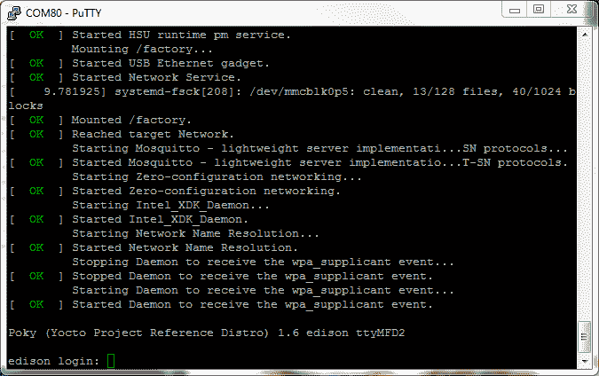

# 英特尔 Edison 的 SparkFun 模块-控制台模块

> 原文：<https://learn.sparkfun.com/tutorials/sparkfun-blocks-for-intel-edison---console-block>

## 介绍

[控制台模块](https://www.sparkfun.com/products/13039)是为英特尔 Edison 供电并与之通信的最简单方式之一。利用 FTDI 231X，这创建了一个 USB 到串行桥，该桥被电平转换到 Edison 所要求的适当的 1.8V。控制台位于 UART2 上。该块也能够向爱迪生以及其他堆叠的块提供电力。

*Console Block*

### 推荐阅读

如果你不熟悉积木，看看英特尔爱迪生的[spark fun 积木通用指南。](https://learn.sparkfun.com/tutorials/general-guide-to-sparkfun-blocks-for-intel-edison)

其他可能对您的爱迪生之旅有所帮助的教程包括:

*   [串行通信](https://learn.sparkfun.com/tutorials/serial-communication)
*   [如何安装 FTDI 驱动](https://learn.sparkfun.com/tutorials/how-to-install-ftdi-drivers)
*   [串行终端基础知识](https://learn.sparkfun.com/tutorials/terminal-basics)

## 主板概述

*Console Block Functional Diagram TOP*

*   USB Micro B-USB 端口为英特尔 Edison 堆栈提供电源和控制台访问端口。该模块通过 VSYS 线路向 Edison 和其他模块提供 4V 电压。根据负载的不同，该电压最高可达+/-0.1V。

*   电源按钮-电源开关连接到爱迪生的“PWRBTN”线上。这使用户能够将 Edison 置于睡眠状态或完全关闭模块。这不影响堆栈中其他模块的电源。

*   电源 LED -当 VSYS 通电时，电源 LED 会亮起。这可能来自控制台模块，或堆栈中的任何其他供电模块。

*   数据指示灯-数据指示灯帮助用户识别控制台是否处于活动状态。这是我们的 [FTDI 分线点](https://www.sparkfun.com/products/9716)上常见的一个特征。

*   LED 跳线-如果功耗是一个问题，切断每个跳线禁用 LED

*   扩展接头-70 针扩展接头发挥了英特尔 Edison 的功能。该头部还在整个电池组中传递信号和电力。这些功能很像一个 Arduino 盾牌。

## 使用控制台块

要使用控制台模块，请将 Intel Edison 连接到主板背面，或者将其添加到您当前的堆栈中。块可以在没有硬件的情况下堆叠，但是这使得扩展连接器不受机械应力的保护。

*Console Block Installed*

我们有一个很好的[硬件包](https://www.sparkfun.com/products/13187)可以提供足够的硬件来保护三个街区和一个爱迪生。

[*Intel Edison Hardware Pack*](https://www.sparkfun.com/products/13187)

### 连接到控制台

连接硬件后，将[微型 USB 线](https://www.sparkfun.com/products/10215)插入模块。如果您目前没有安装 FTDI 驱动程序，您需要在使用 Edison 之前下载并安装它们。访问我们的[教程](https://learn.sparkfun.com/tutorials/how-to-install-ftdi-drivers)获取如何安装驱动程序的指导。确保驱动程序已安装且设备正在运行后，打开您最喜欢的终端程序，并将其指向 USB 串行连接。我们还有另一个教程来解释[终端程序以及如何使用它们](https://learn.sparkfun.com/tutorials/terminal-basics)。

标准波特率为 115200bps。

一旦终端被激活，你就可以开始探索了！

### 使用电源按钮

Edison 上的电源按钮带来了一个在单板计算机上通常找不到的独特功能。电源按钮的行为与台式机和笔记本电脑上的电源按钮非常相似。

*   通电时，按住电源按钮约 10 秒钟将关闭 Edison。
*   断电时，短暂按下电源按钮将重启 Edison。
*   通电时，短暂按下电源按钮会将 Edison 置于睡眠模式。
*   在睡眠模式下，短按电源按钮会唤醒爱迪生。

## 资源和更进一步

现在，您已经对控制台块有了一个简要的概述，让我们来看看其他一些教程。这些教程涵盖编程、模块堆叠以及与英特尔 Edison 生态系统的接口。

### 爱迪生通用主题:

*   [英特尔爱迪生 Sparkfun 模块通用指南](https://learn.sparkfun.com/tutorials/general-guide-to-sparkfun-blocks-for-intel-edison)
*   [Edison 入门指南-使用 Arduino 编程](https://learn.sparkfun.com/tutorials/edison-getting-started-guide)
*   [在 Edison 上加载 Debian(Ubilinix)](https://learn.sparkfun.com/tutorials/loading-debian-ubilinux-on-the-edison)

### 阻止特定主题:

*   [如何安装 FTDI 驱动](https://learn.sparkfun.com/tutorials/how-to-install-ftdi-drivers)
*   [控制台块 Github Repo](https://github.com/sparkfun/Edison_Console_Block)

查看 SparkFun 的其他爱迪生相关教程:

 [### 英特尔 Edison - UART 模块的 SparkFun 模块](https://learn.sparkfun.com/tutorials/sparkfun-blocks-for-intel-edison---uart-block) A quick overview of the features of the UART Block.[Favorited Favorite](# "Add to favorites") 1 [### 英特尔爱迪生有机发光二极管模块的 SparkFun 模块](https://learn.sparkfun.com/tutorials/sparkfun-blocks-for-intel-edison---oled-block-) A quick overview of the features of the OLED Block for the Edison.[Favorited Favorite](# "Add to favorites") 3 [### 英特尔 Edison - PWM 火花模块](https://learn.sparkfun.com/tutorials/sparkfun-blocks-for-intel-edison---pwm) A quick overview of the features of the PWM Block.[Favorited Favorite](# "Add to favorites") 2 [### 英特尔 Edison - Pi 模块的 SparkFun 模块](https://learn.sparkfun.com/tutorials/sparkfun-blocks-for-intel-edison---pi-block) Tutorial on setting up and using the Pi Block for Intel Edison.[Favorited Favorite](# "Add to favorites") 2