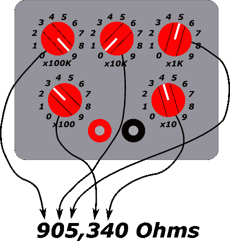
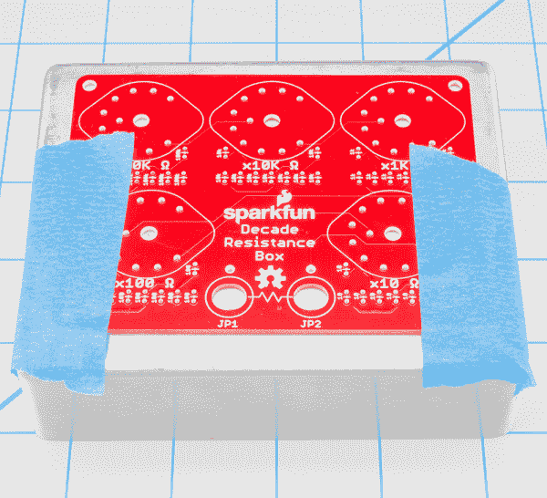
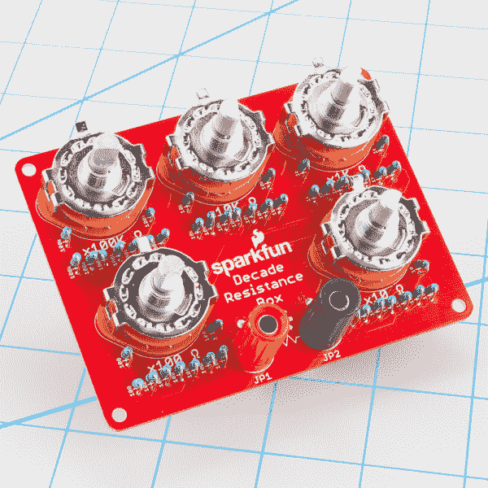
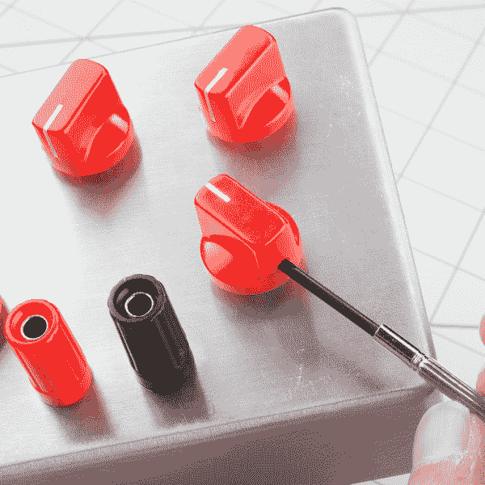
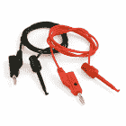

# 十进制电阻箱连接指南

> 原文：<https://learn.sparkfun.com/tutorials/decade-resistance-box-hookup-guide>

## 介绍

一个[十进制盒](https://www.sparkfun.com/products/13006)是一个工具，它包含许多值的电阻器，通过机械开关访问。调节旋钮以输出盒子提供的任何离散电阻。

 

将**添加到您的[购物车](https://www.sparkfun.com/cart)中！**

 **### [SparkFun 十年阻力盒](https://www.sparkfun.com/products/13006)

[In stock](https://learn.sparkfun.com/static/bubbles/ "in stock") KIT-13006

这是 SparkFun 十进制电阻盒，一个复杂的 PTH 焊接套件，可以让您快速准确地拨入一个…

$36.5014[Favorited Favorite](# "Add to favorites") 36[Wish List](# "Add to wish list")** **[https://www.youtube.com/embed/e2XQ4k7bWdU/?autohide=1&border=0&wmode=opaque&enablejsapi=1](https://www.youtube.com/embed/e2XQ4k7bWdU/?autohide=1&border=0&wmode=opaque&enablejsapi=1)

它们被称为*十进制*框，因为它们有对应于十进制数字的控件——一个用于十位的控件，一个用于百位的控件，等等。

传统的十进制盒子看起来就像弗兰肯斯坦博士实验室里的东西——大型木制外壳，带有雕刻的前面板和大胶木旋钮。它们有三种主要类型:电阻、电容和电感。此套件适用于十年电阻箱。它允许您以 10 &ohm;的增量快速准确地拨入 0 到 999，990 &ohm;之间的特定电阻值..

在本连接指南中，我们将首先组装十进制盒，然后探索其作为设计辅助工具和测试仪器的应用。

### 必要的工具

*   [烙铁](https://www.sparkfun.com/products/10707)
*   [含铅](https://www.sparkfun.com/products/9161)或[无铅](https://www.sparkfun.com/products/9325)焊料
*   [对角](https://www.sparkfun.com/products/8794)或[平齐](https://www.sparkfun.com/products/11952)刀具

### 额外的工具和用品

*   [红色](https://www.sparkfun.com/products/9997)或[黑色](https://www.sparkfun.com/products/9998)旋钮是*极力推荐的* -旋转开关没有旋钮很难转动！
*   一套[小钳子](https://www.sparkfun.com/products/8793)
*   小十字螺丝刀
*   几英寸长的实心连接线。
*   [安全眼镜](https://www.sparkfun.com/products/11046)
*   放大镜或[放大镜](https://www.sparkfun.com/products/9329)
*   [PCB 虎钳](https://www.sparkfun.com/products/10410)或[第三只手](https://www.sparkfun.com/products/11784)
*   [Volt Meter](https://www.sparkfun.com/products/12966)

### 可选材料

十进制盒可以装配在外壳中或前面板后面。在本教程中，我们将它建成一个铸铝外壳。

如果你想把你的建成一个封闭的，你需要以下。

*   [铝外壳](https://www.sparkfun.com/products/11351)
*   可移动胶带，如油漆工胶带或工头胶带
*   中心冲头和锤子
*   老虎钳或夹子
*   钻床或手钻
*   一套钻头或阶梯钻

### 推荐阅读

如果您不熟悉以下概念，我们建议您在继续之前查看这些教程。

 [### 如何焊接:通孔焊接](https://learn.sparkfun.com/tutorials/how-to-solder-through-hole-soldering) This tutorial covers everything you need to know about through-hole soldering.[Favorited Favorite](# "Add to favorites") 70 [### 连接器基础](https://learn.sparkfun.com/tutorials/connector-basics) Connectors are a major source of confusion for people just beginning electronics. The number of different options, terms, and names of connectors can make selecting one, or finding the one you need, daunting. This article will help you get a jump on the world of connectors.[Favorited Favorite](# "Add to favorites") 62 [### 电压、电流、电阻和欧姆定律](https://learn.sparkfun.com/tutorials/voltage-current-resistance-and-ohms-law) Learn about Ohm's Law, one of the most fundamental equations in all electrical engineering.[Favorited Favorite](# "Add to favorites") 132 [### 电阻](https://learn.sparkfun.com/tutorials/resistors) A tutorial on all things resistors. What is a resistor, how do they behave in parallel/series, decoding the resistor color codes, and resistor applications.[Favorited Favorite](# "Add to favorites") 57 [### 按钮和开关基础知识](https://learn.sparkfun.com/tutorials/button-and-switch-basics) A tutorial on electronics' most overlooked and underappreciated component: the switch! Here we explain the difference between momentary and maintained switches and what all those acronyms (NO, NC, SPDT, SPST, ...) stand for.[Favorited Favorite](# "Add to favorites") 53 [### 电力](https://learn.sparkfun.com/tutorials/electric-power) An overview of electric power, the rate of energy transfer. We'll talk definition of power, watts, equations, and power ratings. 1.21 gigawatts of tutorial fun 54 [### 如何使用万用表](https://learn.sparkfun.com/tutorials/how-to-use-a-multimeter) Learn the basics of using a multimeter to measure continuity, voltage, resistance and current.[Favorited Favorite](# "Add to favorites") 67

此外，建议查看关于外壳修改的教程:

|  |
| [外壳改造教程](https://www.sparkfun.com/tutorials/38) |

## 封闭钻井

十进制电阻可以安装在外壳内，也可以不安装外壳使用。如果你想把它放在一个外壳里，在组装电路板之前准备外壳是最容易的。

如果您不打算使用外壳，可以直接跳到下一节[。](https://learn.sparkfun.com/tutorials/decade-resistance-box-hookup-guide#electrical-assembly)

对于本指南，我们将使用小型[铝制外壳](https://www.sparkfun.com/products/11351)，因为它们经久耐用，而且铝易于钻孔。

### 标记

十进制电阻的 PCB 具有双重功能，可用作钻孔模板。外壳上需要的每个孔在 PCB 上都有一个匹配的孔。

要使用模板，将 PCB 用胶带粘在外壳上，每条边的间距相等。

用中心冲头标记每个孔的中心。用锤子敲它，这样它会留下一个小草皮，当你开始钻孔时，草皮会引导钻头。旋转开关有五个标记，香蕉插孔有两个标记。

香蕉插孔的椭圆形孔不会像冲头那样精确——用眼睛测量这些孔的中心是可以的。

### 演练

在我们开始钻孔之前，让我们花一点时间来回顾一些基本的钻孔安全实践，无论你是使用手钻还是钻床，这些实践都适用。

1.  在铝上钻孔会产生小而锋利的金属碎片(机械师称之为“卷曲物”或“碎片”)。安全眼镜或面罩是必不可少的，工作手套有助于保护你的指尖。

2.  钻头可能会卡在材料中，并导致盒子在钻头末端旋转。这很危险，因为它会损坏盒子、钻头和你的手指。钻孔前用老虎钳或夹子固定盒子！

3.  一点润滑剂可以帮助钻头更平稳地切削，并防止变钝。有专门的机械师钻头润滑剂，但如果你手边没有，几滴轻质家用油会有帮助。

如果你用的是普通的钻头，先从小钻头开始，然后逐渐增大。我们从 1/8”钻头开始，在每个中心打孔标记上打导向孔，然后逐渐加大钻头。旋转开关的五个孔应钻至 3/8 英寸。

两个香蕉连接器安装在 5/16 英寸的孔中。缺少 5/16”钻头，我们将它们钻至 1/4”，然后将孔锉平，直到连接器合适。

如果你对所有这些钻头变化不感兴趣，可以考虑使用阶梯式钻头，比如 [Irwin Unibit](http://www.irwin.com/tools/brands/unibit) 。

钻孔后，考虑使用埋头钻对孔进行去毛刺和倒角，以去除钻孔留下的任何锐边。

### 标记

在 [decade box GitHub 库](https://github.com/sparkfun/Decade_Resistance_Box)中，有一个面板图例的 SVG 文件。如果你有激光雕刻机，你可以把它刻在外壳上。

如果你不够幸运，没有激光切割机，你可以简单地把它打印在纸上，修剪成合适的形状，然后用胶带粘上。

## 电气组件

### 材料单

在我们开始焊接之前，让我们验证一下套件中是否有所有的零件。

如上所示，您应该有以下内容(从左上顺时针方向)

*   十进制电阻箱 PCB
*   九个 10 &ohm;电阻器(棕色-黑色-黑色-金色-棕色)
*   九个 100 &ohm;电阻(棕色-黑色-黑色-黑色-棕色)
*   九个 1000 &ohm;电阻器(棕色-黑色-黑色-棕色-棕色)
*   九个 100K &ohm;电阻器(棕色-黑色-黑色-橙色-棕色)
*   九个 10K &ohm;电阻器(棕色-黑色-黑色-红色-棕色)
*   一个红色香蕉插孔
*   一个黑色香蕉插孔
*   五个 1 极 10 位旋转开关，每个带有一个垫圈和六角螺母

### 电子组件

在大多数情况下，十年电阻 PCB 的组装非常简单。我们将继续讨论一些额外的技巧和窍门。

首先要注意的是，PCB 有明确的顶面和底面。元件放置在电路板的顶部，电路板上标记有每个元件的符号——电阻的刻度线和旋转开关的长方形轮廓。元件焊接在电路板的背面。铜焊盘只暴露在背面——如果你很难粘上焊料，请再次检查你的工作面是否正确。

#### 焊接电阻器

与许多其他焊接套件不同，这些套件中的电阻平放在 PCB 上，decade resistance 上的电阻将以“直立”的方向安装。这可以节省 PCB 上的空间，常用于吉他踏板和晶体管收音机等设备。

为了将电阻安装到电路板上，在主体的末端将一根引线急剧弯曲，折回 180，这样整体结果看起来就像一个发夹。

然后将电阻插入电路板，并张开引线，这样在焊接时它们就能固定住电阻。

焊接每个电阻后，修整靠近焊脚的引线。

套件中有五种不同电阻值的九件产品。每个阀门将安装在每个旋转开关附近。每一行都标有要安装在那里的值。

如果您不确定如何读取电阻上的条纹，可以使用万用表来验证它们的值。

#### 焊接旋转开关

电阻器就位后，安装旋转开关。旋转开关适合电路板上的匹配轮廓。尺寸略有不对称，因此它们只适合 PCB 的一个方向。

这五个开关都是相同的，并且可以在 PCB 上互换。将它们插入封装，并将所有 11 根引线焊接到位。如果你要把十进制盒子放在外壳里，在焊接之前确保开关平放在电路板表面。

最后，每个转盘的中心销都比其他转盘长。焊接后你可以用剪刀把它剪下来。

#### 捆绑柱

***如果您正在外壳中安装十进制电阻，请跳到[的下一节](#Enclosure)。您将把插孔安装到外壳上，而不是 PCB 上！***

在我们安装它们之前，让我们花点时间来看看香蕉插孔是如何搭配的。插孔的背面有螺纹，用一个大螺母将插孔固定到位。然而，这仅提供了千斤顶的机械安装。如果你仔细看，在千斤顶的尾部有一对更小的螺母。这些螺母的外部用于电气连接，内部螺母将插孔固定在一起。要使用千斤顶，我们首先需要确保内部螺母紧贴身体，这样千斤顶就不会分开。然后，我们将使用安装和电气连接。

即使有红色和黑色插孔，十进制盒没有特定的极性-哪个安装在哪个孔里并不重要。颜色编码只是一种约定，对于在繁忙的工作台上跟踪连接非常有用。

首先，从插孔中取出较大的螺母，然后通过 PCB 插入插孔，并重新安装螺母。注意不要拧得太紧，否则会剥下塑料螺纹。

一旦千斤顶安装牢固，取一根 2 英寸的实芯钢丝，[剥去末端](https://learn.sparkfun.com/tutorials/working-with-wire#how-to-strip-a-wire)。将一端弯成问号状卷曲。

将卷曲绕在接线柱的金属端，拧紧小螺母将其固定到位。如果旋度指向顺时针方向，这就容易多了。否则，拧紧螺母会导致电线松开并脱离接线柱。

将导线固定在接线柱上，将导线的另一端焊接到附近的 PCB 焊盘上。

安装第一个插孔后，对另一个插孔重复此操作。

完成所有这些后，你的十进制盒子应该是这样的

## 安装在外壳中

如果您选择将套件放在外壳中，组装会有一些变化。

首先，旋转开关有一个向上突出的对齐标签，防止它们安装在面板后面。用一把小钳子，简单地弯曲拉环，使开关主体靠在面板背面。

接线柱的安装也略有不同。将它们固定在外壳的面板上，而不是 PCB 上。

然后将电线安装在接线柱的背面。将电线穿过 PCB 上的椭圆形孔，并将它们焊接到位。

将 PCB 滑入外壳时，小心地将松弛的电线穿过孔。旋转开关将穿过外壳上相应的孔，接线柱的尾部将勉强穿过 PCB 上的椭圆形孔。

通过用垫圈和六角螺母安装每个旋转开关，将 PCB 固定在盒子中。您可以使用钳子或 12 毫米套筒拧紧螺母。

最后，将后盖放在外壳上，并安装旋钮。如果您使用上述推荐的旋钮，固定螺钉将拧紧在轴的平面上，与指示器成 180 度角。

## 快速试验

组装完成后，你可以用万用表快速测试十进制电阻。选择仪表上的电阻刻度，并在接线柱之间进行测量。

五个开关各有十个位置，有十万种组合！如果我们要尝试所有可能的设置，我们不能称这个部分为“快速测试”,所以我们将使用简化的方法。我们将验证每个开关和每个电阻是否安装正确且功能正常。如果它们单独是正确的，我们可以推断它们组合起来也是正确的。

1.  从零开始转动所有旋转开关。你应该在仪表上测量接近零欧姆。
2.  选择 10 的位置开关，并通过它的每个步骤单击它。开关每点击一次，仪表读数应增加 10 欧姆。
3.  测量顶部位置(90 &ohm;)后，将开关重置为零。
4.  对其他每个旋转开关重复上述步骤。

### 关于准确性的一个注记

值得一提的是，上述测试中的仪表读数不会与十进制盒上的设置完全匹配。例如，90 &ohm;设置可能显示为 89.3 或 90.5——非常接近理想值，但并不完美。有几个因素促成了这一点。

1.  首先，电路中存在少量固有电阻。万用表的引线、PCB 的走线和其它元件都不是理想导体，表现出少量的“寄生电阻”。实际上，它小到可以忽略不计。如果全零设置高于一欧姆或二欧姆，再次检查你的工作。
2.  第二，十进制电阻中的电阻也有少量可变性——它们的额定值在给定值的+/- 1%之内。有 0.1%容差的电阻，但比 1%的电阻贵得多。
3.  第三，万用表本身的准确度和精度会表现出一定的方差。

## 它是如何工作的

串联电阻是相加的。如果我们将电阻首尾相连，总电阻就是电阻值之和。下面，我们看到，我们可以通过在 33K 电阻上增加一个 10K 来制作一个 43K 电阻。

十进制盒子采用了这一原理。每十个是一串相同阻值的电阻。旋转开关用于选择字符串中与所需值相对应的点。

每个旋转开关有 10 个位置，从 0 到 9。0 位置只是将开关输入端与其输出端短接，每个连续位置都会在电路中增加一个电阻。一个开关可以是十进制值的 0 到 9 倍。如果我们需要 10 倍或更多的价值，我们就进入下一个十年。

十年也是按顺序排列的。十位控件提供给百位控件，依此类推。

### 限制

在讨论十进制电阻的一些应用示例之前，我们先来仔细看看这些器件，因为它们对十进制盒有一些限制。

对于现代的低压电子设备，我们经常在不使用太多功率或通过太多电流的假设下工作。有时，当事物变热、神秘重置、开始散发出热气味或着火时，我们会想起所涉及的电力或电流。

为了帮助避免这些情况，让我们探讨一下十年阻力的主要制约因素。

#### 电阻

首先要看的是电阻。每个电阻的额定功耗最高为 1/4 W。这可能看起来不多，但对于许多电路来说，这是一个合理的上限。让我们更仔细地分析一下原因。

我们知道以瓦特为单位的功率是用。

`P = IV`

如果我们不知道电压或电流项，但我们知道电阻，我们可以用欧姆定律代替缺失的 I 或 V 项，从而得到

`P = (V^2)/R`or`P = (I^2) * R`

我们走捷径，假设十进电阻上的最大电压是正负供电轨之差。对于一些常见的电源电压，我们将计算消耗 1/4W 的电阻。

| **电源电压** | **R 得出 1/4W** | **在 1/4W 时通过 R 的电流** |
| 3.3V | 43.56 &ohm; | 75 毫安 |
| 5V | 100 &ohm; | 50 毫安 |
| 9V | 324 &ohm; | 27 毫安 |
| 12V | 576 &ohm; | 20 毫安 |
| 30V
(正负 15V 电源) | 3600 &ohm; | 8 毫安 |

此表可作为应用十年电阻的指南。对于由给定电压供电的电路，“消耗 1/4W 的 R”列表示电阻，低于该电阻时，您需要考虑盒子消耗的功率。

但这是一个指导方针，而不是硬性规定。有些电路使用高压电源，但不要将全电压加在十进制箱上。

#### 开关

此外，制造商声明旋转开关限于通过 300 mA。

### 总结

如果你发现自己拨入的电阻低于 500 欧姆，花一点时间算出你将消耗多少功率，你将汲取多少电流。十进制盒的最大限制是总功耗为 1/4 瓦，通过的电流为 300 mA。如果你不确定，你可以用一个安培计和十进制电阻串联来验证电流消耗。

如果你需要帮助计算功耗，请查看我们的[功耗教程](https://learn.sparkfun.com/tutorials/electric-power)。[万用表教程](https://learn.sparkfun.com/tutorials/how-to-use-a-multimeter#measuring-current)描述了如何测量电路消耗的电流。

## 作为一种测量工具

十进制盒在电子测试台上非常有用。十进制盒的一个传统应用是测量未知电阻。

### 惠斯通电桥

[惠斯通电桥](http://en.wikipedia.org/wiki/Wheatstone_bridge)是一种 DC 电路，使用三个已知值的电阻来测量第四个电阻(甚至是其他材料，如土壤或液体)。惠斯通电桥通常被画成菱形，如下所示。

请注意，左边有一个电池(或其他 DC 源)，为钻石的顶部和底部供电。在菱形的中心，A 点和 B 点之间，是一个电压表。

菱形图掩盖了电路中的真实情况。如果我们重新排列和绘制电路，我们会发现它是一对电阻分压器。

A 点的电压由 R [1] 和可变电阻 R [2] 的比值决定，而 B 点的电压由 R [3] 和未知的 R [x] 的比值决定。如果两个比值相同，A 和 B 的电压就相同，我们就可以推断出 R [x] 的值。

R[2]/R[1]:R[x]/R[3]

我们可以解出 R [x] :

R[3](R[2]/R[1])= R[x]

而如果 R [1] 等于 R [3] ，则简化为

R [2] = R [x]

如果 R [2] 是一个十进制的盒子，我们可以简单地读取它的值，我们就知道未知电阻的值了！

### 惠斯通电桥在工作

为了测试我的惠斯通电桥，我让我的一个同事从我的备件箱中拉出一个随机电阻，然后涂上油漆，这样我就看不清条纹了。

我用 9V 电池和 100K 电阻为 R [1] 和 R [3] 搭建了一个惠斯通电桥。未知电阻插入为 R [x] ，十进制盒插入为 R [2] 。数字电压表插在分压器的中心点 A 和 B 之间。

调整十进制盒的值，直到仪表上显示的电压尽可能接近 0V。在这种情况下，仪表在 0.000 和-0.001 之间闪烁。此时，十进制框的值与未知电阻器的值相匹配。如你所见，我们测量了 9960 个&ohm;。这个神秘的电阻可能是一个 10K &ohm;，+/- 5%公差的电阻。

实际上，直接使用数字万用表读取电阻会更容易，但惠斯通电桥在某些类型的仪器中也有用途，可以配置成观察电阻的微小变化，例如应变仪的输出。众所周知，他们还在电路类实验室折磨工程系学生！

## 实验电路

由于便携式数字仪器已经取代了惠斯通电桥等传统技术，让我们在设计师的工作台上探索一个更实际的应用。

### 可变增益放大器

有时，当我们将模拟信号与微控制器接口时，模拟电压与模数转换器的范围不匹配。例如，信号摆幅可能为 100 mV，但转换器以 5V 为基准，转换器仅使用其量程的 2%。

为了使信号与转换器匹配，我们可以构建一个放大电路来提升输入电压。这个电路被称为“调节放大器”或“前置放大器”(简称“前置放大器”)。

一个简单的前置放大器是以同相模式连接的运算放大器。放大器的增益由一对电阻配置。

放大器的增益系数为

`1+(Rf/Rs)`

对于给定的一对电阻，我们可以计算增益系数——例如，如果两者都是 10K &ohm;，则计算公式为

`1+(10,000/10,000)`

这简化为 2 -放大器的输出将是输入电压乘以 2。继续上面的例子，如果 100 毫伏进去，那么 200 毫伏出来。

有时候，当我们开始设计时，我们不知道应用所需的增益系数。构建适合特定应用的放大器时，增益可调的前置放大器会很有用。我们可以构建一个使用十进制盒的反馈电阻，并选择一个分流电阻来提供合理的增益范围。

通过一个连接到 999，990 &ohm;的十进制盒和一个用于分流的 4.7K &ohm;电阻，我们可以获得大范围的放大，如下表所示。

| **算术增益** | **R1(分流)** | **R2(反馈)** |
| one | 4700 &ohm; | Zero |
| One point two one two | 4700 &ohm; | One thousand |
| Three point one two | 4700 &ohm; | Ten thousand |
| Twenty-two point two | 4700 &ohm; | One hundred thousand |
| Two hundred and thirteen | 4700 &ohm; | Nine hundred and ninety-nine thousand nine hundred and ninety-nine |

一旦我们找到了正确的电阻组合，我们就可以移除十进制盒，用单个电阻代替它。

同相放大器需要注意的一点是，它只能增加输入，而不能减少输入(没有办法选择可以去除等式中的`1`的电阻)。[反相放大器](http://en.wikipedia.org/wiki/Operational_amplifier_applications#Inverting_amplifier)也使用两个电阻来配置增益，但可以配置为小数(小于 1)增益，尽管这是以其他复杂性为代价的。顾名思义，这种配置在其输出端反转信号——这种情况可以用软件解决，但也有些违背直觉。

## 资源和更进一步

十进制盒子放在你的工作台上很方便——你永远不知道什么时候你需要拨入一个电阻。有关十年阻力箱的更多信息，请查看以下资源:

*   [示意图(PDF)](https://cdn.sparkfun.com/datasheets/Kits/SparkFun_decade_resistance_box.pdf)
*   [老鹰文件(ZIP)](https://cdn.sparkfun.com/datasheets/Kits/SparkFun_decade_resistance_box.zip)
*   [GitHub 回购](https://github.com/sparkfun/Decade_Resistance_Box)
*   [SFE 产品展示区](https://www.youtube.com/watch?v=e2XQ4k7bWdU)

这里有一些配件，你可能想在使用十进制电阻箱时随身携带。

*   [香蕉到 IC 钩](https://www.sparkfun.com/products/506)或[香蕉到鳄鱼](https://www.sparkfun.com/products/509)引线可用于将十进制电阻连接到其他电路。
*   构建同相放大器？你需要一些运算放大器。
*   如果您需要可以消耗更多功率的小电阻，请查看我们的[功率电阻套件](https://www.sparkfun.com/products/13053)，每个额定功率为 10W。

 

将**添加到您的[购物车](https://www.sparkfun.com/cart)中！**

 **### [香蕉到 IC 钩线缆](https://www.sparkfun.com/products/506)

[Out of stock](https://learn.sparkfun.com/static/bubbles/ "out of stock") CAB-00506

这些是用于连接万用表、电源、示波器、信号发生器等的各种引线电缆。电缆…

$5.507[Favorited Favorite](# "Add to favorites") 10[Wish List](# "Add to wish list")**** 

将**添加到您的[购物车](https://www.sparkfun.com/cart)中！**

 **### [香蕉对鳄索](https://www.sparkfun.com/products/509)

[Out of stock](https://learn.sparkfun.com/static/bubbles/ "out of stock") CAB-00509

这些是用于连接万用表、电源、示波器、信号发生器等的各种引线电缆。电缆…

$4.503[Favorited Favorite](# "Add to favorites") 18[Wish List](# "Add to wish list")**** 

将**添加到您的[购物车](https://www.sparkfun.com/cart)中！**

 **### [电源电阻套件- 10W (25 个装)](https://www.sparkfun.com/products/13053)

[In stock](https://learn.sparkfun.com/static/bubbles/ "in stock") KIT-13053

神圣的瓦特，蝙蝠侠！这款电源电阻套件包含 5 种不同的 10 瓦电阻值，包括 1 欧姆、2 欧姆…

$6.502[Favorited Favorite](# "Add to favorites") 16[Wish List](# "Add to wish list")**** 

### [-运算放大器(通孔)- LM358](https://www.sparkfun.com/products/retired/9456)

[Retired](https://learn.sparkfun.com/static/bubbles/ "Retired") COM-09456

LM358 是一款出色、易用的双通道运算放大器。运算放大器有很多应用(http://en . Wikipedia . org/wiki/Operati…

**Retired**[Favorited Favorite](# "Add to favorites") 15[Wish List](# "Add to wish list")****** ******需要一些灵感吗？查看一些相关教程:

*   [惠斯通电桥](http://en.wikipedia.org/wiki/Wheatstone_bridge)背后的理论。
*   除了惠斯通电桥，[韦恩桥](http://en.wikipedia.org/wiki/Wien_bridge)使用类似的调零技术来测量电容，[麦克斯韦电桥](http://en.wikipedia.org/wiki/Maxwell_bridge)测量电感。
*   霍华德·约翰逊关于精密电阻从何而来的趣闻。********