# 让它闪耀节日贺卡

> 原文：<https://learn.sparkfun.com/tutorials/let-it-glow-holiday-cards>

## 介绍

用纸质电路为朋友和家人制作一张发光卡片——不需要焊接！本教程将指导您如何仅使用铜带、硬币电池、LilyPad 按钮板和 LED 来创建简单的纸质电路，并让您对电路的工作原理有一个基本的了解。

[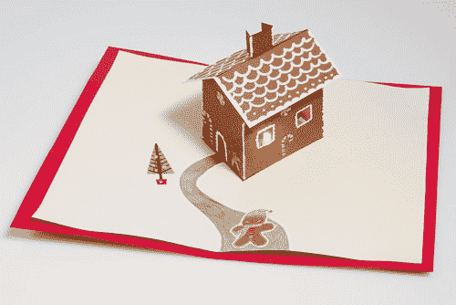](https://cdn.sparkfun.com/assets/learn_tutorials/3/1/8/GingerbreadCard.jpg)[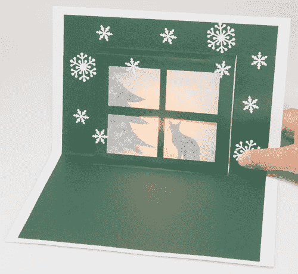](https://cdn.sparkfun.com/assets/learn_tutorials/3/1/8/WindowCard.jpg)

纸张工程师兼弹出式书籍设计师罗伯特·萨布达允许我们将他的一些免费模板用于电子产品。我们将在本教程中讨论电子构建，并链接到 Robert 对弹出卡的说明。

### 为什么我们不焊接？

你可能已经看过尼克精彩的父亲节卡片教程，并想知道为什么这一张与众不同。在用品或预算有限的教室或家庭中，使用胶带和手工用品有助于降低复杂性。缺点是连接不如胶带和焊料牢固/持久。如果手头有这些材料，您可以随时使用这些模板并将元件焊接到铜带上。

### 推荐阅读

如果你刚刚接触电子产品，这里有一些有用的阅读材料供你参考:

*   [什么是电路？](https://learn.sparkfun.com/tutorials/what-is-a-circuit)
*   [发光二极管](https://learn.sparkfun.com/tutorials/light-emitting-diodes-leds)

## 材料和工具

以下是您需要遵循的所有材料和工具的列表:

*   [铜带-5 毫米宽](https://www.sparkfun.com/products/10561)(每张卡大约 18 英寸的铜带)
*   LED (2 个用于圣诞树设计)*参见下面关于 LED 选择的注释
*   [纽扣电池-12 毫米(CR1225)](https://www.sparkfun.com/products/337)
*   [LilyPad 按钮板](https://www.sparkfun.com/products/8776)-或- [LilyPad 滑动开关](https://www.sparkfun.com/products/9350)
*   卡片纸(2-3 张)
*   牛皮纸或羊皮纸(可选)-为窗户切口中的 led 创造良好的漫射效果
*   透明带
*   胶水棒/胶水
*   剪刀/业余爱好刀
*   打孔机/螺丝打孔机(可选)-在圣诞树设计上打孔
*   装饰用品-贴纸，记号笔，白色笔(用于姜饼屋“糖衣”)

### *关于 led 的说明:*

我们建议使用你能找到的最小的 LED 灯-[3 毫米](https://www.sparkfun.com/products/532)效果很好，因为它们在折叠时不会给你的卡增加太多体积。要获得额外的天赋，试试骑自行车[RGB led](https://www.sparkfun.com/products/11448)。我们还发现，从一组 [LED 灯串](https://www.sparkfun.com/products/11752)上切下单个 LED 灯效果很好——在使用之前，你必须用一把业余爱好刀将电线上的涂层刮掉。我们将在教程的后面讨论这个过程。请随意尝试不同的 led，找到最适合您项目的产品。

## 步骤 1:打印模板

右键单击下面的图片，选择“链接另存为”将模板下载到您的计算机上。每个文件有两(或三)页，其中包括所有弹出件和电路模板。

将你的模板打印在卡片纸上。如果需要，调整打印机的页边距或在打印设置中选择“适合页面”。卡片模板比纸张略小，确保沿着黑色边框裁剪，以获得最终的卡片尺寸。

暂时将弹出页面放在一边。我们将首先构建我们的电路，然后在电子设备安装完毕后组装弹出式菜单。

[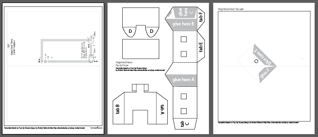](https://cdn.sparkfun.com/assets/learn_tutorials/3/1/8/HousePaperCircuit.pdf))

**[姜饼屋模板](https://cdn.sparkfun.com/assets/learn_tutorials/3/1/8/HousePaperCircuit.pdf) - 3 页**

在棕色卡片上打印第 2 页(弹出部分),制作一个很棒的姜饼屋底座，或者在浅色卡片上打印所有内容，完成后上色。也可以用来创建一个冬季小屋弹出。

[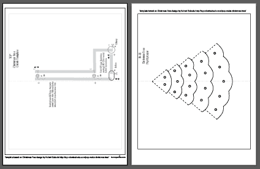](https://cdn.sparkfun.com/assets/learn_tutorials/3/1/8/TreePaperCircuit.pdf)

**[圣诞树模板](https://cdn.sparkfun.com/assets/learn_tutorials/3/1/8/TreePaperCircuit.pdf) - 2 页**

如果印在绿色卡片上看起来很棒，或者使用浅色卡片并在组装后进行装饰。

[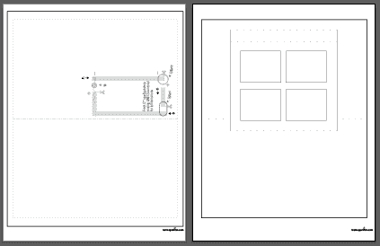](https://cdn.sparkfun.com/assets/learn_tutorials/3/1/8/WindowPaperCircuit.pdf)

**[窗口模板](https://cdn.sparkfun.com/assets/learn_tutorials/3/1/8/WindowPaperCircuit.pdf) - 2 页**

在牛皮纸上使用贴纸或剪纸，在窗框中打造节日剪影场景。

## 步骤 2:创建铜迹线

是时候用铜带为我们的电开辟一条通路了。两张卡片的模板非常相似，所以我们将使用姜饼屋模板进行演示。每个都有图标来帮助你构建电路。

#### 线路 A

看一下模板，找到标有 a 的圆圈。从铜带上剥去几英寸的纸背，沿着灰线粘住。

到达剪刀图标时剪切。

[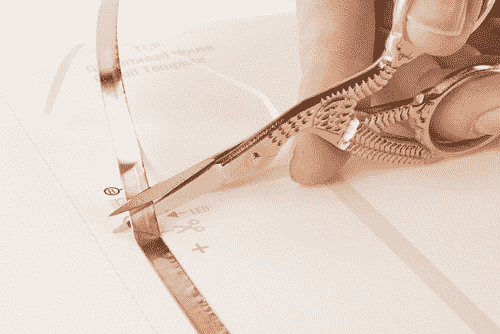](https://cdn.sparkfun.com/assets/learn_tutorials/3/1/8/CutTape.jpg)

#### 线路 B

接下来，我们将沿线 B 放置胶带，但是等等，这个角是什么？！为了保持拐角处铜的牢固连接，我们将使用折叠技术将胶带压制成型。

首先将铜带向下粘住，直到碰到拐角，然后将铜带向后折叠。用指甲或钢笔在边缘给它一个好的折痕。

[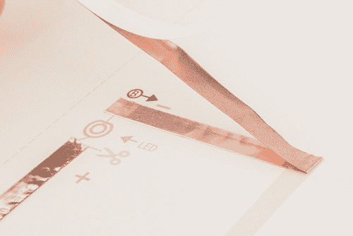](https://cdn.sparkfun.com/assets/learn_tutorials/3/1/8/LineB.jpg)

然后小心地将胶带从拐角处向下移动-你应该会看到折痕形成-并压平纸张。折叠的整洁并不重要，它最终会被你的弹出所覆盖。最后，在到达剪刀图标时剪断胶带。

[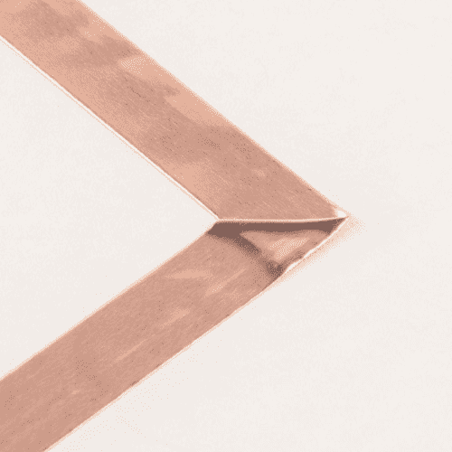](https://cdn.sparkfun.com/assets/learn_tutorials/3/1/8/FinishedCorner.jpg)

#### C 线

最后的铜带线也将形成电池座。我们将从折叠 1/2 英寸的铜带开始，将粘合面粘在一起形成一个口盖。

[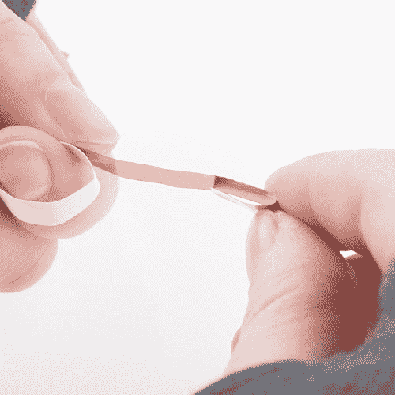](https://cdn.sparkfun.com/assets/learn_tutorials/3/1/8/FoldFlap.jpg)

这使得铜的顶部可以向下折叠到硬币电池上——电池的正极是顶部，负极是底部，这使得我们可以用铜带接触每一侧来创建一个“电池三明治”。

请参见下图，了解这种方法的工作原理。我们不会安装电池，直到我们的项目结束，所以现在把它放在一边。在进入下一步之前，沿着虚线中心对折卡片。

## 步骤 3:准备并放置 LED

现在我们的铜缆已经到位，是时候添加 LED 了。每个模板都有一个 LED 符号，它显示了一条成型的导线-我们使用这种方法来帮助我们记住 LED 的哪一面是正的，哪一面是负的。

以下是我们的[发光二极管(LED)教程](https://learn.sparkfun.com/tutorials/light-emitting-diodes-leds)中关于 LED 极性的摘录:

*“在电子学中，极性表示电路元件是否对称。发光二极管是二极管，只允许电流单向流动。当没有电流时，就没有光。幸运的是，这也意味着你不能通过反向插入来损坏 LED。相反，这是行不通的。LED 的正极称为“阳极”，以较长的“引线”或引线为标志。LED 的另一面，即负极，称为“阴极”。"*

**以下是弯曲标准 LED(如上图所示)以便为我们的电路做准备的说明。**

使用钳子(或您的手指)将 LED 灯的较长腿弯平。然后把线做成之字形。小心不要在同一个接头上来回弯曲太多次而折断电线。

[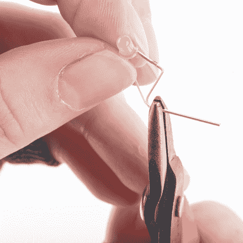](https://cdn.sparkfun.com/assets/learn_tutorials/3/1/8/ZigZagLED.jpg)

接下来，将另一条腿弯曲成螺旋状。用钳子的末端轻轻抓住电线的末端，并将其缠绕在工具上。

一旦所有成型完成，将 LED 放在桌子或平面上，确保其水平直立放置。如果没有，现在就进行调整。

*如果发光二极管以微小的角度指向圣诞树的中间以及相互之间，圣诞树的设计看起来最好，见下图。*

[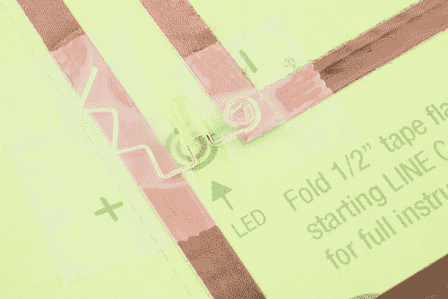](https://cdn.sparkfun.com/assets/learn_tutorials/3/1/8/AngledTreeLight.jpg)

#### 使用 LED 灯串

我们一直在尝试切割 [LED 灯串](https://www.sparkfun.com/categories/tags/fairy-light)(也称为仙女灯)，因为它们使用微小的 LED，非常适合贺卡等平面。从灯带上切下一个 LED，确保在两边各留下约 1/2 英寸的电线。然后用业余爱好刀刮掉电线上的涂层，使其暴露出来。确保刮擦电线的四周，而不仅仅是顶部或底部，以确保您与胶带的良好连接。砂纸也可以，如果你不想用刀的话。

每个 LED 将有四根电线来自它——两根正极和两根负极，因为 LED 以[并联](https://learn.sparkfun.com/tutorials/series-and-parallel-circuits#parallel-circuits)的方式连接。很难立即看出哪个是哪个(它们不像普通 led 那样有方便的长/短技巧)——但我们可以根据电池快速检查它们。一旦我们知道哪一面是正面，就用记号笔在电线上做标记，以帮助识别。让电线保持笔直，而不是像另一个 LED 例子那样对它们进行整形，这是没问题的。

[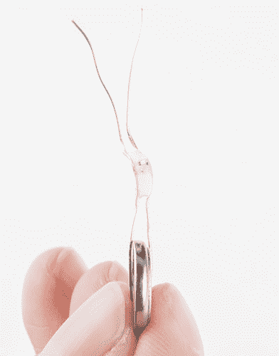](https://cdn.sparkfun.com/assets/learn_tutorials/3/1/8/TestStringLight.jpg)

如果你有超强的视力，你可以检查 LED 上的绿色标记，这是消极的一面。

[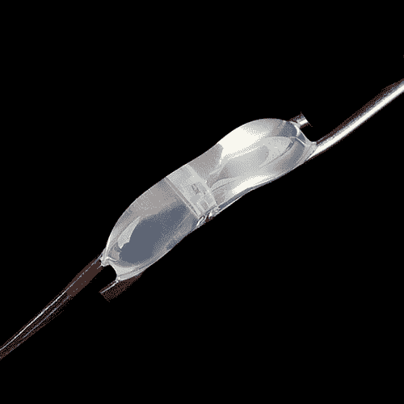](https://cdn.sparkfun.com/assets/learn_tutorials/3/1/8/PreppedStringLight.jpg)

这张图片显示了一个 LED 灯串，通过识别和标记正极电线并修剪多余的电线，使它们不会意外地相互短路。

#### 胶带向下发光二极管

不管哪种类型的 LED 将被插入卡中，将正极引线与标有+的铜带对齐，负极引线与-对齐。用透明胶带将其固定在铜片上。

[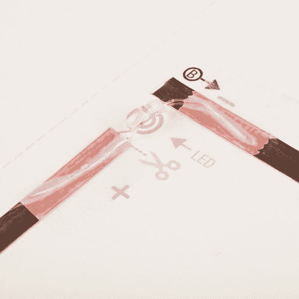](https://cdn.sparkfun.com/assets/learn_tutorials/3/1/8/TapedStringLight.jpg)

## 第四步:连接按钮

接下来，我们将把 LilyPad 按钮面朝上放在模板上的椭圆形图标上。哪一面接触正负并不重要。确保按钮底部的导电垫接触到铜带，然后用透明胶带封住两端。注意不要直接用胶带粘住按钮的按钮部分，否则会影响按下按钮的能力。你也可以用一个 [LilyPad 开关](https://www.sparkfun.com/products/9350)来代替按钮——安装是一样的。

[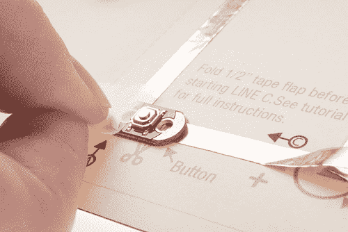](https://cdn.sparkfun.com/assets/learn_tutorials/3/1/8/TapeButton.jpg)

## 第五步:插入电池

一旦所有组件安装完毕，就该通过添加电池来测试我们的电路了。小心地将电池放在我们之前制作的铜带盖下面，并将其放在圆形图标的中心。确保电池的正极(顶部，标有电池型号和+)朝上。将铜压在电池上，并用透明胶带粘住。

现在，按下按钮，发光二极管应该亮了！

#### 解决纷争

*   检查胶带连接——用指甲或铅笔确保胶带将组件牢固地粘附在铜带上。
*   检查电池-确保它牢牢夹在顶部和底部铜带线之间，并且顶部铜带不会意外接触到电池底部。
*   检查 LED 灯的电线——再次检查它们是否在用钳子弯曲成各种形状时意外断裂。

完成的电路应该是这样的:

[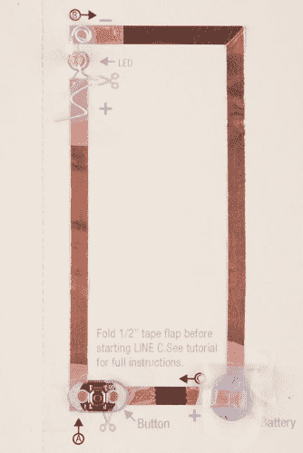](https://cdn.sparkfun.com/assets/learn_tutorials/3/1/8/FinishedCircuit.jpg)[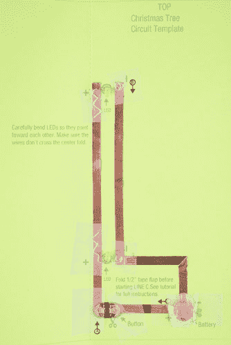](https://cdn.sparkfun.com/assets/learn_tutorials/3/1/8/FinishedCircuit2.jpg)

## 第六步:准备弹出

是时候剪掉我们的弹出式片段了。点击下面的链接，访问罗伯特萨布达的网站，了解组装姜饼和圣诞树弹出窗口的完整说明。

### [姜饼屋说明书](http://wp.robertsabuda.com/pop-make-house/)

*注意:*这个模板还有一个额外的编辑——用一把业余爱好刀在房子上切割窗户，这样 LED 就可以透过来了。在底部模板(pdf 的第 3 页)上剪下一个小圆圈，让 LED 发光，然后用胶水把房子粘住。

### [圣诞树说明](http://wp.robertsabuda.com/pop-make-christmas-tree/)

*注意:*要在 pop up 剪切折叠后制造出一串灯光效果，用打孔机或小剪刀把模板背面标注的小圆圈剪出来。为了获得三维效果，使用喷胶枪在每个孔的背面粘上少量胶水(注意不要将卡片粘在工作面上)。胶水会被挤压，形成一个类似灯泡的形状。这可能需要一些练习来为每个“灯泡”找到合适的胶水量——我们建议先用废纸试试。

[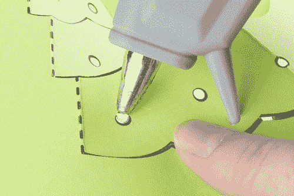](https://cdn.sparkfun.com/assets/learn_tutorials/3/1/8/GlueDotBack.jpg)[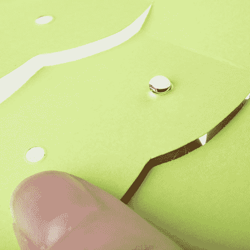](https://cdn.sparkfun.com/assets/learn_tutorials/3/1/8/GlueDot.jpg)

### **窗口指令**

沿着中心折痕开始折叠窗卡，注意不要弯曲框架。

[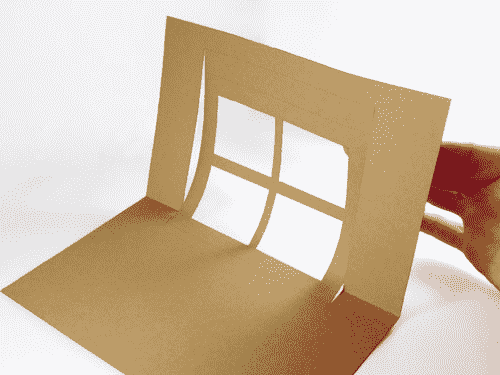](https://cdn.sparkfun.com/assets/learn_tutorials/3/1/8/CreaseCard.jpg)

接下来，小心地折叠窗框的底部。

[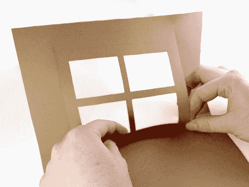](https://cdn.sparkfun.com/assets/learn_tutorials/3/1/8/FoldBottom.jpg)[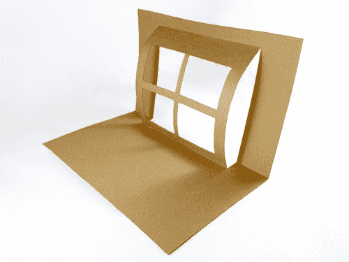](https://cdn.sparkfun.com/assets/learn_tutorials/3/1/8/BottomPopOut.jpg)

要折叠窗框的顶部折痕，请将卡片平放在桌子上。

您的最终弹出窗口将如下所示:

[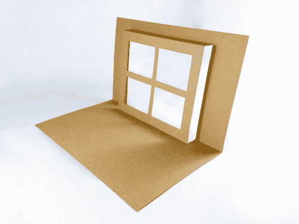](https://cdn.sparkfun.com/assets/learn_tutorials/3/1/8/FinalPopOut.jpg)

在相框后面使用一张羊皮纸或牛皮纸，打造磨砂效果。在剪影形状上贴上胶带或胶水，打造假日场景。

[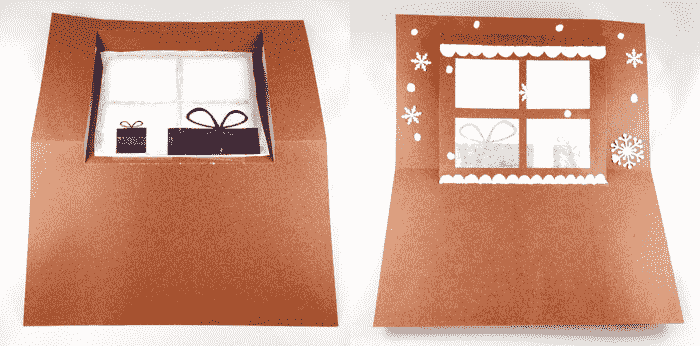](https://cdn.sparkfun.com/assets/learn_tutorials/3/1/8/WindowFinished.jpg)

## 第七步:集合并欣赏

当你的弹出式灯制作完成并准备好点亮时，小心地将它们放在你的铜带电路上，如果必要的话，剪一些孔，让 LED 穿过纸。用胶水或胶带将边角粘到背衬上。轻轻向下折叠弹出装置，合上卡片。

[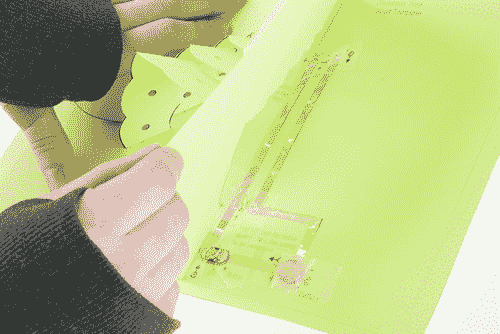](https://cdn.sparkfun.com/assets/learn_tutorials/3/1/8/CircuitUnderCard.jpg)

最后，用记号笔或贴纸指出应该按下按钮的位置。

添加任何额外的装饰，使卡片格外特别。我们用一支白色的钢笔在姜饼屋和一些糖果贴纸上创造了糖衣。

现在，您的热情洋溢的节日问候已经准备好发送给朋友或留给自己了！

## 资源和更进一步

### 要尝试的事情:

*   尝试这些技术与其他弹出式设计或创建自己的-你能找出如何适应铜带路径，以适应你的卡选择？
*   在你制作好卡片后，用贴纸、颜料或记号笔让它更加个性化

### 延伸阅读:

*   电子工艺资源 - SparkFun 的教育部门有一些关于电子工艺的可下载模板和活动。
*   [点亮父亲节卡片](https://learn.sparkfun.com/tutorials/light-up-fathers-day-card)——一张使用铜带和焊接技巧的发光卡片。
*   点亮情人节卡片