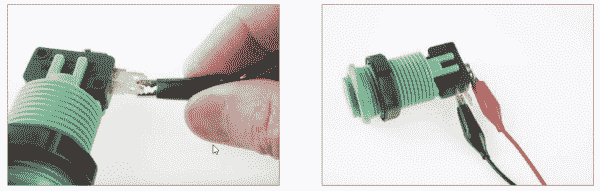

# 使用 SparkFun 微微板和 Scratch

> 原文：<https://learn.sparkfun.com/tutorials/using-the-sparkfun-picoboard-and-scratch>

## 介绍

**Heads up!** As of the writing of this tutorial, Scratch 3.0 and 2.0 does not fully support the PicoBoard. We suggest using [Scratch 1.4](http://scratch.mit.edu/scratch_1.4/) until the full PicoBoard extensions are implemented, tested, and rolled out with Scratch 2.0+.

Scratch 是一个教孩子如何编程的神奇工具。通常，我们专注于在 Scratch 中创建有趣的动画、游戏、演示文稿和音乐视频。但是，想象一下，如果您可以在 Scratch 动画中添加物理交互性，那该有多酷。例如，如果你的 Scratch 角色在你关掉房间的灯时开始跳舞，或者灯一亮就停止跳舞，那该怎么办！借助微微板，我们可以做到所有这些，甚至更多。

### 微微板是什么？

[PicoBoard](https://www.sparkfun.com/products/11888) 是一种称为传感器板的硬件，可以与麻省理工学院的 Scratch 编程环境结合，让你的 Scratch 程序对计算机外部发生的事件做出反应(甚至做出响应)。(如果你对 Scratch 不熟悉，想了解更多，请阅读科学伙伴[对 Scratch 的介绍](http://www.sciencebuddies.org/science-fair-projects/project_ideas/scratch-intro.shtml)页面。)传感器是一种检测(感知)和测量某物存在与否的装置。微微板实际上由几种不同类型的传感器组成，因此它可以检测许多不同的“东西”，包括声音和光。

PicoBoard 有几个可以直接用于 Scratch 编程环境的传感器:

**滑块:**根据滑块的位置从 0 到 100 改变数值。

**光传感器:**根据该传感器上的光量在 0 到 100 之间改变数值。

**按钮:**按钮的位置或状态控制按钮被按下的值(真或假)。

**声音传感器:**根据检测到的声音量，在 0 到 100 之间改变数值。

**辅助连接(A、B、C、& D):** 鳄鱼夹:这些是任何电阻传感器的通用连接。随着电阻的变化，输入值也会变化。该传感器也可以设置为数字检测器，以检测鳄鱼夹是否连接。

### 下载草稿 1.4

注意:目前，PicoBoard 仅与 Scratch 1.4 兼容。

要开始使用，您需要为您的电脑安装 Scratch 1.4。访问 scratch.mit.edu/scratch_1.4/下载 Scratch 的 1.4 版本。

目前，Scratch 2.0 和 PicoBoard 的接口正在开发中。我们仍在努力解决这个问题。我们建议使用较旧且稳定的(1.4 版)Scratch 与微微板接口。

### 安装驱动程序

除了安装 Scratch，你还需要为你的电脑安装 [FTDI 驱动](http://www.ftdichip.com/Drivers/VCP.htm)。FTDI 驱动程序将允许 PicoBoard 硬件与您的计算机通信。跟随我们的指南[在这里](https://learn.sparkfun.com/tutorials/how-to-install-ftdi-drivers)如何安装和设置你的机器的驱动程序。

### 连接微微板

使用 USB 电缆，将 PicoBoard 连接到您的电脑，并打开 Scratch。为了测试功能，让我们用这个块来玩一下 Scratch sprite 的大小特性。找到这些积木，把它们串在一起。将(滑块传感器值)块移动到设置尺寸块中，用传感器值替换尺寸。

在**控制调色板**下找到“绿旗”帽子块和永久块，**外观调色板**下找到设定尺寸块，**感应调色板**下找到传感器值块。

将积木组装在一起，使其看起来像这样:

单击绿色标志或“帽子”块启动您的程序。几秒钟后，您应该会看到微微板上的红/绿灯开始闪烁。来回移动滑块，看看会发生什么！

->红/绿灯表示微微板和电脑之间正在接收(RX)和发送(TX)数据。

传感器值报告程序块可用于替代 Scratch 中的任何值字段(空白/数字)。尝试任何其他的暂存区块，例如*移动( )步骤*或*转到 x: ( ) y: ( )* 。这些值中的任何一个都可以用微微板的传感器值来代替。

找到你最喜欢的 Scratch 程序，并重新混合使用传感器块！

## 使用附加传感器(PicoBoard 插件/ LabPack)

[PicoBoard LabPack](https://www.sparkfun.com/products/11683) 带有几个附加组件，用于连接辅助端口。

### 如何在微微板上添加传感器

四个附加端口(A-D)允许微微板连接到许多其他附加传感器。微微板测量两个鳄鱼夹的电阻。插入微微板连接器时，确保将连接器完全推入。

*   将鳄鱼夹插入其中一个微微板端连接器。有四个终端连接器。它们是 A、B、C 或 d。

微微板测量辅助端口的两个鳄鱼夹之间的电阻。您可以将任何电阻传感器与这些夹子一起使用。我们已经创建了一个附加的部件套件，您可能会发现使用它很有用。在附加套件中，我们有:

### 按钮/开关(数字传感器)

最基本的“传感器”是一个简单的开关。开关允许我们在两个金属连接之间电连接或断开电通路。微微板检测两个鳄鱼夹是否连接。

在附加套件中，我们包括两个街机开关。

这些开关非常整洁。他们使用一个有三个连接点的瞬时限位开关。将一个鳄鱼夹连接到最里面的凸耳上。将第二个鳄鱼夹连接到最外面的连接片上。

可以使用布尔传感器模块在 Scratch 中触发开关:

这些块可以与控制块一起使用，例如:

### 模拟传感器

所有其他电阻传感器都被视为“模拟”传感器。PicoBoard 将测量传感器的电阻，并报告一个范围从 0 到 100 的值。对于 A、B、C 或 d 上的辅助传感器，可以使用这些模块中的任何一个来访问这些值。

#### 旋转电位计

旋转电位计基本上与滑块相同，但是，你只需转动电位计上的旋钮，而不是来回移动滑块。将一个鳄鱼夹连接到中央凸耳，将另一个鳄鱼夹连接到任一外侧凸耳。注意:该传感器的极限仅在 0 到 50 之间变化(而不是 0 到 100)。

#### 发动机

传统上，电机是一种输出设备，但当连接到微微板上时，您可以将电机用作发电机。旋转电机，看看输入值会发生什么变化。只需将电机的两根电线连接到两个鳄鱼夹上。

#### [力敏电阻](#fsr)

这个方形传感器感应施加在表面上的压力。当你按下方块时，电阻会改变。

将鳄鱼夹延长部分(常规鳄鱼夹电线)连接到力敏电阻末端的两个金属插脚上。

夹住时，确保金属夹完全就位并接触到传感器的金属部分。此外，确保鳄鱼夹不会相互接触。

#### 电热调节器

热敏电阻是一种特殊类型的电阻器，其电阻随温度而显著变化。随着温度升高，热敏电阻的电阻减小。从技术上来说，热敏电阻需要使用[施泰因哈特-哈特](http://en.wikipedia.org/wiki/Steinhart%E2%80%93Hart_equation)方程来将微微板传感器值转换为实际温度，但您可以使用鳄鱼夹简单地连接热敏电阻。

如果你对在 Scratch 中校准热敏电阻的指南感兴趣，可以看看我们关于在 Scratch 中使用标准土耳其温度计的博文。

 [### 感恩节、编程和阿利尔数据

November 30, 2014](https://learn.sparkfun.com/blog/1663 "November 30, 2014: Happy Thanksgiving everyone! Check out this quick little hack using a standard temperature probe from my oven thermometer, our PicoBoard, and a little creative coding in Scratch!")[Favorited Favorite](# "Add to favorites") 0

## 快速参考指南

既然已经正确设置了 PicoBoard，就可以开始使用它了。传感器表描述了每个传感器、如何使用它，以及可用于捕获和使用传感器信息的暂存块(单击图像查看大图)。

## 资源和更进一步

您不仅仅局限于我们附加套件中包含的传感器。尝试看看什么东西是导电的，什么东西是不导电的！因为鳄鱼夹测量电阻率(电导)，您可以使用它作为水盐度或溶液电导率的传感器。

查看这些其他教育 SparkFun 教程。

*   [DigitalSandbox PicoBoard](https://learn.sparkfun.com/tutorials/digitalsandbox-picoboard)
*   [数字沙盒实验指南](https://learn.sparkfun.com/tutorials/digital-sandbox-experiment-guide)
*   [逻辑块&数字逻辑介绍](https://learn.sparkfun.com/tutorials/logicblocks--digital-logic-introduction)
*   [逻辑块实验指南](https://learn.sparkfun.com/tutorials/logicblocks-experiment-guide)
*   [纸质电路大指南](https://learn.sparkfun.com/tutorials/the-great-big-guide-to-paper-circuits)