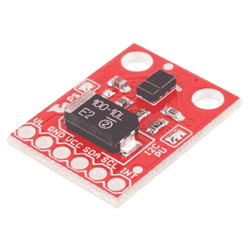

# APDS-9960 RGB 和手势传感器连接指南

> 原文：<https://learn.sparkfun.com/tutorials/apds-9960-rgb-and-gesture-sensor-hookup-guide>

## 介绍

无触摸手势是人机界面领域的新前沿。通过在传感器上滑动你的手，你可以控制计算机、微控制器、机器人等。一家制造商甚至发明了一种[免触摸马桶](http://www.us.kohler.com/us/Touchless-Toilets/content/TouchlessToilets.htm)，当你把手放在水箱上时，马桶就会冲水。[阿瓦戈 APDS-9960](https://www.sparkfun.com/products/12787) 提供环境光和颜色(如透明、红色、绿色和蓝色)测量、接近检测和手势感应。

 

将**添加到您的[购物车](https://www.sparkfun.com/cart)中！**

 **### [SparkFun RGB 和手势传感器- APDS-9960](https://www.sparkfun.com/products/12787)

[In stock](https://learn.sparkfun.com/static/bubbles/ "in stock") SEN-12787

这是 SparkFun RGB 和手势传感器，一个内置 APDS-9960 传感器的小分线板，提供环境光…

$16.508[Favorited Favorite](# "Add to favorites") 86[Wish List](# "Add to wish list")** **[https://www.youtube.com/embed/A3QRyixnEl8/?autohide=1&border=0&wmode=opaque&enablejsapi=1](https://www.youtube.com/embed/A3QRyixnEl8/?autohide=1&border=0&wmode=opaque&enablejsapi=1)

APDS-9960 RGB 和手势传感器板断开了阿瓦戈 APDS-9960 上的引脚，因此您可以轻松地在各种项目中使用它。APDS-9960 使用 [I ² C](https://learn.sparkfun.com/tutorials/i2c) 接口进行通信。

### 本教程涵盖的内容

在本教程中，我们将概述 APDS-9960 传感器板，并提供一个示例连接和代码。本教程分为以下几个部分:

*   [电路板概述](https://learn.sparkfun.com/tutorials/apds-9960-rgb-and-gesture-sensor-hookup-guide#board-overview) -首先，我们将讨论分线板上的每个引脚及其功能。本节还概述了主板前面的跳线。
*   [硬件连接](https://learn.sparkfun.com/tutorials/apds-9960-rgb-and-gesture-sensor-hookup-guide#hardware-hookup) -在这一部分，我们将向您展示如何将 APDS-9960 连接到 Arduino，以通过 I ² C 检测手势
*   [Arduino 库安装](https://learn.sparkfun.com/tutorials/apds-9960-rgb-and-gesture-sensor-hookup-guide#arduino-library-installation)——在这里，我们下载并安装 APDS-9960 Arduino 库。
*   [手势感应示例](https://learn.sparkfun.com/tutorials/apds-9960-rgb-and-gesture-sensor-hookup-guide#gesture-sensing-example) -我们用手势测试示例来测试传感器。
*   [资源和进一步发展](https://learn.sparkfun.com/tutorials/apds-9960-rgb-and-gesture-sensor-hookup-guide#resources-and-going-further) -你做了一个简单的手势传感器，但你将何去何从？本节将为您提供一些额外的资源，帮助您更好地利用 APDS-9960。

### 使用的材料

您将需要一些组件和工具来完成本教程。以下是你需要的:**