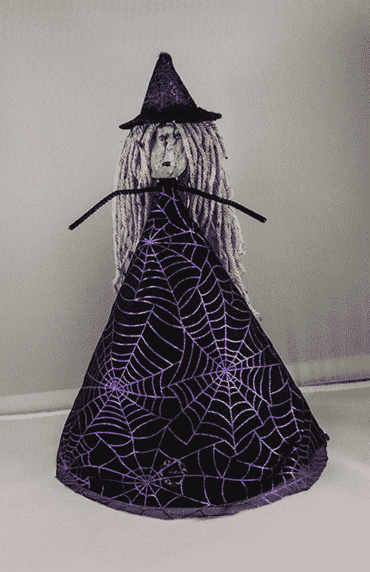

# 咯咯叫的苹果头女巫

> 原文：<https://learn.sparkfun.com/tutorials/cackling-apple-head-witch>

## 介绍

在本教程中，我们将向你展示如何用一个苹果和一些有趣的零件制作一个有趣、简单的万圣节道具。你将把一个 [LilyPad 光传感器](https://www.sparkfun.com/products/8464)和 [LilyPad MP3 触发器](https://www.sparkfun.com/products/11013)缝到一件女巫的衣服上，并且能够为女巫定制你自己的声音。到项目结束时，你将拥有一个完成的女巫娃娃，只要灯光一暗，它就会咯咯叫！

### 推荐阅读

如果你以前从未使用过电子纺织品，你可以看看其他的教程。

*   [lily pad MP3 播放器入门](https://learn.sparkfun.com/tutorials/getting-started-with-the-lilypad-mp3-player)
*   [电子纺织品基础知识](https://learn.sparkfun.com/tutorials/e-textile-basics)
*   [用导电线缝制](https://learn.sparkfun.com/tutorials/sewing-with-conductive-thread)

## 材料和工具

让我们回顾一下将项目组合在一起所需的所有东西: