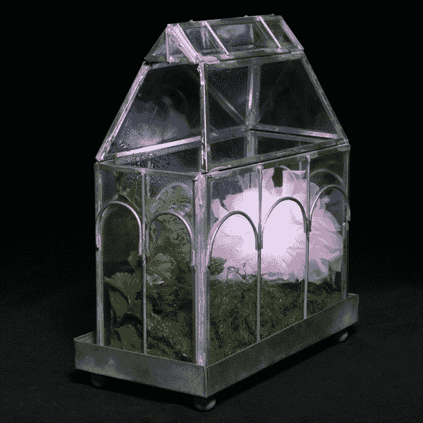

# 湿度感应 LED 花

> 原文：<https://learn.sparkfun.com/tutorials/humidity-sensing-led-flower>

## 介绍

本教程将向您展示如何制作自己的感应湿度的 LED 花，就像本周《电气》一集中的 LED 花一样！如果你错过了，这里的视频解释了电路是如何工作的:

替换打开

[//www.youtube.com/embed/vJjgMwaF4Co](//www.youtube.com/embed/vJjgMwaF4Co)

替换关闭

这是一个非常通用的项目。它生活在我的玻璃容器里，可以去任何地方，包括一件衣服或配饰。我没有走那条路的唯一原因是我们的地理位置:科罗拉多是一个非常无聊的湿度感测地！

继续阅读，学习如何制作自己的。

### 推荐阅读

在开始学习本教程之前，您应该熟悉一些概念。在继续本教程之前，考虑阅读下面的一些教程。

 [### 如何焊接:通孔焊接](https://learn.sparkfun.com/tutorials/how-to-solder-through-hole-soldering) This tutorial covers everything you need to know about through-hole soldering.[Favorited Favorite](# "Add to favorites") 70 [### 使用导线](https://learn.sparkfun.com/tutorials/working-with-wire) How to strip, crimp, and work with wire.[Favorited Favorite](# "Add to favorites") 50 [### 什么是 Arduino？](https://learn.sparkfun.com/tutorials/what-is-an-arduino) What is this 'Arduino' thing anyway? This tutorials dives into what an Arduino is and along with Arduino projects and widgets.[Favorited Favorite](# "Add to favorites") 50 [### I2C](https://learn.sparkfun.com/tutorials/i2c) An introduction to I2C, one of the main embedded communications protocols in use today.[Favorited Favorite](# "Add to favorites") 128

## 材料

这是你在这条赛道上需要的东西。RGB LED 花是 21 世纪时尚套装的专属，但如果你愿意，你可以用一个[标准 RGB LED](https://www.sparkfun.com/products/105) 来代替！