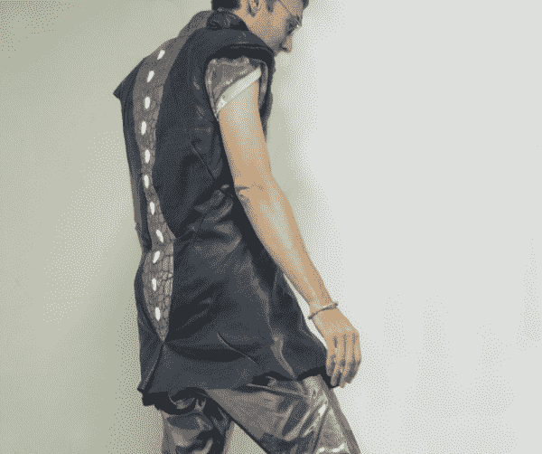
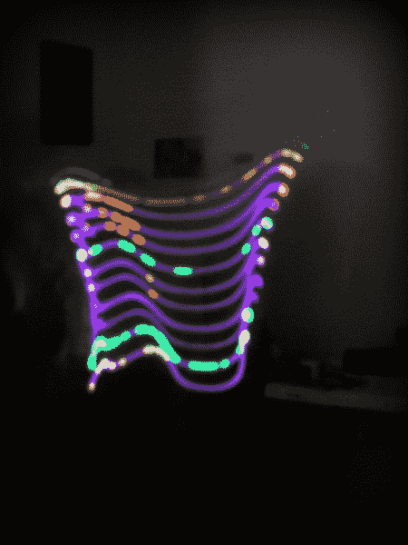
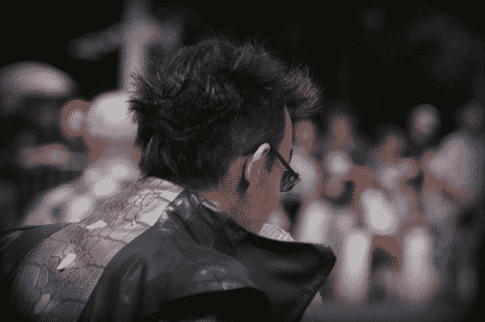

# 住宅黑客——可穿戴设备的声音和运动反应

> 原文：<https://learn.sparkfun.com/tutorials/hackers-in-residence---sound-and-motion-reactivity-for-wearables>

## 声音、光和运动的舞蹈

在 SparkFun，我想要一件更智能的夹克:一件可以根据周围环境做出反应的变色夹克。这个概念似乎很简单。使用声音和动作感应作为界面，我能够改变颜色以融入环境。这提高了对按钮或开关的需求，否则它们可能会将我们的用户带离当前时刻。

*The finished product.*

有许多挑战，主要是舒适性和控制。我发现穿着亮色服装的舒适的关键之一是与周围环境的共生。然而，我需要区分狂热的艺术开幕式的高能量气氛和其他温和的活动，如分享一顿饭或排队等候。我们经常没有考虑到我们的衣服在别人眼里会有多亮，这个项目的目的就是解决这个问题。实现与周围环境协同的一个方法是在表达之前先倾听，或者，在这种情况下，在太亮或太快部署模式之前先感知。

*A long exposure photo displaying how sounds can be viewed across various frequencies.*

我使用加速度计和麦克风来感知环境和佩戴者的能量水平。加速度的快速变化，特别是佩戴者的旋转，被解释为处于照明可能更亮且图案循环更快的环境中。

我用麦克风来感应各种频率的范围和音量。人类声音的相当正常的频率和最小的音量将被解释为给出相当一致的颜色而没有太多的运动。如果频率较低，音量较大，该设计会假设正在播放音乐，并引入更多颜色。

*With little motion or sound, the colored spine appears to reflect the given color rather than emit.*

选择了一种特殊的颜色来将穿着者融入他们的环境中。略带粉红色的中音范围与设计的其余部分相协调，在不活动的时候融合在一起，而蓝调和绿松石则在重复播放的音频中出现，具有更低的音量。这些蓝色与设计的其他部分形成直接对比，因此变得非常明显。

## 计划好了

SparkFun 令人惊叹的设施和仓库为选择问题而生。一般来说，我选择组件基于什么是容易获得的或最便宜的。鉴于我独特的环境，我想选择最好的组件来简化开发和优化效果的整体质量。

## 组装硬件

这是我最终在项目中使用的硬件。