# 闪光的不给糖就捣蛋包

> 原文：<https://learn.sparkfun.com/tutorials/twinkling-trick-or-treat-bag>

## 介绍

开始制作闪闪发光的零食袋吧！下载我们的预制设计之一，并使用烫印转印贴在您的包上。在本教程中，我们将使用鬼屋设计，但每个模板的过程都是相似的。

This tutorial uses the [ProtoSnap LilyTwinkle Kit](https://www.sparkfun.com/products/11590).[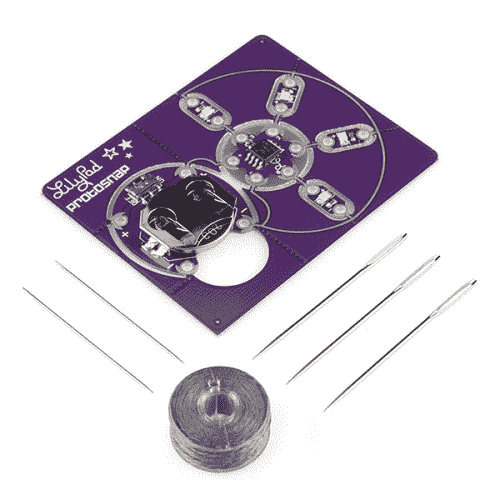](https://www.sparkfun.com/products/11590) 

将**添加到您的[购物车](https://www.sparkfun.com/cart)中！**

### 

[In stock](https://learn.sparkfun.com/static/bubbles/ "in stock") DEV-11590

ProtoSnap 系列是一种无需试验板即可构建项目原型的新方法。所有东西都连接在一个单独的业务对象上…

$19.501[Favorited Favorite](# "Add to favorites") 18[Wish List](# "Add to wish list")** **### 推荐阅读

如果你以前从未使用过电子纺织品，你可以看看其他的教程。

*   [电子纺织品基础知识](https://learn.sparkfun.com/tutorials/e-textile-basics)
*   [用导电线缝制](https://learn.sparkfun.com/tutorials/sewing-with-conductive-thread)
*   [LDK 实验二:多个 LED 电路](https://learn.sparkfun.com/tutorials/ldk-experiment-2-multiple-led-circuits)
*   [LDK 实验六:微控制器电路](https://learn.sparkfun.com/tutorials/ldk-experiment-6-microcontroller-circuits)

## 材料和工具

### 让我们来看一下完成项目所需的所有东西:

*   棉质手提袋
*   熨烫织物转移(检查您当地的工艺品或爱好商店)
*   喷墨打印机(如果使用烫印转印)
*   毛毡或织物(黑色、黄色、橙色、灰色和白色——取决于你的设计)
*   剪刀
*   热胶枪
*   维可牢
*   绝缘材料(例如:丙烯酸/织物漆、织物胶、熨烫接口或额外织物)更多信息见[步骤 7](https://learn.sparkfun.com/tutorials/twinkling-trick-or-treat-bag#step-7-insulate) 。

#### ProtoSnap LilyPad Twinkle 套件包括:

*   LilyTwinkle 微控制器
*   4 个白色 LilyPad LEDs
*   LilyPad 硬币电池座(开关式)
*   3V 纽扣电池
*   导电线线轴
*   缝纫针- *我们建议您使用套件中的小针，在熨烫转移时，大针会在缝线周围留下大洞。*

[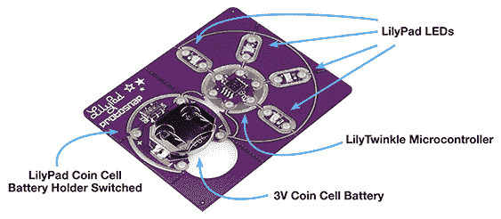](https://cdn.sparkfun.com/assets/learn_tutorials/2/9/6/LilyTwinkleKit.jpg)

对于本教程中的图形，我们将使用一个关键词来帮助解释每一步发生了什么:

## 第一步:准备你的画布

我们将把电路从我们的 ProtoSnap LilyTwinkle 转移到手提袋上。首先，选择一个万圣节设计转移到袋子上。

[下载房屋设计](https://cdn.sparkfun.com/assets/learn_tutorials/2/9/6/HalloweenHouse_IronOn.pdf) [下载猫咪设计](https://cdn.sparkfun.com/assets/learn_tutorials/2/9/6/HalloweenCat_IronOn.pdf) [下载蝙蝠设计](https://cdn.sparkfun.com/assets/learn_tutorials/2/9/6/HalloweenBat_IronOn.pdf) [下载幽灵设计](https://cdn.sparkfun.com/assets/learn_tutorials/2/9/6/HalloweenGhost_IronOn.pdf)

下载设计后，按照烫印转印件包装上的说明准备打印。 ***提示:在使用转印纸之前，先在普通纸上试打印，以确保打印机的页边距显示整个模板。***

让转印干燥(通常在打印后 30 分钟)，然后在设计周围剪去所有说明文字和信息。将图像放在手提袋上，并按照包装说明进行熨烫。熨平后，让转印冷却几分钟，然后剥离背衬。

当我们等待设计冷却下来的时候，让我们把 LilyTwinkle 碎片分开，为下一步启动胶枪。你可能需要用剪刀把它们分开。取出电池，放在一边，直到所有缝纫完成。

[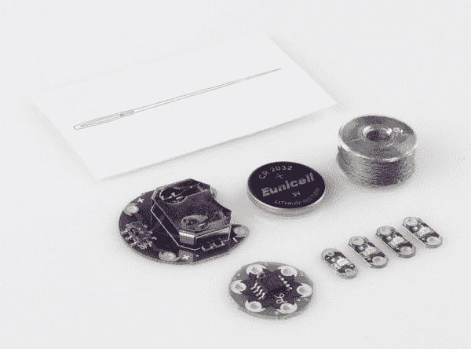](https://cdn.sparkfun.com/r/600-600/assets/b/3/8/6/f/5244b445757b7f37388b456b.jpg)

## 步骤 2:连接组件

查看您的设计，确定放置每个组件的轮廓。将部件上的正负符号与手提袋上的匹配轮廓对齐。然后用少量的热胶水粘在布料的背面。小心不要用热胶水填满任何缝纫孔。如果你的胶水渗透过第一层布料，不小心把袋子粘住了，在装部件的时候，在手提袋里放一块硬纸板。

[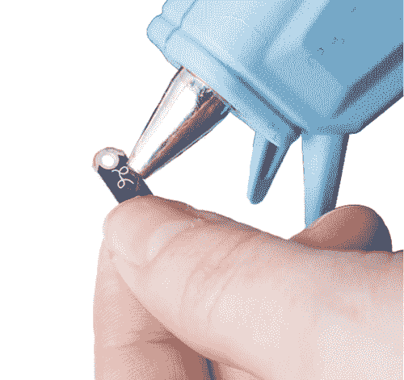](https://cdn.sparkfun.com/assets/learn_tutorials/2/9/6/GluingLilyPad_1.jpg)

如果你想把电池盒放在包的里面而不是外面，它会是这样的(图片是完成的项目):

[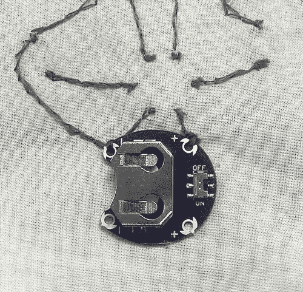](https://cdn.sparkfun.com/assets/learn_tutorials/2/9/6/BatteryBack.jpg)

## 第三步:缝电线

仔细检查所有组件是否面朝上，位置是否正确。用大约 12 英寸的导电线穿过一根针，并在末端打一个结。

缝纫技巧:工作时，偶尔检查一下缝线的正面和背面，确保你没有不小心把包缝上或者把包里的导线缠在一起。

1.  首先，在最靠近 LilyTwinkle 的电池座的**正极**引脚周围绕 2-3 圈。

    [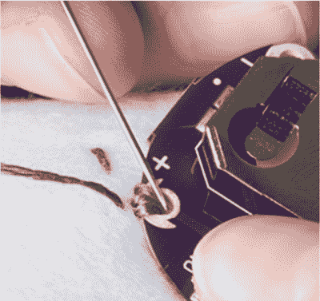](https://cdn.sparkfun.com/assets/learn_tutorials/2/9/6/LoopedConductiveThread.jpg)
2.  沿着标记线缝合，直到到达 LilyTwinkle 上的**正**针。循环 2-3 次，在那里打结。剪掉任何多余的线。

3.  对发光二极管重复这一过程，沿着线将**正极**端连接到 LilyTwinkle 上的标记孔，如下所示。

[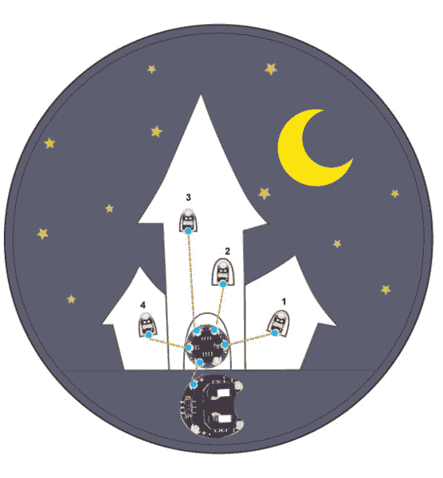](https://cdn.sparkfun.com/assets/learn_tutorials/2/9/6/HalloweenHouse_Positive_1.jpg)

## 模板的差异:

另一种设计是将 led 组合成一个并联电路。蝙蝠，猫和幽灵的设计使用两个 LEDS 来固定在百合上，这样它们就可以一起发光。对于这些 LED，在第一个 LED 上绕 2-3 圈，然后继续缝合，直到到达下一个 LED，绕 2-3 圈，然后打结。

*想了解更多关于多个 LED 电路的信息？看看 [LDK 实验 2:多个 LED 电路](https://learn.sparkfun.com/tutorials/ldk-experiment-2-multiple-led-circuits)。*

[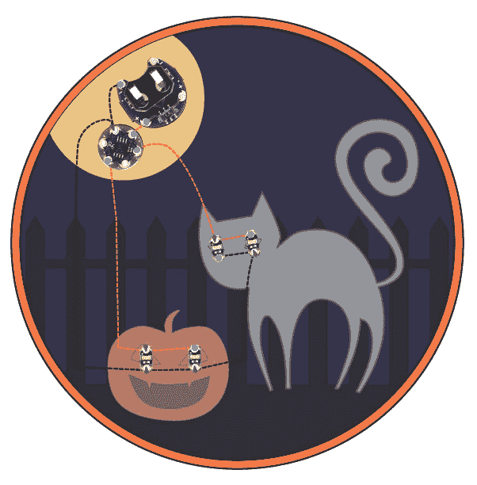](https://cdn.sparkfun.com/assets/learn_tutorials/2/9/6/HalloweenCat.jpg)[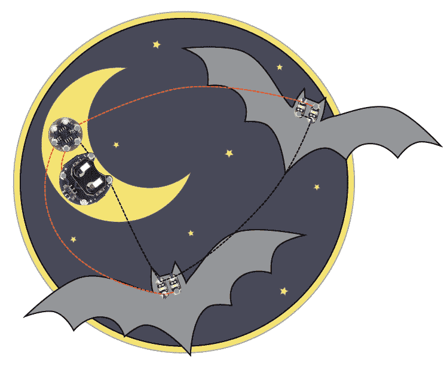](https://cdn.sparkfun.com/assets/learn_tutorials/2/9/6/HalloweenBat.jpg)

***注:*** Bat 设计使用电池座上的两个**负极**引脚，而不是一个引脚，这样针脚就不会意外碰到电路板。

[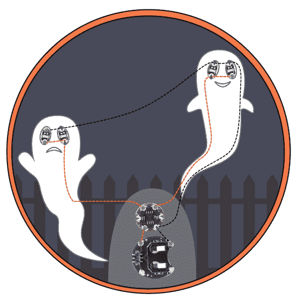](https://cdn.sparkfun.com/assets/learn_tutorials/2/9/6/HalloweenGhost.jpg)

## 第四步:缝制阴线

负极线的工作方式略有不同——我们可以用一根导电线将它们连接在一起。确保你有一根很长的线作为起点。

记住要经常检查缝线的正面和背面，以避免缠结或打结。

1.  用一根新线环绕 LilyTwinkle 的**负极**引脚 2-3 圈，并沿着线将其连接到电池座的**负极**引脚。
2.  继续缝制到 **LED 1** 上的第一个**负极针脚**。
3.  绕着它循环 2-3 次，从右到左继续你的轨迹。绕过**led 2-4**上的每个**负极**引脚 2-3 次。
4.  一旦到达 **LED 4** 的负极引脚，在那里打一个环并打结。剪掉任何多余的线。
5.  万岁！这就完成了你的缝纫。

[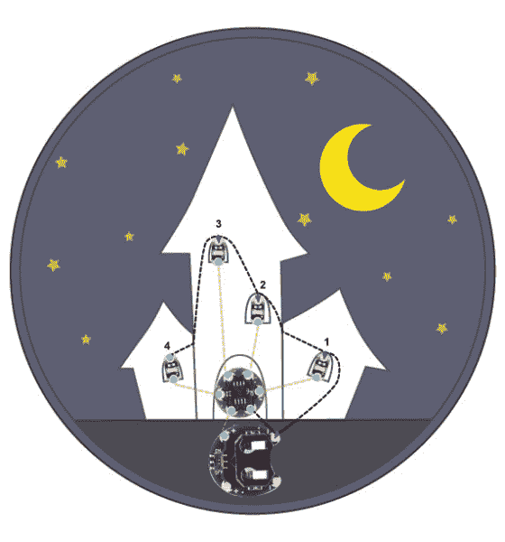](https://cdn.sparkfun.com/assets/learn_tutorials/2/9/6/HalloweenHouse_Negative_1.jpg)

## 第五步:打开电源

所有的缝合完成后，检查你的设计是否有松脱的线尾或短路(线在不应该的地方重叠)。如果一切正常，将电池插入电池座，并将开关转到 ON 位置。你的设计应该开始闪烁了！

[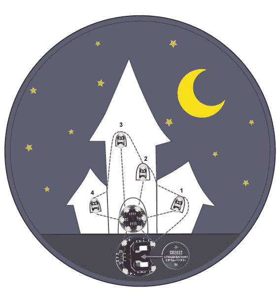](https://cdn.sparkfun.com/assets/learn_tutorials/2/9/6/HalloweenHouse_Battery_2.jpg)

如果您的设计没有亮起来，您可能需要进行一些故障排除。如有需要，请参考[电子纺织基础教程](https://learn.sparkfun.com/tutorials/e-textile-basics)获取帮助。

现在，让我们通过添加一些毛毡形状来隐藏组件，从而完成对手提包的装饰。

## 装饰

是时候盖上电子元件了，让它们在你的设计中熠熠生辉！使用提供的模板从毛毡或织物中切割出形状。

[下载房子形状](https://cdn.sparkfun.com/assets/learn_tutorials/2/9/6/HalloweenHouse_CutOuts.pdf) [下载猫形状](https://cdn.sparkfun.com/assets/learn_tutorials/2/9/6/HalloweenCat_CutOuts.pdf) [下载蝙蝠形状](https://cdn.sparkfun.com/assets/learn_tutorials/2/9/6/HalloweenBat_CutOuts.pdf) [下载鬼形状](https://cdn.sparkfun.com/assets/learn_tutorials/2/9/6/HalloweenGhost_CutOuts.pdf)

[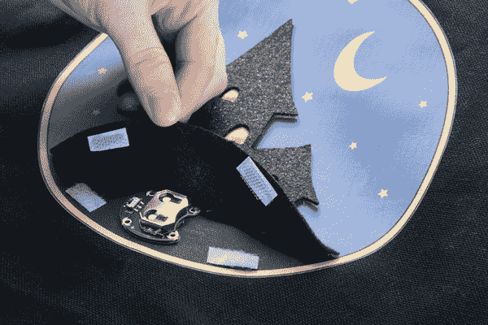](https://cdn.sparkfun.com/assets/learn_tutorials/2/9/6/Velcro.jpg)

对于覆盖电池座和 LilyTwinkle 的形状，使用 velcro 将它们变成一个翻盖，这样您仍然可以在需要时访问电池并进行更换。你也可以在开关上方剪一个小把手，这样你就可以打开/关闭袋子，而不需要提起翻盖。

将其他形状粘在发光二极管上，将其隐藏起来。在鬼眼和猫的图案下添加一层对比强烈的布料，会让你看起来更加怪异。

## 第七步:隔离

一旦你的项目的前面被装饰，是时候绝缘导电线，这样缝线就不会在织物移动时意外地相互接触和短路。隔离导电线也保护它免受磨损，并会延长你的项目的寿命。这些方法是为你的项目内部而展示的，油漆和胶水方法在外部也同样适用。

***导电线绝缘的几种方法(选一种):***

*   用丙烯颜料或织物颜料涂抹在缝线上。
*   用织物胶盖住缝线。
*   使用熨烫接口来覆盖缝线(在你项目的背面)——注意不要直接熨烫任何 LilyPad 组件，它们可能会融化。
*   在手提包内侧贴上一块布料以保护缝线。

[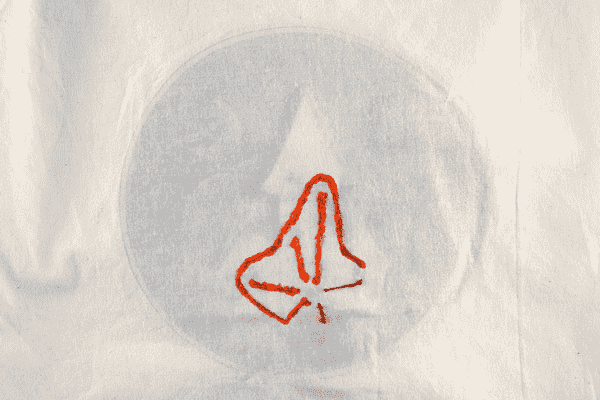](https://cdn.sparkfun.com/assets/learn_tutorials/2/9/6/PaintInsulation.jpg)

油漆绝缘的例子-橙色是油漆，灰色是导电线。小贴士:用画笔画出准确的线条。可挤压容器中的 3D 粉扑颜料也很好用。

[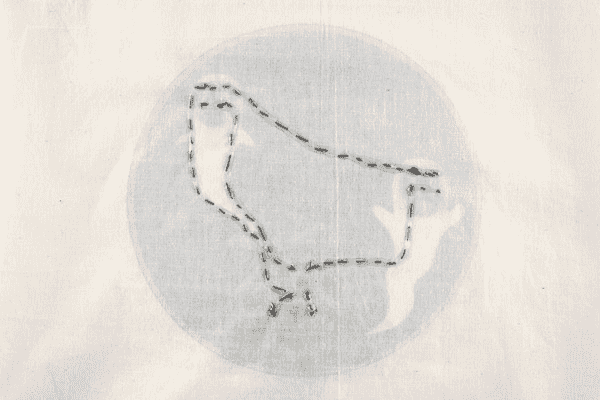](https://cdn.sparkfun.com/assets/learn_tutorials/2/9/6/GlueInsulation.jpg)

织物胶水绝缘的例子-透明的织物胶水让缝线显露出来，同时仍然保护它。小贴士:如果胶水干了之后仍然发粘，可以在上面擦一点婴儿爽身粉或面粉。

[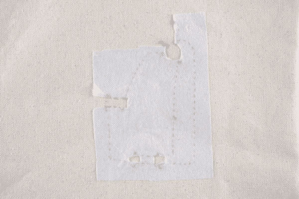](https://cdn.sparkfun.com/assets/learn_tutorials/2/9/6/Interfacing.jpg)

绝缘衬布示例-仅覆盖缝线的切割衬布。小贴士:使用手工熨斗进入小空间。

[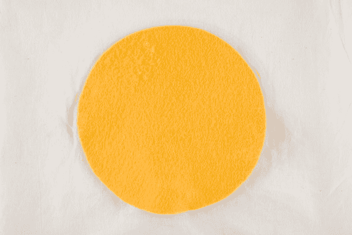](https://cdn.sparkfun.com/assets/learn_tutorials/2/9/6/FeltInsulation.jpg)

织物绝缘示例——在导线上粘合或缝合。小贴士:用熨过的衣服的背衬作为模板，在毛毡/布料上进行描摹。

### 其他绝缘技术:

Kobakant 的可穿戴设备网站对不同的绝缘/隔离方法有很好的概述:[如何得到你想要的:隔离痕迹](http://www.kobakant.at/DIY/?p=1304)

## 资源和更进一步

既然你已经知道如何用 LilyTwinkle 点亮夜晚，你可能想看看其他一些教程:

*   [电子纺织口罩](https://learn.sparkfun.com/tutorials/e-textile-mask)
*   [咯咯叫的苹果头女巫](https://learn.sparkfun.com/tutorials/cackling-apple-head-witch)
*   [LDK 实验三:按钮和开关](https://learn.sparkfun.com/tutorials/ldk-experiment-3-buttons-and-switches)
*   [LDK 实验四:自己做按钮](https://learn.sparkfun.com/tutorials/ldk-experiment-4-make-your-own-button)
*   [重新编程 LilyTiny/LilyTwinkle](https://learn.sparkfun.com/tutorials/re-programming-the-lilytiny--lilytwinkle)
*   [Protosnap LilyPad 开发简单挂钩指南](https://learn.sparkfun.com/tutorials/protosnap-lilypad-development-simple-hookup-guide)**