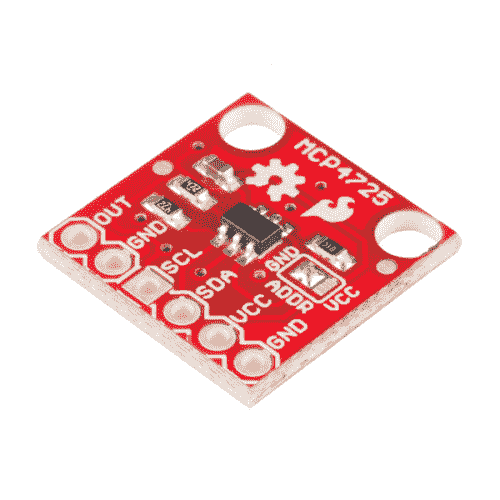
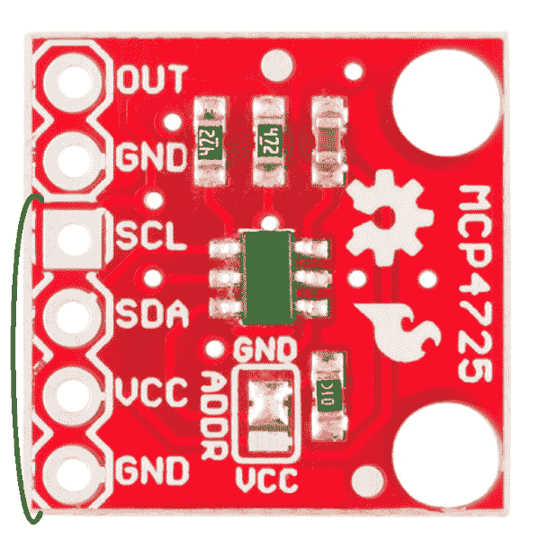
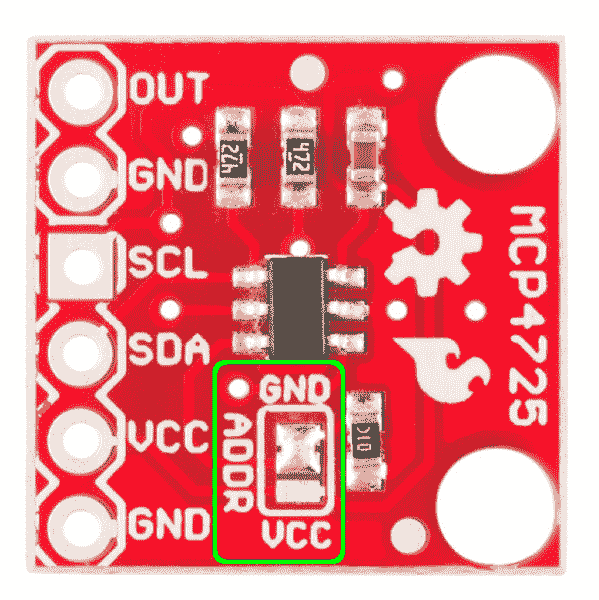
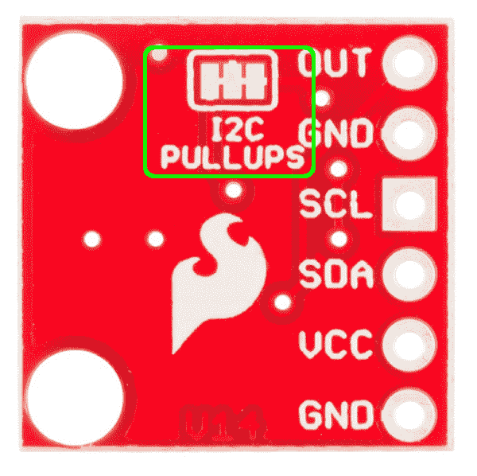
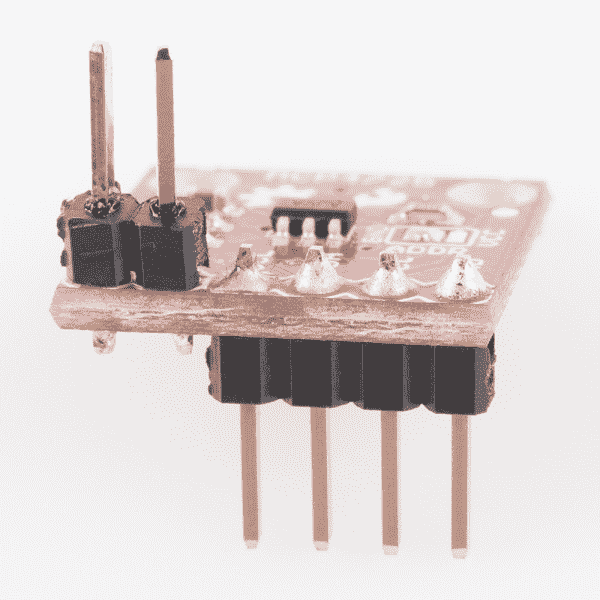
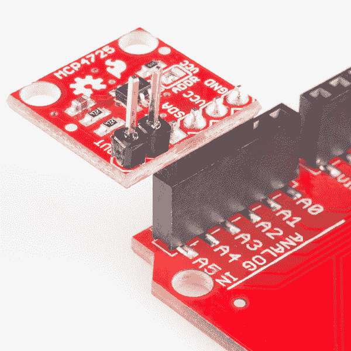
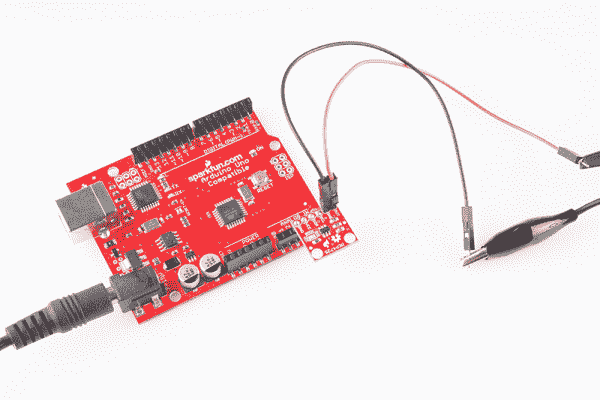
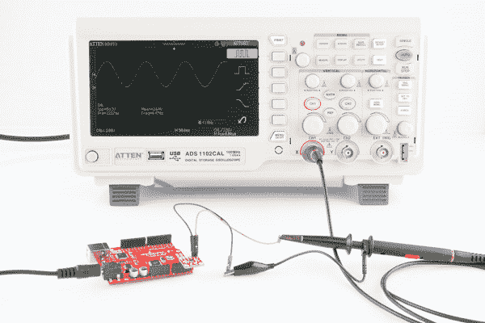

# MCP4725 数模转换器连接指南

> 原文：<https://learn.sparkfun.com/tutorials/mcp4725-digital-to-analog-converter-hookup-guide>

## 至 DAC，或不至 DAC...

在了解微控制器的世界时，你会经常遇到模数转换器。这使我们能够从模拟传感器读取信号，并将其转换为微控制器和其他计算设备可以理解的数字语言。但是，如果需要反其道而行之呢？如果您需要 Arduino 说模拟信号的语言，该怎么办？进入 [MCP4725 数模转换器分线点](https://www.sparkfun.com/products/12918)。

[](https://www.sparkfun.com/products/12918) 

将**添加到您的[购物车](https://www.sparkfun.com/cart)中！**

 **### [SparkFun I2C DAC 分线点- MCP4725](https://www.sparkfun.com/products/12918)

[In stock](https://learn.sparkfun.com/static/bubbles/ "in stock") BOB-12918

您一直想从微控制器输出模拟电压，MCP4725 就是让您如愿以偿的 DAC！MC…

$5.957[Favorited Favorite](# "Add to favorites") 27[Wish List](# "Add to wish list")** **这个小小的集成电路可以让你做到这一点。通过使用 Arduino 的 I ² C 线，您可以在另一端创建各种各样的模拟波形。

### 本教程涵盖的内容

在本教程中，我们将概述分组讨论并讨论其他硬件细节。然后，组装部分将讨论如何将该分线点连接到微控制器。最后，固件将被分解，以帮助您理解数模转换是如何发生的。

### 推荐阅读

*   [模拟 vs 数字](https://learn.sparkfun.com/tutorials/analog-vs-digital)
*   [逻辑电平](https://learn.sparkfun.com/tutorials/logic-levels)
*   [上拉电阻](https://learn.sparkfun.com/tutorials/pull-up-resistors)
*   [模数转换(ADC)](https://learn.sparkfun.com/tutorials/analog-to-digital-conversion)
*   [I ² C](https://learn.sparkfun.com/tutorials/i2c)
*   [如何使用示波器](https://learn.sparkfun.com/tutorials/how-to-use-an-oscilloscope)

## 主板概述

在我们讨论如何连接分线点之前，让我们回顾一下这个板的一些特性。

#### 插脚引线图

首先要指出的是，这个分线点上的引脚排列现在符合标准 I ² C 引脚排列，我们已经开始在大多数使用双线接口的设备上使用。因此，很容易在分接头上焊接一些接头，并将其直接插入与 I ² C 引脚相同的 Arduino 引脚。还有一个信号输出和一个 GND 引脚组合在一起，以连接到示波器或任何其他你正在连接到分线点的设备。

[](https://cdn.sparkfun.com/assets/learn_tutorials/2/9/front-pinout.png)

#### 力量

该分线点可以在 2.7V 至 5.5V 之间的任何地方供电，非常适合 5V 和 3.3V 微控制器。

#### I ² C 通信

该分线点增加了一些特性，使用户可以更加灵活地使用 IC，特别是在一条总线上增加多个 DAC 时。首先，我们将地址选择引脚(A0)连接到一个跳线焊盘。默认情况下，此引脚被拉低至 GND。要更改其它器件的地址，只需对跳线进行脱焊，并在中间焊盘和 Vcc 焊盘上添加一滴焊料。

[](https://cdn.sparkfun.com/assets/learn_tutorials/2/9/front-highlighted.jpg)

如果你要在一条总线上有多个 MCP4725，你也要禁用除了一个分线点以外的所有**分线上的上拉电阻。为了使这更容易，我们在主板背面增加了另一个跳线。默认情况下，上拉电阻使能。如果你需要禁用它们，你需要用 [Xacto 刀](https://www.sparkfun.com/products/9200)切断跳线垫上的迹线。如果需要重新使能上拉电阻，只需将三个焊盘焊接在一起。**

[](https://cdn.sparkfun.com/assets/learn_tutorials/2/9/back-highlighted.png)

最后，有两个安装孔可以将该板安装在您选择的机箱内。

## 连接起来

要使用 MCP4725，你只需要一些[公接头](https://www.sparkfun.com/products/553)，一个 [SparkFun RedBoard](https://www.sparkfun.com/products/12757) 或其他微控制器，以及一种查看信号的方法。使用[示波器](https://www.sparkfun.com/search/results?term=oscilloscope)将是最简单的开始方式。

首先，[将接头](https://learn.sparkfun.com/tutorials/how-to-solder-through-hole-soldering)焊接到分接头上。我们建议对电源和通信连接使用朝下的 4 引脚接头，对输出和 GND 引脚使用朝上的 2 引脚接头。请参见下图中的示例。

[](https://cdn.sparkfun.com/assets/learn_tutorials/2/9/MCP4725_Breakout_Board_Tutorial-01fff.jpg)

大多数 Arduino 板在 A4 和 A5 引脚上都有 I ² C。然后，在我们将在下一节上传的固件中，我们可以将引脚 A2 和 A3 分别设置为 GND 和 Vcc，以便为分线点供电。如果你喜欢把所有东西都连接到试验板上，你可以焊接一个 6 针接头，用一些跳线把所有东西连接起来。

[](https://cdn.sparkfun.com/assets/learn_tutorials/2/9/MCP4725_Breakout_Board_Tutorial-02.jpg)

最后，是时候将 MCP4725 连接到您将要发送模拟信号的任何设备上了。在本教程中，我们将使用示波器可视化信号。使用 o 型探头，您可以直接连接到接头，或者使用一些跳线。确保不要混淆输出和 GND 引脚。

[](https://cdn.sparkfun.com/assets/learn_tutorials/2/9/MCP4725_Breakout_Board_Tutorial-03.jpg)

## 固件

一切就绪后，是时候上传一些代码到 Arduino 了，这将允许 breakout 发送模拟信号。在本例中，代码将生成一个简单的正弦波。

打开 Arduino IDE，复制以下代码片段:

```
language:c
/****************************************************************************** 
MCP4725 Example Waveform Sketch
Joel Bartlett
SparkFun Electronics
Sept. 11, 2014
https://github.com/sparkfun/MCP4725_Breakout

This sketch takes data from a lookup table to provide 
waveforms to be generated by the MCP4725 DAC. 

Development environment specifics:
Arduino 1.0+
Hardware Version V14

This code is beerware; if you see me (or any other SparkFun employee) at the local, 
and you've found our code helpful, please buy us a round!

Distributed as-is; no warranty is given. 

This code builds off the sketch written by Mark VandeWettering, which can be found here:
http://brainwagon.org/2011/02/24/arduino-mcp4725-breakout-board/
*/

#include <Wire.h>//Include the Wire library to talk I2C

//This is the I2C Address of the MCP4725, by default (A0 pulled to GND).
//Please note that this breakout is for the MCP4725A0\. 
#define MCP4725_ADDR 0x60   
//For devices with A0 pulled HIGH, use 0x61

//Sinewave Tables were generated using this calculator:
//http://www.daycounter.com/Calculators/Sine-Generator-Calculator.phtml

int lookup = 0;//varaible for navigating through the tables

int sintab2[512] = 
{
  2048, 2073, 2098, 2123, 2148, 2174, 2199, 2224,
  2249, 2274, 2299, 2324, 2349, 2373, 2398, 2423,
  2448, 2472, 2497, 2521, 2546, 2570, 2594, 2618,
  2643, 2667, 2690, 2714, 2738, 2762, 2785, 2808,
  2832, 2855, 2878, 2901, 2924, 2946, 2969, 2991,
  3013, 3036, 3057, 3079, 3101, 3122, 3144, 3165,
  3186, 3207, 3227, 3248, 3268, 3288, 3308, 3328,
  3347, 3367, 3386, 3405, 3423, 3442, 3460, 3478,
  3496, 3514, 3531, 3548, 3565, 3582, 3599, 3615,
  3631, 3647, 3663, 3678, 3693, 3708, 3722, 3737,
  3751, 3765, 3778, 3792, 3805, 3817, 3830, 3842,
  3854, 3866, 3877, 3888, 3899, 3910, 3920, 3930,
  3940, 3950, 3959, 3968, 3976, 3985, 3993, 4000,
  4008, 4015, 4022, 4028, 4035, 4041, 4046, 4052,
  4057, 4061, 4066, 4070, 4074, 4077, 4081, 4084,
  4086, 4088, 4090, 4092, 4094, 4095, 4095, 4095,
  4095, 4095, 4095, 4095, 4094, 4092, 4090, 4088,
  4086, 4084, 4081, 4077, 4074, 4070, 4066, 4061,
  4057, 4052, 4046, 4041, 4035, 4028, 4022, 4015,
  4008, 4000, 3993, 3985, 3976, 3968, 3959, 3950,
  3940, 3930, 3920, 3910, 3899, 3888, 3877, 3866,
  3854, 3842, 3830, 3817, 3805, 3792, 3778, 3765,
  3751, 3737, 3722, 3708, 3693, 3678, 3663, 3647,
  3631, 3615, 3599, 3582, 3565, 3548, 3531, 3514,
  3496, 3478, 3460, 3442, 3423, 3405, 3386, 3367,
  3347, 3328, 3308, 3288, 3268, 3248, 3227, 3207,
  3186, 3165, 3144, 3122, 3101, 3079, 3057, 3036,
  3013, 2991, 2969, 2946, 2924, 2901, 2878, 2855,
  2832, 2808, 2785, 2762, 2738, 2714, 2690, 2667,
  2643, 2618, 2594, 2570, 2546, 2521, 2497, 2472,
  2448, 2423, 2398, 2373, 2349, 2324, 2299, 2274,
  2249, 2224, 2199, 2174, 2148, 2123, 2098, 2073,
  2048, 2023, 1998, 1973, 1948, 1922, 1897, 1872,
  1847, 1822, 1797, 1772, 1747, 1723, 1698, 1673,
  1648, 1624, 1599, 1575, 1550, 1526, 1502, 1478,
  1453, 1429, 1406, 1382, 1358, 1334, 1311, 1288,
  1264, 1241, 1218, 1195, 1172, 1150, 1127, 1105,
  1083, 1060, 1039, 1017,  995,  974,  952,  931,
   910,  889,  869,  848,  828,  808,  788,  768,
   749,  729,  710,  691,  673,  654,  636,  618,
   600,  582,  565,  548,  531,  514,  497,  481,
   465,  449,  433,  418,  403,  388,  374,  359,
   345,  331,  318,  304,  291,  279,  266,  254,
   242,  230,  219,  208,  197,  186,  176,  166,
   156,  146,  137,  128,  120,  111,  103,   96,
    88,   81,   74,   68,   61,   55,   50,   44,
    39,   35,   30,   26,   22,   19,   15,   12,
    10,    8,    6,    4,    2,    1,    1,    0,
     0,    0,    1,    1,    2,    4,    6,    8,
    10,   12,   15,   19,   22,   26,   30,   35,
    39,   44,   50,   55,   61,   68,   74,   81,
    88,   96,  103,  111,  120,  128,  137,  146,
   156,  166,  176,  186,  197,  208,  219,  230,
   242,  254,  266,  279,  291,  304,  318,  331,
   345,  359,  374,  388,  403,  418,  433,  449,
   465,  481,  497,  514,  531,  548,  565,  582,
   600,  618,  636,  654,  673,  691,  710,  729,
   749,  768,  788,  808,  828,  848,  869,  889,
   910,  931,  952,  974,  995, 1017, 1039, 1060,
  1083, 1105, 1127, 1150, 1172, 1195, 1218, 1241,
  1264, 1288, 1311, 1334, 1358, 1382, 1406, 1429,
  1453, 1478, 1502, 1526, 1550, 1575, 1599, 1624,
  1648, 1673, 1698, 1723, 1747, 1772, 1797, 1822,
  1847, 1872, 1897, 1922, 1948, 1973, 1998, 2023
};

void setup()
{
  Wire.begin();

  // Set A2 and A3 as Outputs to make them our GND and Vcc,
  //which will power the MCP4725
  pinMode(A2, OUTPUT);
  pinMode(A3, OUTPUT);

  digitalWrite(A2, LOW);//Set A2 as GND
  digitalWrite(A3, HIGH);//Set A3 as Vcc
}
//---------------------------------------------------
void loop()
{
  Wire.beginTransmission(MCP4725_ADDR);
  Wire.write(64);                     // cmd to update the DAC
  Wire.write(sintab2[lookup] >> 4);        // the 8 most significant bits...
  Wire.write((sintab2[lookup] & 15) << 4); // the 4 least significant bits...
  Wire.endTransmission();
  lookup = (lookup + 1) & 511;
} 
```

一旦草图上传，启动 o 型示波器，连接探头，如果你还没有，你应该会看到一个漂亮的正弦波。

[](https://cdn.sparkfun.com/assets/learn_tutorials/2/9/MCP4725_Breakout_Board_Tutorial-04.jpg)

## 资源和更进一步

这样，你应该能够让你的 MCP4725 按照你想要的方式工作，并集成到你的下一个项目中。有关 MCP4725 的更多信息，请访问以下链接。

*   [brain wagon 上的 MCP 4725](http://brainwagon.org/2011/02/24/arduino-mcp4725-breakout-board/)
*   [正弦查找表生成器](http://www.daycounter.com/Calculators/Sine-Generator-Calculator.phtml)
*   [MCP4725 数据手册](https://cdn.sparkfun.com/datasheets/BreakoutBoards/MCP4725_2009.pdf)

需要更多吗？查看其他 SparkFun 教程:

*   [脉宽调制](https://learn.sparkfun.com/tutorials/pulse-width-modulation)
*   [声音探测器连接指南](https://learn.sparkfun.com/tutorials/sound-detector-hookup-guide)
*   [AD8232 心率监护仪连接指南](https://learn.sparkfun.com/tutorials/ad8232-heart-rate-monitor-hookup-guide)
*   [黑客入侵 MindWave 手机](https://learn.sparkfun.com/tutorials/hackers-in-residence---hacking-mindwave-mobile)**