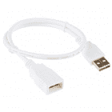
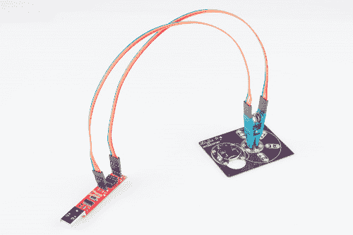
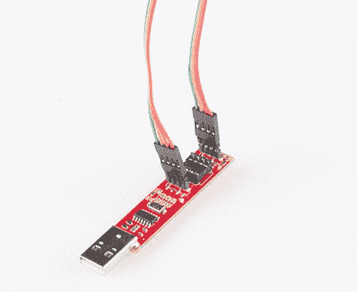
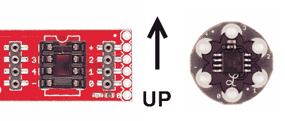
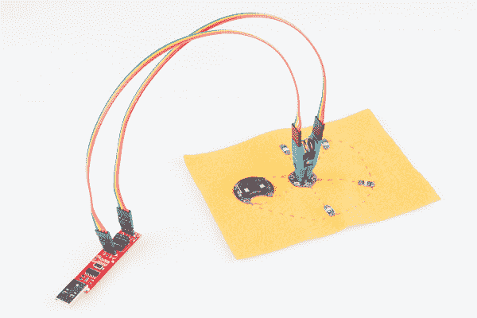
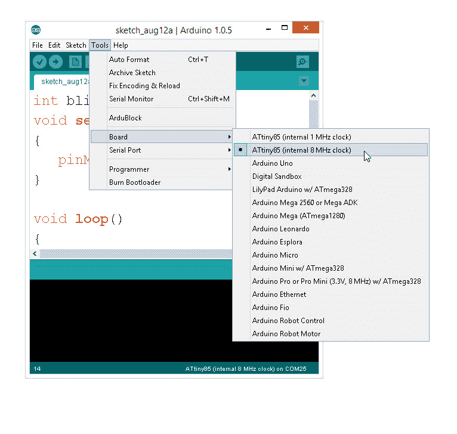
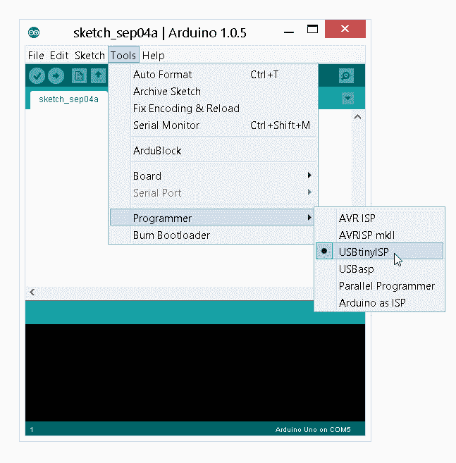
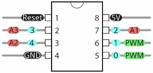

# 对 LilyTiny / LilyTwinkle 重新编程

> 原文：<https://learn.sparkfun.com/tutorials/re-programming-the-lilytiny--lilytwinkle>

## 介绍

[LilyTiny](https://www.sparkfun.com/products/10899) (和 [LilyTwinkle](https://www.sparkfun.com/products/11364) )都是用于电子文本项目的出色、低成本、可缝合的微控制器。对于大多数只需要连接少量 led 或传感器的项目来说，LilyTiny 是一个很好的选择。

[](https://www.sparkfun.com/products/10899) 

将**添加到您的[购物车](https://www.sparkfun.com/cart)中！**

 **### [LilyTiny](https://www.sparkfun.com/products/10899)

[In stock](https://learn.sparkfun.com/static/bubbles/ "in stock") DEV-10899

LilyTiny 是一个很小的 LilyPad 板，旨在为您的项目添加华丽的功能，而不会占用太多的资源

$5.9512[Favorited Favorite](# "Add to favorites") 35[Wish List](# "Add to wish list")** **百合有 6 片花瓣。两个保留用于电源(+)和接地(-)。另外四个是通用 I/O 引脚(GPIOs)。LilyTiny 预装了一个样本草图，其中显示了每个引脚上的各种 LED 图案:

*   “呼吸”模式(引脚 0)
*   心跳模式(引脚 1)
*   简单的开关闪烁(引脚 2)
*   随机衰减(引脚 3)

**Note:**You can also use this tutorial to reprogram the ATtiny85 on the LilyTwinkle and LilyTwinkle ProtoSnap. The only difference is how the microcontroller is programmed. Each of the four pins are programmed to randomly fade.

[](https://www.sparkfun.com/products/11364) 

将**添加到您的[购物车](https://www.sparkfun.com/cart)中！**

 **### [](https://www.sparkfun.com/products/11364)

[In stock](https://learn.sparkfun.com/static/bubbles/ "in stock") DEV-11364

LilyTwinkle 是一个很小的 LilyPad 板，旨在为您的项目添加一些亮点。即使它只有几米那么小…

$5.959[Favorited Favorite](# "Add to favorites") 21[Wish List](# "Add to wish list")****[](https://www.sparkfun.com/products/11590) 

将**添加到您的[购物车](https://www.sparkfun.com/cart)中！**

 **### [](https://www.sparkfun.com/products/11590)

[In stock](https://learn.sparkfun.com/static/bubbles/ "in stock") DEV-11590

ProtoSnap 系列是一种无需试验板即可构建项目原型的新方法。所有东西都连接在一个单独的业务对象上…

$19.501[Favorited Favorite](# "Add to favorites") 18[Wish List](# "Add to wish list")**** ****这是一个很好的起点，但重新编程其中一个板的唯一方法是使用一个 [AVR 编程器](https://www.sparkfun.com/products/9825)和一个 [ISP Pogo 引脚适配器](https://www.sparkfun.com/products/11591)连接到 LilyTiny 板底部的 6 个裸露引脚。

如果你还没有把你的板缝进你的项目，这是没问题的。如果你有，我们仍然可以重新编程你的板。本教程将向您展示如何实现这一点。

### 所需材料

要跟随本教程，您将需要以下材料。你可能不需要所有的东西，这取决于你拥有什么。将它添加到您的购物车，通读指南，并根据需要调整购物车。

*   1x [8 针 SOIC IC 测试夹](https://www.sparkfun.com/products/13153)
*   8x [公母跳线](https://www.sparkfun.com/products/9385)
*   1x [微型 AVR ISP 编程器](https://www.sparkfun.com/products/11801)
*   1x [LilyTiny](https://www.sparkfun.com/products/10899) (或 [LilyTwinkle](https://www.sparkfun.com/products/11364) )重新编程。对于初学者来说，[原生百合套装](https://www.sparkfun.com/products/11590)是一个很好的选择！
*   *1x [USB 延长线](https://www.sparkfun.com/products/13309)(可选，但推荐)*

[](https://www.sparkfun.com/products/11801) 

将**添加到您的[购物车](https://www.sparkfun.com/cart)中！**

 **### [微型 AVR 编程器](https://www.sparkfun.com/products/11801)

[26 available](https://learn.sparkfun.com/static/bubbles/ "26 available") PGM-11801

ATtiny45 和 85 是一对非常酷的小 MCU，但是您知道您可以在 Arduino 中对它们进行编程吗？没错，n…

$17.50102[Favorited Favorite](# "Add to favorites") 76[Wish List](# "Add to wish list")****[](https://www.sparkfun.com/products/10899) 

将**添加到您的[购物车](https://www.sparkfun.com/cart)中！**

 **### [LilyTiny](https://www.sparkfun.com/products/10899)

[In stock](https://learn.sparkfun.com/static/bubbles/ "in stock") DEV-10899

LilyTiny 是一个很小的 LilyPad 板，旨在为您的项目添加华丽的功能，而不会占用太多的资源

$5.9512[Favorited Favorite](# "Add to favorites") 35[Wish List](# "Add to wish list")****[](https://www.sparkfun.com/products/9385) 

将**添加到您的[购物车](https://www.sparkfun.com/cart)中！**

 **### [跳线高级 12" M/F 装 10 根](https://www.sparkfun.com/products/9385)

[In stock](https://learn.sparkfun.com/static/bubbles/ "in stock") PRT-09385

这是一个 SparkFun 独家！这些是 12 英寸长、26 AWG 跳线，端接为公母连接。用这些从…上跳下来

$4.951[Favorited Favorite](# "Add to favorites") 11[Wish List](# "Add to wish list")****[](https://www.sparkfun.com/products/13153) 

将**添加到您的[购物车](https://www.sparkfun.com/cart)中！**

 **### [IC 测试夹- SOIC 8 针](https://www.sparkfun.com/products/13153)

[Out of stock](https://learn.sparkfun.com/static/bubbles/ "out of stock") COM-13153

这是用于 8 针小型集成电路(SOIC)的 IC 测试夹。此测试夹确保安全连接到所有…

$19.504[Favorited Favorite](# "Add to favorites") 24[Wish List](# "Add to wish list")****[](https://www.sparkfun.com/products/13309) 

将**添加到您的[购物车](https://www.sparkfun.com/cart)中！**

 **### [USB 线延长线- 1.5 英尺](https://www.sparkfun.com/products/13309)

[In stock](https://learn.sparkfun.com/static/bubbles/ "in stock") CAB-13309

这是一条 1.5 英尺长的 USB 延长线，一端配有 A 型插头，可插入您的计算机，另一端配有 A 型插头

$1.95 $1.46[Favorited Favorite](# "Add to favorites") 3[Wish List](# "Add to wish list")********** **********有几种方法可以重新编程您的主板。这里我们将重点介绍一种最简单的方法——使用[微型 AVR 编程棒](https://www.sparkfun.com/products/11801)。

[](https://cdn.sparkfun.com/assets/learn_tutorials/2/7/2/Reprogramming_the_Lily_Tiny-02.jpg)*Tiny AVR Programming Stick with Pomona 5250 SOIC Clip used to re-rogram the ATtiny85 on the LilyTwinkle.*

## ATTiny 板附加文件

在开始之前，我们需要设置 Arduino 编程环境来处理 ATTiny 硬件。ATTiny 不是 Arduino IDE v1.x 附带的“默认”主板文件的一部分。您需要将这些主板文件“安装”到您的 Arduino 环境中，以便对 LilyTiny 重新编程。

📌 **Tip:** For beginners, you can **automatically** install using the Arduino boards manager by following the directions in "Installing the ATtiny Support in Arduino v1.6.4+." The instructions also include information about manually installing the files for older versions of Arduino like the directions provided in this tutorial.

[High-Low Tech: Installing ATtiny Support in Arduino 1.6.4](http://highlowtech.org/?p=1695)

### 手动安装 ATtiny 硬件文件

如果您喜欢手动安装文件，我们将首先需要安装 ATtiny 硬件板文件。从 GitHub 资源库下载压缩文件，手动安装这些文件。

[attiny-master (ZIP)](https://github.com/damellis/attiny/archive/master.zip)

在你的 Arduino sketchbook 下创建一个名为“ **hardware** 的文件夹

*   找到你的 Arduino sketchbook 文件夹(你可以在 Arduino 软件的首选项对话框中找到它的位置)——这通常在**文档** > **Arduino** 下

*   在 sketchbook 文件夹中创建一个名为“ **hardware** ”的新子文件夹，如果它还不存在的话。

*   打开**attini-master . zip**文件，将解压后的**attini-master . zip**文件中的“**attini**文件夹(不是 attini-master 文件夹)复制到新的“ **hardware** 文件夹中。

你应该得到类似于**Documents**>**Arduino**>**hardware**>**attini**的文件夹结构，其中包含了 **boards.txt** 文件和另一个名为 **variants.h** 的文件夹。

*   重新启动 Arduino IDE。

*   你应该在**工具** > **面板菜单**中看到所有条目。

## 微型 AVR 编程器

### 司机

遵循小型 AVR 编程器的连接指南。对于 Windows / PC 用户，您需要一些驱动程序文件。对于 Mac / OS X 用户来说，微型 AVR 编程器应该是即插即用的。

[](https://learn.sparkfun.com/tutorials/tiny-avr-programmer-hookup-guide) [### 微型 AVR 编程器连接指南

#### 2013 年 10 月 28 日](https://learn.sparkfun.com/tutorials/tiny-avr-programmer-hookup-guide) A how-to on the Tiny AVR Programmer. How to install drivers, hook it up, and program your favorite Tiny AVRs using AVRDUDE 11

### 硬件连接

虽然照片显示我们使用 4 线带状电缆和直针分离接头将 SOIC 夹连接到微型 AVR 编程器，但我们发现直针分离接头(或任何方形引脚)不能很好地安装到微型 AVR 编程器中。相反，我们建议使用 [12 "公母跳线](https://www.sparkfun.com/products/9385)将 SOIC 夹连接到微型 AVR 编程器。

[](https://cdn.sparkfun.com/assets/learn_tutorials/2/7/2/Zoom_of_TinyAVR.jpg)

确保编程器的左侧引脚连接到夹子的左侧，右侧引脚连接到夹子的右侧。当您将它夹在 LilyTiny 上时，请确保芯片正面朝上。有几个明显的标志可以辨别哪条路是向上的。在编程器上，有一个 8 针芯片可以进入的凹槽。这应该是向上的。并且，在 LilyTiny 上，Lilypad 脚本“L”应该在底部。

[](https://cdn.sparkfun.com/assets/learn_tutorials/2/7/2/alignment_up.png)

当你把微型 AVR 编程器连接到 ATtiny85 上后，它看起来应该与下图相似。

[](https://cdn.sparkfun.com/assets/learn_tutorials/2/7/2/Reprogramming_the_Lily_Tiny-01.jpg)

现在，您可以对 LilyTiny 或 LilyTwinkle 重新编程了！最后一步是将微型 AVR 编程器插入计算机的 USB 端口，开始编程。

**Tip:** We recommend using a USB extension cable with the Tiny AVR Programmer so you have a little more movement from your computer when re-programming.

[](https://www.sparkfun.com/products/13309) 

将**添加到您的[购物车](https://www.sparkfun.com/cart)中！**

 **### [USB 线延长线- 1.5 英尺](https://www.sparkfun.com/products/13309)

[In stock](https://learn.sparkfun.com/static/bubbles/ "in stock") CAB-13309

这是一条 1.5 英尺长的 USB 延长线，一端配有 A 型插头，可插入您的计算机，另一端配有 A 型插头

$1.95 $1.46[Favorited Favorite](# "Add to favorites") 3[Wish List](# "Add to wish list")** **## 测试代码——“Hello World！”

**Note:** This example assumes you are using the latest version of the Arduino IDE on your desktop. If this is your first time using Arduino, please review our tutorial on [installing the Arduino IDE.](https://learn.sparkfun.com/tutorials/installing-arduino-ide)

和几乎所有的 Arduino 入门项目一样，我们用一个“眨眼”程序来测试我们的系统——相当于“Hello World！”在大多数其他编程环境中。首先，我们需要确保在 Arduino IDE 中正确设置了配置。

### 步骤 0 -打开 Arduino IDE

如果还没有打开 Arduino IDE，请打开它。

### 步骤 1 -设置电路板类型

LilyTiny 上有一个 ATtiny85 微控制器。更改 Arduino IDE 中的板卡类型以与此对应。ATtiny85 可以用 1 MHz 内部时钟或 8 MHz 内部时钟进行设置。确保选择 8 MHz。选择:**工具** - > **板卡**->-**at tiny 85(内部 8 MHz 时钟)**

[](https://cdn.sparkfun.com/assets/learn_tutorials/2/7/2/BoardTypeSetting.jpg)

### 步骤 2 -设置编程器

因为我们使用微型 AVR 作为我们的程序员，我们需要改变默认的程序员。这个设置也是在**工具** > **程序员** > **USBtinyISP** 下。

[](https://cdn.sparkfun.com/assets/learn_tutorials/2/7/2/USBtinyISP.jpg)

### 步骤 3 -上传代码

复制下面的代码并粘贴到你的 Arduino 窗口。

```
language:c
int blinkPin = 0;
void setup()
{
   pinMode(blinkPin, OUTPUT);
}

void loop()
{
    digitalWrite(blinkPin, HIGH);
    delay(500);
    digitalWrite(blinkPin, LOW);
    delay(500);
} 
```

点击上传按钮。您可能会看到一些警告消息，例如:

```
language:bash
avrdude: please define PAGEL and BS2 signals in the configuration file for part ATtiny85 
```

你可以忽略这个。如果一切正常，您应该可以在 GPIO 0(attini 的引脚 5)上看到一个闪烁的 LED。这可以是微型 AVR 编程器、ProtoSnap LilyTwinkle 套件或 ATtiny 85 附带的 LED。

## ATtiny85 编程注意事项

ATtiny85 不是你日常使用的 Arduino 微控制器。它体积虽小，但威力很大。

[](https://cdn.sparkfun.com/assets/learn_tutorials/2/7/2/ATTinyPins.png)

应该支持以下 Arduino 命令:

*   [pinMode()](http://arduino.cc/en/Reference/PinMode)
*   [digitalWrite()](http://arduino.cc/en/Reference/digitalWrite)
*   [digitalRead()](http://arduino.cc/en/Reference/digitalRead)
*   [analogRead()](http://arduino.cc/en/Reference/analogRead)
*   [analogWrite()](http://arduino.cc/en/Reference/analogWrite)
*   [shiftOut()](http://arduino.cc/en/Reference/shiftOut)
*   [pulseIn()](http://arduino.cc/en/Reference/pulseIn)
*   [毫里斯()](http://arduino.cc/en/Reference/millis)
*   [micros()](http://arduino.cc/en/Reference/micros)
*   [延迟()](http://arduino.cc/en/Reference/delay)
*   [delayMicroseconds()](http://arduino.cc/en/Reference/delayMicroseconds)
*   [软件序列](http://arduino.cc/en/Reference/softwareSerial)

所有 5 个引脚都是通用数字 I/o(GPIO)。这意味着它们可以与 digitalWrite()和 digitalRead()一起使用。

引脚 0 和 1 支持 PWM 输出(analogWrite)。

引脚 2、3 和 4 连接到芯片上的模数转换器(模拟读取)。

虽然 ATtiny85 支持您需要的大多数东西，但有些东西它做不到。

### 无硬件串行(UART)

ATtiny85 没有内置的[硬件 UART](https://learn.sparkfun.com/tutorials/serial-communication/uarts) 。如果你试图用`Serial.begin()`或`Serial.print()`编译任何 Arduino 代码，你会得到一个错误。但是，有一个解决方法——使用软件序列。这个[教程](http://projectsfromtech.blogspot.com/2013/06/serial-communication-on-attiny85-with.html)展示了一个如何做到这一点的例子:

[Projects from Tech: Serial Communication on a ATtiny85 with the SoftwareSerial Library](http://projectsfromtech.blogspot.com/2013/06/serial-communication-on-attiny85-with.html)**Tip:** Looking for a quick reference guide for the ATtiny85? Click on the link below to download an image or PDF version from our resources!

[](https://learn.sparkfun.com/resources/96)

## 资源和更进一步

TinyAVR 编程器是一种对 ATTiny45 或 ATTiny85 芯片重新编程的非常灵活的方式。但是，它要求您安装一些额外的驱动程序。你可以使用这个编程器直接与波莫纳 5250 SOIC 剪辑。该编程器在引脚 0 上已经有一个调试 LED。我们这里有一个完整的[微型 AVR 编程器](https://learn.sparkfun.com/tutorials/tiny-avr-programmer-hookup-guide/)的连接指南。

[](https://learn.sparkfun.com/tutorials/tiny-avr-programmer-hookup-guide) [### 微型 AVR 编程器连接指南

#### 2013 年 10 月 28 日](https://learn.sparkfun.com/tutorials/tiny-avr-programmer-hookup-guide) A how-to on the Tiny AVR Programmer. How to install drivers, hook it up, and program your favorite Tiny AVRs using AVRDUDE 11

有关 ATtiny85、LinyTiny/Twinkle 或更多 AVR 编程教程的更多信息，请查看以下链接:

*   [高低技术教程](http://hlt.media.mit.edu/?p=1801) -使用 Arduino Uno 作为编程器对 ATtiny85 进行编程的概述。
*   [attin y85](https://learn.sparkfun.com/resources/96)快速参考指南
*   [GitHub LilyTiny / LilyTwinkle 回购](https://github.com/sparkfun/LilyTiny_LilyTwinkle)
*   默认固件
    *   [LilyTiny Arduino 草图(ZIP)](https://cdn.sparkfun.com/assets/learn_tutorials/2/7/2/LilyTiny.zip)
    *   [LilyTwinkle Arduino 草图(ZIP)](https://cdn.sparkfun.com/assets/learn_tutorials/2/7/2/LilyTwinkle.zip)
*   [ATtiny85 板定义](https://github.com/damellis/attiny/tree/master/attiny)-*at tiny*文件夹应该位于 Arduino sketchbook 的*硬件*文件夹中。
*   **微型 AVR 驱动器**
    *   [32 位 USBTinyISP 驱动程序](http://cdn.sparkfun.com/datasheets/Dev/AVR/usbtinyisp%20w32%20driver%20v1.12.zip) -用于 32 位系统的 Windows 驱动程序
    *   [64 位 USBTinyISP 驱动程序](http://cdn.sparkfun.com/datasheets/Dev/AVR/usbtinyisp_libusb-win32_1.2.1.0.zip) -用于 64 位系统的 Windows 驱动程序

你的下一个项目需要一些灵感吗？查看一些相关教程:

*   [H2OhNo！](https://learn.sparkfun.com/tutorials/h2ohno)-H2OhNo！水报警和开发板使用 ATtiny85 来感应水的存在。本教程深入到如何让 ATtiny85 进入一个非常**低功耗**模式。
*   [移位寄存器](https://learn.sparkfun.com/tutorials/shift-registers) -如果你感觉受到 ATtiny 缺少管脚的限制，你可以使用移位寄存器来扩展 I/O 计数。
*   [使用 Arduino Pro Mini 3.3V](https://learn.sparkfun.com/tutorials/using-the-arduino-pro-mini-33v) -如果您正在寻找小尺寸，但需要更多引脚和功能，请查看 Arduino Pro Mini。
*   安装 Arduino 引导程序 -你可以使用微型 AVR 编程器来编写各种 AVR，包括大多数 Arduino 兼容板上的 AVR。如果你发现自己需要重新编程你的 Arduino 引导程序，微型 AVR 编程器应该是你所需要的。

或者使用 Attiny 查看这些教程。

[](https://learn.sparkfun.com/tutorials/installing-a-bootloader-on-the-microview) [### 在微视图上安装引导程序](https://learn.sparkfun.com/tutorials/installing-a-bootloader-on-the-microview) Fix your bootloader-less MicroView! This tutorial covers how to: disassemble the MicroView, wire it up to an assortment of programmers, program the bootloader, and test it out.[Favorited Favorite](# "Add to favorites") 5[](https://learn.sparkfun.com/tutorials/electronic-e-craft-terrarium) [### 电子飞船玻璃容器](https://learn.sparkfun.com/tutorials/electronic-e-craft-terrarium) A guest tutorial on an Electronic Terrarium from the Performative Sculpture class of Parsons DT.[Favorited Favorite](# "Add to favorites") 3[](https://learn.sparkfun.com/tutorials/roshamglo-project-tv-b-gone) [### 罗沙姆格洛项目:电视-B-没了](https://learn.sparkfun.com/tutorials/roshamglo-project-tv-b-gone) Turn your Roshamglo board into a (nearly) universal TV power button.[Favorited Favorite](# "Add to favorites") 4[](https://learn.sparkfun.com/tutorials/night-sky-halloween-costume) [### 夜空万圣节服装](https://learn.sparkfun.com/tutorials/night-sky-halloween-costume) Make a beautiful night sky costume using the LilyPad LEDs and the LilyTiny.[Favorited Favorite](# "Add to favorites") 7******************