# 在微视图上安装引导程序

> 原文：<https://learn.sparkfun.com/tutorials/installing-a-bootloader-on-the-microview>

## 介绍

[微视](https://www.sparkfun.com/products/12923)。这么酷的概念！一个 Arduino，带有内置显示屏，完全封装在一个漂亮的符合人体工程学的外壳中。使用它来创建小型视频游戏、可穿戴电子产品，或者只是探索电子和编程。但是，尽管微视图很酷，如果你不能重新编程，它也不过是一个烦人的重复演示。

[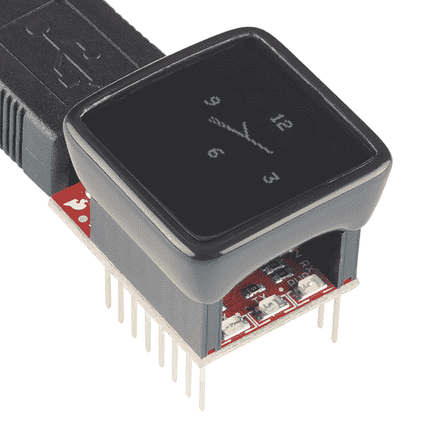](https://www.sparkfun.com/products/12923)

2014 年 8 月，[我们(当时不知情)发出了近 2000 条没有 bootloaders 的微视图](https://www.sparkfun.com/news/1575)。由于没有引导加载程序，MicroView 本质上是不可编程的——令人兴奋的 Arduino 平台变成了一个美化的镇纸。

一个**引导装载程序**是一小段固件，驻留在一个微控制器的内存中，它可以写入那个微控制器的剩余程序内存。引导加载程序通常允许更容易、更便宜的方式来更新处理器上的程序存储器。可以使用更通用、普遍可用的组件，而不是专门的工具来对器件进行编程。

像 MicroView 一样，Arduinos 如此受欢迎的原因之一是因为它们都内置了一个**串行引导加载程序**。可以使用更常见的串行端口，而不是使用外部专用硬件对处理器进行编程，在这种情况下，可以使用 **AVR ISP(在系统程序员)**。在微视的情况下，这是[微视 USB 编程器](https://www.sparkfun.com/products/12924)，它将普遍可用的 USB 转换为串行。

如果您收到了有缺陷的产品，首先:我们非常抱歉！我们正在以最快的速度运送替代品，你很快就会得到一个。同时，这也是一个学习新技能的好机会。

在本教程中，我们将向您介绍将引导加载程序加载到微视图中的每个步骤:[拆卸外壳](https://learn.sparkfun.com/tutorials/installing-a-bootloader-on-the-microview#carefully-opening-the-case)，[以](https://learn.sparkfun.com/tutorials/installing-a-bootloader-on-the-microview#wiring-the-programmer)[多种方式连接各种程序员](https://learn.sparkfun.com/tutorials/installing-a-bootloader-on-the-microview#wiring-the-microview)，[对引导加载程序](https://learn.sparkfun.com/tutorials/installing-a-bootloader-on-the-microview#burning-the-bootloader)编程，以及[测试](https://learn.sparkfun.com/tutorials/installing-a-bootloader-on-the-microview#testing-and-closing)。

## 收集工具

在开始之前，您需要收集一些工具:撬开微视图的工具、连接小过孔的方法和 AVR 编程器。这些工具中的每一个都有许多选项，我们将在下面的小节中列出一些。

对于那些缺少这种或那种工具的人来说，我们已经创建了[微视图引导加载工具包](https://www.sparkfun.com/products/13088)，它包括了你跟随本教程需要的一切。

[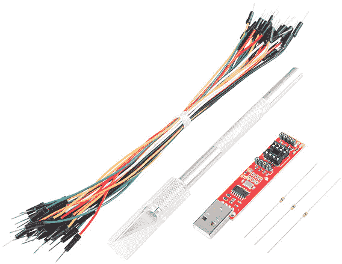](https://www.sparkfun.com/products/13088)

如果你需要一个 AVR 编程器，这个套件是一个特别好的选择——套件的价格(包括刀、跳线和电阻)和编程器本身是一样的。

### 开瓶器

需要一个薄、平、硬的工具将显微镜的外壳与覆盖它的透镜分开。这可以是一把 [spudger](http://en.wikipedia.org/wiki/Spudger) 、[业余爱好刀](https://www.sparkfun.com/products/9200)，或者一把薄平头螺丝刀(我们的[袖珍螺丝刀](https://www.sparkfun.com/products/12891)中最小的钻头)。

[](https://www.sparkfun.com/products/12891) 

将**添加到您的[购物车](https://www.sparkfun.com/cart)中！**

### [袖珍螺丝刀套装](https://www.sparkfun.com/products/12891)

[In stock](https://learn.sparkfun.com/static/bubbles/ "in stock") TOL-12891

每个黑客都应该拥有什么？没错，一把螺丝刀(你必须以某种方式进入那些箱子)。什么…

$4.505[Favorited Favorite](# "Add to favorites") 24[Wish List](# "Add to wish list")****[](https://www.sparkfun.com/products/9200) 

将**添加到您的[购物车](https://www.sparkfun.com/cart)中！**

### [爱好刀](https://www.sparkfun.com/products/9200)

[In stock](https://learn.sparkfun.com/static/bubbles/ "in stock") TOL-09200

就像一把 Xacto 刀，只是更好。我们在处理多氯联苯时广泛使用这些技术。这些小刀子很适合切割…

$3.502[Favorited Favorite](# "Add to favorites") 18[Wish List](# "Add to wish list")**** ****刀子划伤你的微视图外壳的可能性较低，但在你第一次尝试撬的时候，刀尖也可能会折断。如果可以的话，用一把更老的钝刀片。或者，更好的是，牺牲一个刀片，打破尖端的尖端。

### 一个程序员

有许多工具可以通过 ISP 执行微视图重新编程任务。有专为该任务打造的主板，如[微型 AVR 编程器](https://www.sparkfun.com/products/11801)、 [STK500 USB 编程器](https://www.sparkfun.com/products/8702)或 [AVR 袖珍编程器](https://www.sparkfun.com/products/9825)。

[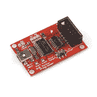](https://www.sparkfun.com/products/9825) 

将**添加到您的[购物车](https://www.sparkfun.com/cart)中！**

### [袖珍 AVR 编程器](https://www.sparkfun.com/products/9825)

[In stock](https://learn.sparkfun.com/static/bubbles/ "in stock") PGM-09825

这个新版本使用 SMD 5x2 标题。这是一个简单易用的 USB AVR 编程器。它成本低，易于使用，工程大…

$18.5053[Favorited Favorite](# "Add to favorites") 31[Wish List](# "Add to wish list")****[](https://www.sparkfun.com/products/11801) 

将**添加到您的[购物车](https://www.sparkfun.com/cart)中！**

### [微型 AVR 编程器](https://www.sparkfun.com/products/11801)

[26 available](https://learn.sparkfun.com/static/bubbles/ "26 available") PGM-11801

ATtiny45 和 85 是一对非常酷的小 MCU，但是您知道您可以在 Arduino 中对它们进行编程吗？没错，n…

$17.50102[Favorited Favorite](# "Add to favorites") 76[Wish List](# "Add to wish list")****[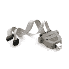](https://www.sparkfun.com/products/retired/8702) 

### [STK500 兼容 USB 编程器](https://www.sparkfun.com/products/retired/8702)

[Retired](https://learn.sparkfun.com/static/bubbles/ "Retired") PGM-08702

AVR-ISP500 是一款快速可靠的 USB AVR 编程器，可直接与 AVR Studio 配合使用。它是公认的 STK500 程序…

4 **Retired**[Favorited Favorite](# "Add to favorites") 2[Wish List](# "Add to wish list")**** ****即使你没有一个专门的 AVR 程序员，你可能有一个程序员，甚至不知道它！大多数 Arduino 的可以被编程来复制 AVR 编程器。如果你有一个 [Arduino Uno](https://www.sparkfun.com/products/11021) 、 [RedBoard](https://www.sparkfun.com/products/12757) 、 [Pro](https://www.sparkfun.com/products/10915) ，或者，真的，任何基于 ATmega328P 的 Arduino，你已经准备好了。

[](https://www.sparkfun.com/products/11021) 

将**添加到您的[购物车](https://www.sparkfun.com/cart)中！**

### [Arduino Uno - R3](https://www.sparkfun.com/products/11021)

[In stock](https://learn.sparkfun.com/static/bubbles/ "in stock") DEV-11021

这是新的 Arduino Uno R3。除了以前主板的所有功能外，Uno 现在使用 ATmega16U2 代替…

$27.95138[Favorited Favorite](# "Add to favorites") 162[Wish List](# "Add to wish list")****[](https://www.sparkfun.com/products/10915) 

将**添加到您的[购物车](https://www.sparkfun.com/cart)中！**

### [Arduino Pro 328-5V/16 MHz](https://www.sparkfun.com/products/10915)

[33 available](https://learn.sparkfun.com/static/bubbles/ "33 available") DEV-10915

是蓝色的！太瘦了！是 Arduino Pro！SparkFun 对 Arduino 的极简设计方法。这是一个 5V 的 Arduino 运行…

$18.503[Favorited Favorite](# "Add to favorites") 23[Wish List](# "Add to wish list")****[](https://www.sparkfun.com/products/retired/12757) 

### [spark fun red board——用 Arduino 编程 T3](https://www.sparkfun.com/products/retired/12757)

[Retired](https://learn.sparkfun.com/static/bubbles/ "Retired") DEV-12757

在 SparkFun，我们使用许多 Arduinos，我们一直在寻找最简单、最稳定的一款。每块板都有点不同…

127 **Retired**[Favorited Favorite](# "Add to favorites") 78[Wish List](# "Add to wish list")**** ****通过将 [ArduinoISP 草图](http://arduino.cc/en/Tutorial/ArduinoISP)加载到你的 Arduino 上，它将变成一个 USB AVR 编程器。Arduinos 编程 Arduinos:疯狂！

### 跳线

为了连接您的编程器和 MicroView，您需要六根单独的凸对凸跳线。大多数 M/M 跳线都可以，包括[标准](https://www.sparkfun.com/products/11026)或[高级](https://www.sparkfun.com/products/8431)套。

[](https://www.sparkfun.com/products/11367) 

将**添加到您的[购物车](https://www.sparkfun.com/cart)中！**

### [](https://www.sparkfun.com/products/11367)

[In stock](https://learn.sparkfun.com/static/bubbles/ "in stock") PRT-11367

各种颜色的电线:你知道这是一个美丽的东西。六种不同颜色的硬纸板实芯焊丝…

$21.5037[Favorited Favorite](# "Add to favorites") 86[Wish List](# "Add to wish list")****[](https://www.sparkfun.com/products/8431) 

将**添加到您的[购物车](https://www.sparkfun.com/cart)中！**

### [跳线高级 6 "米/米装 10 根](https://www.sparkfun.com/products/8431)

[In stock](https://learn.sparkfun.com/static/bubbles/ "in stock") PRT-08431

这是一个 SparkFun 独家！这些是 155 毫米长、26 AWG 跳线，两端都有公接头。用这些来跳离…

$4.502[Favorited Favorite](# "Add to favorites") 11[Wish List](# "Add to wish list")****[](https://www.sparkfun.com/products/11026) 

将**添加到您的[购物车](https://www.sparkfun.com/cart)中！**

### [跳线标准 7" M/M - 30 AWG (30 个装)](https://www.sparkfun.com/products/11026)

[In stock](https://learn.sparkfun.com/static/bubbles/ "in stock") PRT-11026

如果你需要快速完成一个原型，没有什么比一堆跳线更能加快速度的了，让我们来看看

$2.4520[Favorited Favorite](# "Add to favorites") 43[Wish List](# "Add to wish list")****** ******如果你愿意，你甚至可以使用[实芯线](https://www.sparkfun.com/products/11367)。

### Arduino IDE

有一些软件工具可以用来对 AVR 重新编程。最简单的程序，也是我们推荐的程序，是好的 ol' [Arduino IDE](http://arduino.cc/en/Main/Software) 。Arduino 有一个内置的工具，它允许你**将一个引导加载程序**烧录到它的任何一个主板上，这使得编写引导加载程序像点击两次一样简单。

[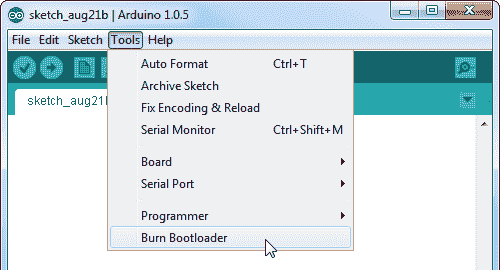](https://cdn.sparkfun.com/assets/learn_tutorials/2/9/2/burn_bootloader.png)

### (可选，推荐)焊接工具或薄规格 PTH 电阻

整个过程中最难的部分是将你的程序员连接到 MicroView 的三个微型 ISP 引脚上。由于空间限制，它们被分成三个小的裸露过孔。

[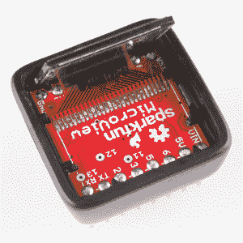](https://cdn.sparkfun.com/assets/learn_tutorials/2/9/2/07-display_lifted.jpg)*After lifting the cover off your MicroView, you'll need to connect to those vias labeled "11", "12", and "13".*

如果你施加足够稳定的压力，你可以完成这三个连接，而不用焊接或连接其他任何东西。不过，要注意的是，这需要几次尝试才能做对；如果你缺乏耐心，可能会产生挫败感。

如果不想焊接到微视图，一个技巧是将通孔 0ω(或至少极低电阻)电阻插入微视图的三个 ISP 过孔。诀窍是找到引线足够细的电阻。我们的[电阻套件](https://www.sparkfun.com/products/10969)上的 0ω电阻非常适合这项任务，但要注意，许多其他电阻——尤其是额定功率为 W 及以上的电阻——引线太粗。

(还有各种其他巧妙的方法连接到这些过孔中。比如你可以[用缝衣针](http://mythopoeic.org/microview-lazy-fix/)戳他们。你只需要一个直径在 0.015 英寸以下导电的东西。)

如果你手边有焊接工具，不用将电阻塞入过孔，你可以通过临时[焊接](https://learn.sparkfun.com/tutorials/how-to-solder-through-hole-soldering)一根跳线到测试引脚来使编程过程更加顺利——在 MicroView 和编程器之间建立可靠的电连接。一个[简单的铁](https://www.sparkfun.com/products/9507)，和一些[焊料](https://www.sparkfun.com/products/9163)就是你应该需要的全部。

[](https://www.sparkfun.com/products/9163) 

将**添加到您的[购物车](https://www.sparkfun.com/cart)中！**

### [无铅焊料- 15 克管](https://www.sparkfun.com/products/9163)

[In stock](https://learn.sparkfun.com/static/bubbles/ "in stock") TOL-09163

这是你的无铅焊料的基本管，带有不干净的水溶性树脂芯。0.031 英寸规格，15 克

$3.954[Favorited Favorite](# "Add to favorites") 14[Wish List](# "Add to wish list")****[](https://www.sparkfun.com/products/9507) 

将**添加到您的[购物车](https://www.sparkfun.com/cart)中！**

### [烙铁- 30W(美国，110V)](https://www.sparkfun.com/products/9507)

[33 available](https://learn.sparkfun.com/static/bubbles/ "33 available") TOL-09507

这是一个非常简单的固定温度，快速加热，30W 110/120 VAC 烙铁。我们真的很喜欢使用更贵的 iro…

$10.957[Favorited Favorite](# "Add to favorites") 21[Wish List](# "Add to wish list")****[](https://www.sparkfun.com/products/9327) 

将**添加到您的[购物车](https://www.sparkfun.com/cart)中！**

### [焊芯 2 号 5 英尺。-通用](https://www.sparkfun.com/products/9327)

[In stock](https://learn.sparkfun.com/static/bubbles/ "in stock") TOL-09327

焊芯、咖啡和纸巾让 SparkFun 保持运转。你可以偷别人的斜切刀一分钟，但你会…

$2.754[Favorited Favorite](# "Add to favorites") 30[Wish List](# "Add to wish list")****[](https://www.sparkfun.com/products/retired/11650) 

### [【烙铁- 30W (EU，230VAC)](https://www.sparkfun.com/products/retired/11650)

[Retired](https://learn.sparkfun.com/static/bubbles/ "Retired") TOL-11650

这是一个非常简单的固定温度，快速加热，30W 230VAC 烙铁。我们真的很喜欢用更贵的熨斗，b…

1 **Retired**[Favorited Favorite](# "Add to favorites") 9[Wish List](# "Add to wish list")****** ******当你开始拆电线和清理时，焊芯可能会有所帮助。

## 识别有缺陷的 MV

在我们进入兔子洞之前，我们至少应该确保你的微视图*实际上*丢失了它的引导程序。如果你还没有，跟随[微视入门指南](http://learn.microview.io/intro/getting-started.html)。这将引导您完成驱动程序安装，并插入微视图。

### 使用 Arduino 进行测试

或者，您可以尝试在 Arduino IDE 中上传草图。加载[微视图库](https://github.com/geekammo/MicroView-Arduino-Library)中包含的任何示例。仔细检查你的**串口**设置正确，**板卡**设置为“Arduino Uno”。然后点击上传。

在上传过程中，您应该看到 MicroView USB 编程器上的黄色“RX”LED 闪烁。如果你看到的只是三次快速闪烁，这是引导装载程序丢失的早期警告信号。再等几秒钟后，Arduino IDE 的控制台中应该会产生一个错误。如果你得到这样的东西:

[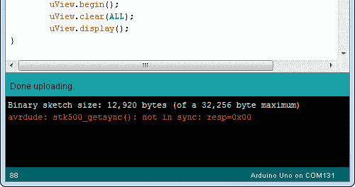](https://cdn.sparkfun.com/assets/learn_tutorials/2/9/2/error_console.png)

...或以下任何错误:

```
avrdude: stk500_recv(): programmer is not responding

avrdude: ser_recv(): programmer is not responding

avrdude: stk500_getsync(): not in sync: resp=0x00

avrdude: stk500_getsync() attempt 10 of 10: not in sync: resp=0x00
```

...你的微视图可能没有引导程序。手术时间到了。

## (小心地)打开箱子

AVR ISP 编程接口需要六个引脚:VCC、GND、RST、MOSI、MISO 和 SCK。VCC(电源)、GND(接地)和 RST(复位)都在 MicroView 随时可用的一对 8 针接头的某处断开。不幸的是，这三个 SPI 信号没有连接到接头，而是隐藏在外壳内，连接到三个无屏蔽的过孔。要露出这些针，你必须取下显微观察镜的覆盖透镜，然后抬起显示器。

拿起你的土豆刀、[业余爱好刀](https://www.sparkfun.com/products/9200)或[小号平头螺丝刀](https://www.sparkfun.com/products/12891)。找一个平坦稳定的表面来做这件事。

[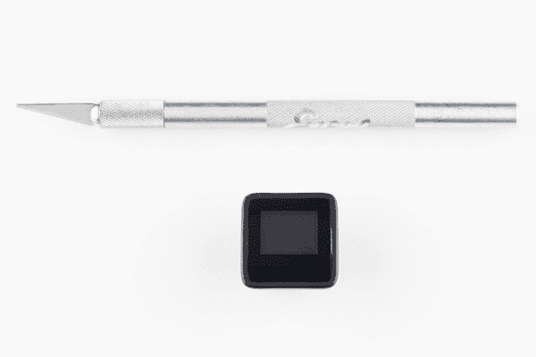](https://cdn.sparkfun.com/assets/learn_tutorials/2/9/2/01-tools.jpg)

如果你用的是一把锋利的业余爱好刀，你可能想拿一把钳子，从刀尖上撕下一小块，让刀刃变得更钝、更平。

[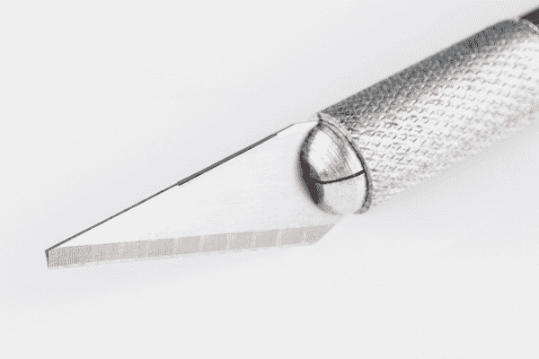](https://cdn.sparkfun.com/assets/learn_tutorials/2/9/2/02-knife_edge.jpg)

镜头盖由外壳左右两侧的两个固定槽口固定。通过向左或向右滑动镜头，尽可能多地暴露一侧的空隙。您可能会看到其中一个固定槽口。

[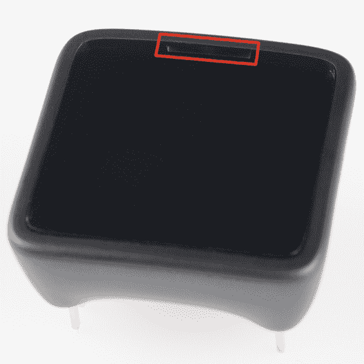](https://cdn.sparkfun.com/assets/learn_tutorials/2/9/2/03-MV_notch.jpg)

将开瓶器插入槽口和盖子底部之间的某处。在外壳内部的斜边挡道之前，您应该能够将其推入大约 2 毫米。温柔一点，但是尽量往里推，以获得更多的杠杆作用。

[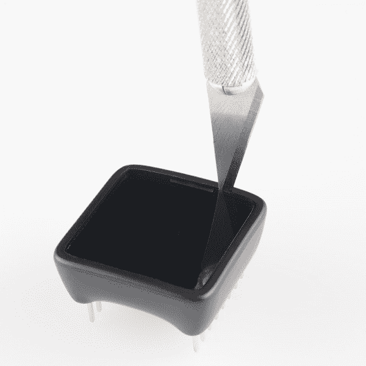](https://cdn.sparkfun.com/assets/learn_tutorials/2/9/2/04_knife-insert.jpg)

然后，通过向显微视图外侧倾斜开启器来撬起盖子。

[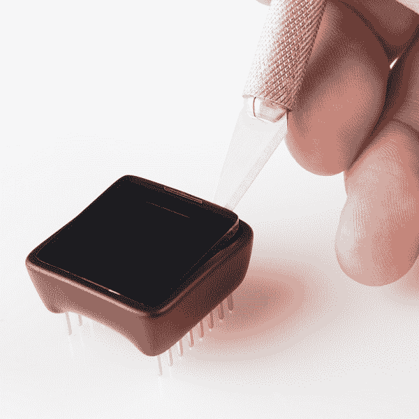](https://cdn.sparkfun.com/assets/learn_tutorials/2/9/2/05-knife_lever.jpg)

一旦屏幕边缘弹出，用手指抓住它并将其拉下。

[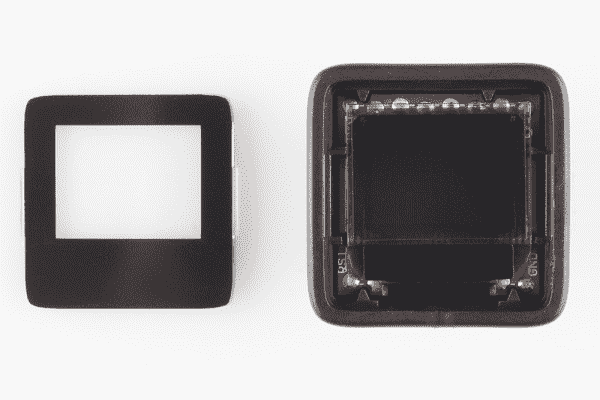](https://cdn.sparkfun.com/assets/learn_tutorials/2/9/2/06-cover_removed.jpg)

MISO、MOSI 和 SCK 的裸露引脚就在显示屏下方。为了接近它们，*非常小心地*将有机发光二极管撬起。有机发光二极管通过一个薄的黑色连接器连接到 PCB 它很易碎，小心不要给它施加额外的压力。

[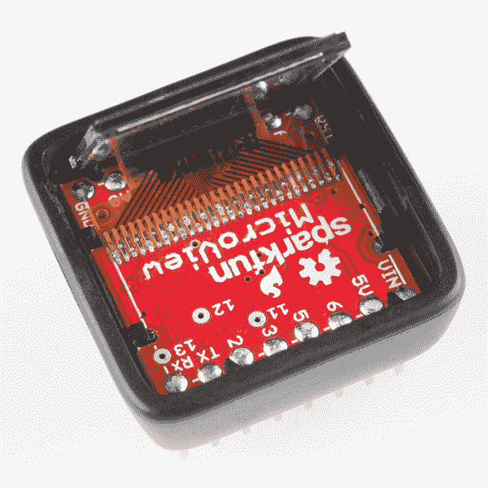](https://cdn.sparkfun.com/assets/learn_tutorials/2/9/2/07-display_lifted.jpg)

这三个无屏蔽的小通孔，标有“11”、“12”和“13”，就是我们要找的！

## 给编程器接线

正如我们在“收集工具”一节的[“程序员”](https://learn.sparkfun.com/tutorials/installing-a-bootloader-on-the-microview#programmer)部分中的设备列表所证明的，可以对引导加载程序进行编程的主板并不缺乏。在这一节中，我们将演示如何连接一些最常见的编程工具。

对于每一个，我们必须连接六个信号:VCC、GND、重置、MOSI、MISO 和 SCK。我们将对六个信号使用以下颜色编码的电线:

| 信号名称 | 微视引脚 | 电线颜色 |
| VCC | 5V | 红色 |
| GND | GND | 黑色 |
| 重置 | 英特尔的快速储存技术 | 柑橘 |
| MOSI | Eleven | 格林（姓氏）；绿色的 |
| 军事情报部门组织(Military Intelligence Service Organization) | Twelve | 蓝色 |
| 血清肌酸激酶 | Thirteen | 黄色 |

我们将为每个程序员重复连接，如果您想跳到特定设备，请单击下面的按钮:

*   一个 [AVR 袖珍编程器](#2x3ISP)(或任何带 2x3 ISP 电缆的专用 AVR 编程器)
*   微型 AVR 编程器
*   一个[装备了 ArduinoISP 草图](#arduinoISP)的 Arduino。

### 连接到 AVR ISP 2x3 电缆

在将编程器连接到您的微视图之前，您可能需要安装驱动程序。如果您正在使用 [AVR 袖珍编程器](https://www.sparkfun.com/products/9825)，请跟随我们的[袖珍 AVR 编程器连接指南](https://learn.sparkfun.com/tutorials/pocket-avr-programmer-hookup-guide)进行指导。

大多数 AVR 开发板，如 Arduino Uno，都有一个 2x3 的头，专门用于通过 ISP 进行(重新)编程。该接头符合标准 2x3 ISP 封装(或更大的 2x5 变体),其引脚排列如下:

[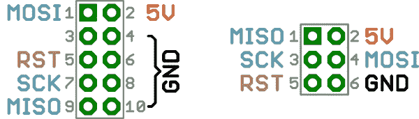](https://cdn.sparkfun.com/assets/learn_tutorials/2/9/2/isp-pinout.png)

这些引脚排列是连接器在 PCB 上的俯视图。如果你把电线插到电缆里，你需要把图像翻转过来。这些信号是如何在电缆连接器上路由的:

[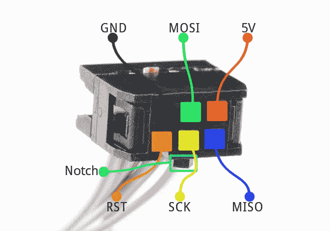](https://cdn.sparkfun.com/assets/learn_tutorials/2/9/2/2x3-labeled.jpg)

请注意，电缆中的凹口表示封装的引脚 1 侧。

不幸的是，MicroView PCB 不够大，无法容纳整个标准化 ISP 接头，但是，一旦移除盖子，所有需要的引脚都会以某种方式暴露出来。

将六根跳线电缆直接插入 2x3 连接器。如果可以的话，使用彩色编码的电线。这是每个 ISP 引脚的位置(注意凹槽，表示引脚 1 侧):

[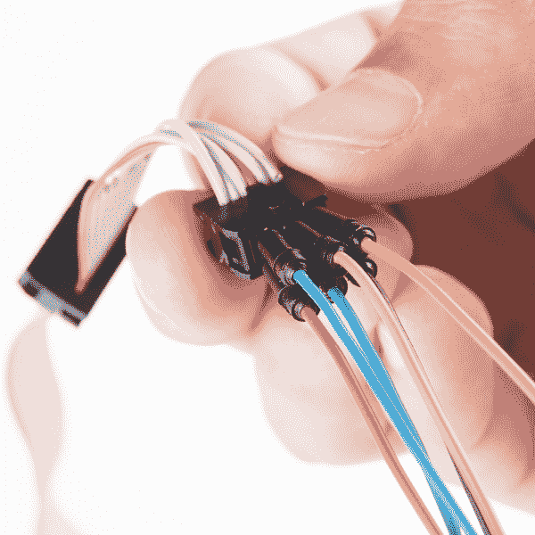](https://cdn.sparkfun.com/assets/learn_tutorials/2/9/2/09-2x3_wired.jpg)

然后跳到[接线到显微视图](https://learn.sparkfun.com/tutorials/installing-a-bootloader-on-the-microview#wiring-the-microview)部分，完成接线。

### 连接微型 AVR 编程器

微型 AVR 编程器是为给 85 年代的[的](https://www.sparkfun.com/products/9378)编程而设计的工具，但它的用途远不止这些！它可以编程任何 AVR。如果你正在用微型 AVR 编程器完成这项任务，确保你已经通读了我们的[微型 AVR 编程器连接指南](https://learn.sparkfun.com/tutorials/tiny-avr-programmer-hookup-guide)——至少通读了驱动安装部分。

微型 AVR 编程器与标准的 2x3 连接器不匹配，我们需要的引脚都被分成 8 引脚 DIP 插座和两个 4 引脚机器引脚连接器。这就是事情的真相:

[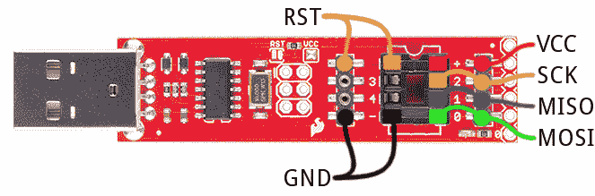](https://cdn.sparkfun.com/assets/learn_tutorials/2/9/2/tiny-programmer.png)

插入你的电线。如果可以的话，给它们标上颜色。

[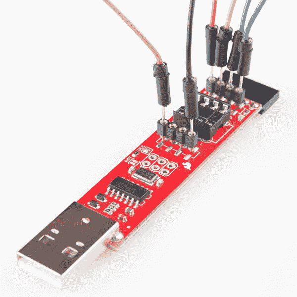](https://cdn.sparkfun.com/assets/learn_tutorials/2/9/2/10-tiny_wired.jpg)

然后进行[接线至显微观察部分](https://learn.sparkfun.com/tutorials/installing-a-bootloader-on-the-microview#wiring-the-microview)。

### 连接到 ArduinoISP

几乎任何，老 Arduino 可以变成一个 AVR 的 ISP。你所需要的只是正确的草图: [ArduinoISP](http://arduino.cc/en/Tutorial/ArduinoISP) ，它默认包含在 Arduino IDE 中。通过进入**文件** > **实例** > **ArduinoISP** 打开草图。然后把它上传到你的 Arduino，幸运的是它已经有了一个引导程序！

[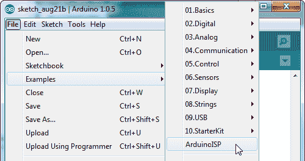](https://cdn.sparkfun.com/assets/learn_tutorials/2/9/2/arduinoISP_example.png)

ArduinoISP 草图将 Arduino 引脚 10、11、12 和 13 分别用作 RST、MOSI、MISO 和 SCK。如果你使用的是 [Arduino Uno](https://www.sparkfun.com/products/11021) ，你可能还需要**在复位引脚和地**之间连接一个 [10 F 电容](https://www.sparkfun.com/products/523)。这是它如何连接到微视图的:

[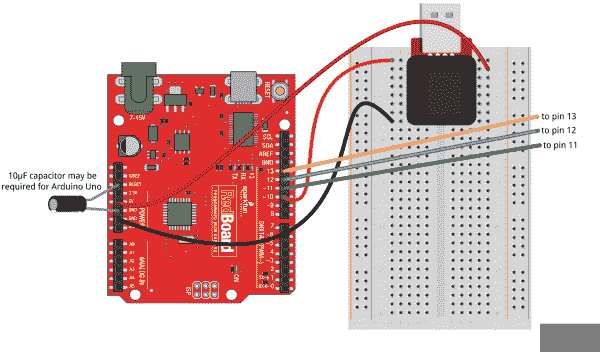](https://cdn.sparkfun.com/assets/learn_tutorials/2/9/2/microview_fix-ArduinoISP_bb-3.png)

请注意，ArduinoISP 草图通过将 led 分配给引脚 7、8 和 9 来提供一些简单的调试。它们是完全可选的，但是可以使跟踪错误变得更加容易。引脚 9 上的 LED 将指示“心跳”，如果有错误，8 将闪烁，引脚 7 将指示编程正在进行中。

用一些颜色编码的跳线来连接它，像这样:

[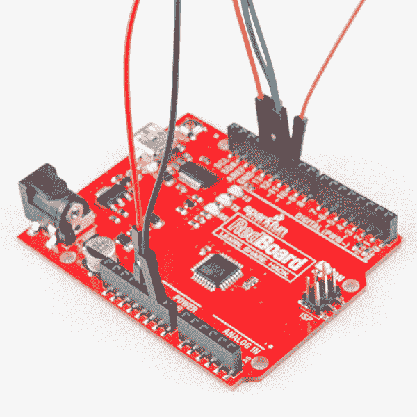](https://cdn.sparkfun.com/assets/learn_tutorials/2/9/2/11-arduinoISP_wired.jpg)

然后继续下一部分，将其连接到微视图。

## 微视图布线

你已经连接了程序员，这是(比较容易的)一半的连接。现在连接显微视图。首先，将您的微型视图插入 USB 编程器，然后将编程器插入试验板。

[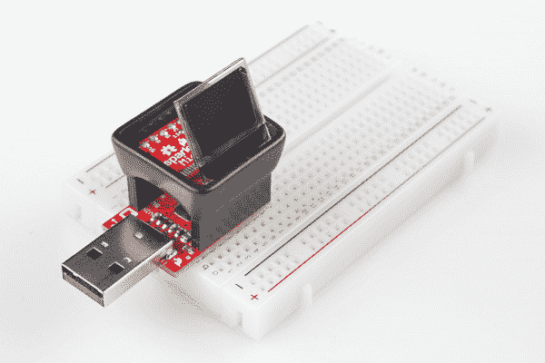](https://cdn.sparkfun.com/assets/learn_tutorials/2/9/2/12-MV_breadboarded.jpg)

试验板既可用作电线连接点，也可用作稳定工具。

### 电源和复位

幸运的是，VCC、GND 和 RST 引脚都出现在微视图上。

[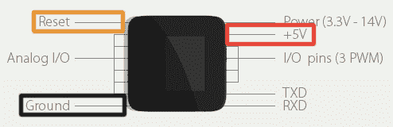](https://cdn.sparkfun.com/assets/learn_tutorials/2/9/2/mv-pin-locations.jpg)

将这些连接到你的程序员就像把一些电线插到试验板上一样简单。

[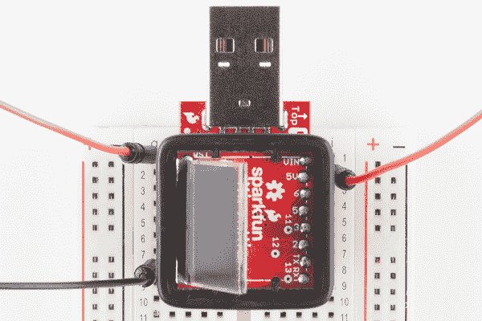](https://cdn.sparkfun.com/assets/learn_tutorials/2/9/2/13-rst_pwr_wired.jpg)

这是一个很好的时间来考虑如何在编程时为微视图供电。一些程序员——包括 ArduinoISP、Tiny AVR 程序员和 AVR Pocket 程序员——可以自己驱动微视图。其他程序员(如更官方的 Atmel AVR ISPs)要求微视图由外部供电。如果您需要外部供电，请将 USB 编程器插入您的计算机。但是，**如果你要从你的 AVR 编程器给微视供电，让你的微视的 USB 编程器拔掉插头**。

### 连接到 MOSI、米索和 SCK (11、12 和 13)

现在是困难的部分。我们需要连接三条 SPI 线路，如下所示:

| Programmer Pin | 微视引脚 |
| MOSI (D11) | Eleven |
| 味噌(D12) | Twelve |
| SCK(第 13 天) | Thirteen |

经过多次这样的过程，这里有三种可行的方法。单击跳到相应的部分:

*   [将电线焊接到过孔](#connect-by-solder) -使用焊接工具和小心的手，您可以将跳线直接焊接到过孔。这是最可靠的方法，但也需要最多的工具-不建议初学焊接的人使用。
*   [插入 0ω电阻](#connect-by-resistor) -如果你有 0ω“跳线”电阻(就像我们的[电阻套件](https://www.sparkfun.com/products/10969)中的那些)，并且它们的引脚足够细，你可以将它们插入 MicroView 的过孔。这是一个相对可靠的临时解决方案。
*   将电线固定在原位 -除此之外，你可以尝试在刻录引导程序时将三根电线都固定在原位。这种方法很有效，但是需要一些耐心和稳定的双手。

#### 焊接电线

如果您手边有烙铁，我们建议用少量焊料将跳线连接到过孔。如果你要把烙铁拿到 MV 上，你可能要把整个电路板从外壳中拿出来，以免烫到边缘。向下按压 MicroView 外壳，使用工作台向上推动接头引脚，需要稳定的力量才能将 PCB 从固定夹中取出。

在过孔上涂少量焊料。

[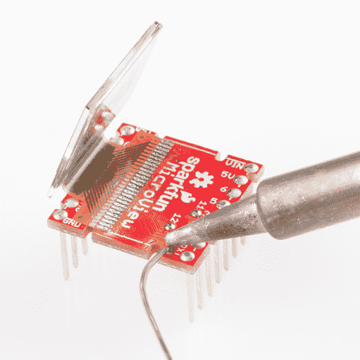](https://cdn.sparkfun.com/assets/learn_tutorials/2/9/2/14-solder_dabs.jpg)

然后重新加热焊料滴，并将跳线的一端熔合到焊料滴上。对三个过孔中的每一个重复该过程。

[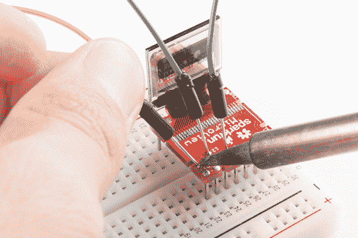](https://cdn.sparkfun.com/assets/learn_tutorials/2/9/2/15-wires_soldered.jpg)

焊接导线后，注意不要让它在显微视图上用力过猛。你可能会完全抬起电路板的通孔及其铜(然后你将不得不焊接到 ATmega328P 的引脚上)。

将这些电线插入编程器的正确端口:

[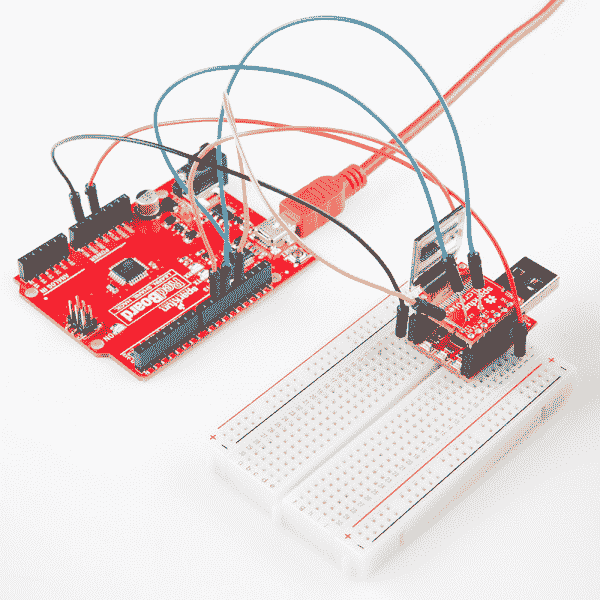](https://cdn.sparkfun.com/assets/learn_tutorials/2/9/2/programming-arduino.jpg)

然后[跳到下一节](https://learn.sparkfun.com/tutorials/installing-a-bootloader-on-the-microview#burning-the-bootloader)。

#### [通过 0ω电阻(或细实线)连接](#connect-by-resistor)

如果你缺少焊接工具，或者只是想避免改变你的微观视角，看看你是否能抓住三个 0ω(或者至少是*非常小的*、<50ω)电阻。那些包含在我们的[电阻器套件](https://www.sparkfun.com/products/10969)中的可以完美的工作。您可能需要仔细寻找终端足够薄的电阻，它们需要小于 0.015 英寸，以适合微视图的过孔。

将每个电阻插入微视图上的不同过孔，然后将电阻的另一端插入试验板上的特定行。

[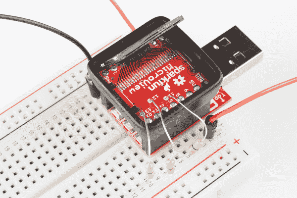](https://cdn.sparkfun.com/assets/learn_tutorials/2/9/2/16-resistors_plugged.jpg)*See, 0Ω resistors aren't useless!*

然后，将编程器的每个 SPI 引脚布线至试验板的相应行。你可能只需要在接触过孔的地方稍微弯曲一下电阻——只要足以形成电接触即可。

[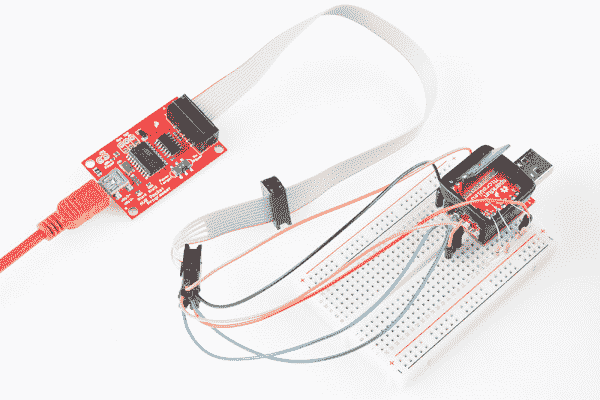](https://cdn.sparkfun.com/assets/learn_tutorials/2/9/2/programming-pocket.jpg)

我们在可靠性的边缘徘徊，但是这个选择仍然比下一个好得多...

#### “推动连接”电线

如果你既没有焊接工具也没有低阻抗电阻，你最好有灵巧、稳定的手和耐心。您可以将三根跳线中的每一根“戳”入它们各自的过孔，创建*刚好足够的*电气连接。我们真的建议请一个朋友来帮你，因为当一只手忙着固定电线的时候，另一只手必须放在你的电脑鼠标上，点击菜单。

在真正把电线放好之前，请点击下一页，做好充分准备，为你的引导程序编程。一旦你的鼠标光标停留在 Arduino IDE 中的“烧录引导程序”上，你就可以开始忙乱地推动连接你的跳线了。

这没有真正的技巧。首先将一根电线推入针脚 13。一旦这是稳定的继续引脚 12，举行两个跳线之间的拇指和食指。最后加上引脚 11。

[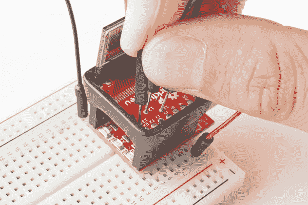](https://cdn.sparkfun.com/assets/learn_tutorials/2/9/2/17-wires_held.jpg)

然后赶紧开始编程！你必须让他们保持 30 秒左右。

## 刻录引导加载程序

本节将介绍两个现成的软件工具，它们可以用来与您的 AVR ISP 交互，将引导加载程序刻录到您的 MicroView 上。选择一个最适合你的舒适度:

1.  Arduino IDE -如果你安装了 Arduino IDE，这是一种简单的基于图形用户界面的引导程序编程方式。
2.  AVRDUDE(命令行实用程序 - AVRDUDE 是一个命令行实用程序，可以调用它对 AVR 进行编程。仅建议高级用户使用此方法。未知因素，如文件位置和环境变量，在这里起了作用，所以您可能需要稍微修改我们的示例命令，以使它们在您的计算机上工作。

Arduino 方法不会在烧了 bootloader 之后给你即时的满足感。微视图演示代码不包含在引导加载程序中，所以您必须在刻录引导加载程序后单独上传它。使用 AVRDUDE，您可以精确定位要上传的十六进制文件，因此您可以上传合并的引导加载程序/微视图演示文件，并立即发现您的微视图是否恢复到 100%。

### 在 Arduino IDE 中刻录引导程序

打开 Arduino，然后进入**工具** > **程序员**。选择与您计划使用的相匹配的编程器。对于我们在本教程中讨论的程序员来说，这将是 USBTinyISP 或 Arduino 作为 ISP。

[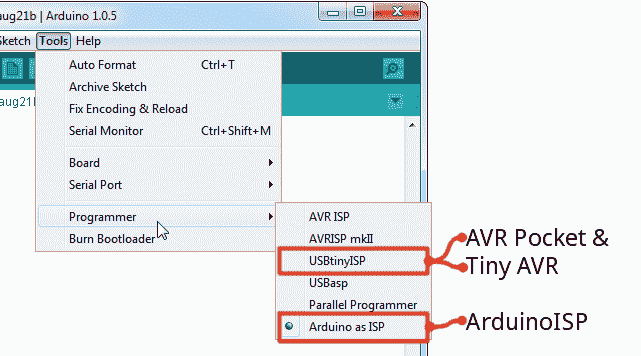](https://cdn.sparkfun.com/assets/learn_tutorials/2/9/2/programmer_select.png)

如果您使用 Arduino 作为 ISP，请确保将**串行端口**设置为该 Arduino 的端口号。如果你最近上传了 ArduinoISP 草图到你的 Arduino，它可能设置正确，但是检查一下！

最后，确保电路板设置正确。这将决定哪个引导程序被编程到你的微视图中。应该设置为 **Arduino Uno** 。

[](https://cdn.sparkfun.com/assets/learn_tutorials/2/9/2/board_select.png)

设置到此为止。现在，确保你的程序员正确连接到你的微视图，并进入**工具** > **烧录引导程序**，欣赏灯光秀。

[](https://cdn.sparkfun.com/assets/learn_tutorials/2/9/2/burn_bootloader.png)

引导加载程序刻录过程通常需要大约 30 秒。如果你拿着跳线在适当的位置，保持稳定！在引导加载程序被编程之后，您应该在控制台上方看到一条令人惊讶的简短消息“Done burning bootloader”。

[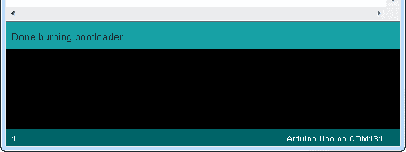](https://cdn.sparkfun.com/assets/learn_tutorials/2/9/2/bootloader_success.png)

如果你得到一个错误，比如`avrdude: initialization failed, rc=-1`，要么是不正确的，要么是缺少连接。仔细检查以确保所有东西都连接正确。

如果你得到了好消息，继续进入[测试和结束部分](https://learn.sparkfun.com/tutorials/installing-a-bootloader-on-the-microview#testing-and-closing)。微视屏幕将是空白的；在 bootloader 上传过程中，微视图上的程序被删除了，所以，现在，微视图上没有任何草图。

### 通过 AVRDUDE 和命令行编程

在幕后，Arduino 使用 [AVRDUDE](http://www.nongnu.org/avrdude/) 与你的程序员交流和命令。不使用 Arduino 作为前端，可以从命令行调用 AVRDUDE。你需要在你的电脑上安装或存在 AVRDUDE([点击这里](http://download.savannah.gnu.org/releases/avrdude/)下载 AVR dude)。

您还需要(工作)微视图十六进制文件，[点击此处下载微视图引导加载程序十六进制文件](https://cdn.sparkfun.com/assets/learn_tutorials/2/9/2/MicroView_combined_8-19-14.hex)，“MicroView_combined_8-19-14.hex”。为了使示例命令更简单，我们假设十六进制文件与 AVRDUDE 在同一个位置。

如果你有一个 **AVR 袖珍编程器**或**微型 AVR 编程器**，像这样的命令会将引导加载程序上传到你的 Arduino。

```
avrdude -c usbtiny -p atmega328p -U flash:w:MicroView_combined_8-19-14.hex -U lock:w:0x0F:m
```

如果你使用一个 **Arduino 作为 ISP** ，使用如下命令。你需要用你的 Arduino 的 COM 端口#来代替我们的占位符(`COMN`用于 Windows 或者`/dev/tty.usbmodemNNNN`用于 Mac/Unix):

```
Windows: avrdude -p atmega328p -c avrisp -P COMN -b 19200 -v -e -U flash:w:MicroView_combined_8-19-14.hex -U lock:w:0x0F:m

Mac: avrdude -p atmega328p -c avrisp -P /dev/tty.usbmodemNNNN -b 19200 -v -e -U flash:w:MicroView_combined_8-19-14.hex -U lock:w:0x0F:m
```

发送命令后，您的终端将被写、读和其他消息淹没，直到整个引导装载程序被编程。

[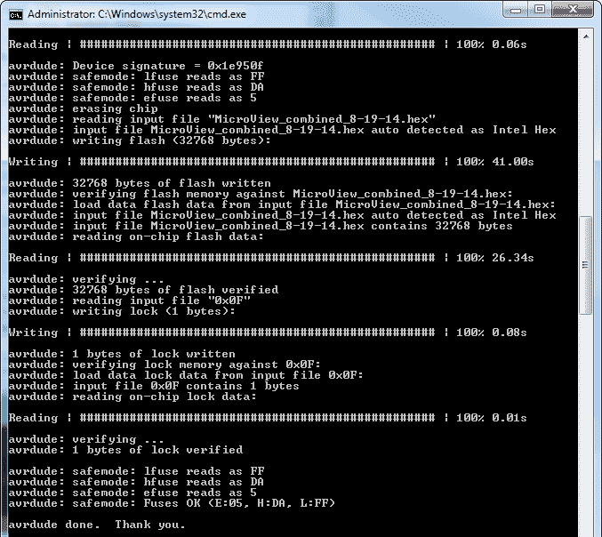](https://cdn.sparkfun.com/assets/learn_tutorials/2/9/2/avrdude_example_2.png)

在 AVRDUDE 说完成之后，应该对引导装载程序进行编程。作为一个额外的奖励，这个十六进制文件包括微视图演示-一旦它被编程，显示器应该点亮，并开始循环模式。

## 测试和关闭

我们就要回到起点了。在关闭 MicroView back up 之前，最好对它进行测试，确保它是引导程序可编程的。

断开 AVR 编程器与 MicroView 的连接，将 MicroView 插入 MicroView USB 编程器(如果还没有)，然后将编程器插入计算机。

然后重复“识别”部分的 Arduino 编程过程。在 Arduino IDE 中，从[微视图库](https://github.com/geekammo/MicroView-Arduino-Library)加载一个示例，确保串行端口和电路板(“Arduino Uno”)在 Arduino IDE 中设置正确，然后开始编程！

[](https://cdn.sparkfun.com/assets/learn_tutorials/2/9/2/done_uploading.png)

如果你得到一个“上传完成”的提示。控制台上方的消息，您已经成功地重新编程了您的微视图！您加载的微视图演示也应该开始运行。再次编程以确保万无一失...

### 关闭微视图

如果焊接到任何微视图过孔，首先需要从电路板上移除这些跳线。加热每个接头，并逐一拆除电线。

如果您从外壳上拆下了 MicroView PCB，请将其装回。MicroView PCB 是键控的，因此它只能单向工作，确保电路板顶部和底部的成对槽口与外壳中的槽口匹配。**不要按下屏幕**，抬起屏幕，将 MicroView PCB 推入外壳。当它卡入时，在外壳每侧的两个固定 PCB 的小夹子下面，您应该会听到一声咔嗒声。

接下来，将有机发光二极管折回到 PCB 顶部。外壳中有导轨，用于固定显示器。它应该刚好与显示器侧面和顶部的外壳槽口齐平。

[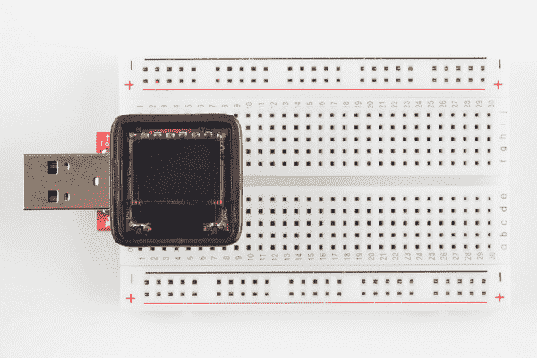](https://cdn.sparkfun.com/assets/learn_tutorials/2/9/2/18-display_placed.jpg)

在合上它之前，轻轻地**擦拭有机发光二极管**以去除任何指纹。您可能还需要擦拭外壳镜头的底部。

最后，关闭它！外壳的突出部分偏离边缘的中间，它们更靠近镜头的内侧。插入外壳透镜的一个凸耳，然后向下按压另一侧将其卡入。

[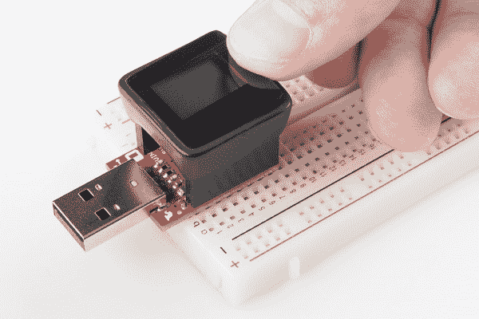](https://cdn.sparkfun.com/assets/learn_tutorials/2/9/2/19-closing.jpg)

没有人会知道区别！

[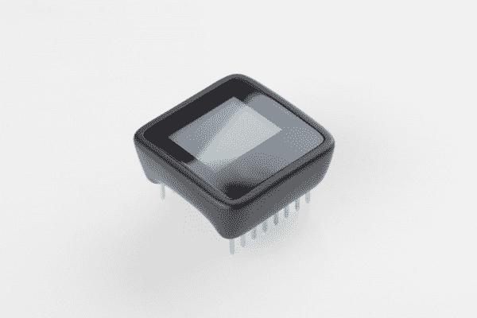](https://cdn.sparkfun.com/assets/learn_tutorials/2/9/2/post-fix.jpg)

## 资源和更进一步

现在是有趣的部分了！希望在您开始使用它之前，您还没有厌倦微视图。

要开始使用微视，我们建议通读微视连接指南:

[](https://learn.sparkfun.com/tutorials/microview-hookup-guide) [### 显微视图连接指南

#### 2016 . 12 . 15](https://learn.sparkfun.com/tutorials/microview-hookup-guide) A quick tutorial to get you up and running with your MicroView Development Board.[Favorited Favorite](# "Add to favorites") 7

如果您有适用于 MicroView 的 SparkFun Inventor 套件，请阅读实验指南开始使用:

[](https://learn.sparkfun.com/tutorials/sparkfun-inventors-kit-for-microview) [### SparkFun Inventor 的微视套件

#### 2015 年 2 月 27 日](https://learn.sparkfun.com/tutorials/sparkfun-inventors-kit-for-microview) The SparkFun Inventor's Kit for MicroView follows our tried and true inventor's kit model, bringing you 11 simple yet fun experiments to introduce you to the SparkFun MicroView.[Favorited Favorite](# "Add to favorites") 7

为了真正利用微视，我们建议您熟悉强大的[微视 Arduino 库](https://github.com/geekammo/MicroView-Arduino-Library)。有了它，你可以画任何东西，从简单的形状——像素、线条、圆形和正方形——到文本和位图。[微视连接指南](https://learn.sparkfun.com/tutorials/microview-hookup-guide)将帮助你开始使用图书馆。************************