# 火花朋克音序器理论和应用指南

> 原文：<https://learn.sparkfun.com/tutorials/sparkpunk-sequencer-theory-and-applications-guide>

## 介绍

[火花朋克音序器](https://www.sparkfun.com/products/12707)是一个音乐控制电压音序器，用于控制[火花朋克声音发生器](https://www.sparkfun.com/products/11177)。

[](https://www.sparkfun.com/products/retired/11177) [Retired](https://learn.sparkfun.com/static/bubbles/ "Retired") KIT-11177

SparkFun SparkPunk 套件是一款以雅达利朋克游戏机为精神的声音发生器。而不是简单地重建…

6 **Retired**[Favorited Favorite](# "Add to favorites") 39[Wish List](# "Add to wish list")[](https://www.sparkfun.com/products/retired/12707) 

### [SparkFun SparkPunk 音序器套装](https://www.sparkfun.com/products/retired/12707)

[Retired](https://learn.sparkfun.com/static/bubbles/ "Retired") KIT-12707

SparkFun SparkPunk 音序器是一款音乐控制电压音序器，用于控制 SparkPunk 声音套件。与……

3 **Retired**[Favorited Favorite](# "Add to favorites") 36[Wish List](# "Add to wish list")

有了这一对，你可以创造十步音乐主题，但在音序器中有隐藏的机会:它可以被修改，并以巧妙有趣的方式连接到外部硬件。

[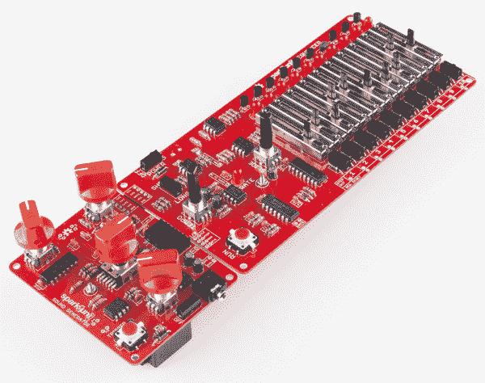](https://cdn.sparkfun.com/assets/learn_tutorials/2/6/8/product-paired-angle.jpg)

我们将从更详细地解释序列器的内部开始。我们将逐步介绍原理图的主要功能模块，了解它们之间的相互关系，并研究连接这些模块的重要信号。然后，我们将进行一些简单的修改，改变序列器的行为。在此基础上，我们将研究如何添加更多硬件来制造越来越复杂的系统。

本文件从[连接导轨](https://learn.sparkfun.com/tutorials/sparkpunk-sequencer-hookup-guide)停止的地方开始。如果你还没有建立你的序列器，从那里开始，然后回来。

[](https://learn.sparkfun.com/tutorials/sparkpunk-hookup-guide) [### 火花朋克连接指南

#### 2014 年 6 月 12 日](https://learn.sparkfun.com/tutorials/sparkpunk-hookup-guide) How to assemble and modify the SparkPunk Sound Generator kit.[Favorited Favorite](# "Add to favorites") 6

## 操作理论

为了修改序列器，理解它的一些内部工作是有用的。我们将逐步介绍原理图上的功能模块，并详细讨论每个模块的工作原理。如果您想更好地查看原理图或 PCB 原图，您可以从 [Github](https://github.com/sparkfun/Sparkpunk_Sequencer) 下载 Eagle 文件。

在构建原型硬件之前，序列器是在仿真中设计的。Github repo 中还有 Spice 模拟文件，它们运行在免费的 [LTSpice](http://www.linear.com/designtools/software/) 环境中。仿真证明是非常有价值的，尤其是在使可变宽度门电路工作方面。

SparkPunk 音序器是一个混合信号电路，由用于计时和播放逻辑的数字部分和用于产生控制电压和门的模拟部分组成。

* * *

### 数字部分

我们将从电路的数字部分开始。这些大多是使用 CD4000 系列 CMOS 逻辑芯片实现的。这些芯片的额定电源电压范围很广——与一些更新、更灵敏的逻辑芯片不同，它们非常喜欢由 9V 电池供电。

* * *

#### 快动按钮

定序器上的运行按钮是一个瞬时接触型开关。为了在切换应用中使用它(按一下打开，再按一下关闭)，它连接到 CD4013 触发器的一个部分。开关连接到触发器的时钟输入端，反相逻辑输出返回到数据输入端。

[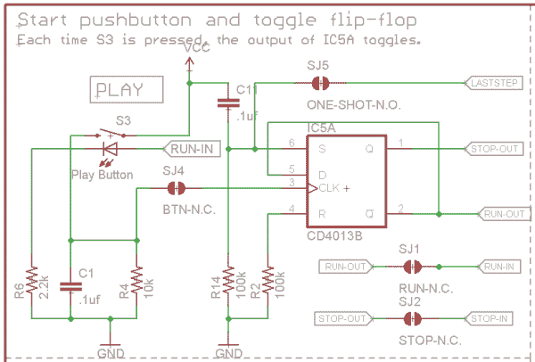](https://cdn.sparkfun.com/assets/learn_tutorials/2/6/8/schem-button.png)

每次按下按钮，触发器输出都会改变状态。

触发器有两个输出，称为 Q 和 Q ，它们的功能可以描述为:

*   q 叫“停。”当序列器停止时，该位被置位。
*   Q 叫“跑。”当序列器运行时，该位被置位。

运行和停止信号用于电路的其他部分-当序列发生器启动或停止时，其他电路需要做出适当的反应，这些信号允许这些动作。

触发器还具有数据预设输入(set 和 reset 引脚)。上电时，Set 输入端的电容会暂时保持高电平，使触发器初始化为 Set 状态，因此序列器默认停止工作。

运行信号连接到按钮中的 LED，因此在音序器播放时它会亮起。

* * *

#### 速度时钟和分频器

电路的下一个功能模块是节奏时钟。它由两级组成:时钟振荡器和分频器。

振荡器部分基于 7555，这是古老的 [555 定时器 IC](https://www.sparkfun.com/products/9273) 的低功耗 CMOS 版本。基本电路将定时器配置为非稳态(自由运行)模式，时序由电位计设置。

[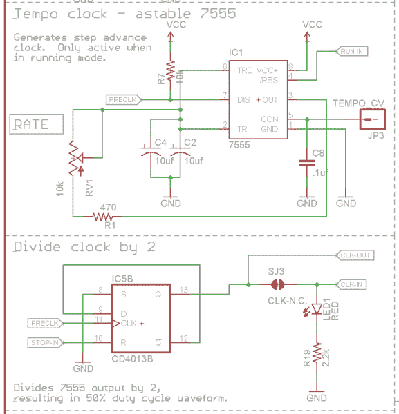](https://cdn.sparkfun.com/assets/learn_tutorials/2/6/8/schem-clock.png)

当序列发生器运行时，时钟由来自按钮电路的运行信号启用。当序列器停止时，7555 不运行。

序列器的其余部分不直接使用 7555 的输出。利用 CD4013 中的另一个触发器，通过二分频电路进一步调节 7555 的输出。这样做有几个原因:

*   首先，7555 产生的时钟不是完全对称的——脉冲宽度随频率而变化。这使得短/长切换难以实现，也使得速度 LED 难以辨别-宽脉冲意味着它几乎总是被照亮。
*   其次，通过分频时钟，我们可以用更小的时序电容实现有用的节奏范围。一分为二的效果与电容值加倍的效果相同。
*   分频后的时钟脉冲宽度为 50%，然后用作系统的输入，产生短(半步长)门。
*   最后，CD4013 中还有一个未使用的触发器。

触发器的 Q 输出是电路其余部分使用的时钟信号。它还驱动速率指示器 LED。

* * *

#### CD4017

CD4017 本质上是一个片上序列器。它是该套件的核心，电路的其余部分用于支持其基本功能。在内部，它有一个二进制纹波计数器和一个解复用器。它接收引脚 14 上的脉冲，这导致计数器递增。计数器的值被解码，使得 10 个输出引脚(标记为 Q0 至 Q9)中的一个每次都有效。每个时钟脉冲导致下一个输出引脚被选择，达到 Q9 后，选择从 Q0 重新开始。

[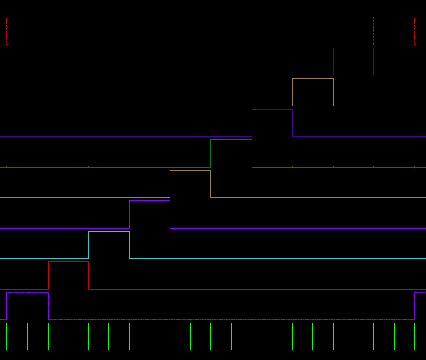](https://cdn.sparkfun.com/assets/learn_tutorials/2/6/8/4017-timing.png)

CD4017 的时序可以在上图中看到。时钟是底部轨迹，十路输出是上面的轨迹。在时钟的每个上升沿，高逻辑电平进入下一个连续输出。

[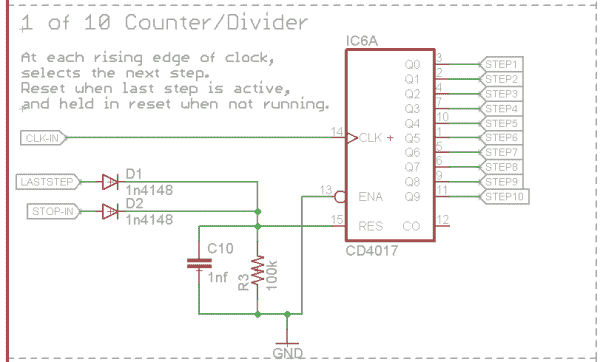](https://cdn.sparkfun.com/assets/learn_tutorials/2/6/8/schem-4017.png)

CD4017 还有一个 reset 引脚，当它置位时，从 Q0 重新开始输出选择。这允许我们实现一些更微妙的行为:

*   当音序器不演奏时，它位于第一级。这可以通过将 stop 信号连接到 CD4017 上的 reset 引脚来实现。
*   当序列开始播放时，电容器 C10 将 reset 线保持高电平一小段时间。这意味着 CD4017 实际上忽略了第一个时钟脉冲，序列从第一步开始。如果没有这个上限，只要按下 run(运行)按钮，时钟就开始计时，序列立即进入第二步。
*   通过将选择脉冲从一个阶跃输出反馈到 reset 引脚，我们可以将模式限制在十步以下。

* * *

### 模拟电路

#### 台阶

CD4017 的 10 个输出馈入 10 步电路。每一步都是同一个回路的复制品。

[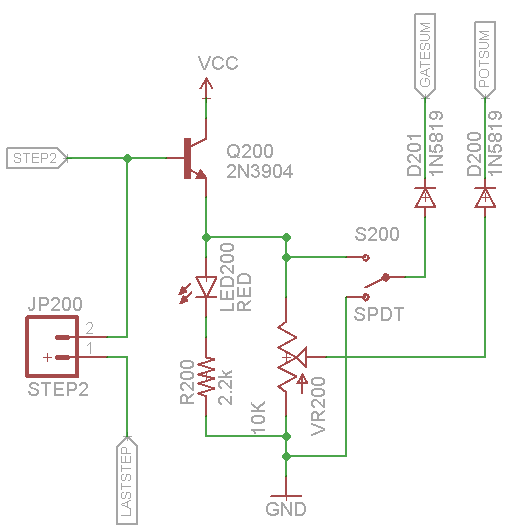](https://cdn.sparkfun.com/assets/learn_tutorials/2/6/8/schem-step.png)

CD4017 输出的额定值仅为几毫安，因此步进电路从一个配置为射极跟随器的晶体管开始，允许更多的输出电流来点亮 LED。步进选择电压也提供给滑块，滑块作为分压器连接。当选择该级时，滑块的游标在地和大约 8.3V 之间移动。每个级上的栅极开关在选择电压和地之间选择。

滑块雨刷和开关分别通过二极管耦合到公共总线 POTSUM 和 GATESUM。这种配置实现了最大电压的选择。由于一次只能选择一个步骤，这意味着除了一个输入之外，max 函数的所有输入都将为零，从而允许选定的步骤占主导地位。

* * *

#### 滑块电压处理

为了理解滑块电压是如何被操纵的，我们需要后退一步，更仔细地看一看它所馈电的器件。SparkPunk 声音发生器使用 7556 双定时器 IC 作为其主要音源。7556 有控制电压输入，但它们的行为有点违反直觉——CV 引脚上的*电压较高*会导致*频率较低*—*反比关系*。它在接地电压和电源电压之间的中间范围内工作得最好，离开该范围会导致 7556 断断续续或停止工作。

[LM358 放大器 IC](https://www.sparkfun.com/products/9456) 也受到约束。[数据手册](http://www.sparkfun.com/datasheets/Components/General/LM358.pdf)指出最大输入电平比正供电轨低 1.5V。

定序器相应地管理来自滑块雨刷器的电压，将电压反相并缩放到可用范围。

[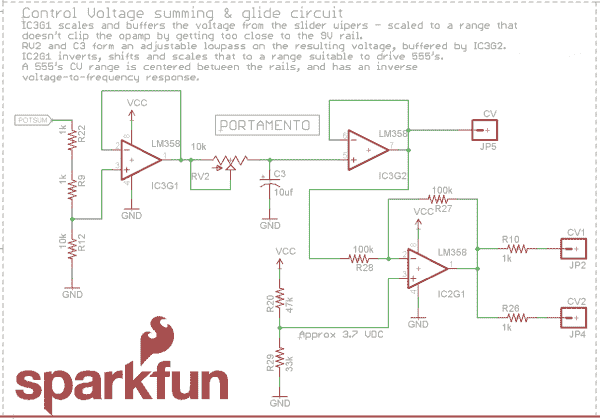](https://cdn.sparkfun.com/assets/learn_tutorials/2/6/8/schem-cv.png)

根据电路中的信号，首先我们找到一个分压器，将电平降低到 LM358 允许的范围内。该信号用运算放大器级缓冲，然后馈入实现滑动的可变低通滤波器。随着 RV2 的电阻增加，C3 充电需要更长时间。该滤波器由另一个运算放大器级缓冲。最后，第三个运算放大器将控制电压反相并偏移到适合 7556 的范围内。

* * *

#### 开关电压处理

序列器的门行为可以在短门和长门之间改变，短门的持续时间都是半个步长，长门的持续时间是一个完整的步长。此外，该门仅在序列发生器运行时被驱动，因此当停止时，它会保持安静。门背后的逻辑可以用以下等式表示:

```
Long gate = running && step switch 
Short gate = running && step switch && clock pulse 
```

该逻辑使用模拟处理来实现。

[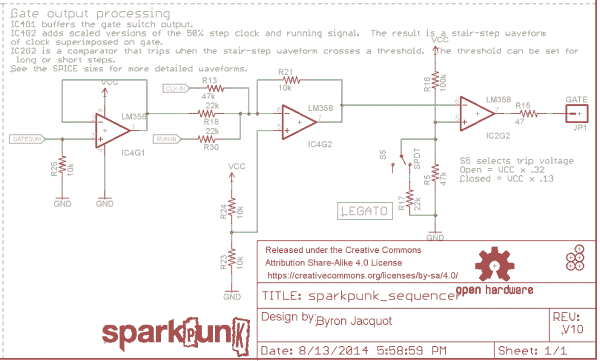](https://cdn.sparkfun.com/assets/learn_tutorials/2/6/8/schem-gate.png)

运行、时钟和开关信号被缩放并相加在一起，从而产生阶梯形波形。这些信号中的每一个都对总和有所贡献，如下面的彩色矩形所示。

[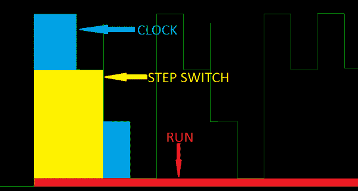](https://cdn.sparkfun.com/assets/learn_tutorials/2/6/8/staircade-colors.png)

请注意，当一个时钟脉冲与开启的步进开关重叠时，它们相加得到所示的最高步进，步进开关本身就是第二高的步进。不与被设置的开关重叠的时钟脉冲更低。我们使用运算放大器比较器电路来应用阈值，以辨别前两个阶梯电平。

实际电路使用反相运算放大器级进行求和，因此结果与上图相反。这由产生门的比较器级来校正，该门也是反相的。

比较器上的阈值电压决定了门脉冲的长度。当阈值电压被时钟和开关信号之和触发时，就会产生短路门。

[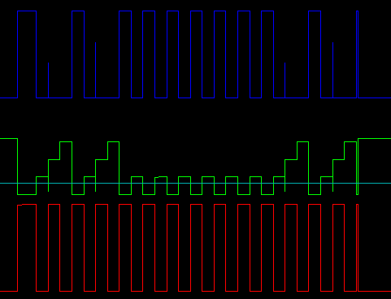](https://cdn.sparkfun.com/assets/learn_tutorials/2/6/8/short-gate.png)*Short Gate Pulse Generation*

时钟显示为红色，反向阶梯波形显示为绿色。比较器阈值以浅蓝色显示，叠加在阶梯上。当阶梯降至阈值以下时，深蓝色的比较器输出切换至高电平。

长栅极使用相同的处理方法，但阈值电压经过调整，因此只需开关电压即可使比较器跳闸。

[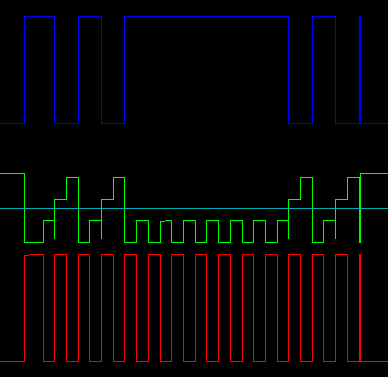](https://cdn.sparkfun.com/assets/learn_tutorials/2/6/8/long-gate.png)*Long Gate Pulse Generation*

### 坚实的基础

理解了上面描述的内部细节之后，我们就可以研究如何将这些细节用于修改和更复杂的部署了。

## 简单的修改

有了上一节中关于序列器内部的知识，我们可以探索序列器的一些修改和更高级的用途。

我们将从一些简单的修改开始，这些修改不需要太多的努力，也不需要太多的外部硬件。

### 序列长度调整

序列发生器的核心 CD4017 IC 有 10 路输出。虽然十是十进制计数的基础，但它并不总是音乐作品的显而易见的选择——四步、六步或八步是更常见的音乐拍号。正如我们在[连接指南](https://learn.sparkfun.com/tutorials/sparkpunk-sequencer-hookup-guide)中提到的，可以限制序列的长度以缩短序列。

CD4017 有一个引脚可以复位内部计数器。通过将其中一个阶跃电压反馈到该引脚，我们可以将序列限制在一个较短的范围内。

序列器 PCB 的右下边缘有十对焊盘。每一步的步进电压出现在顶部焊盘上，底部焊盘是计数器复位。如果将顶部焊盘连接到底部焊盘，当选择该步骤时，会导致序列复位。例如，如果您将*步出 9* 焊盘短接到相邻的*序列重置*焊盘，当选择第 9 步时，将导致序列重置到第一步，有效地将序列限制为 8 步。

[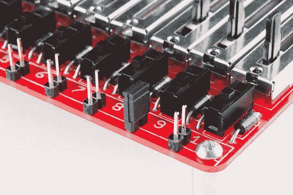](https://cdn.sparkfun.com/assets/learn_tutorials/2/6/8/closeup-last-step.jpg)

您可以通过多种不同的方式连接焊盘。如果你想要永久的约束，你可以焊接一小段电线。对于可手动调节的限制，将[分离接头](https://www.sparkfun.com/products/116)折断成 2 针对，并将它们焊接到每对衬垫中。然后你可以用[跳线分流器](https://www.sparkfun.com/products/9044)桥接它们。

* * *

### 单镜头序列回放

与 CD4017 上的 reset 引脚类似，触发器上也有一个异步 set 引脚来锁存播放按钮(回想一下，触发器的 Q 输出是“停止”信号的来源)。如果我们将一个阶跃电压发送到该引脚，就可以使序列在到达该阶跃时自行停止。

使用 CD4013 附近标有`ONCE`的衬垫很容易做到这一点。同样，您可以使用 2 针接头或开关进行连接。

[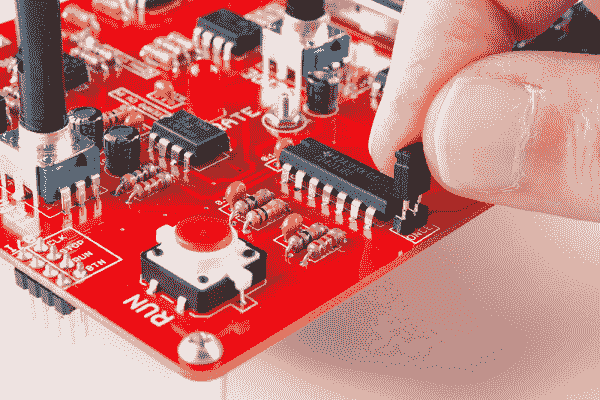](https://cdn.sparkfun.com/assets/learn_tutorials/2/6/8/closeup-oneshot.jpg)

这与上面描述的“最后一步”设置一起工作-选择最后一步，序列将运行一次，当它到达该步时停止。因为触发器需要一个脉冲来设置它，所以没有一个简单的方法来完成一整套十步，因为没有额外的脉冲来指示它已经超过了第十步。

* * *

### 组件值

#### 节奏钟

节奏钟是基于 C2 和 C4 的平行组合。通过改变这些上限，我们可以改变序列回放的速率。控制频率的等式在 [7555 数据表](https://cdn.sparkfun.com/datasheets/Kits/icm7555-56.pdf)中有说明，如下所示

```
7555 frequency = 1/(1.4 * R * C) 
```

其中 R 是 R1 和 RV1 的串联组合，在 470 &ohm;和 10470&ohm;之间可调，C 是 20 F，C2 和 C4 的并联组合

因为我们将 7555 时钟一分为二，所以实际的节奏时钟只有一半

```
clock frequency = (7555 frequency/2) 
```

这导致最低约 1.5 赫兹到最高 35 赫兹的范围。

为了使时钟运行得更慢，增加电容。降低电容会提高频率。

#### 幻灯片时间

同样，我们可以通过调整 C3 上限来改变最大滑动时间。同样，较大的值将需要更长的时间充电，延长幻灯片。用较小的值来减少时间可能不是很有用，因为我们已经可以用电位计 RV2 向下调整时间。

* * *

#### 彩色发光二极管

如果你不喜欢红色，你可以把 led 换成其他颜色。该板适合常规 5 毫米(又名 T-1 3/4)发光二极管。我们提供多种颜色，包括[红色](https://www.sparkfun.com/products/9590)、[黄色](https://www.sparkfun.com/products/9594)、[蓝色](https://www.sparkfun.com/products/11372)和[绿色](https://www.sparkfun.com/products/9592)。您可能需要用不同的电阻来替代 2.2K &系列欧姆电阻；，调节亮度。

## 与更多硬件接口

### 抬头！

我们正在努力进入更先进的领域。以下部分比我们之前接触的任何部分都更具冒险性，包括脱焊、PCB 修改和更详细的故障排除技巧。一些描述故意模糊，作为对更有知识的用户的练习。

### 同步多个序列发生器

[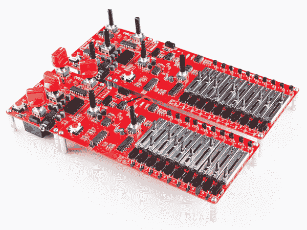](https://cdn.sparkfun.com/assets/learn_tutorials/2/6/8/flotilla.jpg)

如果您仔细阅读了操作理论，您可能会注意到，当文本描述信号运行、停止、时钟和按钮时，原理图中的信号实际上标记为“输出”和“输入”，并用跳线连接它们。这些信号旨在以这种方式分解，以便在多个序列器之间轻松传送。

[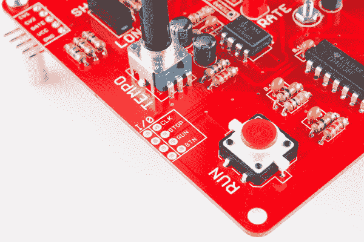](https://cdn.sparkfun.com/assets/learn_tutorials/2/6/8/closeup-sync-port.jpg)*Synchronization Interface*

这些信号都出现在同步界面中，在“运行”按钮和“速度”旋钮之间的左边缘。下表显示了这些信号的表现。

| **信号** | **作为输出** | **作为输入** |
| **CLK** | 时钟系统产生的速度脉冲 | 导致 CD4017 计数器增加 |
| **停止** | 表示序列器已停止 | 复位 CD4017
保持时钟分频器处于复位状态 |
| **运行** | 指示序列正在播放 | 允许 7555 运行 |
| **BTN** | 表示按钮已被按下 | 脉冲导致播放/停止切换 |

特别要注意的是，为了使序列器前进，停止线必须为低电平，运行线必须为高电平，并且时钟脉冲需要进入时钟线。

使用该端口最明显的方法是同步多个时序控制器。一个充当主时钟，其他时序控制器跟随(或“追逐”)该时钟。

#### 修改

如果您有两个时序控制器，修改它们以使用同步端口并不困难。选择一个作为主时钟，另一个跟随该时钟。

1.  首先，在从序列器上，切断同步端口列之间的铜走线。

    [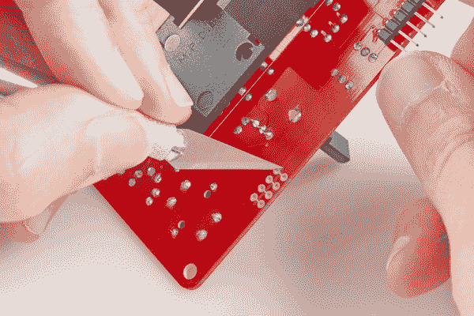](https://cdn.sparkfun.com/assets/learn_tutorials/2/6/8/closeup-knife.jpg)

2.  然后，将导线从主序列器上“O”(输出)列中的焊盘连接到从序列器上的“I”(输入)列。我们正在使用[可扣接头](https://www.sparkfun.com/products/116)和 [4 针跳线](https://www.sparkfun.com/products/10364)，因此我们可以很容易地断开单元。

    [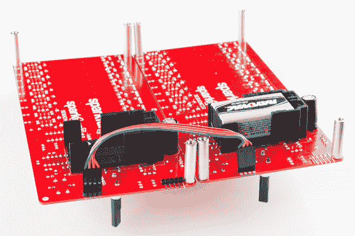](https://cdn.sparkfun.com/assets/learn_tutorials/2/6/8/closeup-sync-cable.jpg)

3.  您还需要将两个音序器的接地连接在一起。最简单的方法是在一个音序器上的 9V 电池盒的“GND”引脚上点焊一小段导线，然后在另一个音序器上连接到同一点。

    [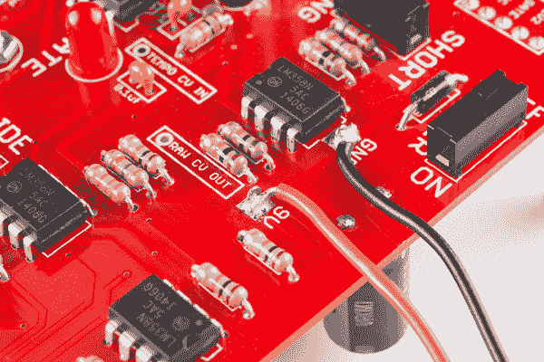](https://cdn.sparkfun.com/assets/learn_tutorials/2/6/8/closeup-power-tacks.jpg)

    你也可以连接附近的 9V 端子，这样你只需要一块电池就可以给整个聚合供电，但是它吃电池的速度会快一倍。

4.  现在，当您按下主机上的 play 时，两个序列器将一起启动并运行。

[](https://cdn.sparkfun.com/assets/learn_tutorials/2/6/8/flotilla.jpg)

如果将从机同步输入端口相互并联，一个时钟主机可以驱动多个从机。

要制作一个可以在主设备和从设备之间转换的音序器，你可以使用[正常插孔](https://www.sparkfun.com/products/11144)，或者从[可扣接头](https://www.sparkfun.com/products/116)安装两个引脚，并使用[跳线分流器](https://www.sparkfun.com/products/9044)重新连接引脚。

### 力量

当你开始堆叠多个火花朋克和序列器时，你开始面临 9V 电池所能可靠供电的极限。电源不足的第一个症状是长/短门功能停止可靠工作。

如果你想完全不用电池，你可以用一个 [9V 的墙上适配器](https://www.sparkfun.com/products/298)来代替。每个音序器& SparkPunk 对最大消耗大约 20 毫安，所以这个适配器应该适用于很多很多对。最好的连接方式是使用星型拓扑，每个序列器都有一个专用电源和回接到电源的接地电缆，而不是将电源以菊花链形式连接到多个序列器。

### 其他合成器

最后一个值得一提的修改是将音序器与其他合成器一起使用。

正如我们在控制电压接口的描述中所述，主控制电压输出是反向的——较高的电压会导致声音发生器的频率较低。这是违反直觉的，也与大多数其他合成器使用的惯例相反。具有控制电压输入的常规模拟频率合成器产生更高的频率，以获得更高的控制电压。该电压存在于序列器内部，位于标有`RAW CV OUT`的焊盘上。这是幻灯片应用后的阶段，但在放大器为火花朋克反转它之前。

[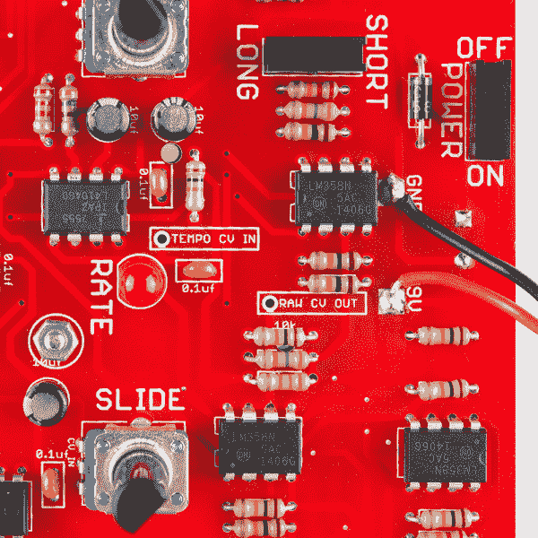](https://cdn.sparkfun.com/assets/learn_tutorials/2/6/8/closeup-raw-cv.jpg)

在尝试之前，您应该检查您想要控制的合成器的规格-可能需要额外的电路来将原始 CV 缩放到合适的范围。一些合成器仅限于 5V 的栅极，您可以使用分压器或齐纳二极管箝位将 9V 栅极衰减到该范围内。

### CV 输入时间

眼尖的读者也会发现上图中的`TEMPO CV IN`垫。它类似于声音发生器上的 CV 输入-电压在&frac 13；Vcc 和&frac 23；Vcc 在大约 2 比 1 的范围内调整速度。响应是相反的-较高的电压导致较低的频率。超过&frac 13；到&frac 23；窗口可能导致 7555 断断续续或停止工作。

我们没有任何关于速度 CV 的具体的 mods，但是作为一个选项它是值得一提的，所以肯定有人会想出一个它的用法！

## 资源和更进一步

### 资源

*   音序器用于控制[火花朋克声音发生器](https://www.sparkfun.com/products/11177)。如果你需要链接，这里有 [SparkPunk 声音发生器连接指南](https://learn.sparkfun.com/tutorials/sparkpunk-hookup-guide)
*   火花朋克的设计文件可以在 GitHub 上找到
*   Github 文件包括在 [LTSpice](http://www.linear.com/designtools/software/#LTspice) 中运行的 Spice 模拟

在本教程中，我们使用了以下部件

*   [分离式集管](https://www.sparkfun.com/products/116)
*   [跳线分流](https://www.sparkfun.com/products/9044)
*   [红色发光二极管](https://www.sparkfun.com/products/9590)
*   [黄色发光二极管](https://www.sparkfun.com/products/9594)
*   [蓝色发光二极管](https://www.sparkfun.com/products/11372)
*   [绿色发光二极管](https://www.sparkfun.com/products/9592)
*   [4 针跳线](https://www.sparkfun.com/products/10364)
*   [9V 墙壁适配器](https://www.sparkfun.com/products/298)

### 更进一步

*   雷蒙德·斯科特被公认为是步序器的发明者，他称之为“循环机”。你可以在这些视频中听到一些例子，并在[的网站上了解更多关于这个人和他的音乐。](http://raymondscott.com/#news)
*   我们也有一个类似的数字设备的教程，Auduino 步序器。
*   尼克·科林斯的《手工电子音乐》是一本很好的音乐电路入门书，里面有许多你可以从头开始构建的试验板项目。