# 火花朋克音序器连接指南

> 原文：<https://learn.sparkfun.com/tutorials/sparkpunk-sequencer-hookup-guide>

## 介绍

在本教程中，我们将组装和使用[火花朋克音序器](https://www.sparkfun.com/products/12707)套件。

[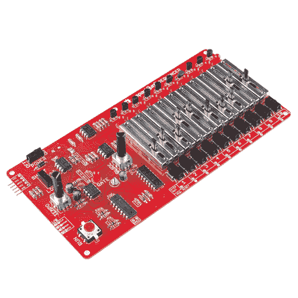](https://www.sparkfun.com/products/retired/12707) 

### [SparkFun SparkPunk 音序器套装](https://www.sparkfun.com/products/retired/12707)

[Retired](https://learn.sparkfun.com/static/bubbles/ "Retired") KIT-12707

SparkFun SparkPunk 音序器是一款音乐控制电压音序器，用于控制 SparkPunk 声音套件。与……

3 **Retired**[Favorited Favorite](# "Add to favorites") 36[Wish List](# "Add to wish list")

火花朋克音序器套件是一个模拟控制电压音序器，用于驱动[火花朋克声音发生器](https://www.sparkfun.com/products/11177)。

*SparkPunk and Sequencer, fully assembled*

[https://www.youtube.com/embed/LUcqDM4k1gU/?autohide=1&border=0&wmode=opaque&enablejsapi=1](https://www.youtube.com/embed/LUcqDM4k1gU/?autohide=1&border=0&wmode=opaque&enablejsapi=1)

### 测序仪简史

一般来说，序列发生器是一种以特定顺序产生定时控制信号的装置。这些信号有多种用途，例如，操纵一组交通信号的电子模块是一种定序器，操纵电梯的控制系统是另一种。两者都必须以正确的顺序和正确的时间产生正确的信号(例如当南北交通流动时停止东西交通，然后确保当信号灯改变时黄灯在正确的时间内亮起)。

音乐音序器用于控制乐器。它们通过特定的节奏时序生成信号来控制音高和音色等演奏参数。最初的测序仪，如雷蒙德·斯科特的循环机，能够产生简短的，重复的音乐短语。最近，音序器已经发展成为在电脑上运行的大型软件包，生成 MIDI 和音频事件，能够创作完整的音乐作品。

SparkPunk 音序器让人想起它的模拟祖先。它在十个步骤之间循环，读取每个步骤的滑块和开关，在输出引脚上产生相应的模拟电压。它通过一系列旋钮、滑块和开关提供手动控制。它与 SparkPunk 声音发生器无缝集成，为您带来创造性的音乐享受。

本教程将指导您完成 SparkPunk 音序器的组装和测试。

### 在开始之前

SparkPunk 音序器比大多数 SparkFun 焊接套件更复杂。它有更多种类的元件，安装在更大的电路板上。如果你是焊接套件的新手，或者需要一些元件识别的练习，我们可以推荐一些更简单的[套件](https://www.sparkfun.com/products/10547)来帮助你快速上手。

音序器用于控制[火花朋克声音发生器](https://www.sparkfun.com/products/11177)。如果你一起购买了这两个套件，我们建议你从[组装和测试](https://learn.sparkfun.com/tutorials/sparkpunk-hookup-guide)声音发生器开始，然后制作音序器。在后面的步骤中，我们将使用声音发生器来测试音序器，如果您确信声音发生器功能正常，这个过程将会更加顺利。

 [### 火花朋克连接指南

#### 2014 年 6 月 12 日](https://learn.sparkfun.com/tutorials/sparkpunk-hookup-guide) How to assemble and modify the SparkPunk Sound Generator kit.[Favorited Favorite](# "Add to favorites") 6

### 必要的工具

*   [烙铁](https://www.sparkfun.com/products/10707)
*   [含铅](https://www.sparkfun.com/products/9161)或[无铅](https://www.sparkfun.com/products/9325)焊料
*   [对角](https://www.sparkfun.com/products/8794)或[平齐](https://www.sparkfun.com/products/11952)刀具
*   小十字螺丝刀

### 额外的工具和用品

*   [安全眼镜](https://www.sparkfun.com/products/11046)
*   放大镜或[放大镜](https://www.sparkfun.com/products/9329)
*   [PCB 虎钳](https://www.sparkfun.com/products/10410)或[第三只手](https://www.sparkfun.com/products/11784)
*   [Volt Meter](https://www.sparkfun.com/products/12966)
*   可移动胶带，如油漆工胶带或工头胶带

### 推荐阅读

*   [如何进行通孔焊接](https://learn.sparkfun.com/tutorials/how-to-solder---through-hole-soldering)
*   [开关基础知识](https://learn.sparkfun.com/tutorials/button-and-switch-basics)
*   [了解元件极性](https://learn.sparkfun.com/tutorials/polarity)
*   [解码电阻标记](https://learn.sparkfun.com/tutorials/resistors/decoding-resistor-markings)
*   [数字逻辑](https://learn.sparkfun.com/tutorials/digital-logic)
*   [如何使用万用表](https://learn.sparkfun.com/tutorials/how-to-use-a-multimeter)

## 套件内容

让我们从盘点套件中的零件开始。您可以按如下所示的分组来组织零件，这样在组装套件时更容易找到它们。

### 电路板

[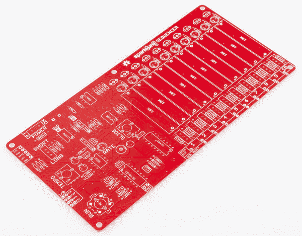](https://cdn.sparkfun.com/assets/learn_tutorials/2/6/6/bom-pcb.jpg)

*   一个 SparkPunk 序列器 PCB

* * *

### 二极管

[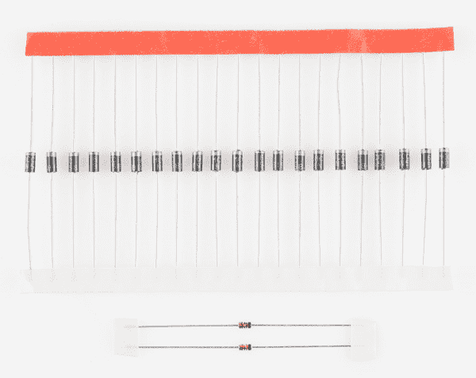](https://cdn.sparkfun.com/assets/learn_tutorials/2/6/6/bom-diodes.jpg)

*   21 个 1N5819 肖特基二极管
*   两个 1N4148 硅二极管

* * *

### 电阻

[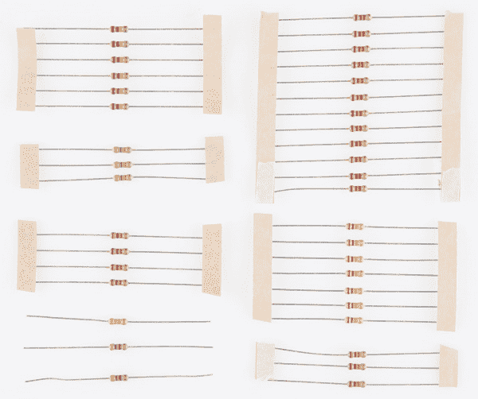](https://cdn.sparkfun.com/assets/learn_tutorials/2/6/6/bom-resistors.jpg)

*   六个 100k 欧姆 1/4W 电阻器(棕色-黑色-黄色-金色)
*   三个 47K 欧姆 1/4W 电阻器(黄-紫-橙-金)
*   四个 1K 欧姆 1/4W 电阻器(棕色-黑色-红色-金色)
*   一个 33K 欧姆 1/4W 电阻器(橙-橙-橙-金)
*   一个 470 欧姆 1/4W 电阻器(黄-紫-棕-金)
*   一个 47 欧姆 1/4W 电阻器(黄-紫-黑-金)
*   十二个 2.2K 欧姆 1/4W 电阻器(红-红-红-金)
*   七个 10k 欧姆 1/4W 电阻器(棕色-黑色-橙色-金色)
*   三个 22K 欧姆 1/4W 电阻器(红色-红色-橙色-金色)

* * *

### 电容器

[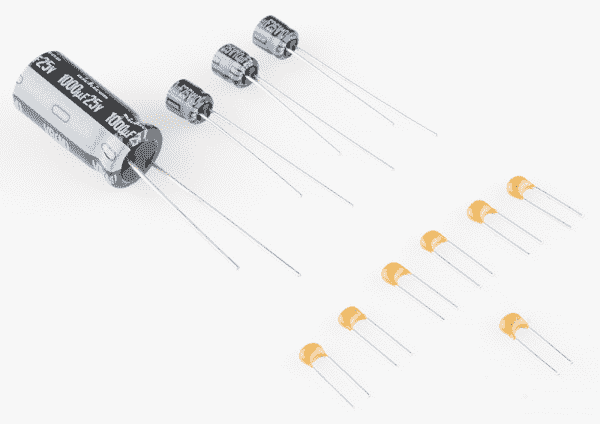](https://cdn.sparkfun.com/assets/learn_tutorials/2/6/6/bom-caps.jpg)

你可能需要一个放大镜来阅读陶瓷电容器上的标记。

*   一个 1000uF 25V 电解电容器
*   三个 10uF 25V 电解电容器
*   六个 0.1uF 陶瓷电容器(标记为 104)
*   一个 1nF 陶瓷电容器(标记为 102)

* * *

### 集成电路

[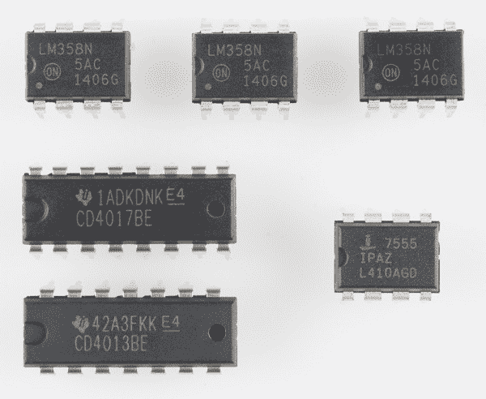](https://cdn.sparkfun.com/assets/learn_tutorials/2/6/6/bom-chips.jpg)

*   三个 LM358N 双通道运算放大器
*   一个 CD4017BE 十选一计数器/解复用器
*   一个 CD4013BE 双触发器
*   一个 ICM 7555

* * *

### 半导体

[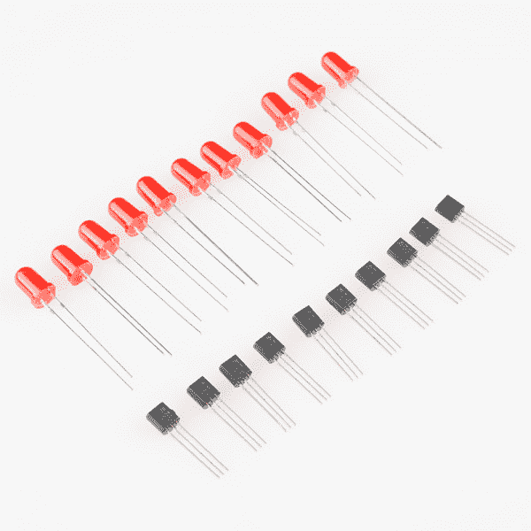](https://cdn.sparkfun.com/assets/learn_tutorials/2/6/6/bom-discretes.jpg)

*   11 个红色发光二极管
*   十个 2n3904 NPN 晶体管

* * *

### 电位器

[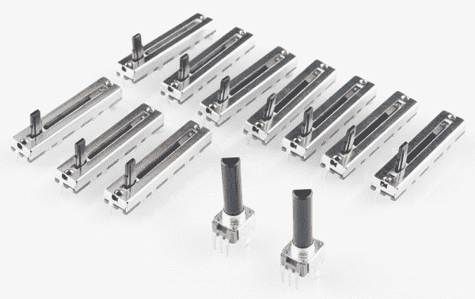](https://cdn.sparkfun.com/assets/learn_tutorials/2/6/6/bom-pots.jpg)

*   十个 10K 欧姆线性滑动电位计
*   两个 10K 欧姆旋转电位计

* * *

### 开关

[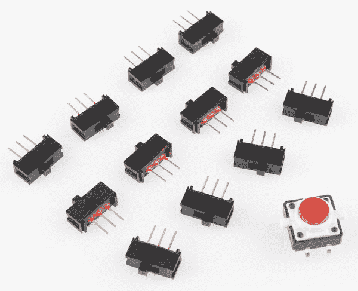](https://cdn.sparkfun.com/assets/learn_tutorials/2/6/6/bom-switches.jpg)

*   十二个迷你单刀双掷(SPDT)开关
*   一个红色 LED 触摸按钮

* * *

### 机械部件

[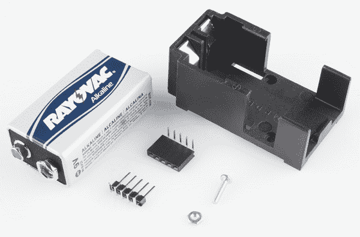](https://cdn.sparkfun.com/assets/learn_tutorials/2/6/6/bom-power.jpg)

*   一个 9 伏碱性电池
*   一个 9V 电池盒
*   一个 5 针直角公接头
*   一个 5 针直角母接头
*   一个 3/8 英寸长的 2-56 十字头机器螺钉
*   一个 2-56 螺母

* * *

如果您遇到短缺，请联系[客户服务](https://www.sparkfun.com/static/contact)，他们可以为您更换零件。

## 电子组件 I -二极管

对于这样的 PCB，如果从最短的元件开始，然后再到最高的元件，通常最容易组装。这样，您就不需要处理大部分较大的组件。

### 二极管

硅[二极管](https://learn.sparkfun.com/tutorials/diodes)是最短的元件，所以我们从它们开始。在工具包中找到硅二极管-它们有一个小的橙色的身体，看起来像一个玻璃珠，在一端附近有一条黑色的条纹。

硅二极管并排安装在下面标记的位置。从哪一个开始并不重要。

[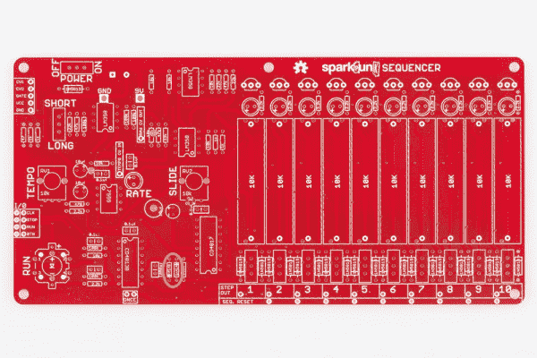](https://cdn.sparkfun.com/assets/learn_tutorials/2/6/6/si-circled.jpg)

这些二极管被极化。玻璃主体的一端有一条黑色条纹，与 PCB 丝网印刷上的白色条纹相匹配。

[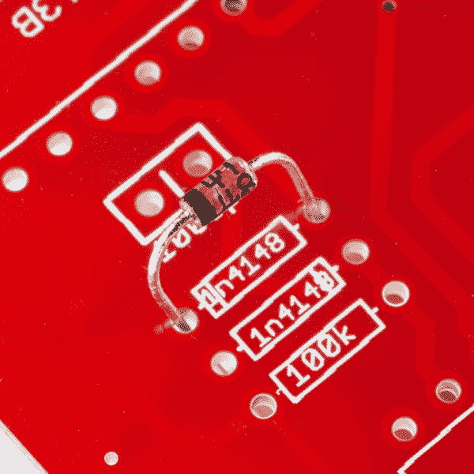](https://cdn.sparkfun.com/assets/learn_tutorials/2/6/6/closeup-si-diode-polarity.jpg)*Align the stripe on the diode with the stripe on the PCB*

二极管安装在 PCB 的顶部，具有丝网轮廓的一侧。弯曲导线，使其穿过孔，然后将其推入，直到主体位于 PCB 顶部。工作时，您可以将腿稍微向外弯曲以握住二极管。

[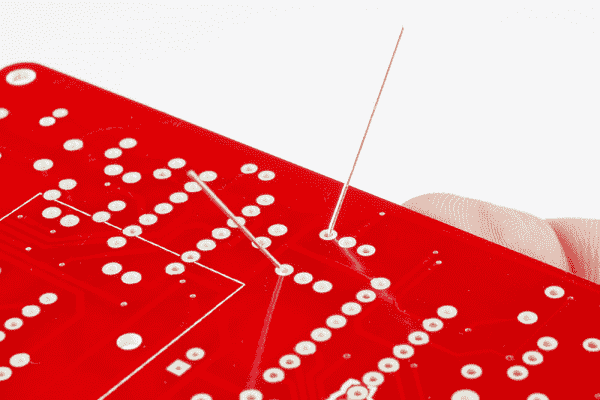](https://cdn.sparkfun.com/assets/learn_tutorials/2/6/6/closeup-bending-leads.jpg)

翻转电路板，将二极管焊接到位。注意使用适量的焊料制作良好的焊点。焊料应该在电路板和引线之间均匀流动，形成一个小而光滑的圆顶或圆锥形。如果你不确定你的圆角，参考我们焊接教程中的图表[。](https://learn.sparkfun.com/tutorials/how-to-solder---through-hole-soldering/soldering-your-first-component-)

[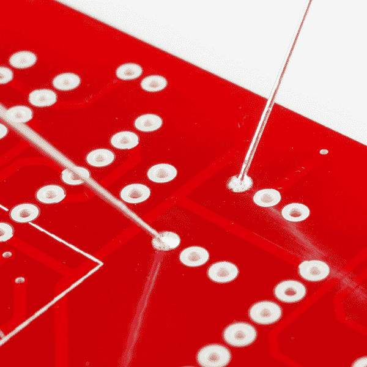](https://cdn.sparkfun.com/assets/learn_tutorials/2/6/6/closeup-soldered-leads.jpg)

焊接完成后，修剪圆角附近多余的引线。

[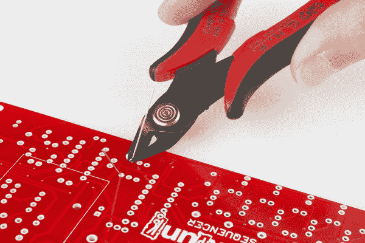](https://cdn.sparkfun.com/assets/learn_tutorials/2/6/6/closeup-trimming-leads.jpg)

在它旁边安装另一个二极管。同样，插入时应将主体和 PCB 上的条纹对齐，使其面向第一个二极管的相反方向。

* * *

两个硅二极管就位后，让我们安装肖特基二极管。(好吧，它们比电阻稍大一点，但不会大到干扰后面的步骤)。

肖特基二极管是黑色圆柱体，一端带有灰色或白色条纹。在棋盘上有很多这样的图案——第一个朝向左上角，其他的成对放置在棋盘的右下角。

[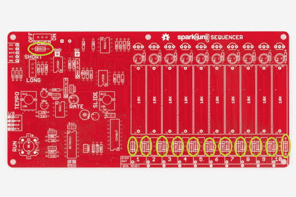](https://cdn.sparkfun.com/assets/learn_tutorials/2/6/6/schottky-circled.jpg)

像硅二极管一样，肖特基二极管也是极化的。将车身上的条纹与 PCB 上的条纹匹配。注意，穿过棋盘底部边缘的那些是正确定向的——它们极性交替，每隔一个都与它的邻居相反。

[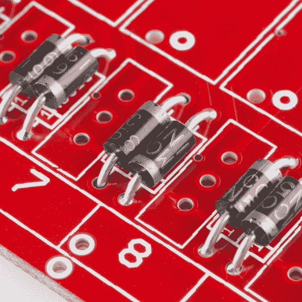](https://cdn.sparkfun.com/assets/learn_tutorials/2/6/6/closeup-schottky-polarity.jpg)

将它们焊接进去，并修剪多余的引线。

安装好所有二极管后，您的 PCB 应该是这样的(单击放大图片):

[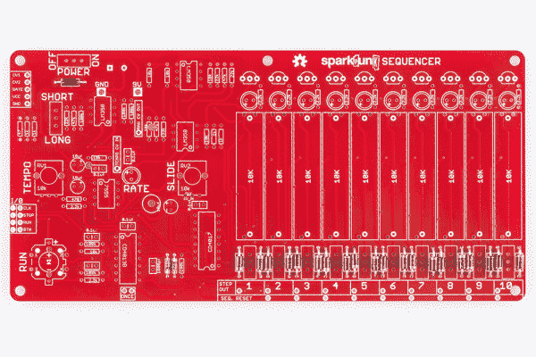](https://cdn.sparkfun.com/assets/learn_tutorials/2/6/6/waypt-diodes.jpg)

继续之前，请花点时间确认所有二极管上的条纹方向正确。当所有其他组件都已安装后，它们将更难修复。

* * *

### 起泡，冲洗，重复

我们在这里建立的模式(插入、焊接、修整)将对 PCB 上的每个其它元件重复。

## 电子组件 II -电阻器

电阻器没有极化-它们可以安装在任何方向。我们将按照电阻值增加的顺序安装电阻器。对于每个电阻值，我们将插入、焊接和修整多余的引线，就像您处理二极管一样。

这块板上有相当多的电阻。我们将在下面的步骤中安装它们。为了保持流程的有序性，我们将从最低值开始，逐步增加到最高值。电阻值由电阻器本体上的彩色条纹表示。颜色代码在下面的照片标题中注明，但如果你想更全面地了解代码是如何工作的，你可以在我们的[电阻标记教程](https://learn.sparkfun.com/tutorials/resistors/decoding-resistor-markings)中找到。你也可以使用[万用表](https://learn.sparkfun.com/tutorials/how-to-use-a-multimeter/measuring-resistance)来验证电阻值。

PCB 上的电阻位置用每个电阻轮廓内的丝印数字标记。一旦你破译了标记，你可以找到写在板上的相应值，并在那里安装电阻器。这听起来可能令人生畏，但是我们已经得到了有用的图片，在下面的步骤中突出显示了每个值。

* * *

### 47 &ohm;

电阻值最低的电阻是 47 &ohm;电阻。它位于 PCB 的左边缘附近，如下所示:

[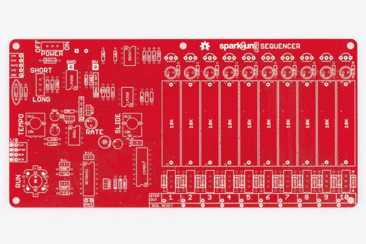](https://cdn.sparkfun.com/assets/learn_tutorials/2/6/6/47-circled.jpg)*47 &ohm; Resistor (_Yellow - Violet - Black - Gold*)_

* * *

### 470 &ohm;

下一个电阻是 470 &ohm;。它位于左侧，靠近板的中心，如下所示:

*470 &ohm; Resistor (_Yellow - Violet - Brown - Gold*)_

* * *

### 2.2K &ohm;

板上有一堆 2.2K 电阻，准确地说是 12 个。两个在左手边，另外十个在棋盘的右上角，下面突出显示:

[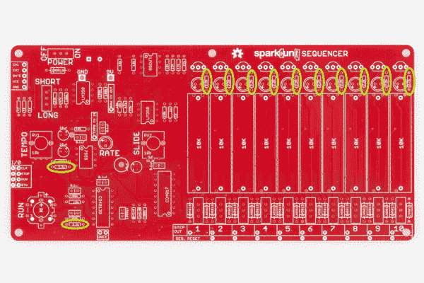](https://cdn.sparkfun.com/assets/learn_tutorials/2/6/6/2.2k-circled.jpg)*2.2K &ohm; Resistors (_Red - Red - Red - Gold*)_

* * *

### 1K &ohm;

有四个 1K &ohm;电阻。其中两个成对放置在靠近左边缘的位置，另外两个成对放置在靠近棋盘中心的位置。在这张照片里它们都被圈起来了:

[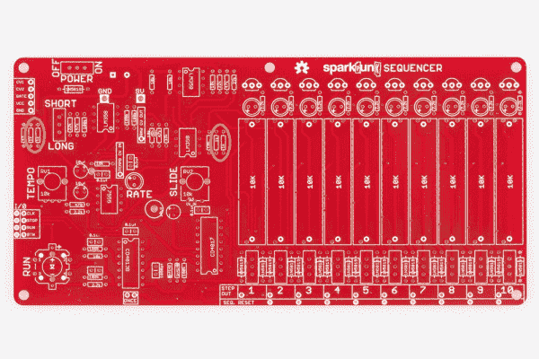](https://cdn.sparkfun.com/assets/learn_tutorials/2/6/6/1k-circled.jpg)*1K &ohm; Resistors (_Brown - Black - Red - Gold*)_

* * *

### 10K &ohm;

有七个 10K &ohm;电阻，分布在电路板的左侧。

[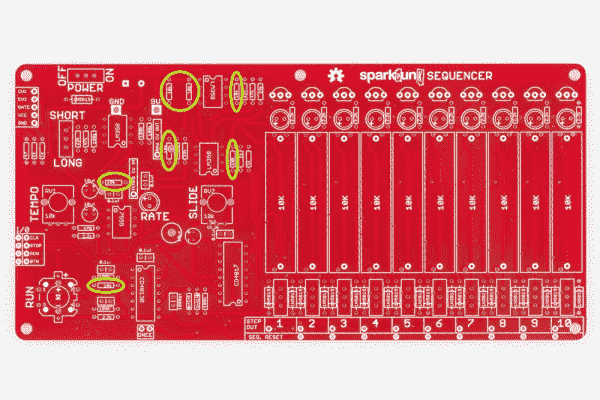](https://cdn.sparkfun.com/assets/learn_tutorials/2/6/6/10k-circled.jpg)*10K &ohm; Resistors (_Brown - Black - Orange - Gold*)_

* * *

### 22K &ohm;

有三个 22K &ohm;电阻，两个靠近顶部中心，一个朝向左上角。

[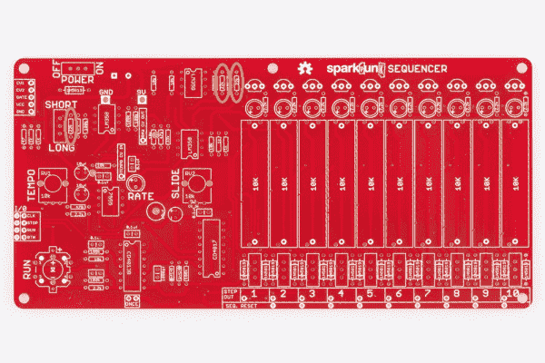](https://cdn.sparkfun.com/assets/learn_tutorials/2/6/6/22k-circled.jpg)*22K &ohm; _(Red - Red - Orange - Gold*)_

* * *

### 33K &ohm;

单个 33K &ohm;电阻器位于此处:

[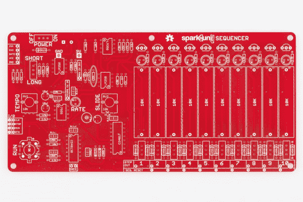](https://cdn.sparkfun.com/assets/learn_tutorials/2/6/6/33k-circled.jpg)*33K &ohm; 1/4W Resistor (_Orange - Orange - Orange - Gold*)_

* * *

### 47K &ohm;

三个 47k &ohm;电阻分布在电路板的左上方，如下图所示。

[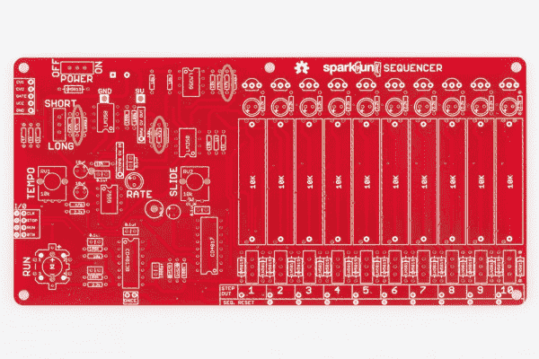](https://cdn.sparkfun.com/assets/learn_tutorials/2/6/6/47k-circled.jpg)*47K &ohm; Resistors (_Yellow - Violet - Orange - Gold*)_

* * *

### 100K &ohm;

最后，我们到达 100K &ohm;电阻。共有六个，分布在 PCB 的左侧。

[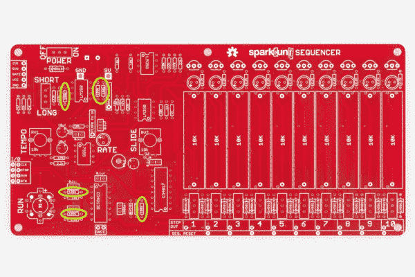](https://cdn.sparkfun.com/assets/learn_tutorials/2/6/6/100k-circled.jpg)*100K Ohm 1/4W Resistors (_Brown - Black - Yellow - Gold*)_

* * *

此时，所有的二极管和电阻都已安装完毕。您的主板应该是这样的(同样，单击图片查看更高分辨率的版本):

[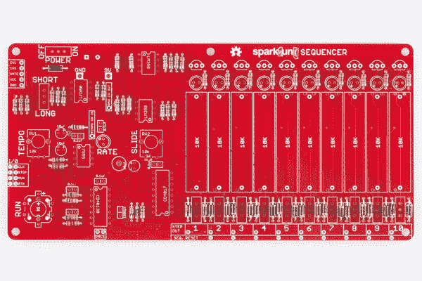](https://cdn.sparkfun.com/assets/learn_tutorials/2/6/6/waypt-resistors.jpg)

花点时间看看你的工作区域，寻找你可能忽略的松动的电阻或二极管。所有的电阻和二极管都应该安装在 PCB 上

## 电子装配 III -电容器

### 电容器

完成电阻后，我们将继续讨论电容(简称“电容”)。最短的电容是陶瓷电容，这个套件中的电容是橙色/黄色的小斑点，每个都有两根引线。

*Electrolytic capacitors (top), ceramic capacitors (bottom).*

像电阻器一样，陶瓷帽没有极化，可以面向任何方向安装。

* * *

### 0.1 F 陶瓷电容

有六个 0.1 F 的瓶盖。盖子本身标有 *104* 。这些数值印在瓶盖的侧面，但是字体非常小，在某些情况下，小到几乎看不见。放大镜会有帮助。小心这些盖子，因为还有一个 1nF 的盖子。它几乎和 0.1 F 的瓶盖一样大，但是标有 *102* 。

0.1 F 电容的位置应如下所示:

[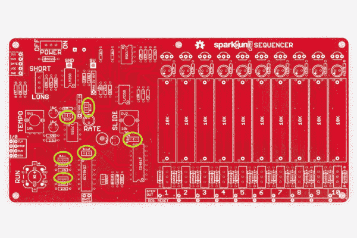](https://cdn.sparkfun.com/assets/learn_tutorials/2/6/6/100nf-circled.jpg)*0.1 µF Ceramic Caps*

*您会注意到左下角的电容缺少丝网印刷上的数值标记——它实际上是一个 0.1 μF 电容。*

这些瓶盖的安装过程与我们已经安装的组件相似。插入，焊接，然后修整。

* * *

### 1nF 陶瓷电容器

有一个 1nF(有时也称为 1000 pF)电容。标记为 *102* ，位置如下:

[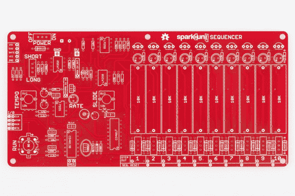](https://cdn.sparkfun.com/assets/learn_tutorials/2/6/6/1nf-circled.jpg)*1nF Ceramic Cap*

* * *

### 电解电容

电解电容器是看起来像小汽水罐的小圆柱体。它们被极化，有一个正极和一个负极。正极引线通常比负极引线长，负极引线通常由电容器本身上的一条条纹来标记。PCB 上的焊盘标有“+”和“-”符号。确保将机身上的“-”与 PCB 上的“-”对齐。

[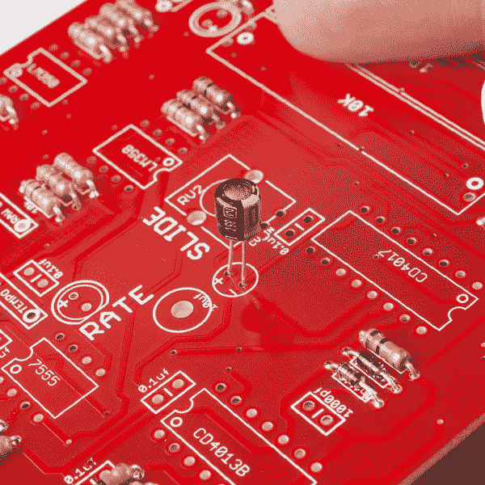](https://cdn.sparkfun.com/assets/learn_tutorials/2/6/6/closeup-lytic-polarity.jpg)*Electrolytic Capacitor Orientation*

电路板上有三个 10 F 电容，位于以下位置

[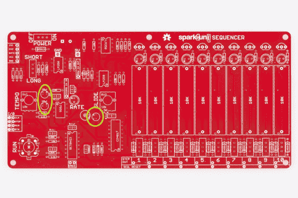](https://cdn.sparkfun.com/assets/learn_tutorials/2/6/6/10uf-circled.jpg)*10µf, 25V Electrolytic caps*

* * *

### 检查你的进度

至此，所有较小的无源电子元件都已安装完毕。您的板应该看起来像这样:

[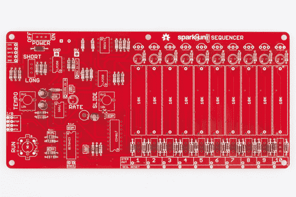](https://cdn.sparkfun.com/assets/learn_tutorials/2/6/6/waypt-caps.jpg)

### 怪人出局

还有一个电容，即 1000 μF 大电解电容。它被安装在电路板的背面，但我们将暂时搁置，因为将它安装在背面会使电路板变得相当笨重。我们将在[机电](https://learn.sparkfun.com/tutorials/sparkpunk-sequencer-hookup-guide/assembly-v---electromechanical)部分再次讨论。

## 电子装配 IV -集成电路和半导体

### 互联网连接共享（Internet Connection Sharing 的缩写）

该 PCB 上的芯片或集成电路(IC)全部采用通孔[双列直插式封装(DIP)](https://learn.sparkfun.com/tutorials/integrated-circuits#ic-packages) 。IC 是极化的，需要以正确的方向安装。

IC 的极性在 IC 的主体上标明，通常在一端有一个凹口，虽然有时在一角有一个小凹窝。这些指示与 PCB 上的丝印标记对齐，这些标记是矩形，一端切出一个小半月形，附近有一个点。将 IC 上的凹槽与丝网印刷中的半月形对齐，如下图所示。

[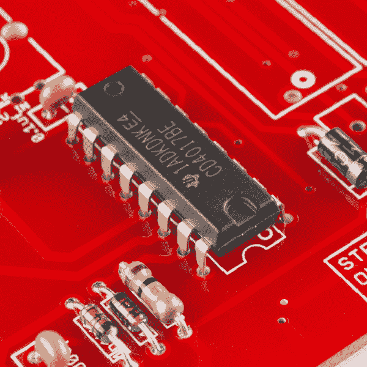](https://cdn.sparkfun.com/assets/learn_tutorials/2/6/6/closeup-ic-polarity.jpg)*Align The Notch On The Chip With The notch In The Silkscreen*

将 IC 插入电路板应该相当简单。有时，集成电路中的腿会弯曲，这样它们就不合适了。如果是这样，小心地拉直它们以匹配孔。

为了焊接 IC，它可以帮助快速焊接对角上的引脚，这有助于在焊接剩余引脚时将芯片固定到位。注意不要使芯片过热，也不要在相邻的引脚之间产生焊接桥。它有助于在两排腿之间来回曲折地运动。

* * *

#### Seven thousand five hundred and fifty-five

第一个芯片是 7555 定时器。套件中有几个大小相似的芯片，所以要注意阅读 IC 上的标记。

7555 位于此处:

[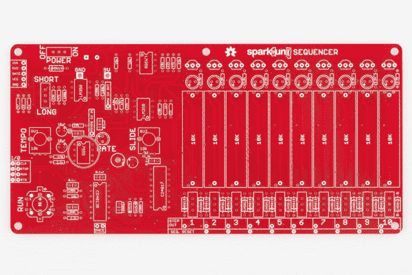](https://cdn.sparkfun.com/assets/learn_tutorials/2/6/6/7555-circled.jpg)*7555 IC Location*

* * *

#### CD4013BE

既然我们已经用一个小 IC 热身，我们将继续讨论更大的 IC。

找到 CD4013BE 双触发器，并安装在此处:

[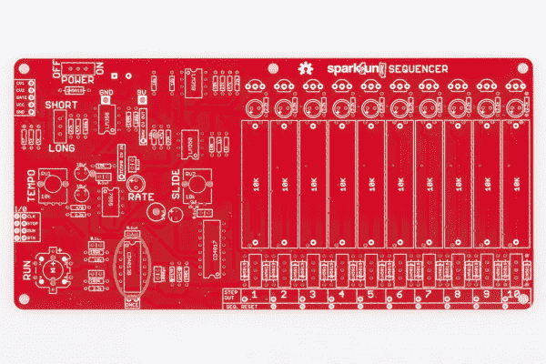](https://cdn.sparkfun.com/assets/learn_tutorials/2/6/6/cd4013-circled.jpg)*CD4013BE IC Location*

* * *

#### CD4017BE

接下来是 CD4017BE 十进制计数器。

[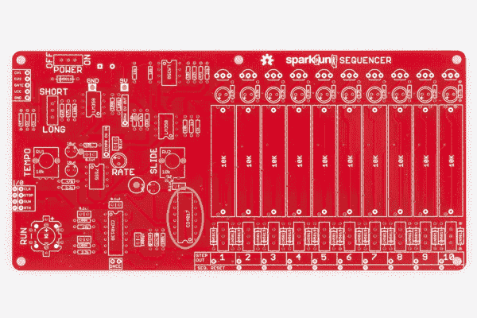](https://cdn.sparkfun.com/assets/learn_tutorials/2/6/6/cd4017-circled.jpg)*CD4017BE IC Location*

* * *

#### LM358

三个 LM358 双通道运算放大器是 IC 的补充。它们位于电路板的左上角，如下所示:

[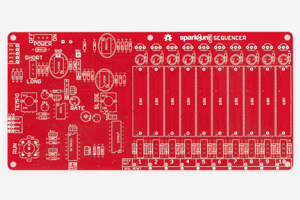](https://cdn.sparkfun.com/assets/learn_tutorials/2/6/6/LM358-circled.jpg)*LM358 IC Location*

* * *

### 半导体

集成电路出问题后，我们将转向其他半导体。

#### 晶体管

有十个晶体管，都是 2n3904 的。它们每个都有三条腿，一个圆柱体，一边有一个平面。

晶体管安装在电路板的右上边缘。

*Transistor Location*

通过将本体的平面与丝印标记的平面对齐来对齐晶体管。你可能需要把引线分开一点，这样它们就能放入电路板。

* * *

#### 发光二极管

十一个发光二极管的位置如下:

[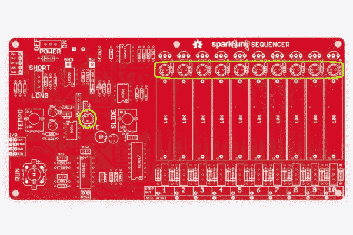](https://cdn.sparkfun.com/assets/learn_tutorials/2/6/6/LED-circled.jpg)*LED Location*

发光二极管也是偏振的。极性在每个 LED 上以两种方式显示——正极引线(*阳极*)比负极引线(*阴极*)长。在 LED 的底部也有一个小的平面点来表示负极引线。这两者都显示在 PCB 丝网印刷中。正如您在下面看到的，较长的引线穿过标记为+的孔，这使得扁平侧与丝网印刷中的扁平边缘对齐。

[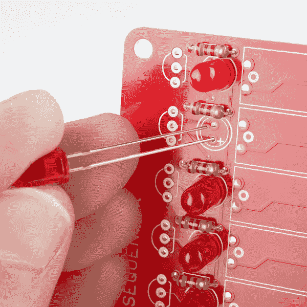](https://cdn.sparkfun.com/assets/learn_tutorials/2/6/6/closeup-LED.jpg)

* * *

### 差不多完成了

火花朋克音序器即将完成。只需要再安装几个组件。

在继续之前，对照下面的照片检查你的工作。

[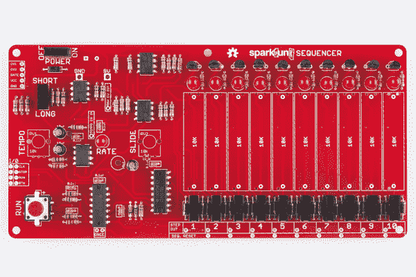](https://cdn.sparkfun.com/assets/learn_tutorials/2/6/6/waypt-semis.jpg)

## 装配 V -机电

### 控制

#### 触觉开关

第一个控件是触觉开关，它位于 PCB 的左下角。

[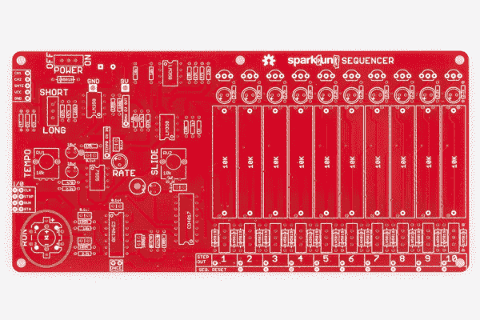](https://cdn.sparkfun.com/assets/learn_tutorials/2/6/6/button-circled.jpg)*Tact Switch Location*

与普通的轻触开关不同，这个开关里面有一个 LED，这样它就可以在音序器播放时亮起。因此，开关是极化的。其中一个白色塑料标签上有一个小的“+”号。这与板上的“+”相匹配，如下图所示。

[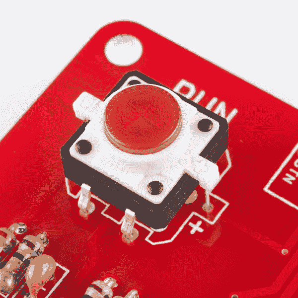](https://cdn.sparkfun.com/assets/learn_tutorials/2/6/6/closeup-tact-switch.jpg)*Tact Switch Polarity*

轻触开关的支脚已经成型，因此在焊接时可以锁定到位，但要将这些支脚插入 PCB 孔中可能需要额外的努力。轻轻施加压力，直到它们卡入到位，并且开关主体正好位于 PCB 上。然后将其焊接到位。

* * *

#### 滑动开关

SparkPunk 音序器上有 12 个小型单刀双掷(SPDT)滑动开关。前两个在左上角附近，另外十个排列在棋盘的右下角。

[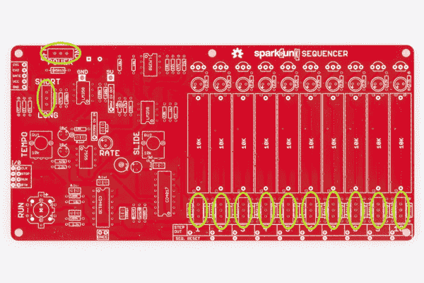](https://cdn.sparkfun.com/assets/learn_tutorials/2/6/6/SPDT-circled.jpg)*Slide Switch Location*

* * *

#### 滑动花盆

十个滑动电位计是电路板上最大的元件。它们位于 PCB 右侧的一排。

[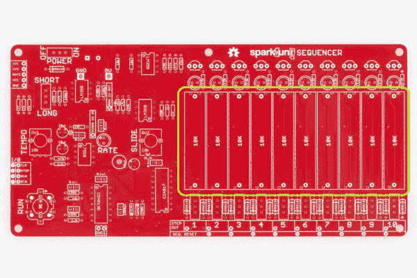](https://cdn.sparkfun.com/assets/learn_tutorials/2/6/6/slide-circled.jpg)*Slide Pot Location*

如果仔细观察，它们只能以一种方式安装在电路板上——一端有一个触点，而另一端有两个触点，这与 PCB 上的孔模式相匹配。

因为它们太大，焊接时很难保持对齐。当你工作的时候，一块可移动的胶带可以帮助你把它们固定住。我们手边有蓝色画家的带子，所以我们用了它。

用胶带将单个滑块固定到位，然后将其焊接。您可以在整个电路板上工作，用胶带将每个滑块粘住，然后依次焊接。

* * *

#### 锅

旋转电位计是最高的元件，因此它们标志着电路板顶部元件的末端。

它们没有被极化，但是它们只能以一种方式放在板上。

让他们进入董事会需要一些小心。如果导线或接线片在运输过程中弯曲，则需要将其拉直以适应 PCB。要插入花盆，首先将较小的电腿排成一行，然后将两个大的插片推入孔中。标签是一个紧密的配合-轻轻地从一边到另一边摇动罐子会有帮助。正确插入后，罐子背面的接线柱将与 PCB 顶部齐平。

当你焊接它们时，首先焊接大的突片以保持稳定，注意罐子要平放在电路板上。然后焊接其他连接。

PCB 上有两个旋转盆，都是 10K 线性锥形(背面标有“M-B-10K”)。它们如下所示:

[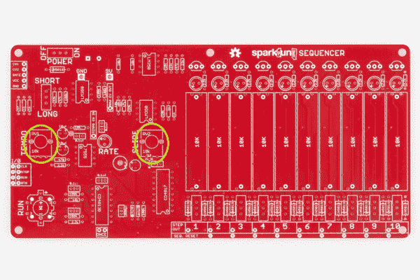](https://cdn.sparkfun.com/assets/learn_tutorials/2/6/6/rotary-circled.jpg)

* * *

### 顶部完井

我们已经到了最后阶段，但是在我们继续讨论电源组件之前，让我们检查一下到目前为止我们已经讨论过的所有部分是否都在正确的位置。花几分钟时间将您的板与下面的照片进行比较。检查没有遗漏任何元件，并且所有极化元件(二极管、ic、led 和电解电容)都朝向正确的方向。

[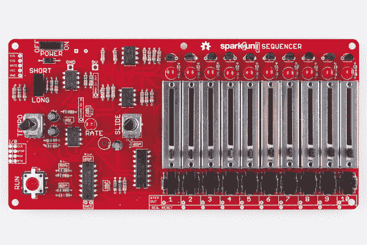](https://cdn.sparkfun.com/assets/learn_tutorials/2/6/6/waypt-end.jpg)

在这一点上进行检查的原因是，我们要将元件安装到电路板的背面，这将使您很难对任何可能遗漏的内容进行返工。

* * *

### 力量

#### 电池箱

电池盒安装在 PCB 的背面。它有两个穿过电路板的触点。

[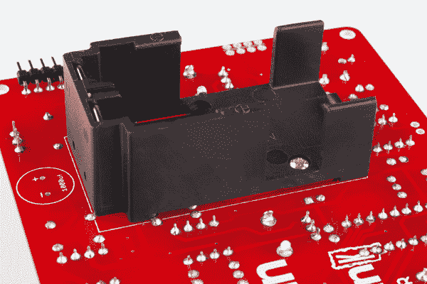](https://cdn.sparkfun.com/assets/learn_tutorials/2/6/6/closeup-battbox.jpg)*Battery Box Location*

它用一个小螺母和螺栓固定。螺栓应该从电池盒内部插入，并用电路板正面的螺母固定。

[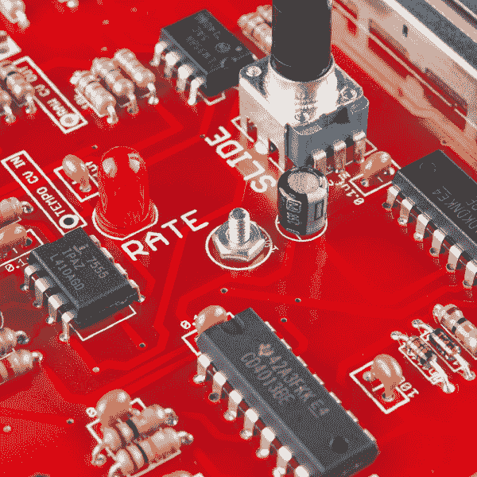](https://cdn.sparkfun.com/assets/learn_tutorials/2/6/6/closeup-batt-nut.jpg)*Nut and Bolt Detail*

拧紧螺栓，然后将两根引线焊接到 PCB 的前面。

* * *

#### 1000μF 电容

现在该是我们前几节跳过的电容了。它也在 PCB 的背面。与较小的电解装置一样，它也是极化的，需要正确定位，方法是将机身上“-”符号附近的引线与标有“-”的 PCB 焊盘匹配，如下所示:

[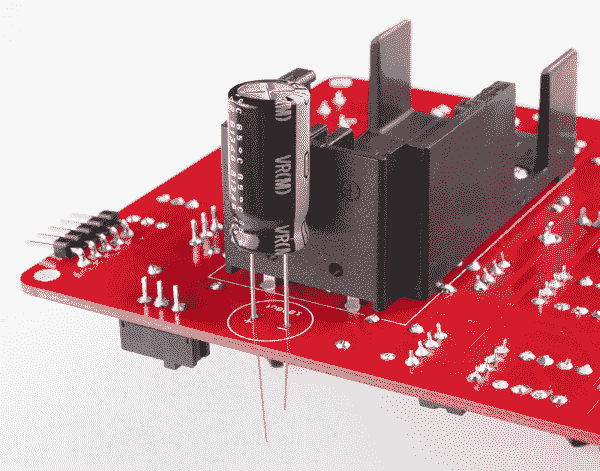](https://cdn.sparkfun.com/assets/learn_tutorials/2/6/6/closeup-big-cap.jpg)*1000µF Capacitor Orientation*

与电池盒一样，1000 F 电容焊接在电路板的正面。

* * *

### 连接器

最后一组组件是连接器，一对 5 针直角接头，一个公接头和一个母接头。这是连接音序器和火花朋克声音发生器的连接。它需要正确对齐，以便两者可以轻松地插接在一起。

为了使连接器正确对齐，我们将使用一个连接器作为夹具来固定另一个连接器。面对面地将连接器插在一起。然后将连接器放在序列器的背面，并用胶带固定到位，如下所示。正如你所看到的，连接器的公端在音序器上，母端留给声音发生器。

[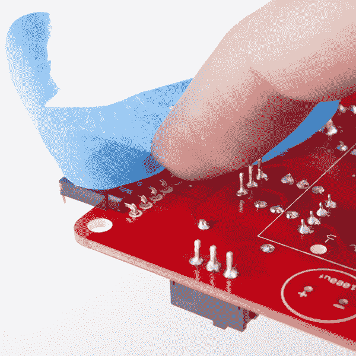](https://cdn.sparkfun.com/assets/learn_tutorials/2/6/6/closeup-connector.jpg)

将连接器焊接到 PCB 的顶部。

然后拆下连接器的母侧，将其焊接到发声器上。与序列器一样，它位于 PCB 的背面，焊接到正面。焊接时，你可以用胶带把它固定住。

[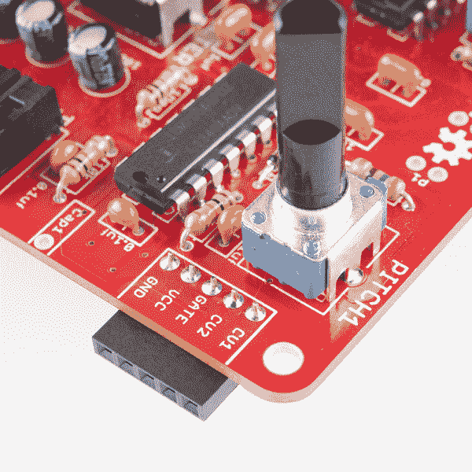](https://cdn.sparkfun.com/assets/learn_tutorials/2/6/6/closeup-sp-conn.jpg)*5-pin connector on the Sound Generator*

* * *

## 检查你的工作

这标志着该套件焊接部分的结束。你可以对照下面的图片来验证你的进步。

[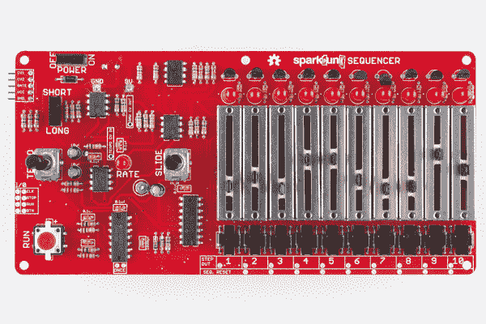](https://cdn.sparkfun.com/assets/learn_tutorials/2/6/6/waypt-final.jpg)

唯一剩下的组件应该是 9V 电池。

如果一切检查完毕，我们现在就可以开始测试序列器了。

## 测试/故障排除

我们将在几个渐进的阶段中测试序列器。

你会注意到，随着电路板的组装，丝网印刷中的许多文本和图例被元件掩盖了。剩下的文字解释了附近控件的功能。我们将使用文本框`like this`中的文本来表示这些标签。

### 单独的序列器

我们将从测试序列器本身开始。

第一个测试是烟雾测试。将电池安装在电池盒中。盒子上有一个小的“+”和“-”浮雕，将与电池上相应的标记相匹配。电池应滑入支架，并通过后端的凸耳固定到位。如果它不太合适，确保你已经把它对齐了。

打开电源开关。第一个滑块上方的第一步 LED 应稳定亮起(不闪烁)。

感受一下集成电路——它们摸起来都不应该是热的。

按下`RUN`按钮。按钮应该亮起，`RATE` led 应该开始闪烁，并且步进 led 应该开始从左向右追踪。

转动`TEMPO`锅。它应该改变追逐和闪烁的速度-逆时针时较慢，顺时针时较快。

再次按下`RUN`开关，停止播放。按钮 LED 应该熄灭，追逐和闪烁应该停止。第一步上方的 LED 应再次稳定亮起。

如果你手边有一个电压表，你可以用它来测试输出端口。设置电表以测量 1 到 10 伏范围内的伏特 DC。将黑色引线放在`GND`销上，红色引线放在`CV1`销上。当音序器停止时，在第一步调整滑块。您应该看到电压在其行程底部的大约 7.5 V 和顶部的 0.7V 之间变化。

[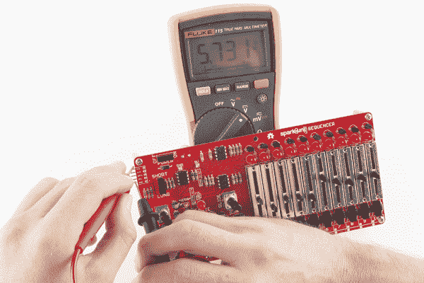](https://cdn.sparkfun.com/assets/learn_tutorials/2/6/6/testing-meter.jpg)

如果这些测试中有任何一项失败，请查看下面的[故障排除建议](#Troubleshooting)。

* * *

### 集成系统测试

一旦上面的基本测试表明音序器可以独立工作，我们就可以结合声音发生器来测试它了。

首先让我们连接一切:

*   通过连接 5 针接头将声音发生器插入音序器。
*   在音序器里放一个 9V 的电池——它将为声音发生器提供能量。
*   将扬声器或耳机插入声音发生器。

打开序列器。它应该像以前一样通电。

按下`TRIGGER`按钮，确认声音发生器设置为发出可听见的声音。按钮应该会亮起，并且您应该能够听到声音。如果它是无声的，重新访问 [SparkPunk 连接指南](https://learn.sparkfun.com/tutorials/sparkpunk-hookup-guide/testing)的测试部分。

接下来，按如下方式设置序列器控件:

*   打开电路板右下边缘`1`至`10`标签附近的所有十个步进开关。
*   将所有滑块拉到其行程的底部。
*   将`LONG/SHORT`开关设置到`LONG`。
*   逆时针完全转动`TEMPO`控制器。

按播放。步进发光二极管应该跟踪，`RATE`发光二极管应该闪烁。您应该会听到连续的声音。

播放时，将`LONG/SHORT`开关设置为`SHORT`。连续的声音现在应该被分解成与`RATE` LED 的照明相对应的更短的脉冲。将`TEMPO`控制杆完全逆时针旋转，脉冲应该约为 1/4 秒长，每 1/2 秒重复一次。

当它继续播放时，将`SLIDE`控制键转到底，并开始调整滑块。您应该能够听到滑块对音高的影响。当步进 LED 指示步进时，该步进的滑块控制声音发生器的音高。最终，您会希望滑块在向上和向下之间交替，如下所示。

[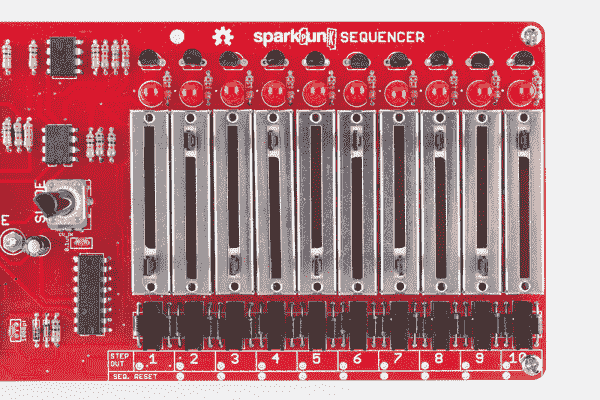](https://cdn.sparkfun.com/assets/learn_tutorials/2/6/6/testing-sliders.jpg)

将`LONG/SHORT`开关转回`LONG`，并尝试调整滑动时间。你应该能听到音符从一个音高滑向另一个音高。

接下来，一个接一个地关闭步进开关，倾听音频输出中打开的无声空洞。

最后，按`RUN`停止播放。

我们将在下一节更详细地描述这些控件到底在做什么。

* * *

### 解决纷争

首先要检查的是两个单元的控制设置——如果它们被设置为静音，你将什么也听不到！您可以通过按下`TRIGGER`按钮来检查声音发生器部分是否工作。如果音序器播放，但您听不到任何声音，请检查音量控制、声音发生器波形开关和音序器步进触发器开关。

如果上述测试仍有问题，您可以按照以下清单开始排除故障。

*   所有的焊料连接都应该有整齐的焊脚，即平滑地将元件引线连接到 PCB 的小圆锥或圆顶焊料。
*   验证电池方向和新鲜度。
*   检查所有极化部件是否安装正确。其中包括:
    *   电解电容器
    *   二极管
    *   ICs
    *   电池
*   验证音量是否已调高
*   验证输出已连接

如果事情仍然不工作，尝试联系 Sparkfun 的友好的[技术支持](https://www.sparkfun.com/static/contact)团队。

## 使用

我们在测试时浏览了音序器的基本功能——您可能已经对控件的功能有了很好的了解。但是如果你想更详细地理解它，那么继续读下去。

### 控制器

下图显示了序列器上的控件。

[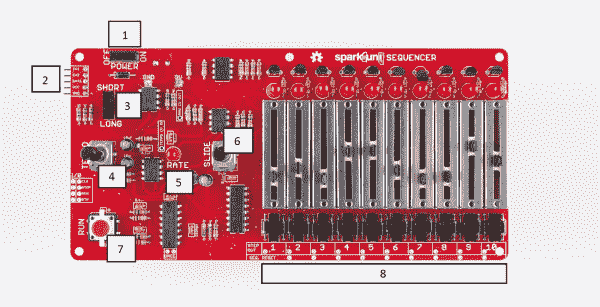](https://cdn.sparkfun.com/assets/learn_tutorials/2/6/6/product-callouts-2.jpg)

1.  **电源开关** -打开和关闭序列发生器。
2.  **发声器接口连接器** -连接到[火花朋克发声器](https://www.sparkfun.com/products/11177)的 5 针接头。它向连接的 SparkPunk 提供电源、音调和触发信号。
3.  **长/短开关** -决定音序器触发的音符长度。`LONG`音符代表整个音程，而`SHORT`音符代表半个音程。我们将在下面的[中更详细地说明这一点。](#shortvslong)
4.  **速度旋钮** -控制时钟，决定音序器从一个步骤前进到另一个步骤的速度。
5.  **速率 LED** -闪烁显示时钟速率。
6.  **滑动旋钮** -控制音序器从一个音符滑动到另一个音符所需的时间。更详细的描述见下面的[图。](#slide)
7.  **运行开关** -启动时钟，从而使序列在步骤之间前进。它还包含一个在序列器运行时亮起的 LED。
8.  ** 10 个步骤** -每个步骤都有几个控件。
    *   **步骤指示灯 LED** -表示序列中的活动步骤。
    *   **俯仰滑块** -俯仰控制电压由激活步骤上的滑块设置决定。
    *   **触发开关** -当该开关打开时，该步骤的音符会响起，长度由`SHORT/LONG`开关决定。如果触发器关闭，序列的这一步将是无声的。

像这样的模拟音序器旨在成为一种动手操作的交互式音乐工具。拥有物理控件使得尝试作曲想法变得简单而有趣。

### 声音发生器接口

音序器的核心是 Sparkpunk 声音发生器的接口。声音发生器被设计成可以简单地插入音序器。

当连接到音序器时，声音发生器上的所有控制仍然起作用。旋钮和开关控制声音参数，触发开关触发声音。同时，音序器使用两个信号控制声音发生器，音高控制电压和门。当序列播放时，电路一次选择一列控制，对应于控制设置的模拟电压被驱动到输出端口。

#### 俯仰控制电压

音序器上的滑块控制声音发生器的音高。下图说明了滑块位置如何转换为控制电压输出:

[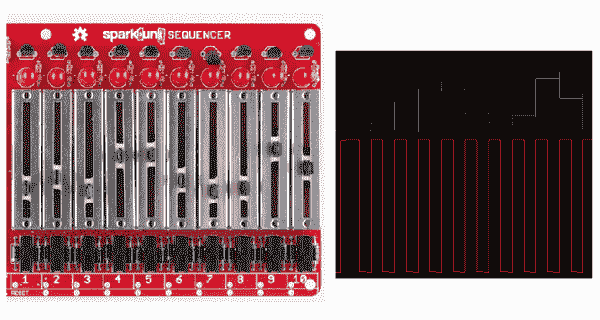](https://cdn.sparkfun.com/assets/learn_tutorials/2/6/6/sim-slide-to-cv.png)*Slider Settings translated to Control Voltage*

通过将滑块位置与绿色轨迹进行比较，您可以看到它们是如何转换为电压的。当时钟上出现上升沿(红色信号)时，将依次选择每个滑块。

#### 幻灯片

您会注意到，当接收到时钟脉冲时，上面的控制电压变化非常快——上升和下降段几乎是垂直的，结果看起来像一系列矩形。通过调高`SLIDE`控制，我们可以减缓这些过渡，使边缘变圆，正如你在这里看到的:

[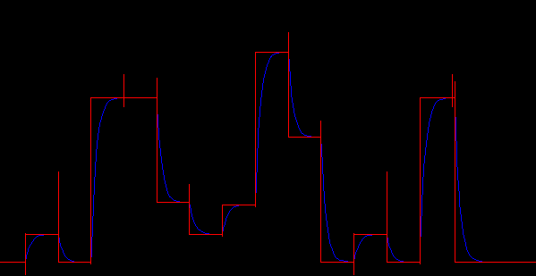](https://cdn.sparkfun.com/assets/learn_tutorials/2/6/6/sim-slide-control.png)*Control Voltage With Slide*

红色曲线是我们上面看到的相同的控制电压模式，蓝色是打开`SLIDE`控制的结果。您添加的幻灯片越多，从一个音高过渡到下一个音高所需的时间就越长。这样做的结果是一种被称为*滑音*或*滑音*的音乐效果，通常被长号或滑动吉他等乐器使用。

在`LONG`设置中滑动通常比`SHORT`更容易听到。要了解原因，让我们来看看门信号。

#### 大门

在电子学术语中，“门”或“选通函数”是与另一个信号的存在相对应的 DC 信号。它可以作为电路的输出产生(例如来自[声音检测器](https://www.sparkfun.com/products/12642)的门输出)，或者作为电路的输入产生。在电子音乐中，门信号控制音调发生器是否运行。

序列器每一步上的开关允许您在该步激活时控制门信号。当开关关闭时，门信号不被驱动，发声器将静音。然而，当门开关打开时，有两种可能的结果，由`SHORT/LONG`开关决定。

[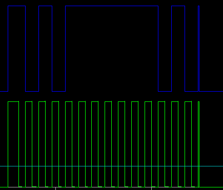](https://cdn.sparkfun.com/assets/learn_tutorials/2/6/6/sim-long-gate.png)*Long Gates*

当开关设置为`LONG`且步进开关打开时，步进门持续整个步进。在上图中，底部的时钟是绿色的，顶部的门是蓝色的。如果相邻的步骤是开的，门是连续的-一个*连音*发音，如门信号中的长平稳段所示。

[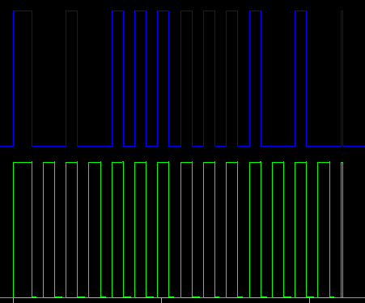](https://cdn.sparkfun.com/assets/learn_tutorials/2/6/6/sim-short-gate.png)*Short Gates*

相比之下，短门只有半步长。即使相邻的步骤是开着的，它们之间也会有半个钟的静默时间。在上图中，步进开关的设置与上例相同，但长度开关设置为`SHORT`。漫长的高原已被切割成许多小块。

#### 权力分享

最后一个值得注意的事项:音序器和声音发生器都有电池座和电源开关。这些单元有一条公共电源总线，允许任一设备向另一设备供电。只需要安装一个电池，带有电池的单元上的电源开关将打开和关闭电池对。如果两个电池都存在，总线使用二极管保护来防止电池相互充电。

### 潜得更深

至此，我们已经讲述了 SparkPunk 音序器的组装，以及声音发生器的基本用法。像声音发生器一样，音序器也是可以调整、修改和定制的。其中一个修改既简单又非常有用。

许多西方音乐围绕 4、6 或 8 的节奏组构建，因此构建者可能会发现 10 步序列长度很难使用。因此，我们将介绍一个快速修改，它允许您将序列缩短到更少的步骤。

横跨 PCB 右下边缘的是成对的焊盘——只需桥接成对的焊盘，当到达该步骤时，序列就会复位。

[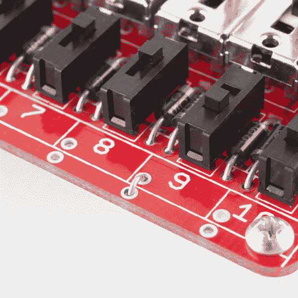](https://cdn.sparkfun.com/assets/learn_tutorials/2/6/6/mod-last-step.jpg)*Constraining the sequence to 8 steps*

您将桥接超出最后一步的焊盘-如上所示，第九步上的连线将序列缩短为 8 步。如果不想永久连接，可以安装[卡扣式接头](https://www.sparkfun.com/products/116)，然后使用[跳线分流器](https://www.sparkfun.com/products/9044)使序列长度可调。

## 资源和更进一步

### 资源

*   音序器用于控制[火花朋克声音发生器](https://www.sparkfun.com/products/11177)。如果你需要链接，这里有 [SparkPunk 声音发生器连接指南](https://learn.sparkfun.com/tutorials/sparkpunk-hookup-guide)
*   火花朋克的设计文件可以在 GitHub 上找到
*   GitHub 文件包括在 [LTSpice](http://www.linear.com/designtools/software/#LTspice) 中运行的 Spice 模拟
*   [SFE 产品展示区](https://www.youtube.com/watch?v=LUcqDM4k1gU)

有关 SparkPunk 音序器如何工作、修改和其他应用的更多信息，请查看[理论和应用指南](learn.sparkfun.com/tutorials/sparkpunk-sequencer-theory-and-applications-guide)

 [### 火花朋克音序器理论和应用指南

#### 2014 年 8 月 14 日](https://learn.sparkfun.com/tutorials/sparkpunk-sequencer-theory-and-applications-guide) Examine the inner workings of the SparkPunk Sequencer, then explore some modifications and alternate applications.[Favorited Favorite](# "Add to favorites") 3

如果您对 SparkPunk 音序器的补充部分感兴趣，请看看这些:

*   [红色炉灶旋钮](https://www.sparkfun.com/products/9997)
*   [黑色炉灶旋钮](https://www.sparkfun.com/products/9998)
*   [红色鸡头旋钮](https://www.sparkfun.com/products/9999)
*   [黑色鸡头旋钮](https://www.sparkfun.com/products/10000)
*   [小 GTE 旋钮](https://www.sparkfun.com/products/11951)
*   [中 GTE 旋钮](https://www.sparkfun.com/products/11950)
*   [大型 GTE 旋钮](https://www.sparkfun.com/products/11949)
*   [支座](https://www.sparkfun.com/products/10738)和 [4-40 螺栓](https://www.sparkfun.com/products/10453)

### 更进一步

*   雷蒙德·斯科特被公认为是步序器的发明者，他称之为“循环机”。你可以在这些视频中听到一些例子，并在[的网站上了解更多关于这个人和他的音乐。](http://raymondscott.com/#news)
*   我们也有一个类似的数字设备的教程，Auduino 步序器。
*   尼克·科林斯的《手工电子音乐》是一本很好的音乐电路入门书，里面有许多你可以从头开始构建的试验板项目。