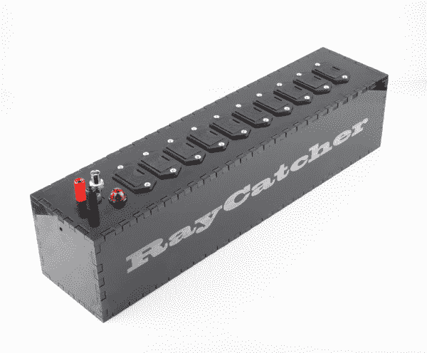

# 黑客常驻-宇宙射线探测器

> 原文：<https://learn.sparkfun.com/tutorials/hackers-in-residence---cosmic-ray-detector->

## 晒晒太阳

该项目旨在制造一种廉价的宇宙射线探测器，能够感应能量大于 1 GeV 的射线。这些既可以作为时间同步解决方案的一部分，也可以作为大型分布式宇宙射线望远镜的一部分。

*The RayCatcher*

***警告！***

***本项目涉及高压。确保使用适当的预防措施。当所有电池连接时，不要切断任何电线；如果使用标准电池夹，请戴上丁腈手套取出并更换电池。*** 本项目中使用的抽屉式电池盒不需要使用手套。

### 所需材料