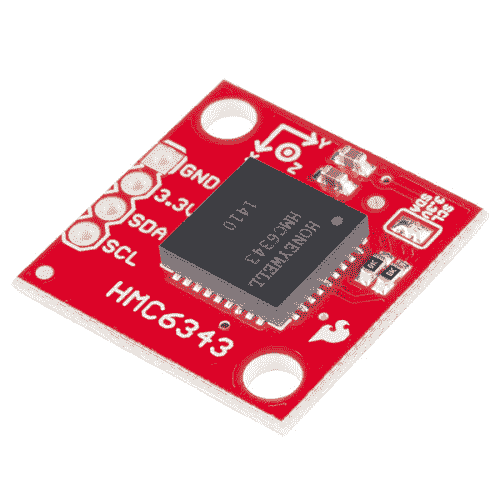
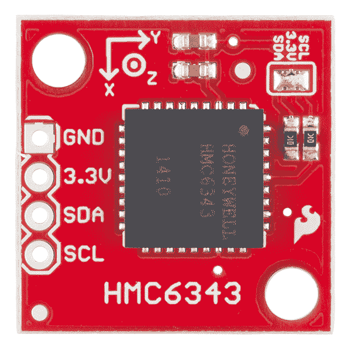

# HMC6343 三轴罗盘连接指南

> 原文：<https://learn.sparkfun.com/tutorials/hmc6343-3-axis-compass-hookup-guide>

## 介绍

HMC6343 是一款完全集成的高端数字罗盘模块，可以计算并向用户提供精确到几度以内的航向方向！它经过倾斜补偿和校准，可以处理磁性失真。该 IC 结合了 3 轴磁阻传感器和 3 轴 MEMS 加速度计、模拟和数字支持电路、微处理器和航向计算所需的固件算法。

[](https://www.sparkfun.com/products/12916) 

将**添加到您的[购物车](https://www.sparkfun.com/cart)中！**

 **### [斯帕克芬 HMC6343 突围](https://www.sparkfun.com/products/12916)

[Out of stock](https://learn.sparkfun.com/static/bubbles/ "out of stock") SEN-12916

HMC6343 是一款完全集成的高端电子罗盘模块，可以计算并为您提供航向方向…

$219.954[Favorited Favorite](# "Add to favorites") 20[Wish List](# "Add to wish list")** **[https://www.youtube.com/embed/7M0JsesGwmM?t=13/?autohide=1&border=0&wmode=opaque&enablejsapi=1](https://www.youtube.com/embed/7M0JsesGwmM?t=13/?autohide=1&border=0&wmode=opaque&enablejsapi=1)

分线板便于使用 HMC6343。所需要的只是电源(运行模式下为 3.3V @ 4.5mA)和与微控制器的 I2C 连接，以便模块可以接收命令并将数据发送回用户。

### 本教程涵盖的内容

在本教程中，我们将帮助您学习如何使用这个电子罗盘，以便您可以快速、轻松地将它们集成到您的项目中。以下是我们将要介绍的内容:

*   [硬件概述](https://learn.sparkfun.com/tutorials/hmc6343-3-axis-compass-hookup-guide/hardware-overview)-HMC 6343 分线板概述以及关于 IC 的一些细节。
*   如何将指南针连接到无处不在的 Arduino，这样我们就可以开始编写代码来使用它。
*   [示例代码](https://learn.sparkfun.com/tutorials/hmc6343-3-axis-compass-hookup-guide/example-code) -我们已经编写了示例草图和一个库，演示了如何收集传感器数据以及如何理解这些数据。

### 所需材料

*   [HMC6343 分线板](https://www.sparkfun.com/products/12916)
*   [Arduino Uno](https://www.sparkfun.com/products/11021) 或任何 [Arduino 板](https://learn.sparkfun.com/tutorials/arduino-comparison-guide) -我们将使用 Uno 作为例子，但是你应该能够使用你手边的任何 Arduino 板，包括 [RedBoard](https://www.sparkfun.com/products/11575) 、 [Pro](https://www.sparkfun.com/products/10914) 、 [Mega](https://www.sparkfun.com/products/11061) 等。
*   [双向逻辑电平转换器](https://www.sparkfun.com/products/12009)

你可能还需要一个[试验板](https://www.sparkfun.com/products/12002)、[跳线](https://www.sparkfun.com/products/11026)和[直插头](https://www.sparkfun.com/products/116)来遵循示例设置，如果你还没有这些或其他方式将 Arduino 连接到分线板。

### 推荐阅读

在继续学习本教程之前，我们建议您先熟悉一下这些教程中的概念:

*   [安装 Arduino 库](https://learn.sparkfun.com/tutorials/installing-an-arduino-library)
*   [IC 间通信(I ² C)](https://learn.sparkfun.com/tutorials/i2c)
*   [逻辑电平](https://learn.sparkfun.com/tutorials/logic-levels)
*   [双向变速杆连接指南](https://learn.sparkfun.com/tutorials/bi-directional-logic-level-converter-hookup-guide)

## 硬件概述

HMC6343 的分线板为您提供了发送命令和从电子罗盘收集数据所需的所有引脚。

[](https://cdn.sparkfun.com/assets/learn_tutorials/2/6/5/hmc6343_top.jpg)

正如你所看到的，突破只有四个引脚打破。两个是电源，3.3V 和 GND。两个用于 I2C 通信，SCL(时钟)和 SDA(数据)。

### 电压供应要求

这里需要注意的是，HMC6343 的**输入电压范围为 2.7V-3.6V**——该范围适用于电源和 I2C 线。如果你使用像 [Arduino Uno](https://www.sparkfun.com/products/11021) 这样的 5V 微处理器，只要你用 3.3V 给电路板供电，并为 I2C 线使用[逻辑电平转换器](https://www.sparkfun.com/products/12009)，你就可以使用 5V 或 3.3V 微处理器。

幸运的是，你不需要很大的功率来使 HMC6343 工作。在正常工作模式下，IC 的典型功耗约为 4.5mA。在待机(1mA)或睡眠(10 A)模式下，功耗甚至更低。

### 额外硬件说明

HMC6343 可以每 200 毫秒(5Hz)测量和计算一次航向。能够容易地获得精确到几度的倾斜补偿航向方向，而无需您的微处理器在计算上花费大量时间，这是该 IC 的亮点。但是，如果需要，您可以读取原始磁力计和加速计值。

HMC6343 有两个安装孔，可以安全地连接到您的项目。如果你依赖它给你方向感，你当然不希望板子独立于你的系统移动/扭转。

此外，电路板顶部有一个跳线，默认情况下是闭合的，因此 I2C 线具有 10K &ohm;上拉电阻。如果您想为 I2C 上拉电阻使用不同的值，可以通过移除跳线上的焊料来断开这些默认电阻。

## 示例连接

### 焊接

在你将指南针分线板插入试验板并将其连接到任何东西之前，你需要将连接器或电线焊接到分线引脚上。你把什么焊接到电路板上取决于你如何使用它。

如果您打算在[试验板](https://learn.sparkfun.com/tutorials/how-to-use-a-breadboard)或类似的 0.1 英寸间距的 perfboard 中使用分线板，我们建议将[直插头](https://www.sparkfun.com/products/116)焊接到引脚中(如果您需要，还有[长插头](https://www.sparkfun.com/products/10158))。

如果你要将分线器安装到一个紧密的外壳中，你可能想要将电线([绞合](https://www.sparkfun.com/products/11375)或[实芯](https://www.sparkfun.com/products/11367))直接焊接到引脚中。

### 简单连接

本例将使用 Arduino Uno 来收集和解释来自 HMC6343 的传感器数据。由于传感器使用 I2C 通信，我们只需要两个连接，一个用于时钟(SCL)，一个用于数据(SDA)，另外两个用于电源(3.3V 和 GND)。

我们只需为加速度计供电(3.3V 和 GND)，然后连接 I2C。HMC6343 IC 在任何引脚上的最大额定值为 3.6V，因此为了与带有 Arduino Uno 或任何其他 5V 微控制器的 HMC6343 通信，我们需要一个用于 I2C 线路的[双向逻辑电平转换器](https://www.sparkfun.com/products/12009)。

下表显示了 HMC6343 分线点与 Arduino Uno 和逻辑电平转换器的连接。

| HMC6343 分线点 | 逻辑电平转换器 | Arduino Uno |
| 3.3V | LV | 3.3V |
| GND | GND | GND |
| 不适用的 | 超速(Hyper-Velocity) | 5V |
| 国家药品监督管理局 |  | SDA(A4) |
| SCL |  | SCL(A5) |

以这种方式设置，I2C 通信在分线板侧为 3.3V，在 Arduino Uno 侧为 5V。如果这是你第一次使用逻辑电平转换器，或者上表看起来令人困惑，请查看我们关于[逻辑电平](https://learn.sparkfun.com/tutorials/logic-levels)的教程和逻辑电平转换器的[连接指南。在继续代码示例之前，这应该可以消除您的设置中的任何困惑。](https://learn.sparkfun.com/tutorials/bi-directional-logic-level-converter-hookup-guide)

## 示例代码

既然你的电子罗盘插座已经与你的 Arduino 电连接，是时候深入研究代码了。完整的库(SFE _ HMC 6343 _ 库)和示例草图可以在 [Github 库](https://github.com/sparkfun/SparkFun_HMC6343_Arduino_Library)中找到。如果你需要 GitHub 的帮助，请访问我们的[教程](https://learn.sparkfun.com/tutorials/using-github)。安装一个 [Arduino 库](https://learn.sparkfun.com/tutorials/installing-an-arduino-library)也是一样。

安装完库后，打开标有 HMC6343_basics.ino 的示例。该草图将教您如何获得航向、俯仰和滚转角以及加速度计测量值。

该示例草图的第一行包括必要的库，一个用于 I2C，另一个用于声明 compass 对象并与之交互。

```
language:c
// Libraries for I2C and the HMC6343 sensor
#include <Wire.h>
#include "SFE_HMC6343.h"

SFE_HMC6343 compass; // Declare the sensor object 
```

变量`compass`将用于与传感器本身的所有交互。

接下来，我们在初始化串行通信、I2C 总线和 HMC6343 中使用`setup()`函数。如果没有检测到 HMC6343，将向串行监视器报告一条错误消息。我们还会在尝试初始化 HMC6343 之前等待半秒钟，因为上电后需要这么长时间才能响应。

```
language:c
void setup()
{
  // Start serial communication at 115200 baud
  Serial.begin(115200);

  // Give the HMC6343 a half second to wake up
  delay(500); 

  // Start I2C
  Wire.begin();

  // Initialize the HMC6343 and verify its physical presence
  if (!compass.init())
  {
    Serial.println("Sensor Initialization Failed\n\r"); // Report failure, is the sensor wiring correct?
  }
} 
```

在`loop()`函数中，我们调用两个函数读取传感器数据，再调用两个函数将数据以易读的格式打印到[串行监视器](https://learn.sparkfun.com/tutorials/terminal-basics/arduino-serial-monitor-windows-mac-linux)。`compass.readHeading()`是一个库函数，命令传感器收集航向、俯仰角和滚转角，然后存储这些值。我们将看到如何在`printHeadingData()`函数中使用和打印这些值。`compass.readAccel()`从 IC 的三轴加速度计值中获取读数，并在`printAccelData()`中使用和打印。以下是完整的循环:

```
language:c
void loop()
{
  // Read, calculate, and print the heading, pitch, and roll from the sensor
  compass.readHeading();
  printHeadingData();

  // Read, calculate, and print the acceleration on the x, y, and z axis of the sensor
  compass.readAccel();
  printAccelData();

  // Wait for two seconds
  delay(2000); // Minimum delay of 200ms (HMC6343 has 5Hz sensor reads/calculations)
} 
```

调用`compass.readHeading()`后，变量`compass.heading`、`compass.pitch`和`compass.roll`携带传感器以十分之一度给出的航向、俯仰和横滚值。在`printHeadingData()`函数中，我们打印这些原始值，也打印转换成度数的值。让我们以航向为例来看看我们是如何做到这一点的:

```
language:c
Serial.print("Heading: ");
Serial.print(compass.heading); Serial.print("  "); // Print raw heading value
Serial.print((float) compass.heading/10.0);Serial.write(176);Serial.println(); // Print heading in degrees 
```

在第一行，我们打印标签。在第二行，我们打印传感器返回的实际原始值，`compass.heading`和几个空格。在第三行中，我们将航向方向除以 10，这样就可以打印出度数。`Serial.write(176)`画一个度数符号，然后我们打印新的一行。

在`printHeadingData()`内，俯仰和横滚遵循相同的过程。运行该程序时，该函数的串行监视器输出将如下所示:

```
language:c
Heading Data (Raw value, in degrees):
Heading: 3249  324.90°
Pitch:   28    2.80°
Roll:    24    2.40° 
```

如果你的分线板与地面平行，俯仰和滚动大约为 0 度，当你慢慢旋转分线板时，你会看到航向角的变化。试着相对于 X 和 Y 轴调整板子的角度，看看这会如何影响你的俯仰和滚动角度。

打印加速度计值非常相似。在`printAccelData()`功能下，我们将 x 轴上测得的加速度打印如下:

```
language:c
Serial.print("X: ");
Serial.print(compass.accelX); Serial.print("  "); // Print raw acceleration measurement on x axis
Serial.print((float) compass.accelX/1024.0);Serial.println("g"); // Print x axis acceleration measurement in g forces 
```

同样，在第一行我们打印标签。在第二行，我们使用变量`compass.accelX`打印 x 轴上的原始加速度测量值。分别使用变量`compass.accelY`和`compass.accelZ`获取 y 和 z 的加速度测量值。在上面的第三行，我们将原始值除以 1024 得到加速度，单位为 g 力。我们打印换算值以及单位符号 g

下面是调用`printAccelData()`函数后在串行监视器中看到的一个例子:

```
language:c
Accelerometer Data (Raw value, in g forces):
X: -52    -0.05g
Y: -44    -0.04g
Z: -1047  -1.02g 
```

在`loop()`结束时，在读取和打印新的传感器数据之前有两秒钟的延迟。连续获取新传感器读数的最快速度是 5Hz 或每 200ms。

### 高级功能

HMC6343 器件库的所有附加特性都包含在`HMC6343_advanced`草图中。然而，我将在这里概述一些更吸引人的特性。

如果你想省电，你会希望能够使用睡眠或待机模式。待机模式下 IC 的功耗为 1.0mA，而正常运行模式下为 4.5mA。在睡眠模式下，IC 仅使用 10 A 电流，但进入低功耗状态后，器件需要更长时间才能唤醒。以下是如何进入和退出这两种模式的示例:

```
language:c
// Enter and exit standby mode (4.5mA draw in run mode, 1.0mA in standby)
// HMC6343 requires 1 ms before it can receive commands after switching modes
compass.enterStandby();
delay(1);
compass.exitStandby(); // Exit standby, enter run mode (default)
delay(1);

// Enter and exit sleep mode (4.5mA draw in run mode, 10uA in sleep)
// HMC6343 requires 1ms after entering sleep and 20ms after exiting before it's able to receive new commmands
compass.enterSleep();
delay(1);
compass.exitSleep();
delay(20); 
```

如果您不想平行于地面安装 HMC6343 分线板，那么您需要知道如何设置板的新方向，以便获得正确的方向、俯仰和滚动值。下面列出了三种可能的方向以及配置 HMC6343 使用新方向的命令:

```
language:c
// Possible orientations:
// LEVEL      X = forward, +Z = up (default)
// SIDEWAYS   X = forward, +Y = up
// FLATFRONT  Z = forward, -X = up
compass.setOrientation(LEVEL);
delay(1);  // 1 ms before sensor can receive commands after setting orientation 
```

这些是最重要的附加功能。但是，高级示例包括读取/打印原始 3 轴磁力计值和原始“倾斜”值(俯仰、滚动和温度)。它还包括读取主状态寄存器(OPMode1)以及读取和写入传感器的 EEPROM 寄存器。还有一个复位 HMC6343 处理器的命令，以及进入和退出用户校准模式的方法。

虽然该库提供了一种方便的方式来完成所有这些事情(数据手册中的每个 HMC6343 命令都由该库使用)，但如果您想了解每个 EEPROM 寄存器的详细信息或如何正确校准传感器，则必须查阅[数据手册](https://cdn.sparkfun.com/assets/learn_tutorials/2/6/5/HMC6343.pdf)。

我希望该库允许您尽可能轻松地读取传感器数据并与 HMC6343 交互，并允许您快速将分线板集成到您的项目中。

## 资源和更进一步

感谢阅读！现在，您已经熟悉了使用高端电子罗盘 HMC6343 的硬件和软件。我们很期待看到你用这个做的东西。在构建相关项目时，以下资源可能会对您有所帮助:

*   [示意图(PDF)](https://cdn.sparkfun.com/datasheets/Sensors/Magneto/HMC6343%20Breakout-v10.pdf)
*   [老鹰文件(ZIP)](https://cdn.sparkfun.com/datasheets/Sensors/Magneto/HMC6343%20Breakout-v10.zip)
*   [HMC6343 数据手册](https://cdn.sparkfun.com/assets/learn_tutorials/2/6/5/HMC6343.pdf)
*   [Arduino 库](https://github.com/sparkfun/SparkFun_HMC6343_Arduino_Library)
*   [GitHub 库](https://github.com/sparkfun/HMC6343_Breakout)
*   [SFE 产品展示区](https://youtu.be/7M0JsesGwmM?t=13)
*   [使用 Github](https://learn.sparkfun.com/tutorials/using-github)

你的下一个项目需要一些灵感吗？看看这些想法:

*   你可以制造一个类似于 [HUB-ee 小车](https://learn.sparkfun.com/tutorials/building-the-hub-ee-buggy)或 [RedBot](https://learn.sparkfun.com/tutorials/getting-started-with-the-redbot) 的机器人，并用 HMC6343 给它方向感。
*   你可以制造大量的自动驾驶汽车，并参加 [SparkFun 自动驾驶汽车竞赛](https://avc.sparkfun.com/) (AVC)。**