# 替代 Arduino 接口

> 原文：<https://learn.sparkfun.com/tutorials/alternative-arduino-interfaces>

## 选项概述

[Arduino](https://learn.sparkfun.com/tutorials/what-is-an-arduino) 牛逼！它是我们的首选电子教育平台，也是我们快速成型的首选，但它并不适合所有人。也许是神秘的语言，或者是基于 Java 的 IDE，或者也许只是蓝绿色的窗口边框——不管你的理由是什么，如果你正试图逃离 Arduino IDE，这里有一些我们想分享的选择。

本教程涵盖的 Arduino 替代方案从简单的、介绍性的图形编程到用于您的 web 浏览器的基于 web 的 Arduino 界面。这里是对所涉及的每个接口的快速概述，稍后我们将进一步详细介绍:

#### 一个可视化编程 Arduino 扩展

[ArduBlock](http://ardublock.com/) 是默认 Arduino IDE 的一个**图形编程**插件。ArduBlock 允许您通过拖放互锁的块来构建您的 Arduino 程序，而不是记忆神秘的函数、忘记分号和调试代码。

[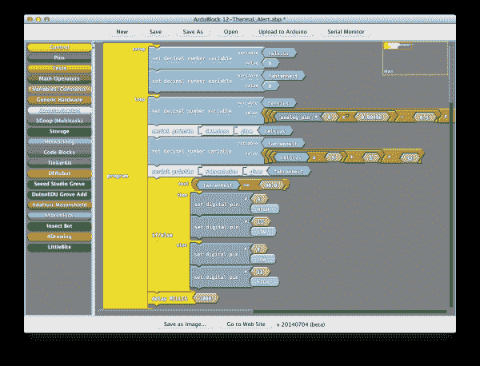](https://cdn.sparkfun.com/assets/learn_tutorials/2/6/1/ardublock_01.png)

如果你刚开始接触编程、电子或 Arduino，ArduBlock 是一个完美的界面。查看本教程的 [ArduBlock 部分，获取介绍和快速入门指南。](https://learn.sparkfun.com/tutorials/alternative-arduino-interfaces/ardublock)

#### Minibloq -可视化编程独立软件

与 ArduBlock 一样， [Minibloq](http://minibloq.org) 是一个**图形编程环境**，在这里，成组的块堆叠在一起，创建你的程序。然而，与 ArduBlock 不同，Minibloq 是一个独立的程序——不需要安装 Arduino。

[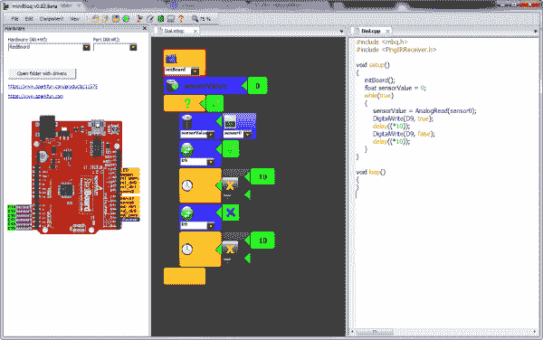](https://cdn.sparkfun.com/assets/learn_tutorials/2/6/1/minibloq_01.png)

Minibloq 最强大的特性之一是它的实时代码生成——当您将块拖动到程序中时，等价的代码会同时生成。这使得 Minibloq 成为初学者到中级程序员的优秀工具。

查看本教程的 [Minibloq 部分，了解该接口的介绍。](https://learn.sparkfun.com/tutorials/alternative-arduino-interfaces/minibloq)

### ...以及其他

这些是我们将在本教程中讨论的备选方案，但还有许多其他方案值得一试，包括:

*   [Scratch for Arduino](http://s4a.cat/) -更多**可视化编程**！面向 Arduino 的 Scratch(S4A)是流行的 [Scratch](http://scratch.mit.edu/) 编程环境中的一个片段。如果你是一个有经验的 Scratch 用户，这绝对值得一试！
*   在一次成功的 Kickstarter 活动之后，Modkit 正在生产另一个伟大的**视觉**替代 Arduino。查看他们的网站，感受一下他们基于**浏览器的**视觉环境。
*   用于 Atmel Studio 的 Arduino IDE-[Atmel Studio](http://www.atmel.com/tools/atmelstudio.aspx)是一个非常强大的工具，用于编程和调试类似 Arduino 上的 AVR 芯片。如果你正在寻找一种更为**先进的**Arduino 方法，或者 Atmel 芯片，看看 Atmel Studio 的这个扩展。

[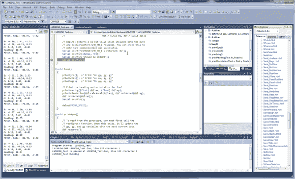](https://cdn.sparkfun.com/assets/learn_tutorials/2/6/1/atmel_studio_example.png)

这个扩展可能是一个非常强大的工具——包括断点实现和一系列您可能已经习惯于更高级的 IDE 的特性。

## ArduBlock

ArduBlock 是一个编程环境，旨在让“使用 Arduino 进行物理计算像拖放一样简单。”不用写代码，不用担心语法，也不用(错误地)放置分号，ArduBlock 允许你用一个代码块的快照列表**可视化地编程**。

ArduBlock 建立在 Arduino 的简单性之上，是物理计算的完美入门。你可以把时间花在创作上，而不是在调试上。

### 安装 ArduBlock

ArduBlock 是 Arduino 的“附件”,所以它要求你安装 Arduino IDE。不过，这样做的好处是——因为 Arduino 是多平台的——ardu block**可以在 Windows、Mac 或 Linux** 上工作。此外，Arduino 的出现使得从可视化编程到文本编程的转变变得更加容易，当不可避免的事情来临时。

安装 ArduBlock 可能有点棘手——没有安装程序，只有一个需要存储在非常特定的位置的 Java 文件。按照以下步骤进行安装:

1.  下载并安装 Arduino (如果你还没有的话)——ardu block 是默认 Arduino IDE 的扩展，所以你需要在你的电脑上安装 Arduino 来运行它。查看我们的[安装 Arduino IDE 教程](https://learn.sparkfun.com/tutorials/installing-arduino-ide)以获得帮助。
2.  **[下载 ardu block](http://sourceforge.net/projects/ardublock/files/latest/download)**——点击左边的链接，或者前往 [ArduBlock Sourceforge 页面](http://sourceforge.net/projects/ardublock/)寻找最新最好的版本。
3.  **识别您的 Arduino Sketchbook 位置** -这是您电脑上的一个文件夹，默认情况下，您的草图和库都保存在这里。要找到你的 sketchbook 位置，运行 Arduino，然后**打开偏好设置**，进入文件>偏好设置。顶部文本框的内容定义了您的 sketchbook 位置。记住位置并关闭 Arduino。[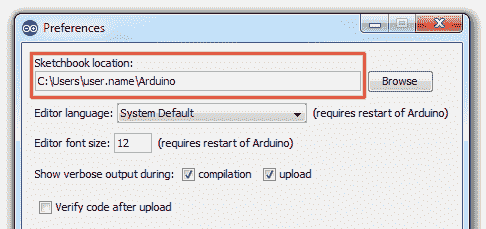](https://cdn.sparkfun.com/assets/learn_tutorials/2/6/1/ardublock-sketchbook-location_01.png) 

4.  **创建[sketchbook]/tools/ArduBlockTool/tool/**-您之前下载的 Ardublock 文件需要位于 Arduino sketchbook 中一个非常具体的位置。导航到你的 sketchbook，然后创建一个嵌套的三个目录:*工具*>*ArduBlockTool*>*工具*(注意，每个文件夹都**区分大小写**)。
5.  **将“ardublock-xxxxxxxx.jar”粘贴到/tool/** -将你下载的 ardublock 文件——一个 JAR (Java ARchive)文件——粘贴到你创建的嵌套中的最后一个文件夹。

    [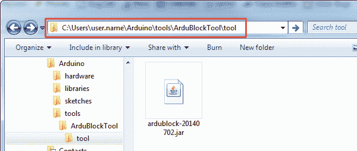](https://cdn.sparkfun.com/assets/learn_tutorials/2/6/1/ardublock_file-location.png)
6.  **启动 Arduino** -或者重启它(如果它是打开的)。
7.  **选择板卡和串行端口** -就像使用 Arduino 一样，从“工具”菜单中选择板卡和串行端口。
8.  **打开 ardu block**——点击**工具** > **运行 ArduBlock** 。如果您在这里没有看到 ArduBlock 的条目，请仔细检查以确保您的目录类型和大小写都正确。【T6
    [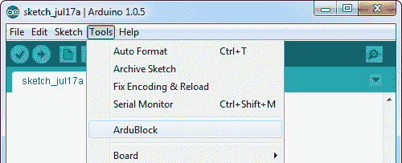](https://cdn.sparkfun.com/assets/learn_tutorials/2/6/1/ardublock_open.png)

ArduBlock 与 Arduino IDE 协同工作-它依赖于 IDE 在后台打开，所以**不要关闭 Arduino 窗口**！

### 使用 ArduBlock

ArduBlock 窗口分为两半。左边是“箱子”,它储存了你可以添加到草图中的每一个可能的方块。右边的灰色空白板是你“画”草图的地方。要将块添加到草图中，只需将其从框中拖到空白的灰色区域即可。

首先，每个 ArduBlock 草图都需要一个**程序块**，你可以在“控制”框中找到它。程序块定义了每个 Arduino 程序需要的`setup`和`loop`功能。

[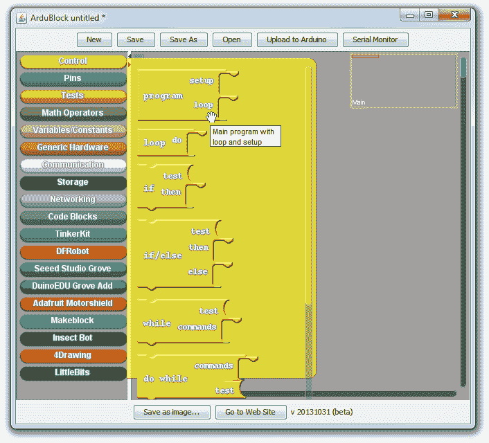](https://cdn.sparkfun.com/assets/learn_tutorials/2/6/1/ardublock_program.png)

从那里，您可以拖动更多的块，将它们捕捉到`loop`或`setup`部分。在这里，尝试制作一个**眨眼程序**。影响数字输出的**设置数字引脚**模块(类似于 Arduino 的`digitalWrite`功能)位于“引脚”框下。“控制”下的**延迟毫秒**模块类似于`delay` Arduino 功能。

[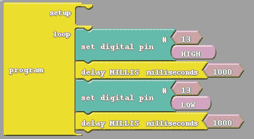](https://cdn.sparkfun.com/assets/learn_tutorials/2/6/1/ardublock_blink.png)

然后点击**上传至 Arduino** 将您的绘画发送至您的 Arduino 板。您可以按 ALT+TAB 回到 Arduino 窗口，检查您的代码上传状态。

[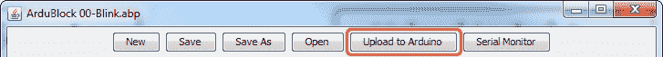](https://cdn.sparkfun.com/assets/learn_tutorials/2/6/1/upload-location.png)

在你成功上传了你的第一张草图后，继续玩并探索其他箱子的内容！

### ArduBlock 提示和技巧

您可以通过右键单击并选择“克隆”来**克隆**块或块组。从您右键单击的块到该“组”底部的所有内容都将被复制并粘贴到窗口的左上角。这对于更大的绘图来说是一个*巨大的*省时器。

[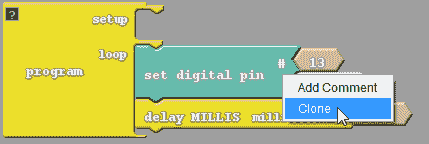](https://cdn.sparkfun.com/assets/learn_tutorials/2/6/1/ardublock_clone.png)

您可以通过将代码从整个“程序”块中拖出来临时删除它。编译代码时，任何与主程序块无关的内容都将被忽略。这是一个很棒的调试工具——您可以从程序执行中移除一段代码，而不是实际删除它，就像注释掉代码一样。

[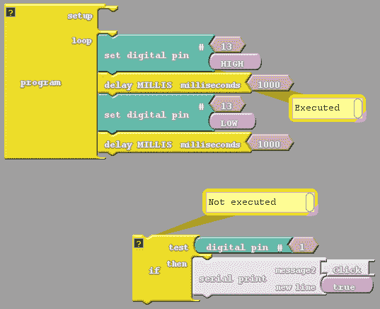](https://cdn.sparkfun.com/assets/learn_tutorials/2/6/1/ardublock_remove-block.png)

最后，如果你在上传了一幅 ArduBlock 绘图后回头看一眼 Arduino 窗口，你可能会注意到一些不同。为了创建您的代码，ArduBlock 程序只需解析您的代码块，并将等效的 Arduino 代码放入 Arduino 窗口。

[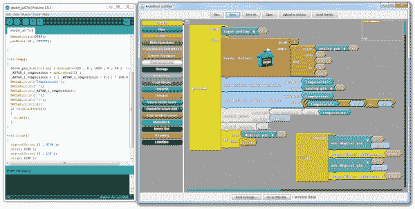](https://cdn.sparkfun.com/assets/learn_tutorials/2/6/1/ardublock_combo.png)

如果您对从图形编程过渡到文本编程感兴趣，这将成为一个很好的学习工具。

### ArduBlock 资源

*   [ArduBlock 主页](http://ardublock.com)
*   [ArduBlock GitHub 库](https://github.com/taweili/ardublock)(开源！)
*   [SparkFun 数字沙盒实验指南](https://learn.sparkfun.com/tutorials/digital-sandbox-experiment-guide) -一系列 Arduino 实验全部基于 ArduBlock。

 

### [SparkFun 数字沙盒](https://www.sparkfun.com/products/retired/12651)

[Retired](https://learn.sparkfun.com/static/bubbles/ "Retired") DEV-12651

数字沙盒(DS)是一个学习平台，同时涉及软件和硬件世界。它由一个微型…

13 **Retired**[Favorited Favorite](# "Add to favorites") 36[Wish List](# "Add to wish list")

## 迷你批量

Minibloq 是一个可视化驱动的编程环境，用于 Arduino 和其他物理计算设备。Minibloq 允许您使用一系列图形块来构建您的程序，而不是为语法、变量类型、编译错误和代码的其他烦恼而烦恼。

[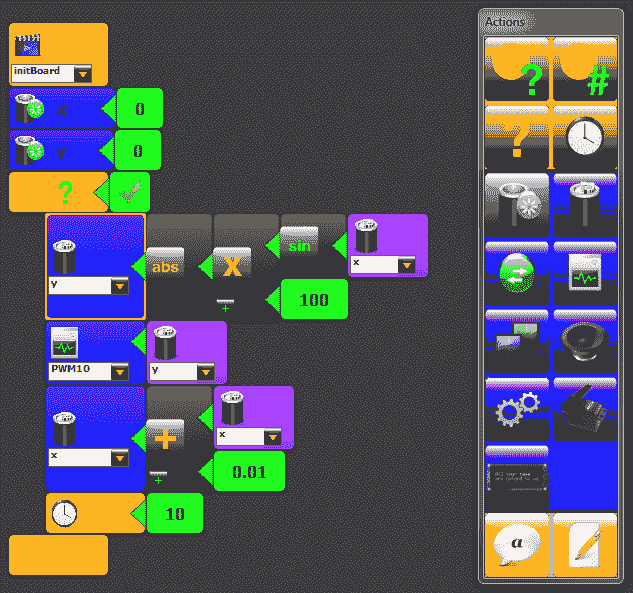](https://cdn.sparkfun.com/assets/learn_tutorials/2/6/1/minibloq_03.png)

除了温和、可视化的编程介绍，Minibloq 最酷的特性之一是它的**实时代码生成器**。当您将块添加到 Minibloq 图形中时，将在下一个窗口中生成一行等价的代码。如果你想从图形编程语言跳到文本编程语言，这是一个很好的工具。

Minibloq 主要关注**机器人**。它包括对流行机器人平台的支持，如 [Multiplo](http://multiplo.org/) 和我们的 [RedBot Kit](https://www.sparkfun.com/products/12697) 。

### Minibloq 入门

前往 Minibloq [下载页面](http://blog.minibloq.org/p/download.html)获取最新版本。要知道，至少现在，Minibloq(大部分)是**唯一兼容 Windows 的**。

默认情况下，界面分为三栏——硬件视图、Minibloq 编辑器和代码编辑器。在顶部的主工具栏上，您可以选择要显示或隐藏的列。

[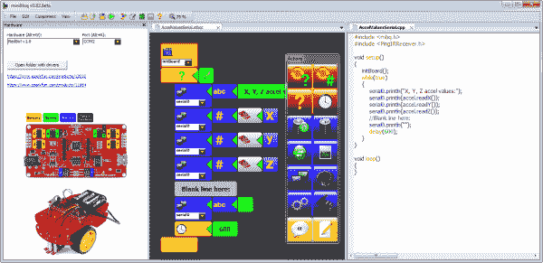](https://cdn.sparkfun.com/assets/learn_tutorials/2/6/1/minibloq_02.png)

硬件部分允许你在选项中挑选你的 Arduino 兼容板，包括 [RedBoard](https://www.sparkfun.com/products/12757) 、 [Arduino Uno](https://www.sparkfun.com/products/11021) 、 [Arduino Leonardo](https://www.sparkfun.com/products/11286) 、 [RedBot Kit](https://www.sparkfun.com/products/12697) 等。

中间的 Minibloq 编辑器窗口是你花大部分时间构建程序的地方。此视图与分离的“操作”窗口协同工作，在该窗口中，您可以单击按钮将程序块添加到程序中。

最后，右边是“生成代码”视图，这是 Minibloq 最强大的学习功能。这对于简化从可视化编程到“编码”编程的过渡是一个巨大的帮助。

创建 Minibloq 绘图需要一些时间来适应。尝试创建一个**眨眼程序**来感受一下:

[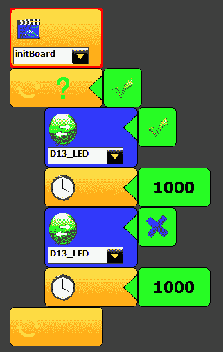](https://cdn.sparkfun.com/assets/learn_tutorials/2/6/1/minibloq_blink.png)

然后通过进入**文件** > **示例**查看其中的一些示例。在众多示例草图中，有一组 [SparkFun Inventor's Kit](https://www.sparkfun.com/products/12001) 和 RedBot Kit 特定程序。看看他们！

### 微博资源

*   [Minibloq 主页](http://minibloq.org)
*   [Minibloq 下载页面](http://blog.minibloq.org/p/download.html)
*   [Minibloq GitHub 库](https://github.com/miniBloq/v0.82) (Minibloq 是开源的！)
*   [使用 Minibloq 和多机器人](http://multiplo.org/minibloq/)
*   Minibloq 的创始人之一 Julian da Silva Gillig 是一名常驻的 SparkFun 黑客——看看我们对[的采访](https://www.sparkfun.com/news/1374)，了解更多关于 Minibloq 的信息。

* * *

## 寻找合适的 Arduino？

查看我们的 **[Arduino 对比指南](https://www.sparkfun.com/standard_arduino_comparison_guide)** ！我们已经编译了我们携带的每个 Arduino 开发板，因此您可以快速比较它们，找到最适合您需求的开发板。

带我去那里！

