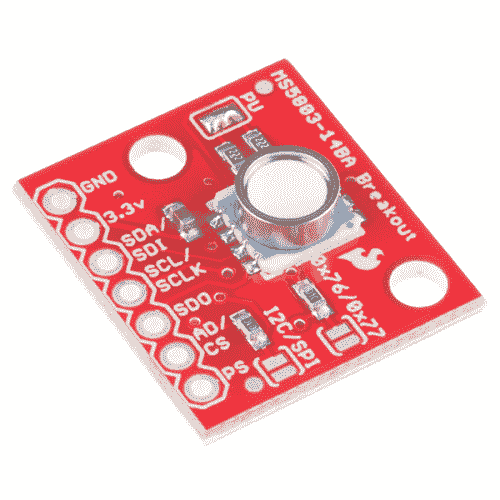
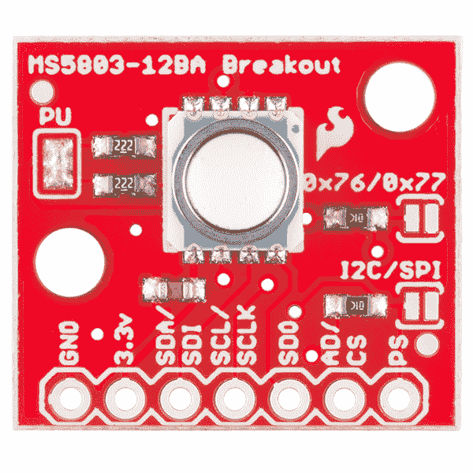
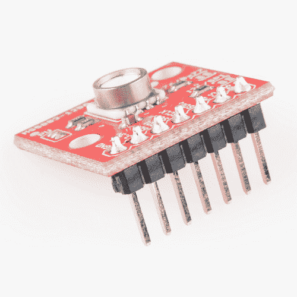
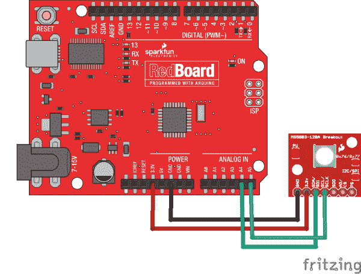
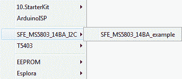

# MS5803-14BA 压力传感器连接指南

> 原文：<https://learn.sparkfun.com/tutorials/ms5803-14ba-pressure-sensor-hookup-guide>

## 介绍

**Heads up!** While the IC is capable of outputting data via I2C and SPI, the Arduino Library and example was only written to output via I2C! You'll need to modify the jumpers on the board for SPI mode by removing solder from the pull-up resistors jumper pads and close the other two jumpers. Additionally, you will need to write a library to communicate with the MS5803 in SPI mode if you plan on using this with Arduino.

[MS5803-14BA](https://www.sparkfun.com/products/12909) 是一个带有 I ² C(“导线”)和 SPI 接口的压力传感器。

 

将**添加到您的[购物车](https://www.sparkfun.com/cart)中！**

 **### [火花压力传感器分接头- MS5803-14BA](https://www.sparkfun.com/products/12909)

[In stock](https://learn.sparkfun.com/static/bubbles/ "in stock") SEN-12909

这是 MS5803-14BA 压力传感器分线点，一款高分辨率压力传感器，具有 I2C 和 SPI 接口。

$64.507[Favorited Favorite](# "Add to favorites") 23[Wish List](# "Add to wish list")** **[https://www.youtube.com/embed/Ir37SbDlyQ4/?autohide=1&border=0&wmode=opaque&enablejsapi=1](https://www.youtube.com/embed/Ir37SbDlyQ4/?autohide=1&border=0&wmode=opaque&enablejsapi=1)

压力传感器测量周围流体的绝对压力。这包括空气、水和任何类似粘性流体的物质。根据您对数据的理解，您可以确定海拔、水深或任何其他需要精确压力读数的任务。

### 本教程涵盖的内容

我们将向您展示如何将该传感器连接到 Arduino 微控制器，并使用附带的软件库从传感器中获取测量值。我们还将向您展示如何解读显示海拔和水深变化的读数。

### 推荐阅读

这部分很好用。但在你开始之前，我们推荐以下背景知识:

 [### 如何焊接:通孔焊接](https://learn.sparkfun.com/tutorials/how-to-solder-through-hole-soldering) This tutorial covers everything you need to know about through-hole soldering.[Favorited Favorite](# "Add to favorites") 70 [### 使用导线](https://learn.sparkfun.com/tutorials/working-with-wire) How to strip, crimp, and work with wire.[Favorited Favorite](# "Add to favorites") 50 [### 什么是 Arduino？](https://learn.sparkfun.com/tutorials/what-is-an-arduino) What is this 'Arduino' thing anyway? This tutorials dives into what an Arduino is and along with Arduino projects and widgets.[Favorited Favorite](# "Add to favorites") 50 [### 逻辑电平](https://learn.sparkfun.com/tutorials/logic-levels) Learn the difference between 3.3V and 5V devices and logic levels.[Favorited Favorite](# "Add to favorites") 82 [### I2C](https://learn.sparkfun.com/tutorials/i2c) An introduction to I2C, one of the main embedded communications protocols in use today.[Favorited Favorite](# "Add to favorites") 128

## 连接硬件- I2C

在本例中，我们将使用 I2C 接口与 MS5803-14BA 通信。

### 连接名称

MS5803-14BA 分线板断开 IC 的七个连接。我们习惯上称这些连接为“引脚”，因为它们来自集成电路上的引脚，但它们实际上是你可以焊接[导线](https://www.sparkfun.com/products/11367)或[插头引脚](https://www.sparkfun.com/products/116)的孔。

我们会将电路板上七个针脚中的四个连接到您的 Arduino。你需要的四个管脚分别标为 **GND** 、 **VCC** 、 **SCL** 和 **SDA** 。

### 将接头连接到电路板

您可以使用任何您喜欢的方法来连接到电路板。对于这个例子，我们将焊接一个七针长的[凸-凸排线](https://www.sparkfun.com/products/116)，并使用[凸-凹跳线](https://www.sparkfun.com/products/9385)将 MS5803-14BA 连接到您的 Arduino。

[将](https://learn.sparkfun.com/tutorials/how-to-solder-through-hole-soldering)一个 7 针长的凸-凸接头焊接到电路板上。你可以把它焊接到任何一边。底部对试验板更有用，顶部对跳线更有用。

### 将主板连接到 Arduino

焊接完成后，将 GND、3.3v、SDA 和 SCL 引脚连接到 Arduino。不同的 Arduino 型号对 I ² C 接口使用不同的管脚；使用下面的图表来确定在哪里插入所有的东西。

重要提示:仅将的电源引脚(3.3v 和 GND)连接到 3.3V 电源。更高的电压会永久损坏器件。注意，因为 I ² C 使用[开漏驱动器](https://learn.sparkfun.com/tutorials/i2c/i2c-at-the-hardware-level)，所以将 I ² C 引脚(DA 和 CL)连接到 5V 微处理器上的 I ² C 端口是安全的。

| MS5803-14BA 标签 | 引脚功能 | Arduino 连接 |
| **GND** | 地面 | **GND** |
| **3.3v** | 3.3V 电源 | **3.3V** |
| **SDA** | I ² C 数据 | 任何标有 SDA 的引脚，或:

&#124; Uno，RedBoard，Pro/Pro Mini &#124; **A4** &#124;
&#124; Mega，Due &#124; **20** &#124;
&#124; Leonardo，Pro Micro &#124; **2** &#124;

 |
| **SCL** | I ² C 时钟 | 任意销标 SCL，或:

&#124; Uno，RedBoard，Pro/Pro Mini &#124; A5 &#124;
&#124; Mega，Due &#124; **21** &#124;
&#124; Leonardo，Pro Micro &#124; **3** &#124;

 |

一旦您将 MS5803-14BA 连接到 Arduino，我们就可以开始使用该软件了。

## 安装 Arduino 库

**Note:** This code/library has been written and tested on Arduino IDE version 1.6.4 . Otherwise, make sure you are using the latest stable version of the Arduino IDE on your desktop.

If this is your first time using Arduino, please review our tutorial on [installing the Arduino IDE.](https://learn.sparkfun.com/tutorials/installing-arduino-ide) If you have not previously installed an Arduino library, please check out our [installation guide.](https://learn.sparkfun.com/tutorials/installing-an-arduino-library)

库是面向单一目的的软件功能的集合，例如与特定设备通信。Arduino 附带了许多内置库，可以帮助您执行高级任务。我们已经编写了一个名为**spark fun MS5803-14BA Breakout Arduino 库**的 Arduino 库，它允许您轻松地与 ms 5803 传感器对话。这个库没有包含在 Arduino 软件中，但是不用担心，安装新的库很容易。您可以通过 Arduino 库管理器获得这些库。搜索 **SparkFun MS5803** ，你应该可以安装最新版本。如果你更喜欢手动下载这些库，你可以从 [GitHub 库](https://github.com/sparkfun/SparkFun_MS5803-14BA_Breakout_Arduino_Library)获取它们:

[Download the SparkFun MS5803-14BA Breakout Arduino Library (ZIP)](https://github.com/sparkfun/SparkFun_MS5803-14BA_Breakout_Arduino_Library/archive/master.zip)

如果您想将 MS5803 与 Arduino 之外的微控制器接口，在编写自己的代码时，库中的 C++源代码和[数据表](https://cdn.sparkfun.com/datasheets/Sensors/Weather/ms5803_14ba.pdf)中的信息可能会有所帮助。

## 示例草图

### 运行示例草图

您刚刚安装的库包括一个示例草图，显示了 MS5803 的基本操作。这是为编写您自己的代码而设计的起点。

安装好库后，运行 Arduino IDE，打开以下菜单项:**文件** / **示例**/**SFE _ ms 5803 _ 14BA**/**SFE _ ms 5803 _ 14BA _ I2C _ Demo**。

**Note:** If you don't see this menu item, you may not have installed the library correctly, or didn't restart the Arduino IDE. Take another look at the [library installation page](https://learn.sparkfun.com/tutorials/ms5803-14ba-pressure-sensor-hookup-guide/installing-the-arduino-library) to see if you missed any steps.

示例打开后，上传到你的 Arduino(记得选择正确的板卡类型和串口)，打开[串口监视器](https://learn.sparkfun.com/tutorials/terminal-basics)到 **9600 波特**。您应该看到一些诊断信息(如果它找不到设备，请仔细检查您的硬件连接),然后是测量读数。

### 编写自己的草图

示例草图中的注释和代码应该可以帮助您开始编写自己的草图。在许多情况下，您应该能够将示例代码复制并粘贴到您自己的草图中。

## 资源和进一步发展

现在，您已经成功启动并运行了您的 MS5803-14BA 压力传感器，是时候将其纳入您自己的项目了！如需了解更多信息，请查看以下资源:

*   [原理图](https://cdn.sparkfun.com/datasheets/Sensors/Weather/MS5803-14BA_Breakout_v10.pdf)
*   [老鹰文件](https://cdn.sparkfun.com/datasheets/Sensors/Weather/MS5803-14BA_Breakout_v10.zip)
*   [数据表](https://cdn.sparkfun.com/datasheets/Sensors/Weather/ms5803_14ba.pdf)(ms 5803-14BA)
*   GitHub
    *   [产品回购](https://github.com/sparkfun/MS5803-14BA_Breakout/tree/master)
    *   [Arduino 库](https://github.com/sparkfun/SparkFun_MS5803-14BA_Breakout_Arduino_Library/tree/master)
*   [SFE 产品查看一些相关教程:](https://youtu.be/Ir37SbDlyQ4) [### MAX30105 粒子和脉冲氧传感器连接指南](https://learn.sparkfun.com/tutorials/max30105-particle-and-pulse-ox-sensor-hookup-guide) The SparkFun MAX30105 Particle Sensor is a flexible and powerful sensor enabling sensing of distance, heart rate, particle detection, even the blinking of an eye. Get ready. Set. Shine 9 [### ESP32 环境传感器屏蔽连接指南](https://learn.sparkfun.com/tutorials/esp32-environment-sensor-shield-hookup-guide) SparkFun's ESP32 Environment Sensor Shield provides sensors and hookups for monitoring environmental conditions. This tutorial will show you how to connect your sensor suite to the Internet and post weather data online.[Favorited Favorite](# "Add to favorites") 1 [### SparkFun 环境传感器分线点- BME68x (Qwiic)连接指南](https://learn.sparkfun.com/tutorials/sparkfun-environmental-sensor-breakout---bme68x-qwiic-hookup-guide) A hookup guide to get started with the BME68x Environmental Sensor from Bosch. Monitor the air quality, temperature, humidity, and barometric pressure with this Qwiic sensor 1 [### lora 串行连接指南](https://learn.sparkfun.com/tutorials/loraserial-hookup-guide) Simple serial over LoRa 2**Tip:** If you are submerging the sensor in a liquid, try sealing the board in [silicone conformal coating](https://learn.sparkfun.com/tutorials/customizing-lilypad-led-colors#coat-your-leds) while keeping the gel membrane exposed to the medium. Just keep in mind that the antimagnetic stainless steel cap only protects against "30 bar overpressure water resistance" as stated in the datasheet.

    如果您有任何问题，我们的技术支持部门可以提供帮助。请不要犹豫与我们联系。我们也喜欢听你的项目！**