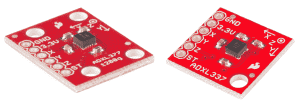
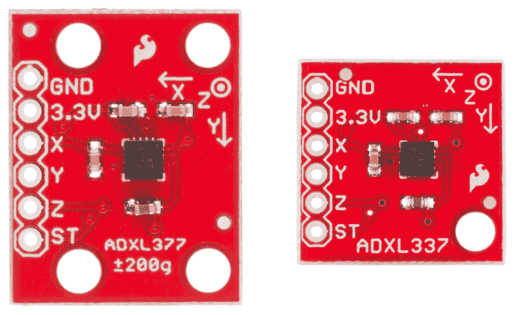
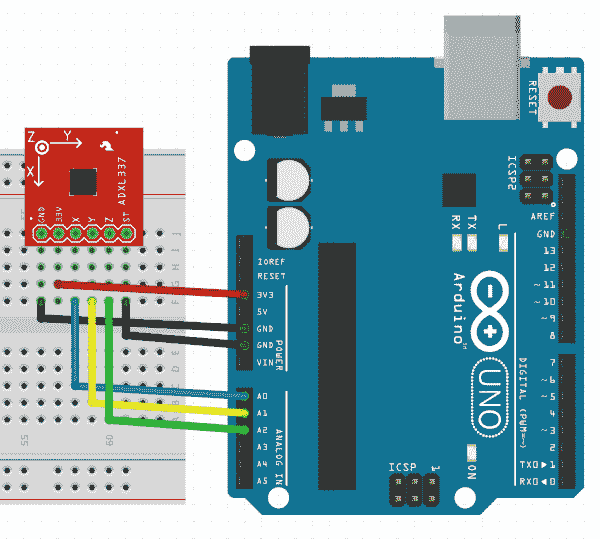

# ADXL337 和 ADXL377 加速度计连接指南

> 原文：<https://learn.sparkfun.com/tutorials/adxl337-and-adxl377-accelerometer-hookup-guide>

## 介绍

ADXL337 和 ADXL377 均为小型、薄型、低功耗、完整的三轴加速度计，具有经过信号调理的模拟电压输出。

以下是我们为使这些小芯片更易于使用而制作的每个加速度计分线板的照片:

[](https://cdn.sparkfun.com/assets/learn_tutorials/2/5/8/337_377_angled.jpg)

两者之间的主要区别是它们测量的加速度范围。ADXL337 测量加速度的满量程范围为±3g，而 ADXL377 的满量程范围为±200g，用于测量运动、冲击或振动中更极端的变化。

### 本教程涵盖的内容

在本教程中，我们将帮助您学习如何使用这些加速度计，以便您可以快速、轻松地将它们集成到您的项目中。以下是我们将要介绍的内容:

*   [硬件概述](https://learn.sparkfun.com/tutorials/adxl337-and-adxl377-accelerometer-hookup-guide/hardware-overview)-adxl 337/adxl 377 IC 概述，以及我们为简化使用而设计的分线板。
*   [示例连接](https://learn.sparkfun.com/tutorials/adxl337-and-adxl377-accelerometer-hookup-guide/example-hookup) -如何将加速度计连接到无处不在的 Arduino，以便我们可以开始编写代码来使用它们。
*   [示例代码](https://learn.sparkfun.com/tutorials/adxl337-and-adxl377-accelerometer-hookup-guide/example-code) -我们已经编写了示例草图，演示如何收集传感器数据以及如何理解这些数据。

### 所需材料

*   [ADXL337 分线板](https://www.sparkfun.com/products/12786)和/或 [ADXL377 分线板](https://www.sparkfun.com/products/12803)
*   [Arduino Uno](https://www.sparkfun.com/products/11021) 或任何 [Arduino 板](https://learn.sparkfun.com/tutorials/arduino-comparison-guide) -我们将使用 Uno 作为例子，但是你应该能够使用你手边的任何 Arduino 板，包括 [RedBoard](https://www.sparkfun.com/products/11575) 、 [Pro](https://www.sparkfun.com/products/10914) 、 [Mega](https://www.sparkfun.com/products/11061) 等。

你可能还需要一个[试验板](https://www.sparkfun.com/products/12002)、[跳线](https://www.sparkfun.com/products/11026)和[直插头](https://www.sparkfun.com/products/116)来遵循示例设置，如果你还没有这些或其他方式将 Arduino 连接到分线板。

### 推荐阅读

在继续学习本教程之前，我们建议您先熟悉一下这些教程中的概念:

*   加速度计基础知识 -这是一本很好的关于加速度计的入门书-它们是如何工作的，以及为什么使用它们。
*   [加速度计购买指南](https://www.sparkfun.com/pages/accel_gyro_guide) -如果您不确定哪种加速度计最适合您，请查看该指南。
*   [逻辑电平](https://learn.sparkfun.com/tutorials/logic-levels)-adxl 337/adxl 377 均为 3.3V 器件，因此您的模数(ADC)读数会因使用 5V 或 3.3V 微处理器而异！两者都可以工作，只是要注意它如何影响微控制器读取的值。

## 硬件概述

ADXL337 和 ADXL377 的分线板提供了从加速度计获取必要数据所需的所有引脚。

[](https://cdn.sparkfun.com/assets/learn_tutorials/2/5/8/337_377_top.jpg)

如您所见，每个分线点都有相同的分线点。以下是每个引脚的一些信息:

| Pin Label | 引脚功能 | 输入/输出 | 笔记 |
| 3.3V | 电源 | 投入 | 可以在 1.8 - 3.6V 之间 |
| X | x 轴加速度 | 输出 | 电压与 X 轴上测得的加速度相关的模拟输出 |
| Y | y 轴加速度 | 输出 | 电压与 Y 轴上测得的加速度相关的模拟输出 |
| Z | z 轴加速度 | 输出 | 电压与 Z 轴上测得的加速度相关的模拟输出 |
| 标准时间（standard time） | 自我测试 | 投入 | 用于验证传感器功能 |
| GND | 地面 | 投入 | 0V，与微控制器电路共享的公共电压 |

### 电压供应要求

这里需要注意的是，ADXL337 和 ADXL377 的**最大电压均为 3.6V** ，该范围适用于电源和自测引脚。只要使用 3.3V 电源为电路板供电，这些传感器就可以使用 5V 或 3.3V 微处理器。但请注意，模数转换器(ADC)读数会因使用 5V 或 3.3V 微处理器而异！两者都可以工作，只是要注意它如何影响微控制器读取的数值。

幸运的是，你不需要很大的能量来让加速度计工作。在正常工作模式下，它们的典型功耗约为 300 A。

### 额外硬件说明

如果 ADXL337 或 ADXL377 采用 3.3V 电源供电，X 引脚上的电压读数为 1.65V 时，两个芯片的加速度读数均为 0g。然而，如果 ADXL337 上的 X 引脚读数为 3.3V，这意味着 X 轴上施加了 3g 的力，而 ADXL377 上的同一读数显示的力为 200g。两种芯片的用法基本相同，但由于每个芯片测量的尺度不同，解读读数的方式也不同。

ADXL377 还有 4 个安装孔，而不是 2 个，这样可以更安全地连接到您的项目，因为它可能会受到更大的力。

此外，对于两个芯片，X、Y 和 Z 输出端均使用 0.01 F 电容。这意味着从 IC 收集加速度数据的最大速率是 500Hz。

## 示例连接

### 焊接

在您将加速度计分线板插入试验板并将其连接到任何东西之前，您需要将[连接器或电线焊接到分线引脚。你把什么焊接到电路板上取决于你如何使用它。](https://learn.sparkfun.com/tutorials/how-to-solder-through-hole-soldering)

如果您打算在[试验板](https://learn.sparkfun.com/tutorials/how-to-use-a-breadboard)或类似的 0.1 英寸间距的 perfboard 中使用分线板，我们建议将[直插头](https://www.sparkfun.com/products/116)焊接到引脚中(如果您需要，还有[长插头](https://www.sparkfun.com/products/10158))。

如果你要将分线器安装到一个紧密的外壳中，你可能想要将电线([绞合](https://www.sparkfun.com/products/11375)或[实芯](https://www.sparkfun.com/products/11367))直接焊接到引脚中。

### 简单的连接

本例将使用 Arduino Uno 来收集和解释来自 ADXL337 或 ADXL377 的传感器数据。由于传感器的输出是模拟的，我们所需要的是 Arduino 的“模拟输入”引脚和加速度计之间的三根电线(除了电源和地)。虽然下图显示的是 ADXL337，但两块电路板的接头和 Arduino 连接是相同的。这是连接:

[](https://cdn.sparkfun.com/assets/learn_tutorials/2/5/8/337_hookup.jpg)

我们只需为加速度计供电(3.3V 和 GND)，然后将传感器的 X、Y 和 Z 线连接到 ADC 引脚(本例中分别为 A0、A1 和 A2)。正常工作下，自测引脚(st)可以保持断开或接地。如果您想使用自测来双重检查传感器的功能，将其连接到 3.3V。查看[数据表](https://learn.sparkfun.com/tutorials/adxl337-and-adxl377-accelerometer-hookup-guide/resources--going-further)了解更多信息。

## 示例代码

现在，您的加速度计分线点已与 Arduino 电连接，是时候深入了解代码了。关于 [ADXL337](https://github.com/sparkfun/ADXL337_Breakout) 或 [ADXL377](https://github.com/sparkfun/ADXL377_Breakout) 的完整示例草图可以在 github 资源库中找到。除了`scale`变量的值之外，代码是相同的。

草图设置配置变量中的前两行代码。

```
language:c
int scale = 3;
boolean micro_is_5V = true; 
```

变量`scale`设置为加速度计的满量程，以 g 力测量。ADXL337 设置为`3`，ADXL377 设置为`200`，因为传感器分别测量 3g 和 200g 范围。如果使用 5V 微控制器，如 Arduino Uno，变量`micro_is_5V`被设置为`true`，如果使用 3.3V 微控制器，变量`false`被设置为`micro_is_5V`。我们想知道这一点，因为它会影响我们稍后将阅读的传感器数据的解释。

接下来，我们在初始化串行通信中使用`setup()`功能，以便稍后将传感器数据打印到串行监视器。

```
language:c
void setup()
{
  // Initialize serial communication at 115200 baud
  Serial.begin(115200);
} 
```

使用`loop()`功能，我们收集传感器数据，将其换算成以 g 力为测量单位的适当单位，并将原始数据和换算后的数据打印到串行监视器。首先，让我们看看如何读取传感器数据。

```
language:c
void loop()
{
  // Get raw accelerometer data for each axis
  int rawX = analogRead(A0);
  int rawY = analogRead(A1);
  int rawZ = analogRead(A2); 
```

我们使用 Arduino 上的模拟输入 A0、A1 和 A2，并进行几次模拟读取，以获得与这些引脚上的电压相对应的 0 至 1023 之间的数字。这些电压反映了传感器的最新加速度测量值。例如，如果 ADXL337 在 X 引脚上测得 3.3V 电压，这意味着它在 X 轴上测得+3g 电压。这反过来由微控制器来测量。如果您使用 3.3V 微控制器，模拟读数将返回 1023，并将该值存储在变量`rawX`中。如果您使用 5V 微控制器，模拟读数将返回 675，并将该值存储在同一个变量中。这就是为什么正确设置变量`micro_is_5V`很重要，这样我们就知道如何解释这些原始值。

知道了微控制器的电压，我们就可以正确地将这些整数换算成以 g 力为单位的可读单位。以下是我们如何将这些值换算成更有意义的单位。

```
language:c
 float scaledX, scaledY, scaledZ; // Scaled values for each axis
  if (micro_is_5V) // microcontroller runs off 5V
  {
    scaledX = mapf(rawX, 0, 675, -scale, scale); // 3.3/5 * 1023 =~ 675
  }
  else // microcontroller runs off 3.3V
  {
    scaledX = mapf(rawX, 0, 1023, -scale, scale);
  } 
```

我们首先将缩放变量声明为浮点数，因为我们需要小数位。然后，我们用布尔值`micro_is_5V`检查微控制器是在 5V 还是 3.3V 下运行。基于此，我们使用映射函数将 x 的原始整数值`rawX`缩放成以 g 力测量的十进制值，称为`scaledX`。我们也对 Y 轴和 Z 轴这样做，但是我在上面没有提到它们，因为它们遵循完全相同的过程。请记住，675 来自一个事实，即 5V Arduino 将测量 3.3V 作为 675，而 3.3V Arduino 将测量 3.3V 作为 1023。

`mapf()`功能存在于草图中，工作原理与 Arduino 标准`map()`功能完全相同，你可以[在这里引用](http://arduino.cc/en/reference/map)。我没有使用标准映射的原因是因为它只处理整数，并且，为了我们的目的，我们需要小数位。因此，我基本上使用 floats 重写了完全相同的函数。

缩放后，我们将原始数据和缩放后的数据打印到[串行监视器](https://learn.sparkfun.com/tutorials/terminal-basics/arduino-serial-monitor-windows-mac-linux)。您可能只关心查看缩放后的数据，除非您正在调试，但是我将二者都留在那里，以便您可以进行比较。以下是如何打印每个轴的原始数据和缩放数据:

```
language:c
  // Print out raw X,Y,Z accelerometer readings
  Serial.print("X: "); Serial.println(rawX);

  // Print out scaled X,Y,Z accelerometer readings
  Serial.print("X: "); Serial.print(scaledX); Serial.println(" g"); 
```

这允许您以两种形式查看数据。之后，我们在进行额外的传感器读取之前使用一个延迟。

```
language:c
delay(2000); 
```

在示例草图中，我们暂停了 2 秒钟(2000 毫秒),因为我们只是打印到串行监视器，以便查看和学习。在您的实际项目中，您最多可以以 500Hz 读取传感器，这意味着您希望传感器读取之间的间隔至少为 2 毫秒。

然后又回到了`loop()`的开头。希望这有助于您在自己的项目中收集和分析加速度计数据。

## 资源和更进一步

感谢阅读！现在，您已经熟悉了 ADXL337 和 ADXL377 加速度计的硬件和软件。我们很期待看到你用这些传感器做的东西。在构建相关项目时，以下资源可能会对您有所帮助:

*   [ADXL337 数据手册](http://www.analog.com/static/imported-files/data_sheets/ADXL337.pdf)
*   [ADXL377 数据手册](http://www.analog.com/static/imported-files/data_sheets/ADXL377.pdf)
*   [ADXL337 分线点 Github 仓库](https://github.com/sparkfun/ADXL337_Breakout)
*   [ADXL377 分线点 Github 仓库](https://github.com/sparkfun/ADXL377_Breakout)
*   [使用 Github](https://learn.sparkfun.com/tutorials/using-github)

现在去用你的加速度计创造一些很棒的东西吧。需要一些灵感吗？查看其他 SparkFun 教程:

*   [布林肯大礼帽](https://learn.sparkfun.com/tutorials/das-blinken-top-hat)
*   [龙与地下城骰子战书](https://learn.sparkfun.com/tutorials/dungeons-and-dragons-dice-gauntlet)