# 袖珍 AVR 编程器连接指南

> 原文：<https://learn.sparkfun.com/tutorials/pocket-avr-programmer-hookup-guide>

## 介绍

你需要更多的控制你的 AVR 吗？无论是 [ATmega328](https://www.sparkfun.com/products/9061) 、 [ATmega32U4](https://www.sparkfun.com/products/11117) 、 [ATtiny85](https://www.sparkfun.com/products/9378) ，如果是 AVR，那么 [AVR 袖珍编程器](https://www.sparkfun.com/products/9825)很有可能可以对其进行编程。

[](https://www.sparkfun.com/products/9825) 

将**添加到您的[购物车](https://www.sparkfun.com/cart)中！**

 **### [袖珍 AVR 编程器](https://www.sparkfun.com/products/9825)

[In stock](https://learn.sparkfun.com/static/bubbles/ "in stock") PGM-09825

这个新版本使用 SMD 5x2 标题。这是一个简单易用的 USB AVR 编程器。它成本低，易于使用，工程大…

$18.5053[Favorited Favorite](# "Add to favorites") 31[Wish List](# "Add to wish list")** **通过系统内编程器(ISP)对 AVR 进行编程有很多原因。如果你的 AVR 没有安装引导程序，这可能是加载代码的唯一方法。或者，您可能想要覆盖引导加载程序，以挤出一些额外的闪存空间。或者也许你想戳在保险丝位，以改变掉电电压。或者你只是想要一个更快更可靠的代码上传。

### 本教程涵盖的内容

在本教程中，我们将向您介绍 AVR 袖珍编程器的所有重要方面。它分为一系列部分，包括:

*   [电路板概述](https://learn.sparkfun.com/tutorials/pocket-avr-programmer-hookup-guide/board-overview) -看看组成 AVR 袖珍编程器的硬件组件。
*   [安装驱动](https://learn.sparkfun.com/tutorials/pocket-avr-programmer-hookup-guide/installing-drivers) -如何在 Windows 机器上安装 AVR Pocket Programmers*(Mac 和 Linux 用户可跳过此页)*。
*   [通过 Arduino](https://learn.sparkfun.com/tutorials/pocket-avr-programmer-hookup-guide/programming-via-arduino) 编程——如何使用无处不在的“简易模式”AVR IDE 通过 AVR 袖珍编程器上传草图。
*   [通过命令行使用 AVR dude](https://learn.sparkfun.com/tutorials/pocket-avr-programmer-hookup-guide#using-avrdude-via-command-line)-一种更高级的基于命令行的使用 AVR 袖珍编程器的方法。
*   [故障排除](https://learn.sparkfun.com/tutorials/pocket-avr-programmer-hookup-guide#troubleshooting) -解决您可能遇到的一些 AVRDUDE 错误的一些故障排除技巧。

### 所需材料

最重要的是，按照这个教程，你将需要一个 [AVR 袖珍编程器](https://www.sparkfun.com/products/9825)和一个 **AVR 来编程**。最重要的是，需要一根[迷你 B USB 线](https://www.sparkfun.com/products/11301)将编程器连接到你的电脑。

[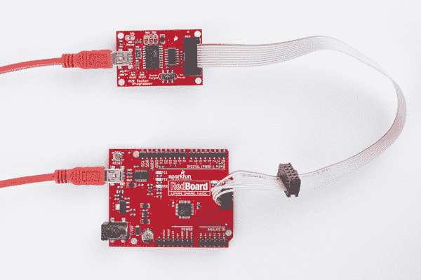](https://cdn.sparkfun.com/assets/learn_tutorials/2/1/4/action-programming.jpg)

要编程的微控制器可以是任何具有 64K 或更少闪存的 AVR。一台 [Arduino Uno](https://www.sparkfun.com/products/11021) 或 [RedBoard](https://www.sparkfun.com/products/12757) 上的 ATmega328 工作正常，但一台 Arduino Mega *上的 ATmega2560 就不行*。

除此之外，你可能需要一些接口程序员到你的 AVR。这里有一些**有用的配件**，可能会让工作变得更容易:

*   [直阳接头](https://www.sparkfun.com/products/116) -如果您在开发板上有 AVR 如[Arduino Pro](https://www.sparkfun.com/products/10915)-2x 3(或 2x5) ISP 接头可能不会被填充。您可以使用直阳接头(也可用于[长销型](https://www.sparkfun.com/products/12693))在 ISP 电缆和您的开发板之间建立临时接触。还有一个 [2x3 针版本](https://www.sparkfun.com/products/12807)。
*   [ISP Pogo 适配器](https://www.sparkfun.com/products/11591) -与接头一样，该 ISP 适配器旨在提供适配器和 AVR 之间的临时电气连接。这是头文件的一个很好的、更可靠的替代品。

[](https://www.sparkfun.com/products/116) 

将**添加到您的[购物车](https://www.sparkfun.com/cart)中！**

 **### [破开头球——直击](https://www.sparkfun.com/products/116)

[In stock](https://learn.sparkfun.com/static/bubbles/ "in stock") PRT-00116

一排标题-打破适应。40 个引脚，可切割成任何尺寸。用于定制 PCB 或通用定制接头。

$1.7520[Favorited Favorite](# "Add to favorites") 133[Wish List](# "Add to wish list")****[](https://www.sparkfun.com/products/12693) 

将**添加到您的[购物车](https://www.sparkfun.com/cart)中！**

 **### [【断开接头】- 40 针公(长居中，PTH，0.1”)](https://www.sparkfun.com/products/12693)

[In stock](https://learn.sparkfun.com/static/bubbles/ "in stock") PRT-12693

这是一排 40 个分离接头，间隔 0.1 英寸，两侧有长销。此标题在以下情况下特别有用…

$1.051[Favorited Favorite](# "Add to favorites") 16[Wish List](# "Add to wish list")****[](https://www.sparkfun.com/products/11591) 

将**添加到您的[购物车](https://www.sparkfun.com/cart)中！**

 **### [SparkFun ISP Pogo 适配器](https://www.sparkfun.com/products/11591)

[In stock](https://learn.sparkfun.com/static/bubbles/ "in stock") KIT-11591

Pogo 引脚使生活变得更加容易，当你试图编程，而不必焊接一个东西，当你连接到…

$13.954[Favorited Favorite](# "Add to favorites") 12[Wish List](# "Add to wish list")****[](https://www.sparkfun.com/products/12807) 

将**添加到您的[购物车](https://www.sparkfun.com/cart)中！**

 **### [表头- 2x3(公，0.1”)](https://www.sparkfun.com/products/12807)

[Only 2 left!](https://learn.sparkfun.com/static/bubbles/ "only 2 left!") PRT-12807

这是一个简单的 2x3 外螺纹接头。此接头是 ISP 连接器的常见配置。每个引脚都有一个间距…

$0.75[Favorited Favorite](# "Add to favorites") 4[Wish List](# "Add to wish list")******************Note:** If your AVR is living on a breadboard, you probably don't have an interface to the standard 2x3 ISP pinout. Our old [simple breakout board](https://www.sparkfun.com/products/8508) made interfacing the programmer with your breadboarded circuit possible. We recommend using the ISP Pogo Adapter linked above now that the breakout board has been retired in the catalog.

### 推荐阅读

无论你是初学者还是有经验的电子爱好者，袖珍编程器应该很容易安装和运行。如果你以前编写过 Arduino，你将为下一步做好充分准备。在继续本教程之前，我们推荐阅读以下一些教程:

*   什么是 Arduino？如果你不熟悉 AVR，看看这个教程，了解一下最流行的一个。
*   安装 Arduino - Arduino 不需要使用编程器，但它可以使事情变得更容易，特别是如果你仍然想使用 Arduino 库来编程你的 AVR。
*   [串行外设接口(SPI)](https://learn.sparkfun.com/tutorials/serial-peripheral-interface-spi) -袖珍编程器使用 SPI 接口向/从 AVR 发送数据。点击本教程了解“MOSI”、“味噌”和“SCK”背后的含义。

[](https://learn.sparkfun.com/tutorials/serial-peripheral-interface-spi) [### 串行外设接口(SPI)](https://learn.sparkfun.com/tutorials/serial-peripheral-interface-spi) SPI is commonly used to connect microcontrollers to peripherals such as sensors, shift registers, and SD cards.[Favorited Favorite](# "Add to favorites") 91[](https://learn.sparkfun.com/tutorials/what-is-an-arduino) [### 什么是 Arduino？](https://learn.sparkfun.com/tutorials/what-is-an-arduino) What is this 'Arduino' thing anyway? This tutorials dives into what an Arduino is and along with Arduino projects and widgets.[Favorited Favorite](# "Add to favorites") 50[](https://learn.sparkfun.com/tutorials/installing-arduino-ide) [### 安装 Arduino IDE](https://learn.sparkfun.com/tutorials/installing-arduino-ide) A step-by-step guide to installing and testing the Arduino software on Windows, Mac, and Linux.[Favorited Favorite](# "Add to favorites") 16

## 主板概述

在开始使用 AVR 袖珍编程器之前，让我们快速了解一下电路板上有哪些元件:

[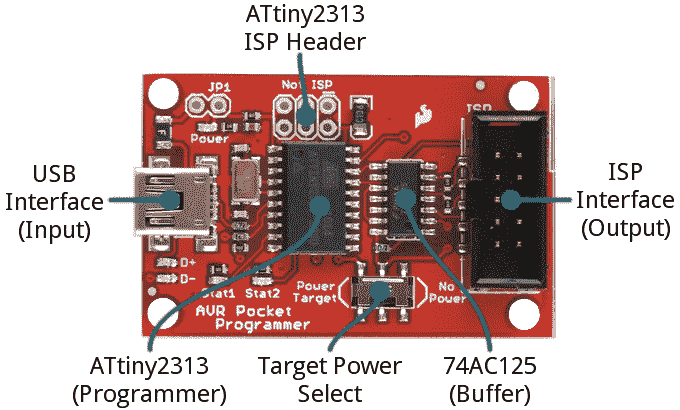](https://cdn.sparkfun.com/assets/learn_tutorials/2/1/4/annotated.jpg)

*   **USB 连接器** -这是你给编程器的**数据和电源输入**。一根[迷你 B USB 线](https://www.sparkfun.com/products/11301)插在这里，把你的电脑和编程器连接起来。
*   **2x5 ISP 接头** -这种屏蔽接头与附带的[编程电缆](https://www.sparkfun.com/products/9215)相匹配，允许您将编程信号发送到您的 AVR。它是极化的，以确保你不能向后插任何东西。
*   **电源目标开关** -与外面的许多 ISP 不同，AVR 袖珍编程器可以**向要编程的 AVR 提供电源**。将此开关拨到“电源目标”侧，向 AVR 发送 5V 电压。以下是更多相关信息。
*   这是发挥编程魔力的芯片。它可以在 USB 和 SPI 之间转换，将来自计算机的命令转换成文字和指令，加载到您的 AVR 中进行编程。除非你想定制微型 ISP 固件，你可以**离开这个芯片**。
    *   ATtiny2313 上方未填充的 ISP 接头被断开，以防芯片需要编程。它主要被那些给程序员编程的[用于生产。](http://en.wikipedia.org/wiki/Quis_custodiet_ipsos_custodes%3F)
*   74AC125 缓冲器 -该芯片通过缓冲数据线输出来帮助程序员增加一些保护。另一个通常被忽略的 IC。

该板还包括各种指示灯，用于指示电源、状态和数据传输。

### AVR ISP 引脚排列

AVR 通过一个 [SPI 接口](https://learn.sparkfun.com/tutorials/serial-peripheral-interface-spi)进行编程。ISP 和 AVR 之间的通信需要六种独特的信号:VCC、GND、复位、MOSI、MISO 和 SCK。

为了在设备之间路由这些信号，有两个标准化连接器——一个 10 引脚、2x5 和另一个 6 引脚、2x3 连接器:

[](https://cdn.sparkfun.com/assets/learn_tutorials/2/1/4/isp-pinout.png)*AVR ISP pinouts -- top view.*

AVR 袖珍编程器包括一个板载 2x5 连接器，附带的 [AVR 编程电缆](https://www.sparkfun.com/products/9215)端接 2x5 和 2x3 连接器。

### 电源目标开关

如果你在试验板上或原型上使用 AVR，电源可能很难获得。AVR 袖珍编程器允许您将 **5V** 输出到您的 AVR。在跳闸机载 PTC 之前，它可以输送超过 **500mA** 的电流。

[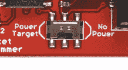](https://cdn.sparkfun.com/assets/learn_tutorials/2/1/4/power-switch.jpg)

如果开关在*功率目标*位置，它将 5V 输出到 AVR。否则，如果开关指向*无电源*，将不会有信号连接到 ISP 连接器上的 5V 管脚。

⚡ **Warning!** Be careful using this feature! It will **output 5V and only 5V**! If you're working with a 3.3V or 1.8V system, make sure this switch is in the *No Power* position and use a logic level converter.

[](https://www.sparkfun.com/products/12009) 

将**添加到您的[购物车](https://www.sparkfun.com/cart)中！**

 **### [SparkFun 逻辑电平转换器-双向](https://www.sparkfun.com/products/12009)

[In stock](https://learn.sparkfun.com/static/bubbles/ "in stock") BOB-12009

SparkFun 双向逻辑电平转换器是一个小型设备，可以安全地将 5V 信号降压至 3.3V，并升压 3。…

$3.50116[Favorited Favorite](# "Add to favorites") 146[Wish List](# "Add to wish list")** **## 安装驱动程序

只有的 Windows 机器需要安装驱动程序。如果你使用的是 **Mac 或 Linux** 机器，你**不需要安装驱动**。只需插入电路板，并跳到下一节的[。否则，按照下面我们概述的安装过程。](https://learn.sparkfun.com/tutorials/pocket-avr-programmer-hookup-guide/all#programming-via-arduino)

[Pocket AVR Programmer Hookup Guide - Programming via Arduino](https://learn.sparkfun.com/tutorials/pocket-avr-programmer-hookup-guide/all#programming-via-arduino)

本页有两套驱动程序安装说明。 [first 是最简单、最快速的方法，](https://learn.sparkfun.com/tutorials/pocket-avr-programmer-hookup-guide/all#automatic-install)应该对大多数人都有效。第二个安装过程[只有在第一个失败的情况下才需要——它需要更多的手动方法来安装驱动程序。](#manual-driver)

* * *

### [用 Zadig](#automatic-install) 自动安装驱动程序

首先，**将 AVR 袖珍编程器插入您的电脑**。最初连接主板时，Windows 会尝试自动安装驱动程序。有些计算机可能很幸运，但大多数会出现一条消息，通知您驱动程序安装失败。

单击以下链接下载 Zadig 软件和驱动程序:

[Download the Zadig USBtiny Drivers (ZIP)](https://cdn.sparkfun.com/assets/learn_tutorials/2/1/4/zadig_v2.0.1.160.zip)

使用您最喜欢的解压缩程序解压缩 ZIP 文件。不要忘记你把解压的文件夹放在哪里！

当你将 Pocket AVR 编程器插入你的电脑，并且你的机器已经运行了检查和安装驱动程序失败的过程之后，继续到你刚刚解压的" **zadig_v2.0.1.160** 文件夹。然后运行 zadig.exe 软件**。**

Zadig 是一个很棒的工具，可以在任何 Windows 平台上安装驱动程序。打开程序时，您应该会看到一个类似这样的窗口:

[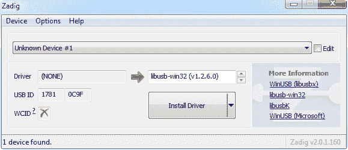](https://cdn.sparkfun.com/assets/learn_tutorials/2/1/4/zadig-01.png)

安装驱动程序之前，有几个选项需要验证:

*   **选择设备** -顶部的下拉框控制你想为哪个设备安装驱动程序。希望你只有一个选择，比如“**未知设备#1** ”。如果您有多个选项，请检查您的设备管理器，看看您是否能弄清楚哪个是哪个(插拔设备通常会有所帮助)。
*   **选择驱动**——点击这个框中的箭头，直到你碰到**libusb-win32(VX . x . x)**，这就是我们要安装的驱动。

确认这两个选择后，**点击“安装驱动程序”**。安装过程可能需要几分钟，但是在你看到滚动条放大无数倍后，你应该会看到一条“**驱动程序安装成功**”的消息。

[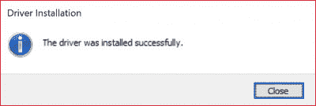](https://cdn.sparkfun.com/assets/learn_tutorials/2/1/4/AVR_Programmer_Zadig_usbtiny_Drivers_Installed.jpg)

### Zadig 驱动程序安装问题

After installing the drivers, your computer may respond by indicating that the device was not installed correctly. Here are two methods of troubleshooting driver issues when installing with Zadig.

📌 **Troubleshooting Tip:** In this case, the *WinUSB* drivers were selected instead of the *libusb-win32* drivers. To remedy the issue, simply go through the [guide again to reinstall the correct *libusb-win32* drivers](https://learn.sparkfun.com/tutorials/pocket-avr-programmer-hookup-guide/all#automatic-install).

[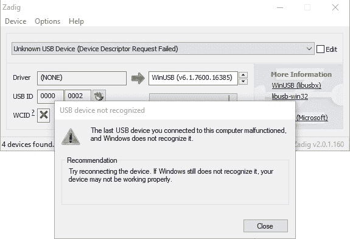](https://cdn.sparkfun.com/assets/learn_tutorials/2/1/4/Zadig_AVR_Programmer__Drivers_Not_Installed_Correctly_2.jpg)
📌 **Troubleshooting Tip:** In other cases, it may also initialize somewhere in your device manager as an **Unknown USB Device (Device Descriptor Request Failed)** even if you installed the correct drivers:

[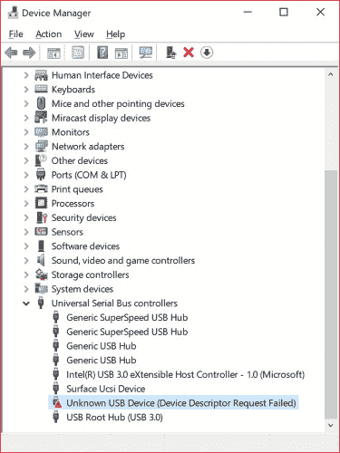](https://cdn.sparkfun.com/assets/learn_tutorials/2/1/4/Zadig_AVR_Programmer_Drivers_Not_Installed_Correctly.jpg)
Try unplugging and replugging the Pocket AVR Programmer back into your USB port. Or switch out your mini-B USB cable for a known good. In some cases, your Pocket AVR Programmer may shows up under the **libusb-win32 devices** as an **Unknown Device #1**. As long as it shows up under **libusb-win32 devices** tree, you should be good to go!

[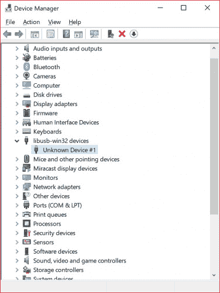](https://cdn.sparkfun.com/assets/learn_tutorials/2/1/4/Driver_Recognized_under_libusb-win32_devices.jpg)**Well done!** You've successfully installed the drivers on your computer. However, the driver still shows up as an **Unknown Device #1**. But you know what it is! You can use the Zadig software to rename the USB port if you desire. With your programmer connected to your comptuer and the software open, navigate to the programmer's port. Select the checkbox next to **Edit**.

[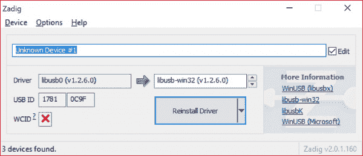](https://cdn.sparkfun.com/assets/learn_tutorials/2/1/4/Zadig_Rename_Port_1.jpg)
Type in the name for your port. It can be "**USBtiny**" or in this case, "**SparkFun Pocket AVR Programmer**". Make sure that the correct driver is selected.

[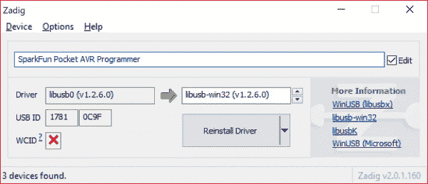](https://cdn.sparkfun.com/assets/learn_tutorials/2/1/4/Zadig_Renamed_Port.jpg)
Click **Reinstall Driver**. The driver will reinstall and you should see the same message that indicates that the drivers were successfully installed. You may need to unplug and replug the programmer to your computer to give it a second to refresh again.

[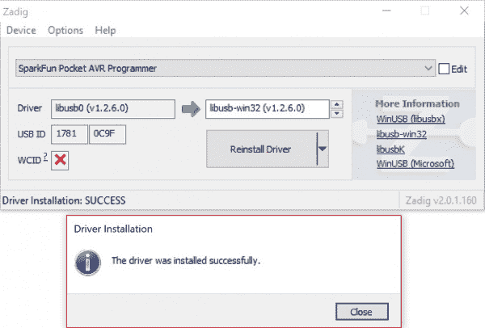](https://cdn.sparkfun.com/assets/learn_tutorials/2/1/4/Zadig_Successful_Driver_Install_with_Renamed_Port.jpg)
Open up your device manager and you should see the device renamed!

[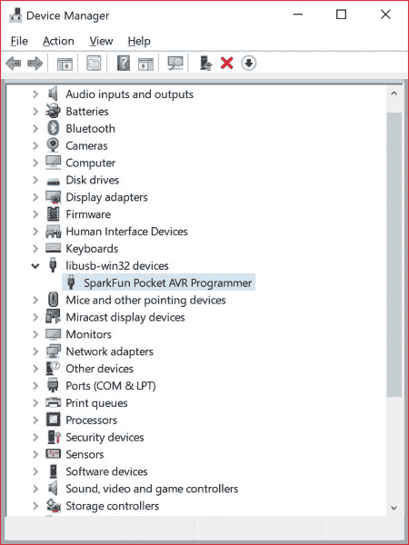](https://cdn.sparkfun.com/assets/learn_tutorials/2/1/4/Pocket_AVR_Programmer_Renamed_Port_Device_Manager.jpg)

如果成功，关闭 Zadig 程序并[进入下一部分](https://learn.sparkfun.com/tutorials/pocket-avr-programmer-hookup-guide/all#programming-via-arduino)！

[Pocket AVR Programmer Hookup Guide - Programming via Arduino](https://learn.sparkfun.com/tutorials/pocket-avr-programmer-hookup-guide/all#programming-via-arduino)

如果 Zadig 对你不起作用，检查下面的指导来帮助手动安装驱动程序。

* * *

### [手动安装 libUSB 驱动](#manual-driver)

如果出于某种原因，扎迪格不为你工作。阅读以下说明，手动安装驱动程序。点击下面的链接**下载驱动程序**:

[Download the USBtiny Drivers (ZIP)](https://cdn.sparkfun.com/assets/learn_tutorials/2/1/4/usbtinyisp_libusb-win32_1.2.1.0.zip)

使用您最喜欢的解压缩程序解压缩 ZIP 文件。不要忘记你把解压的文件夹放在哪里！

插上编程器后，Windows 无法安装驱动程序。按照以下步骤安装驱动程序:

1.  **打开设备管理器**——打开设备管理器有几条路线。
    *   你可以到**控制面板**，然后点击**硬件和声音**，再点击**设备管理器**。【T6[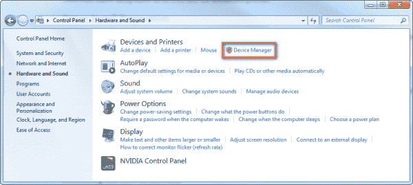](https://cdn.sparkfun.com/assets/learn_tutorials/2/1/4/driver-04.png)

    *   或者，只需打开**运行工具**(按 Windows 键+ R)，运行`devmgmt.msc`。
2.  在设备管理器中，您应该会看到“**其他设备** > **未知设备**”。**右击“未知设备”**，选择**更新驱动软件...**。【T8[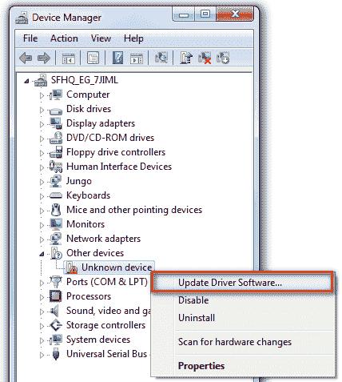](https://cdn.sparkfun.com/assets/learn_tutorials/2/1/4/driver-05.png)

3.  在弹出的“更新驱动软件-未知设备”窗口中点击**浏览我的电脑中的驱动软件**。
    [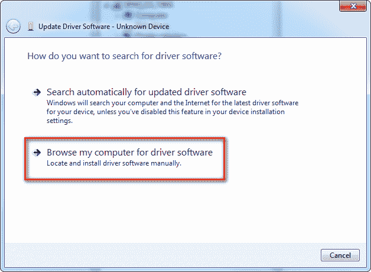](https://cdn.sparkfun.com/assets/learn_tutorials/2/1/4/driver-06.png)
4.  点击**浏览...**”并导航至“**..您刚刚下载的/usbtinyisp _ libusb-win32 _ 1 . 2 . 1 . 0**文件夹。然后点击**下一步**。【T6[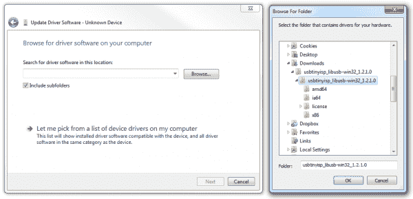](https://cdn.sparkfun.com/assets/learn_tutorials/2/1/4/driver-07.png)

5.  Windows 将开始安装驱动程序，然后立即通知您驱动程序未签名。点击**仍然安装该驱动软件**选项，继续安装。
    [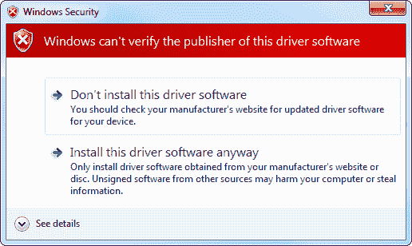](https://cdn.sparkfun.com/assets/learn_tutorials/2/1/4/driver-08.png)
6.  几分钟后，驱动程序应该会成功安装。您将看到一个“ **Windows 已成功更新您的驱动程序软件**”窗口。关闭它，您将看到一个“ **USBtiny** ”条目填充在设备管理器中的“ **LibUSB-Win32 设备**”树下。

[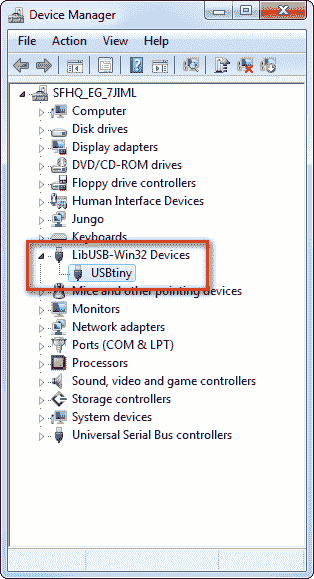](https://cdn.sparkfun.com/assets/learn_tutorials/2/1/4/driver-10.png)

恭喜你！[继续下一节](https://learn.sparkfun.com/tutorials/pocket-avr-programmer-hookup-guide/all#programming-via-arduino)，我们将开始使用编程器！

📌 **Drivers Still Not Installing?** If you are **still** having issues installing the drivers, try looking at this troubleshooting tip and driver from our technical support:

[GitHub SparkFunTechSupport: ...\PGM-11801](https://github.com/SparkfunTechSupport/Additional-files/tree/master/PGM-11801)

* * *

放松呼吸。一旦你在你的电脑上安装了 USBtiny 驱动程序，你就不需要再做了。现在是时候编程了！

## 通过 Arduino 编程

Arduino 有一个内置的工具，允许你通过程序员上传你的草图，而不是串行引导加载程序。如果你刚刚开始使用兼容 Arduino 的 AVR，这是一个很好的开始。

### 连接编程器

首先，让我们将程序员连接到我们的 Arduino。大多数 Arduinos 将标准化的 2x3 ISP 接头朝向电路板边缘。将附带的编程电缆的 2x5 连接器端插入 AVR 袖珍编程器，然后将另一端 2x3 连接器端连接到 Arduino。

[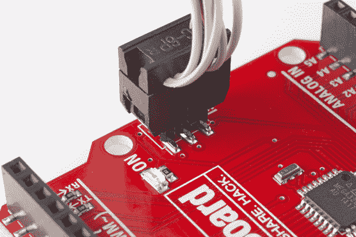](https://cdn.sparkfun.com/assets/learn_tutorials/2/1/4/action-connector.jpg)*Note the notch on the connector facing the same direction as pin 1 (marked with a small white line here) on the 2x3 Arduino connector.*

将编程电缆连接到 Arduino 时，请确保**与极性**匹配！电缆在塑料外壳的一侧有一个“凹口”。这个**应该指向 Arduino 的 ISP 接头的引脚 1** 。引脚 1 通常由孔或引脚旁边的条纹表示。

如果您的 Arduino 没有安装 ISP 引脚，请查看本页底部的[部分，了解我们多年来使用的一些提示和技巧。](#pogo-pins)

#### 给目标供电

连接编程器时，仔细检查以确保“电源目标”开关处于正确位置。程序员*可以*单独给你的 Arduino 供电！如果你想让它处理那个任务，把它滑动到*动力目标*位置。

[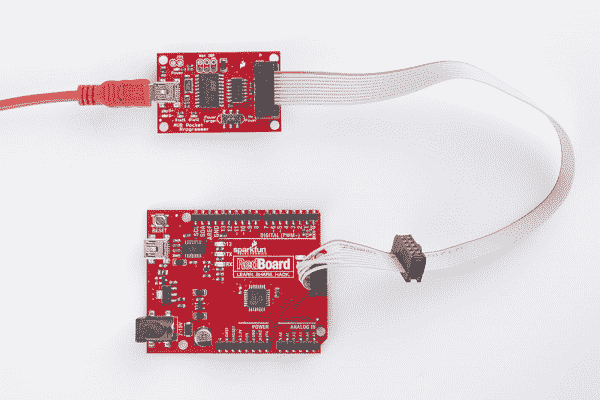](https://cdn.sparkfun.com/assets/learn_tutorials/2/1/4/action-power_target.jpg)*The "Power Target" feature is especially useful if you only have one USB slot/cable available.*

**如果你要通过编程器给 Arduino 供电，从 USB 上拔下它的插头**——你不会想让任何难看的反向电流流过你的电源。

### 通过 Arduino 编程

现在程序员已经连接到你的 Arduino，打开 IDE。然后像眨眼一样打开一个示例草图(**文件>示例> 1。基础知识>眨眼**。

在上传之前，我们需要告诉 Arduino 我们用的是哪个程序员。进入**工具** > **编程器**，选择 **USBtinyISP** 。

[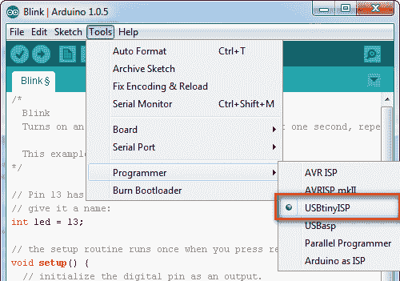](https://cdn.sparkfun.com/assets/learn_tutorials/2/1/4/arduino-01.png)

还要确保**正确设置了“电路板”选项**！上传草图时不需要选择串行端口，但如果您使用串行监视器进行任何操作，则仍然需要选择串行端口。

要使用您选择的编程器上传草图，进入**文件** > **使用编程器上传**。如果你经常这样做，习惯按 CTRL+SHIFT+U(Mac 上是 COMMAND+SHIFT+U)。

[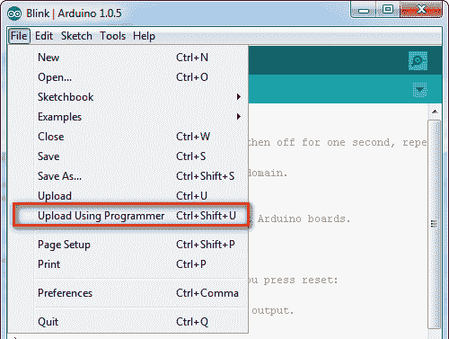](https://cdn.sparkfun.com/assets/learn_tutorials/2/1/4/arduino-02.png)**Note:** Depending on your Arduino IDE version, this may be in a different menu. Try looking under **Sketch** > **Upload Using Programmer** for this option.

Arduino 将运行正常的编译过程。草图编译完成后，程序员将开始点亮各处的蓝色——“D+”和“D-”LED 将点亮,“stat 2”LED 也将点亮。当“stat 2”LED 熄灭时，上传将完成。检查 Arduino IDE 的状态区域，确认草图“上传完毕”

如果你已经通过程序员上传了草图，你也已经清除了引导程序。如果你想把串行引导程序装回你的 Arduino，看看下一节。

### 引导加载程序编程

Arduino IDE 还有一个内置的特性，允许你上传一个引导程序到 AVR。方法如下:

确保你已经正确设置了**板**选项——除了别的以外，这将设置*你将上传哪个*引导程序。然后，只需导航到菜单最底部的**工具** > **刻录引导程序**。

[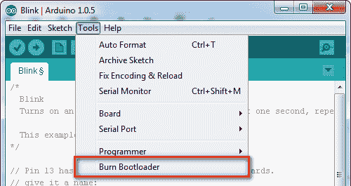](https://cdn.sparkfun.com/assets/learn_tutorials/2/1/4/arduino-03.png)

这个过程可能需要一分钟左右。不仅引导加载程序将被写入 AVR 的闪存，熔丝位(设置时钟速度、引导加载程序空间等)和锁位(禁止引导加载程序覆盖自身)也将被(重新)设置。

当“将引导加载程序刻录到 I/O 板(这可能需要一分钟)...信息变成“完成刻录引导程序”。这真的需要一段时间——当它说“可能需要一分钟”时，它没有撒谎。

### 弹簧针或倾斜的割台压机

大多数 Arduino 板都应该在这个 2x3 连接器上安装插针。如果你的板没有针从那些孔中射出，有几个选择。

你可以在那里[焊接](https://learn.sparkfun.com/tutorials/how-to-solder-through-hole-soldering)几条 3 [直阳接头](https://www.sparkfun.com/products/116)，以获得最佳、最可靠的连接。但是如果你想避免焊接，你可以使用那些相同的接头([长接头](https://www.sparkfun.com/products/12693)对此更好)，将长端插入编程电缆，并将短端推入空孔，同时倾斜它们以接触所有六个引脚。

[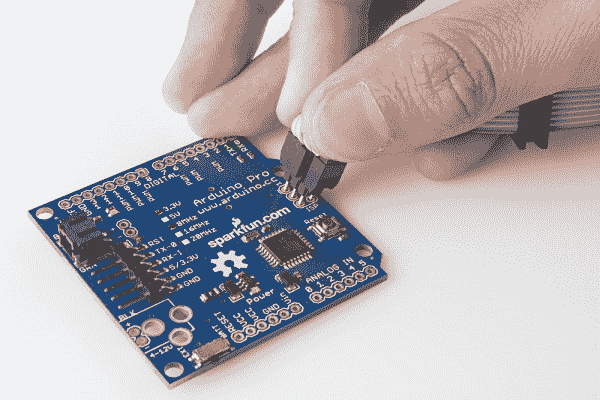](https://cdn.sparkfun.com/assets/learn_tutorials/2/1/4/action-press.jpg)

另一个无焊料选项是使用 [ISP Pogo 适配器](https://www.sparkfun.com/products/11591)，这将为您提供更可靠的电气连接。

[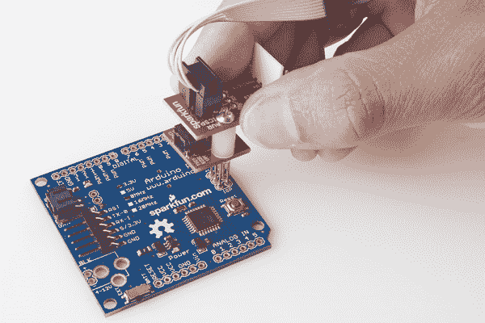](https://cdn.sparkfun.com/assets/learn_tutorials/2/1/4/action-pogo.jpg)

这两种方法都很棘手——在代码上传到 Arduino 时，你必须保持这些引脚稳定——但它们是一个很好的无焊临时选择。

## 通过命令行使用 AVRDUDE

如果你正在寻找更多的控制你的 AVR 袖珍编程器-和它连接的 AVR-跟随下面。我们将演示如何使用 [AVRDUDE](http://www.nongnu.org/avrdude/) ，这是一个用于读取、写入和操作 AVR 的开源命令行神奇工具。

如果你有 Arduino，那么你已经安装了 AVRDUDE 这是 Arduino 用来上传草图的工具。如果需要单独安装 AVRDUDE，可以查看 AVRDUDE 的下载下的[文档。如果您在任何目录下通过命令行使用 AVRDUDE 命令时遇到问题，在为您的操作系统安装 AVRDUDE 时，【avrdude-doc-X.XX.pdf】的(即**avrdude-doc-6.3.pdf**)文件特别有用。](http://download.savannah.gnu.org/releases/avrdude/)

[AVRDUDE: Downloads](http://download.savannah.gnu.org/releases/avrdude/)

### 健全性检查- AVRDUDE 路径

AVRDUDE 是一个**命令行工具**，所以，为了使用它，你需要打开[“命令提示符”(Windows)或“终端”(Mac/Linux)](https://learn.sparkfun.com/tutorials/terminal-basics/command-line-windows-mac-linux) 。为了确保 AVRDUDE 正常工作，最好先做一点检查。打开命令行，键入以下命令。

```
language:bash
avrdude 
```

您应该会看到类似下图的输出。

[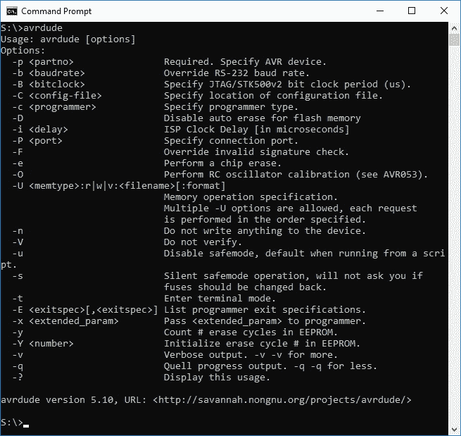](https://cdn.sparkfun.com/assets/learn_tutorials/2/1/4/avrdude_command_line_any_directory.jpg)

### 健全性检查-设备签名验证

**Note:** The following example is all assuming you have an **ATmega328P** connected at the other end of your programmer. If you have a different type of microcontroller, you'll need to formulate a slightly different command, check the [Specify Programmer and AVR Device section](https://learn.sparkfun.com/tutorials/pocket-avr-programmer-hookup-guide#device) below.

为了确保 AVRDUDE 工作正常，并且您的 AVR Pocket Programmer 连接正确，最好再做一个小的健全性检查。在命令提示符下键入以下内容:

```
language:bash
avrdude -c usbtiny -p atmega328p 
```

如果一切都连接正确，您应该得到如下响应:

[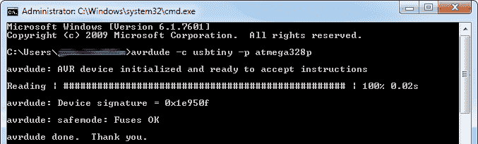](https://cdn.sparkfun.com/assets/learn_tutorials/2/1/4/avrdude-01_2.png)

这个基本命令定义了你正在使用的程序员类型和它正在与之对话的 AVR。AVRDUDE 将尝试从您的 AVR 中读取**设备签名**，这对于每种 AVR 类型都是不同的。每个 **ATmega328P** 都应该有一个`0x1E950F`的设备签名。

### 闪存编程

**Heads up!** This example assumes that the fuse bits (i.e. the low, high, and extended) are set already before flashing the .hex file. Since we are using a RedBoard Programmed with Arduino, we can flash a .hex file to the board.

既然您已经验证了一切正常，那么您就可以使用 AVRDUDE 进行各种内存读写了。你可能想写的主要内存是 flash——存储程序的非易失性内存。

**Warning!** By writing the following **blink.hex** file to your AVR microntroller, this will overwrite what is in memory. The file does not have an Arduino bootloader so you will not be able to upload via serial using the Arduino IDE until you reinstall the bootloader with your respective microcontroller. If you are following along with the RedBoard Programmed with Arduino, you can still reinstall the bootloader to upload via serial again. The board uses the **optiboot_atmega328.hex**. You can find this in the Arduino program folder similar to this path **...\arduino-1.8.5\hardware\arduino\avr\bootloaders\optiboot** or in "**Reinstalling the RedBoard's Arduino Bootloader**" later in this tutorial.

这个例子将使用 **blink.hex** 文件作为例子。下载下面的文件。如果您使用的是 **blink.hex** 文件，请确保您解压缩了该文件夹并将其放在工作目录中。

[Download Blink Here (ZIP)](https://cdn.sparkfun.com/assets/learn_tutorials/2/1/4/blink.zip)

该命令将使用十六进制文件对闪存执行基本的写操作。

```
language:bash
avrdude -c usbtiny -p atmega328p -U flash:w:blink.hex 
```

写入闪存将比读取签名位花费更长的时间。在读取、写入和验证设备时，您将看到一个文本状态栏滚动。

[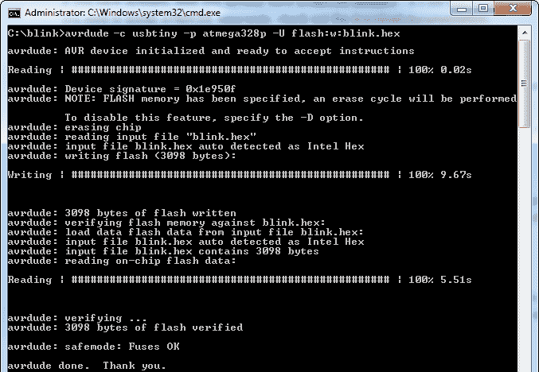](https://cdn.sparkfun.com/assets/learn_tutorials/2/1/4/avrdude-02_2.png)

`-U`选项命令处理所有的存储器读写。我们告诉它我们想使用`flash`内存，用`w`写，然后告诉它我们想写的十六进制文件的位置。

**Tip:** In some cases, you may need to specify the ***.hex** file that you are flashing. This is usually optional but you may get an error if AVRDUDE is not able to read the file.

    `Invalid File Format`

To specify, you can by add an `:i` to indicate that it is an Intel hex format:

    `avrdude -c usbtiny -p atmega328p -U flash:w:blink.hex:i`

Or `:a` to auto detect the format:

    `avrdude -c usbtiny -p atmega328p -U flash:w:blink.hex:a`

For more information, try checking the AVRDUDE's Online Documentation under the Option Description where it describes the command "`-U *memtype:op:filename[:format]*`".

[AVRDUDE Online Documentation: Option Descriptions](http://www.nongnu.org/avrdude/user-manual/avrdude_4.html#Option-Descriptions)

#### 快速阅读

`-U`命令也可用于读取 AVR 的存储器内容。例如，下面的命令将读取 AVR 的内容，并将它们存储到一个名为“ **mystery.hex** ”的文件中。

```
language:bash
avrdude -c usbtiny -p atmega328p -U flash:r:mystery.hex:r 
```

如果你想把一个 Arduino 的内容复制到另一个 Arduino 上，这是非常有用的。或者你是一个受虐狂，你想尝试逆向工程 AVR 中的神秘代码。

### 重新安装 RedBoard 的 Arduino 引导程序

现在你已经有了一个十六进制的闪存文件，试着用下面的文件重新安装引导程序。下载文件。

[RedBoard Programmed with Arduino Bootloader (HEX)](https://cdn.sparkfun.com/assets/learn_tutorials/2/1/4/optiboot_atmega328_2012_with_1s_watchdog.hex)

导航到下载引导加载程序的路径，并输入以下命令。

```
language:bash
avrdude -c usbtiny -p atmega328p -U flash:w:optiboot_atmega328_2012_with_1s_watchdog.hex 
```

如果一切顺利，您应该会收到一条消息，表明已经编写、验证并完成了上传。您应该会得到类似下面的输出。在这种情况下，配置文件(即 **avrdude.conf** )和引导加载程序( ***)。十六进制**)不在同一个工作目录中。需要另外两个命令来指定在哪里查找文件。另外， ***。通过添加`:a`刷新文件时，需要自动检测十六进制**格式。

[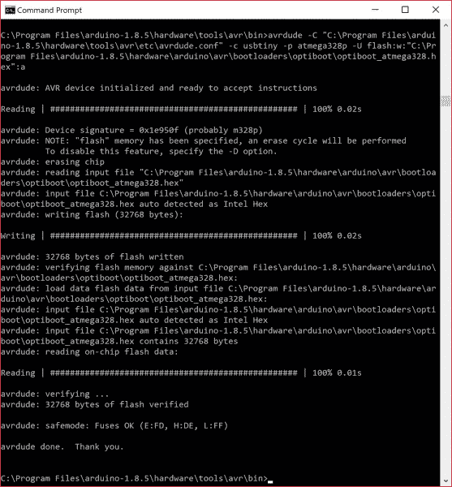](https://cdn.sparkfun.com/assets/learn_tutorials/2/1/4/avrdude-reinstall-bootloader.jpg)

回到 Arduino IDE，从您的编程器上断开 USB 电缆，并连接到 RedBoard 的 USB 端口，看看您是否可以通过串行将简单的 **blink.ino** 草图上传回该板。确保在上传前选择合适的板定义和 COM 端口。您应该会看到一条熟悉的消息，表明 Arduino IDE 已*【完成上传】*，完成后，13 号引脚上的板载 LED 开始闪烁。

**Note:** Looking for more information about [Installing an Arduino Bootloader](https://learn.sparkfun.com/tutorials/installing-an-arduino-bootloader)? Check out our tutorial below about the different methods of flashing an Arduino bootloader to an AVR chip!

[](https://learn.sparkfun.com/tutorials/installing-an-arduino-bootloader) [### 安装 Arduino 引导程序

#### 2013 年 12 月 4 日](https://learn.sparkfun.com/tutorials/installing-an-arduino-bootloader) This tutorial will teach you what a bootloader is and why you would need to install or reinstall it. We will also go over the process of burning a bootloader by flashing a hex file to an Arduino microcontroller.[Favorited Favorite](# "Add to favorites") 25

* * *

### 有用的选项

在我们让你了解 AVR 世界之前，这里有一些最后的提示和技巧。

#### [指定编程器和 AVR 设备](#device)

使用 AVRDUDE 所需的两个选项是**编程器类型**和 **AVR 设备**规格:

*   **程序员**的定义，假设你正在使用 AVR 袖珍程序员，将是`-c usbtiny`。如果您需要使用不同的程序员[，请查看此页面](http://www.nongnu.org/avrdude/user-manual/avrdude_4.html#Option-Descriptions)和`CTRL` + `F`到“ **-c 程序员 id** ”。

*   **AVR 设备**类型由`-p`选项定义。我们已经展示了几个 ATmega328P 的例子，但是如果你使用的是 ATtiny85 呢？在这种情况下，您会希望使用`-p t85`来代替。查看本页顶部的[按钮](http://www.nongnu.org/avrdude/user-manual/avrdude_4.html#Option-Descriptions)，获取兼容 AVR 设备类型的详细列表。

#### 详细输出

在你的 AVRDUDE 命令中添加一个或多个`-v`将会使动作具有不同的详细程度。如果您需要配置选项的摘要，或者需要深入了解发送到 AVR 的数据，这将非常方便。

* * *

从那里来的还有很多。查看选项描述下的 [AVRDUDE 在线文档，了解完整的命令列表。](http://www.nongnu.org/avrdude/user-manual/avrdude_4.html#Option-Descriptions)

[AVRDUDE Online Documentation: Option Descriptions](http://www.nongnu.org/avrdude/user-manual/avrdude_4.html#Option-Descriptions)

* * *

## 解决纷争

以下是解决您可能遇到的一些 AVRDUDE 错误的一些故障排除提示。

* * *

### 无法识别 AVRDUDE

如果您在从 AVRDUDE 获得响应时遇到问题，您可能会收到以下错误。这可能是由于某些环境变量或您的计算机设置阻止您正确使用 AVRDUDE。

```
language:bash
'avrdude' is not recognized as an internal or external command, operable program or batch file 
```

命令行中的错误输出可能类似于下面的屏幕截图。

[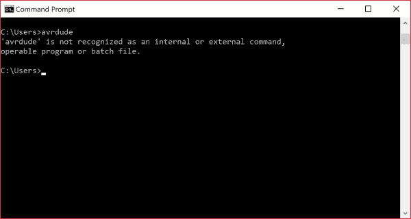](https://cdn.sparkfun.com/assets/learn_tutorials/2/1/4/avrdude-not-installed.jpg)

一个解决方案可能是尝试按照 AVRDUDE 提供的说明为您的操作系统安装它。对于 Windows，您可以自动安装 **WinAVR 20100110** ，如 AVRDUDE 文档 v6.3 第 35 页所述。

[AVRDUDE Documents v6.3 (PDF)](http://nongnu.askapache.com/avrdude/avrdude-doc-6.3.pdf)

否则，您可以移动到**avrdude.exe**所在的 Arduino IDE 程序文件夹。尝试在 Arduino 程序文件夹中进行搜索以确定路径。然后使用**光盘导航到它所在的位置..**和 **cd** 命令。在这种情况下，Arduino IDE v1.8.5 已安装并位于我的 **C:\** 驱动器的 Program Files 文件夹中**...\程序文件\ arduino-1 . 8 . 5 \硬件\工具\avr\bin** 。键入更改目录命令，导航到命令行中的正确位置。从错误的屏幕截图来看，我需要使用下面的命令向上移动目录。

```
language:bash
cd.. 
```

然后我需要进入 Arduino 的程序文件夹，它位于**C:&bsol；**开车。

```
language:bash
cd programfiles\arduino1.8.5\hardware\tools\avr\bin 
```

您的命令行应该类似于下图。

[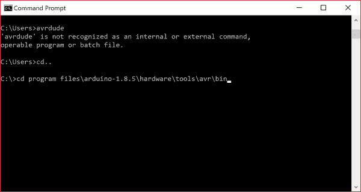](https://cdn.sparkfun.com/assets/learn_tutorials/2/1/4/avrdude-path-Arduino-command-line.jpg)

一旦你进入正确的工作目录，再次输入`avrdude`。您应该会看到类似下图的输出。

[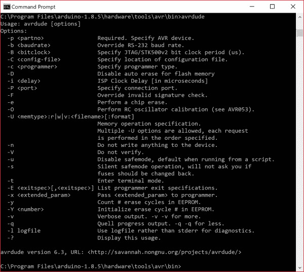](https://cdn.sparkfun.com/assets/learn_tutorials/2/1/4/correct-avrdude-path-Arduino-Command-Line.jpg)

* * *

### 找不到配置文件

如果您在读取 AVR 设备签名时遇到问题，请使用命令`avrdude -c usbtiny -p atmega328P`来验证设备；您会收到以下错误:

```
language:bash
         System wide configuration file is ""
avrdude: can't open config file "": Invalid argument
avrdude: error reading system wide configuration file "" 
```

这可能是由于 AVRDUDE 在计算机上的安装方式。在这种情况下，AVRDUDE 找不到 **avrdude.conf** 文件的位置。这可能是由于环境变量或您的计算机设置阻止您正确使用 AVRDUDE。如果您还记得之前的故障排除技巧，AVRDUDE 位于 Arduino IDE 程序文件夹中。虽然工作目录是正确的，但在 Windows 操作系统上， **avrdude.conf** 文件位于不同的文件夹中，如下面的图片所示。

[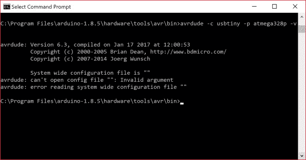](https://cdn.sparkfun.com/assets/learn_tutorials/2/1/4/avrdude_Configuration_File_Not_Found.jpg)

最简单的解决方案是按照 [avrdude-docs (v6.3)](http://nongnu.askapache.com/avrdude/avrdude-doc-6.3.pdf) 中的说明，自动为您的操作系统安装环境设置。对于 Windows，你可以安装 **WinAVR 20100110** ，在 AVRDUDE 文档 v6.3 的第 35 页有简要说明

[AVRDUDE Documents v6.3 (PDF)](http://nongnu.askapache.com/avrdude/avrdude-doc-6.3.pdf)

否则，您可以使用`-C`命令并用引号(`"...\avrdude.conf"`)提供文件 **avrdude.conf** 所在的路径。对于 Arduino IDE v1.8.5，它位于**...arduino-1 . 8 . 5&bsol；硬件&bsol；工具&bsol；AVR&bsol；etc** 目录。假设您在工作目录中有 AVRDUDE，该命令应该类似于下面的命令来读取 ATmega328P。

```
language:bash
avrdude -C "C:\Program Files\arduino-1.8.5\hardware\tools\avr\etc\avrdude.conf" -c usbtiny -p atmega328p 
```

使用配置文件成功读取设备签名应该类似于下面的输出。

[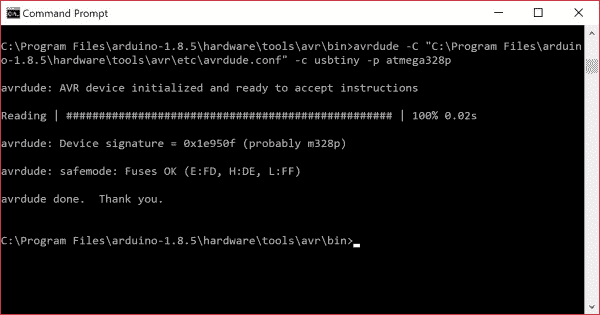](https://cdn.sparkfun.com/assets/learn_tutorials/2/1/4/avrdude_Successful_Target_Read.jpg)

* * *

### 驱动程序相关问题

如果您运行 AVRDUDE 命令并收到以下错误，问题可能与设备 ID 为`0x1781/0xc9f`的 AVR 编程器的驱动程序有关。驱动程序没有安装或者存在驱动程序冲突。

```
language:bash
avrdude: Error: Could not find USBtiny device (0x1781/0xc9f) 
```

#### 未安装驱动程序

一个解决方案是确保如前所述安装[驱动程序](https://learn.sparkfun.com/tutorials/pocket-avr-programmer-hookup-guide#installing-drivers)。您可能还想尝试另一条 USB 电缆，或者将 AVR 编程器拔下/重新插回您的 COM 端口。命令行中的错误输出可能类似于下面的屏幕截图。

[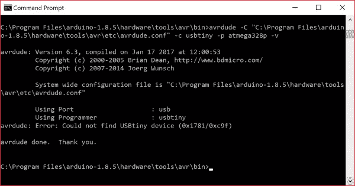](https://cdn.sparkfun.com/assets/learn_tutorials/2/1/4/avrdude_Pocket_AVR_Programmer_Drivers_Not_Installed.jpg)

#### 驱动因素冲突

如果您已经安装了正确的驱动程序，如前所述，有可能存在驱动程序冲突。您会收到同样的错误，但是解决方案可能没有您想象的那么直观。下面截图中的输出是在使用微型 AVR 编程器验证 ATtiny85 的设备签名时出现的。驱动程序安装正确，并已与袖珍 AVR 编程器。然而，小小的 AVR 编程器还是没有被认出来。

[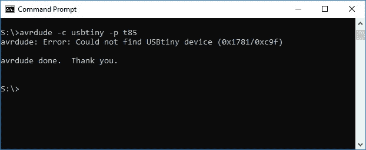](https://cdn.sparkfun.com/assets/learn_tutorials/2/1/4/Tiny_AVR_Programmer_Drivers_Not_Installed_Correctly.jpg)

打开设备管理器，微型 AVR 编程器显示为不同的驱动程序(即 **FabISP** )和名称，如下所示。

[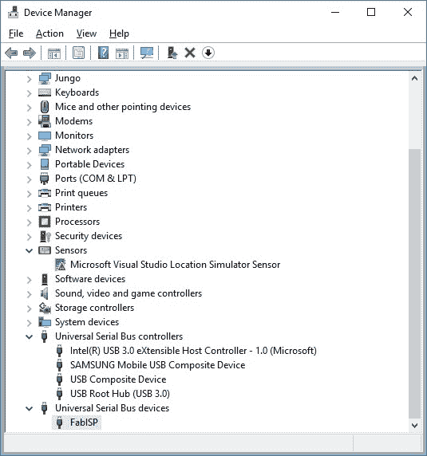](https://cdn.sparkfun.com/assets/learn_tutorials/2/1/4/Driver_Conflicts_and_Programmer_Shows_Up_as_Different_Driver_FabISP.jpg)**Note:** In some cases, the driver may appear under **libusb-win32 devices** > **FabISP**. If the drivers listed inder the **libusb-win32 devices** tree fail to work, you will need to follow the directions to reinstall the driver.

[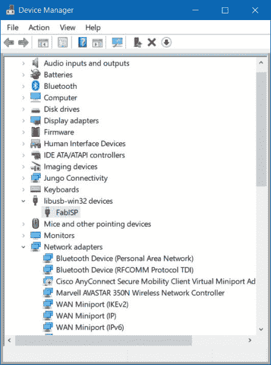](https://cdn.sparkfun.com/assets/learn_tutorials/1/5/0/Renaming_Device_Driver.jpg)

解决方案是右键单击并删除驱动程序。只需右击它枚举的 COM 端口，并选择“**卸载设备**”。

[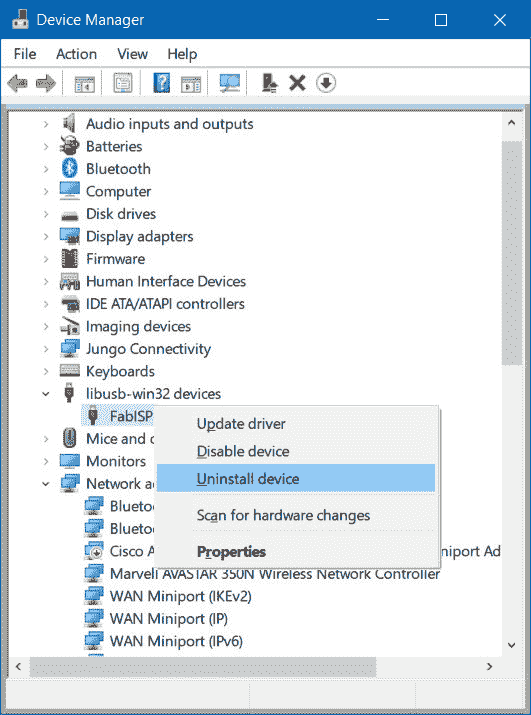](https://cdn.sparkfun.com/assets/learn_tutorials/1/5/0/Uninstall_Conflicting_Programmer_Driver.jpg)

您可能会看到弹出一个类似下图的窗口。点击标有**的按钮卸载**。在某些情况下，Windows 可能会提供一个选项给**“删除这个设备的驱动软件”**如果提供了该选项，只需在点击按钮卸载前勾选复选框。

[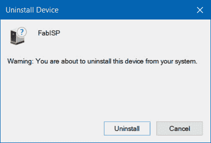](https://cdn.sparkfun.com/assets/learn_tutorials/1/5/0/Uninstall_Conflicting_Device_Driver.jpg)

卸载后，通过从 USB 端口拔下/重新插入微型 AVR 编程器，重启编程器。回到安装驱动程序部分，按照说明使用 Zadig 自动安装驱动程序。


[Installing Drivers: Automatically Install the Drivers with Zadig](https://learn.sparkfun.com/tutorials/pocket-avr-programmer-hookup-guide#automatic-install)

* * *

### 连接 AVR 编程器时出错

如果您收到类似以下输出的错误，这可能是由于连接到 AVR 编程器。

```
language:bash
avrdude: error: usbtiny_transmit:
avrdude: initialization failed, rc=-1
         Double check connections and try again, or use -F to override this check.

avrdude:error: usbtiny_transmit: 
```

一个解决办法是尝试拔掉 AVR 编程器，然后再插回你的 COM 端口。您可能还想检查 USB 电缆或确保驱动程序安装正确。命令行中的输出可能类似于下面的屏幕截图。

[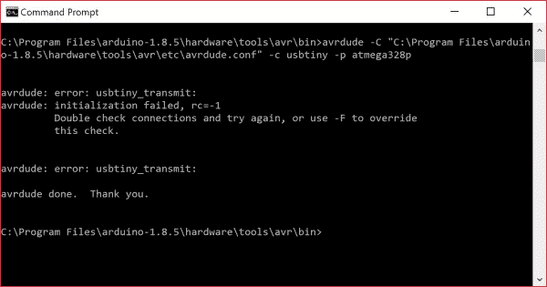](https://cdn.sparkfun.com/assets/learn_tutorials/2/1/4/avrdude_Error_Connecting_to_Target.jpg)

* * *

**Heads Up!** The following are only a few errors that we have run into when using AVRDUDE. To browse other common issues and how to troubleshoot, you may want to try checking the AVRDUDE online manual.

[AVRDUDE Online Manual: Troubleshooting](http://www.nongnu.org/avrdude/user-manual/avrdude_20.html#Troubleshooting)
Or do a search online with the error that you are having and check different forums to see if anyone else has run into the same issues as you have.

## 资源和更进一步

既然您已经成功地启动并运行了您的 Pocket AVR 编程器，那么是时候将它合并到您自己的项目中了！

如果你需要的话，这里有更多的 AVR Pocket Programmer 相关资源:

*   [示意图(PDF)](http://www.sparkfun.com/datasheets/Programmers/AVR-Pocket-Programmer-v15.pdf)
*   [老鹰文件(ZIP)](http://www.sparkfun.com/datasheets/Programmers/AVR-Pocket-Programmer-v15.zip)
*   开源代码库
    *   [产品报告](https://github.com/sparkfun/Pocket_AVR_Programmer) -从 PCB 设计文件、固件到定制外壳设计，这里应有尽有。
    *   [固件](https://github.com/sparkfun/Pocket_AVR_Programmer/tree/master/Firmware)
*   司机
    *   [Zadig v2.0.1.160 软件和 USBtiny (ZIP)](https://cdn.sparkfun.com/assets/learn_tutorials/2/1/4/zadig_v2.0.1.160.zip) -用于自动安装
    *   [USB tiny libusb-win32(ZIP)](https://cdn.sparkfun.com/assets/learn_tutorials/2/1/4/usbtinyisp_libusb-win32_1.2.1.0.zip)-用于手动安装
    *   [GitHub:签名 USBTiny 驱动](https://github.com/SparkfunTechSupport/Additional-files/tree/master/PGM-11801) -如果前 3 个选项安装失败
*   [AVRDUDE 在线手册](http://www.nongnu.org/avrdude/user-manual/avrdude.html)
    *   [高级故障排除](http://www.nongnu.org/avrdude/user-manual/avrdude_20.html#Troubleshooting) -常见错误可在本故障排除部分找到。

我们有更多的教程。如果你正在寻找更多的东西来学习，或者正在寻找一些项目灵感，看看这些教程吧！

*   [安装 Arduino 引导程序](https://learn.sparkfun.com/tutorials/installing-an-arduino-bootloader) -使用 AVR 袖珍编程器将引导程序加载到 Arduino 上。本教程将教你什么是引导加载程序，为什么你需要安装/重新安装它，并回顾这样做的过程。
*   [微型 AVR 编程器连接指南](https://learn.sparkfun.com/tutorials/tiny-avr-programmer-hookup-guide) -如果你想专门为 ATtiny85 编程，请查看[微型 AVR 编程器](https://www.sparkfun.com/products/11801)。
*   [使用 Arduino Pro Mini 3.3V](https://learn.sparkfun.com/tutorials/using-the-arduino-pro-mini-33v) -如果您已经在直接对您的 Arduino 进行编程，请使用 Arduino Pro Mini 更进一步。
*   [使用电动 Imp 的无线 Arduino 编程](https://learn.sparkfun.com/tutorials/wireless-arduino-programming-with-electric-imp) -如果你觉得受到 USB 电缆的限制，请查看我们将代码无线上传到 Arduino 的教程！
*   [无线 XBee/AVR 引导加载](https://www.sparkfun.com/tutorials/122) -使用您的 AVR 袖珍编程器上传自定义引导加载程序，然后无线编程您的 Arduino。

[](https://learn.sparkfun.com/tutorials/installing-an-arduino-bootloader) [### 安装 Arduino 引导程序](https://learn.sparkfun.com/tutorials/installing-an-arduino-bootloader) This tutorial will teach you what a bootloader is and why you would need to install or reinstall it. We will also go over the process of burning a bootloader by flashing a hex file to an Arduino microcontroller.[Favorited Favorite](# "Add to favorites") 25[](https://learn.sparkfun.com/tutorials/using-the-arduino-pro-mini-33v) [### 使用 Arduino Pro Mini 3.3V](https://learn.sparkfun.com/tutorials/using-the-arduino-pro-mini-33v) This tutorial is your guide to all things Arduino Pro Mini. It explains what it is, what it's not, and how to get started using it.[Favorited Favorite](# "Add to favorites") 16[](https://learn.sparkfun.com/tutorials/tiny-avr-programmer-hookup-guide) [### 微型 AVR 编程器连接指南](https://learn.sparkfun.com/tutorials/tiny-avr-programmer-hookup-guide) A how-to on the Tiny AVR Programmer. How to install drivers, hook it up, and program your favorite Tiny AVRs using AVRDUDE 11[](https://learn.sparkfun.com/tutorials/wireless-arduino-programming-with-electric-imp) [### 带电动 Imp 的无线 Arduino 编程](https://learn.sparkfun.com/tutorials/wireless-arduino-programming-with-electric-imp) Reprogram your Arduino from anywhere in the world using the Tomatoless Boots wireless bootloader with the Electric Imp.[Favorited Favorite](# "Add to favorites") 9

您是否希望使用 Pi 将更大的文件闪存到 AVR 微控制器中？试试看看 Pi AVR 程序员帽！

[](https://learn.sparkfun.com/tutorials/pi-avr-programmer-hat-hookup-guide) [### Pi AVR 程序员帽连接指南

#### 2018 年 7 月 26 日](https://learn.sparkfun.com/tutorials/pi-avr-programmer-hat-hookup-guide) In this tutorial, we will use a Raspberry Pi 3 and the Pi AVR Programmer HAT to program an ATMega328P target. We are going to first program the Arduino bootloader over SPI, and then upload an Arduino sketch over a USB serial COM port.[Favorited Favorite](# "Add to favorites") 3************