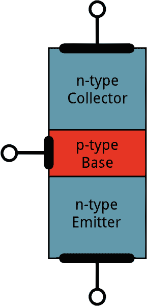

# 晶体管

> 原文：<https://learn.sparkfun.com/tutorials/transistors>

## 介绍

晶体管使我们的电子世界运转。几乎在所有现代电路中，它们都是至关重要的控制源。有时你会看到它们，但更多的时候它们隐藏在集成电路芯片的深处。在本教程中，我们将向您介绍周围最常见的晶体管的基础知识:双极结型晶体管(BJT)。

在小而分散的数量中，晶体管可以用来创建简单的电子开关、[数字逻辑](https://learn.sparkfun.com/tutorials/digital-logic)和信号放大电路。数以千计、数百万计甚至数十亿计的晶体管相互连接并嵌入到微小的芯片中，以制造计算机存储器、微处理器和其他复杂的集成电路。

### 本教程涵盖的内容

通读本教程后，我们希望你对晶体管的工作原理有一个大致的了解。我们不会深究半导体物理或等效模型，但我们会深入到足以让你理解晶体管如何被用作开关或放大器的程度。

本教程分为一系列部分，包括:

*   [符号、引脚和结构](https://learn.sparkfun.com/tutorials/transistors/symbols-pins-and-construction) -解释晶体管三个引脚之间的区别。
*   [扩展水的比喻](https://learn.sparkfun.com/tutorials/transistors/extending-the-water-analogy)——回到水的比喻来解释晶体管如何像阀门一样工作。
*   [工作模式](https://learn.sparkfun.com/tutorials/transistors/operation-modes) -晶体管四种可能工作模式的概述。
*   [应用 I:开关](https://learn.sparkfun.com/tutorials/transistors/applications-i-switches) -展示晶体管如何用作电子控制开关的应用电路。
*   [应用 II:放大器](https://learn.sparkfun.com/tutorials/transistors/applications-ii-amplifiers) -更多应用电路，这次展示晶体管如何用于放大电压或电流。

有两种类型的基本晶体管:双极结型(BJT)和金属氧化物场效应晶体管(MOSFET)。在本教程中，我们将**关注 BJT** ，因为它稍微容易理解一些。更深入地挖掘晶体管类型，实际上有两种版本的 BJT: **NPN** 和 **PNP** 。我们将把我们的焦点进一步集中在 NPN 上。通过缩小我们的关注范围——获得对 NPN 的可靠理解——通过比较它与 NPN 的不同之处，理解 PNP(甚至 MOSFETS)将会更容易。

&nbsp

&nbsp

### 推荐阅读

在深入本教程之前，我们强烈建议浏览一下这些教程:

*   [电压、电流、电阻和欧姆定律](https://learn.sparkfun.com/tutorials/voltage-current-resistance-and-ohms-law)——电子学基础介绍。
*   [电学基础知识](https://learn.sparkfun.com/tutorials/what-is-electricity) -我们将讨论一下作为电子流动的电学。在本教程中找出这些电子是如何流动的。
*   [电功率](https://learn.sparkfun.com/tutorials/electric-power) -晶体管的主要应用之一是放大-增加信号的功率。增加功率意味着我们可以增加电流或电压，在本教程中找出原因。
*   [二极管](https://learn.sparkfun.com/tutorials/diodes) -晶体管是半导体器件，就像二极管一样。在某种程度上，这就是你将两个二极管堆叠在一起，并将它们的阳极绑在一起。理解二极管的工作原理将对揭示晶体管的工作原理大有帮助。

## 想探索晶体管吗？

我们掩护你！

 

将**添加到您的[购物车](https://www.sparkfun.com/cart)中！**

 **### [SparkFun 初学者配件包](https://www.sparkfun.com/products/13973)

[28 available](https://learn.sparkfun.com/static/bubbles/ "28 available") KIT-13973

SparkFun 初学者配件包是一个包含常用配件的小容器，为您提供所有的基本组件…

$18.5012[Favorited Favorite](# "Add to favorites") 84[Wish List](# "Add to wish list")**** 

将**添加到您的[购物车](https://www.sparkfun.com/cart)中！**

 **### [SparkFun 分立半导体套件](https://www.sparkfun.com/products/13682)

[In stock](https://learn.sparkfun.com/static/bubbles/ "in stock") KIT-13682

SparkFun 分立半导体套件满足了您只需要一个或几个晶体管而不需要…

$12.956[Favorited Favorite](# "Add to favorites") 62[Wish List](# "Add to wish list")**** 

将**添加到您的[购物车](https://www.sparkfun.com/cart)中！**

 **### [晶体管- NPN，50V 800mA (BC337)](https://www.sparkfun.com/products/13689)

[In stock](https://learn.sparkfun.com/static/bubbles/ "in stock") COM-13689

这是 BC337，一种 NPN 硅 BJT(双极结型晶体管)。这个小晶体管可以帮助你的项目…

$0.55[Favorited Favorite](# "Add to favorites") 20[Wish List](# "Add to wish list")**** 

将**添加到您的[购物车](https://www.sparkfun.com/cart)中！**

 **### [晶体管- NPN，60V 200mA (2N3904)](https://www.sparkfun.com/products/521)

[In stock](https://learn.sparkfun.com/static/bubbles/ "in stock") COM-00521

这些是由 ST Micro 制造的非常普通的高质量 BJT NPN 晶体管。

$0.55[Favorited Favorite](# "Add to favorites") 13[Wish List](# "Add to wish list")****************[See all transistors](https://www.sparkfun.com/categories/352)

* * *********  ********## 符号、大头针和构造

晶体管基本上是三端器件。在双极结型晶体管(BJT)上，这些引脚被标记为**集电极**(C)**基极** (B)和**发射极** (E)。NPN 和 PNP BJT 的电路符号如下:

NPN 和 PNP 之间的唯一区别是发射极上箭头的方向。NPN 上的箭头指向外，PNP 上的箭头指向内。记住哪个是哪个是有用的记忆术:

## NPN:**N**ot**P**ointing I**N**

逆向逻辑，但很管用！

### 晶体管结构

晶体管依靠半导体来发挥它们的魔力。半导体是一种既不是纯导体(如铜线)也不是绝缘体(如空气)的材料。半导体的导电性——它允许电子流动的难易程度——取决于温度或电子数量的多少等变量。让我们简单地看一下晶体管的内部。别担心，我们不会太深入地钻研量子物理。

#### 一个晶体管相当于两个二极管

晶体管有点像另一个半导体元件的延伸:二极管。在某种程度上，晶体管只是两个阴极(或阳极)连在一起的二极管:

连接基极和发射极的二极管在这里很重要；它与示意图符号上的箭头方向一致，并向您显示电流打算从哪个方向流过晶体管。

二极管表示法是一个很好的起点，但远远不够准确。不要把你对晶体管工作的理解建立在那个模型上(当然也不要试图在试验板上复制它，那是行不通的)。有一大堆奇怪的量子物理层面的东西控制着三个终端之间的相互作用。

(如果你需要测试晶体管，这个模型*是*有用的。使用[万用表](https://learn.sparkfun.com/tutorials/how-to-use-a-multimeter)上的二极管(或电阻)测试功能，你可以测量 BE 和 BC 端子来检查那些“二极管”的存在。)

#### 晶体管结构和操作

晶体管是由三层不同的半导体材料堆叠而成的。其中一些层添加了额外的电子(这一过程称为“掺杂”)，而其他层则去除了电子(掺杂了“空穴”，即没有电子)。多出了*个*电子的半导体材料被称为 **n 型**(因为电子带负电荷，所以 *n* 表示负电)，去掉电子的材料被称为 **p 型**(表示正电)。晶体管是通过将一个 *n* 堆叠在一个 *p* 的顶部，再将一个 *n* 堆叠在一个 *p* 之上，或者将*p*堆叠在 *n* 之上 *p* 之上。

*Simplified diagram of the structure of an NPN. Notice the origin of any acronyms?*

手一挥，我们可以说**电子可以很容易地从 *n* 区流向 *p* 区**，只要有一点力(电压)推动它们。但是从一个 *p* 区流到一个 *n* 区真的很难(需要 *lot* 的电压)。但是晶体管的特殊之处——使我们的双二极管模型过时的部分——是这样一个事实:只要基极-发射极结正向偏置(意味着基极比发射极的电压高),电子就可以轻易地从 p 型基极流向 n 型集电极。

NPN 晶体管被设计成将电子从发射极传递到集电极(因此传统的电流从集电极流到发射极)。发射器向基极“发射”电子，基极控制发射器发射的电子数量。大多数发射出的电子被收集器“收集”起来，然后被送到电路的下一部分。

PNP 以相同但相反的方式工作。基极仍然控制着电流，但电流的流向相反——从发射极流向集电极。发射器发射的不是电子，而是由收集器收集的“空穴”(概念上没有电子)。

晶体管有点像一个电子阀。基极引脚就像一个手柄，你可以调节它，让更多或更少的电子从发射极流向集电极。让我们进一步研究这个类比...

* * *

## 扩展水的类比

如果你最近读了很多电学概念教程，你可能已经习惯了[水](https://learn.sparkfun.com/tutorials/alternating-current-ac-vs-direct-current-dc/alternating-current-ac)T2 的类比。我们说电流类似于水的流速，电压是推动水通过管道的压力，电阻是管道的宽度。

不出所料，水的类比也可以扩展到晶体管:晶体管就像一个水阀(T1)，一种我们可以用来控制流速(T3)的机制(T2)。

我们可以在三种状态下使用阀门，每种状态对系统中的流量都有不同的影响。

### 1)开-短路

阀门可以完全打开，让水自由流动，就好像阀门不存在一样。

同样，在正确的情况下，晶体管可以看起来像集电极和发射极引脚之间的短路。电流自由地流过集电极，流出发射极。

### 2)关-开路

当阀门关闭时，它可以完全停止水流。

同样，晶体管可以用来在集电极和发射极引脚之间创建一个**开路**。

### 3)线性流量控制

通过一些精确的调整，可以调整阀门来精细地**控制流速**到完全打开和关闭之间的某个点。

晶体管可以做同样的事情- **在完全关断(开路)和完全导通(短路)之间的某个点线性控制通过电路的电流**。

从我们的水类比来看，管道的宽度类似于电路中的[电阻](https://learn.sparkfun.com/tutorials/voltage-current-resistance-and-ohms-law/resistance)。如果一个阀门可以微调管子的宽度，那么一个晶体管就可以微调集电极和发射极之间的电阻。所以，在某种程度上，晶体管就像一个**变量，可调电阻**。

### 放大功率

对此我们还可以做另一个类比。想象一下，只要轻轻转动一个阀门，你就可以控制胡佛大坝闸门的流速。你转动那个旋钮时所用的微不足道的力量，却有可能产生一股强大数千倍的力量。我们把这个类比延伸到了极限，但是这个想法也适用于晶体管。晶体管很特别，因为它们可以**放大**电信号，将低功率信号转化为类似的高功率信号。

* * *

算是吧。还有很多，但这是一个很好的起点！查看下一部分，了解晶体管操作的更详细的解释。

* * *

## 操作模式

不像[电阻器](https://learn.sparkfun.com/tutorials/resistors)强制电压和电流之间的线性关系，晶体管是非线性器件。它们有四种不同的工作模式，描述流经它们的电流。(当我们谈论流经晶体管的电流时，我们通常指的是从 NPN 的集电极流向发射极的**电流。)**

四种晶体管工作模式是:

*   **饱和** -晶体管就像一个**短路**。电流自由地从集电极流向发射极。
*   **截止** -晶体管就像一个**开路**。没有电流从集电极流向发射极。
*   **激活** -从集电极到发射极的电流与流入基极的电流成比例**。**
*   **反向激活** -与激活模式一样，电流与基极电流成正比，但反向流动。电流从发射极流向集电极(不完全是晶体管的设计目的)。

要确定晶体管处于哪种模式，我们需要查看三个引脚上的电压，以及它们之间的关系。从基极到发射极的电压(V [为])和从基极到集电极的电压(V [BC] )设置晶体管的模式:

上面的简化象限图显示了这些端子上的正负电压如何影响模式。实际上要比这复杂一点。

让我们分别看看所有四种晶体管模式；我们将研究如何将器件置于该模式，以及它对电流有何影响。

**注:**本页大部分内容聚焦于 **NPN 晶体管**。要理解 PNP 晶体管如何工作，只需翻转极性或>和<符号。

#### 饱和模式

饱和是晶体管在模式下的**。饱和模式下的晶体管就像集电极和发射极之间的短路。**

在饱和模式下，晶体管中的两个“二极管”都正向偏置。这意味着 V [BE] 必须大于 0，*和*也必须大于 V [BC] 。换句话说，V [B] 必须高于 V [E] 和 V [C] 。

因为从基极到发射极的结看起来就像一个[二极管](https://learn.sparkfun.com/tutorials/diodes/real-diode-characteristics#forward_drop)，实际上，V [BE] 必须大于一个**阈值电压**才能进入饱和。这种电压降有许多缩写——V[th]，V [γ] ，V [d] 是其中几个——实际值因晶体管而异(甚至因温度而异)。对于许多晶体管(室温下),我们可以估计这一压降约为 0.6V。

另一个现实问题是:发射极和集电极之间不会有完美的传导。在这些节点之间将形成小的电压降。晶体管数据表将该电压定义为 **CE 饱和电压 V [CE(sat)]** -饱和所需的集电极到发射极的电压。该值通常约为 0.05-0.2V。该值意味着 V [C] 必须略大于 V [E] (但仍小于 V [B] )才能使晶体管处于饱和模式。

#### 截止模式

截止模式与饱和相反。处于截止模式的晶体管**关闭** -没有集电极电流，因此没有发射极电流。它几乎看起来像一个开路。

要使晶体管进入截止模式，基极电压必须低于发射极和集电极电压。V [BC] 和 V [BE] 必须都是负数。

实际上，V [BE] 可以是 0V 和 V [th] (~0.6V)之间的任何值，以实现截止模式。

#### 有源方式

要在主动模式下工作，晶体管的 V [BE] 必须大于零，V [BC] 必须为负。因此，基极电压必须低于集电极，但高于发射极。这也意味着集电极必须大于发射极。

实际上，我们需要一个从基极到发射极的非零**正向压降**(缩写为 V [th] ，V [γ] ，或者 V [d] )来“导通”晶体管。通常这个电压通常在 0.6V 左右。

##### 主动模式下的放大

主动模式是晶体管最强大的模式，因为它将器件变成了一个**放大器**。流入基极引脚的电流会放大流入集电极和流出发射极的电流。

我们对晶体管的**增益**(放大系数)的速记符号是 *β* (你也可以把它看作*β[F]，或者 *h [FE]* )。β使集电极电流( *I [C]* )与基极电流( *I [B]* )成线性关系:*

*β* 的实际值因晶体管而异。通常是 100 左右的**，但也可能从 50 到 200 不等...甚至是 2000，这取决于你使用的是哪种晶体管以及有多少电流流过它。例如，如果晶体管的β值为 100，这意味着输入基极的 1mA 电流会产生 100mA 的电流通过集电极。**

*Active mode model. V[BE] = V[th], and I[C] = βI[B].*

发射极电流呢，I [E] ？在有源模式下，集电极和基极电流*进入*器件，I [E] 输出。为了将发射极电流与集电极电流联系起来，我们有另一个常量: **α** 。α是共基极电流增益，它与这些电流的关系如下:

α通常*非常*接近但小于 1。也就是说**T3 I[C]非常接近，但是在主动模式下小于*I[E]T10***。

您可以使用β来计算α，反之亦然:

例如，如果β是 100，那就意味着α是 0.99。所以，例如，如果 I [C] 是 100 毫安，那么 I [E] 是 101 毫安。

#### 反向激活

正如饱和是截止的反义词，反向主动模式是主动模式的反义词。反向有源模式下的晶体管导通，甚至放大，但电流以相反的方向流动，从发射极到集电极。反向主动模式的缺点是β(本例中为β [R] )比*小得多*。

要将晶体管置于反向活动模式，发射极电压必须大于基极电压，基极电压必须大于集电极电压(V [BE] < 0，V [BC] > 0)。

反向激活模式通常不是你想要驱动晶体管的状态。知道它的存在很好，但它很少被设计到应用程序中。

### 与 PNP 有关

在我们讨论了本页的所有内容之后，我们仍然只涉及了 BJT 光谱的一半。PNP 晶体管呢？PNP 的工作很像 NPN 的——它们有同样的四种模式——但是一切都颠倒了。要找出 PNP 晶体管处于哪种模式，反转所有的< and >符号。

例如，要使 PNP 达到饱和，V [C] 和 V [E] 必须高于 V [B] 。将基极拉低以开启 PNP，使其高于集电极和发射极以关闭 PNP。此外，要将 PNP 置于激活模式，V [E] 的电压必须高于 V [B] ，而 V [C] 的电压必须高于 V[B]。

总而言之:

| 电压关系 | NPN 模式 | PNP 模式 |
| V[E]V[B]V[C] | 活跃的 | 反面的 |
| V[E]V[B]V[C] | 浸透 | 近路 |
| V[E]V[B]V[C] | 近路 | 浸透 |
| V[E]V[B]V[C] | 反面的 | 活跃的 |

npn 和 PNP 的另一个相反特征是电流的方向。在激活和饱和模式下，PNP 中的**电流从发射极流向集电极**。这意味着发射极的电压通常比集电极高。

* * *

如果你对概念性的东西感到厌倦，就去下一部分看看。了解晶体管工作原理的最好方法是在真实电路中研究它。我们来看一些应用！

* * *

## 应用一:开关

晶体管最基本的应用之一是用它来控制电流流向电路的另一部分——把它当作一个电开关。在截止或饱和模式下驱动它，晶体管可以产生开关的二进制开/关效果。

晶体管开关是关键的电路构建模块；它们被用来制造逻辑门，进而制造微控制器、微处理器和其他 T2 集成电路。下面是几个示例电路。

### 晶体管开关

让我们看看最基本的晶体管开关电路:一个 NPN 开关。这里我们用一个 NPN 来控制一个大功率 LED:

我们的控制输入流入基极，输出连接到集电极，发射极保持固定电压。

虽然一个[正常开关](https://learn.sparkfun.com/tutorials/button-and-switch-basics)需要一个致动器被物理翻转，但是这个开关是由管脚的电压控制的。一个微控制器 I/O 引脚，就像那些在 [Arduino](https://learn.sparkfun.com/tutorials/what-is-an-arduino) 上的引脚，可以被编程为变高或变低来打开或关闭 LED。

当基极电压大于 0.6V(或者不管你的晶体管的 V [th] 可能是多少)，晶体管开始饱和，看起来像集电极和发射极之间短路。当基极电压低于 0.6V 时，晶体管处于截止模式——没有电流流动，因为它看起来像 C 和 e 之间的开路。

上面的电路被称为**低端开关**，因为开关——我们的晶体管——在电路的低端(地)。或者，我们可以使用 PNP 晶体管来创建高端开关:

与 NPN 电路类似，基极是我们的输入，发射极连接到恒定电压。然而这一次，发射极连接到高电平，负载连接到接地端的晶体管。

这个电路的工作原理和基于 NPN 的开关一样好，但是有一个巨大的区别:为了“打开”负载，基极必须很低。这可能会导致复杂性，特别是如果负载的高电压(图中 V [CC] 为 12V，连接到发射极 V [E] )高于我们的控制输入的高电压。例如，如果您试图使用 5V 操作的 Arduino 来关闭 12V 电机，此电路将不起作用。在这种情况下，**不可能关闭开关**，因为 V [B] (连接到控制引脚)将总是小于 V [E] 。

#### 基极电阻！

你会注意到，每个电路都在控制输入和晶体管基极之间使用一个串联电阻。别忘了加这个电阻！基极没有电阻的晶体管就像没有[限流电阻](https://learn.sparkfun.com/tutorials/resistors/example-applications#current-limiting)的 LED。

回想一下，在某种程度上，晶体管只是一对相互连接的二极管。我们正向偏置基极-发射极二极管来开启负载。二极管只需要 0.6V 就可以导通，电压越高意味着电流越大。一些晶体管的额定最大电流可能只有 10-100 毫安。如果你提供的电流超过最大额定值，晶体管可能会爆炸。

我们的控制源和基极**之间的串联电阻限制流入基极**的电流。基极-发射极节点可以获得 0.6V 的快乐压降，电阻可以降低剩余的电压。电阻器的值和其上的电压将决定电流。

电阻器需要足够大以有效地限制电流，但又足够小以向基极提供足够的电流。1mA 到 10mA 通常就足够了，但是要检查你的晶体管数据表以确保这一点。

### 数字逻辑

晶体管可以组合起来创造出我们所有的基本[逻辑门](https://learn.sparkfun.com/tutorials/digital-logic):与、或、与非。

(注意:现在 MOSFETS 比 BJT 更可能被用来制造逻辑门。MOSFETs 的能效更高，因此是更好的选择。)

#### 换流器

这里有一个晶体管电路，实现了一个**反相器**，或称非门:

*An inverter built out of transistors.*

这里，进入基极的高电压将导通晶体管，这将有效地将集电极连接到发射极。由于发射极直接接地，集电极也会接地(虽然会稍微高一点，大约在 V [CE(sat)] ~ 0.05-0.2V 左右)。另一方面，如果输入低，晶体管看起来像一个开路，输出被拉至 VCC

(这实际上是一种基本的晶体管配置，称为**共发射极**。稍后会详细介绍。)

#### 与门

这里有一对晶体管用于创建一个 **2 输入与门**:

*2-input AND gate built out of transistors.*

如果任一晶体管被关断，则第二晶体管集电极的输出将被拉低。如果两个晶体管都“导通”(基极都为高)，那么电路的输出也为高。

#### 或门

最后，这里有一个**双输入 OR 门**:

*2-input OR gate built out of transistors.*

在该电路中，如果 A 或 B 中任一个(或两个)为高，则相应的晶体管将导通，并将输出拉高。如果两个晶体管都关断，则通过电阻将输出拉低。

### h 桥

H 桥是一种基于晶体管的电路，能够顺时针和逆时针驱动电机。这是一条非常受欢迎的赛道——无数机器人背后的驱动力，这些机器人必须能够向前移动*和向后移动*。

基本上，H 桥是四个晶体管的组合，具有两个输入线路和两个输出:

*Can you guess why it's called an H bridge?*

(注意:一个设计良好的 H 桥通常还包括反激二极管、基极电阻和施密特触发器。)

如果两个输入都是相同的电压，输出到电机的电压也是相同的，电机将不能旋转。但是如果两个输入相反，电机就会朝一个方向或另一个方向旋转。

H 桥有一个真值表，看起来有点像这样:

| 输入 A | 输入 B | 产出 A | 产出 B | 马达方向 |
| Zero | Zero | one | one | 停止(制动) |
| Zero | one | one | Zero | 顺时针方向的 |
| one | Zero | Zero | one | 逆时针方向 |
| one | one | Zero | Zero | 停止(制动) |

### 振荡器

振荡器是一种产生在高电压和低电压之间摆动的周期性信号的电路。振荡器用于各种电路:从简单的 LED 闪烁到产生时钟信号驱动微控制器。有很多方法可以创建振荡器电路，包括石英晶体、运算放大器，当然还有晶体管。

这里有一个振荡电路的例子，我们称之为**非稳态多谐振荡器**。通过使用**反馈**，我们可以使用一对晶体管来产生两个互补的振荡信号。

除了两个晶体管之外，[电容](https://learn.sparkfun.com/tutorials/capacitors)才是这个电路的真正关键。这些电容交替充电和放电，使得两个晶体管交替导通和截止。

分析该电路的操作是对电容和晶体管操作的极好研究。首先，假设 C1 充满电(储存大约 V [CC] 的电压)，C2 放电，Q1 开启，Q2 关闭。接下来会发生什么:

*   如果 Q1 接通，那么 C1 的左极板(在原理图上)连接到大约 0V。这将允许 C1 通过 Q1 的收集器放电。
*   当 C1 放电时，C2 通过较低阻值的电阻 R4 快速充电。
*   一旦 C1 完全放电，其右极板将被拉高至约 0.6V，这将开启 Q2。
*   在这一点上，我们交换了状态:C1 放电，C2 充电，Q1 关闭，Q2 开启。现在我们用另一种方式跳同样的舞。
*   Q2 在允许 C2 通过 Q2 的收集器放电。
*   当 Q1 不在时，C1 可以通过 R1 相对快速地充电。
*   一旦 C2 完全放电，Q1 将被打开，我们回到我们开始的状态。

你可能很难理解。你可以在这里找到这个电路[的另一个精彩演示。](http://www.falstad.com/circuit/#%24+1+5.0E-6+81.92041607667615+68+5.0+50%0Ar+224+160+224+240+0+330.0%0Ar+304+160+304+240+0+47000.0%0Ar+384+160+384+240+0+47000.0%0Ar+464+160+464+240+0+330.0%0Ac+224+240+304+240+0+9.999999999999999E-6+1.4320522416531634%0Ac+384+240+464+240+0+9.999999999999999E-6+-3.032536053591649%0Aw+464+240+464+304+0%0At+384+320+464+320+0+1+-4.9331229468694815+-1.2687826252387493+100.0%0Aw+304+240+384+320+0%0Aw+384+240+304+320+0%0At+304+320+224+320+0+1+0.4685346516246693+0.6318042680390833+100.0%0Aw+224+240+224+304+0%0Ag+224+336+224+368+0%0Ag+464+336+464+368+0%0Ax+255+276+276+280+0+16+C1%0Ax+413+277+434+281+0+16+C2%0Ax+192+324+213+328+0+16+Q1%0Ax+478+326+499+330+0+16+Q2%0A162+464+96+464+160+1+2.1024259+1.0+0.0+0.0%0A162+224+96+224+160+1+2.1024259+1.0+0.0+0.0%0AR+176+96+176+128+0+0+40.0+5.0+0.0+0.0+0.5%0Aw+176+96+224+96+0%0Aw+224+96+304+96+0%0Aw+304+96+304+160+0%0Aw+304+96+384+96+0%0Aw+384+96+384+160+0%0Aw+384+96+464+96+0%0Ao+10+64+6+35+1.25+9.765625E-5+0+-1%0Ao+7+64+6+35+5.0+9.765625E-5+1+-1%0Ao+5+64+0+35+5.0+1.953125E-4+2+-1%0A)

通过选择 C1、C2、R2 和 R3 的特定值(并保持 R1 和 R4 相对较低)，我们可以设置多谐振荡器电路的速度:

因此，当电容值和电阻值分别设为 10 F 和 47kΩ时，我们的振荡器频率约为 1.5 Hz。这意味着每个 LED 每秒将闪烁约 1.5 次。

* * *

正如你可能已经看到的，有*吨*的电路使用晶体管。但是我们仅仅触及了表面。这些例子大多显示了晶体管如何作为开关在饱和和截止模式下使用，但放大呢？是时候举更多的例子了！

* * *

## 应用二:放大器

一些最强大的晶体管应用涉及到放大:将低功率信号转换成高功率信号。放大器可以提高信号的电压，从 V 范围内获取一些东西，并将其转换为更有用的 mV 或 V 电平。或者它们可以放大电流，这有助于将光电二极管[产生的 A 电流转化为更高幅度的电流。甚至有放大器接收电流，产生更高的电压，反之亦然(分别称为跨阻和跨导)。](https://www.sparkfun.com/products/9541)

晶体管是许多放大电路的关键元件。晶体管放大器的种类似乎无穷无尽，但幸运的是，其中许多都是基于一些更原始的电路。记住这些电路，希望通过一点模式匹配，你能理解更复杂的放大器。

### 常见配置

三个最基本的晶体管放大器是:共发射极，共集电极和共基极。在三种配置的每一种中，三个节点中的一个被永久地连接到公共电压(通常是地)，另外两个节点是放大器的输入或输出。

#### 共发射极

共发射极是一种比较流行的晶体管结构。在这个电路中，发射极连接到基极和集电极的公共电压(通常是地)。基极成为信号输入，集电极成为输出。

共发射极电路很受欢迎，因为它非常适合**电压放大**，尤其是在低频时。例如，它们非常适合放大音频信号。如果有一个小的 1.5V 峰峰值输入信号，可以使用稍微复杂一点的电路将其放大到高得多的电压，例如:

不过，共发射极的一个奇怪之处在于，它**将输入信号**反相(与上一页的反相器相比！).

#### 共集电极(射极跟随器)

如果我们将集电极引脚连接到公共电压，基极作为输入，发射极作为输出，我们就有了一个公共集电极。这种配置也被称为**发射极跟随器**。

共集电极不做任何电压放大(实际上电压 out 会比电压 in 低 0.6V)。因此，该电路有时被称为**电压跟随器**。

这个电路作为**电流放大器**确实很有潜力。除此之外，高电流增益与接近单位电压增益相结合，使该电路成为一个出色的**电压缓冲器**。电压缓冲器防止负载电路不希望地干扰驱动它的电路。

例如，如果您想向负载提供 1V 电压，您可以简单地使用[分压器](https://learn.sparkfun.com/tutorials/voltage-dividers)，或者使用射极跟随器。

随着负载变大(相反，这意味着电阻变低)，分压器电路的输出下降。但是不管负载是什么，射极跟随器的电压输出保持稳定。较大的负载不能像具有较大输出阻抗的电路那样“降低”射极跟随器的负载。

#### 共基极

我们将讨论 common base 来结束这一部分，但这是三种基本配置中最不受欢迎的。在共基放大器中，发射极是输入，集电极是输出。两者的基础是共同的。

共基极就像反射极跟随器。这是一个不错的电压放大器，电流 in 大约等于电流 out(实际上电流 in 略大于电流 out)。

公共基极电路最好用作**电流缓冲器**。它可以在较低输入阻抗下接收输入电流，并将几乎相同的电流传送到较高阻抗的输出端。

#### 概括起来

这三种放大器配置是许多更复杂的晶体管放大器的核心。无论是放大电流、电压还是缓冲，它们都有自己的应用领域。

|  | 共发射极 | 共集电极 | 共基极 |
| 电压增益 | 中等 | 低的 | 高的 |
| 电流增益 | 中等 | 高的 | 低的 |
| 输入阻抗 | 中等 | 高的 | 低的 |
| 输出阻抗 | 中等 | 低的 | 高的 |

### 多级放大器

我们可以继续谈论各种各样的晶体管放大器。这里有几个简单的例子，展示组合上述单级放大器时会发生什么:

#### 达令顿

达林顿放大器将一个公共集电极连接到另一个公共集电极，以创建一个**高电流增益**放大器。

电压 out 的*约与电压 in 的*相同(负约 1.2V-1.4V)，但电流增益是两个晶体管增益*的乘积。那就是β²——一万以上！*

如果您需要用非常小的输入电流驱动大负载，达林顿对是一个很好的工具。

#### 差分放大器

差分放大器将两个输入信号相减并放大差值。这是反馈电路的关键部分，输入与输出进行比较，以产生未来输出。

这是差分放大器的基础:

这个电路也被称为**长尾对**。它是一对共发射极电路，相互比较产生差分输出。两个输入施加到晶体管的基极；输出是两个集电极之间的差分电压。

#### 推挽放大器

在许多多级放大器中，推挽放大器是一个有用的“末级”。这是一款节能功率放大器，通常用于驱动扬声器。

基本推挽放大器使用一个 NPN 和 PNP 晶体管，两者都配置为共集电极:

推挽放大器并不真正放大电压(输出电压将略低于输入电压)，但它放大电流。它在双极电路(具有正负电源的电路)中特别有用，因为它既可以将电流从正电源“推入”负载，也可以将电流“拉出”并吸入负电源。

如果你有一个双极性电源(或者即使你没有)，推挽是一个伟大的放大器的最后一级，作为负载的缓冲器。

### 把它们放在一起(一个运算放大器)

让我们来看一个多级晶体管电路的经典例子:运算放大器。能够认识常见的晶体管电路，并理解它们的用途可以让你走得更远！这是一个 [LM3558](https://www.sparkfun.com/datasheets/Components/General/LM358.pdf) 内部的电路，一个非常简单的运算放大器:

*The internals of an LM358 operational amplifier. Recognize some amplifiers?*

这里的复杂性肯定比您准备消化的要多，但是您可能会看到一些熟悉的拓扑:

*   Q1、Q2、Q3 和 Q4 构成输入级。看起来很像一个**共集电极** (Q1 和 Q4)变成一个**差分放大器**，对吧？只是看起来颠倒了，因为用的是 PNP 的。这些晶体管有助于形成放大器的输入差分级。
*   Q11 和 Q12 是第二级的一部分。Q11 是共集电极，Q12 是共发射极。这对晶体管将缓冲来自 Q3 集电极的信号，并在信号到达最后一级时提供高增益。
*   Q6 和 Q13 是最后阶段的一部分，它们看起来也应该很熟悉(尤其是如果你忽略 R[SC])——这是一个**推挽**！这一级缓冲输出，允许它驱动更大的负载。
*   还有很多我们没有谈到的其他常见配置。Q8 和 Q9 被配置为**电流镜**，其简单地将通过一个晶体管的电流量复制到另一个晶体管中。

在这个晶体管速成班之后，我们不指望你能理解这个电路中发生了什么，但如果你能开始识别常见的晶体管电路，你就对了！

* * *

## 购买晶体管

既然你已经掌握了控制的源头，我们推荐一个 SparkFun Inventor 的工具包，让你新发现的知识活起来。我们还提供了半导体套件和单晶体管的链接，可以插入到您自己的项目中。

### 我们的建议:

 

将**添加到您的[购物车](https://www.sparkfun.com/cart)中！**

 **### [N 沟道 MOSFET 60V 30A](https://www.sparkfun.com/products/10213)

[In stock](https://learn.sparkfun.com/static/bubbles/ "in stock") COM-10213

如果你想知道如何从微控制器控制汽车的前灯，MOSFET 就是你需要的。这是一个视频…

$1.254[Favorited Favorite](# "Add to favorites") 49[Wish List](# "Add to wish list")**** 

将**添加到您的[购物车](https://www.sparkfun.com/cart)中！**

 **### [SparkFun 分立半导体套件](https://www.sparkfun.com/products/13682)

[In stock](https://learn.sparkfun.com/static/bubbles/ "in stock") KIT-13682

SparkFun 分立半导体套件满足了您只需要一个或几个晶体管而不需要…

$12.956[Favorited Favorite](# "Add to favorites") 62[Wish List](# "Add to wish list")**** 

将**添加到您的[购物车](https://www.sparkfun.com/cart)中！**

 **### [晶体管- NPN，50V 800mA (BC337)](https://www.sparkfun.com/products/13689)

[In stock](https://learn.sparkfun.com/static/bubbles/ "in stock") COM-13689

这是 BC337，一种 NPN 硅 BJT(双极结型晶体管)。这个小晶体管可以帮助你的项目…

$0.55[Favorited Favorite](# "Add to favorites") 20[Wish List](# "Add to wish list")**** 

### SparkFun Inventor's Kit 附加包-4.0 版

[Retired](https://learn.sparkfun.com/static/bubbles/ "Retired") KIT-14310

有了这个附加包，你就可以整合一些以前包含在 SIK 中的旧部件

**Retired******** ******* * *

## 资源和更进一步

如果您希望更深入地了解晶体管，我们推荐以下资源:

*   [*电子入门*福里斯特·米姆斯](https://www.sparkfun.com/products/10764)——米姆斯是以通俗易懂的高度适用的方式讲解电子的大师。如果你想更深入地了解晶体管，一定要看看这本书。
*   LTSpice 和[Falstad Circuit](www.falstad.com/circuit/)——这些都是免费的软件工具，你可以用来模拟电路。数字电路实验是一种很好的学习方式。你可以进行所有的实验，没有实验板的痛苦，也不用担心会爆炸。试着把我们讨论过的一些东西放在一起！
*   [2N3904 数据手册](http://www.sparkfun.com/datasheets/Components/2N3904.pdf) -了解晶体管的另一种方法是深入研究其数据手册。2N3904 是我们一直在使用的一个非常普通的晶体管(而 [2N3906](http://www.sparkfun.com/datasheets/Components/2N3906.pdf) 是它的 PNP 兄弟)。查看数据手册，看看你是否能认出任何熟悉的特征。

除此之外，我们自己的工程总监 Pete 根据 Pete 的视频制作了一系列的[视频，重点是晶体管和晶体管放大器。绝对要看看他的](https://www.sparkfun.com/videos#pete)[二极管和晶体管](https://www.sparkfun.com/videos#all/w9cd7B5QRRo)视频:

[//www.youtube.com/embed/w9cd7B5QRRo?rel=0](//www.youtube.com/embed/w9cd7B5QRRo?rel=0)

然后你可以继续:[晶体管偏置配置第 1 部分](https://www.sparkfun.com/videos#all/t0UOSIUve9E)和[第 2 部分](https://www.sparkfun.com/videos#all/IkabRft5Sdk)，最后是[电流镜](https://www.sparkfun.com/videos#pete/Lo7lNnfcCsY)。很棒的东西！

### 更进一步

或者，如果你渴望了解更多关于电子产品的知识，可以看看这些 SparkFun 教程:

*   [集成电路](https://learn.sparkfun.com/tutorials/integrated-circuits)——把成千上万个晶体管组合起来，塞进一个黑匣子里，你会得到什么？一个 IC！
*   [移位寄存器](https://learn.sparkfun.com/tutorials/shift-registers) -移位寄存器是最常见的集成电路之一。了解如何使用晶体管，只需几个输入就能让几十个发光二极管闪烁。
*   [迷你 FET 屏蔽连接指南](https://learn.sparkfun.com/tutorials/mini-fet-shield-hookup-guide) -这是一个非常简单的 Arduino 屏蔽，使用 8 个 MOSFETs 来控制 8 个高电流输出。这是一个将晶体管用作开关的很好的真实例子。
*   [用 EAGLE 设计 PCB](https://learn.sparkfun.com/tutorials/how-to-install-and-setup-eagle)-让你的新晶体管技能更上一层楼。将它们设计成 PCB！本教程介绍如何使用免费软件(Eagle)设计 PCB。
*   [如何焊接](https://learn.sparkfun.com/tutorials/how-to-solder-through-hole-soldering) -如果你设计 PCB，你也需要知道如何焊接。在本教程中学习如何通孔焊接。

或者看看下面的一些博客帖子来寻找灵感:

 [### Enginursday:一个互动的 3D 打印 LED 钻石道具

April 19, 2018](https://www.sparkfun.com/news/2666 "April 19, 2018: Diamonds are... forever? My experiences 3D printing a translucent diamond theatrical prop for a choreographed piece with LEDs and capacitive touch sensing.")[Favorited Favorite](# "Add to favorites") 2 [### Enginursday:原型电容式触摸舞池

August 30, 2018](https://www.sparkfun.com/news/2761 "August 30, 2018: Prototype interactive dance floor using the Teensy's built-in capacitive touch pins and XBee Series 1s configured for I/O line passing.")[Favorited Favorite](# "Add to favorites") 2 [### Enginursday:运动控制、可佩戴的 led 舞蹈背带

January 31, 2019](https://www.sparkfun.com/news/2862 "January 31, 2019: Let's check out my third design to control LEDs based on movement using an accelerometer!")[Favorited Favorite](# "Add to favorites") 2 [### 物联网上的自动电灯开关

March 21, 2019](https://www.sparkfun.com/news/2897 "March 21, 2019: The creation of an automatic light switch using infrared tripwires. ")[Favorited Favorite](# "Add to favorites") 1

## 有兴趣学习更多基础主题吗？

查看我们的 **[工程要点](https://www.sparkfun.com/engineering_essentials)** 页面，了解电气工程相关基础主题的完整列表。

带我去那里！

**************