# 火花朋克连接指南

> 原文：<https://learn.sparkfun.com/tutorials/sparkpunk-hookup-guide>

## 介绍

SparkPunk 套件是一个符合[雅达利朋克控制台](http://en.wikipedia.org/wiki/Atari_Punk_Console)精神的声音发生器。

 [Retired](https://learn.sparkfun.com/static/bubbles/ "Retired") KIT-11177

SparkFun SparkPunk 套件是一款以雅达利朋克游戏机为精神的声音发生器。而不是简单地重建…

6 **Retired**[Favorited Favorite](# "Add to favorites") 39[Wish List](# "Add to wish list")

[https://www.youtube.com/embed/2QOzvz9fMg0/?autohide=1&border=0&wmode=opaque&enablejsapi=1](https://www.youtube.com/embed/2QOzvz9fMg0/?autohide=1&border=0&wmode=opaque&enablejsapi=1)

雅达利朋克控制台是一个电路，最初是由福里斯特 M 米姆斯三世设计的，最初被称为*步进音调发生器*(见他的书 [*定时器，运算放大器&光电电路&项目*](https://www.sparkfun.com/products/11131) 第 26 页)。它作为一个可以作为一个非常简单的合成器播放的 DIY 项目，受到了独立音乐人、低频音乐人和噪音音乐人的欢迎。

SparkPunk 不是简单地再现 Atari Punk，而是一种源自类似基础的新设计。它从一个双 555 定时器 IC 开始，然后添加了第二个音源，子八度音程和带通滤波器。有了所有的旋钮和开关，许多音调变化都是可能的。作为一个通孔套件，SparkPunk 也可以很容易地[扩展和修改](https://learn.sparkfun.com/tutorials/sparkpunk-hookup-guide/modifications)，进一步扩展色调的调色板。

本教程将指导你组装，测试和修改的火花朋克。

### 必要的工具

*   [烙铁](https://www.sparkfun.com/products/10707)
*   [含铅](https://www.sparkfun.com/products/9161)或[无铅](https://www.sparkfun.com/products/9325)焊料
*   [对角](https://www.sparkfun.com/products/8794)或[平齐](https://www.sparkfun.com/products/11952)刀具
*   小十字螺丝刀

成套工具完成后，你还需要一副耳机或一个小扬声器来测试输出。

### 额外的工具和用品

*   [安全眼镜](https://www.sparkfun.com/products/11046)
*   放大镜或[放大镜](https://www.sparkfun.com/products/9329)
*   PCB 虎钳或[第三只手](https://www.sparkfun.com/products/11784)

### 推荐阅读

*   [如何进行通孔焊接](https://learn.sparkfun.com/tutorials/how-to-solder---through-hole-soldering)
*   [了解元件极性](https://learn.sparkfun.com/tutorials/polarity)
*   [解码电阻标记](https://learn.sparkfun.com/tutorials/resistors/decoding-resistor-markings)
*   [数字逻辑](https://learn.sparkfun.com/tutorials/digital-logic)

## 套件内容

让我们从盘点套件中的零件开始。

### 电路板

[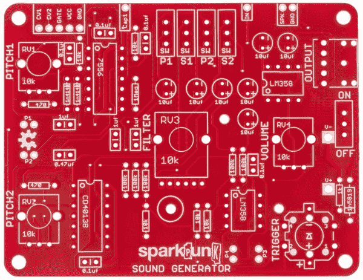](https://cdn.sparkfun.com/assets/learn_tutorials/2/2/6/pcb.jpg)

*   一个火花朋克声音发生器 PCB

* * *

### 集成电路

[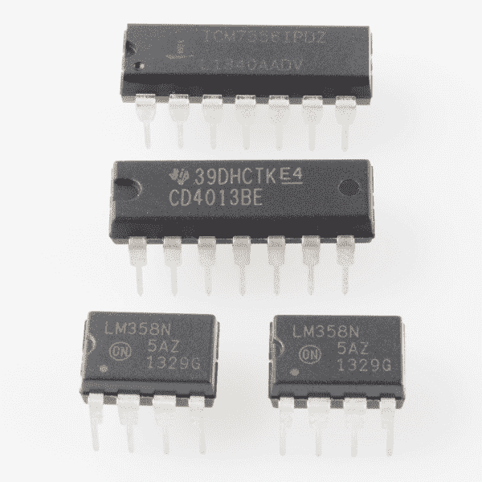](https://cdn.sparkfun.com/assets/learn_tutorials/2/2/6/ics.jpg)

*   一个 ICM 7556
*   一个 CD4013BE 双触发器
*   两个 LM358 双通道运算放大器

* * *

### 电位器

[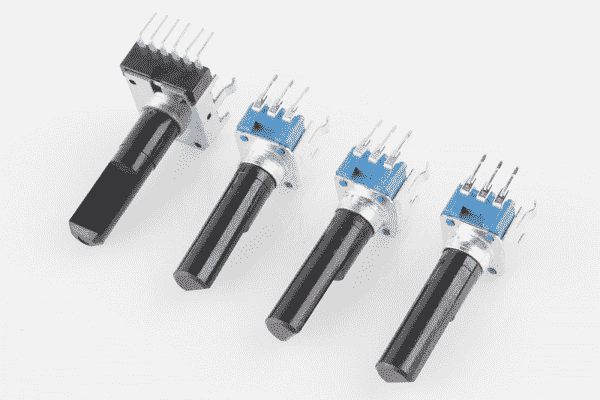](https://cdn.sparkfun.com/assets/learn_tutorials/2/2/6/pots.jpg)

*   一个 10K 欧姆双电位计
*   三 10K 欧姆电位计

* * *

### 开关

[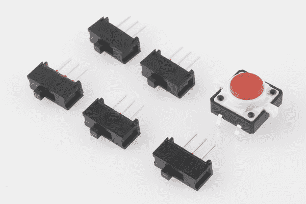](https://cdn.sparkfun.com/assets/learn_tutorials/2/2/6/switches.jpg)

*   五个迷你电源开关
*   一个红色 LED 触摸按钮

* * *

### 二极管

[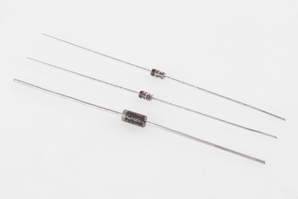](https://cdn.sparkfun.com/assets/learn_tutorials/2/2/6/diodes.jpg)

*   两个 1N4148 硅二极管
*   一个 1N5819 肖特基二极管

* * *

### 电阻

[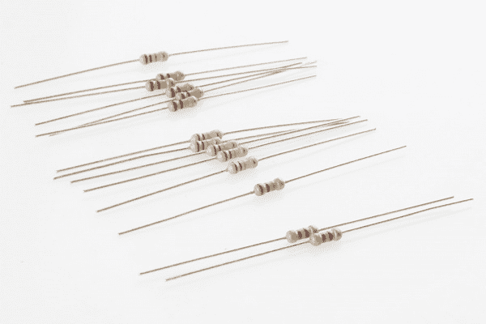](https://cdn.sparkfun.com/assets/learn_tutorials/2/2/6/Resistors.jpg)

*   一个 1M 欧姆 1/4W 电阻器(棕-黑-绿-金)
*   五个 100k 欧姆 1/4W 电阻器(棕色-黑色-黄色-金色)
*   五个 10k 欧姆 1/4W 电阻器(棕色-黑色-橙色-金色)
*   一个 1K 欧姆 1/4W 电阻器(棕色-黑色-红色-金色)
*   两个 470 欧姆 1/4W 电阻器(黄-紫-棕-金)

* * *

### 电容器

[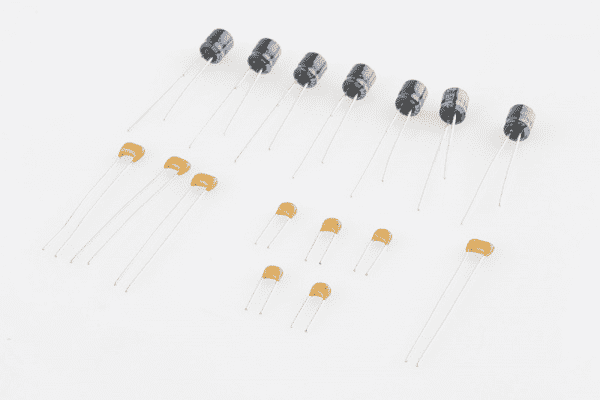](https://cdn.sparkfun.com/assets/learn_tutorials/2/2/6/caps.jpg)

你可能需要一个放大镜来阅读陶瓷电容器上的标记。

*   七个 10uF 25V 电解电容器
*   三个 1uF 陶瓷电容器(标记为 105)
*   五个 0.1uF 陶瓷电容器(标记为 104)
*   一个 0.47uF 陶瓷电容器(标记为 474)

* * *

### 机械部件

[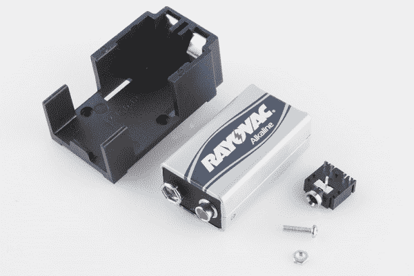](https://cdn.sparkfun.com/assets/learn_tutorials/2/2/6/battery.jpg)

*   一个 9V 电池盒
*   一个 9 伏碱性电池
*   一个 3.5 毫米音频插孔
*   一个 3/8 英寸长的 2-56 十字头机器螺钉
*   一个 2-56 螺母

* * *

如果您遇到短缺，请联系[客户服务](https://www.sparkfun.com/static/contact)，他们可以为您更换零件。

## 电子组件 I -二极管

对于这样的 PCB，如果从最短的元件开始，然后再到最高的元件，通常最容易组装。这样，您就不需要处理大部分较大的组件。

### 二极管

硅[二极管](https://learn.sparkfun.com/tutorials/diodes)是最短的元件，所以我们从它们开始。在工具包中找到硅二极管-它们有一个小的橙色的身体，看起来像一个玻璃珠，在一端附近有一条黑色的条纹。

硅二极管并排安装在下面标记的位置。从哪一个开始并不重要。

[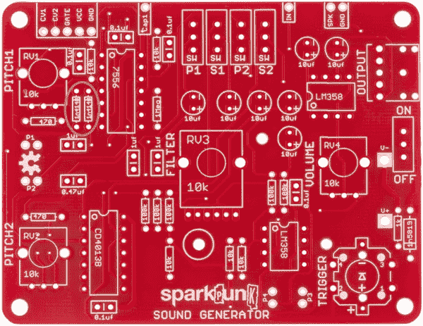](https://cdn.sparkfun.com/assets/learn_tutorials/2/2/6/1-diodes.jpg)

这些二极管被极化。玻璃体的一端有一条黑色条纹，与 PCB 丝网印刷上的白色条纹相匹配:

[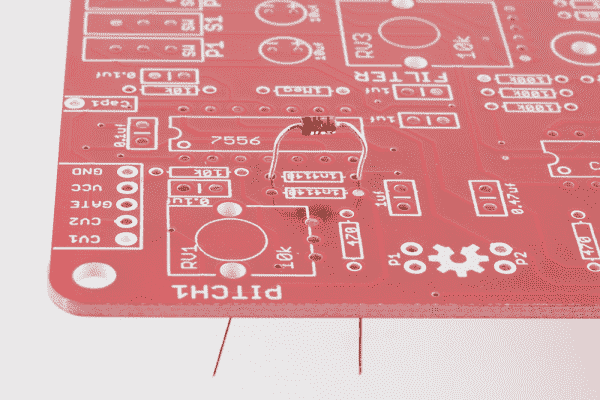](https://cdn.sparkfun.com/assets/learn_tutorials/2/2/6/d1-1.jpg)*Align the stripe on the diode with the stripe on the PCB*

二极管安装在 PCB 的顶部，具有丝网轮廓的一侧。弯曲导线，使其穿过孔，然后将其推入，直到主体位于 PCB 顶部。工作时，您可以将腿稍微向外弯曲以握住二极管。

[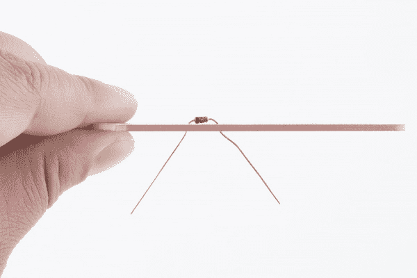](https://cdn.sparkfun.com/assets/learn_tutorials/2/2/6/d1-2.jpg)

翻转电路板，将二极管焊接到位，然后修剪圆角附近的多余引线。

[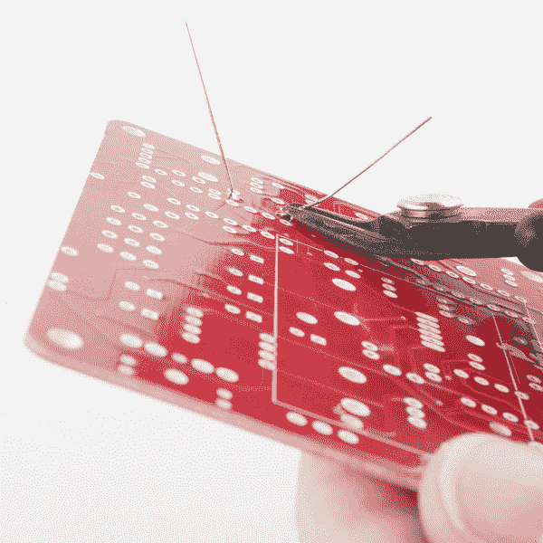](https://cdn.sparkfun.com/assets/learn_tutorials/2/2/6/d1-3.jpg)

在它旁边安装另一个二极管。同样，插入时应使主体和 PCB 上的条纹对齐，面向与第一个二极管相同的方向。

两个硅二极管就位后，让我们安装肖特基二极管。(好吧，它比电阻稍大一点，但不会大到干扰后面的步骤)。

它是一个黑色的圆柱体，一端有灰色或白色的条纹。它在这里:

[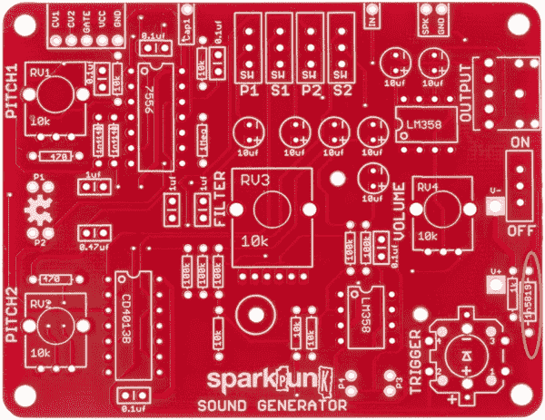](https://cdn.sparkfun.com/assets/learn_tutorials/2/2/6/2-diodes.jpg)

像硅二极管一样，它是极化的。将车身上的条纹与 PCB 上的条纹匹配。将它焊接进去，并修剪多余的引线。

安装所有二极管后，您的 PCB 看起来应该是这样的:

[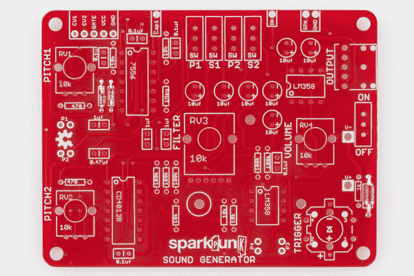](https://cdn.sparkfun.com/assets/learn_tutorials/2/2/6/d-waypoint.jpg)

继续之前，请花点时间验证二极管上的条纹方向是否正确。

* * *

### 起泡，冲洗，重复

我们在这里建立的模式(插入、焊接、修整)将对 PCB 上的每个其它元件重复。

## 电子组件 II -电阻器

电阻器没有极化-它们可以安装在任何方向。我们将按照电阻值增加的顺序安装电阻器。对于每个电阻值，我们将插入、焊接和修整多余的引线，就像您处理二极管一样。

电阻值由电阻器本体上的彩色条纹表示。我们将在下面的照片标题中注明颜色代码，但如果你想更全面地了解这些代码是如何工作的，你可以在我们的[电阻标记教程](https://learn.sparkfun.com/tutorials/resistors/decoding-resistor-markings)中找到。

* * *

### 470 &ohm;

电阻值最低的电阻是两个 470 &ohm;电阻。它们位于 PCB 的左边缘附近，如下所示:

[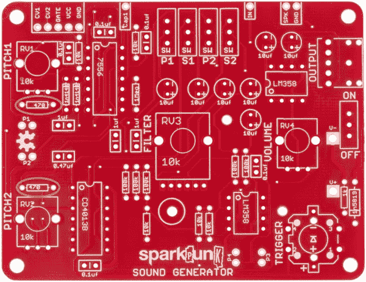](https://cdn.sparkfun.com/assets/learn_tutorials/2/2/6/3-470.jpg)*470 &ohm; Resistors (_Yellow - Violet - Brown - Gold*)_

* * *

### 1K &ohm;

470 之后是 1k &ohm;电阻。它位于棋盘的右边缘附近:

[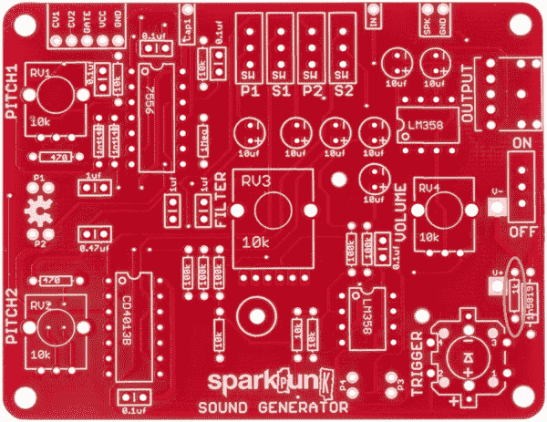](https://cdn.sparkfun.com/assets/learn_tutorials/2/2/6/4-1k.jpg)*1K &ohm; Resistor (_Brown - Black - Red - Gold*)_

* * *

### 10K &ohm;

接下来是 10K 电阻器。共有五个，如下所示:

[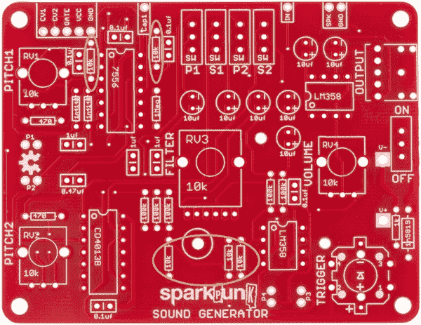](https://cdn.sparkfun.com/assets/learn_tutorials/2/2/6/5-10k.jpg)*10K &ohm; Resistors (_Brown - Black - Orange - Gold*)_

* * *

### 100K &ohm;

还有五个 100k 的电阻。它们安装在 PCB 的中部附近:

*100K &ohm; Resistors (_Brown - Black - Yellow - Gold*)_

* * *

### 1 米&ohm;

最后是 1 兆欧电阻。它在这里:

[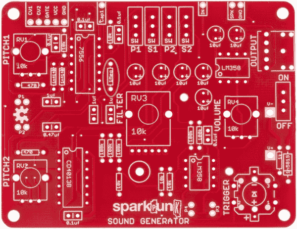](https://cdn.sparkfun.com/assets/learn_tutorials/2/2/6/7-1M.jpg)*1M &ohm; Resistor (_Brown - Black - Green - Gold*)_

* * *

此时，所有的二极管和电阻都已安装完毕。您的板应该看起来像这样:

[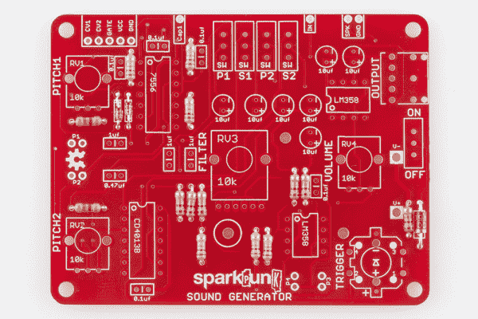](https://cdn.sparkfun.com/assets/learn_tutorials/2/2/6/r-waypoint.jpg)

## 电子装配 III -电容器和集成电路

### 电容器

下一个最高的组件是陶瓷[电容器](https://learn.sparkfun.com/tutorials/capacitors) -它们通常是带有两条引线的橙色/黄色小斑点。

*Electrolytic capacitors (top), ceramic capacitors (bottom).*

和电阻一样，陶瓷电容没有极化，可以面向任何方向安装。

这些数值印在瓶盖的侧面，但是字体非常小，在某些情况下，小到几乎看不见。放大镜会有所帮助，或者你可以通过计算每一个的数量来找出哪个是哪个。

* * *

### 1 F 陶瓷电容

有三个 1 F 帽，标有 *105* 。它们安装在以下位置:

[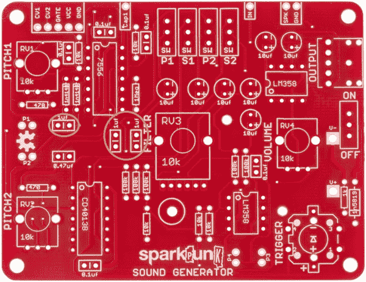](https://cdn.sparkfun.com/assets/learn_tutorials/2/2/6/8-1uf.jpg)*1 µF Ceramic Caps*

* * *

### 0.1 F 陶瓷电容 1 F

有五个 0.1 F 的瓶盖。它们被标记为 *104* ，其位置如下:

[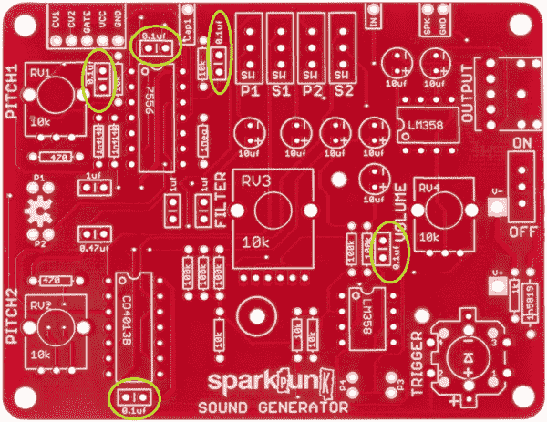](https://cdn.sparkfun.com/assets/learn_tutorials/2/2/6/9-100nf.jpg)*0.1 µF Ceramic Caps*

* * *

### 0.47 F 陶瓷电容

有一个 0.47 华氏度的上限。标记为 *474* ，位置如下:

[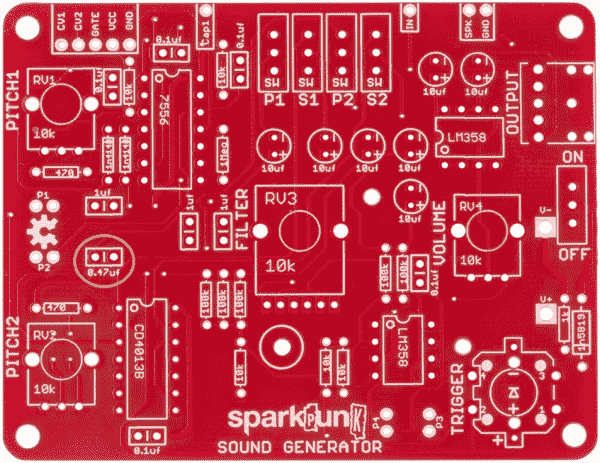](https://cdn.sparkfun.com/assets/learn_tutorials/2/2/6/10-470nf.jpg)*0.47 µF Ceramic Cap*

* * *

### 集成电路

在这一点上，我们将从电容器快速绕道，放入[集成电路](https://learn.sparkfun.com/tutorials/integrated-circuits)，因为它们比电解电容稍短。

SparkPunk 上有四个集成电路(IC)芯片。IC 是极化的，通常在芯片的一端有一个凹口(如果没有凹口，则在一个角附近有一个点或凹痕)。同样，PCB 被标记为与元件匹配。

[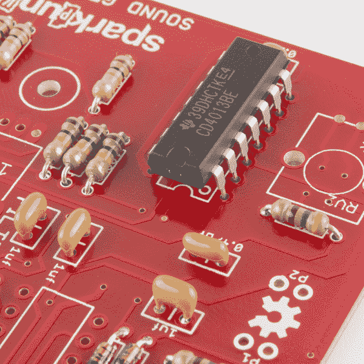](https://cdn.sparkfun.com/assets/learn_tutorials/2/2/6/ic-orient.jpg)*Match the half-moon in the IC body to the notch in the silkscreen.*

焊接芯片时，最好先焊接对角的引脚，以便在焊接其他引脚时固定芯片。

ICM7556 和 CD4013B 都是 14 引脚封装，请注意将它们放在正确的位置。

让我们从左到右安装芯片。

首先是 CD4013B，在左下角:

[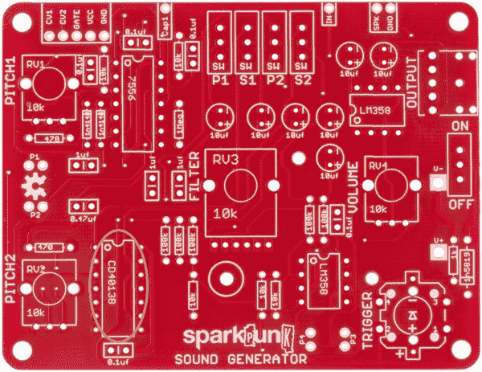](https://cdn.sparkfun.com/assets/learn_tutorials/2/2/6/11-4013.jpg)

接下来是 ICM7556:

[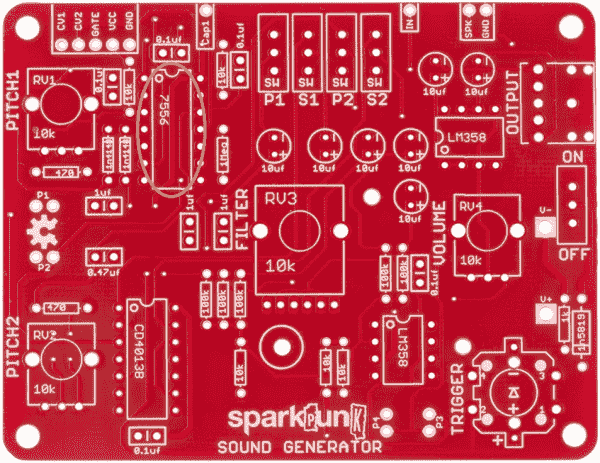](https://cdn.sparkfun.com/assets/learn_tutorials/2/2/6/12-7556.jpg)

将 IC 四舍五入，放入两个 LM358:

[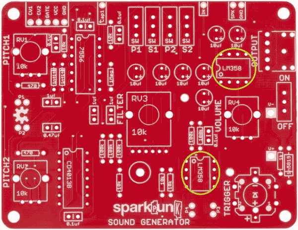](https://cdn.sparkfun.com/assets/learn_tutorials/2/2/6/13-358.jpg)

* * *

### 电解电容

电解电容器是看起来像小汽水罐的小圆柱体。它们被极化，有一个正极和一个负极。正极引线通常比负极引线长，负极引线通常标在电容器本身的主体上。PCB 上的焊盘标有“+”和“-”符号，较长的引线将穿过标有+的孔。在这块板上，它们都朝着同一个方向，负的一条腿朝向板的顶部。

[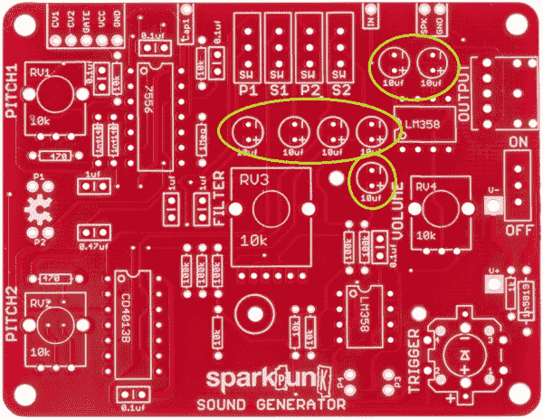](https://cdn.sparkfun.com/assets/learn_tutorials/2/2/6/14-10uf.jpg)*10µf, 25V Electrolytic caps*

* * *

### 检查你的进度

至此，所有较短的电子元件都已安装完毕。您的板现在应该看起来像这样:

我们就快成功了——只剩下一些组件需要安装了。

## 机械装配

至此，我们已经安装了所有的电子元件，是时候继续安装机电元件了。

### 耳机插孔

最短的机电元件是耳机插孔，在右上角:

[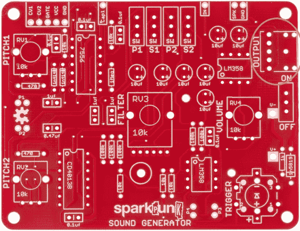](https://cdn.sparkfun.com/assets/learn_tutorials/2/2/6/15-jack.jpg)

耳机插孔的位置使耳机插孔指向电路板的右侧。它还有小塑料脚，可以放入 PCB 上的孔中，以帮助保持其位置。确保焊接所有五个金属腿。

* * *

### 开关

套件中有五个小滑动开关。

我们会把其中一个留到最后，这样当我们把它放进电池盒时，它就不会碍事了。

前四个都位于 PCB 上边缘的中心附近:

[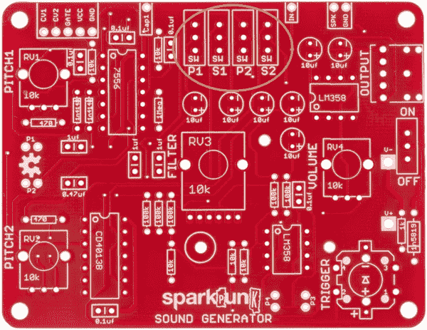](https://cdn.sparkfun.com/assets/learn_tutorials/2/2/6/16-sw.jpg)

滑动开关没有极化。

* * *

### 按钮

滑动开关之后，我们按下按钮:

[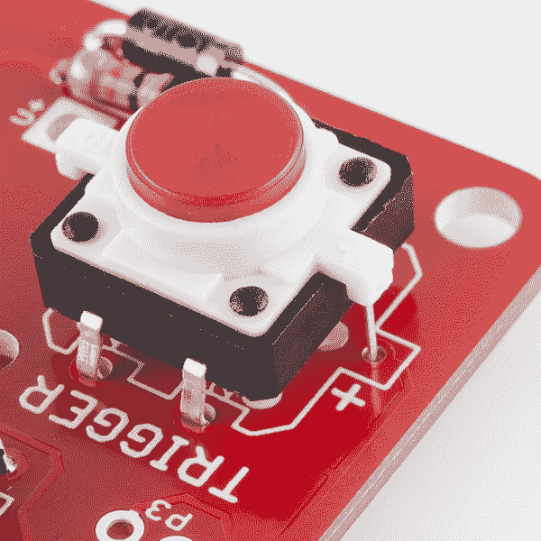](https://cdn.sparkfun.com/assets/learn_tutorials/2/2/6/button-orient.jpg)

按钮包含一个极化的 LED。注意识别正确的方向——在一个白色塑料标签上有一个小的“+”，它与 PCB 上的“+”对齐。

* * *

### 电位器

电位计没有极化，但它们只能以一种方式安装在电路板上。

把它们放到板上需要一些小心。首先将较小的电气支腿排成一行，然后将两个较大的凸耳推入孔中。如果导线或接线片在运输过程中弯曲，则需要将其拉直以适应 PCB。标签是一个紧密的配合-轻轻地从一边到另一边摇动罐子会有帮助。正确插入后，罐的背面将与 PCB 的顶部齐平。

当你焊接它们的时候，首先焊接突出部分以保持稳定，注意罐子要平放在电路板上。然后焊接其他连接。

我们将从三个单组底池开始。

[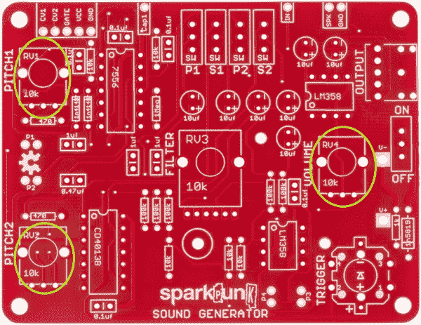](https://cdn.sparkfun.com/assets/learn_tutorials/2/2/6/17-10k.jpg)*Three single 10K pots*

接下来是双组锅，它有 6 条腿。它就像较小的花盆一样，先将较小的腿与孔对齐，然后将凸耳穿过板。

[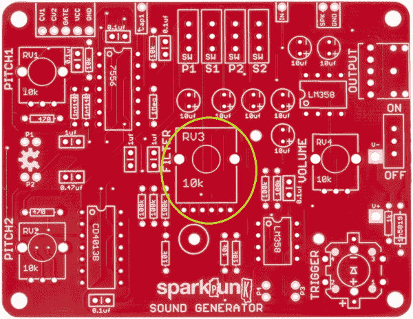](https://cdn.sparkfun.com/assets/learn_tutorials/2/2/6/18-dual-10k.jpg)*The dual 10K pot*

* * *

## 仔细检查你的工作

我们在最后冲刺阶段！

在继续之前，花点时间检查一下你到目前为止的工作。特别是，有两件事需要注意。

1.  确认所有极化部件安装正确。
2.  仔细检查电路板背面的焊接工作，检查是否有短路和冷接点。

我们将在下一步中用电池座覆盖它们，这使得很难看到或修复任何问题。

* * *

### 电池箱

当你对你的焊接工作有信心时，我们就去电池箱。它位于印刷电路板的*背面*;

[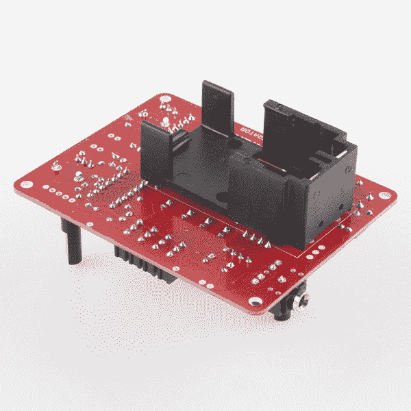](https://cdn.sparkfun.com/assets/learn_tutorials/2/2/6/batt-orient.jpg)

工具箱里有一个小螺栓和螺母，你焊接时我们用它来固定盒子。把导线穿过这些孔，然后用螺栓把盒子固定好。将螺丝从电池盒内部插入，螺母在电路板顶部。

[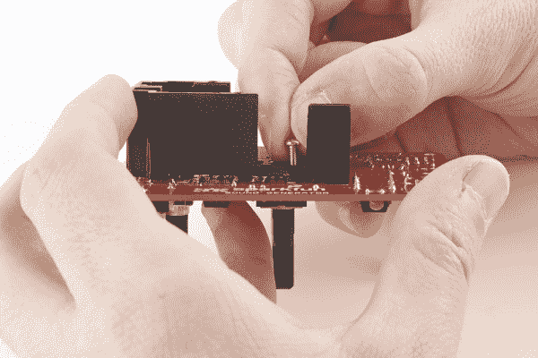](https://cdn.sparkfun.com/assets/learn_tutorials/2/2/6/batt-bolt.jpg)

它被焊接到 PCB 的前面。

### 又一个开关

最后是电源开关，位于 PCB 的右边缘:

[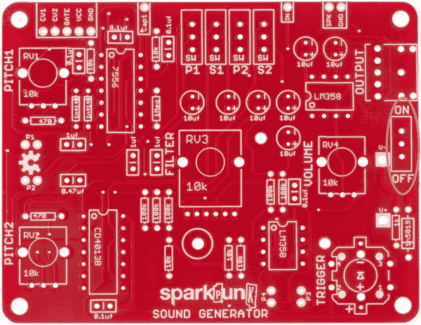](https://cdn.sparkfun.com/assets/learn_tutorials/2/2/6/19-pwr-sw.jpg)

### 组装完成

这应该结束了所有的焊接工作。花点时间欣赏并仔细检查你的工作。特别是，重新检查极化组件的方向-二极管、集成电路、电解电容器和按钮。

您的板应该看起来像这样:

[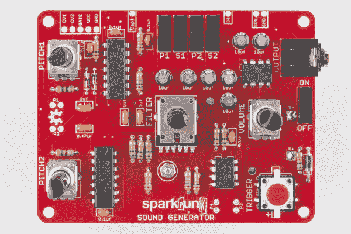](https://cdn.sparkfun.com/assets/learn_tutorials/2/2/6/end-waypoint.jpg)

唯一剩下的部分应该是 9 伏电池。我们将安装它，并在下一页开始测试主板。

## 测试

组装完成后，我们将继续测试你的新火花朋克。我们将分两个阶段对其进行测试。

你会注意到，随着电路板的组装，丝网印刷中的许多文本和图例被元件掩盖了。剩下的文字解释了附近控件的功能。我们将使用文本框中的文本来表示这些标签。

### 初始测试

第一个测试只是一个烟雾测试。

将电池安装在电池盒中。盒子上有一个小的“+”和“-”浮雕，将与电池上相应的标记相匹配。电池应滑入支架，并通过后端的凸耳固定到位。如果它不太合适，确保你已经把它对齐了。

[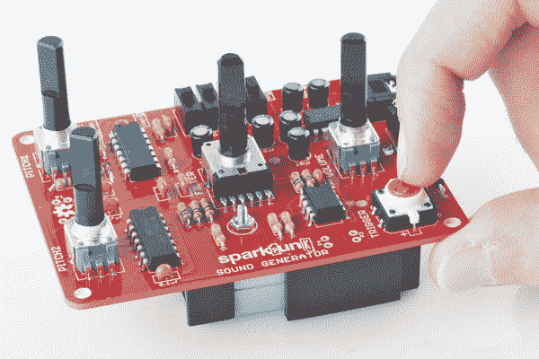](https://cdn.sparkfun.com/assets/learn_tutorials/2/2/6/Testing.jpg)

打开电源开关，然后按下`TRIGGER`按钮。当你按下按钮时，它应该会亮。如果不亮，检查下面的[故障排除建议](#Troubleshooting)。

### 声音测试

一旦按钮工作，我们就可以继续检查声音输出。为了配置测试，我们需要设置所有的控件。在设备上从左向右移动，按如下方式配置控件:

*   逆时针转动`PITCH1`和`PITCH2`锅
*   向上滑动`P1`开关，打开开关
*   向下滑动`S1`、`P2`和`S2`开关，关闭它们
*   将`FILTER`锅放在其旋转的中心
*   将`VOLUME`锅转到底(逆时针)
*   将耳机连接到`OUTPUT`插孔
*   转动单元`ON`

现在按住`TRIGGER`按钮，同时慢慢转动`VOLUME`控制钮。随着音量控制的转动，您应该会听到越来越大的声音。如果有，恭喜你！但是如果没有，不要担心-直接跳到[故障排除](#Troubleshooting)部分。

#### 更详细的测试

现在，我们将检查所有控件是否正常工作。

转动`PITCH1`电位计会改变您听到的频率。

前后转动过滤器旋钮。音调会保持不变，但音调会有所不同。该滤波器的效果类似于电吉他的哇音踏板。你可能会发现锅转动的上半部分(12 点至 5 点)的效果更明显。

现在关闭`P1`，打开`P2`。`PITCH2`控制应该改变频率。

接下来，穿过`P1`、`S1`、`P2`和`S2`开关，依次尝试每个开关。每个应该产生不同的声音。您也可以一次打开多个，以产生各种组合。

## 完成了吗？

当所有的控制检查完毕，你就有了一个功能性的火花朋克！

但是，这并没有结束。在下一节的[中，我们将更详细地解释所有这些控制是做什么的，以及底层电路是如何工作的。](https://learn.sparkfun.com/tutorials/sparkpunk-hookup-guide/how-it-works)

你也可以修改和扩展 spark punk——这是一个开始修改或[电路弯曲](http://www.anti-theory.com/soundart/circuitbend/)的绝佳平台。我们描述了一些你可以在[修改](https://learn.sparkfun.com/tutorials/sparkpunk-hookup-guide/modifications)部分开始的改装。

* * *

### 解决纷争

常规故障排除的第一步是再次检查您的工作。

*   检查极化组件是否正确。其中包括:
    *   二极管
    *   按钮
    *   每个集成电路芯片
    *   电解电容
    *   电池
*   确保所有的焊料连接都正确流动，焊料量正好合适——不要太少也不要太多。
*   验证您是否连接了耳机或扬声器。
*   确保电池没有耗尽，并且电源开关已打开。你可以用[万用表](https://learn.sparkfun.com/tutorials/how-to-use-a-multimeter)来做。

如果事情仍然不起作用，尝试联系 Sparkfun 友好的[客户支持](https://www.sparkfun.com/static/contact)团队。

## 它是如何工作的

### 如何演奏火花朋克

火花朋克是一个非常简单的合成器，使用振荡器的常见排列来馈送滤波器。

播放它的基本方法是按下按钮，操作控制。听听结果，调整一下口味。探索并享受乐趣。有些人喜欢柔和舒缓的声音，而有些人喜欢铿锵有力的音调。有了所有的控件，您应该能够探索范围的两端。

为了更有意义地应用火花朋克，有助于理解里面是什么，以及开关和锅是如何控制它的。

#### 框图

[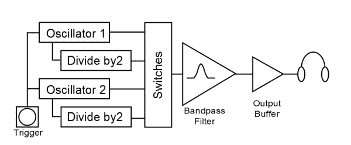](https://cdn.sparkfun.com/assets/learn_tutorials/2/2/6/block-diagram.png)*SparkPunk Architecture*

上面的框图说明了 SparkPunk 的主要功能模块。从左到右，我们首先看到触发按钮。它被连接到振荡器上，当按钮被按下时，振荡器被允许运行，否则它们是无声的。子八度音程发生器将每个振荡器的输出降低一个八度音程。在到达带通滤波器之前，可以使用开关将振荡器波形和子波形混合在一起进行选择。最后，信号进入音量控制和输出缓冲放大器，使火花朋克驱动小型扬声器或耳机。

在接下来的几节中，我们将更详细地介绍每一部分是如何工作的。

### 操作理论

#### 振荡器

火花朋克的核心是 7556 双定时器 IC。7556 是 555 的 CMOS 替代产品。

简单地说一下这部分的历史: [555](https://www.sparkfun.com/products/9273) 可能会被认为是经典的集成电路之一——如此有用和多功能，以至于 Forrest M Mims 写了一本包含 555 个电路的小册子。555 在 556 中有一个近亲，556 只是同一个封装中的两个 555。然而，555 和 556 会消耗大量电流(导致电池寿命缩短)，并会在电源中引入噪声。7555 和 7556 是旧芯片的 CMOS 替代品，消耗的电流大大减少。因此 555 x 2 = 556。556 + CMOS = 7556。

SparkPunk 在稳定(自由运行)模式下使用 7556。该电路来自 [7555 数据表](http://www.intersil.com/content/dam/Intersil/documents/icm7/icm7555-56.pdf)中的图 2A。电阻 R 已被 470 欧姆电阻的电位计取代，以限制电位计处于最小电阻时的最大频率。

使用公式`f = 1/(1.4RC)`计算频率。7556 内部有两个定时器电路，SparkPunk 使用两个电路，配置相同，除了电容值-第一个通道产生的音高比第二个低，如下表所示。

| **频道** | **上限值** | **最大 R
(逆时针方向的电位)** | **最小 R
(顺时针方向的电位)** | **最小频率** | **最大频率** |
| one | 1 uF | Four hundred and seventy | Ten thousand four hundred and seventy | sixty-eight | One thousand five hundred and nineteen |
| Two | 0.47 微法单位 | Four hundred and seventy | Ten thousand four hundred and seventy | One hundred and forty-five | Three thousand two hundred and thirty-three |

实际频率会因元件容差而有所不同。

该电路还利用 7556 上的复位和控制电压输入。

芯片保持复位状态，直到按下按钮，或者扩展端口的栅极输入端出现电压。这两个电压由 D1、D2 和 R5 组成的二极管[或门](https://learn.sparkfun.com/tutorials/digital-logic/combinational-logic)组合。

7556 还具有连接到扩展端口的控制电压输入。我们将在[修改页面](https://learn.sparkfun.com/tutorials/sparkpunk-hookup-guide/modifications)上更详细地介绍扩展端口。

### 次八度音阶

次倍频程电路由 T 型触发器[和](https://learn.sparkfun.com/tutorials/digital-logic/sequential-logic)构成。振荡器的脉冲波与 CD4013 触发器的时钟输入相连。在 7556 的每个上升沿，触发器都会改变状态。您可以在下面的示波器上看到这一点:

[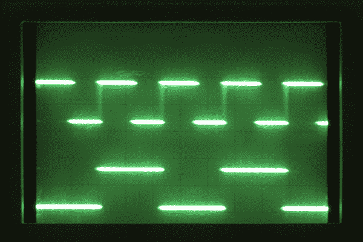](https://cdn.sparkfun.com/assets/learn_tutorials/2/2/6/Oscilliscope_screen.jpg)

顶部波形的每个上升沿都会导致底部波形改变状态，而顶部波形的下降沿会被忽略。这产生了频率为输入频率一半的第二个波。这种行为也称为“时钟分割”

用音乐术语来说，频率减半相当于降一个八度。这产生了一个波，它可以增加原始的丰富性，而不需要添加太多的组件-一个 IC 用于产生两个次八度音阶。因为它跟踪输入信号，所以当振荡器音高改变时，它也保持一致。

#### 搅拌器

有了两个振荡器和两个次振荡器，我们总共有四个音源。使用反相运算放大器求和级合并信号源。

标记为 P1、P2、S1 和 S2 的开关将信号连接到求和总线，允许振荡器和子分支的 16 种不同组合。

由于 7556 和触发器是逻辑源，混频器的每个输入在供电轨之间摆动，方波在 0V 和 9V 之间跳跃。如果我们试图将它们直接组合起来，最终总电压可能达到 36V。运算放大器的摆幅只能略小于供电轨，因此每个输入衰减 1/10，结果在 3.6V 范围内。

### 过滤器

该滤波器是一种有源桥接 T 型拓扑。无源桥接 T 是一种简单的陷波滤波器。

[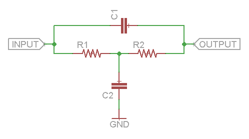](https://cdn.sparkfun.com/assets/learn_tutorials/2/2/6/bridged-t.png)

通过将该滤波器置于运算放大器的反馈环路中，我们可以反转频率响应，将陷波变为峰值。

[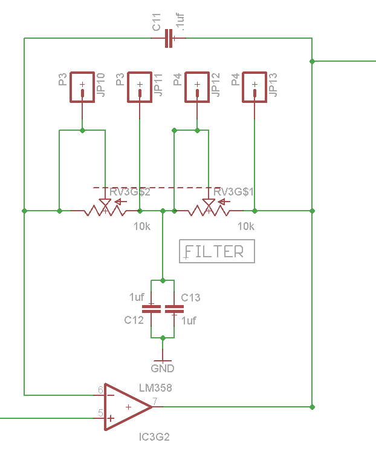](https://cdn.sparkfun.com/assets/learn_tutorials/2/2/6/active-bridged-t.png)

选择这种滤波器拓扑有几个原因。它不需要太多元件，并且允许滤波器通过一对等值电阻进行调谐，本例中是一个双组电位计。最后，峰值幅度不会作为频率的函数而改变，当你转动旋钮时，这听起来很酷！

在 [GitHub 库](https://github.com/sparkfun/Sparkpunk/tree/master/simulations)中有一个 spice 文件，其中包含许多其他过滤器拓扑，展示了一些替代过滤器的比较。

### 输出级

输出级是音量控制，后接一对运算放大器缓冲器，通过电解电容 C14 和 C15 交流耦合到输出引脚。连接立体声耳机时，每只耳朵由单独的放大器驱动。还有可选扬声器的连接点。

[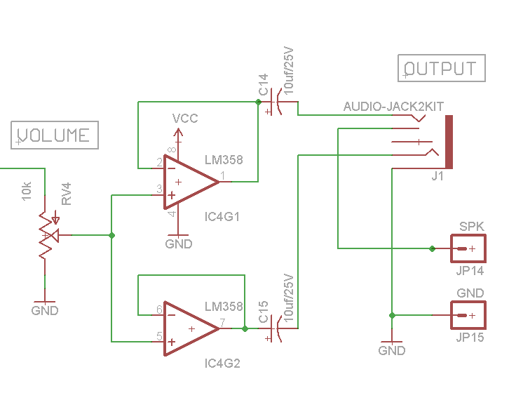](https://cdn.sparkfun.com/assets/learn_tutorials/2/2/6/output.png)

输出插孔有一个开关功能-当没有东西插入时，它提供一个默认连接，当有东西连接时，它被覆盖。在 SparkPunk 上，扬声器端子是默认连接，插入耳机时会断开。这意味着插上耳机会让扬声器静音。

### 设计文件

原理图和 PCB 原图在 [GitHub 库](https://github.com/sparkfun/Sparkpunk)中。

还有整个单元的 LTSpice 电路仿真文件，其中一些中间部分在单独的仿真中。

### 改造火花朋克

了解了 SparkPunk 的精髓之后，让我们来探索如何修改和定制这个套件。

## 修改

SparkPunk 的设计理念是可以定制、修改和扩展。你的电路弯曲在这里是受欢迎的。

### 化妆品

通过添加您选择的旋钮来自定义您的火花朋克。

[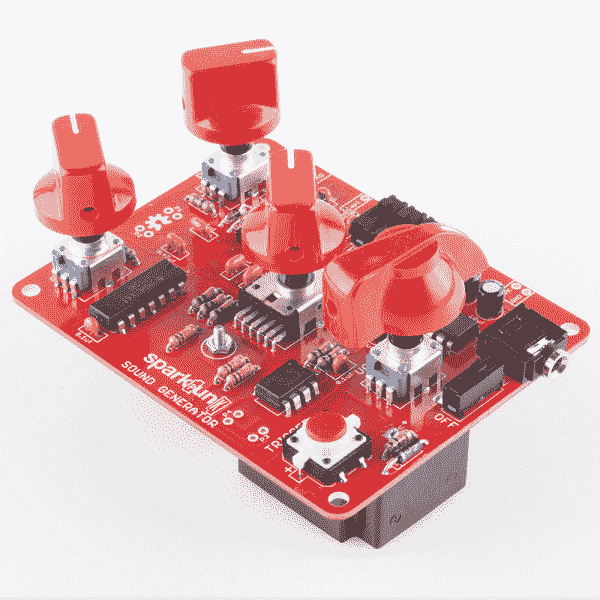](https://cdn.sparkfun.com/assets/learn_tutorials/2/2/6/knobs.jpg)

作者喜欢用红色的小旋钮[来控制音高和滤波器，用红色的](https://www.sparkfun.com/products/9997)[鸡头](https://www.sparkfun.com/products/9999)来控制音量。当然，[的](https://www.sparkfun.com/products/11951) [到](https://www.sparkfun.com/products/11950) [十一个](https://www.sparkfun.com/products/11949)旋钮也有它们的好处。

一旦你有了旋钮，你可以用橡皮筋绕住旋钮，这样你就可以同时调整多个参数。你也可以把橡皮筋交叉成 8 字形，这样向上转动一个旋钮就可以向下转动另一个。

### 不添加组件

设置振荡器频率的陶瓷电容非常依赖于温度。这是音高电位计之间的两个帽，靠近 OSHW 齿轮标志。只要用温暖的指尖触碰它们，你就可以让音调漂移。如果您开始时振荡器彼此协调，触摸其中一个电容会导致它们漂移，从而产生脉动拍频效果。

受[手工电子音乐](https://www.sparkfun.com/products/12721)书的启发，你可以用潮湿的指尖探索电路板的背面。您会发现一些位置会导致音符自发触发、音高弯曲或其他随机错误行为。

### 添加电子元件

### 外部扬声器

你可以在标有“SPK”和“GND”的端子之间焊接一个小扬声器(如[这个](https://www.sparkfun.com/products/10722)或[这个](https://www.sparkfun.com/products/9151))

[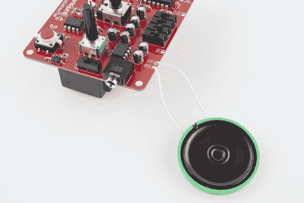](https://cdn.sparkfun.com/assets/learn_tutorials/2/2/6/mod-spkr.jpg)

正如我们在[工作原理](https://learn.sparkfun.com/tutorials/sparkpunk-hookup-guide/how-it-works)部分提到的，插上耳机会禁用扬声器，所以你可以享受你的 SparkPunk 而不打扰别人。

#### 光电池

PCB 上有一些位置可以为火花朋克添加[光电池](https://www.sparkfun.com/products/9088)。光电池是一种电阻，它的阻值随光线的照射而变化。在黑暗中，他们有一个高值，随着他们被照亮而下降。这样的结果是，你可以不用触摸它就能控制 SparkPunk。

在音高电位计之间放置 P1 和 P2，分别控制音高 1 和音高 2。

[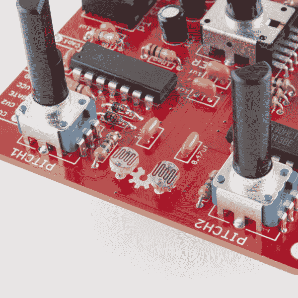](https://cdn.sparkfun.com/assets/learn_tutorials/2/2/6/mod-cells-oscs.jpg)

填充 P3 和 P4(靠近触发按钮)，使滤波器截止频率光敏。

[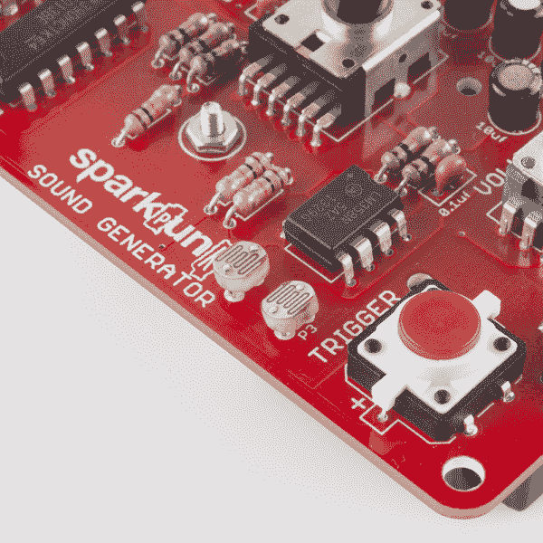](https://cdn.sparkfun.com/assets/learn_tutorials/2/2/6/mod-cells-filter.jpg)

光电池与电位计并联。锅和光电池相互作用-你可以实验锅的旋转如何影响细胞的光响应。

### 外部输入

中的 pad 可用于通过 SparkPunk 滤波器发送外部信号。它们将与音高和亚八度音阶阶段的输出混合。

[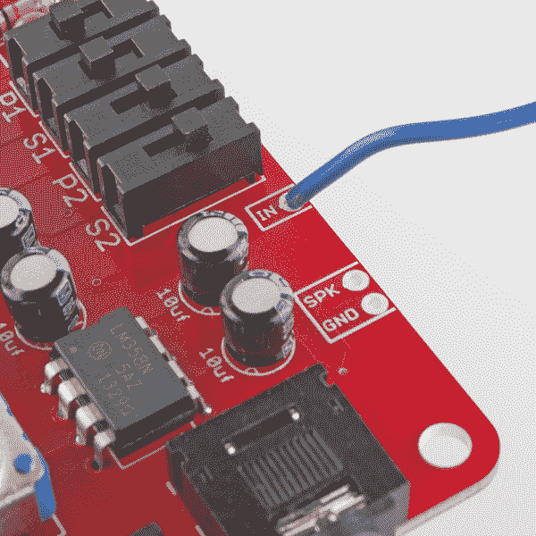](https://cdn.sparkfun.com/assets/learn_tutorials/2/2/6/mod-ext.jpg)

例如，这可以与[克琴](https://www.sparkfun.com/products/11835)一起使用。将扬声器从 Gram Piano 上拆下，并从 Gram Piano 的扬声器“+”端子连接到 SparkPunk 上的 IN pad。现在，您可以使用火花朋克滤镜来影响钢琴输出。

### 交叉调制

将 CAP1 连接到 CV2，然后打开 P2 和/或 S2。当你调整音高 1 和音高 2 时，它们会以有趣的方式反应。

[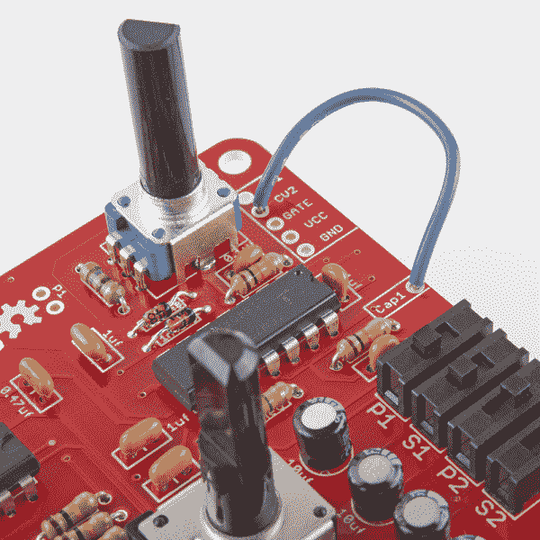](https://cdn.sparkfun.com/assets/learn_tutorials/2/2/6/mod-ring.jpg)

这是一种简单的频率调制形式，它使用第一个振荡器的电压来调制第二个振荡器的频率。结果是一种简单形式的[外差](http://en.wikipedia.org/wiki/Heterodyne)，在音乐效果术语中通常称为“环形调制”。

### 交换组件

在几个地方，更改一两个组件会对最终声音产生很大影响。

#### 振荡器

每个振荡器的频率范围由一个电容设定。C3 设定第一个振荡器的范围，C4 设定第二个振荡器的范围，分别为 1uf 和 0.47uf。它们位于音域之间。您可以通过替换不同的电容来改变振荡器的范围。更大的瓶盖需要更长的时间来更换，从而降低了更换频率。

如果你只是想能够调得更低，焊接第二个相同值的电容(C3 为 1uf，C4 为 0.47)与原件并联。这将降低八度音程。

### 过滤器

通过改变电容，滤波器可以以几种不同的方式改变。

电容最初是按比例选择的。C12 和 C13 的平行组合是 2uF，是 C11 的 0.1uf 的 20 倍。这里的比率决定了峰值中心的宽度和增强量。改变上限的比例将改变值-一个简单的实验方法是去除 C12，将提升从 20 dB 的原值降低到大约 15 dB。

如果保持比率不变，但改变数值，就可以改变中心频率。

您可以通过运行 [SparkPunk GitHub 模拟文件夹](https://github.com/sparkfun/Sparkpunk/tree/master/hardware/simulations)中的过滤器 Spice 模拟来评估和比较差异。可以在[这里](http://www.diystompboxes.com/smfforum/index.php?topic=50531.0)找到桥接 T 元件参数的体面分析。

## 外部接口头-增长空间

您可能已经注意到左上角附近的 5 针插头。这是一个模拟扩展端口，允许访问控制 7556 的信号。

[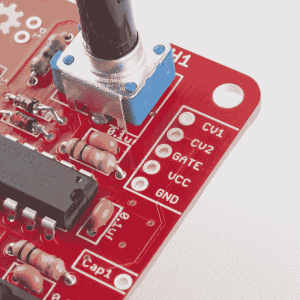](https://cdn.sparkfun.com/assets/learn_tutorials/2/2/6/mod-port.jpg)

每个振荡器都有一个控制电压输入，标记为`CV1`和`CV2`。通过将电压输入这些垫片，你可以调整振荡器的频率。如果你熟悉常规合成器控制电压输入，这些不是你所期望的。这个范围有点小，而且是反向的，电压越高，频率越低。有用的范围大约是从 1/3 VCC 到 2/3 VCC，或者 3V 到 6V。这个范围给出了大约一个八度的频率偏移。在这个范围之外行驶会导致振荡器出现故障或失速——如果你喜欢古怪的声音，值得尝试一下。

`GATE`输入启动振荡器。在那里施加一个正电压可以让振荡器运行，就像按下触发按钮一样。

`VCC`和`GND`是 SparkPunk 的电源轨，所以你可以用 9V 电池给附加电路供电。

## 自己做实验

我们在这里仅仅触及了表面——对于火花朋克有许多可能的修改！

天空才是极限！

## 资源和更进一步

### 资源

*   火花朋克的设计文件可以在 GitHub 上找到
*   Github 文件包括在 [LTSpice]([LTSpice](http://www.linear.com/designtools/software/#LTspice)) 中运行的 Spice 模拟
*   [SFE 产品展示区](https://youtu.be/2QOzvz9fMg0)

如果你对 SparkPunk 的配件和套件感兴趣，看看这些:

*   [红色炉灶旋钮](https://www.sparkfun.com/products/9997)
*   [黑色炉灶旋钮](https://www.sparkfun.com/products/9998)
*   [红色鸡头旋钮](https://www.sparkfun.com/products/9999)
*   [黑色鸡头旋钮](https://www.sparkfun.com/products/10000)
*   [小 GTE 旋钮](https://www.sparkfun.com/products/11951)
*   [中 GTE 旋钮](https://www.sparkfun.com/products/11950)
*   [大型 GTE 旋钮](https://www.sparkfun.com/products/11949)
*   [光电池](https://www.sparkfun.com/products/9088)
*   [瘦喇叭](https://www.sparkfun.com/products/10722)
*   [0.5W 扬声器](https://www.sparkfun.com/products/9151)
*   [克琴](https://www.sparkfun.com/products/11835)
*   [音频放大器套件](https://www.sparkfun.com/products/9612)

### 更进一步

*   原版的雅达利朋克可以在 Morrest M. Mims 的第 26 页找到 [*定时器，运算放大器&光电电路&项目*](https://www.sparkfun.com/products/11131)
*   里德·加扎拉是御术之父。他的网站对御术有很好的介绍。
*   尼克·科林斯的[手工电子音乐](https://www.sparkfun.com/products/12721)书有更多关于电路弯曲的信息，以及一些你可以从头开始构建的音乐电路。