# XBee 屏蔽连接指南

> 原文：<https://learn.sparkfun.com/tutorials/xbee-shield-hookup-guide>

## 介绍

**Heads up!** Originally, this tutorial was written to configure an XBee Series 1 to communicate in transparency mode. However, this can apply to the XBee Series 3 module as long as you configure the firmware to the legacy 802.15.4 protocol. For more information, check out the [Exploring XBees and XCTU](https://learn.sparkfun.com/tutorials/exploring-xbees-and-xctu) tutorial.

XBee Shield 给了你的 Arduino 一个无缝接口来连接 T2 XBee，这是最流行的无线平台之一。有了 XBee，你的 Arduino 可以通过无线方式将数据传输到数百英尺外的另一台设备，而不是被串行电缆束缚在离配对设备几英寸远的地方。

[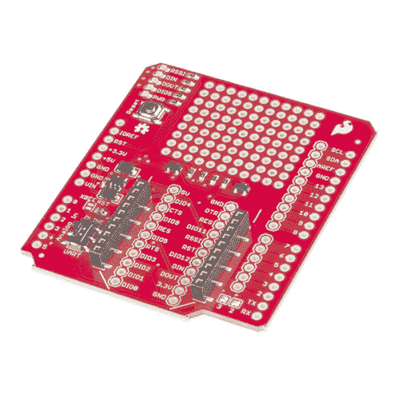](https://www.sparkfun.com/products/12847) 

将**添加到您的[购物车](https://www.sparkfun.com/cart)中！**

### [SparkFun XBee 盾](https://www.sparkfun.com/products/12847)

[In stock](https://learn.sparkfun.com/static/bubbles/ "in stock") WRL-12847

XBee 无线电是向您的 Arduino 项目添加无线功能的绝佳方式，现在有了 SparkFun……

$18.5026[Favorited Favorite](# "Add to favorites") 26[Wish List](# "Add to wish list")****[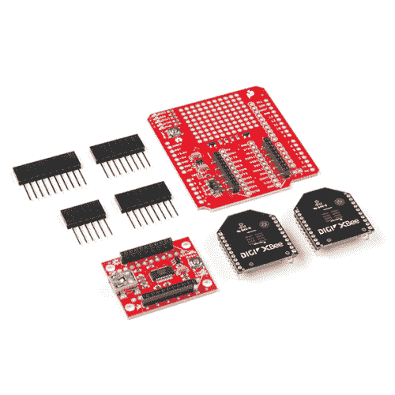](https://www.sparkfun.com/products/15936) 

### [SparkFun XBee 3 无线套件](https://www.sparkfun.com/products/15936)

[Out of stock](https://learn.sparkfun.com/static/bubbles/ "out of stock") KIT-15936

在这个套件中，您会发现两个 XBee 模块，一个 XBee Explorer，一个 Xbee Shield 和一套 Arduino R3 接头，用于焊接…

2[Favorited Favorite](# "Add to favorites") 16[Wish List](# "Add to wish list")** **[https://www.youtube.com/embed/-Bv-YjSrYJI/?autohide=1&border=0&wmode=opaque&enablejsapi=1](https://www.youtube.com/embed/-Bv-YjSrYJI/?autohide=1&border=0&wmode=opaque&enablejsapi=1)

XBee 如此受欢迎的部分原因是它的简单性。XBees 通过[串行 UART 接口](https://learn.sparkfun.com/tutorials/serial-communication)控制——在最基本的操作中，它们可以用作**无线串行电缆**。Digi 的免费软件 XCTU 也简化了 XBee 网络和地址的设置，我们在[的单独教程](https://learn.sparkfun.com/tutorials/exploring-xbees-and-xctu)中对此进行了解释。

### 本教程涵盖的内容

本教程的目标是在计算机和 Arduino/XBee Shield 组合之间设置无线 XBee 通信。然后，使用一个[终端程序](https://learn.sparkfun.com/tutorials/terminal-basics)，我们可以远程发送数据到 Arduino，或者从中读取数据。

[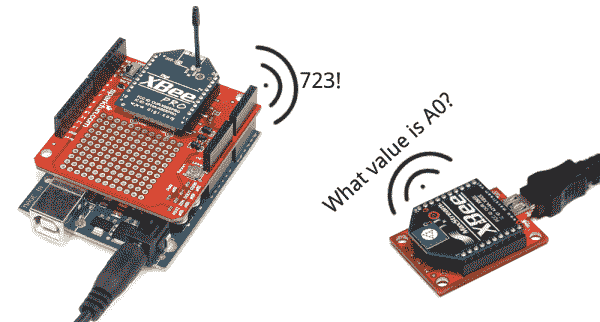](https://cdn.sparkfun.com/assets/learn_tutorials/2/3/0/communication-example.png)

我们将从检查 XBee Shield 的[原理图和硬件](https://learn.sparkfun.com/tutorials/xbee-shield-hookup-guide/hardware-overview)开始，然后转到示例代码。首先，我们将建立一个[测试程序](https://learn.sparkfun.com/tutorials/xbee-shield-hookup-guide/example-communication-test)，以确保我们的 XBees 能够相互通信。然后我们将继续进行[遥控器 Arduino](https://learn.sparkfun.com/tutorials/xbee-shield-hookup-guide/example-remote-control-arduino) 草图。

### 所需材料

要跟随本教程，您将需要以下材料。你可能不需要所有的东西，这取决于你拥有什么。将它添加到您的购物车，通读指南，并根据需要调整购物车。

*   **1x [XBee 盾](https://www.sparkfun.com/products/10854)**——本教程的明星。
    *   你还需要**头**安装到你的盾牌。我们推荐[可堆叠式接头](https://www.sparkfun.com/products/11417)。
*   1x Arduino-XBee Shield 可以与任何 Arduino 兼容的板一起工作- [Uno](https://www.sparkfun.com/products/11021) 、 [RedBoard](https://www.sparkfun.com/products/11575) 、 [Mega](https://www.sparkfun.com/products/11061) ，你能想到的。
*   **2x xbee**-xbee 存在于各种**系列**、**频率**、**范围**。如果你刚刚开始使用 XBee，我们强烈推荐使用**系列 1** 型号——或者带有[跟踪天线](https://www.sparkfun.com/products/11215)、[线天线](https://www.sparkfun.com/products/8665)或者 [u.fl 连接器](https://www.sparkfun.com/products/8666)。

    *   要获得更多挑选 XBee 的帮助，请查看我们的 [XBee 购买指南](https://www.sparkfun.com/pages/xbee_guide)。**Heads up!** While this tutorial was written for XBee Series 1, you can still follow along using XBee Series 3 modules. Just make sure to configure it with the 802.15.4 (Series 1) firmware. For more information, check out the [Exploring XBees and XCTU](https://learn.sparkfun.com/tutorials/exploring-xbees-and-xctu) tutorial.
*   1x 浏览器 -浏览器板允许您将 XBee 连接到您的计算机。你可以使用[探索者 USB](https://www.sparkfun.com/products/11812) 、[探索者 USB 加密狗](https://www.sparkfun.com/products/11697)或[探索者串口](https://www.sparkfun.com/products/9111)。
    *   根据你使用的浏览器，你可能还需要一根匹配的 [mini-B USB](https://www.sparkfun.com/products/11301) 或[串行电缆](https://www.sparkfun.com/products/65)。
*   至少一台安装了[X-CTU](http://www.digi.com/products/wireless-wired-embedded-solutions/zigbee-rf-modules/xctu)T3 的**电脑。**
    *   最新版本的 X-CTU 可用于 Mac 和 Windows 系统！

### 工具

你需要一个烙铁、焊料和一般的焊接附件。

[](https://www.sparkfun.com/products/14228) 

### [威勒 WLC100 焊台](https://www.sparkfun.com/products/14228)

[Out of stock](https://learn.sparkfun.com/static/bubbles/ "out of stock") TOL-14228

Weller 的 WLC100 是一款多功能的 5 瓦至 40 瓦焊台，非常适合业余爱好者、DIY 爱好者和学生。…

2[Favorited Favorite](# "Add to favorites") 17[Wish List](# "Add to wish list")[](https://www.sparkfun.com/products/9325) 

将**添加到您的[购物车](https://www.sparkfun.com/cart)中！**

### [无铅焊料- 100 克线轴](https://www.sparkfun.com/products/9325)

[In stock](https://learn.sparkfun.com/static/bubbles/ "in stock") TOL-09325

这是带有水溶性树脂芯的无铅焊料的基本线轴。0.031 英寸规格，100 克。这是一个好主意…

$9.957[Favorited Favorite](# "Add to favorites") 33[Wish List](# "Add to wish list")** **### 推荐阅读

在通读本教程之前，我们强烈建议查看一下[探索 XBees 和 XCTU 教程](https://learn.sparkfun.com/tutorials/exploring-xbees-and-xctu)。

[](https://learn.sparkfun.com/tutorials/exploring-xbees-and-xctu) [### 探索 XBees 和 XCTU

#### 2015 年 3 月 12 日](https://learn.sparkfun.com/tutorials/exploring-xbees-and-xctu) How to set up an XBee using your computer, the X-CTU software, and an XBee Explorer interface board.[Favorited Favorite](# "Add to favorites") 18

该教程将向您介绍 XCTU，并解释如何配置 XBee 网络和地址。除了该教程，我们还建议查看以下指南:

*   [串行通信](https://learn.sparkfun.com/tutorials/serial-communication) -串行通信对于控制和管理 XBees 至关重要。
*   Arduino 盾牌-Arduino 盾牌的基本知识，包括如何组装盾牌。
*   XBee 购买指南 -如果你是第一次玩 XBee，我们强烈推荐**系列 1** 的 XBee。如果你对其他 XBee 类感兴趣，看看这个指南吧！

[](https://learn.sparkfun.com/tutorials/how-to-solder-through-hole-soldering) [### 如何焊接:通孔焊接](https://learn.sparkfun.com/tutorials/how-to-solder-through-hole-soldering) This tutorial covers everything you need to know about through-hole soldering.[Favorited Favorite](# "Add to favorites") 70[](https://learn.sparkfun.com/tutorials/serial-communication) [### 串行通信](https://learn.sparkfun.com/tutorials/serial-communication) Asynchronous serial communication concepts: packets, signal levels, baud rates, UARTs and more 100[](https://learn.sparkfun.com/tutorials/arduino-shields-v2) [### Arduino Shields v2](https://learn.sparkfun.com/tutorials/arduino-shields-v2) An update to our classic Arduino Shields Tutorial! All things Arduino shields. What they are and how to assemble them.[Favorited Favorite](# "Add to favorites") 5

## 硬件概述

下面是 XBee Shield 的大部分组件的快速概述:

[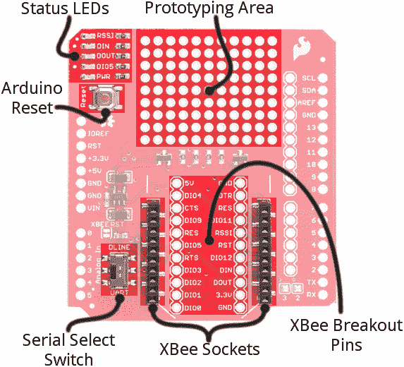](https://cdn.sparkfun.com/assets/learn_tutorials/2/3/0/shield-annotated.png)

下面，我们将更深入地探讨防护罩最重要的组件。

### UART/软件串行开关

XBee Shield 上最重要的组件之一是 DLINE/UART 开关。该开关控制哪些 Arduino 引脚与 XBee 接口。

[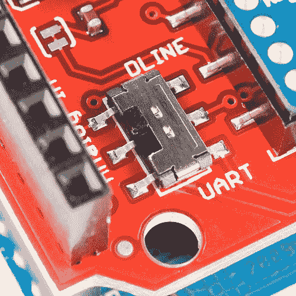](https://cdn.sparkfun.com/assets/learn_tutorials/2/3/0/dline-switch.png)

Arduino Uno 有一个硬件 UART，通常用于**编程**(通过 Arduino 的串行引导程序)或与**串行监视器**通信。那个串口在任何时候只能用来和一个设备通信，以免你遇到[总线争用](https://learn.sparkfun.com/tutorials/serial-communication/common-pitfalls#busContention)的问题。还有一种可能是，在程序上传过程中，虚假甚至有害的数据可能会被发送到任何连接到 Arduino 硬件 UART 的设备上。

因此，为了避免将 XBee 连接到 Arduino 的硬件 UART 可能产生的任何问题，我们通常利用[软件串行库](http://arduino.cc/en/Reference/SoftwareSerial)，将 XBee 的 RX 和 TX 引脚连接到 Arduino 上的一对空闲数字引脚。

为了在软件和硬件串行之间进行选择，XBee Shield 包括一个小型的表面安装滑动开关。此开关允许您在硬件串行端口(UART 位置)和连接到引脚 2 (Arduino 侧 RX)和 3 (Arduino 侧 TX)的软件串行端口之间进行选择。

[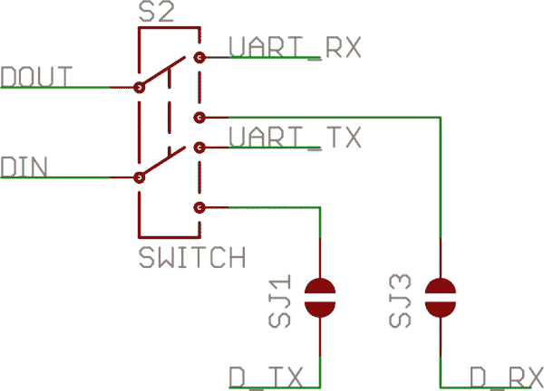](https://cdn.sparkfun.com/assets/learn_tutorials/2/3/0/switch-schematic.png)*The switch configuration from the [XBee Shield schematic](http://cdn.sparkfun.com/datasheets/Dev/Arduino/Shields/xbeeshield-v14.pdf). "D_TX" connects to Arduino pin 3, and "D_RX" connects to Arduino pin 2.*

对于我们所有的示例草图，我们将假设开关处于**线位置**。至少，**在上传草图**时，要确保开关在“DLINE”位置。

### 状态 LED 指示灯

XBee 护罩上有 5 个 led。这些 LED 中的每一个都连接到 XBee 上的一个引脚，XBee 执行大部分 LED 驱动。下表解释了每个 LED 的工作原理:

| LED 标签 | LED 颜色 | XBee 引脚连接 | 默认操作说明 |
| 压水反应堆 | 红色 | 3.3V | 表示电源存在。 |
| DIO5 | 格林（姓氏）；绿色的 | 助理/DIO5 | 关联指示灯-当 XBee 与另一个 XBee 关联时闪烁。 |
| 串行数据输出 | 红色 | 串行数据输出 | 表示正在接收无线数据。 |
| 联邦德国工业标准 | 格林（姓氏）；绿色的 | 联邦德国工业标准 | 表示正在传输无线数据。 |
| RSSI | 格林（姓氏）；绿色的 | PWM0/RSSI | 表示上次接收传输的相对信号强度(RSSI)。 |

这些指示灯对于调试非常有用。当 XBee 与兼容设备配对时，DIO5/Associate 指示灯应闪烁。RSSI LED 实际上是 PWM 的，所以当配对的 XBee 更近时它会更亮(发送更强的信号)。

### 组装技巧

在将 XBee Shield 与 Arduino 配合使用之前，您需要焊接一些接头。

[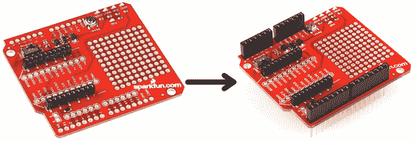](https://cdn.sparkfun.com/assets/learn_tutorials/2/3/0/assembly.png)

查看我们的 Shield 教程的[组装页面，了解与收割台安装相关的所有提示和技巧。](https://learn.sparkfun.com/tutorials/arduino-shields-v2/installing-headers-preparation)

### XBee 插座

屏蔽 PCB 上有一些白色丝网，有助于在您插入 XBee 时确定其方向。确保 XBee 的两条对角线与 PCB 上的两条对角线对齐。

[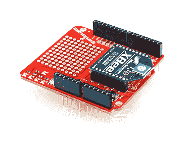](https://cdn.sparkfun.com/assets/learn_tutorials/2/3/0/shield-assembled.png)

安装好一切后，您就可以开始下一步了！编码时间到了...

## 示例:通信测试

**Note:** This example assumes you are using the latest version of the Arduino IDE on your desktop. If this is your first time using Arduino, please review our tutorial on [installing the Arduino IDE.](https://learn.sparkfun.com/tutorials/installing-arduino-ide)

### 仔细检查你的 XBee 网络

**Heads up!** Make sure that the XBees are configured correctly to communicate with each other in the network.

在继续这个例子之前，你需要确保你的 XBee 配置正确——它们需要在**同一个网络**上，并且具有兼容的**目的地和我的地址**。默认情况下，XBees 都是兼容配置的，但是我们建议设置唯一的网络 ID 和地址。查看我们的[探索 XBee 和 XCTU 教程](https://learn.sparkfun.com/tutorials/exploring-xbees-and-xctu)的[配置网络](https://learn.sparkfun.com/tutorials/exploring-xbees-and-xctu/configuring-networks)页面以获得帮助。

[](https://learn.sparkfun.com/tutorials/exploring-xbees-and-xctu) [### 探索 XBees 和 XCTU

#### 2015 年 3 月 12 日](https://learn.sparkfun.com/tutorials/exploring-xbees-and-xctu) How to set up an XBee using your computer, the X-CTU software, and an XBee Explorer interface board.[Favorited Favorite](# "Add to favorites") 18

这个例子假设你已经安装了[XCTU](http://www.digi.com/products/wireless-wired-embedded-solutions/zigbee-rf-modules/xctu)和两个兼容配置的 XBees 一个通过 [USB 浏览器](https://www.sparkfun.com/products/8687)(或[加密狗](https://www.sparkfun.com/products/9819)，或[串行浏览器](https://www.sparkfun.com/products/9111))连接到你的电脑，另一个插入 Shield/Arduino。

[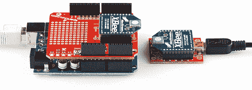](https://cdn.sparkfun.com/assets/learn_tutorials/2/3/0/XBee-Pairs-plugged-in.jpg)

### Arduino 素描

让我们从简单的开始。在本节中，我们将上传一个草图，该草图使用串行 UART 在您的串行监视器和 XBe 之间传递数据。这个草图可以用来在你 Arduino 的串行监视器和另一个 XBee(通过 USB Explorer 连接到计算机)之间创建一个“通信入口”。第一种使用 Arduino 上软件串行定义的引脚。第二个例子使用本地硬件串行定义的引脚。

#### 软件串行直通

这是我们要用的草图。它利用了最近所有 Arduino 版本中包含的[软件串行库](http://arduino.cc/en/Reference/SoftwareSerial)。在上传这个草图之前，**确保防护罩上的开关在“DLINE”位置**！

复制并上传下面的草图。

```
language:c
/*****************************************************************
XBee_Serial_Passthrough.ino

Set up a software serial port to pass data between an XBee Shield
and the serial monitor.

Hardware Hookup:
  The XBee Shield makes all of the connections you'll need
  between Arduino and XBee. If you have the shield make
  sure the SWITCH IS IN THE "DLINE" POSITION. That will connect
  the XBee's DOUT and DIN pins to Arduino pins 2 and 3.

*****************************************************************/
// We'll use SoftwareSerial to communicate with the XBee:
#include <SoftwareSerial.h>

//For Atmega328P's
// XBee's DOUT (TX) is connected to pin 2 (Arduino's Software RX)
// XBee's DIN (RX) is connected to pin 3 (Arduino's Software TX)
SoftwareSerial XBee(2, 3); // RX, TX

//For Atmega2560, ATmega32U4, etc.
// XBee's DOUT (TX) is connected to pin 10 (Arduino's Software RX)
// XBee's DIN (RX) is connected to pin 11 (Arduino's Software TX)
//SoftwareSerial XBee(10, 11); // RX, TX

void setup()
{
  // Set up both ports at 9600 baud. This value is most important
  // for the XBee. Make sure the baud rate matches the config
  // setting of your XBee.
  XBee.begin(9600);
  Serial.begin(9600);
}

void loop()
{
  if (Serial.available())
  { // If data comes in from serial monitor, send it out to XBee
    XBee.write(Serial.read());
  }
  if (XBee.available())
  { // If data comes in from XBee, send it out to serial monitor
    Serial.write(XBee.read());
  }
} 
```

 [#### 软件序列号](#softwareserialpins) The demo code was originally designed for the ATmega328P on the Arduino Uno. Not all the pins can support change interrupts for a serial Rx pin depending on what Arduino microcontroller is used. If you were using it with ATmega2560 (i.e. Arduino Mega 2560) or ATmega32U4 (i.e. Arduino Leonardo, Pro Micro 5V/16MHz, Pro Micro 3.3V/8Mhz, FioV3, etc.), you would need to re-define the software serial pin definitions, remove the solder jumpers for pin 3 & 2, and reroute the pins. For more information about the limitations, try looking at the Arduino reference language for the Software Serial library.

[Arduino Software Serial Library](https://www.arduino.cc/en/Reference/SoftwareSerial)

##### 引脚定义

To use re-define the software serial pins on an Arduino Mega 2560 or Arduino Leonardo, you would just need to [comment out the line](https://www.arduino.cc/reference/en/language/structure/further-syntax/singlelinecomment/) where it says:

```
 SoftwareSerial XBee(2, 3); // RX, TX 
```

and uncomment out the line here:

```
 //SoftwareSerial XBee(10, 11); // RX, TX
```

##### 重新路由引脚

To reroute the pins, on an Arduino Mega 2560 or Leonardo, you would need to remove the solder jumper and reroute pads to the respective pins.

| [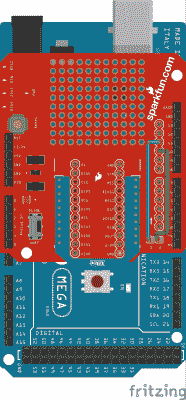](https://cdn.sparkfun.com/assets/learn_tutorials/2/3/0/SparkFun_XBee_Serial_Passthrough_Serial_UART_Jumper_Disconnected_Arduino_Mega_Fritzing_bb.png) | [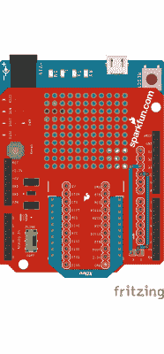](https://cdn.sparkfun.com/assets/learn_tutorials/2/3/0/SparkFun_XBee_Serial_Passthrough_Serial_UART_Jumper_Disconnected_Arduino_Leonardo_Fritzing_bb_2.png) |
| *为基于 ATmega2560 的 Arduino 重新布线的引脚* | *基于 ATmega32U4 的 Arduino 引脚重新路由* |

**Warning for Users *NOT* Using the Arduino Serial Monitor!** If you are using Digi's X-CTU or a [serial terminal](https://learn.sparkfun.com/tutorials/terminal-basics/tera-term-windows) to configure or connect to an XBee by using a RedBoard/Arduino Uno as a serial passthrough, you may need to add a jumper wire between the RST and 5V pin to prevent the Arduino from resetting.

[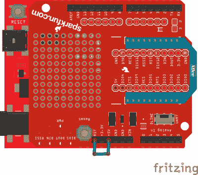](https://cdn.sparkfun.com/assets/learn_tutorials/2/3/0/SparkFun_XBee_Shield_Serial_Passthrough_Serial_UART_Fritzing_bb.png)
Basically when the XCTU or serial terminal opens a COM port to the Arduino, computer resets the microcontroller while looking for the XBee. Therefore, it can’t communicate with the XBee because the Arduino is rebooting.

#### 硬件串行直通

这个例子是为那些试图在基于 ATmega32U4 的 Arduino 上使用硬件 UART 的人准备的。复制并上传下面的草图。也可以在这里下载[。](https://cdn.sparkfun.com/assets/learn_tutorials/2/3/0/Leonardo_XBee_Serial_Passthrough.zip)

```
language:c
/*****************************************************************
Leonardo_XBee_Serial_Passthrough.ino

Set up a serial port to pass data between an XBee Shield
and the serial monitor.

Hardware Hookup:
  The XBee Shield makes all of the connections you'll need
  between Arduino and XBee. If you have the shield make
  sure the SWITCH IS IN THE "UART" POSITION. That will connect
  the XBee's DOUT and DIN pins to Arduino pins 0 and 1.
*****************************************************************/

// Leonardo Serial  is the USB port
// Leonardo Serial1 is pins 0 and 1

void setup()
{
  // Set up both ports at 9600 baud. This value is most important
  // for the XBee. Make sure the baud rate matches the config
  // setting of your XBee.
  Serial1.begin(9600);  //XBee/UART1/pins 0 and 1
  Serial.begin(9600);   //USB

}

void loop()
{
  if (Serial.available()) //USB
  { // If data comes in from serial monitor, send it out to XBee
  Serial1.write(Serial.read()); //XBee/UART1/pins 0 and 1

  }
  if (Serial1.available())   //XBee/UART1/pins 0 and 1
  { // If data comes in from XBee, send it out to serial monitor
    Serial.write(Serial1.read());  //Serial port

  }
} 
```

**Note:** If you are using an Arduino Leonardo (or any ATmega32U4-based Arduino) and not a Arduino Uno, make sure to change the switch to the **hardware "UART"** position. In this case, do not need to add a jumper wire between the RST and GND pin.

[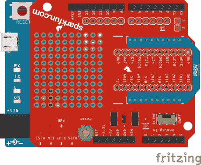](https://cdn.sparkfun.com/assets/learn_tutorials/2/3/0/SparkFun_XBee_Shield_Arduino_Leonardo_ATmega32U4_Fritzing_bb.png)

* * *

### 你应该看到什么

上传代码后，按照以下一系列步骤验证一切正常:

1.  打开 Arduino 的**串行监视器**。确保波特率设置为 **9600** 。
2.  切换到 XCTU 并点击切换到**控制台模式**。
3.  在控制台视图中键入一些内容，它应该会显示在串行监视器上。
4.  在串行监视器中输入一些东西(然后按“发送”)，它应该会出现在控制台视图中。
5.  耶！

[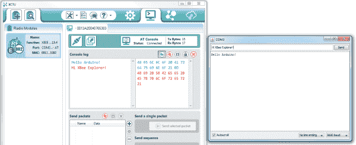](https://cdn.sparkfun.com/assets/learn_tutorials/2/3/0/serial_example.png)

您可以使用这个设置来创建一个聊天系统。如果您附近有另一台电脑，请尝试查看您的 XBees 在仍然可靠通信的情况下彼此可以相距多远。

如果您的 XBee 不能相互通信，请尝试让它们靠得更近(如果它们一开始就离得很远)。否则，请查看探索 XBee 教程的[故障排除部分](https://learn.sparkfun.com/tutorials/exploring-xbees-and-xctu/troubleshooting)。

## 示例:遥控 Arduino

建立一个聊天系统很有趣，但是 XBees 和 XBee Shield 真正的亮点是在 Arduino 之间传递数据，所以你可以远程控制它或从它那里接收数据。在本例中，我们将创建一个简单的串行接口，用于设置和读取模拟和数字引脚。

### 示例草图

这是草图。从下面复制粘贴，或者[点击这里下载](https://cdn.sparkfun.com/assets/learn_tutorials/2/3/0/XBee_Remote_Control.zip)。

```
language:c
/*****************************************************************
XBee_Remote_Control.ino
Write your Arduino's pins (analog or digital) or read from those
pins (analog or digital) using a remote XBee.
Jim Lindblom @ SparkFun Electronics
Original Creation Date: May 7, 2014

This sketch requires an XBee, XBee Shield and another XBee tied to
your computer (via a USB Explorer). You can use XCTU's console, or
another serial terminal program (even the serial monitor!), to send
commands to the Arduino. 

Example usage (send these commands from your computer terminal):
    w#nnn - analog WRITE pin # to nnn
      e.g. w6088 - write pin 6 to 88
    d#v   - digital WRITE pin # to v
      e.g. ddh - Write pin 13 High
    r#    - digital READ digital pin #
      e.g. r3 - Digital read pin 3
    a#    - analog READ analog pin #
      e.g. a0 - Read analog pin 0

    - Use hex values for pins 10-13
    - Upper or lowercase works
    - Use 0, l, or L to write LOW
    - Use 1, h, or H to write HIGH

Hardware Hookup:
  The Arduino shield makes all of the connections you'll need
  between Arduino and XBee. Make sure the SWITCH IS IN THE 
  "DLINE" POSITION.

Development environment specifics:
    IDE: Arduino 1.0.5
    Hardware Platform: SparkFun RedBoard
    XBee Shield & XBee Series 1 1mW (w/ whip antenna)
        XBee USB Explorer connected to computer with another
          XBee Series 1 1mW connected to that.

This code is beerware; if you see me (or any other SparkFun 
employee) at the local, and you've found our code helpful, please 
buy us a round!

Distributed as-is; no warranty is given.
*****************************************************************/
// SoftwareSerial is used to communicate with the XBee
#include <SoftwareSerial.h>

SoftwareSerial XBee(2, 3); // Arduino RX, TX (XBee Dout, Din)

void setup()
{
  // Initialize XBee Software Serial port. Make sure the baud
  // rate matches your XBee setting (9600 is default).
  XBee.begin(9600); 
  printMenu(); // Print a helpful menu:

}

void loop()
{
  // In loop() we continously check to see if a command has been
  //  received.
  if (XBee.available())
  {
    char c = XBee.read();
    switch (c)
    {
    case 'w':      // If received 'w'
    case 'W':      // or 'W'
      writeAPin(); // Write analog pin
      break;
    case 'd':      // If received 'd'
    case 'D':      // or 'D'
      writeDPin(); // Write digital pin
      break;
    case 'r':      // If received 'r'
    case 'R':      // or 'R'
      readDPin();  // Read digital pin
      break;
    case 'a':      // If received 'a'
    case 'A':      // or 'A'
      readAPin();  // Read analog pin
      break;
    }
  }
}

// Write Digital Pin
// Send a 'd' or 'D' to enter.
// Then send a pin #
//   Use numbers for 0-9, and hex (a, b, c, or d) for 10-13
// Then send a value for high or low
//   Use h, H, or 1 for HIGH. Use l, L, or 0 for LOW
void writeDPin()
{
  while (XBee.available() < 2)
    ; // Wait for pin and value to become available
  char pin = XBee.read();
  char hl = ASCIItoHL(XBee.read());

  // Print a message to let the control know of our intentions:
  XBee.print("Setting pin ");
  XBee.print(pin);
  XBee.print(" to ");
  XBee.println(hl ? "HIGH" : "LOW");

  pin = ASCIItoInt(pin); // Convert ASCCI to a 0-13 value
  pinMode(pin, OUTPUT); // Set pin as an OUTPUT
  digitalWrite(pin, hl); // Write pin accordingly
}

// Write Analog Pin
// Send 'w' or 'W' to enter
// Then send a pin #
//   Use numbers for 0-9, and hex (a, b, c, or d) for 10-13
//   (it's not smart enough (but it could be) to error on
//    a non-analog output pin)
// Then send a 3-digit analog value.
//   Must send all 3 digits, so use leading zeros if necessary.
void writeAPin()
{
  while (XBee.available() < 4)
    ; // Wait for pin and three value numbers to be received
  char pin = XBee.read(); // Read in the pin number
  int value = ASCIItoInt(XBee.read()) * 100; // Convert next three
  value += ASCIItoInt(XBee.read()) * 10;     // chars to a 3-digit
  value += ASCIItoInt(XBee.read());          // number.
  value = constrain(value, 0, 255); // Constrain that number.

  // Print a message to let the control know of our intentions:
  XBee.print("Setting pin ");
  XBee.print(pin);
  XBee.print(" to ");
  XBee.println(value);

  pin = ASCIItoInt(pin); // Convert ASCCI to a 0-13 value
  pinMode(pin, OUTPUT); // Set pin as an OUTPUT
  analogWrite(pin, value); // Write pin accordingly
}

// Read Digital Pin
// Send 'r' or 'R' to enter
// Then send a digital pin # to be read
// The Arduino will print the digital reading of the pin to XBee.
void readDPin()
{
  while (XBee.available() < 1)
    ; // Wait for pin # to be available.
  char pin = XBee.read(); // Read in the pin value

  // Print beggining of message
  XBee.print("Pin ");
  XBee.print(pin);

  pin = ASCIItoInt(pin); // Convert pin to 0-13 value
  pinMode(pin, INPUT); // Set as input
  // Print the rest of the message:
  XBee.print(" = "); 
  XBee.println(digitalRead(pin));
}

// Read Analog Pin
// Send 'a' or 'A' to enter
// Then send an analog pin # to be read.
// The Arduino will print the analog reading of the pin to XBee.
void readAPin()
{
  while (XBee.available() < 1)
    ; // Wait for pin # to be available
  char pin = XBee.read(); // read in the pin value

  // Print beginning of message
  XBee.print("Pin A");
  XBee.print(pin);

  pin = ASCIItoInt(pin); // Convert pin to 0-6 value
  // Printthe rest of the message:
  XBee.print(" = ");
  XBee.println(analogRead(pin));
}

// ASCIItoHL
// Helper function to turn an ASCII value into either HIGH or LOW
int ASCIItoHL(char c)
{
  // If received 0, byte value 0, L, or l: return LOW
  // If received 1, byte value 1, H, or h: return HIGH
  if ((c == '0') || (c == 0) || (c == 'L') || (c == 'l'))
    return LOW;
  else if ((c == '1') || (c == 1) || (c == 'H') || (c == 'h'))
    return HIGH;
  else
    return -1;
}

// ASCIItoInt
// Helper function to turn an ASCII hex value into a 0-15 byte val
int ASCIItoInt(char c)
{
  if ((c >= '0') && (c <= '9'))
    return c - 0x30; // Minus 0x30
  else if ((c >= 'A') && (c <= 'F'))
    return c - 0x37; // Minus 0x41 plus 0x0A
  else if ((c >= 'a') && (c <= 'f'))
    return c - 0x57; // Minus 0x61 plus 0x0A
  else
    return -1;
}

// printMenu
// A big ol' string of Serial prints that print a usage menu over
// to the other XBee.
void printMenu()
{
  // Everything is "F()"'d -- which stores the strings in flash.
  // That'll free up SRAM for more importanat stuff.
  XBee.println();
  XBee.println(F("Arduino XBee Remote Control!"));
  XBee.println(F("============================"));
  XBee.println(F("Usage: "));
  XBee.println(F("w#nnn - analog WRITE pin # to nnn"));
  XBee.println(F("  e.g. w6088 - write pin 6 to 88"));
  XBee.println(F("d#v   - digital WRITE pin # to v"));
  XBee.println(F("  e.g. ddh - Write pin 13 High"));
  XBee.println(F("r#    - digital READ digital pin #"));
  XBee.println(F("  e.g. r3 - Digital read pin 3"));
  XBee.println(F("a#    - analog READ analog pin #"));
  XBee.println(F("  e.g. a0 - Read analog pin 0"));
  XBee.println();
  XBee.println(F("- Use hex values for pins 10-13"));
  XBee.println(F("- Upper or lowercase works"));
  XBee.println(F("- Use 0, l, or L to write LOW"));
  XBee.println(F("- Use 1, h, or H to write HIGH"));
  XBee.println(F("============================"));  
  XBee.println();
} 
```

上传，然后切换到你的 XCTU 控制台窗口。您将使用连接到电脑的 XBee 来控制和读取 Arduino 中的数据。

所有的 XBee 魔法都发生在连续的打印和读取中。为了从 Arduino XBee 发送数据，`XBee.print()`和`XBee.println()`用于写入字符串和其他数据。为了从计算机 XBee 中读取数据，我们可以使用`XBee.read()`，添加`XBee.available()`测试来检查数据是否已经输入。这就是全部了！

查看代码中的注释，进行逐行剖析。

### 远程控制/接收

当 Arduino sketch 第一次启动时，它会打印一个有用的使用菜单。打印之后，按照指示向您的 Arduino 发送命令。要控制管脚 10、11、12 和 13，发送[十六进制](https://learn.sparkfun.com/tutorials/hexadecimal)等效字符(A、B、C 和 D)。

*   `w#nnn` - **模拟写**引脚`#`到`nnn`。对一位数和两位数的值使用前导零。
    *   例:`w6088`将管脚 6 写到 88
*   `d#v` - **数字写**引脚`#`到`v`。`v`可以是 1、H 或 H 代表高，0、L 或 L 代表低。
    *   例:`ddh`将引脚 13 写高
*   `r#` - **数字读取**数字引脚`#`
    *   示例:`r3`将从引脚 3 读取数字。
*   `a#` - **模拟读取**模拟引脚`#`
    *   示例:`a0`将读取模拟引脚 0

在每种情况下，Arduino 都会在你发送了一个有效的字符串后用它所采取的动作来响应。

作为初始测试，通过发送`dd1`和`dd0`，尝试打开和关闭 D13 LED。

[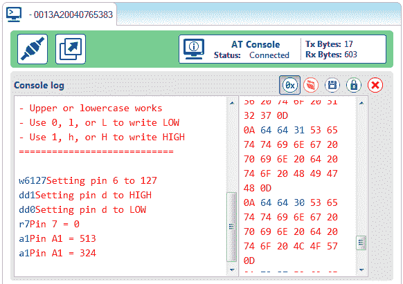](https://cdn.sparkfun.com/assets/learn_tutorials/2/3/0/remote-control-console.png)

然后尝试设置模拟值，或从引脚读取。也许试着让它变得更高级——让一个按钮触发 XBee 通信。或者当模拟输入超过某个阈值时发出警报。

* * *

这个例子仅仅触及了 Arduino-XBee 组合的皮毛。XBee 可以让你在舒适的电脑中远程控制你的机器人。或者你可以建立一个 XBees 网络来监控每个房间的一氧化碳状况，同时登录到一台电脑上。

XBees 的强大来自于它们的简单性——它们通过简单的“串行打印”使你的项目无线化。

## 资源和更进一步

这应该足够让你开始了。如果您正在寻找更多 XBee 和 XBee Shield 信息，请查看以下资源:

*   [原理图](http://cdn.sparkfun.com/datasheets/Dev/Arduino/Shields/xbeeshield-v14.pdf) -如果你对原理图的布局感到困惑，看看这个 PDF。
*   XBee 系列 1 手册 -对于更高级的用户，如果你真的想利用 XBee 的独特能力，看看这个指南。
*   [XBee 无线课程材料](https://learn.sparkfun.com/resources/14) -查看我们偶尔领导的 XBee 课程的教学材料。
*   GitHub Repo -这是你可以找到最新 PCB 设计文件的地方。

有了 XBee 和 XBee Shield，您就拥有了将项目公之于众的所有必要工具。你打算做什么？需要一些灵感吗？查看这些相关教程:

*   [XBee WiFi 连接指南](https://learn.sparkfun.com/tutorials/xbee-wifi-hookup-guide) -使用 XBee WiFi，开始 XBee 的下一步。这些模块允许您连接到无线网络，并为您的 Arduino 提供互联网接入！
*   [使用 XBee WiFi 进行互联网数据记录](https://learn.sparkfun.com/tutorials/internet-datalogging-with-arduino-and-xbee-wifi) -需要进行一些基于“云”的数据记录。看看这篇教程，它向你展示了如何使用 XBee WiFi、XBee Shield 和 Arduino 在互联网上粘贴传感器读数。
*   Simon Splosion Wireless -本教程演示了“黑掉”Simon 说的许多技术之一——使用 XBee 使 Simon 游戏无线化！
*   RedBot 入门——red bot 是我们广受欢迎的基于 Arduino 的机器人平台。一旦你让它运转起来，你可以通过 XBee 控制它更进一步！

[](https://learn.sparkfun.com/tutorials/simon-splosion-wireless) [### 西蒙无线公司](https://learn.sparkfun.com/tutorials/simon-splosion-wireless) This is a tutorial demonstrating one of many techniques to "hack" the Simon Says. We will highlight the technique to take your Simon Says Wireless.[Favorited Favorite](# "Add to favorites") 3[](https://learn.sparkfun.com/tutorials/xbee-wifi-hookup-guide) [### XBee WiFi 连接指南](https://learn.sparkfun.com/tutorials/xbee-wifi-hookup-guide) An overview of Digi's WiFi XBees, and a quick how-to on getting them connected and interfacing with the cloud.[Favorited Favorite](# "Add to favorites") 10[](https://learn.sparkfun.com/tutorials/experiment-guide-for-redbot-with-shadow-chassis) [### 带影子底盘的 RedBot 实验指南](https://learn.sparkfun.com/tutorials/experiment-guide-for-redbot-with-shadow-chassis) This Experiment Guide offers nine experiments to get you started with the SparkFun RedBot. This guide is designed for those who are familiar with our SparkFun Inventor's Kit and want to take their robotics knowledge to the next level.[Favorited Favorite](# "Add to favorites") 11[](https://learn.sparkfun.com/tutorials/wireless-gesture-controlled-robot) [### 无线手势控制机器人](https://learn.sparkfun.com/tutorials/wireless-gesture-controlled-robot) Control the RedBot wirelessly based on the movement of your hand using an accelerometer, Arduino, and XBees 11

或者看看这篇博文，了解更多想法。

[](https://www.sparkfun.com/news/3289 "May 5, 2020: Sometimes you need the real-time interaction that only a meeting can provide. Keep family members from wandering in on your important meetings with this simple alert!") [### 简单无线通知项目

May 5, 2020](https://www.sparkfun.com/news/3289 "May 5, 2020: Sometimes you need the real-time interaction that only a meeting can provide. Keep family members from wandering in on your important meetings with this simple alert!")[Favorited Favorite](# "Add to favorites") 2****