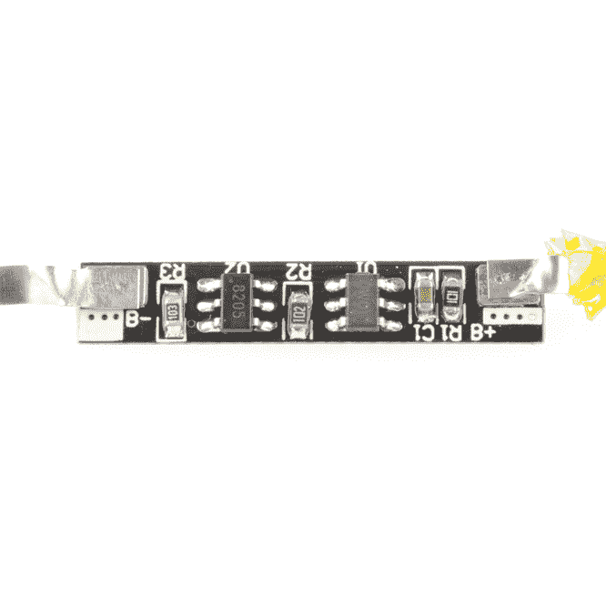

# 拆卸:DDC Mobile X900

> 原文：<https://learn.sparkfun.com/tutorials/teardown-ddc-mobile-x900>

## 最新最棒的

在最近的一次中国之行中，我们无畏的领袖遇到了一个非常特殊的移动设备。它的外形独一无二，重量自成一类，还有一个相机和闪光灯，这是你通常在手机上找不到的。最重要的是，它像一个...良好的...像砖头一样。当我们拆开它时，迎接我们的是各种各样的惊喜！

和我一起去发现这个巨大的手机中隐藏着什么样的太空时代技术吧！

## “功能”和“附件”

在我们开始欣赏这一美景之前，让我们先花点时间来探索一下这些花里胡哨的东西。盒子上宣传的是大型“streo”扬声器和一个“能照 30 米”的强光手电筒。不仅如此，它还“支持多语言”，最重要的是:“sbook”

打开盒子，您会看到以下内容:

在左边，你会注意到这款手机自带非常运动的耳机。它有两个硬塑料耳塞，有点像麦克风，还有一个纽扣状的突起。尽管许多手机试图通过一个无用的音频插孔来实现所有这些功能，但 X900 相当聪明地(错误地)使用了 USB mini-B 连接器。

此时，你可能会想，“如果 USB mini-B 端口是耳机用的，那我该如何充电呢？”别担心！如果你有墙壁插座和适合你所在国家的适配器，附带的充电器可以很好地插入 USB 端口上方的小型桶形插孔连接器中。

最后我们来看电话:

我能听到你。你说，“请告诉我这是一个巨大的，但有点昏暗的 LED 手电筒。”哦，你真讨厌。打开它就像把“独特的手电筒按钮开关”按到 *on* 位置一样简单，或者，你可以想象，把手机放在你的钱包或口袋里。

就在那下面，你会注意到一个全 USB-A 充电端口。不是为了给手机充电，而是为了让手机能给其他东西充电...如果你有电池支持，这是一个不错的技巧。说到这里，我们来看看那个电池:

滑下后盖，你会注意到电池是一个巨大的砖。然而，你很快就被下面奇怪的混乱分散了注意力:

哦是的。两个 SIM 卡插槽和一个 SD 存储插槽。这肯定是一部间谍手机，就像 007 可能携带的一样。但是最后我认为是时候进入重要的部分了:操作系统。

好吧，它不是没有怪癖，但是稍微探索一下就会找到游戏目录:

手机只配一个游戏，因为你只需要一个游戏。这个游戏就是...嗯，我真的不知道它叫什么或者怎么玩。它以一只一点都不喜欢虫子的熊猫为特色:

好了，够了。这部手机一定有更多的秘密，唯一的办法就是打开它！

## 重量级笨蛋

当你拿起 X900 时，你会注意到的第一件事就是它的巨大重量。这款手机给人的感觉是*坚固*，而且它的某些部分确实如此。但是这些重量来自哪里呢？让我们来看看:

正如你所看到的，手机和电池总共重达 8.45 盎司。相比之下，iPhone 5s 的整体重量只有 3.95 盎司。或许这种重量差异可以用巨大的“8000 mAh”电池块来解释:

哦...嗯（表示踌躇等）...让我们开始把手机拆开，看看是否是不寻常的大功率手电筒增加了质量:

它不在那里...但是等待只剩下一个地方可以藏重物...

没错。X900 的前面板由金属铸造而成，重量比 iPhone 5s 重四分之一盎司。这看起来不妙。事实上，现在想想，电池似乎真的很轻。那东西的容量是多少？

嗯，它说 3.7V 时 8800mAh，但我接触过不少电池，我不认为这是真的。通常，我不会建议撕开手机电池，但我有一种非常好的感觉，一旦贴纸被撕掉，我可能会出现...良好的...这个:

那是 18650！这是一个普通的圆柱形锂离子电池，它确实是可充电的，但它只有 2000 毫安时。这还不到宣传容量的四分之一。

够近了。

让我们再深入一点，这越来越有趣了...

## 淘气的部分

现在我们知道右边的笨比特比左边的聪明比特重得多，让我们来看看这个“聪明比特”到底有多聪明。

剪断几根电线后，手机主板毫不费力地脱离了框架。你会注意到主板用一些薄电线连接到各种东西，包括天线、手电筒和 USB 充电端口。在这一点上值得一提的是，手电筒实际上只是一个 LED，后面有一些散热材料，通过滑动开关直接连接到电源导轨。

如果这是盒子吹嘘的扬声器，那么盒子就对了一半。这是一款“大型扬声器”，但绝对不是“streo 扬声器”让我们翻过来看看键盘。

这绝对是一个非常标准的键盘，但是等一下...这下面是什么？

什么鬼东西？这是一个秘密键盘。我告诉过你这是某种间谍手机。我想事情是这样的，DDC Mobile 的优秀员工买了一堆电话板和一堆橡胶键盘，但是它们不兼容...所以他们不得不塞进另一块板子来匹配它们。

因此...有一张贴纸。我真的希望它能为我提供一些线索，但我根本不知道如何破译。不过，这是主板的 2.0 版，所以肯定有更差的版本。这是一种进步。

## 一袋薯片

我想我们已经看到了肮脏的真相，但我们无法知道整个故事，直到我们得到一把数据表。让我们开始寻找零件号:

找到一个！这个相机模块上的丝网印刷显示了一个名为 [GC6123](https://cdn.sparkfun.com/assets/learn_tutorials/2/5/1/GC6123.JPG) 的图像传感器的数据表。这款图像传感器拥有高达 240x320 像素的分辨率，如今一定很受欢迎。那只是百万像素的一小部分！

啊哈！这次行动的主脑！上图中的两个 IC 都是由同一家公司制造的:RDA 微电子公司。这是我第一次在搜索数据手册时遇到麻烦，因为零件号带来的论坛比任何东西都多。论坛上满是试图获得工具和固件来重新编程芯片，以制造廉价手机和克隆 IMEIs 的人。显然，RDA8851C 是这些廉价中国手机中非常受欢迎的控制器。为什么不会呢？集成片上闪存、摄像头接口、键盘扫描仪、四频段集成收发器...在某种程度上，这个东西*就是*电话。

唯一看起来没有集成的组件？前端射频模块。这就是 [RDA6625](https://cdn.sparkfun.com/assets/learn_tutorials/2/5/1/2011121311093093.pdf) 介入的地方。

好了，我们现在有点明白手机是如何工作的了，但是让我们再来看看电池。说实话，18650 不是电池盒中唯一的东西。我还发现了这个:

包含一对电池保护 IC 的板:

[S8205](https://cdn.sparkfun.com/assets/learn_tutorials/2/5/1/S8205A_B_E.pdf) ，保护多个电芯免于过充电、过放电和过电流。

而 [DW01](https://cdn.sparkfun.com/assets/learn_tutorials/2/5/1/DW01-P_DataSheet_V10.pdf) 似乎只对单个细胞做完全相同的事情...这就是。这让我相信电池板被用于多种电池，你可能会在中国 40%的锂电池中发现相同的电池板。

## 这太奇怪了

所以你有它。X900 是一款来自中国的廉价四频手机。它是由一家名为 DDC 的公司制造的，显然是由其他手机的零件制成的，并贴有“诺基亚”的标签实际上，该设备重量的一半是面板，电池只有广告容量的四分之一。但是你知道吗？

我喜欢。

这让我觉得如果我真的想的话，我可以造一部手机。事实上，我可能会把这款手机的内脏变成一个合理大小的设备。我甚至在手机里放了一张美国电话电报公司的 SIM 卡，它工作正常！如果你需要的只是一部没有多余装饰、重量和外形像摩托罗拉砖块手机的手机...X900 适合您。

## 数据表:

*   [GC6123 图像传感器](https://cdn.sparkfun.com/assets/learn_tutorials/2/5/1/GC6123.JPG)

*   [S8205 电池集成电路](https://cdn.sparkfun.com/assets/learn_tutorials/2/5/1/S8205A_B_E.pdf)

*   [DW01 电池 IC](https://cdn.sparkfun.com/assets/learn_tutorials/2/5/1/DW01-P_DataSheet_V10.pdf)

*   [RDA 8851C 手机控制器](https://cdn.sparkfun.com/assets/learn_tutorials/2/5/1/2012071602050788.pdf)

*   [RDA 6625 前端模块](https://cdn.sparkfun.com/assets/learn_tutorials/2/5/1/2011121311093093.pdf)