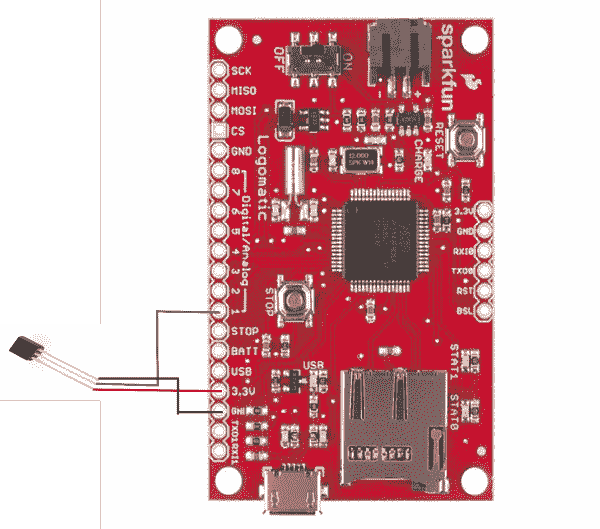

# Logomatic 连接指南

> 原文：<https://learn.sparkfun.com/tutorials/logomatic-hookup-guide>

## 伐木不仅仅是伐木工人的事情

[Logomatic](https://www.sparkfun.com/products/12772) 是一个数据记录器，允许您记录项目中的模拟或串行数据。它可以登录到 microSD 卡，并与高容量卡兼容。该板可以通过 microUSB 插入，并作为通用大容量存储设备安装。

[](https://www.sparkfun.com/products/12772) 

将**添加到您的[购物车](https://www.sparkfun.com/cart)中！**

 **### [【spark fun Logomatic v2-串行 SD 数据记录器(FAT32)](https://www.sparkfun.com/products/12772)

[In stock](https://learn.sparkfun.com/static/bubbles/ "in stock") WIG-12772

SparkFun Logomatic v2 采用了我们多年来从您的项目记录模拟或串行数据中学到的一切。

$63.5010[Favorited Favorite](# "Add to favorites") 20[Wish List](# "Add to wish list")** **### 推荐阅读

如果您不熟悉以下任何概念，您可能希望在继续使用 Logomatic 之前先回顾一下它们。

[](https://learn.sparkfun.com/tutorials/serial-communication) [### 串行通信](https://learn.sparkfun.com/tutorials/serial-communication) Asynchronous serial communication concepts: packets, signal levels, baud rates, UARTs and more 100[](https://learn.sparkfun.com/tutorials/battery-technologies) [### 电池技术](https://learn.sparkfun.com/tutorials/battery-technologies) The basics behind the batteries used in portable electronic devices: LiPo, NiMH, coin cells, and alkaline.[Favorited Favorite](# "Add to favorites") 50[](https://learn.sparkfun.com/tutorials/how-to-power-a-project) [### 如何为项目提供动力](https://learn.sparkfun.com/tutorials/how-to-power-a-project) A tutorial to help figure out the power requirements of your project.[Favorited Favorite](# "Add to favorites") 67[](https://learn.sparkfun.com/tutorials/working-with-wire) [### 使用导线](https://learn.sparkfun.com/tutorials/working-with-wire) How to strip, crimp, and work with wire.[Favorited Favorite](# "Add to favorites") 50[](https://learn.sparkfun.com/tutorials/using-github-to-share-with-sparkfun) [### 使用 GitHub 与 SparkFun 分享](https://learn.sparkfun.com/tutorials/using-github-to-share-with-sparkfun) A simple step-by-step tutorial to help you download files from SparkFun's GitHub site, make changes, and share the changes with SparkFun.[Favorited Favorite](# "Add to favorites") 12[](https://learn.sparkfun.com/tutorials/terminal-basics) [### 串行终端基础知识](https://learn.sparkfun.com/tutorials/terminal-basics) This tutorial will show you how to communicate with your serial devices using a variety of terminal emulator applications.[Favorited Favorite](# "Add to favorites") 46

## 硬件概述

#### 力量

Logomatic 有一个非常有用的电源电路。有一个板载电源开关，用户可以根据需要关闭电路板以省电。该板还带有一个 JST 连接器，用于将 [LiPo 电池](https://www.sparkfun.com/search/results?term=polymer+lithium)连接到板上。当有电池插入板中，并且板通过 USB 连接时，电池也将被充电。您不需要打开主板来给电池充电。

板上还有一个低压差 3.3V 调节器。电压调节器的最大功耗约为 450 mW，Logomatic 的最大电流消耗约为 80 mA。这使得 Logomatic 的最大电压为(450mW)/(80mA) + 3.3V = 8.925V。然而，这几乎会使电压调节器进入热关断状态。为防止这种情况，电源电压应保持在 3.6V 至 7.5V 之间。

#### 微型 B USB 连接器

⚡ **Warning!** You will need to add a LiPo battery to the Logomatic in order to initialize the files or mount as a USB drive. The power from a USB cable will not be sufficient to power the board from the microB connector. Additionally, the charge rate for the MCP73831's is set at **500mA**. Make sure to have a battery that is higher than 500mAh to safely charge the LiPo battery.

[](https://www.sparkfun.com/products/13813) 

将**添加到您的[购物车](https://www.sparkfun.com/cart)中！**

 **### [锂离子电池-1Ah](https://www.sparkfun.com/products/13813)

[In stock](https://learn.sparkfun.com/static/bubbles/ "in stock") PRT-13813

基于锂离子化学的超薄超轻电池。每个电池在 1000 毫安时输出 3.7V 的标称电压！

$10.958[Favorited Favorite](# "Add to favorites") 75[Wish List](# "Add to wish list")****[](https://www.sparkfun.com/products/13854) 

将**添加到您的[购物车](https://www.sparkfun.com/cart)中！**

 **### [锂离子电池- 850mAh](https://www.sparkfun.com/products/13854)

[In stock](https://learn.sparkfun.com/static/bubbles/ "in stock") PRT-13854

这是基于锂离子化学的非常薄、非常轻的电池。每个电池在 850℃时输出 3.7V 的标称电压…

$10.952[Favorited Favorite](# "Add to favorites") 17[Wish List](# "Add to wish list")****[](https://www.sparkfun.com/products/13855) 

将**添加到您的[购物车](https://www.sparkfun.com/cart)中！**

 **### [锂离子电池- 2Ah](https://www.sparkfun.com/products/13855)

[In stock](https://learn.sparkfun.com/static/bubbles/ "in stock") PRT-13855

这是基于锂离子化学的非常薄、非常轻的电池。每个电池在 200 伏时输出一个标称的 3.7 伏电压…

$13.959[Favorited Favorite](# "Add to favorites") 43[Wish List](# "Add to wish list")****[](https://www.sparkfun.com/products/13856) 

将**添加到您的[购物车](https://www.sparkfun.com/cart)中！**

 **### [锂离子电池- 6Ah](https://www.sparkfun.com/products/13856)

[In stock](https://learn.sparkfun.com/static/bubbles/ "in stock") PRT-13856

如果你需要一些果汁，这 6Ah 锂离子电池是给你的。这些是基于锂离子化学电池的非常紧凑的电池…

$32.507[Favorited Favorite](# "Add to favorites") 40[Wish List](# "Add to wish list")******** ********microSD 卡可以通过 USB 访问。当使用 microUSB 电缆连接到计算机时，Logomatic 将作为新的驱动器安装。一旦主板打开，这看起来就像一个标准的闪存驱动器。一旦装载，您就可以创建、删除或编辑文件。要移除它，只需关闭主板，并断开 USB 电缆。

#### 停止按钮

停止按钮将停止 Logomatic。所有记录将停止，任何部分填充的缓冲区将自动记录到 microSD 卡。关闭 Logomatic 或移除其电源也将停止设备记录(并保持日志文件完整)，但是，如果有部分填充的缓冲区，它将不会被记录。当使用停止按钮停止设备时，led 将持续闪烁，直到设备重新通电。

[](https://cdn.sparkfun.com/assets/learn_tutorials/2/4/8/Logomatic_labeled.jpg)

## 日志记录配置

### 第一次通电

⚡ **Warning!** Remember, you will need to add a LiPo battery to the Logomatic in order to initialize the files or mount as a USB drive. The power from a USB cable will not be sufficient to power the board from the microB connector.

#### 初始化配置和日志文件

首次启动 Logomatic 之前，请将 microSD 卡插入读卡器，并确保将其格式化为 FAT32。将卡插入您的 Logomatic，将 LiPo 电池插入两针 JST 连接器，并将电源开关转到 ON 位置。*状态 0* 和*状态 1*led 将放心地闪烁，然后熄灭。

#### 作为 USB 驱动器安装

关闭本机，将 USB(微型 B 型连接器)插入本机，然后使用电源开关重新打开电源。该单元将作为一个驱动器安装在您的计算机上(或者，您可以移除卡并使用读卡器来读取它)。现在你会在你的卡上找到两个文件， **LOGCON。TXT** 和 **LOG0。TXT** 。第一个文件是配置文件，第二个文件是第一个日志文件(空)。在文本编辑器中打开配置文件，您将看到以下默认配置:

```
MODE = 0
ASCII = Y
Baud = 4
Frequency = 100
Trigger Character = $
Text Frame = 100
AD1.3 = N
AD0.3 = N
AD0.2 = N
AD0.1 = N
AD1.2 = N
AD0.4 = N
AD1.7 = N
AD1.6 = N
Safety On = Y 
```

### 配置**日志图标。TXT** 文件

日志图标。TXT 允许您控制 Logomatic 将数据记录到存储卡的方式。让我们检查一下不同的设置。

#### 方式

有 3 种模式设置:

*   **“Mode = 0”(自动 UART 记录)** -记录 UART0 上的所有输入，前提是 UART 配置正确(8 个数据位，一个停止位，无奇偶校验，数据速率由您选择)。

*   **"Mode = 1 "(触发的 UART 记录)** -记录指定数量的字符(在这种情况下，" Text Frame = 100 "将导致在触发后记录 99 个字符)，在指定字符之后(在这种情况下，" Trigger = $ ")。

*   **“模式= 2”(ADC 记录)** -记录 ADC 测量值，根据该测量值，在指定的任何频率下(本例中频率= 100)选择激活(见下文)。

#### 美国信息交换标准代码

“ASCII”域仅适用于 ADC 模式(模式“2”)。它指定设备是否会以这些格式记录:

*   **“ASCII = Y”**-ASCII
*   **“ASCII = N”**-二进制

#### 波特

“波特率”域设置 UART 记录模式的波特率。可用的费率如下:

```
"1" = 1200
"2" = 2400
"3" = 4800
"4" = 9600
"5" = 19200
"6" = 38400
"7" = 57600
"8" = 115200 
```

#### 频率

“频率”字段仅适用于 ADC 记录模式，负责设置 Logomatic 的采样率。显示的数字(本例中为 100)以赫兹为单位，可以从 **1 到 9999** 进行设置。但是，如果频率安全处于激活状态，将按照安全开启部分中的指示施加最大值。

**Note:** If you are setting the frequency between **1-9 Hz**, make sure to add a "**0**" before number in the Logomatic's *LOGCON.txt* configuration file. For example, if you are logging at a rate of **1Hz**, you will need to set the Frequency to "**01**". Below is an example of part of the configuration file:

```
  MODE = 2
ASCII = Y
Baud = 4
Frequency = 01
.
.
. 

```

#### 触发字符

“触发字符”字段仅适用于触发的 UART 模式(模式 1)。这是设备开始记录指定数量的字符所等待的字符。

#### 文本框架

“文本框”字段指定当 Logomatic 在模式 1 下运行时，要用触发字符记录的字符数。读者应该知道，记录的文本框架中的第一个字符将是触发字符，因此如果您希望在触发后记录 100 个字符，您应该将文本框架设置为 101。

**Note:** This mode of operation is slightly different than the other modes in that each text frame has it owns dedicated 512 byte buffer. When the end of the text frame is reached, the buffer will be logged, and any new data coming in will be routed to the other input buffer.

每个文本框架由回车符和换行符分隔，因此最大文本框架大小为 510 字节。如果超过这个数字，它将自动重置为 510。

#### 工作 ADC 线路

配置文件中接下来的八行表示 Logomatic 将读取哪些 ADC 行。通过将“ **N** ”改为“ **Y** ”，可以打开它们。当 Logomatic 处于两种 UART 模式之一时，这些值没有影响。

配置文件中的 ADC 值对应于板上的输出，如下所示:

| LPC2148 微控制器引脚分配 | Logomatic 数字/模拟丝印 Pin 码 |
| AD1.3 | eight |
| AD0.3 | one |
| AD0.2 | Two |
| AD0.1 | three |
| AD1.2 | seven |
| AD0.4 | four |
| AD1.7 | five |
| AD1.6 | six |

**Heads up!** Notice that the ADC pins listed in the *LOGCON.txt* file do not start with the *Digital/Analog* pin number 1 and they are not sequential in the file. Make sure to that you are connecting to the correct ADC pin and configuring the correct channel.

#### 安全开启

配置文件中的最后一个字段是“**安全开启**字段。这将通过“ **Y** 设置 ADC 模式的频率上限，或通过“ **N** 设置频率上限。频率上限如下:

```
1 channel active, 1500 Hz maximum
2 channels active, 750 Hz maximum
3 channels active, 500 Hz maximum
4 channels active, 375 Hz maximum
5 channels active, 300 Hz maximum
6 channels active, 250 Hz maximum
7 channels active, 214 Hz maximum
8 channels active, 187 Hz maximum 
```

还有一个硬件测试功能，可以通过该参数访问。将它设置为“T ”,而不是“Y”或“N ”,会将该单元置于硬件测试模式，在这种模式下，您可以看到 ADC 线路以 9600 波特的速度在串行 UART 线路上缓慢轮询。*注意:*该模式不适用于正常操作。它仅用于确定硬件故障。

#### 输出格式示例

根据上面解释的配置，Logomatic 生成的文本文件的格式在每种模式下会略有不同。以下是一些可能的配置:

*   对于**模式 0(自动 UART)** ，UART 上的任何 ASCII 字符将被发送到 microSD 卡。什么都不缺，什么都不加。

*   对于**模式 1(触发 UART)** ，触发字符之后的任何内容都将被记录，包括空白字符，直到指定数据帧结束。每个数据帧都用回车符和换行符分隔，以便更容易区分这些帧。

*   在 **ASCII ADC 模式(模式 2，ASCII = Y)** 中，每个单次测量的长度在 1 到 4 个字符之间，取决于需要多少位数字，后跟一个制表符(ASCII 9)用于定界。在每个测量帧结束时，也就是说，一次通过所选有效 ADC 线路列表时，会放置回车符和换行符以进一步定界。文件中从左到右显示的测量顺序与配置文件中从上到下选择的通道顺序完全相同。

*   在**二进制 ADC 模式(模式 2，ASCII = N)** 中，每个测量值的长度为两个字节(MSB，LSB)，它们将按照与配置文件中的 ASCII 日志相同的顺序出现。测量之间没有分隔符，但是测量框架由字符“$$”分隔。

## 硬件连接

现在是时候将您的 Logomatic 连接到您选择的登录系统上了。对于我们的例子，我们将把 Logomatic 连接到一个模拟温度传感器、 [TMP36](https://www.sparkfun.com/products/10988) 和一些跳线。确保[将您选择的](https://learn.sparkfun.com/tutorials/how-to-solder-through-hole-soldering)接头引脚焊接到 Logomatic 上，以实现安全连接。我们将把温度读数记录到我们的 microSD 卡上。

#### 所需材料

为了跟进这个例子，你需要以下材料。你可能不需要所有的东西，但这取决于你有什么和你的设置。将它添加到您的购物车，通读指南，并根据需要调整购物车。

[](https://www.sparkfun.com/products/13854) 

将**添加到您的[购物车](https://www.sparkfun.com/cart)中！**

 **### [锂离子电池- 850mAh](https://www.sparkfun.com/products/13854)

[In stock](https://learn.sparkfun.com/static/bubbles/ "in stock") PRT-13854

这是基于锂离子化学的非常薄、非常轻的电池。每个电池在 850℃时输出 3.7V 的标称电压…

$10.952[Favorited Favorite](# "Add to favorites") 17[Wish List](# "Add to wish list")****[](https://www.sparkfun.com/products/12772) 

将**添加到您的[购物车](https://www.sparkfun.com/cart)中！**

 **### [【spark fun Logomatic v2-串行 SD 数据记录器(FAT32)](https://www.sparkfun.com/products/12772)

[In stock](https://learn.sparkfun.com/static/bubbles/ "in stock") WIG-12772

SparkFun Logomatic v2 采用了我们多年来从您的项目记录模拟或串行数据中学到的一切。

$63.5010[Favorited Favorite](# "Add to favorites") 20[Wish List](# "Add to wish list")****[](https://www.sparkfun.com/products/10215) 

将**添加到您的[购物车](https://www.sparkfun.com/cart)中！**

 **### [USB micro-B 线- 6 脚](https://www.sparkfun.com/products/10215)

[In stock](https://learn.sparkfun.com/static/bubbles/ "in stock") CAB-10215

USB 2.0 型到微型 USB 5 针。这是一种新的、更小的 USB 设备连接器。微型 USB 连接器大约是…

$5.5014[Favorited Favorite](# "Add to favorites") 21[Wish List](# "Add to wish list")****[](https://www.sparkfun.com/products/10988) 

将**添加到您的[购物车](https://www.sparkfun.com/cart)中！**

 **### [温度传感器- TMP36](https://www.sparkfun.com/products/10988)

[In stock](https://learn.sparkfun.com/static/bubbles/ "in stock") SEN-10988

这与我们的[spark fun Inventor ' s Kit](http://www . spark fun . com/products/12060)中包含的温度传感器相同…

$1.6018[Favorited Favorite](# "Add to favorites") 75[Wish List](# "Add to wish list")****[](https://www.sparkfun.com/products/9140) 

将**添加到您的[购物车](https://www.sparkfun.com/cart)中！**

 **### [跳线高级 6" M/F 装 10 根](https://www.sparkfun.com/products/9140)

[In stock](https://learn.sparkfun.com/static/bubbles/ "in stock") PRT-09140

这是一个 SparkFun 独家！这些都是 155 毫米长，26 美国线规跳线终止作为男性到女性。用这些来跳离…

$4.501[Favorited Favorite](# "Add to favorites") 16[Wish List](# "Add to wish list")****[](https://www.sparkfun.com/products/115) 

将**添加到您的[购物车](https://www.sparkfun.com/cart)中！**

 **### [女标题](https://www.sparkfun.com/products/115)

[In stock](https://learn.sparkfun.com/static/bubbles/ "in stock") PRT-00115

单排 40 孔，内螺纹接头。可以用一把钢丝钳切割成合适的尺寸。标准 0.1 英寸间距。我们广泛使用它们…

$1.758[Favorited Favorite](# "Add to favorites") 71[Wish List](# "Add to wish list")****[](https://www.sparkfun.com/products/retired/13833) 

### [带适配器的 microSD 卡——16GB(10 类)](https://www.sparkfun.com/products/retired/13833)

[Retired](https://learn.sparkfun.com/static/bubbles/ "Retired") COM-13833

这是一个 10 级 16GB microSD 存储卡，非常适合容纳单板计算机和多种…

6 **Retired**[Favorited Favorite](# "Add to favorites") 8[Wish List](# "Add to wish list")************ **********#### 电路图

下图是将模拟温度传感器连接到 Logomatic 的一个 ADC 引脚。

[](https://cdn.sparkfun.com/assets/learn_tutorials/2/4/8/Logomatic_hookup.png)*Logomatic Hookup Diagram*

上述连接如下:

**TMP36 → Logomatic**

*   VCC → 3.3V

*   信号→ A0

*   GND → GND

### 操作

现在你知道 Logomatic 是如何工作的，并且已经连接好了，是时候启动它了。您可以随意设置您的配置。在本例中，我们将配置文件设置为以 100Hz 的速率读取模拟引脚 1 的温度，并以 ASCII 格式记录原始模拟值，如下所示:

```
MODE = 2
ASCII = Y
Baud = 4
Frequency = 100
Trigger Character = $
Text Frame = 100
AD1.3 = N
AD0.3 = Y
AD0.2 = N
AD0.1 = N
AD1.2 = N
AD0.4 = N
AD1.7 = N
AD1.6 = N
Saftey On = Y 
```

确保 microSD 卡完全插入带有 LiPo 电池的 microSD 插槽，并将开关转到 ON 位置以开始记录！在初始化过程中，两个状态指示灯会快速闪烁，然后设备会根据您选择的设置开始工作。您将看到的唯一进一步的操作指示是当两个数据缓冲区之一登录到 SD 卡时，STAT0 用于缓冲区# 1，STAT1 用于缓冲区# 2。这些将是非常快速的“闪光”，因为 led 仅在写入过程中打开，在 20-40 毫秒之间。

完成记录后，在关闭设备之前按下停止按钮，以确保所有未填充的缓冲区都记录到 SD 卡中，并且所有中断都被禁用。

Logomatic 将创建多达 256 个文本格式的日志文件，从 *LOG0 开始编号。TXT* 到 *LOG255。TXT* 。最新的日志文件将是编号最大的文件。

## 资源和更进一步

既然您已经成功地完成了 Logomatic 登录，那么您就可以开始根据您的喜好调整系统了。固件是开源的，可以在这里获得[，或者你可以查看](https://cdn.sparkfun.com/assets/learn_tutorials/2/4/8/Firmware.zip) [GitHub 库](https://github.com/sparkfun/Logomatic)获得最新版本。随意调整或改变固件。该单位的代码可以通过 USB 引导加载程序更改。您也可以通过 LPC 编程器对装置进行重新编程。有关通过引导程序重新编程 Logomatic 的更多信息，请查看 [LPC2148 USB 引导程序教程](https://www.sparkfun.com/tutorials/94)。

**Warning!** Unfortunately, the archived programming environment (**WinARM-20060606.zip**) that was originally used to compile the bootloader is now unavailable to download from the tutorial. The alternative programming environments out there that was listed in the tutorial may be able to work but it has not been tested. Also, you may be able to find a work around by checking the [SparkFun Community Forums](https://forum.sparkfun.com/viewtopic.php?t=47855#p198303).

有关更多信息，请查看以下资源:

*   [示意图(PDF)](https://cdn.sparkfun.com/datasheets/Widgets/Logomatic.pdf)
*   [老鹰文件(ZIP)](https://cdn.sparkfun.com/datasheets/Widgets/Logomatic.zip)
*   [LPC2148 数据手册(PDF)](https://cdn.sparkfun.com/datasheets/Widgets/LPC2141_42_44_46_48.pdf)
*   教程
    *   [LPC2148 USB 引导程序](https://www.sparkfun.com/tutorials/94)
    *   [气泡记录器](https://www.sparkfun.com/tutorials/131)
*   [GitHub 回购](https://github.com/sparkfun/Logomatic/tree/V_2.7)
    *   [Logomatic 固件(ZIP)](https://cdn.sparkfun.com/assets/learn_tutorials/2/4/8/Firmware.zip)
*   [SFE 产品视频](https://www.youtube.com/watch?time_continue=44&v=2dpN1n73_AU)

查看这些附加资源，了解更多信息和其他项目想法。

*   [Sunny Buddy 太阳能充电器连接指南](https://learn.sparkfun.com/tutorials/sunny-buddy-solar-charger-hookup-guide)
*   [天气防护罩连接指南](https://learn.sparkfun.com/tutorials/weather-shield-hookup-guide)
*   [HTU21D 湿度传感器连接指南](https://learn.sparkfun.com/tutorials/htu21d-humidity-sensor-hookup-guide)

* * *

如果您有任何反馈，请访问[评论](https://learn.sparkfun.com/tutorials/logomatic-hookup-guide/discuss)或联系我们在 TechSupport@sparkfun.com[的技术支持团队](mailto:techsupport@sparkfun.com?subject=)。********************