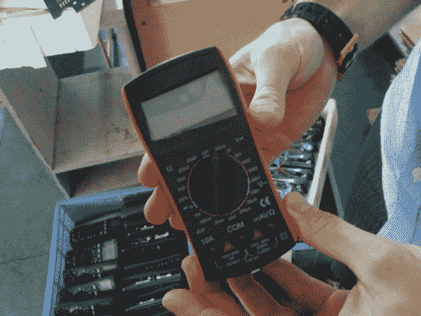
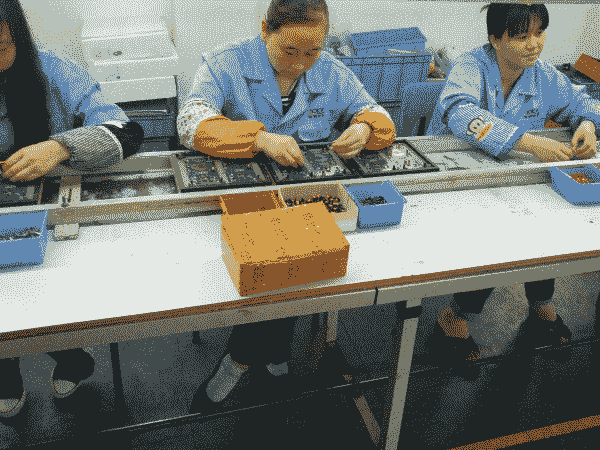
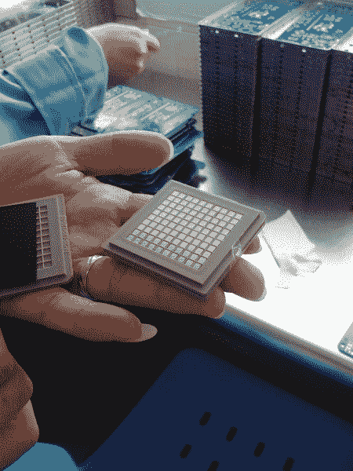
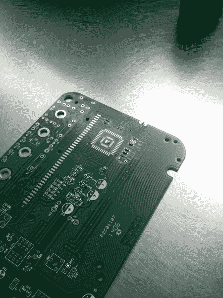
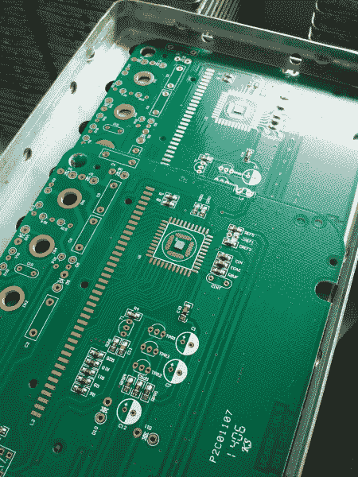
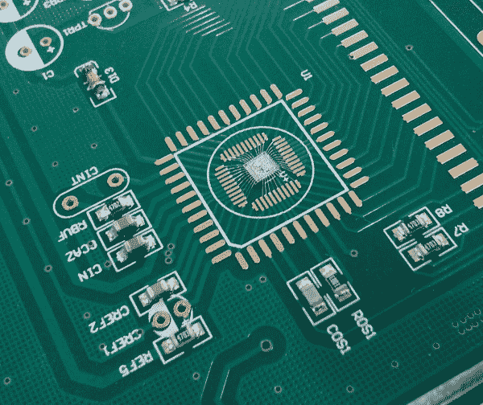
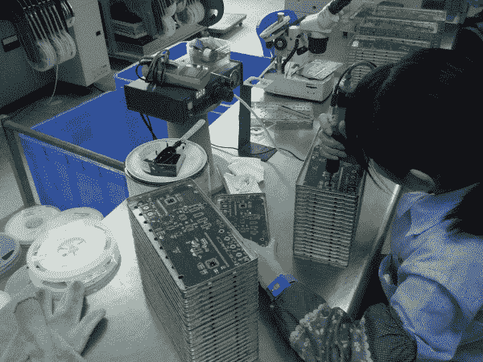
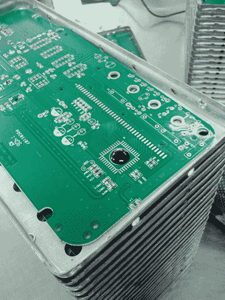
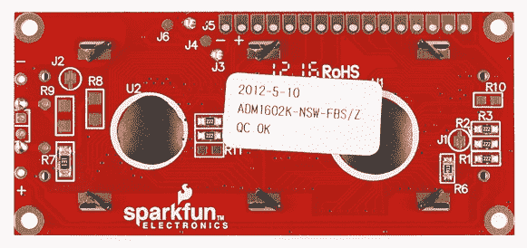

# 板上芯片是如何制造的

> 原文：<https://learn.sparkfun.com/tutorials/how-chip-on-boards-are-made>

## 维克多 DMM

在我们 2014 年的中国之旅中，我们有机会拜访了我们的数字万用表(DMM)制造商之一 Victor。我们之前参观过他们的工厂，但这次参观很特别，原因有二:

1.  在[扣押黄色万用表](https://www.sparkfun.com/news/1428)之后，与 Victor 交谈以找出我们的其他颜色选择是很重要的(你可以在这里找到我们新的[灰色万用表！](https://www.sparkfun.com/products/12966))。
2.  在第二次参观时，我问 COB 或板上芯片的制造过程是如何进行的。我原以为它会被外包给不同的设施，但当我听说它是在同一栋大楼的不同楼层完成时，我感到很惊讶。我们兴奋地要求去看看，我们的导游很友好地向我们展示了它是怎么做的。

在这里，你可以看到工人将通孔元件放入万用表的主 PCB。黑色斑点是该设备的主要 IC。许多器件使用 COB 或板上芯片来降低元件和制造成本。

## COB 制造

上面显示的是一个托盘的控制器硅芯片，作为万用表的大脑。这些 IC 由另一家公司制造，订购时具有数字多用表整体功能集中所需的功能。虽然我不应该感到惊讶，但有趣的是，有些公司除了 DMM 控制器 IC 之外什么都不做。我现在明白了，很少有万用表公司拥有制造一个数字万用表的整个工具链。相反，有一些公司专门从事小型家庭手工业:制造数字多用表显示器、电池、控制集成电路，并将这些部件组装成最终的数字多用表。

与[led 的制作方式](https://learn.sparkfun.com/tutorials/how-leds-are-made)非常相似，第一步是将硅芯片粘到 PCB 上。我不完全确定粘合剂是否导电，但从暴露的焊盘来看，很可能是导电的。

用一对镊子手工放置芯片。).粘合剂在 5 分钟内凝固。这是另一个让我措手不及的时刻:我以为 COB 需要一个有精密工具和超精确放置的干净房间。事实证明，就像 SMD 在热板中焊接一样；你可以有很大的变化，仍然有一个功能齐全的董事会。

替换打开

[//player.vimeo.com/video/95597432](//player.vimeo.com/video/95597432)

替换关闭

[Chip On Board Bonding](http://vimeo.com/95597432)

然后，PCB 被插入一台令人惊叹的自动引线键合机中，将 IC 上的一根极细的引线键合到 PCB 上。你可以看到操作员必须告诉视觉识别系统一些对齐点，但一般来说，机器很快焊接所有的连接。

来自我们的一位读者*曼顿*:

> 不太可能通过焊接导线来完成导线接合过程。通常这是使用[热超声键合](http://en.wikipedia.org/wiki/Thermosonic_bonding)来完成的，热超声键合利用热、压力和超声振动的组合来键合导线。

非常好的观点！谢谢曼顿。我以为是焊接，因为这是我所知道的，但这是热超声波焊接。

替换打开

[//player.vimeo.com/video/95597433](//player.vimeo.com/video/95597433)

替换关闭

[COB Wire Bonding](http://vimeo.com/95597433)

在上面的视频中，您可以看到机器需要一些操作员输入来焊接最后一个连接，完成它，电路板就完成了。你还可以感受到在不损坏连接的情况下，如何处理电路板。我原以为像头发一样的连接会很脆弱，但是，相反，这些板可以定期处理。这与液态焊膏[在 SMD 元件进入回流焊炉之前将其牢牢固定在适当位置](https://learn.sparkfun.com/tutorials/electronics-assembly/reflow)非常相似。

41 次连接之后，芯片就连接好了。如你所见，IC 的小θ旋转并没有太大影响。

下一步是在整个结构上喷射少量的灌封化合物。这种材料在电气和物理上保护芯片和焊线免受损坏。

必须严格控制化合物的粘度，以防止毛发弯曲并与相邻的电线连接。

然后，液体混合物在烘箱中固化四个小时。一旦完成，电路板被测试，并继续成为万用表的过程。

现在，每当你在电子设备上看到那些黑色斑点，比如我们的 [16x2 基本 LCD](https://www.sparkfun.com/products/709) 上的那些，你就会知道它们是如何产生的！

## 资源和更进一步

我们希望你喜欢阅读！这些教程需要大量的工作，我们希望你能从中学习到一些东西！如果你喜欢阅读，请留下评论，让我们知道。

既然你已经知道了棒子是如何制造的，这里有一些可能会引起你兴趣的教程:

*   [如何使用万用表](https://learn.sparkfun.com/tutorials/how-to-use-a-multimeter)
*   [发光二极管是如何制造的](https://learn.sparkfun.com/tutorials/how-leds-are-made)
*   [脂肪电池是如何制造的](https://learn.sparkfun.com/tutorials/how-lithium-polymer-batteries-are-made)
*   [spark fun 如何打造其产品](https://learn.sparkfun.com/tutorials/electronics-assembly)
*   [SparkFun 的取放机](https://www.youtube.com/watch?v=yI5I9Q7tf84)