# 锂聚合物电池是如何制造的

> 原文：<https://learn.sparkfun.com/tutorials/how-lithium-polymer-batteries-are-made>

## 大功率电池

作为 2014 年中国之行的一部分，我有机会参观了我们的一家电池制造商。罗伯特好心带我参观了大功率电池，并帮我联系了在那里工作的一位材料工程师。以下是一个粗略的一步一步如何制造脂电池。

Great power 在中国珠海[外有一个多建筑的园区](https://www.google.com/maps/place/Zhuhai,+Guangdong)。

[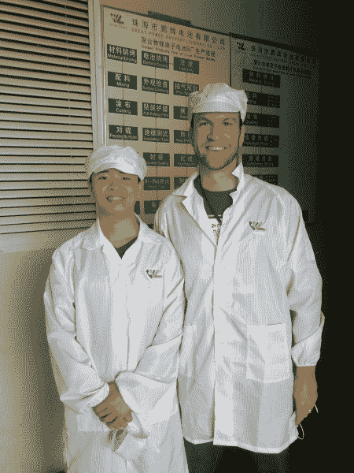](https://cdn.sparkfun.com/assets/learn_tutorials/2/2/2/LiPo_Battery_2_8.jpg)

罗伯特很友好地从珠海港口接我，并带我参观了工厂。

脂肪是如何制造的一步一步的快速过程！

[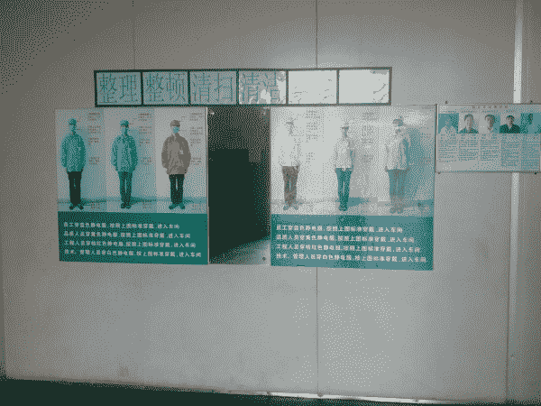](https://cdn.sparkfun.com/assets/learn_tutorials/2/2/2/LiPo_Battery_4_9.jpg)

看到装配过程中不同位置的制服和安全装备的复杂性真是太棒了。

## 电极制备

[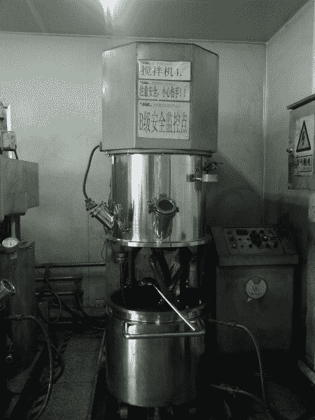](https://cdn.sparkfun.com/assets/learn_tutorials/2/2/2/LiPo_Battery_5_1.jpg)

将要涂覆到阳极和阴极上的材料被混合。

[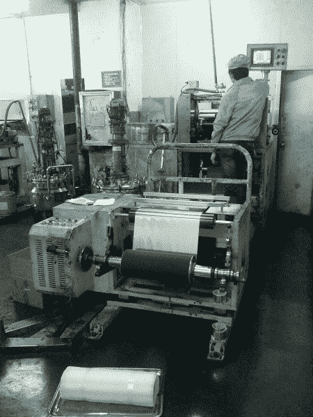](https://cdn.sparkfun.com/assets/learn_tutorials/2/2/2/LiPo_Battery_6.jpg)

将大卷原料装入涂布机。我认为这是铝。

[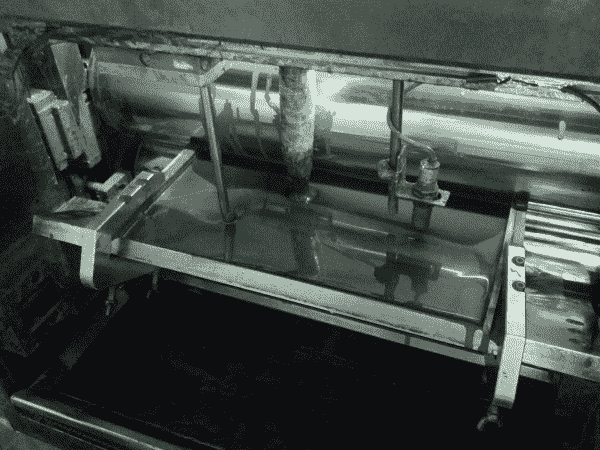](https://cdn.sparkfun.com/assets/learn_tutorials/2/2/2/LiPo_Battery_7.jpg)

将碳和锂材料的浆料薄层以大的正方形条带施加到金属端子材料上。

[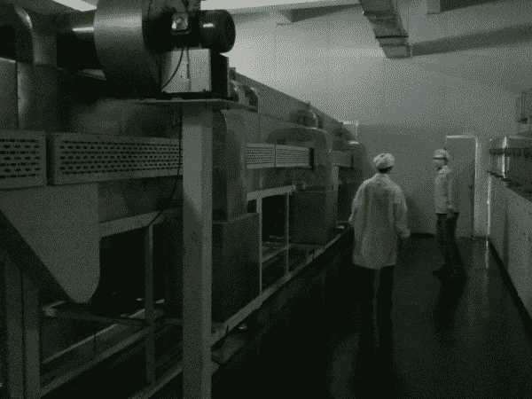](https://cdn.sparkfun.com/assets/learn_tutorials/2/2/2/LiPo_Battery_8.jpg)

在连续的方式中，材料通过烘箱供给，以将浆料固化到端子上。这个房间大概有 20 米(65 英尺)长，相当暖和。

[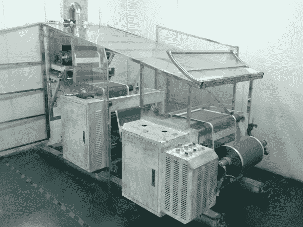](https://cdn.sparkfun.com/assets/learn_tutorials/2/2/2/LiPo_Battery_9.jpg)

有两条线路连续运行。一根是阳极(我相信通常是铝)，一根是阴极(铜)。我记得这个是 a-a 和 c-c(铜是阴极)。上面看到的是从烤箱出来的永无止境的铜带和固化成正方形的碳浆。这些方块将在接下来的几个步骤中被切割和折叠，所以不要被愚弄而认为他们正在制造那么大的细胞。还没有。

[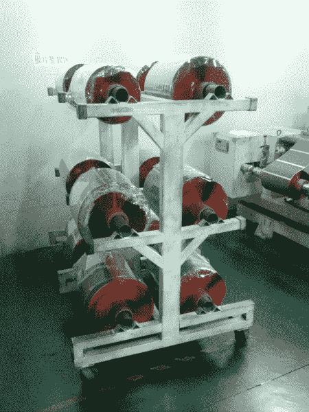](https://cdn.sparkfun.com/assets/learn_tutorials/2/2/2/LiPo_Battery_10.jpg)

很多很多的原始电极准备修剪。

[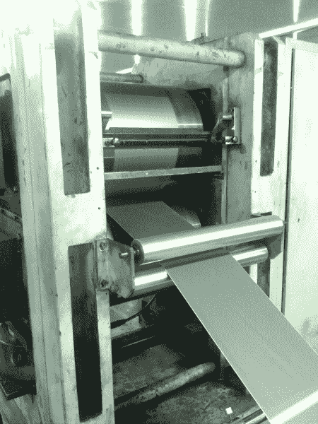](https://cdn.sparkfun.com/assets/learn_tutorials/2/2/2/LiPo_Battery_11.jpg)

这台机器像意大利面机一样粉碎电极。实际上，使纸张变得更薄，以便可以折叠更多次。

[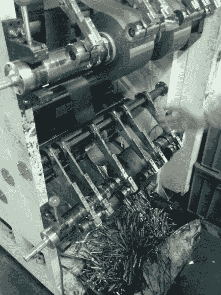](https://cdn.sparkfun.com/assets/learn_tutorials/2/2/2/LiPo_Battery_12.jpg)

将大块板材切割成合适的宽度。

## 电极制造

[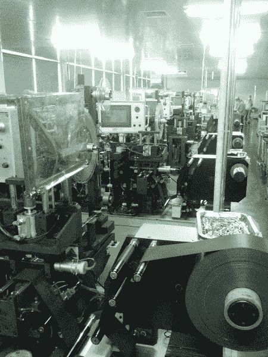](https://cdn.sparkfun.com/assets/learn_tutorials/2/2/2/LiPo_Battery_13.jpg)

这些机器把成卷的电极装上一个端子或接头，把它们切成合适的长度，还有一大堆我不太清楚的东西。

替换打开

[//player.vimeo.com/video/92992695](//player.vimeo.com/video/92992695)

替换关闭

[LiPo Battery Anode Preparation](http://vimeo.com/92992695)

这里有一段机器光荣行动的视频。

[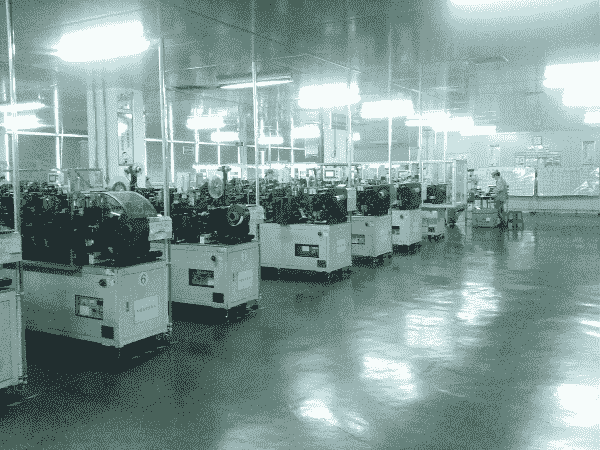](https://cdn.sparkfun.com/assets/learn_tutorials/2/2/2/LiPo_Battery_14.jpg)

有很多这样的人。

替换打开

[//player.vimeo.com/video/92992916](//player.vimeo.com/video/92992916)

替换关闭

[LiPo Battery Terminal Welding](http://vimeo.com/92992916)

这里有一个标签焊接的特写镜头。

[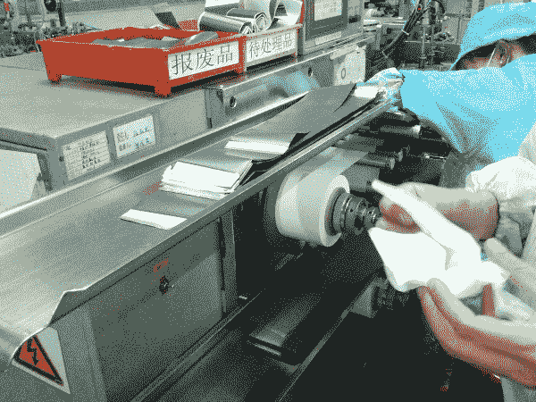](https://cdn.sparkfun.com/assets/learn_tutorials/2/2/2/LiPo_Battery_15.jpg)

一旦一堆给定类型的阳极制成，它与一堆同样大小的阴极放在一起。在各层之间插入半透膜，然后将三个条带折叠多次。

以上机器为半自动机器。它需要操作者插入并排列两个电极，但它会完成其余的工作。

替换打开

[//player.vimeo.com/video/92992697](//player.vimeo.com/video/92992697)

替换关闭

[LiPo Battery Inner Cell Wrapping](http://vimeo.com/92992697)

这是机器包装细胞的视频。

替换打开

[//player.vimeo.com/video/92992696](//player.vimeo.com/video/92992696)

替换关闭

[LiPo Battery Cell Wrapping](http://vimeo.com/92992696)

上图是各层折叠或包裹的特写。

[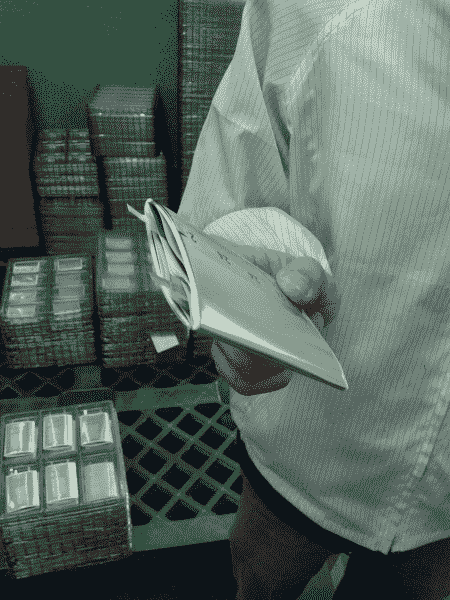](https://cdn.sparkfun.com/assets/learn_tutorials/2/2/2/LiPo_Battery_16.jpg)

完成后，将各层折叠多次并用胶带粘住。

[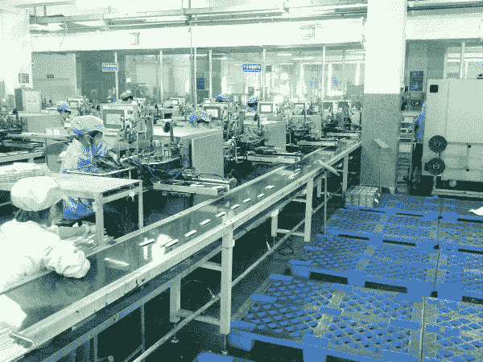](https://cdn.sparkfun.com/assets/learn_tutorials/2/2/2/LiPo_Battery_17.jpg)

把线相乘，你可以看到这个工厂是如何一个月生产 75 万台的。

替换打开

[//player.vimeo.com/video/92992698](//player.vimeo.com/video/92992698)

替换关闭

[LiPo Battery Massive Wrapping Machine](http://vimeo.com/92992698)

上面是一个自动化程度更高的包装机。这种程度的自动化让我头晕。你如何建立这样的东西，并保持它运行，而不不断调整？！太神奇了。

## 成型和电解质

在一个单独的房间里，房屋被制造出来。

[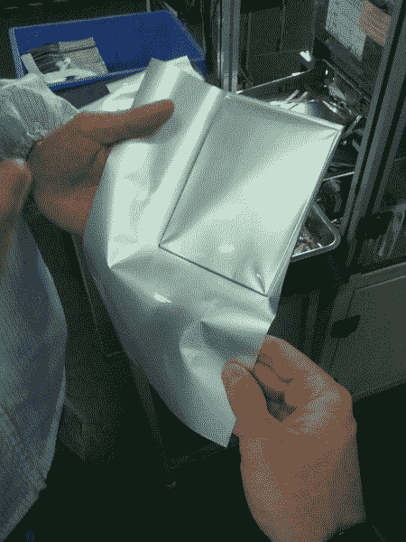](https://cdn.sparkfun.com/assets/learn_tutorials/2/2/2/LiPo_Battery_19.jpg)

这些机器切割、成型并制造出用于内部电极和电解质聚合物的略微柔性但具有保护性的外壳。我相信这种材料是一种塑料或聚氯乙烯。

[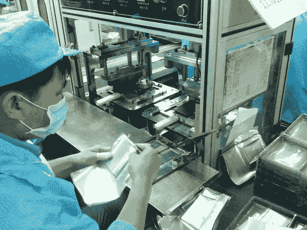](https://cdn.sparkfun.com/assets/learn_tutorials/2/2/2/LiPo_Battery_20.jpg)

然后将电极插入保护外壳之间，并在三个侧面热焊接在一起。第四侧是敞开的，用于喷射电解液。

外壳中的电极。

[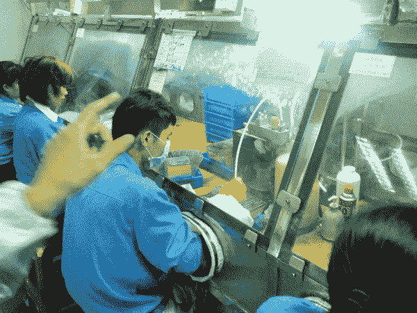](https://cdn.sparkfun.com/assets/learn_tutorials/2/2/2/LiPo_Battery_22.jpg)

在精心控制的环境中，电解液被泵入电池。这部分生产车间的湿度和温度受到严格控制。通风柜被更加小心地控制着。

[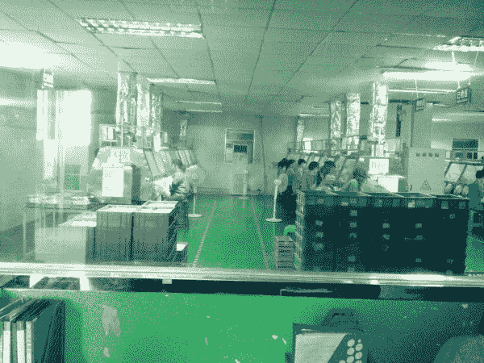](https://cdn.sparkfun.com/assets/learn_tutorials/2/2/2/LiPo_Battery_23.jpg)

多条线路同时运行。该生产线的最后一步是热焊接电池的第四面，以容纳电解液并密封电池。

## 充电

[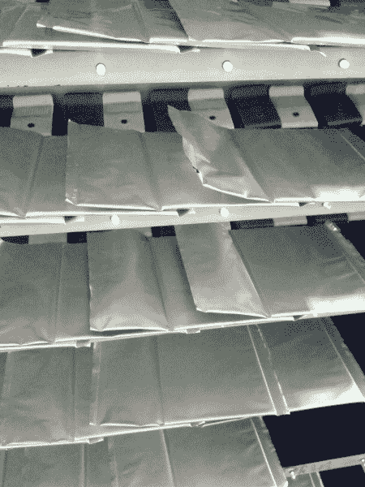](https://cdn.sparkfun.com/assets/learn_tutorials/2/2/2/LiPo_Battery_24.jpg)

一旦密封，我们现在可以称这个东西为电池。这是第一个充电周期。你可以看到塑料夹子夹住暴露的标签。留在电池上的小翼是用来收集在第一次循环中排出的电解质或气体的。

[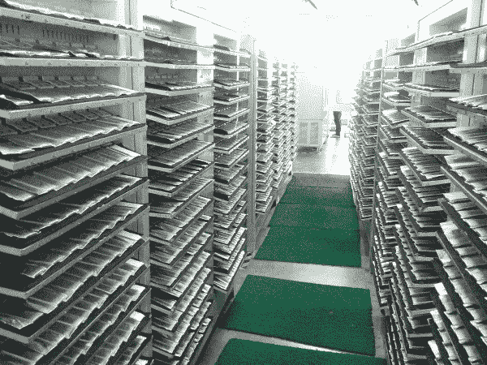](https://cdn.sparkfun.com/assets/learn_tutorials/2/2/2/LiPo_Battery_25.jpg)

乘以*很多*个充电器。

[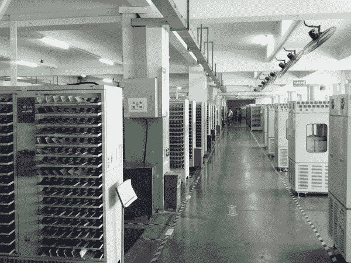](https://cdn.sparkfun.com/assets/learn_tutorials/2/2/2/LiPo_Battery_26.jpg)

然后填满整个地板。

[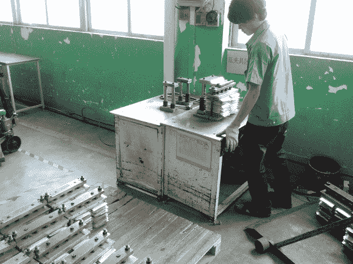](https://cdn.sparkfun.com/assets/learn_tutorials/2/2/2/LiPo_Battery_27.jpg)

在第一次充电完成后，电池被强烈压缩。他们告诉我“600 万英镑”，但是数量级经常在翻译中被打乱。姑且称之为*多多*。

[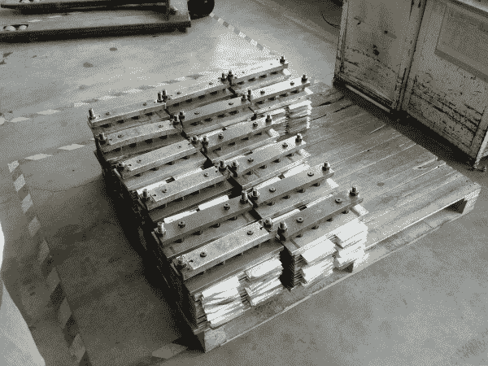](https://cdn.sparkfun.com/assets/learn_tutorials/2/2/2/LiPo_Battery_28.jpg)

空气会迅速降解并导致电池化学问题。大力压缩有助于从电池中挤出任何剩余的空气。

[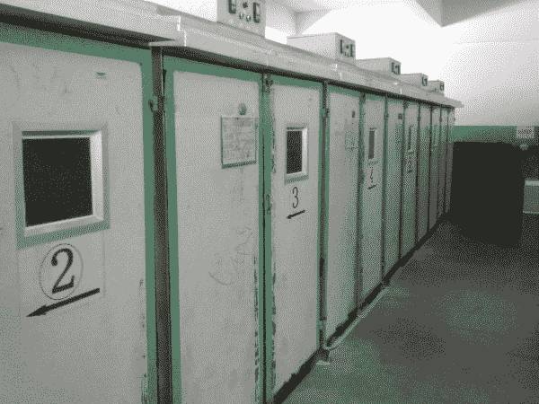](https://cdn.sparkfun.com/assets/learn_tutorials/2/2/2/LiPo_Battery_29.jpg)

我无法得到确切的时间或温度，但电池被压缩了几个小时。

[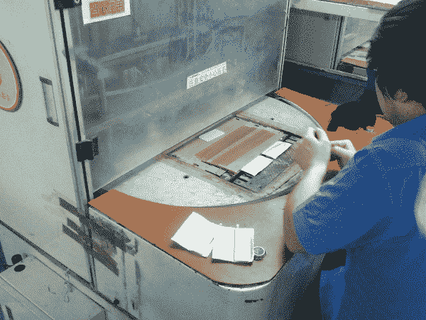](https://cdn.sparkfun.com/assets/learn_tutorials/2/2/2/LiPo_Battery_30.jpg)

下一步是去除从主电池中排出并进入侧枕的多余电解质。如果你曾经闻到过膨化或'甜'味电池，你知道这个房间闻起来像什么。一旦电解质被移除，电池就被修整。

[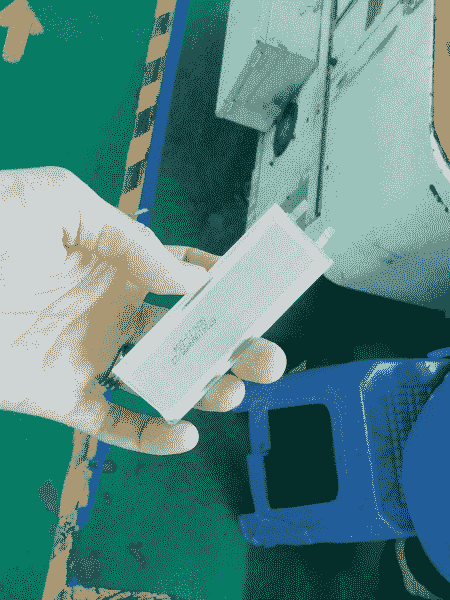](https://cdn.sparkfun.com/assets/learn_tutorials/2/2/2/LiPo_Battery_31.jpg)

在这一切结束时，你有一个电池。从技术上讲，这是一个单电池，因为仍然需要保护电路和终端。

[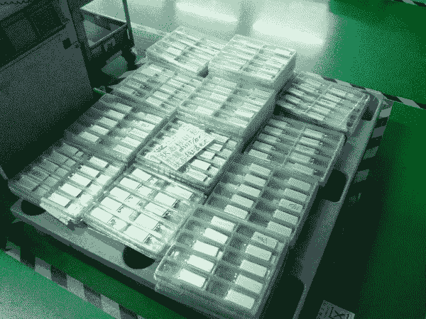](https://cdn.sparkfun.com/assets/learn_tutorials/2/2/2/LiPo_Battery_32.jpg)

再次强调，记住规模很重要。我们玩的每一个便携式设备:平板电脑、手机、剃须刀、电子烟、遥控直升机等等。有一个脂肪电池。大国公司每天生产数万个电池。

## 电池制造

[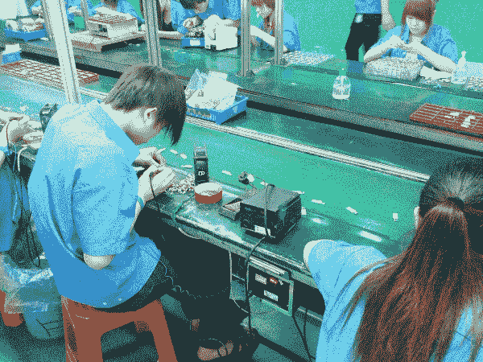](https://cdn.sparkfun.com/assets/learn_tutorials/2/2/2/LiPo_Battery_33.jpg)

保护电路防止 LiPo 电池过充电(当电池被推过 4.3V 时会发生不好的事情)、欠充电(如果电池被拉至低于约 2.8V 会受到损害)和短路(将正负端子短路在一起)。如果这些触发中的任何一个发生，保护电路会很快将电池从端子上断开。

[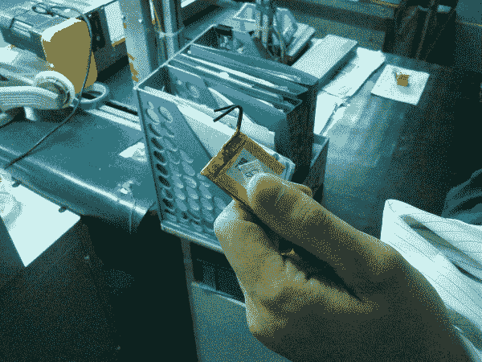](https://cdn.sparkfun.com/assets/learn_tutorials/2/2/2/LiPo_Battery_34.jpg)

上面，我们终于有了一个正式的电池，带有保护电路(黄色 kapton 胶带)和正负端子线(sans 连接器)。

[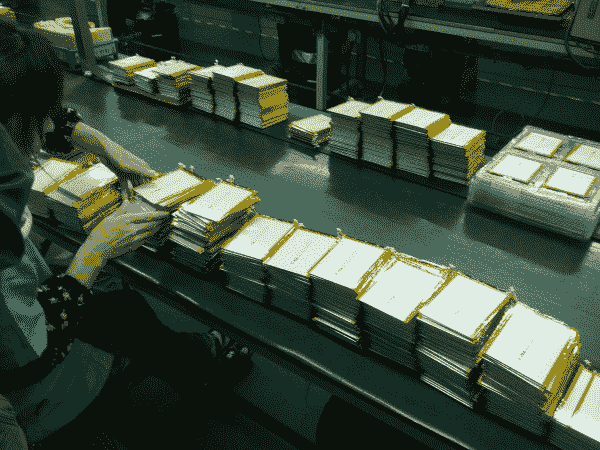](https://cdn.sparkfun.com/assets/learn_tutorials/2/2/2/LiPo_Battery_35.jpg)

工厂里到处都是几十种不同型号的电池。上面是一个更大的平板电脑电池。

[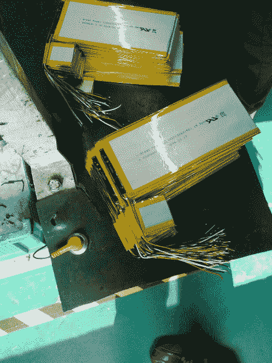](https://cdn.sparkfun.com/assets/learn_tutorials/2/2/2/LiPo_Battery_36.jpg)

我发现这个电池特别有趣。我从未见过两部分电池。也许双电池允许电池组弯曲？大单元格放在键盘下面，小单元格放在屏幕后面？我无法获得更多关于这个的信息，但它确实让我对电池选项有了不同的想法。

[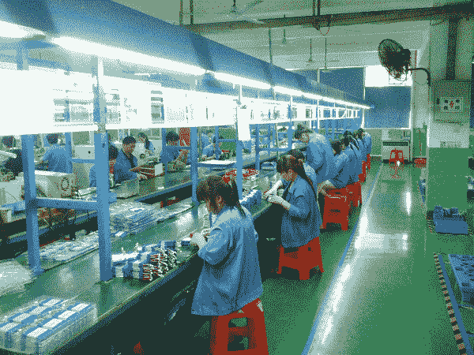](https://cdn.sparkfun.com/assets/learn_tutorials/2/2/2/LiPo_Battery_37.jpg)

每种不同型号的电池都有自己的员工队伍。

[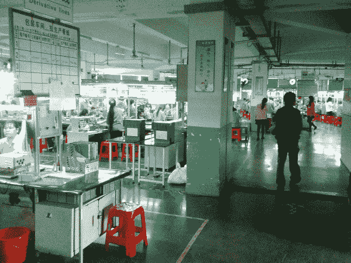](https://cdn.sparkfun.com/assets/learn_tutorials/2/2/2/LiPo_Battery_38.jpg)

乘以*多*行。

## 圆柱形覆盖物

[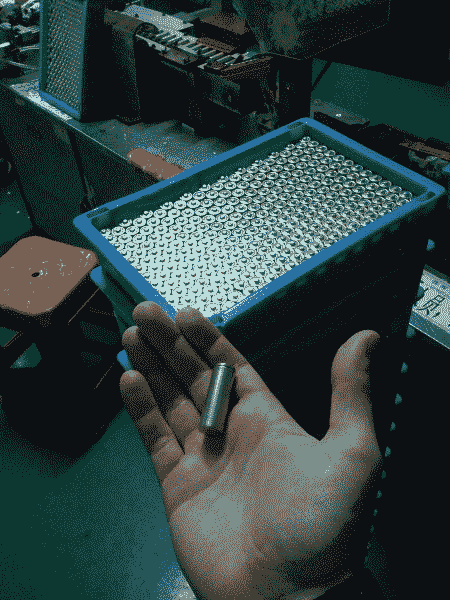](https://cdn.sparkfun.com/assets/learn_tutorials/2/2/2/LiPo_Battery_39.jpg)

在另一条生产线上，磷酸铁锂电池正在生产。我被告知这个过程几乎是一样的，所以我没有拍那么多照片。因为“在处理不当的情况下，磷酸铁锂电池更难点燃”，所以与脂肪电池相比，它们被认为是“更安全”的电池。我并不完全相信，但是 LiFePO [4] 电池正在许多可充电汽车应用中找到出路。注意标称的 3.2V(而不是 LiPos 的 3.7V)，但如果你正在制作一个串联的大规模电池组，3.2V 真的无关紧要。

替换打开

[//player.vimeo.com/video/92992694](//player.vimeo.com/video/92992694)

替换关闭

[Lithium Iron Phosphate Cell Covering](http://vimeo.com/92992694)

这台机器将采取裸细胞，并自动切割和滑动的热收缩标签。然后松散的细胞进入一个 4 英尺的热隧道。我只是喜欢这个视频中的声音。

[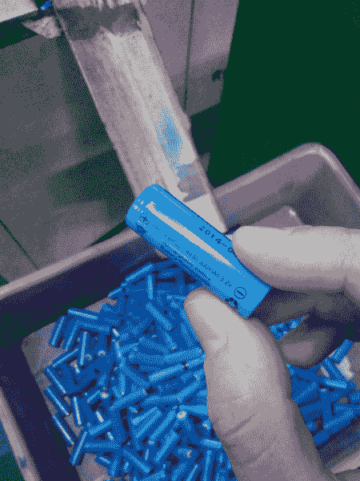](https://cdn.sparkfun.com/assets/learn_tutorials/2/2/2/LiPo_Battery_40.jpg)

从烤箱中取出后，一节 AA 大小的电池贴上热收缩标签。

## 电池测试

问了这么多问题，拍了这么多照片后，材料工程真的开始带我四处参观了。我觉得我不太像他们的普通巡演。工程师兴奋地问我是否想看看试验箱——是的！

[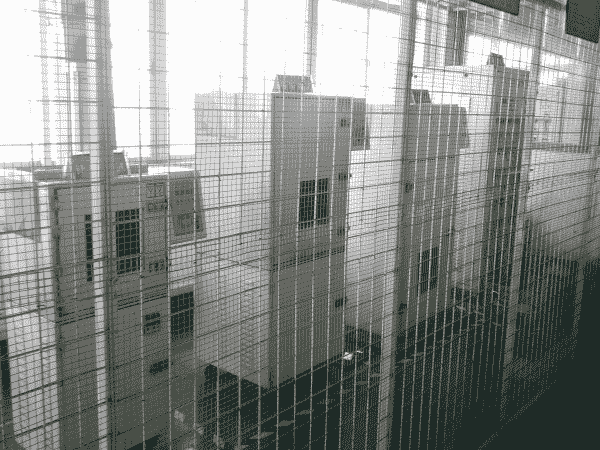](https://cdn.sparkfun.com/assets/learn_tutorials/2/2/2/LiPo_Battery_41.jpg)

在大楼的另一层，一个笼子里的房间里有八台中世纪的刑具。QC 和失效测试是白天生产的每一批电池的一部分。

[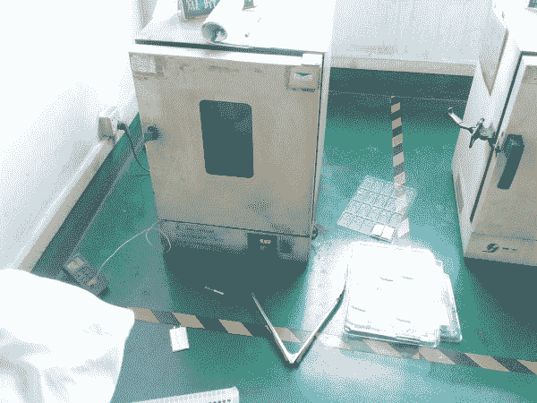](https://cdn.sparkfun.com/assets/learn_tutorials/2/2/2/LiPo_Battery_42.jpg)

他们很快让我进入，我犹豫不决地进入。上图是将电池推向最终灭亡的烤箱。

[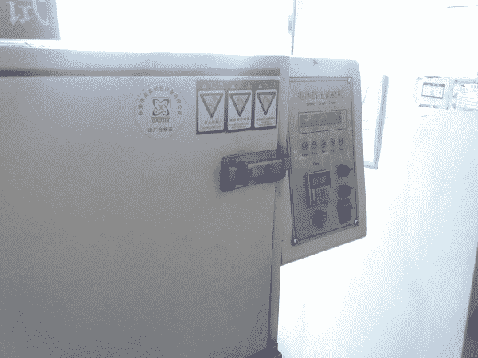](https://cdn.sparkfun.com/assets/learn_tutorials/2/2/2/LiPo_Battery_43.jpg)

这种名副其实的“电池压碎测试器”将一个电池从侧面挤压，直到电池破裂。

[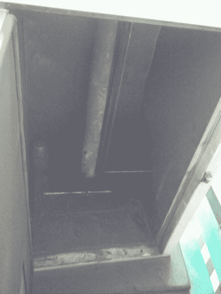](https://cdn.sparkfun.com/assets/learn_tutorials/2/2/2/LiPo_Battery_44.jpg)

穿刺测试器由一个 10 公斤重的物体组成，物体末端有一根直径为 10 毫米的杆。测试将这个物体拉到空中 1 米，并将其向下推入电池的平面。工程师用一个令人震惊的重击发射了这个，让我措手不及。这是很大的力量。

[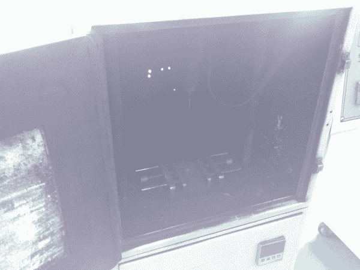](https://cdn.sparkfun.com/assets/learn_tutorials/2/2/2/LiPo_Battery_45.jpg)

桩考。我们能戳到它着火吗？

[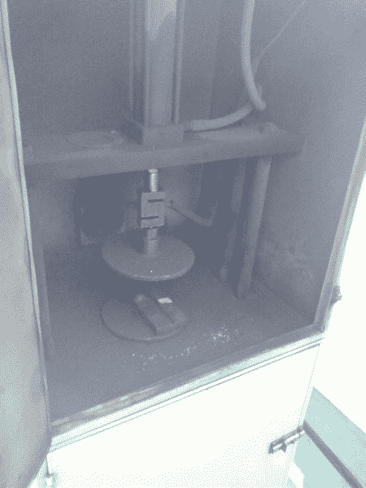](https://cdn.sparkfun.com/assets/learn_tutorials/2/2/2/LiPo_Battery_46.jpg)

折叠测试。这将电池压在一段三角形的钢上，使电池以扭曲的角度折叠。不用说，这场大屠杀是史诗般的，房间里布满了失败细胞的烟灰。

[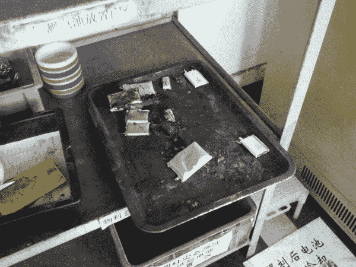](https://cdn.sparkfun.com/assets/learn_tutorials/2/2/2/LiPo_Battery_47.jpg)

他们航行后的几个细胞。

[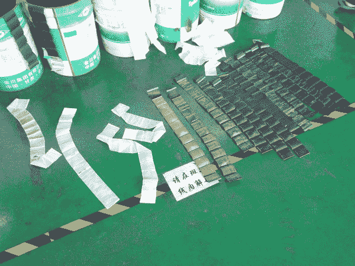](https://cdn.sparkfun.com/assets/learn_tutorials/2/2/2/LiPo_Battery_48.jpg)

一旦它们到达测试的末尾，单元就被分解、展开，并评估故障向量。总的来说，我对承诺和验证的水平印象深刻。

## 大电池

参观的最后一站是一个远离其他房间的房间，在大楼的另一端。

[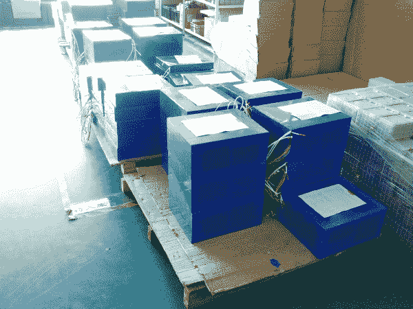](https://cdn.sparkfun.com/assets/learn_tutorials/2/2/2/LiPo_Battery_49.jpg)

这里是制造和测试*超大型*电池组的地方。我听说这些是用来给电动巴士提供动力的。

[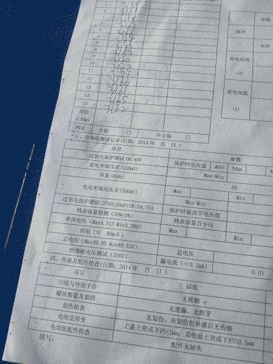](https://cdn.sparkfun.com/assets/learn_tutorials/2/2/2/LiPo_Battery_50.jpg)

想象一下在 40，000 毫安时用 49V 可以做什么。最大的包装是 100Ah。也就是将近 5000Wh！难以置信的东西。

## 资源和更进一步

我们希望你喜欢阅读！这些教程需要大量的工作，我们希望你能从中学习到一些东西！如果你喜欢阅读，请留下评论，让我们知道。

准备好玩电池了吗？这里有一些我们的产品可供选择:

*   [聚合物锂离子电池- 2000mAh](https://www.sparkfun.com/products/8483)
*   [聚合物锂离子电池- 400mAh](https://www.sparkfun.com/products/10718)
*   [USB LiPoly 充电器-单电池](https://www.sparkfun.com/products/12711)
*   [LiPo 充电器基本-微型 USB](https://www.sparkfun.com/products/10217)
*   [“啊哈”电池电量指示器套件](https://www.sparkfun.com/products/11087)

既然你已经了解了锂电池是如何制造的，这里有一些可能会引起你兴趣的教程:

*   [电池技术](https://learn.sparkfun.com/tutorials/battery-technologies)
*   [如何为项目提供动力](https://learn.sparkfun.com/tutorials/how-to-power-a-project)
*   [发光二极管是如何制造的](https://learn.sparkfun.com/tutorials/how-leds-are-made)
*   [电压、电流、电阻和欧姆定律](https://learn.sparkfun.com/tutorials/voltage-current-resistance-and-ohms-law)
*   [LiPo USB 充电器连接指南](https://learn.sparkfun.com/tutorials/lipo-usb-charger-hookup-guide)
*   [MiniMoto DRV8830 连接指南](https://learn.sparkfun.com/tutorials/minimoto-drv8830-hookup-guide)