# 发光二极管是如何制造的

> 原文：<https://learn.sparkfun.com/tutorials/how-leds-are-made>

## 孙云领导

在 2014 年的中国之行中，我们的供应商孙云好心到深圳接我们，并带我们参观了他们的工厂。

[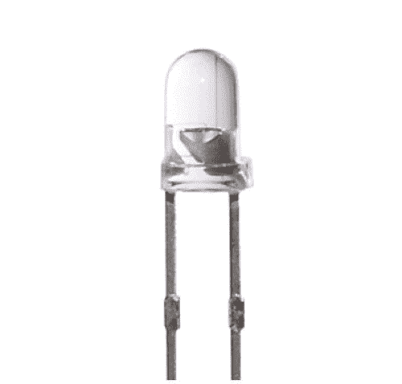](https://cdn.sparkfun.com/assets/learn_tutorials/2/3/3/thumb.jpg)

虽然 SparkFun 使用和销售 led 已经超过 10 年，但我从未见过或真正了解它们是如何制造的。我让我们在的主要联系人 Merry Xiao 知道我们对学习非常感兴趣，所以她安排在工厂关门的周六带我们参观*。我们非常感激！*

[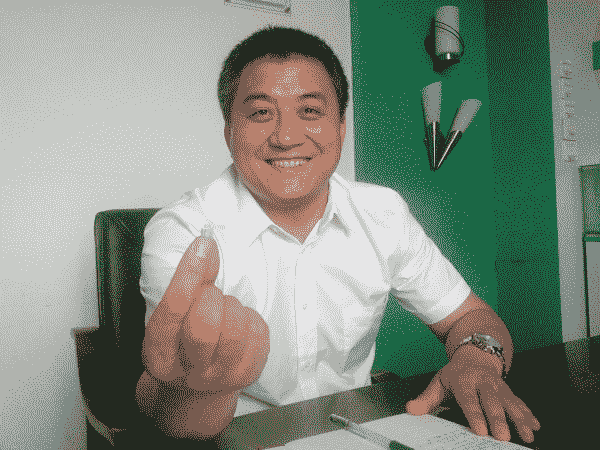](https://cdn.sparkfun.com/assets/learn_tutorials/2/3/3/LED_Manufacture_1.jpg)

这位是最有幽默感的老板司先生。他手里拿着一个我妻子艾丽西娅·吉布正在做的项目。梅里也加入了我们，并帮助翻译。

## 基本零件

[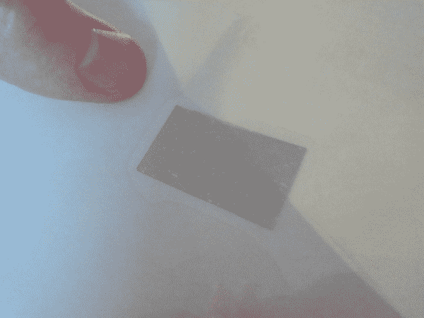](https://cdn.sparkfun.com/assets/learn_tutorials/2/3/3/LED_Manufacture_2.jpg)

这是一张 LED 芯片。孙云从一家高质量的台湾公司购买模具。旁边是我的拇指*4000*死。每张的成本大约是 80 元人民币或 12.5 美元。

[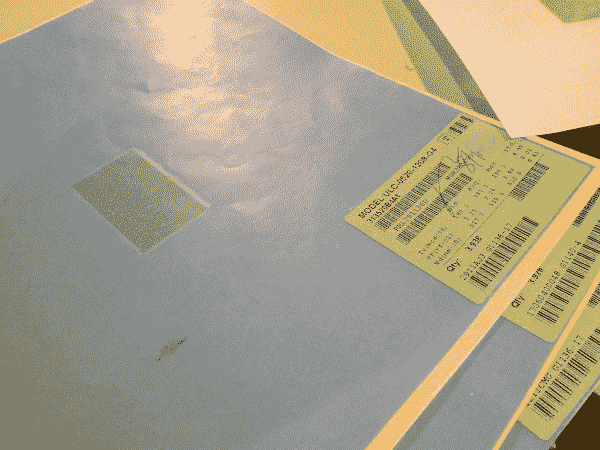](https://cdn.sparkfun.com/assets/learn_tutorials/2/3/3/LED_Manufacture_3.jpg)

每张纸的角落都列出了批次特性。这种特殊薄片上的芯片具有大约 519 纳米的波长，或者正好在绿色和青色之间。三个包含 12，000 个 led 的薄片即将孵化！

[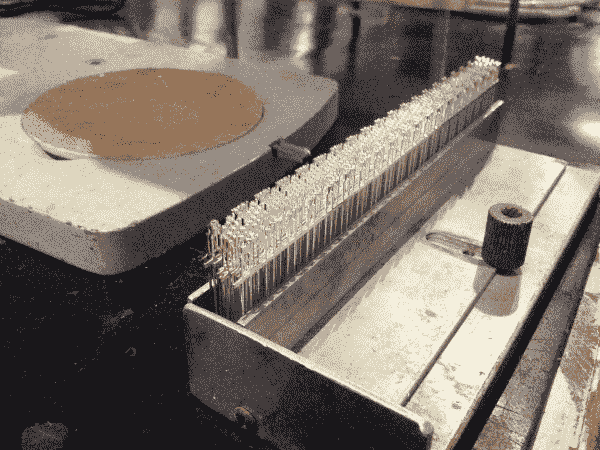](https://cdn.sparkfun.com/assets/learn_tutorials/2/3/3/LED_Manufacture_5.jpg)

该工艺从冲压金属引线框架开始。这些框架中的每一个都具有 20 个 led 的基本结构。上面显示的是大约 15 帧或 300 个 led。

## 机器

第一台机器拿起引线框架，在阴极端子顶部的每个杯子上滴一小滴粘合剂。

[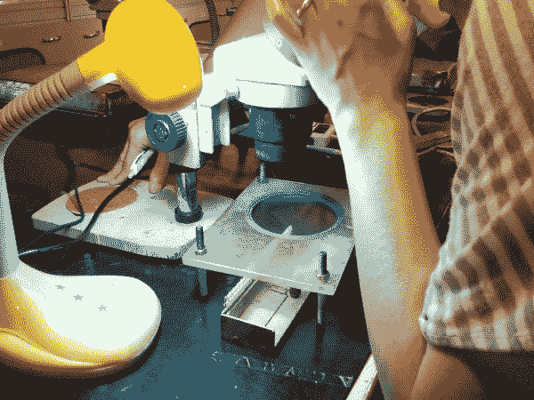](https://cdn.sparkfun.com/assets/learn_tutorials/2/3/3/LED_Manufacture_7.jpg)

在纸张上运输时，LED 管芯靠得太近，难以操作。有一台机械机器(图中未显示)将模具展开，并将其粘在一层弱粘性薄膜上。如上图所示，该薄膜悬挂在引线框架上方。工人使用显微镜手动对准芯片，并用一对镊子将芯片插入引线框架。引线框中的粘合剂胜出(更粘)，并且工人迅速移动到下一个管芯。我们被告知他们每分钟可以排列超过 80 个或者每天大约 4 万个。

[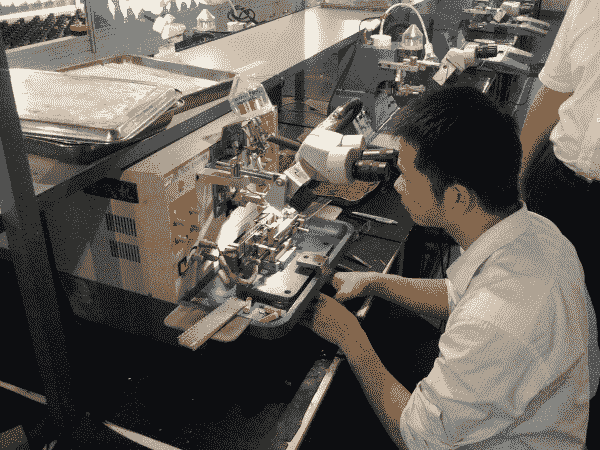](https://cdn.sparkfun.com/assets/learn_tutorials/2/3/3/LED_Manufacture_9.jpg)

上图是 LED 引线键合机。这就把一根细如发丝的金线从 LED 芯片的顶部连接到阳极引线上。

[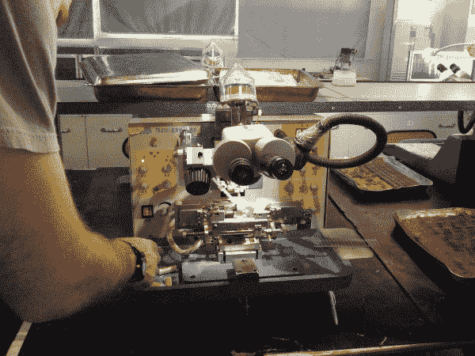](https://cdn.sparkfun.com/assets/learn_tutorials/2/3/3/LED_Manufacture_8.jpg)

在这次旅行中，让我感到惊讶的第一件事是，整个操作是在户外进行的。出于某种原因，我认为操纵硅芯片需要洁净室技术。我可以在我的地下室做这个！嗯（表示踌躇等）...

替换打开

[//player.vimeo.com/video/95591868](//player.vimeo.com/video/95591868)

替换关闭

[LED Wire Bonding Machine](http://vimeo.com/95591868)

这台机器花了相当多的调整和调整来设置，但一旦它启动并运行，令人印象深刻的是看到单位自动工作，没有计算机辅助对齐。

由于只有一根引线连接到硅芯片，我假设阴极上的粘合剂是导电的。粘合剂在进入下一步之前大约 30 分钟凝固。

[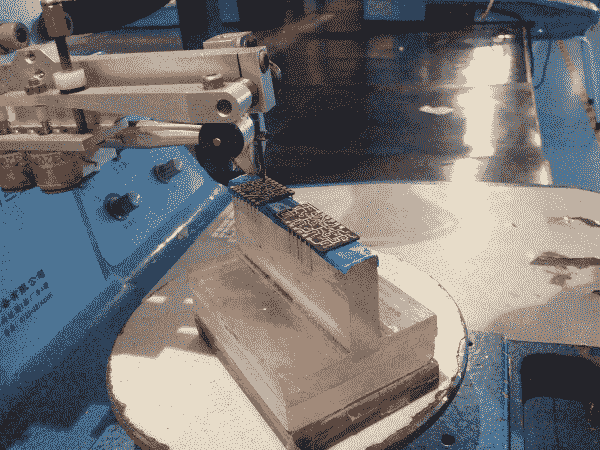](https://cdn.sparkfun.com/assets/learn_tutorials/2/3/3/LED_Manufacture_10.jpg)

这是另一个惊喜。这些是 7 段显示器。出于某种原因，我一直认为在显示器的各个部分后面有完全成熟的 3 毫米(或某种尺寸)led。现在回想起来，我显然错了，但直到我看到直接将芯片贴在电路板上的 7 段 PCB 时，我才明白过来。

[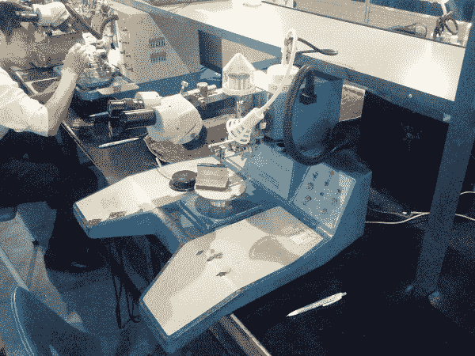](https://cdn.sparkfun.com/assets/learn_tutorials/2/3/3/LED_Manufacture_11.jpg)*A larger picture of the 7-segment bonding machine.*

## 模具和测试

[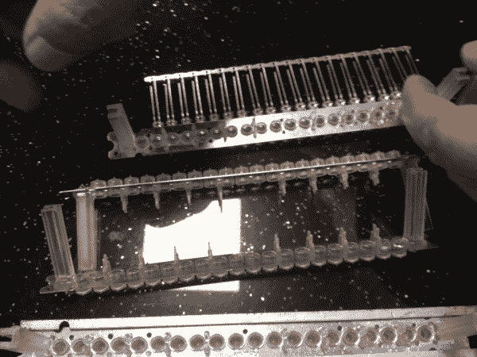](https://cdn.sparkfun.com/assets/learn_tutorials/2/3/3/LED_Manufacture_12.jpg)

回到 PTH LED 工艺:一旦引线接合到位并且粘合剂固化，引线框架就被放置在 LED 模具中，并且环氧树脂被推进到引线框架周围。

[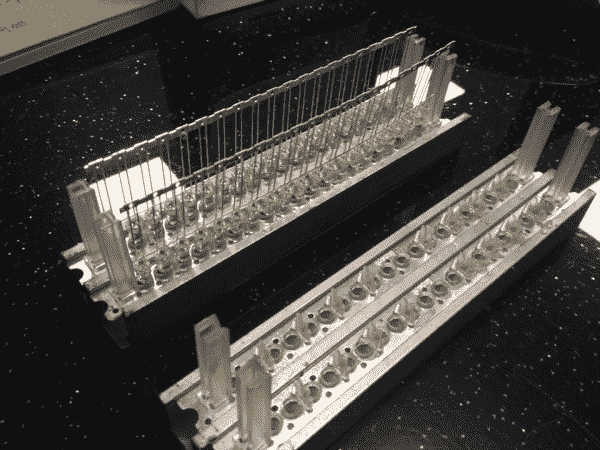](https://cdn.sparkfun.com/assets/learn_tutorials/2/3/3/LED_Manufacture_13.jpg)

这些模具赋予了发光二极管形状。这是另一个啊哈时刻。我见过许多不同形状的 led，但总是在某种尺寸范围内。你看不到很多 5 毫米类型的星形头 LED 引线，因为:

1.  模具必须像注射模具一样释放 LED 的头部。任何有突出物的形状都会被锁定在模具中。两部分模具怎么样？这让我想到了第二点:
2.  整个 LED 产业是建立在专业山寨供应商的基础上的。这意味着有些供应商只做一件事:硅制造、铅制造、模具制造等。几乎没有人拥有整个工具链，所以孙云不得不从现有的供应商中挑选。虽然我们非常兴奋地要求孙云为我们创造一个超级定制，真棒 LED，这几乎是不可能的；我们不仅要说服他们，还要说服大约 5 家不同的供应商提供奇怪尺寸的引线框架，定制模具尺寸，调整机器以适应可能不兼容的引线间距，然后创建新的测试夹具和操作程序。并非不可能，但比我想象的要困难得多。

[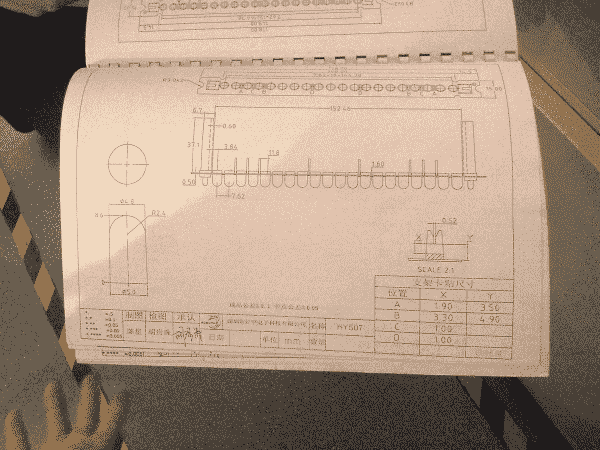](https://cdn.sparkfun.com/assets/learn_tutorials/2/3/3/LED_Manufacture_14.jpg)

这是一个模具供应商的目录，包含许多不同的形状和尺寸。同样，定制形状也不是不可能，但是，如果它不在目录中，它将更加难以获得。

[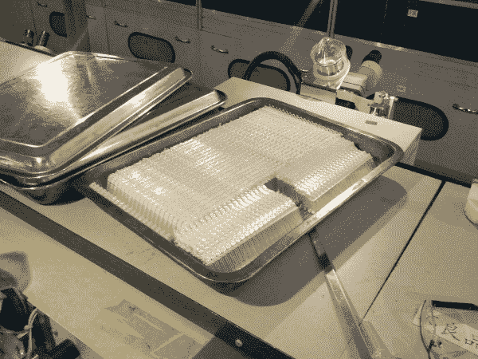](https://cdn.sparkfun.com/assets/learn_tutorials/2/3/3/LED_Manufacture_15.jpg)

一旦环氧树脂被注入，我们被告知发光二极管被烘烤 45 分钟。此时，可以从模具中取出发光二极管。然后再烘烤 8 到 12 个小时，使环氧树脂完全固化。一旦 led 固化，它们就被分成一大堆，如上图所示。

[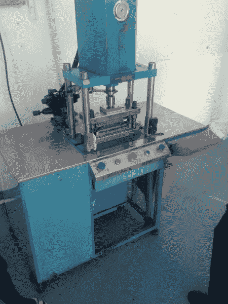](https://cdn.sparkfun.com/assets/learn_tutorials/2/3/3/LED_Manufacture_16.jpg)

为了在制造过程中提供支撑，引线框架有一些金属将阳极和阴极连接在一起。在测试之前，上面的机器切掉多余的金属，这样阴极被隔离，所有的阳极被连接在一起。为什么 LED 上的一个引脚比另一个引脚短？主要是为了简化制造自动化和测试。为什么他们选择阴极更短？可能是因为测试时更容易控制低端(阴极)。

[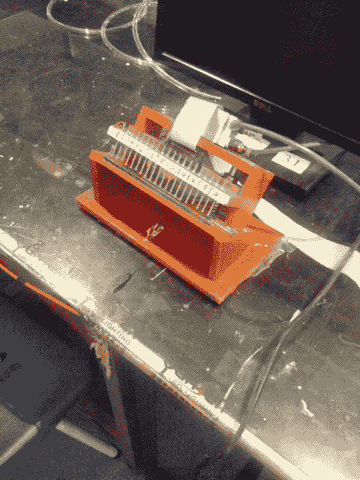](https://cdn.sparkfun.com/assets/learn_tutorials/2/3/3/LED_Manufacture_17.jpg)

下一步是测试和验证每个 LED 使用适当的电流量。太少(存在断开)或太多(存在短路)，LED 被移除。该机器使用一系列弹簧针快速测试每个单独的 LED，并在计算机上显示输出。这与我们设计用来测试 SparkFun 产品的[弹簧针测试夹具](https://learn.sparkfun.com/tutorials/constant-innovation-in-quality-control/all#the-waffle-top)极其相似。

[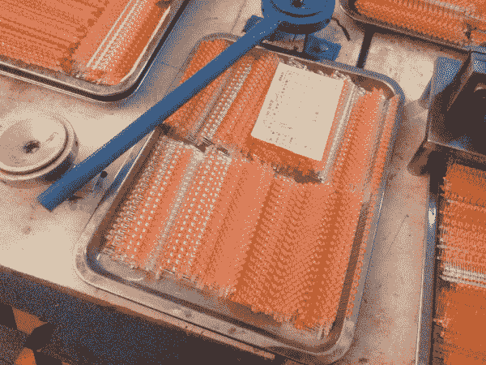](https://cdn.sparkfun.com/assets/learn_tutorials/2/3/3/LED_Manufacture_18.jpg)

一旦 led 通过质量控制，它们将经过另一个切割步骤，将阳极从引线框中分离出来。

[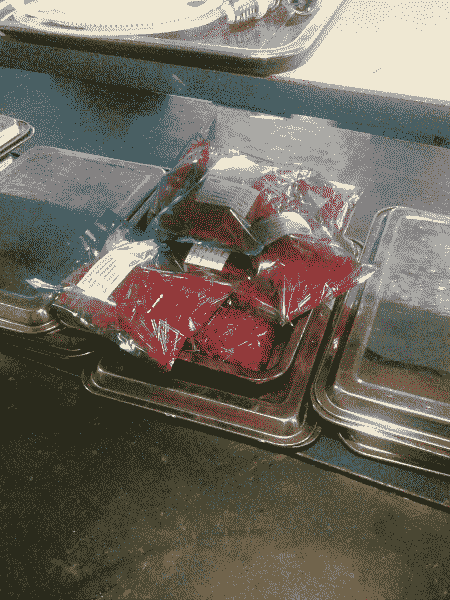](https://cdn.sparkfun.com/assets/learn_tutorials/2/3/3/LED_Manufacture_19.jpg)

很多很多 [5mm 红色 led](https://www.sparkfun.com/products/9590)专为 SparkFun 打造！

[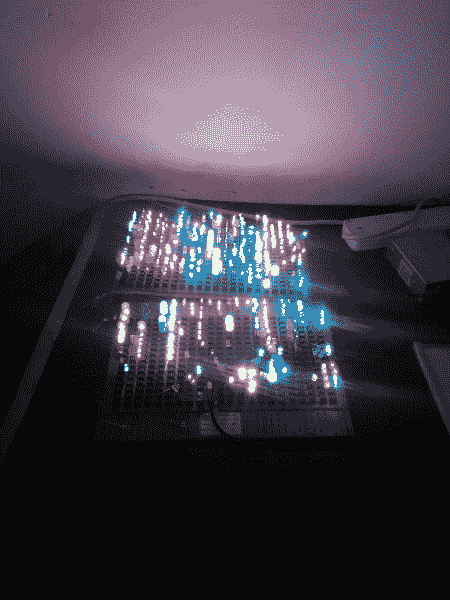](https://cdn.sparkfun.com/assets/learn_tutorials/2/3/3/LED_Manufacture_20.jpg)

用同样的方法，可以做出许多不同的形状、颜色和尺寸。

## 工厂概述

[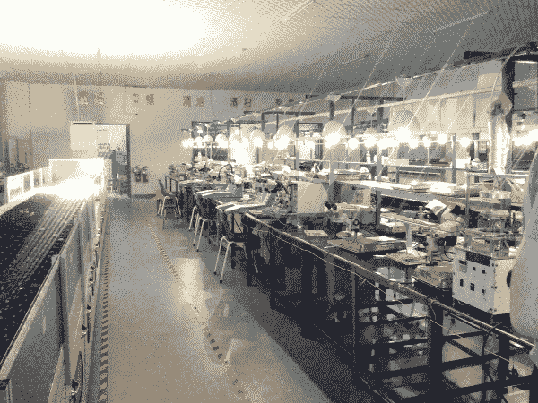](https://cdn.sparkfun.com/assets/learn_tutorials/2/3/3/LED_Manufacture_21.jpg)

总的来说，工厂结构紧凑，布局合理。那天有四条线可以用来创造任何需要的形状和类型。

[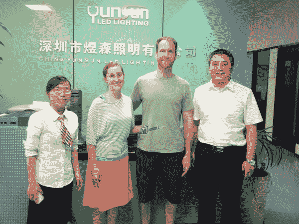](https://cdn.sparkfun.com/assets/learn_tutorials/2/3/3/LED_Manufacture_22.jpg)

梅里，艾丽西娅，我自己，还有斯先生。我们非常非常感谢孙云在他们休假的时候带我们参观！如果您需要 led 或 LED 灯泡，请联系 Merry (merry at 100led.com)。孙云是一家合作愉快的公司。

## 资源和更进一步

我们希望你喜欢阅读！这些教程需要大量的工作，我们希望你能从中学习到一些东西！如果你喜欢阅读，请留下评论，让我们知道。

准备好玩 led 灯了吗？这里有一些我们的产品可供选择:

*   [LED 混装(20 个装)](https://www.sparkfun.com/products/12062)
*   [LED 混包- 5mm](https://www.sparkfun.com/products/9881)
*   [IR 控制套件零售](https://www.sparkfun.com/products/11761)
*   [OpenSegment 串行显示-20 毫米(红色)](https://www.sparkfun.com/products/11644)
*   [NeoPixel Shield - 40 RGB LED 像素矩阵](https://www.sparkfun.com/products/12663)
*   [1.0 英寸一位数字母数字显示器-红色](https://www.sparkfun.com/products/9934)

既然你已经了解了 led 是如何制造的，下面是一些可能会引起你兴趣的教程:

*   [发光二极管](https://learn.sparkfun.com/tutorials/light-emitting-diodes-leds)
*   [交互式悬挂 LED 显示屏](https://learn.sparkfun.com/tutorials/interactive-hanging-led-array)
*   [布林肯大礼帽](https://learn.sparkfun.com/tutorials/das-blinken-top-hat)
*   [LED 灯条连接指南](https://learn.sparkfun.com/tutorials/led-light-bar-hookup)
*   [锂聚合物电池是如何制造的](https://learn.sparkfun.com/tutorials/how-lithium-polymer-batteries-are-made)