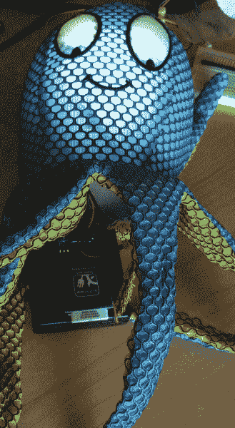

# 你还好吗？小部件

> 原文：<https://learn.sparkfun.com/tutorials/are-you-okay-widget>

## 介绍

当伊丽莎白和我开始谈论我们担心的朋友、邻居、父母和孩子时，有一个主题:如果我们知道他们没事，那就足够了。难的是不知道他们昨晚回家了还是今天早上起床了。伊丽莎白和我在我的[嵌入式软件播客](http://embedded.fm/episodes/2013/9/3/17-facebook-status-maybe-not-dead)上想出了我们想要它做的事情。我们有技术来减轻这种担忧，比如你还好吗？小部件。你还好吗小工具包含一个[电动 Imp](https://www.sparkfun.com/products/11395) 、一个[加速度计](https://www.sparkfun.com/products/10955)和一个 [RGB LED](https://www.sparkfun.com/products/11120) 以连接到无线网络来通知亲人你是否还好。

如果你把它放在毛绒玩具里，你关心的人可以每天拍拍它。如果他们做不到，小鬼会发微博给你，给你发邮件，或者给你的手机发短信。当然，你可以把它放在他们的冰箱上，这样你就知道他们可以吃东西了。

这绝对是一个高级教程。我将向您展示我如何将硬件和软件结合在一起，但是，如果您以前没有尝试过电动 Imp，这可能不是开始的地方。

### 所需材料

为此，您将需要以下物品: