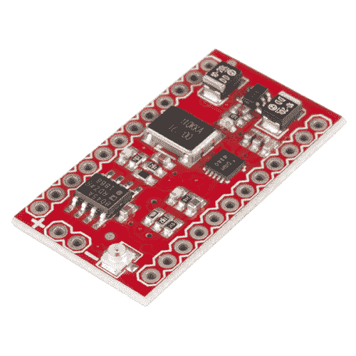
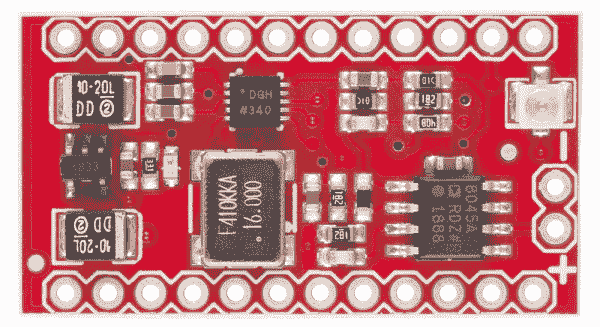
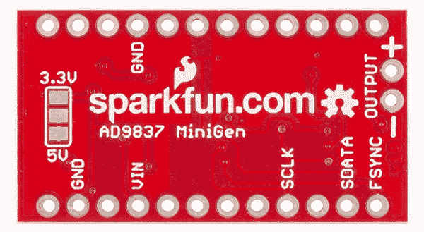
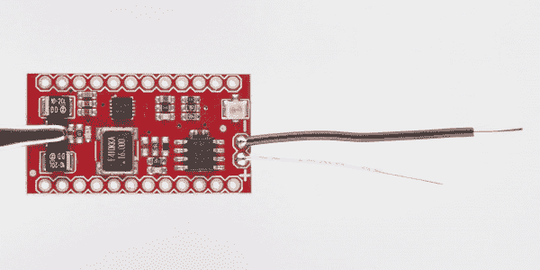
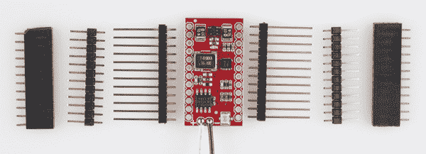
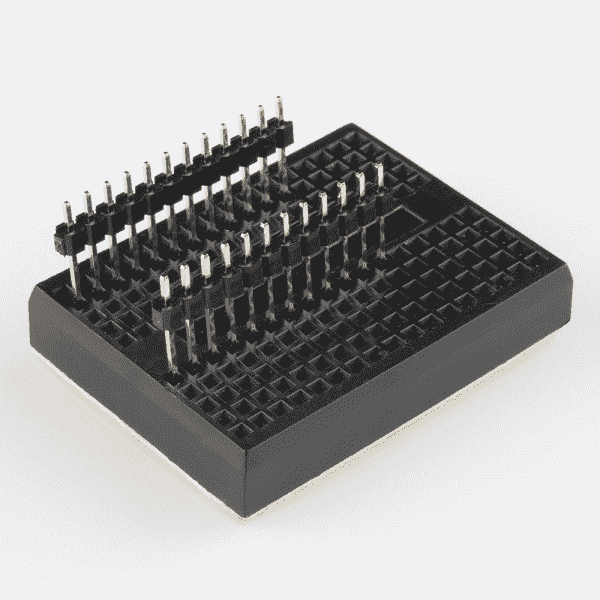
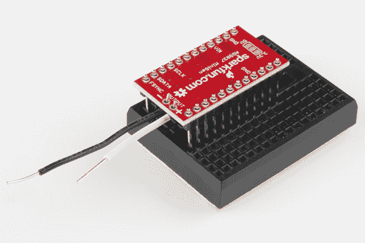
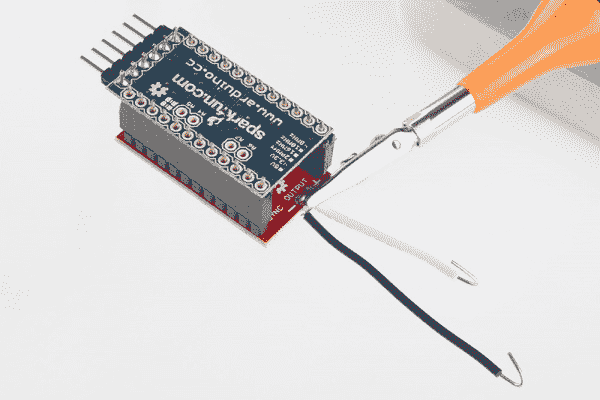
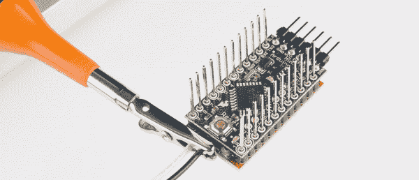

# MiniGen 连接指南

> 原文：<https://learn.sparkfun.com/tutorials/minigen-hookup-guide>

## 介绍

MiniGen 被设计成既可以作为独立的电路板使用，也可以作为可以放置在 [Arduino Pro Mini](https://www.sparkfun.com/products/11114) 顶部的保护罩。它能够产生最高 3MHz、约 1Vp-p 的正弦波、方波或三角波，输出的 DC 失调为 Vcc/2。偏移量和振幅都不能改变。

[](https://www.sparkfun.com/products/11420) 

将**添加到您的[购物车](https://www.sparkfun.com/cart)中！**

 **### [SparkFun MiniGen - Pro 迷你信号发生器防护罩](https://www.sparkfun.com/products/11420)

[In stock](https://learn.sparkfun.com/static/bubbles/ "in stock") BOB-11420

这是 SparkFun MiniGen 信号发生器，是 Arduino Pro Mini 的一个小屏蔽，能够产生正弦、平方…

$33.953[Favorited Favorite](# "Add to favorites") 22[Wish List](# "Add to wish list")** **默认情况下，MiniGen 出厂时配置为启用 3.3V 调节器，因此只能用于 3.3V 信号(或 3.3V Pro Minis，如上所述)。背面有一个跳线，可以焊接以绕过 5V 使用的调节器；只是要注意，如果你绕过调节器，不要给电路板供电超过 5V！

有关 MiniGen 的更多信息，请参见 [GitHub 库](https://github.com/sparkfun/MiniGen)，在那里您可以找到库、示例代码和设计文件。

### 推荐阅读

在使用 MiniGen 之前，您应该熟悉以下几个教程:

*   [AC vs DC](https://learn.sparkfun.com/tutorials/alternating-current-ac-vs-direct-current-dc)
*   [模拟与数字信号](https://learn.sparkfun.com/tutorials/analog-vs-digital)
*   [SPI 接口](https://learn.sparkfun.com/tutorials/serial-peripheral-interface-spi)
*   [需要一些焊接工作](https://learn.sparkfun.com/tutorials/how-to-solder---through-hole-soldering)，所以你可能想温习一下这些技能。
*   [什么是盾牌？](https://learn.sparkfun.com/tutorials/arduino-shields)
*   使用 Arduino 库 -你会想要安装 MiniGen 库，所以如果你不确定怎么做，看看这个教程。

## 连接

#### 顶端

这是板子的顶部。由于该屏蔽层布局紧凑且空间不足，标签必须贴在 PCB 的底部。

[](https://cdn.sparkfun.com/assets/learn_tutorials/1/9/0/minigentop.jpg)

有两个输出源:一个 2x1 0.1 英寸间距的接头和一个 u.FL 连接器。u.FL 连接器被屏蔽接地。

当安装在 Pro Mini 上时，板的输出端应该在 FTDI 连接器的另一端。

#### 底部

看一下上图。让我们一次检查一个标记的连接。

[](https://cdn.sparkfun.com/assets/learn_tutorials/1/9/0/minigenbot.jpg)

*   **GND**——一次只需要连接其中一个；这意味着你只能在一边头球。
*   **VIN** -默认情况下，这是一个 3.3V 稳压器。如果您想将该板与 5V Pro Mini 一起使用，您应该在背面的跳线焊盘上放一滴焊料，将三者连接在一起。

    **Danger!** Adding a solder jumper will bypass the 3.3V voltage regulator, you will be powering the board at 5V. While most of the components on the board can handle 5V, the 16MHz crystal oscillator is not. It can only handle 3.3V. You would need to find a way to cut the trace connecting to the 16MHz and 3.3V voltage regulator in order to reroute 3.3V to the 16MHz crystal oscillator's circuit.
*   **输出+** -这是 AD9837 的抗混叠输出。预期会看到一个 1Vp-p 信号，相对地偏移 1/2 Vin。
*   **输出-** -接地。
*   **SCLK** - SPI 时钟输入。SPI 总线可以处理最高 40MHz 的输入。
*   **SDATA** -来自主设备的输入。注意，寄存器内容不能从 AD9837 器件中读出；它缺少 DOUT 引脚。
*   **FSYNC** -相当于片选。

#### SPI 接口

如上所述，SPI 接口的驱动频率最高可达 40MHz。SPI 接口应等于或接近芯片的电源电压(默认为 3.3V)。

如果您选择为此写入自己的 SPI 控制，则时钟空闲为低电平(CPOL = 0)，数据在上升沿锁存(CPHA = 1)。这对应于 SPI 模式 2。

## 装配

MiniGen 既可作为普通分线板使用，也可作为 Arduino Pro 迷你板的附件。请注意， [SparkFun Pro Micro](https://www.sparkfun.com/products/12587) 、 [Arduino Nano](http://arduino.cc/en/Main/arduinoBoardNano) 和其他类似的外形规格板无法工作，因为它们在同一位置没有必要的 SPI 引脚。

#### 输出联接

在你继续下一步之前，想想你将如何处理 MiniGen 的输出。你希望输出焊盘上有裸线吗？你要用 u.FL 连接器吗？. 1 英寸接头引脚？现在就做出决定，将您想要的连接器放在电路板上。

[](https://cdn.sparkfun.com/assets/learn_tutorials/1/9/0/MiniGen_Hookup_Guide-01.jpg)

我选择在这块板上放两根实芯线，这样我就可以将两端插入试验板，或者将示波器探头夹在上面。我让长度不均匀，以避免他们接触和短。

#### 添加标题

我们将从解释如何在 MiniGen 上安装公插头开始。这将使我们能够轻松地将其插入试验板，或焊接到 Arduino Pro Mini 上的母接头(我们将在稍后介绍)。

首先将引脚头修剪到合适的长度。每边需要 12 个图钉。

[](https://cdn.sparkfun.com/assets/learn_tutorials/1/9/0/MiniGen_Hookup_Guide-02.jpg)

当然，你可以使用你想要的任何样式的接头:这里展示的是我们的[母接头](https://www.sparkfun.com/products/115)，我们的[短公接头](https://www.sparkfun.com/products/116)，以及我们的[长公接头](https://www.sparkfun.com/products/10158)。我将向您展示每种方法的一些选项。

确保引脚与电路板垂直的最简单方法是将引脚插入电路板。MiniGen 的宽度是这样的，插入中心线旁边的一排针脚将另一排针脚放置在另一侧边缘的一列之外，如下图所示。

[](https://cdn.sparkfun.com/assets/learn_tutorials/1/9/0/MiniGen_Hookup_Guide-03.jpg)

一旦引脚接头就位，您就可以将 MiniGen 板放在上面。电路板可以元件朝上或元件朝下焊接；取决于你打算用它做什么，其中一个可能会更好。

如下图所示，如果将板的接头组件面朝下，您可以看到引脚标签。这使得这种方法更适合用作分线板；然而，你不能把主板放在 Pro Mini 的顶部。我们一会儿会谈到这一点。

[](https://cdn.sparkfun.com/assets/learn_tutorials/1/9/0/MiniGen_Hookup_Guide-05.jpg)

将主板翻转过来，元件面朝上，这样您就可以将其安装在顶部有母接头的 Pro Mini 主板上。我将向您展示这两个完全组装在一起的案例，这样您就可以看到每个案例的含义。

[](https://cdn.sparkfun.com/assets/learn_tutorials/1/9/0/MiniGen_Hookup_Guide-04.jpg)

如果你打算在你的 Pro Mini 上安装母接头，我强烈建议你在 MiniGen 上焊接公接头，然后用它们在 Pro Mini 上以一个吉祥的角度固定母接头。这样的话，它们将来会顺利交配。

[](https://cdn.sparkfun.com/assets/learn_tutorials/1/9/0/MiniGen_Hookup_Guide-07.jpg)

您可以看到几个要点:MiniGen 上的引脚接头已经焊接到与组件相反一侧的长引脚上，插座位于 Pro Mini 的组件侧。

正如我上面提到的，如果你选择把你的头放在组件“下”，你就不能把 MiniGen 放在你的 Pro Mini 上面。然而，如果你使用我们的[长分离式公接头](https://www.sparkfun.com/products/10158)，你可以从底部插入引脚，它们会突出到顶部，足以让你在顶部堆叠另一个电路板，如 [MiniFet Shield](https://www.sparkfun.com/products/9627) 或 [Pro Mini Protoshield](https://www.sparkfun.com/products/9709) 。这样做的缺点是盖住了电路板顶部的 u.FL 连接器，但这对你来说可能不是问题。

[](https://cdn.sparkfun.com/assets/learn_tutorials/1/9/0/MiniGen_Hookup_Guide-08.jpg)

如果您使用这种方法，请确保 Pro Mini 的底部和 MiniGen 顶部的组件之间有间隙。

## Arduino 图书馆

MiniGen 有一个相当全面的 Arduino 库，可以帮助用户轻松编写 Arduino 代码。

#### 访问图书馆

该库可以作为 MiniGen 板的 [Github 库](https://github.com/sparkfun/MiniGen)的一部分下载。只需下载整个库的 [zip 文件，然后将解压后的库的“Arduino”文件夹中的“libraries”目录复制到你的 Arduino Sketchbook 目录中。可以在 Arduino IDE 的“首选项”窗口中找到您的 Sketchbook 的位置。如果你在安装库的时候遇到问题，请参考我们的](https://github.com/sparkfun/MiniGen/archive/master.zip)[教程](https://learn.sparkfun.com/tutorials/installing-an-arduino-library)。

#### 使用图书馆

要使用该库，请将以下两条线添加到草图的顶部:

```
language:c
#include <MiniGen.h>
#include <SPI.h> 
```

注意**两条线**都必须存在；不包含 SPI 库将导致代码编译失败。

一旦包含了库，就必须在草图中实例化一个 MiniGen 对象，如下所示:

```
language:c
MiniGen sig_gen; 
```

您可以将名称`sig_gen`替换为您喜欢的任何名称；然而，我们的示例草图将使用该名称。

如果您使用的主板不是 Arduino Pro Mini，您可以通过调用如下构造函数来更改代码使用的片选引脚(在库和数据表中称为 FSYNC 引脚):

```
language:c
sig_gen = MiniGen(pin_number); 
```

将`pin_number`更改为 Arduino 上所需的引脚；但是，请注意，Atmega 的 SPI 功能要求引脚 10 为输出，因此您将无法使用该引脚执行其他操作。

#### 库命令

一旦你创建了你的 MiniGen 对象，有几个命令可以发送到 MiniGen 板来操作它。

```
language:c
sig_gen.reset(); 
```

此命令会将 MiniGen 复位至默认行为:它会清除相位偏移寄存器，将频率复位至 100Hz，并禁用输出，从而在输出端产生约为电源电压 1/2 的 DC 电压。

```
language:c
sig_gen.setMode(newMode); 
```

`newMode`参数可以是下列值之一:`MiniGen::TRIANGLE`、`MiniGen::SINE`、`MiniGen::SQUARE`或`MiniGen::SQUARE_2`。输出频率将取决于所选频率寄存器中的值；更多信息请见下文。对于前三个选项，频率将为设定的频率；对于第四个，它将是设定频率的一半。

```
language:c
sig_gen.selectFreqReg(reg); 
```

AD9837 芯片有两个寄存器存储可能的输出频率。这些可以通过将参数`MiniGen::FREQ0`和`MiniGen::FREQ1`传递给该函数来选择。这允许用户通过交换寄存器而不是写入活动寄存器来调整频率；由于频率的完全调整需要两次 SPI 写操作，因此改变可以立即生效，无需中间频率阶跃。

FREQ 寄存器分为低位字和高位字，每个都是 14 位长；输出频率等于低位字乘以 0.0596Hz 加上高位字乘以 976.5Hz，总输出频率等于两个寄存器之和。

```
language:c
uint32_t freqRegVal = sig_gen.freqCalc(desiredFrequency); 
```

该帮助函数返回一个 32 位值(一个`unsigned long` Arduino 数据类型，或更一般的说法是`uint32_t`)，当写入 AD9837 频率寄存器时，将在`desiredFrequency`产生一个输出。传递给函数的值应该是一个浮点数，单位为 Hz。当这个 32 位值被写入 FREQ 寄存器时，结果将是(大约)`desiredFrequency`。

为了将该值写入 FREQ 寄存器，有几个函数值得考虑。原因很简单:速度。将频率值写入 AD9837 可能需要一到三次 SPI 处理；使用适当的函数允许用户尽可能节省执行时间。

```
language:c
sig_gen.adjustFreq(reg, mode, newFreq); 
```

这种方法耗时最长。`reg`可以是`MiniGen::FREQ0`或`MiniGen::FREQ1`，这取决于用户想要在哪里写值。`mode`可以是`MiniGen::FULL`、`MiniGen::COARSE`或`MiniGen::FINE`。对于第一个，`newFreq`应该是一个 32 位无符号值(由`freqCalc()`返回，或者由用户在别处计算)；在这种情况下，频率设置操作将需要三次 SPI 处理。对于第二个和第三个，“newFreq”应为 16 位无符号值，该操作将需要两次 SPI 处理。

当`mode`参数为`MiniGen::FULL`时，输出值将等于传递的参数乘以 0.0596 Hz。当`mode`为`MiniGen::COARSE`时，您将写入寄存器的高位字，每次计数将增加 976.5Hz 的频率。当`mode`为`MiniGen::FINE`时，您将写入低位字，每次计数将增加 0596Hz 的输出频率。将写入分为粗略和精细允许用户最大限度地减少改变频率所需的写入次数。

```
language:c
sig_gen.FreqAdjustMode(newMode);
sig_gen.adjustFreq(reg, newFreq); 
```

如果速度很重要，可以预选`mode`。这将写时间减少到两次 SPI 写`FULL`和一次写`COARSE`或`FINE`。注意，这需要用户小心地将适当的值传递给`adjustFreq()`；如果模式设置为`FULL`且未传递 32 位值，或者设置为`COARSE`或`FINE`且未传递 16 位值，结果将不会如预期。

```
language:c
sig_gen.selectPhaseReg(reg);
sig_gen.adjustPhaseShift(reg, newPhase); 
```

可以调整输入时钟和输出信号之间的相移。与设置频率一样，有两个相移寄存器。可以通过将`MiniGen::PHASE0`或`MiniGen::PHASE1`作为上述函数中的`reg`参数进行选择。

对于`newPhase`参数，该值应为 16 位无符号值。该值只使用了 12 位，因此最大值应为 4095。每个计数代表 0.00153 弧度(. 551 度)。然而，由于相位是相对于输入频率进行测量的，因此该设置的价值有限。

## 资源和更进一步

以下是 MiniGen 板的一些有用资源:

*   [MiniGen 产品页面](https://www.sparkfun.com/products/11420)-spark fun 上的产品页面。
*   [ADI 公司网站上的 AD9837 产品页面](http://www.analog.com/en/rfif-components/direct-digital-synthesis-dds/ad9837/products/product.html) -这里有许多关于该产品、其它相关产品以及直接数字合成的有用信息。
*   [AD8045 产品页面](http://www.analog.com/en/all-operational-amplifiers-op-amps/operational-amplifiers-op-amps/ad8045/products/product.html) -关于板上运算放大器的信息。
*   [ADI 公司的 FilterWizard](http://www.analog.com/designtools/en/filterwizard/#/type) -如果您决定需要不同的滤波器设计，这是一款不错的在线工具，可以帮助您调整电路中的值。
*   [GitHub 库](https://github.com/sparkfun/MiniGen) -包含电路板设计文件和 Arduino 库。

MiniGen 可用于各种信号合成，但它开辟的更有趣的可能性之一是通过频移键控传输[信号。通过在 FREQ0 和 FREQ1 寄存器之间切换，可以对输出数据进行编码。](http://en.wikipedia.org/wiki/Frequency-shift_keying)

如果您使用 FSK 和 MiniGen 或任何其他项目制作了任何精美的东西，请告诉我们！

要获得更多 SparkFun 教程乐趣，请查看以下其他产品:

*   [微型 FET 屏蔽连接指南](https://learn.sparkfun.com/tutorials/mini-fet-shield-hookup-guide)
*   [构建 Auduino 步进序列器](https://learn.sparkfun.com/tutorials/build-an-auduino-step-sequencer)
*   [声音探测器连接指南](https://learn.sparkfun.com/tutorials/sound-detector-hookup-guide)
*   [克琴装配指南](https://learn.sparkfun.com/tutorials/gram-piano-assembly-guide)**