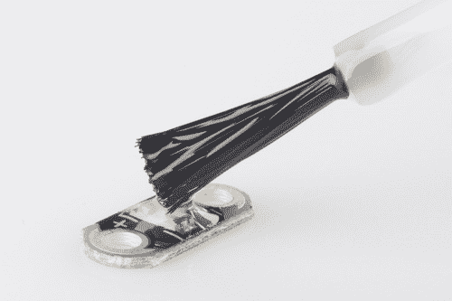

# 自定义 LilyPad LED 颜色

> 原文：<https://learn.sparkfun.com/tutorials/customizing-lilypad-led-colors>

## 感觉受限？

是不是厌倦了千篇一律的老七色？我们听到了。

你的创造力是否超越了当前的 LED 技术？当然是啦！

你准备好抛弃传统，发明你自己的百合口味了吗？我们希望如此！

有时一个项目需要一种非常特殊的光线，如果你想要那种特殊的颜色，但不需要项目的颜色改变或循环，使用 RGB LEDs 意味着为你不需要的功能支付额外的钱！在这里，我将向您展示如何使用标准的 LilyPad LEDs 轻松、经济地打开您的颜色选项。

### 推荐阅读

如果你以前没有接触过可穿戴技术，我们建议你先看看这些教程。

*   [用导电线缝制](https://learn.sparkfun.com/tutorials/sewing-with-conductive-thread)
*   [电子纺织基础知识](https://learn.sparkfun.com/tutorials/e-textile-basics)
*   [lily pad 设计套件入门](https://learn.sparkfun.com/tutorials/introducing-the-lilypad-design-kit)

## 材料

你只需要几样东西就可以开始了。

首先是[硅保形涂层](http://www.amazon.com/MG-Chemicals-Silicone-Conformal-Coating/dp/B004SPJOKK)。我的来自当地的五金店，但我在那里放了一个亚马逊链接，以防你找不到它！

其次是夏普斯。我正在使用 [80 年代的 Glam 系列](http://www.amazon.com/Sharpie-Fine-Tip-Permanent-24-Pack-Assorted/dp/B0003WN0DO/ref=sr_1_2?s=office-products&ie=UTF8&qid=1399998022&sr=1-2)，我从未如此开心过。

显然，你会想要一些[lily pad led](https://www.sparkfun.com/products/10081)。我用白色，因为我想要一个真正可靠的匹配我的夏普颜色，但如果你想尝试着色超过其他基色，有它！我有什么资格阻挡真爱？

## 给你的 led 涂上涂层

### 我们开始吧！

但是首先，让我们花一点时间来看看这个信息丰富的标签。上面写着“危险”。“有毒易燃”，它继续说。骷髅头和交叉骨头的形象非常显眼，尽管没有迹象表明这个产品是为盗版行为设计的。

请小心对待本产品，开始前阅读所有警告标签，不要让孩子参与这部分活动。如果必须的话，试试透明指甲油作为替代。我更喜欢硅涂层，因为干燥后，它是耐热的。因此，如果我以后想焊接 led，我就不用担心它们会变色。这种一致性也正好适合我想要的覆盖范围。但是，无论哪种产品对您的应用来说都是最好和最安全的！

保形涂层内置刷子，便于涂抹。你不希望刷子上的涂层太多，以至于滴得到处都是，弄得乱七八糟，但你确实希望它能很容易地从刷子流到 LED 上。

你应该在 LED 顶部留下一个漂亮的涂层，覆盖 LED 和周围的区域，但不要覆盖侧面的银色标签。这可能需要几次尝试才能做好，但是涂层的表面张力是你的朋友。谨慎为上，因为你总是可以添加更多，但要去掉一些就困难得多了。

这是一个有适当涂层的 LED，旁边是一个没有涂层的 LED，所以你可以看出区别。在继续下一步之前，让这些完全干燥。

## 创造你的色彩

### 有趣的部分！

是时候用风的所有颜色来作画了！

用记号笔在保形涂层上涂色。您希望对整个 LED 周围的广阔区域进行着色，而不仅仅是覆盖 LED 的顶部。你不能在这里得到太多的报道，所以真的去镇上。尝试混合和分层颜色， [ombre 效果](http://www.wisegeek.org/in-fashion-what-does-ombre-mean.htm)，以及不同的色调！色彩保真度惊人地高，所以预计浅色会产生非常微妙的效果，最亮的颜色会产生强烈的效果。

以下是我最喜欢的几个。你可以看到粉彩，像我的薄荷绿和浅蓝色，都很低调。在这里，它们与白色 LED 并排，所以你可以看到差异，但当它们不在一起时，变化几乎不明显。更大胆的颜色，像蓝绿色、紫色、热粉色、酸橙绿色和橙色，给我非常鲜明的效果！

我希望，如果你有一个项目，服装，或设计，只是在等待正确的 LED 颜色来找你，这有助于你最终使它成为现实！在评论中分享你的成果吧！

## 资源和更进一步

要了解更多电子纺织品和可穿戴的乐趣，请查看其他 SparkFun 教程:

*   [领感情披萨](https://learn.sparkfun.com/tutorials/soft-circuits-led-feelings-pizza)
*   [萤火虫罐组装指南](https://learn.sparkfun.com/tutorials/firefly-jar-assembly-guide)
*   [我的醉鬼厨房会说话的围裙](https://learn.sparkfun.com/tutorials/my-drunk-kitchen-apron)
*   [龙与地下城骰子战书](https://learn.sparkfun.com/tutorials/dungeons-and-dragons-dice-gauntlet)
*   [LilyPad MP3 播放器连接指南](https://learn.sparkfun.com/tutorials/getting-started-with-the-lilypad-mp3-player)