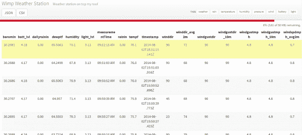

# 无线连接到地下的气象站

> 原文：<https://learn.sparkfun.com/tutorials/weather-station-wirelessly-connected-to-wunderground>

## 懦弱的天气

### Phant 不再运行了

Unfortunately Phant, our data-streaming service, is no longer in service. The system has reached capacity and, like a less-adventurous Cassini, has plunged conclusively into a fiery and permanent retirement. There are several other maker-friendly, data-streaming services and/or IoT platforms available as alternatives. The three we recommend are Blynk, ThingSpeak, and Cayenne. You can read our [blog post on the topic](https://www.sparkfun.com/news/2413) for an overview and helpful links for each platform. The code in this tutorial will need to be adjusted to work with the other data streams.[](https://cdn.sparkfun.com/assets/learn_tutorials/2/1/7/Setup-4.jpg)

Wimp 是一个个人气象站，它使用[天气防护罩](https://www.sparkfun.com/products/12081)和[电动 Imp](https://www.sparkfun.com/products/11395) 将实时气象数据上传到[地下](http://www.wunderground.com/)。你可以在你的房子里增加一个气象仪来帮助提高天气的准确性和预测性！但是，当您可以构建自己的系统时，为什么还要购买现成的系统呢？大约 250 美元，你可以建立一个尖端的开源站，你可以完全控制！你所需要的只是一堆零件和一个无线网络。

<param name="movie" value="https://www.wunderground.com/swf/pws_mini_rf_nc.swf?station=KCOBOULD95&amp;freq=10.0&amp;units=english&amp;lang=EN"><embed src="https://www.wunderground.com/swf/pws_mini_rf_nc.swf?station=KCOBOULD95&amp;freq=10.0&amp;units=english&amp;lang=EN" type="application/x-shockwave-flash" width="290" height="130">[](http://www.wunderground.com/weatherstation/WXDailyHistory.asp?ID=KCOBOULD95)*Live weather in downtown Boulder*

Wunderground 让你建立自己的气象站变得非常容易。你填写一张表格，选择一个用户名和密码，然后得到一个站点 ID。使用这个 ID 和密码，我们可以通过一个简单的 HTTP POST 命令推送天气数据:

```
http://rtupdate.wunderground.com/weatherstation/updateweatherstation.php?ID=KCOBOULD115&PASSWORD=SparkFun&dateutc=now&winddir=270&windspeedmph=7.0humidity=45.4&tempf=43.1&baromin=29.4161&realtime=1&rtfreq=10&action=updateraw 
```

将上面的代码复制粘贴到浏览器中，按回车键。你应该看看`success`。然后你可以在这里查看你刚刚发布的[气象站数据。恭喜你。您刚刚向物联网发布了第一份天气数据。](http://www.wunderground.com/personal-weather-station/dashboard?ID=KCOBOULD115)

上面的链接展示了如何将温度数据推送到网页上，但是你也可以发布大量的[其他天气指标](http://wiki.wunderground.com/index.php/PWS_-_Upload_Protocol)。这个示例将向您展示如何报告以下天气信息:

*   温度
*   湿度
*   亮度级
*   下雨了
*   瞬时风速+风向
*   过去 2 分钟的阵风速度+方向
*   过去 60 分钟的阵风速度+方向

[](https://data.sparkfun.com/streams/dZ4EVmE8yGCRGx5XRX1W)*Weather data on [data.sparkfun.com](https://data.sparkfun.com/streams/dZ4EVmE8yGCRGx5XRX1W)*

你还可以在 data.sparkfun.com[的](https://data.sparkfun.com) [Wimp 气象站频道](https://data.sparkfun.com/streams/dZ4EVmE8yGCRGx5XRX1W)看到更多数据。该通道包括一些额外的位，包括电池电压水平、环境光水平和本地时间戳(包括 DST 校正)。

这个项目建立在相当多的概念之上。如果您不熟悉以下教程，您可能需要阅读它们:

*   [I2C](https://learn.sparkfun.com/tutorials/i2c)
*   [电池技术](https://learn.sparkfun.com/tutorials/battery-technologies)
*   [模数转换](https://learn.sparkfun.com/tutorials/analog-to-digital-conversion)
*   什么是盾牌？ -特别是[焊接屏蔽接头](https://learn.sparkfun.com/tutorials/arduino-shields-v2/installing-headers-preparation)
*   [防风罩挂钩导轨](https://learn.sparkfun.com/tutorials/weather-shield-hookup-guide)
*   [电动 Imp 挂钩导轨](https://learn.sparkfun.com/tutorials/electric-imp-breakout-hookup-guide)
*   [气象计组装指南](https://learn.sparkfun.com/tutorials/weather-meter-hookup-guide)

## 电子学

### 所需材料

**Heads up!** Under real world conditions, the Sunny Buddy may not be able to charge a LiPo battery sufficiently with the [2W](https://www.sparkfun.com/products/13781) solar panel. The Sunny Buddy's output charge current measured was about *7mA* since the 2W solar panel was not able to reach the minimum input voltage requirements. We recommend using a larger solar panel like the [3.5W](https://www.sparkfun.com/products/13782), [6W](https://www.sparkfun.com/products/13783), or [9W](https://www.sparkfun.com/products/13784) solar panels to achieve the Sunny Buddy's minimum voltage input requirements.

要跟随本教程，您将需要以下材料。你可能不需要所有的东西，这取决于你拥有什么。将它添加到您的购物车，通读指南，并根据需要调整购物车。以下是我们用来建造气象站的零件:

*   [用 Arduino 编程的 spark fun red board](https://www.sparkfun.com/products/11575)
*   [电动 Imp](https://www.sparkfun.com/products/11395)
*   [电动 Imp 护罩](https://www.sparkfun.com/products/11401)
*   [天气防护罩](https://www.sparkfun.com/products/12081)
*   [屏蔽接头套件 x 2](https://www.sparkfun.com/products/11417)
*   [11 件外套的 x 2 件](https://www.sparkfun.com/products/132)
*   [气象计](https://www.sparkfun.com/products/8942)
*   [阳光巴迪 MPPT 太阳能充电器](https://www.sparkfun.com/products/12885)
*   [6000mAh LiPo 电池](https://www.sparkfun.com/products/13856)
*   [3.5W](https://www.sparkfun.com/products/13782) 、 [6W](https://www.sparkfun.com/products/13783) 或 [9W](https://www.sparkfun.com/products/13784) 太阳能电池板
*   [塑料外壳](https://www.sparkfun.com/products/11366)(可选)
*   [光导管](https://www.sparkfun.com/products/10695)(可选)

以下是让事情变得简单一点的愿望清单: