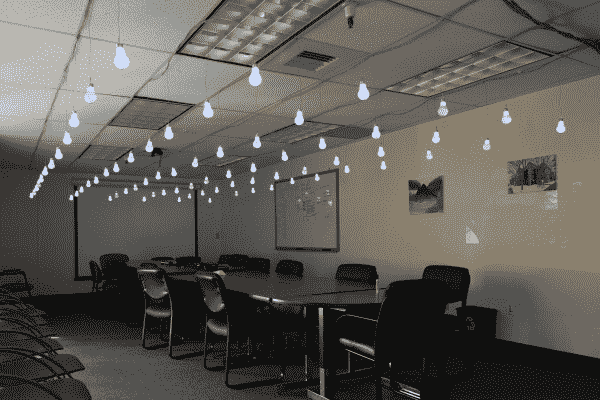
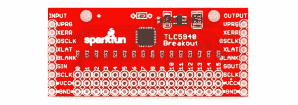
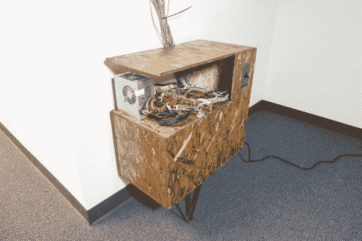
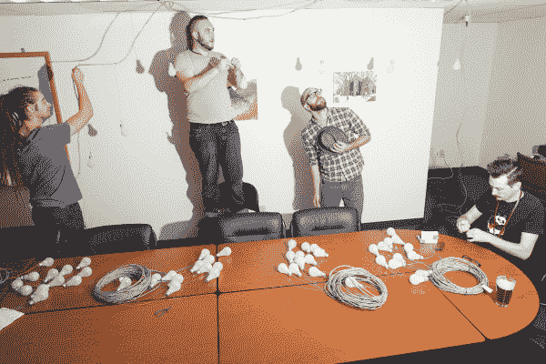
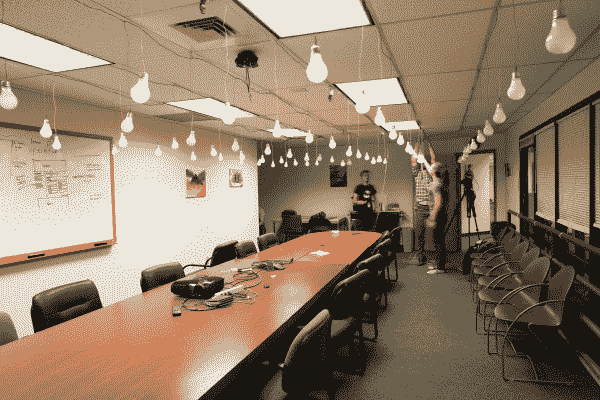
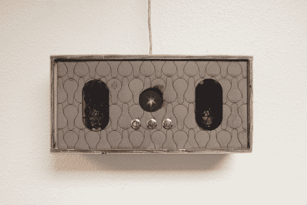
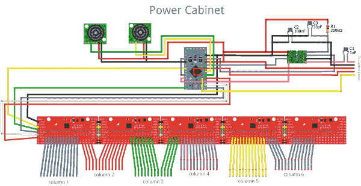
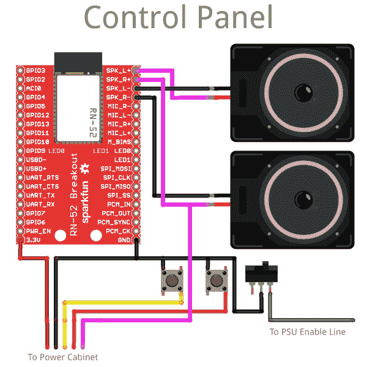

# 交互式悬挂 LED 阵列

> 原文：<https://learn.sparkfun.com/tutorials/interactive-hanging-led-array>

## 装置艺术介绍

这不是你对装置艺术的介绍...但这是我对装置艺术的介绍。开始时，我和我们的摄像师密谋为 SparkFun 做一些令人印象深刻的大事，后来慢慢变成了一个 PWM 控制的 72 声道音乐感应装置，成了我脖子上的负担。但是，最终，回报是完全值得的，我认为，完成整个房间项目的经历是任何一个制造者的基本经历。

让我与你分享我将 SparkFun 的一个会议室改造成 6x12 互动 LED 矩阵的过程、计划和原始材料。这听起来可能不像一个大矩阵，但是当你站在它的中间...挺酷的。

[](https://cdn.sparkfun.com/assets/learn_tutorials/2/0/8/10807860446_fb096434f0_o.jpg)

### 推荐阅读

如果你想在家跟进，在开始这个项目之前，这里有一些你需要熟悉的话题:

*   [发光二极管](https://learn.sparkfun.com/tutorials/light-emitting-diodes-leds)
*   [脉宽调制(PWM)](https://learn.sparkfun.com/tutorials/pulse-width-modulation)
*   [使用焊线](https://learn.sparkfun.com/tutorials/working-with-wire)
*   [Arduino Pro Mini 3.3V 连接指南](https://learn.sparkfun.com/tutorials/using-the-arduino-pro-mini-33v)
*   [逻辑电平转换器连接指南](https://learn.sparkfun.com/tutorials/using-the-logic-level-converter)
*   [RN-52 音频蓝牙连接指南](https://learn.sparkfun.com/tutorials/rn-52-bluetooth-hookup-guide)

## 72 个灯泡

最初的想法是，我们将没有改变的白炽灯泡挂在天花板上，用一组继电器控制它们。一些实验证明这说起来容易做起来难。一系列事情的诀窍在于，让一件事情运转起来所需要的努力被放大到近乎不可能的程度。在这种情况下，无论需要什么来点亮和运行一个灯，都需要重复 72 次来完成 6x12 的网格。

普通灯泡有几个主要问题。首先，它们的效率并不是很高，同时点亮 72 个灯泡的电力需求(即使每个只有 15 或 20 瓦)也令人望而生畏。其次，你没有亮度控制，这限制了该装置可以做的酷事情的数量。最后，穿过天花板的高压线让我们都很紧张。

最终我们选择了 led。它们电压低，功耗相对较低，亮度可以通过 PWM 控制。led 的唯一问题是它们很小，所以挂在天花板上看起来不太有趣，也没有足够的重量垂直悬挂，因为电线容易缠绕。我们尝试用不同的方法将 led 封装在塑料和胶水中，让它们在视觉上更具吸引力，但我们真的希望它们看起来像灯泡。我们最后的决定是挖空 72 个真正的灯泡，用发光二极管取代它们。

[](https://cdn.sparkfun.com/assets/learn_tutorials/2/0/8/Screen_Shot_2014-03-25_at_9.58.28_AM.png)

灯泡一旦组装在一起，就不应该被拆开，所以要装进去有点困难。我得到了一些同事的帮助，我们开始从所有的灯泡中取出陶瓷绝缘体，一次一盒。我没有打破灯泡的外壳(密封部分)，因为我希望完整的玻璃杆有助于扩散 led 光。然后，我开始在每个灯泡的灯杆上涂上热熔胶，并把发光二极管安装到位。

当我穿过灯泡箱时，我用硬币电池测试了每一个灯泡，以确保 led 灯是好的，然后我把它们放回盒子里，放在一边。我的下一个任务是确定如何在尽可能少的麻烦下单独控制 72 个发光二极管...

## 一切都在掌控之中

有很多方法可以控制一堆发光二极管。多路复用是节省 GPIO 的一个好方法，但是即使你多路复用 72 个 led，你仍然需要 9 个管脚来完成。我真的很想为我的控制器使用 Arduino Pro Mini，但是这并没有为传感器和其他有趣的东西留下多少引脚。如果我想做的只是打开或关闭所有的 led，那么几个移位寄存器将是单独控制所有 led 的一种不错的方式。不过，我真的想要不同程度的亮度。

[](https://cdn.sparkfun.com/assets/learn_tutorials/2/0/8/breakout.jpg)

最终，这项工作的最佳工具是 [TLC5940 PWM 驱动器](https://www.sparkfun.com/products/10616)。TLC5940 能够以 12 位分辨率运行 16 个 PWM 通道！那可是 4096 级亮度啊！最重要的是，它们可以菊花链式连接在一起，这样控制 16 个 led 和控制 72 个 led 所需的 IO 引脚数量相同。我只是将我们的 5 个 TLC5940 分线板焊接成一条线，并将每个 LED 连接到它自己的 PWM 通道。

为这个装置做所有计算的是 Arduino Pro Mini。这是我最喜欢的 Arduino 板，因为它体积小巧，并不是说我真的需要节省空间，但我有几个这样的挂在周围。我将直角接头焊接到电路板上，用于 FTDI，最后在外壳中保持连接。

为行动提供动力是另一个挑战。有些东西需要 3V，有些需要 5V，而我需要足够的电力同时点亮 72 个超高亮度的 led。这项工作只有一个工具，那就是老式电脑 PSU。旧电脑的电源为这类项目提供了极好的电压源，因为它们是独立的、可调节的，可以提供相当多的电流。它们还输出你需要的所有普通电压水平:12，5 和 3.3 伏直流电！要让 PSU 在不连接主板的情况下运行，你需要找到启动线并接地。通常是大连接器里的绿线。

所有的电源和控制部件都需要一个地方来安置，所以我用 OSB 做了一个简单的柜子。柜子里的接线盒里有一个电源插座，它连接到前面的电灯开关上。这使我能够将所有的电源线都放在机柜内，只需一个开关就能完成所有工作。为了增加魅力，我在 OSB 上涂了颜色，并用平板材料弯出了一些定制的橱柜腿。

[](https://cdn.sparkfun.com/assets/learn_tutorials/2/0/8/Lightbulb_Project-02-sm.jpg)

一旦控制柜竖立起来，就到了做艰苦工作的时候了:给 72 个发光二极管单独布线，并把它们挂在天花板上...

## 在运行电缆上

因为我想把灯以阵列的形式挂在天花板上，所以每个 LED 需要放在一段单独的电线上，从天花板上的位置连接到控制柜。这是一个问题，原因有几个，尤其是需要大量的电线来进行拉伸。我从选择一根好的多芯电缆开始。我认为，剥去某种带状电缆，从主带状电缆中每隔一段距离放下 LED 线，要比运行 144 根单独的电线，然后将它们捆绑在一起容易得多。在四处寻找可以批量购买的多芯电缆后，我最终选定了联网电缆！

事实证明，1000 英尺。盒 CAT5 网络提升器将电线只是任何事情和你需要的一切。此外，由于网络电缆由双绞线组成，非常适合连接 led。在理想的情况下，我可以拿着那盒电线，开始从天花板上垂下电线，以便正确切割。不幸的是，在现实世界中，这是在一个会议室里安装的，所以我真的不能开店。

因为我在做吊顶，所以我决定在 2 英尺的中心做 LED 矩阵的网格。因为我知道这一点，而且我希望从天花板下降大约 2 英尺，所以我能够计划所有的电缆线路，并在安装它们之前在我的办公室里建造它们。我首先将 led 排列成行和列，然后找出从控制柜到每列末端所需的电缆长度。“引线长度”被添加到每段电缆的开头，然后我每隔 2 英尺做一个标记，表示 24 英尺。我剥去电缆回到第一个 LED 下降点，切断该点的双绞线之一，并将 LED 焊接到它。最后，每个 LED 下降得到一个拉链结，以保持电缆捆绑。每根柱子都变成了它自己的一卷电线和发光二极管，我可以把它们拖到会议室，挂上几个小时...没有帮助是不行的。

[](https://cdn.sparkfun.com/assets/learn_tutorials/2/0/8/10761926304_604da2ee3d_o.jpg)

在安装的那天晚上，我们几个人在会议室里走来走去，还有几个人在为子孙后代录制节目。我们没有去找真正的天花板挂钩，而是从储藏室偷了一盒回形针，把它们弯成了挂钩的形状。它实际上工作得相当好。许多人的手很快就完成了工作，令我惊讶的是，所有的灯泡都排好了队，我有足够的电缆到达控制柜。

[](https://cdn.sparkfun.com/assets/learn_tutorials/2/0/8/10762065775_286aca724f_o.jpg)

做了这个项目之后，我学到了一些制作线束的经验。现在我很乐意与你分享这一切:

*   测量两次，切割一次 -是的，这是一个老掉牙的好东西。没有什么比从错误的导线上切掉 6 英寸来毁坏 40 英寸的线束更糟糕的了。

*   留一些余量 -好的，即使你 100%确定你的尺寸是正确的，也要多留一点长度。我在所有的线路上额外增加了 6 英寸，以考虑到一些愚蠢的事情，比如不小心切断了一根电线，而不是把它剥掉。

*   **橡皮筋、拉链带和钢丝编织器** -线缆管理硬件是必不可少的，虽然我知道简单地在线缆上打结来保持它们在一起。这种方法有一些缺点，包括线缆的整体缩短。你永远不会有太多的铁丝网。

*   **想想电阻** -问问任何一位电力工程师就知道了，即使是铜线，只要拉伸足够长，也会产生很大的电阻。测量线束的电阻，并考虑任何电压降。如果你正在做一个大功率项目，拿出你的欧姆定律计算器，确保你没有通过电线驱动太多的电流。

*   把工作分散开来——找几个朋友，或者，如果你没有很紧的截止日期，你可以自己一个人分批完成。剥去和捆绑电线是那种你很快就会筋疲力尽的事情，而且，如果你试图一口气完成它，你可能会犯一些安装后很难追踪的错误。

*   给所有的东西贴上标签！ -和扎带一样，标签不能太多。创建一个颜色代码，写下来，拍照，用胶带把所有东西包起来，用记号笔贴上标签。只要确保一旦完成，你知道 A 端的哪根线连接到 b 端的哪根线。

这是安装的大部分基础设施。一旦我有了电源和控制柜，灯泡也在空中了，我所需要的就是一些数据来让装置做出反应...

## 交互性

网格中的一大束光是**而不是**一件无聊的事情，但是，如果它不能对其环境做出反应，你基本上只是制造了一个巨大的、超低分辨率的电视显示器。我决定创建一些不同的模式，让安装以不同的方式做出反应。像 Arduino 的 ATmega328 这样的可编程微控制器的好处是，你可以非常快速地编写和测试许多固件，甚至不需要接触你的硬件布局。

我花了几天时间来写新的草图，连接新的传感器来玩想法，并找出最吸引人和最稳定的交互类型。有一次，我用闪烁的灯光引诱人们走到传感器的范围内，然后传感器会提醒他们对灯光的影响，但不是每个人对闪烁灯光的反应都是一样的。我还为显示器写了一大堆简单的动画，只是在房间周围扫一扫光线或者创造萤火虫闪烁的幻觉。

我最喜欢的实验使用超声波测距仪作为输入设备。超声波很好，很稳定，不受周围光线变化的影响，如果放置在适当的位置，它们还具有足够长的范围和足够宽的检测区域，可以作为一般的活动监视器。我决定在会议室的两端安装两个 Maxbotix 测距仪。每一个都会运行到 Arduino 上不同的 ADC，这样我就可以快速独立地读取它们。我只是用一点泡沫胶带把它们粘在墙上；它们太小了，你几乎注意不到它们。

我最喜欢的测距仪的应用是打乒乓球。我制作了一个单人乒乓游戏，可以通过在游戏场地边上来回移动来玩。只有三个桨的位置，但是它们和你站在下面的灯泡非常接近。这个游戏实际上很有趣，节奏很快。

除了测距仪，我还想要一些声音互动。不幸的是，环境声音反应是偶然的。我们的大脑非常善于过滤声音，以至于我们经常意识不到一个房间有多吵，直到我们让计算机来监控它。一个“安静”的房间和一个会议之间的区别可能更多的是在频谱上，而不是实际的响度水平。不过，我真的很想让我们的一个[频谱屏蔽](https://www.sparkfun.com/products/10306)进入这个项目，因为创建一个音乐可视化器对于大显示器来说是如此容易和有益。我决定采用一个干净的音乐源作为输入。起初它是从设备上的耳机插孔直接连接的，但我后来决定添加蓝牙音频。

蓝牙连接来自于 [RN-52 音频蓝牙突破](https://www.sparkfun.com/products/11777)，这使得它非常容易启动和运行。在我们的网站上有一个很棒的[连接指南](https://learn.sparkfun.com/tutorials/rn-52-bluetooth-hookup-guide)，它解释了如何使用 RN-52 作为蓝牙音箱，我差不多就是这么做的。

[](https://cdn.sparkfun.com/assets/learn_tutorials/2/0/8/Lightbulb_Project-01-sm.jpg)

我为装置的蓝牙音频部分做了一个外壳，里面有几个扬声器，几个用户输入按钮和一个蓝牙状态 LED。我把外壳挂在墙上容易看到和操作的地方，并把一根电缆接回控制柜供电。那根电缆还将一个音频信号从一个扬声器传输到一个频谱屏蔽罩，我用一个 T4 逻辑电平转换器将它连接到 T2 3V Pro Mini。

## 现在都在一起

#### 五金器具

什么？你想要更多的技术细节？嗯，我这里有你的技术细节！让我们先从硬件开始，这样当我们看到代码时，您就会知道事情的联系:

[](https://cdn.sparkfun.com/assets/learn_tutorials/2/0/8/pwr_cbnt.png)

上面，你可以看到我们在[部分讨论的硬件，一切尽在掌握](https://learn.sparkfun.com/tutorials/big-hanging-led-array/everythings-under-control)部分。在上面的原理图中，我用一个独立的 [MSGEQ7](https://www.sparkfun.com/products/10468) 和一些无源器件替换了频谱屏蔽，并去掉了逻辑电平转换器。防护罩也能工作，但是你只使用了两个机载 MSGEQ7s 中的一个。这似乎是浪费。

您还可以看到，以菊花链形式连接 [TLC5940 分线板](https://www.sparkfun.com/products/10616)非常简单，并为您提供大量控制。很难判断 Arduino 模拟连接的位置，所以这里有一个列表:

*   [超声波测距仪](https://www.sparkfun.com/products/639)连接到 A0 和 A1
*   [瞬时按钮](https://www.sparkfun.com/products/11966)连接到 A6 和 A7
*   DC 从 MSGEQ7 出来朝 A3 走去

标有“至控制面板”的一组电线采用颜色编码，以匹配下图，因此您可以从一个图纸到另一个图纸进行连接。

[](https://cdn.sparkfun.com/assets/learn_tutorials/2/0/8/ctrl_pnl.png)

这是[互动](https://learn.sparkfun.com/tutorials/big-hanging-led-array/interactivity)部分的控制面板。没有发生太多事情。 [RN-52 音频蓝牙突破](https://www.sparkfun.com/products/11777)做了大部分工作。音频输出是差分的，所以，为了把它馈入 MSGEQ7，我只是抓住一个扬声器的正极，带着它跑。

标有“PSU 启动线”的线路是整个项目的电源开关。它连接着我告诉过你的从 PSU 到地面的绿色电线。

#### 固件

好了，现在我们已经回顾了硬件，让我们深入固件。你准备好了吗？太糟了，我们还是要做！

为了编译代码，您需要 TLC5940 库。让我们一次检查一段代码:

```
language:c
#include "Tlc5940.h"

//LED Matrix Stuff

int pixel[12][6] = { //locations of LED channels in meatspace
  {56,64,44,35,15,11},
  {55,63,43,34,14,73},
  {54,62,42,33,13,9},
  {53,61,41,32,12,8},
  {60,72,40,31,23,7},
  {59,71,38,30,22,6},
  {58,70,37,29,21,5},
  {57,69,39,28,20,4},
  {52,68,48,27,19,3},
  {51,67,47,26,18,2},
  {50,66,46,25,17,1},
  {49,65,45,24,16,0}
};

int pixelstate[12][6] = { //LED PWM values
  {0,0,0,0,0,0},
  {0,0,0,0,0,0},
  {0,0,0,0,0,0},
  {0,0,0,0,0,0},
  {0,0,0,0,0,0},
  {0,0,0,0,0,0},
  {0,0,0,0,0,0},
  {0,0,0,0,0,0},
  {0,0,0,0,0,0},
  {0,0,0,0,0,0},
  {0,0,0,0,0,0},
  {0,0,0,0,0,0},
};

  int x;
  int y;

// Sensor Stuff  
  int lvldoor;
  int lvlwall;

// Pseudo-Radnom Stuff  
  int dice;

// Mode Stuff  
boolean modeflag = 0;

// Pong Stuff  
boolean xdir=0;
boolean ydir=0;
boolean movecycle=1;

// Spectrum Analyzer Stuff  
int Spectrum[7]; 
int spectrumReset=5;
int spectrumStrobe=6;
int spectrumAnalog=3;
int scaleFactor = 15; 
```

这个草图中的前两个数组是操作的核心。第一种方法将 TLC5940 通道号与每个 LED 在网格中的实际位置联系起来。第二个表允许控制器跟踪电网上每个灯泡的亮度水平。这就像一个屏幕缓冲区。我可以通过在 pixelstate 数组上移动东西来制作动画，然后一旦它被更新，我就把`pixelstate[][]`的每个位置 x 写到`pixel[][]`的每个位置 x。

整型变量 x 和 y 用在我需要导航上述数组的任务中。变量`lvldoor`和`lvlwall`用于存储来自两个测距仪的值。这样命名是因为它们包含了从房间的“墙”侧或房间的“门”侧读取的“水平”。顾名思义，变量`dice`用于存储一个随机生成的整数。模式标志 boolean 记录我们的模式(pong 或音乐反应)。上面初始化的其余变量将在后面的章节中使用，所以我将在后面的章节中介绍它们。

```
language:c
void setup()
{      

  Tlc.init();

  pinMode(spectrumReset, OUTPUT);
  pinMode(spectrumStrobe, OUTPUT);

    //Init spectrum analyzer
  digitalWrite(spectrumStrobe,LOW);
    delay(1);
  digitalWrite(spectrumReset,HIGH);
    delay(1);
  digitalWrite(spectrumStrobe,HIGH);
    delay(1);
  digitalWrite(spectrumStrobe,LOW);
    delay(1);
  digitalWrite(spectrumReset,LOW);
    delay(5);

    pinMode(A6, INPUT);
    pinMode(A7, INPUT);
    digitalWrite(A6, HIGH);    
    digitalWrite(A7, HIGH);    

} 
```

这个草图的设置非常简单。我们所做的只是初始化 TLC5940 库、MSGEQ7 频谱分析仪和按钮输入。主循环从两行代码开始，以确定是否该切换模式了:

```
language:c
  if(digitalRead(A6)==LOW){modeflag=0;};
  if(digitalRead(A7)==LOW){modeflag=1;}; 
```

这一行只是寻找一个按钮，如果有的话，切换模式。两种模式中的第一种最简单，那就是音乐反应模式:

```
language:c
if(modeflag==0){
  readSpectrum();

for (int y=0; y<6; y++){ // y sweep to wall
  for(int x=(Spectrum[y]/scaleFactor); x>=0; x--){
  Tlc.set(pixel[x][y], 4000);}};

Tlc.update();
delay(50);
Tlc.clear();} 
```

对 readSpectrum()的过程调用只是用 7 个不同频带中每个频带的更新值填充 Spectrum[]数组。接下来，它使用 for 循环将每个值显示为 6 列灯中每一列的点亮灯泡数。我损失了一个频段，但没什么大不了的。最后，显示被更新。有一段时间来欣赏这一奇观，然后为下一组值扫清障碍。

Pong 稍微复杂一点，我将把代码转储到这里，然后我们来回顾一下:

```
language:c
if(modeflag==1){

    !movecycle;

//reach into meatspace  
  lvldoor = map(analogRead(A0), 40, 200, 2, 0);
  lvldoor = constrain(lvldoor,0,2);

//move the ball
if(movecycle){
  if(xdir==0 && x<10){x++;}
  if(xdir==1 && x>=1){x--;}
  if(xdir==0 && x==10){xdir=1;};
  if(xdir==1 && x==1){xdir=0;};

  if(ydir==0 && y<5){y++;}
  if(ydir==1 && y>=0){y--;}
  if(ydir==0 && y==5){ydir=1;};  
  if(ydir==1 && y==0){ydir=0;};}

//light the ball  
  pixelstate[x][y]=4000;

//check if lose  
  if(x==10 && lvldoor*2!=y && (lvldoor*2)+1!=y){
    loseCondition();
  }

//fade the field (tail on the ball)
  for (int y=0; y<6; y++){
  for(int x=1; x<11; x++){
  if(pixelstate[x][y]>0){
  pixelstate[x][y]=pixelstate[x][y]-1000;}
}
}

//ballfield update    
for (int y=0; y<6; y++){
  for(int x=0; x<12; x++){
  Tlc.set(pixel[x][y], pixelstate[x][y]);}
};

//Paddles Cleanup
for(int i=0; i<6; i++){
 Tlc.set(pixel[0][i], 0);  
 Tlc.set(pixel[11][i], 0);
}

//Paddles update
 Tlc.set(pixel[11][lvldoor*2], 4095);  Tlc.set(pixel[11][(lvldoor*2)+1], 4095);

Tlc.update();

delay(250); 
}

void loseCondition(){

  for (int iterate=0; iterate<50; iterate++){

    for (int channel = 0; channel < NUM_TLCS * 16; channel ++) {
    dice = random(0,50);
    Tlc.set(channel, dice*80);
    Tlc.update();
    }
delay(75);
  }; 
} 
```

pong 游戏中的第一行代码翻转了一个布尔值，因此部分代码每隔一个周期才运行一次。这使得球拍比球移动得更快，给人类球员一个运动的机会。接下来，游戏必须知道玩家相对于超声波传感器站在哪里，所以我们获取一个模拟读数，将其映射到 3 个可能的桨位置，并确保它受到适当的约束。

接下来是只在“移动”周期中运行的代码部分。这是 pong 作为一款游戏的核心。这套规则决定了球运动的方向和时间，以及球反弹时的行为。这段代码执行后，x 和 y 整数变量将包含球的新位置。标记为“照亮球”的下一段代码将该位置设置为几乎全亮度。

当然，如果你不能输，这就不是一个游戏，所以下一段代码检查游戏是否输了。这条规则基本上是这样的，“如果球和桨占据同一行，但不是同一像素，你就输了，”它运行一个名为`loseCondition`的程序，这个程序会显示一点灯光。

在玩这个草图的 alpha 版本时，我意识到很难跟踪球的移动，因为比赛场地的分辨率太低了。为了解决这个问题，我决定不清除帧之间的整个场，而是简单地使它变暗，使球有一个短“尾巴”。这使得它看起来更容易，玩起来也更有趣。负责创建尾部的代码只是迭代整个游戏场，检查每个像素是否关闭，如果没有，它会因某个因素而变暗。如果改变调光值，就改变了尾部的长度。

现在是大扫除的时候了。标记为“ballfield update”的代码将我们刚刚进行的所有帧更改写入 TLC 库的缓冲区。然后，在“Paddles update”为当前测距仪数据点亮正确的像素之前，“Paddles cleanup”代码关闭 paddle 行上的所有像素。

最后，TLC 库更新 led 的像素数据，并插入一个短暂的延迟以使游戏可玩。将来，随着游戏的进行，我可能会减少这个延迟值。

我在上面加入了`loseCondition()`的步骤，这样你就可以看到如何制作一个简单但令人眼花缭乱的灯光秀。这个过程所做的只是在更新显示、暂停和再次更新之前，给表上的每个像素分配一个随机值。这种效果很像旧电视上的静电干扰。它运行在一个 for 循环中，所以在你返回游戏之前，它只会运行几秒钟。

真的是这样！由于 TLC 库处理了真正困难的工作，所以没有太多的代码。现在你说我们坐下来，花点时间享受一下我们的成果怎么样？...

## 沉思的时刻

现在，我们沐浴在阳光中:

替换打开

[//www.youtube.com/embed/caIay1MoPyY](//www.youtube.com/embed/caIay1MoPyY)

替换关闭

## 资源和更进一步

我希望你喜欢这个项目！如果你受到启发，想在家里或场地设置这样的东西，我强烈建议将 TLC5940 作为控制大量 led 的平台。还有其他选择，但成本和灵活性使 TLC5940 成为我的最爱(目前)。

你可以在这里查看这个项目的全部代码。

如果你曾经在镇上，顺便参观一下，玩一场电灯泡乒乓游戏！哦，如果你有兴趣进一步阅读，看看这些相关的教程:

*   [布林肯大礼帽](https://learn.sparkfun.com/tutorials/das-blinken-top-hat)
*   [RGB 面板连接指南](https://learn.sparkfun.com/tutorials/rgb-panel-hookup-guide)
*   [LED 灯条连接](https://learn.sparkfun.com/tutorials/led-light-bar-hookup)
*   [WS2812 分支连接导轨](https://learn.sparkfun.com/tutorials/ws2812-breakout-hookup-guide)