# 电池电量指示器连接指南

> 原文：<https://learn.sparkfun.com/tutorials/uh-oh-battery-level-indicator-hookup-guide>

## 介绍

任何运行电池供电项目的人都知道，当电池耗尽或电量过低而无法防止掉电情况时，会有多么令人沮丧。 [Uh-Oh 电池电量指示器套件](https://www.sparkfun.com/products/11087)中的 [TL431](https://www.sparkfun.com/products/11078) 可以帮助避免这些挫折。

[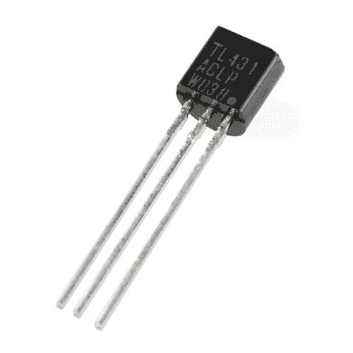](https://www.sparkfun.com/products/retired/11078) 

### [TL431 -电压基准](https://www.sparkfun.com/products/retired/11078)

[Retired](https://learn.sparkfun.com/static/bubbles/ "Retired") COM-11078

TL431 是一款三引脚可编程分流稳压二极管。这款单芯片 ic 基准电压源可用作低温度传感器

**Retired**[Favorited Favorite](# "Add to favorites") 6[Wish List](# "Add to wish list")[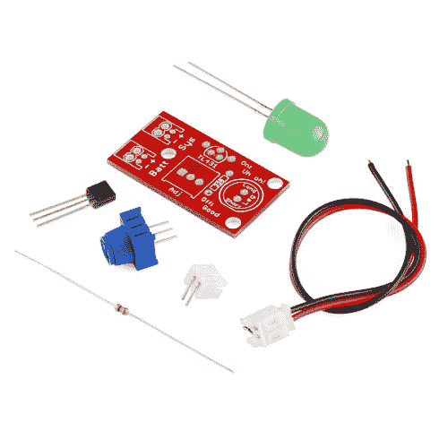](https://www.sparkfun.com/products/retired/11087) 

### [【spark fun】电池电量指示套件](https://www.sparkfun.com/products/retired/11087)

[Retired](https://learn.sparkfun.com/static/bubbles/ "Retired") KIT-11087

数字设备供电不足有时会带来非常糟糕的后果。掉电条件会导致内存出错…

1 **Retired**[Favorited Favorite](# "Add to favorites") 4[Wish List](# "Add to wish list")

本指南将向您展示如何在将所有指示器焊接在一起后使用它们。

### 推荐阅读

这是一个非常基本的工具包，但如果你需要复习使用万用表，焊接或电气特性，请查看下面的教程。

 [### 如何焊接:通孔焊接](https://learn.sparkfun.com/tutorials/how-to-solder-through-hole-soldering) This tutorial covers everything you need to know about through-hole soldering.[Favorited Favorite](# "Add to favorites") 70 [### 电压、电流、电阻和欧姆定律](https://learn.sparkfun.com/tutorials/voltage-current-resistance-and-ohms-law) Learn about Ohm's Law, one of the most fundamental equations in all electrical engineering.[Favorited Favorite](# "Add to favorites") 132 [### 电池技术](https://learn.sparkfun.com/tutorials/battery-technologies) The basics behind the batteries used in portable electronic devices: LiPo, NiMH, coin cells, and alkaline.[Favorited Favorite](# "Add to favorites") 50 [### 分压器](https://learn.sparkfun.com/tutorials/voltage-dividers) Turn a large voltage into a smaller one with voltage dividers. This tutorial covers: what a voltage divider circuit looks like and how it is used in the real world.[Favorited Favorite](# "Add to favorites") 70 [### 电阻](https://learn.sparkfun.com/tutorials/resistors) A tutorial on all things resistors. What is a resistor, how do they behave in parallel/series, decoding the resistor color codes, and resistor applications.[Favorited Favorite](# "Add to favorites") 57 [### 二极管](https://learn.sparkfun.com/tutorials/diodes) A diode primer! Diode properties, types of diodes, and diode applications.[Favorited Favorite](# "Add to favorites") 70 [### 发光二极管](https://learn.sparkfun.com/tutorials/light-emitting-diodes-leds) Learn the basics about LEDs as well as some more advanced topics to help you calculate requirements for projects containing many LEDs.[Favorited Favorite](# "Add to favorites") 67 [### 电力](https://learn.sparkfun.com/tutorials/electric-power) An overview of electric power, the rate of energy transfer. We'll talk definition of power, watts, equations, and power ratings. 1.21 gigawatts of tutorial fun 54 [### 如何使用万用表](https://learn.sparkfun.com/tutorials/how-to-use-a-multimeter) Learn the basics of using a multimeter to measure continuity, voltage, resistance and current.[Favorited Favorite](# "Add to favorites") 67

## 连接示例

一旦你把你的套件焊接在一起，是时候开始监控你的电池电量了。对于这个例子，我们将把指示器连接到一个为 [Arduino Uno](https://www.sparkfun.com/products/11021) 供电的 [3.7V lipo 电池](https://www.sparkfun.com/products/341)。我们还将在电路中包括一个[电池-脂肪充电器/升压器](https://www.sparkfun.com/products/11231)，以确保当电池达到低电压极限时，我们可以为电池充电。

### 连接:

Uno → PowerCell 充电器

*   5V → VCC
*   GND → GND

电池充电器→哦哦指示灯

*   动力电池+ →系统+
*   动力电池- →系统-

哦哦指示灯→电池

*   电池上的 JST 连接器有凹槽，与 Uh-Oh 指示器上的凹槽相对应。

这是一个熔结图，显示了 Uno、PowerCell、Uh-Oh 指示器和电池之间的实际连接。

[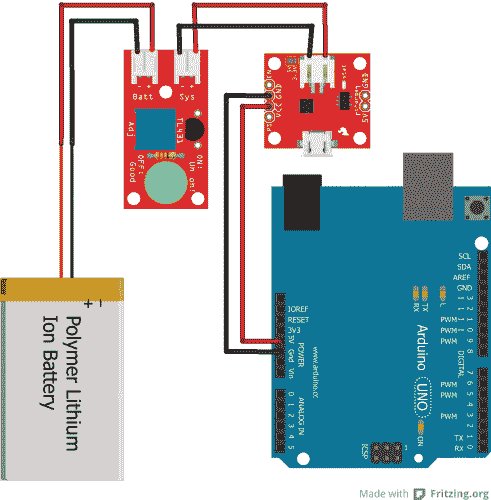](https://cdn.sparkfun.com/assets/d/5/4/6/0/Uh-Oh_batteryHookUp_bb.jpg)[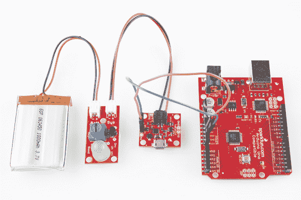](https://cdn.sparkfun.com/assets/learn_tutorials/2/0/4/Uh_Oh_Battery_Indicator_Hookup_Guide-01.jpg)

一旦你把所有的东西都连接上，你就需要把 Uh-Oh 指示板上的 trimpot 调整到你想要被通知的电压。

## 设置阈值

一切就绪后，是时候根据项目需求微调电池指示器了。为此，您需要一个万用表来读取电位计上的[电阻](https://learn.sparkfun.com/tutorials/how-to-use-a-multimeter/measuring-resistance)，从而设置 LED 开启的电压阈值。

首先，如果插上电源，**从指示器**上拔下电池。如果没有电池，我们只能测量 trimpot 的电阻。

板上有两个测试点。他们的背面有标签: **TP1** 和 **GND** 。

[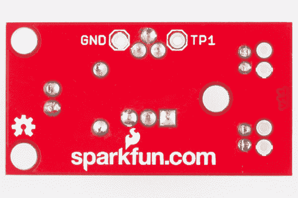](https://cdn.sparkfun.com/assets/learn_tutorials/2/0/4/Uh_Oh_Battery_Indicator_Hookup_Guide-02.jpg)

拿起你的便携式万用表，设置它来读取电阻。将正极探针放在 TP1 点上，负极探针放在 GND 上。

[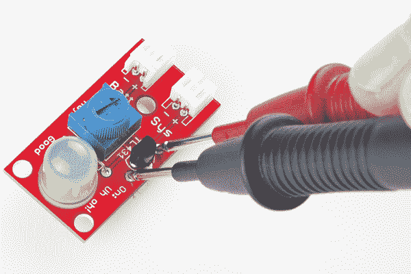](https://cdn.sparkfun.com/assets/learn_tutorials/2/0/4/Uh_Oh_Battery_Indicator_Hookup_Guide-06.jpg)

用一只手握住两个探针，用另一只手转动标有“Adj”的电位计，转动它直到万用表读取到所需的电阻值。使用下表帮助您找到所需的电压阈值，从而找到所需的电阻。要自己计算这些值或查找此表中未列出的值，请访问下一节。

| **电压阈值** | **TP 电阻** |
| 3.0V | 8.3k &ohm; |
| 3.1V | 8.0k &ohm; |
| 3.2V | 7.8k &ohm; |
| 3.3V | 7.5k &ohm; |
| 3.4V | 7.3k &ohm; |
| 3.5V | 7.1k &ohm; |
| 3.6V | 6.9k &ohm; |
| 3.7V | 6.7k &ohm; |

例如，如果您希望 LED 在您的 LiPo 电池达到 3.2V 的电压时打开，那么您需要 trimpot 的电阻约为 7.8k &ohm;。

[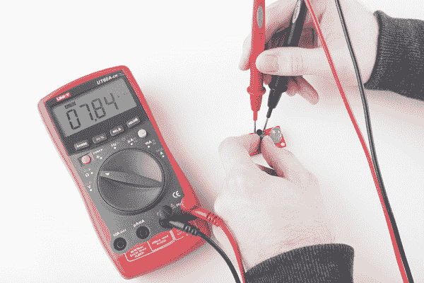](https://cdn.sparkfun.com/assets/learn_tutorials/2/0/4/Uh_Oh_Battery_Indicator_Hookup_Guide-04.jpg)

## 计算阈值

如果您需要上一节表格中没有提供的值，或者如果您想更好地了解 Uh-Oh 电池指示器的工作原理，本节将介绍指示器的工作原理。

为了计算电压阈值，我们必须查阅 Uh-Oh 电池指示器的[原理图](http://cdn.sparkfun.com/datasheets/Kits/UhOh-v11_corrected.pdf)和 TL431 的[数据表](http://cdn.sparkfun.com/datasheets/Kits/TL431-D.pdf)。数据手册中的这些图表特别有用。它们展示了 TL431 内部发生的情况。

**注意，该图中的 R [1] 和 R [2] 用于下面的分压器等式中，而不是原理图中列出的 R [1] 中的*。***

[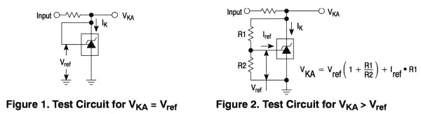](https://cdn.sparkfun.com/assets/learn_tutorials/2/0/4/datasheet.jpg)

电池指示器作为一个简单的分压器工作。所需的第一个信息是 LED 两端的正向压降。为了打开，LED 需要*至少* 2.5V。这将在下面的分压器等式中作为我们的 V [out] :

[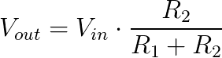](https://cdn.sparkfun.com/assets/learn_tutorials/2/0/4/CodeCogsEqn.gif)
The potentiometer used on this board is 10k&ohm;, so we can say[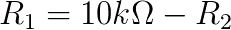](https://cdn.sparkfun.com/assets/learn_tutorials/2/0/4/CodeCogsEqn_2_.gif)
Thus,[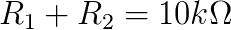](https://cdn.sparkfun.com/assets/learn_tutorials/2/0/4/res.gif)

在我们插入这些值后，我们只剩下这个等式:

[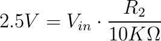](https://cdn.sparkfun.com/assets/learn_tutorials/2/0/4/2.gif)

接下来，我们需要弄清楚中的 V [。这是您希望得到通知的电池电压值。例如，如果您希望 LED 在电池电压达到 3.25V 时打开，您可以将该值代入]中的 V [，然后求解 R [2] 。]

[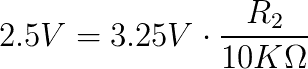](https://cdn.sparkfun.com/assets/learn_tutorials/2/0/4/3.gif)
[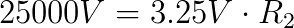](https://cdn.sparkfun.com/assets/learn_tutorials/2/0/4/4.gif)
[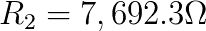](https://cdn.sparkfun.com/assets/learn_tutorials/2/0/4/5.gif)
Using the previous section as a guide, measure and turn the trimpot until your multimeter reads about 7,692&ohm;.

你可以用这个等式来计算任何电池电压阈值！

## 资源和更进一步

既然你已经知道如何使用电池电量指示器，你可以试着破解电路板来使用不同等级的电池。检查分流调节器的额定值或考虑寻找不同的额定值。

### 资源

*   [TL431 数据表](https://cdn.sparkfun.com/datasheets/Kits/TL431-D.pdf)
*   [GitHub 库](https://github.com/sparkfun/Uh-Oh_Battery_Indicator)