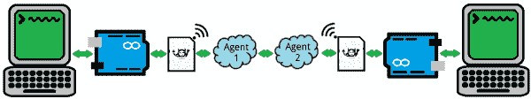

# 通过电动 Imp 实现 Arduino 无线通信

> 原文：<https://learn.sparkfun.com/tutorials/arduino-wireless-communication-via-the-electric-imp>

## 介绍

想象一下，两个 Arduinos 相距半个地球，通过串行端口交谈和共享传感器信息，就好像他们就在彼此旁边一样。当我们把[电动 Imp](https://www.sparkfun.com/products/11395) 插在 [Arduino 护盾](https://www.sparkfun.com/products/11401)上时，这只是我们设想的开始。

本教程的目标是创建一个黑盒“数据管道”,利用互联网连接的 WiFi 网络将信息从一个 Arduino 移动到另一个 Arduino。Arduinos 将简单地通过一条[串行](https://learn.sparkfun.com/tutorials/serial-communication)总线共享数据，不知道数据到达另一端的复杂路径。

*Our "data pipeline." Information goes from one Arduino, through an Imp, up to an agent, through the web to another agent, and back down to Imp and Arduino number 2.*

为什么是小恶魔？有几十种方法可以将你的 Arduino 连接到万维网并共享数据- [WiFi Shields](https://www.sparkfun.com/products/11287) 、 [WiFi XBees](https://www.sparkfun.com/products/12568) 、 [Cellular Shield](https://www.sparkfun.com/products/9607) 仅举几个例子-但电动 Imp 是**最便宜、最简单的**解决方案之一。此外，这也是一个很好的机会来了解和使用这个令人敬畏的小开发平台。

### 你需要什么

我们将集中使用[电动 Imp 盾](https://www.sparkfun.com/products/11401)，但是有多种硬件设置可以工作。这里有一个使用小鬼盾牌和红纸板的愿望清单: