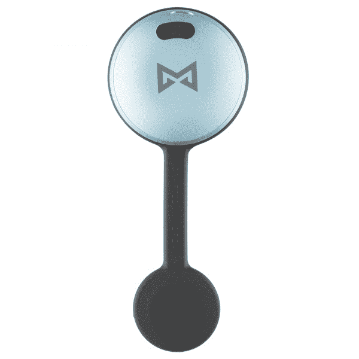
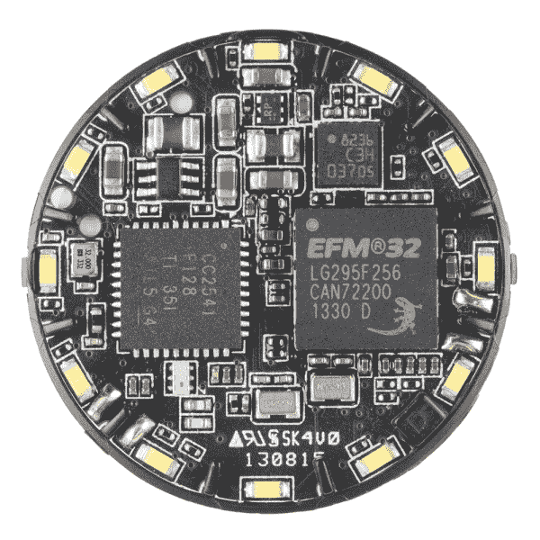

# 拆卸:Misfit Shine 活动跟踪器

> 原文：<https://learn.sparkfun.com/tutorials/teardown-misfit-shine>

## 华丽的

不仅仅是花哨的计步器，一种全新的移动设备正在充斥市场，旨在让我们更加意识到自己的身体活动。在这个充斥着耐克、佳明和 Fitbit 等竞争对手的新兴市场中，[不合时宜的闪亮](http://www.misfitwearables.com/)很容易成为...最漂亮的。它比美国硬币大不了多少，比铅笔粗不了多少，可以戴在身上的任何地方，看起来更像一件珠宝，而不是一个高科技的活动跟踪器。但是你真的能在那么大的东西里安装一个全功能的健身追踪器吗？只有一个办法可以知道...

## 不要打开直到世界末日

走进阳光并没有那么难。像换电池一样突然打开外壳后，任何锋利的东西都会将扣环从 pcb 上弹出，让您可以看到:

*Wow! That's a lot of stuff in such a small package!*

这个亮点实际上有三个部分，棋盘上的其他东西基本上都是为了支持这三个部分。让我们来看看每个部分，以及它如何帮助 Shine 跟踪您的健康状况:

### 行动的智囊

来自 Silicon Labs 的 EFM32 Leopard Gecko 微控制器是保持整个操作完整的控制器。Leopard Gecko 是一款基于 ARM Cortex-M3 内核的 32 位微控制器。它具有节能特性，是这类应用的理想选择。

特别值得注意的是 Leopard Gecko 的低能量传感器接口，它在 Shine 宣传的 4 个月电池寿命中发挥了重要作用。低能耗传感器接口允许 EFM32 的外设独立于内核进行通信(例如收集加速度计数据)，并允许内核处于节能模式。

Leopard Gecko 的 256k 程序存储和 48MHz 处理速度也非常适合这种应用，因为 Shine 不仅需要使用复杂的算法来存储和处理传感器数据，还需要使用(相当大的)蓝牙低能耗软件堆栈来传输处理后的数据。

### 目标感

当然，仅仅在你的袖子上戴一个微处理器不会告诉你很多关于你的健康状况。为了了解你在做什么，Shine 依赖于 STMicro 的 [LIS3DH 加速度计，这是另一个超低功耗部件。这种微小的 LGA-16 封装节省了 PCB 上的空间，但仍能提供高达 5kHz 的加速度数据。](https://cdn.sparkfun.com/assets/learn_tutorials/2/1/3/CD00274221.pdf)

### 沟通是关键

收集和处理传感器数据是一个巧妙的技巧，但是，如果你永远无法获得这些数据，它又有什么用呢？无线传输数据是从设备中获取数据的最佳方式，但通过无线传输数据需要很大的能量。为了解决这个问题，Misfit 正在利用全新的蓝牙低能量(BLE)协议。这种能力背后的设备是德州仪器公司的 CC2541 蓝牙 SoC。凭借其可编程输出功率和低能耗运行，CC2541 也能保持电池健康。

### 现在都在一起

如果我必须猜测那里发生了什么，我会说豹纹壁虎 98%的时间都处于省电模式，只有在启动、同步和检测到双击或三击事件后才会醒来。加速度计数据可能在同步时或者当某个缓冲器被原始数据填满时被处理...也许两者都有？无论哪种方式，我几乎可以肯定，你的手机从来没有收到原始加速度计数据。

在网上评论过 Shine 的人说，它通常不会兑现其 4 个月电池寿命的承诺，但它仍然可以在标准硬币电池上持续很长时间。使用低能耗器件并尽可能长时间保持省电模式与此有很大关系。

## 无法解释的

我试图找到一些破解固件的方法，但我没有找到任何切入点。我探测了我能接触到的每一个测试引脚和封装引线，但我在逻辑分析仪上找不到任何有趣的东西。从硬件黑客的角度来看，控制器是一个 BGA 封装，不太容易接近。最终，我放弃了在设备端解决问题的希望。

因为 Shine 是一个蓝牙低能耗设备，但是，我想它可能有可能从主机端获得一些信息。我为我的智能手机下载了一个[实用程序](https://play.google.com/store/apps/details?id=no.nordicsemi.android.mcp)，它可以读取 BLE 设备的属性并连接到 Shine。不幸的是，我似乎也没有办法从那端获取传感器数据。不过，对于任何感兴趣的人来说，这里是我在*使用 ble 实用程序能够找到的...*

 *连接到设备后，您可以访问 4 种服务，它们基本上是可以读取、写入或操作的属性类别。通用访问、通用属性和设备信息都是 BLE 协议上的标准服务，将为您提供如下内容:

**设备名称(UUID 0x2A00):** 闪亮

**外观(UUID 0x2a 01):**【1088】通用:跑步行走传感器

**固件版本字符串(UUID 0x2A26):** 0.0.50r

没什么意思。你也可以得到你的设备序列号之类的东西。该设备上还有另一项服务，这是一项专有服务，有自己的 UUID，我就不在这里赘述了。它有可写的特性，但是，在不知道我在做什么的情况下，我不愿意尝试向它们写东西。它们甚至可能与设备的主要功能无关。

我想有些事情会一直是个黑匣子。我把这个设备重新组装起来，我要戴上它一段时间，看看它能坚持多久！毕竟就算你黑不出来，Misfit 已经暗示未来会发布一个 API，我们都可以期待。

## 资源和更进一步

如果你喜欢这次拆卸(或者即使你不喜欢，见鬼),那么看看其他 SparkFun 拆卸:

*   [元手表拆卸](https://learn.sparkfun.com/tutorials/metawatch-teardown-and-arduino-hookup)
*   [巢式恒温器拆卸](https://learn.sparkfun.com/tutorials/nest-thermostat-teardown-)
*   [巢穴保护拆除](https://learn.sparkfun.com/tutorials/nest-thermostat-teardown-)

有关蓝牙和加速度计的更多信息，请查看这些教程:

*   [蓝牙基础知识](https://learn.sparkfun.com/tutorials/bluetooth-basics)
*   [了解 BC127 蓝牙模块](https://learn.sparkfun.com/tutorials/understanding-the-bc127-bluetooth-module)
*   [加速度计基础知识](https://learn.sparkfun.com/tutorials/accelerometer-basics)
*   [LSM9DS0 连接指南](https://learn.sparkfun.com/tutorials/lsm9ds0-hookup-guide)

黑客快乐！*