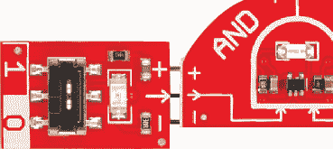

# 逻辑块和数字逻辑简介

> 原文：<https://learn.sparkfun.com/tutorials/logicblocks--digital-logic-introduction>

## 介绍

近距离接触数字电子世界背后的驱动力-数字逻辑！LogicBlocks 工具包是您发现数字逻辑、可视化其工作方式以及探索其创造功能的门票。

 

### [SparkFun LogicBlocks 套件](https://www.sparkfun.com/products/retired/11006)

[Retired](https://learn.sparkfun.com/static/bubbles/ "Retired") KIT-11006

数字逻辑是计算机所能完成的每一项任务的基础，所以为了充分理解如何…

4 **Retired**[Favorited Favorite](# "Add to favorites") 8[Wish List](# "Add to wish list")

本教程是 LogicBlocks 工具包信息手册的延续，该手册包含在工具包中，但我们将在这里重复该手册中的一些信息。如果你已经熟悉了 LogicBlocks 工具包，我建议你跳过第 1-3 部分，直接进入第 4 部分的[实验。](https://learn.sparkfun.com/tutorials/logicblocks--digital-logic-introduction/logicblocks-experiments)

### 本教程涵盖的内容

本教程旨在让您熟悉数字逻辑和逻辑块。它分为以下几个部分:

1.  什么是数字逻辑？
2.  逻辑块基础
3.  深入研究区块

第二个教程，即[逻辑块实验指南](!!!)，紧随本教程，包含了我们用逻辑块炮制的所有实验。

### 推荐阅读

在深入研究逻辑块之前，我们建议先通读这些教程:

*   [模拟与数字](https://learn.sparkfun.com/tutorials/analog-vs-digital) -本教程探讨模拟和数字信号之间的区别。重要的是，因为我们将做很多关于*数字*逻辑的讨论。
*   [数字逻辑](https://learn.sparkfun.com/tutorials/digital-logic)——如果你想更深入地了解数字逻辑理论，可以看看这个教程。
*   二进制是计算机的语言。数字逻辑是我们可以用来添加和存储二进制数的工具。

## 什么是数字逻辑？

！！！

### 什么是数字？

电子信号可分为两类:[模拟和数字](https://learn.sparkfun.com/tutorials/analog-vs-digital)。模拟信号可以采用任何形状，并代表无限数量的可能值。数字信号有一个非常明确的、离散的可能值集——通常只有两个*。*

*

许多电子系统将使用模拟和数字电路的组合，但大多数计算机和其他日常电子设备的核心是分立的数字电路。

### 什么是数字逻辑？

我们人类(大部分)是逻辑生物。当我们做出决定并采取行动时，逻辑在幕后起作用。逻辑是评估一个或多个输入，将它们与任何数量的结果进行权衡，并决定要遵循的路径的过程。就像我们应用逻辑来做出所有的决定一样，计算机使用数字逻辑电路来做出它们的决定。他们使用一套标准的逻辑门来帮助做出决定。

要深入了解数字逻辑，请查看我们的[数字逻辑教程](https://learn.sparkfun.com/tutorials/digital-logic)！

#### 我们在哪里看到数字逻辑？

所有电路都有逻辑。与电源的连接就是 AND 的一个例子。只有当电源和地线都连接时，电路才允许电流通过。

还有哪里？到处都是！当行人按下行走按钮时，城市中的交通灯使用逻辑。该按钮启动一个使用 AND 逻辑门的进程。如果有人按下了步行按钮，并且行人将要步行的地方有红灯，则步行信号将被激活。如果 AND 语句的两个条件都不成立，行走信号将永远不会点亮。

### 输入和输出

数字逻辑电路使用数字输入进行逻辑决策并产生数字输出。每个逻辑电路至少需要一个输入，然后才能产生任何类型的输出。

数字逻辑输入和输出通常是二进制的。换句话说，它们只能是两个可能值中的一个。

有多种方式来表示二进制值:1/0 是最简单也是最常用的方式。然而，你也可以在布尔表达式中看到它们，如真/假或高/低。当这些值以硬件级别表示时，它们可能被赋予实际的电压级别:0V[伏特]表示 0，而更高的电压(通常是 3V 或 5V)被用来表示 1。

| one | Zero |
| 高的 | 低的 |
| 真实的 | 错误的 |
| 5V(伏特) | 0V |

### 逻辑门

为了做出逻辑决定，计算机将使用三个基本逻辑函数的任意组合:与、或、非。

*   AND-AND 函数产生一个真输出，当且仅当其所有输入也为真时。
*   OR -如果其任何(一个或多个)输入也为真，则 OR 将证明为真**。**
*   NOT-NOT 运算符只有一个输入。NOT 运算符**对其输入**求反，这意味着输出将与输入相反。

这些功能都可以用逻辑门来实现。逻辑门是我们用来创建数字逻辑电路的。它们是计算机和其他电子产品的组成部分。它们接受一个或多个**输入**，执行特定的**功能**(与、或、非等)。)，然后基于该函数产生一个**输出**。

逻辑门都有特定的电路符号，就像电阻、电容、电感一样。而且，就像标准的电子元件符号一样，逻辑门可以通过将它们的输入和输出线连接在一起而绘制成原理图。

### 真值表

逻辑门或功能的“逻辑”可以用多种方式表示，包括真值表、文氏图和布尔代数。其中，真值表是最常见的。真值表是所有可能的输入组合及其输出的完整列表。

所有输入都排列在表格的左侧，而输出在右侧。表格的每一行代表一种可能的输入组合。

| 输入 A | 输入 B | 输出 Y |
| Zero | Zero | Zero |
| Zero | one | Zero |
| one | Zero | Zero |
| one | one | **1** |

以上是一个与门的真值表。与门有两个输入和一个输出，因此真值表有两列输入和一列输出。两个输入值意味着有四种可能的输入组合:0/0、0/1、1/0 和 1/1。因此，与门的真值表有四行，每一行对应一个输入组合。AND 的输出为 1 的唯一情况是两个输入都为 1。

## 逻辑块基础

共有六个独立的逻辑模块，可分为三类:逻辑门、输入模块和实用模块。

### 逻辑门块

有三种不同的逻辑门逻辑块:与、或、非-基本逻辑门。它们的形状(尽可能)像它们的等效电路图，并标有它们的门电路名称。

每个门有一个**输出**，一个公头(尖的那个)。母接头代表**输入**；与门和或门有两个输入，而非门只有一个输入。

每个逻辑门逻辑块都有一个 LED，代表其输出状态。发光的 LED 代表产生 1 的逻辑门，而不发光的 LED 意味着该门正在产生 0。

### 输入块

输入模块用于为逻辑模块提供数字输入。它们有一个开关将输入模块的输出设置为 0 或 1。输入模块上的 LED 显示模块发出的值。

输入模块有一个单一的阳性输出接头。这应插入闸门逻辑块的母输入。

### 公用设施块(和电缆)

实用板中的关键是**电源**模块。每个逻辑门都需要电源来运行，而这块板就是用来提供电源的。电源模块有一个单独的母输入接头，应插入最后一个逻辑门的输出。您只需要一个电源模块来为整个数字逻辑电路供电。

还有一个**分离器**逻辑块，它简单地将一个输入分成两个输出。它不对信号执行任何操作，只是让它通过。当您创建更复杂的数字逻辑电路，需要一个输入运行到两个或更多逻辑门时，这将很方便。

反馈电缆也属于这一类。对于更高级的逻辑块电路，该电缆通常与分离器块一起使用。

### 规则

使用 LogicBlocks 时，实际上只有一个规则:当将一个块的输出连接到另一个块的输入时，确保三个引脚都匹配。每个输入和输出都由三个引脚组成:电源引脚(“+”)、接地引脚(“-->”)和信号引脚。

你还需要确保总有**一个(并且只有一个)电源模块**连接到你的逻辑模块电路。

一个逻辑块(或电缆)的所有输入都应连接另一个逻辑块(或电缆)的输出。如果输入悬空(未连接)，门电路不会知道输入是 1 还是 0，因此输出不可靠。

### 响应时间

逻辑门形成输出决策的速度比任何人都快(我们说的是纳秒)。为了让这个过程更加直观，我们放慢了逻辑块的速度，这样你就可以看到它们所经历的过程。如果您有一长串逻辑块，这种延迟可以让您更直观地看到一个块的输出如何影响另一个块的输入。

延迟大约是半秒钟。只要能看清发生了什么就行。

## 深入研究区块

在这一页上，我们将深入探讨 LogicBlocks 工具包中每个组件的具体细节。我们将讨论每个块的用途，检查它们的**真值表**，并看看它们可以插入哪些其他块。

以下是我们将在本页介绍的模块的快速链接:

*   [输入逻辑块](#inputBlock)
*   [与门逻辑块](#andBlock)
*   [或门逻辑块](#orBlock)
*   [非门逻辑块](#notBlock)
*   [电源逻辑块](#powerBlock)
*   [分离器逻辑块&反馈电缆](#splitterBlock)

### 输入逻辑块

输入块使逻辑块世界运转。这些小矩形块有一个公接头，可插入门控块、电源块和分路器的母输入引脚。

每个输入模块都有一个两位开关，您可以用它将模块设置为 1 或 0(真或假，开或关)。

输入模块上的**绿色 LED** 代表其输出的值。点亮的 LED 表示该块被设置为 1。如果 LED 熄灭，则输出值为 0。

### 与门逻辑块

AND 逻辑模块是一个双输入单输出与门。该模块呈“D”形，很像与门电路符号。两个母输入接头位于 AND 模块的两侧。AND 模块的输出位于中上部。

您可以将一个**输入模块**或另一个**门模块**的输出连接到这些输入。公输出头可以插入另一个门的输入或一个**电源模块**。

每个与门模块有一个单独的**蓝色 LED** ，代表门的输出。如果 LED 亮起，则意味着与门在输出端产生 1(真，开)。如果 LED 关闭，则与门的输出为 0。

#### 真值表、电路符号、布尔符号

以下是 AND 模块的真值表:

| 输入 A | 输入 B | 输出 |
| Zero | Zero | Zero |
| Zero | one | Zero |
| one | Zero | Zero |
| one | one | one |

And 门的电路符号，你会很习惯看到:

和的布尔等式符号是居中的点()。例如，上面的门可以用等式来表示: **A B = Y** 。

### OR 门逻辑块

OR 逻辑模块是一个双输入单输出 OR 门。该模块的形状类似于“与或”门电路符号——输出端为凸弧，输入端为凹弧。两个母输入位于 OR 模块的任一侧。OR 模块的输出位于模块的中上部。

您可以将一个**输入模块**或另一个**门模块**的输出连接到两个输入中的任何一个。这个公输出连接器可以插入另一个门的输入，或者一个**电源模块**。

每个 OR 门模块有一个单独的**黄色 LED** ，代表门的输出。如果 LED 亮起，这意味着或门在输出端产生 1(真，开)。如果 LED 关闭，则或门的输出为 0。

#### 或者真值表、电路符号、布尔符号

以下是 2 输入/1 输出 or 门的真值表:

| 输入 A | 输入 B | 输出 |
| Zero | Zero | Zero |
| Zero | one | one |
| one | Zero | one |
| one | one | one |

电路符号的形状很像积木本身:

我们可以用布尔方程来表示数字逻辑。或的布尔等式符号是加号(+)。下面是上面 or 电路的布尔方程: **A + B = Y** 。

### 非门逻辑块

非逻辑模块是一个单输入单输出的非门。该模块是梯形的(这是我们能得到的最接近三角形的非门电路符号)。母输入连接器位于边缘较大的一侧。NOT 模块的输出位于较小的边缘。

您可以将一个**输入模块**或另一个**门模块**的输出连接到该输入。这个公接头可以插入另一个门的输入或者一个**电源模块**。

每个 NOT 块都有一个单独的**红色 LED** ，代表门的输出。如果 LED 亮起，则意味着非门在输出端产生 1(真，开)。如果 LED 关闭，则非门的输出为 0。

#### 非真值表、电路符号、布尔符号

非门通常被称为**反相器**，因为它将接收到的任何信号反相。0 变成 1，1 变成 0。逆变器的真值表如下所示:

| 输入 A | 输出 |
| Zero | one |
| one | Zero |

当编写布尔方程时，NOT 运算通常用一个**条**来表示它反转的任何变量。例如，上述电路的布尔方程简单地说就是:。

### 电源逻辑块

没有某种形式的电源，任何电子电路都不能工作。进入能量块！

电源模块依靠一个 20 毫米硬币电池运行，该电池能提供 3V 左右的电压，应该能持续相当长的时间。逻辑块可以在 2 至 5V 的电压下工作，并且消耗非常少的电流。

电源模块有一个单独的母连接器，它应该连接到**门模块**的输出。任何电路中只能连接一个电源模块。

电源模块是任何逻辑模块电路的最后一部分。它应该连接到最后一个逻辑块门的输出。

### 分离器逻辑块和反馈电缆

分路器模块允许一个模块的输出馈入两个独立模块的输入。

对于更高级的电路，您需要将输入分散到多个门电路，或者增加反馈。这就是分离器块和反馈电缆派上用场的地方。反馈电缆通常会连接到两个分离器模块输出中的一个。

反馈电缆由三根单独的电线组成——红色、黄色和黑色。红色应始终连接到+引脚，黑色连接到引脚，黄色会让信号通过。

## 逻辑块实验

现在，您已经了解了逻辑块和数字逻辑的基础知识，是时候进行实验了！在 [LogicBlocks 实验者指南](https://learn.sparkfun.com/tutorials/logicblocks-experiment-guide)中，我们将使用您已经了解的少量元件构建各种基本逻辑电路。比如这个 2:1 多路复用器:

对于所有逻辑块实验，请前往[逻辑块实验者指南](https://learn.sparkfun.com/tutorials/logicblocks-experiment-guide)！*